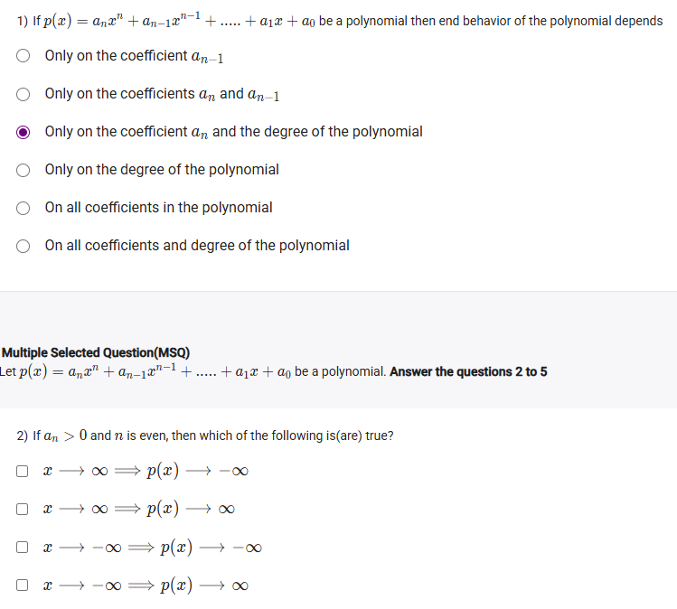
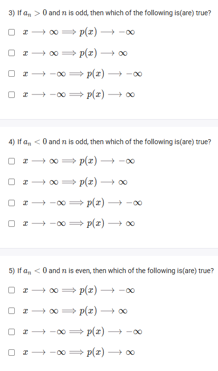
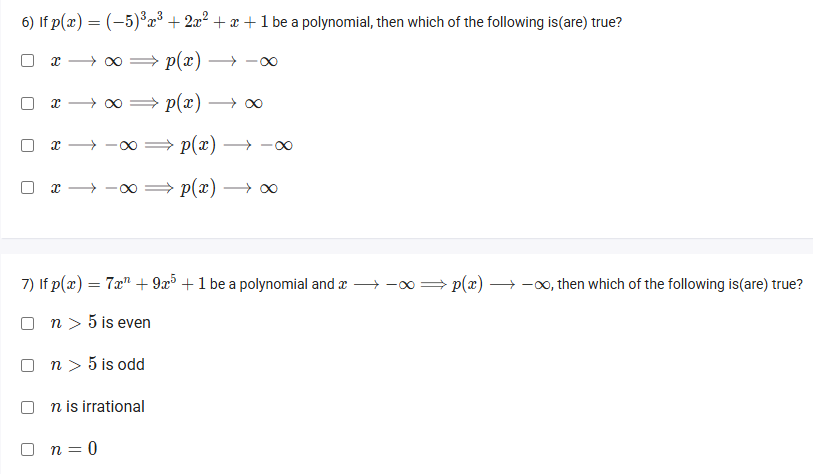

A well-defined collection of distinct objects called elements or members.



https://youtu.be/cggv0rx2yBo

#### Learning Outcomes

 Visualize the end behavior of a polynomial from its algebraic expression depending on the degree and leading coefficient of the polynomial.
 Compare the end behavior of the graph of a polynomial with the end behavior of its algebraic expression.

## Exercise Questions 🤯

Good evening\! Here in India on this Sunday, let's explore these questions about the **end behavior of polynomials**. This is a concept that tells us what the graph of a function does as it goes off to the far left and far right of the chart.

### **Core Concepts: The Leading Coefficient Test**

The end behavior of any polynomial is determined **only** by its **leading term**—the term with the highest power of $x$. We only need to look at two things from this term, $a\_nx^n$:

1.  **The degree of the polynomial ($n$):** Is it **even** or **odd**?
2.  **The sign of the leading coefficient ($a\_n$):** Is it **positive** or **negative**?

These two pieces of information tell us everything. Here's a summary table:

| | **Positive Leading Coefficient ($a\_n \> 0$)** | **Negative Leading Coefficient ($a\_n \< 0$)** |
| :--- | :--- | :--- |
| **Even Degree ($n$ is even)** | Up-Up ($\\nwarrow \\dots \\nearrow$) \<br\> As $x \\to \\infty, p(x) \\to \\infty$ \<br\> As $x \\to -\\infty, p(x) \\to \\infty$ | Down-Down ($\\swarrow \\dots \\searrow$) \<br\> As $x \\to \\infty, p(x) \\to -\\infty$ \<br\> As $x \\to -\\infty, p(x) \\to -\\infty$ |
| **Odd Degree ($n$ is odd)** | Down-Up ($\\swarrow \\dots \\nearrow$) \<br\> As $x \\to \\infty, p(x) \\to \\infty$ \<br\> As $x \\to -\\infty, p(x) \\to -\\infty$ | Up-Down ($\\nwarrow \\dots \\searrow$) \<br\> As $x \\to \\infty, p(x) \\to -\\infty$ \<br\> As $x \\to -\\infty, p(x) \\to \\infty$ |

-----

{{\< border \>}}

### **Question 1: What Determines End Behavior?** (from file `image_d0aa77.png`)

**The Question:**
If $p(x) = a\_nx^n + a\_{n-1}x^{n-1} + ..... + a\_1x + a\_0$ be a polynomial then end behavior of the polynomial depends \_\_\_\_\_\_\_\_\_\_.

**Detailed Solution:**
As explained in the core concepts, the end behavior is completely dominated by the term with the highest power, $a\_nx^n$. All the lower-power terms become insignificant as $x$ approaches $\\infty$ or $-\\infty$. Therefore, the behavior depends entirely on the leading coefficient, $a\_n$, and the degree, $n$.

**Final Answer:** **Only on the coefficient $a\_n$ and the degree of the polynomial**.
{{\< /border \>}}

{{\< border \>}}

### **Question 2: Even Degree, Positive Leading Coefficient** (from file `image_d0aa77.png`)

**The Question:**
If $a\_n \> 0$ and $n$ is even, then which of the following is(are) true?

**Detailed Solution:**
This is the "Up-Up" case, which behaves like a standard parabola, $y=x^2$.

  * **Degree is even:** Both ends of the graph point in the same direction.
  * **Leading coefficient is positive:** That direction is up.
  * Therefore:
      * As $x$ goes to the far right ($x \\to \\infty$), the graph goes up ($p(x) \\to \\infty$).
      * As $x$ goes to the far left ($x \\to -\\infty$), the graph also goes up ($p(x) \\to \\infty$).

**Final Answer:** The correct statements are:

  * **$x \\to \\infty \\implies p(x) \\to \\infty$**
  * **$x \\to -\\infty \\implies p(x) \\to \\infty$**
    {{\< /border \>}}

{{\< border \>}}

### **Question 3: Odd Degree, Positive Leading Coefficient** (from file `image_d0aa1e.png`)

**The Question:**
If $a\_n \> 0$ and $n$ is odd, then which of the following is(are) true?

**Detailed Solution:**
This is the "Down-Up" case, which behaves like a standard cubic function, $y=x^3$.

  * **Degree is odd:** The ends of the graph point in opposite directions.
  * **Leading coefficient is positive:** The graph goes down on the left and up on the right.
  * Therefore:
      * As $x$ goes to the far right ($x \\to \\infty$), the graph goes up ($p(x) \\to \\infty$).
      * As $x$ goes to the far left ($x \\to -\\infty$), the graph goes down ($p(x) \\to -\\infty$).

**Final Answer:** The correct statements are:

  * **$x \\to \\infty \\implies p(x) \\to \\infty$**
  * **$x \\to -\\infty \\implies p(x) \\to -\\infty$**
    {{\< /border \>}}

{{\< border \>}}

### **Question 4: Odd Degree, Negative Leading Coefficient** (from file `image_d0aa1e.png`)

**The Question:**
If $a\_n \< 0$ and $n$ is odd, then which of the following is(are) true?

**Detailed Solution:**
This is the "Up-Down" case, which behaves like $y=-x^3$.

  * **Degree is odd:** The ends of the graph point in opposite directions.
  * **Leading coefficient is negative:** The graph goes up on the left and down on the right.
  * Therefore:
      * As $x$ goes to the far right ($x \\to \\infty$), the graph goes down ($p(x) \\to -\\infty$).
      * As $x$ goes to the far left ($x \\to -\\infty$), the graph goes up ($p(x) \\to \\infty$).

**Final Answer:** The correct statements are:

  * **$x \\to \\infty \\implies p(x) \\to -\\infty$**
  * **$x \\to -\\infty \\implies p(x) \\to \\infty$**
    {{\< /border \>}}

{{\< border \>}}

### **Question 5: Even Degree, Negative Leading Coefficient** (from file `image_d0aa1e.png`)

**The Question:**
If $a\_n \< 0$ and $n$ is even, then which of the following is(are) true?

**Detailed Solution:**
This is the "Down-Down" case, which behaves like an upside-down parabola, $y=-x^2$.

  * **Degree is even:** Both ends of the graph point in the same direction.
  * **Leading coefficient is negative:** That direction is down.
  * Therefore:
      * As $x$ goes to the far right ($x \\to \\infty$), the graph goes down ($p(x) \\to -\\infty$).
      * As $x$ goes to the far left ($x \\to -\\infty$), the graph also goes down ($p(x) \\to -\\infty$).

**Final Answer:** The correct statements are:

  * **$x \\to \\infty \\implies p(x) \\to -\\infty$**
  * **$x \\to -\\infty \\implies p(x) \\to -\\infty$**
    {{\< /border \>}}

{{\< border \>}}

### **Question 6: End Behavior of a Specific Polynomial** (from file `image_d0a9bc.png`)

**The Question:**
If $p(x) = (-5)^3x^3 + 2x^2 + x + 1$ be a polynomial, then which of the following is(are) true?

**Detailed Solution:**

1.  **Find the leading term:** We must first simplify the leading coefficient.
      * The leading term is $(-5)^3x^3 = -125x^3$.
2.  **Identify its properties:**
      * **Degree ($n$):** The degree is 3, which is **odd**.
      * **Leading Coefficient ($a\_n$):** The coefficient is -125, which is **negative**.
3.  **Determine the end behavior:** This is the case of an odd degree and a negative leading coefficient ("Up-Down").
      * As $x$ goes right, the graph goes down: $x \\to \\infty \\implies p(x) \\to -\\infty$.
      * As $x$ goes left, the graph goes up: $x \\to -\\infty \\implies p(x) \\to \\infty$.

**Final Answer:** The correct statements are:

  * **$x \\to \\infty \\implies p(x) \\to -\\infty$**
  * **$x \\to -\\infty \\implies p(x) \\to \\infty$**
    {{\< /border \>}}

{{\< border \>}}

### **Question 7: Reverse Logic** (from file `image_d0a9bc.png`)

**The Question:**
If $p(x) = 7x^n + 9x^5 + 1$ be a polynomial and $x \\to \\infty \\implies p(x) \\to -\\infty$, then which of the following is(are) true?

**Detailed Solution:**
This question contains a logical contradiction, meaning none of the options can be correct based on the premise. Here is the reasoning:

1.  **Analyze the Required End Behavior:** The condition $x \\to \\infty \\implies p(x) \\to -\\infty$ means the graph must go **down** on the far right. According to our rules, this can only happen if the **leading coefficient is negative**.

2.  **Analyze the Given Polynomial:** $p(x) = 7x^n + 9x^5 + 1$.

      * **Case 1: $n \> 5$.** The leading term is $7x^n$. The leading coefficient is **7 (positive)**.
      * **Case 2: $n = 5$.** The leading term is $7x^5 + 9x^5 = 16x^5$. The leading coefficient is **16 (positive)**.
      * **Case 3: $n \< 5$.** The leading term is $9x^5$. The leading coefficient is **9 (positive)**.

3.  **The Contradiction:** In all possible cases, the leading coefficient of this polynomial is positive. A polynomial with a positive leading coefficient must go to $+\\infty$ as $x \\to \\infty$. This directly contradicts the condition given in the question.

**Final Answer:** The premise of the question is flawed, as a polynomial with this structure can never go to $-\\infty$ as $x \\to \\infty$. There is **no correct option** among the choices.
{{\< /border \>}}