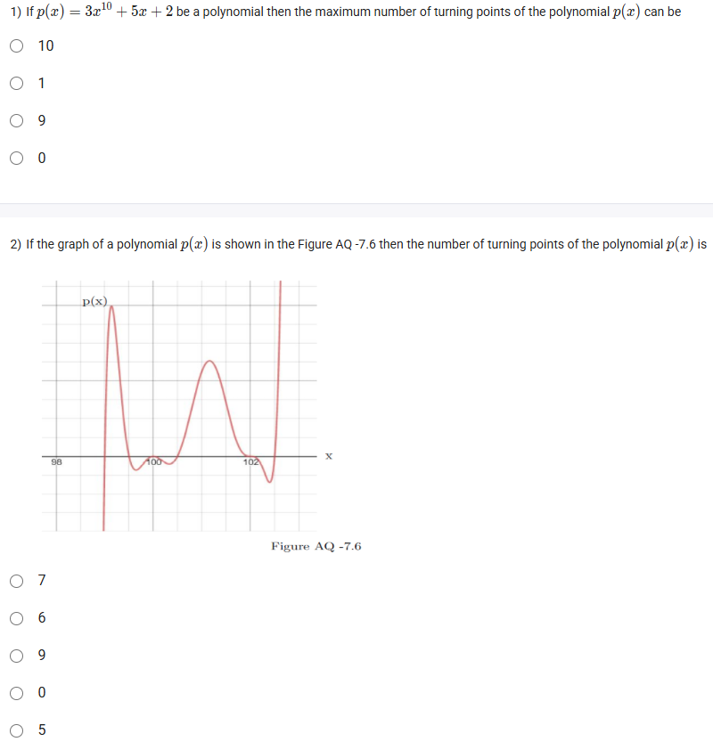
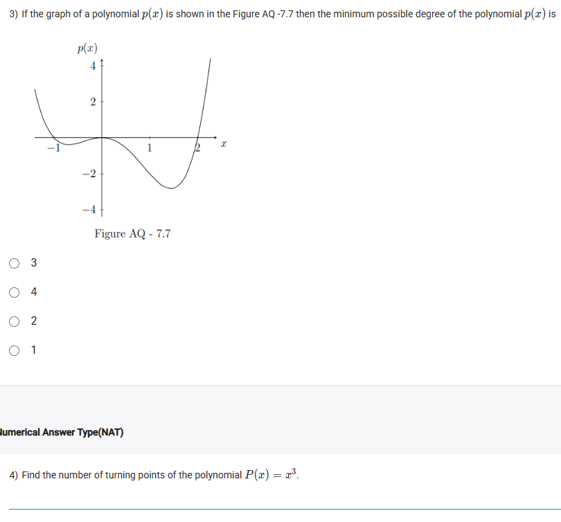

A well-defined collection of distinct objects called elements or members.



https://youtu.be/8a--SspXSXU

#### Learning Outcomes

 Define the turning point.
 Understand the relationship between the degree of a polynomial and the number of the turning points.

## Exercise Questions 🤯

Good evening! Here in India on this Sunday, let's explore these questions about a key feature of polynomial graphs: their **turning points**.

### **Core Concepts: Degree and Turning Points**

"Turning points" are the peaks and valleys on a polynomial's graph. Officially, they are the points where the function's slope changes sign, shifting from increasing to decreasing (a local maximum) or from decreasing to increasing (a local minimum). There is a direct and important relationship between the degree of a polynomial and its turning points.

1.  **Maximum Number of Turning Points:** A polynomial of degree **n** can have **at most n-1** turning points.
    * For example, a cubic (degree 3) can have at most $3-1=2$ turning points.
    * A degree 10 polynomial can have at most $10-1=9$ turning points.

2.  **Minimum Degree from a Graph:** You can determine the *minimum possible degree* of a polynomial by looking at its graph. The degree must be **at least one more than the number of turning points**.
    * If a graph has 5 turning points, its degree must be at least $5+1=6$.
    * You should also check the number of x-intercepts (zeros). The degree must also be greater than or equal to the number of times the graph intersects the x-axis. The minimum degree must satisfy both conditions.

---

### **Question 1: Maximum Turning Points from an Equation** (from file `image_d0a2fa.png`)

**The Question:**
If $p(x) = 3x^{10} + 5x + 2$ be a polynomial then the maximum number of turning points of the polynomial $p(x)$ can be \_\_\_\_\_\_\_\_\_\_.
* 10
* 1
* 9
* 0

**Core Concept:** A polynomial of degree $n$ can have at most $n-1$ turning points.

**Detailed Solution:**

1.  **Identify the degree of the polynomial:**
    * The polynomial is $p(x) = 3x^{10} + 5x + 2$.
    * The highest power of $x$ is 10. Therefore, the degree ($n$) is 10.
2.  **Apply the rule:**
    * The maximum number of turning points is $n-1$.
    * Maximum turning points = $10 - 1 = 9$.

**Final Answer:** The maximum number of turning points is **9**.



### **Question 2: Counting Turning Points from a Graph** (from file `image_d0a2fa.png`)

**The Question:**
If the graph of a polynomial $p(x)$ is shown in the Figure AQ-7.6 then the number of turning points of the polynomial $p(x)$ is \_\_\_\_\_\_\_\_\_\_.

**Core Concept:** A turning point is any local maximum ("peak") or local minimum ("valley") on the graph.

**Detailed Solution:**

Let's count the peaks and valleys on the provided graph:
1.  There is a peak near $x=99$.
2.  There is a valley near $x=99.7$.
3.  There is a peak near $x=100$.
4.  There is a valley near $x=101$.
5.  There is a peak near $x=102$.
6.  There is a valley near $x=102.7$.

In total, there are 3 peaks and 3 valleys. The total number of turning points is $3 + 3 = 6$.

**Final Answer:** The number of turning points is **6**.



### **Question 3: Minimum Degree from a Graph** (from file `image_d0a261.png`)

**The Question:**
If the graph of a polynomial $p(x)$ is shown in the Figure AQ-7.7 then the minimum possible degree of the polynomial $p(x)$ is \_\_\_\_\_\_\_\_\_\_.
* 3
* 4
* 2
* 1

**Core Concept:** The degree of a polynomial must be at least one more than its number of turning points. It must also be at least the number of its real roots. The minimum degree must satisfy the greater of these two conditions.

**Detailed Solution:**

1.  **Count the Turning Points:**
    * The graph has one peak (a local maximum) between $x=0$ and $x=1$.
    * It has two valleys (local minimums), one near $x=-1$ and another near $x=2$.
    * Total number of turning points = 3.
    * Based on this, the degree must be at least $3 + 1 = 4$.

2.  **Count the Zeros (x-intercepts):**
    * The graph crosses the x-axis at four distinct points.
    * Based on this, the degree must be at least 4.

3.  **Conclusion:** Both methods indicate that the degree of the polynomial must be at least 4.

**Final Answer:** The minimum possible degree of the polynomial is **4**.



### **Question 4: Turning Points of $P(x) = x^3$** (from file `image_d0a261.png`)

**The Question:**
Find the number of turning points of the polynomial $P(x) = x^3$.

**Core Concept:** A turning point is only where a function changes from increasing to decreasing, or vice versa.

**Detailed Solution:**

Let's analyze the behavior of the function $P(x) = x^3$.
* For negative values of $x$ (e.g., -2), the function is negative (e.g., -8). As $x$ increases towards 0, the function value also increases (e.g., at $x=-1$, $P(x)=-1$). So, the function is **increasing** for $x < 0$.
* At $x=0$, the graph flattens out momentarily.
* For positive values of $x$ (e.g., 2), the function is positive (e.g., 8). As $x$ increases from 0, the function value continues to increase. So, the function is also **increasing** for $x > 0$.

Since the function is always increasing and never changes direction from increasing to decreasing (or vice versa), it has no peaks or valleys. The flat spot at the origin is a "point of inflection," not a turning point.

**Final Answer:** The number of turning points is **0**.
