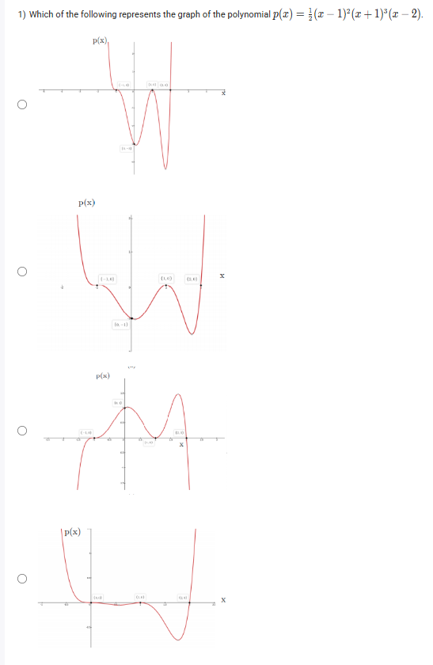
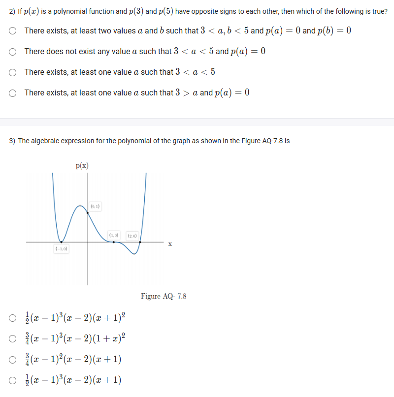
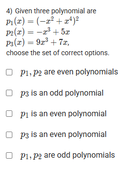
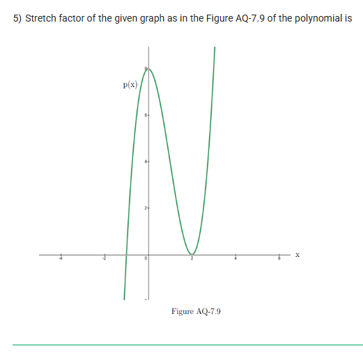

A well-defined collection of distinct objects called elements or members.



https://youtu.be/6IVf5Af1nO0

#### Learning Outcomes

 List out the steps of graphing a polynomial.
 Understand the Intermediate Value theorem.
 Know methods to derive the formula from the given graph of a polynomial.

## Exercise Questions 🤯

Good evening! Here in India on this Sunday, let's work through these advanced problems on polynomials. These questions connect the algebraic form of a polynomial to its graphical behavior, including its zeros, multiplicities, symmetry, and overall shape.

### **Core Concepts: Graphs, Symmetry, and Theorems**

1.  **Factored Form and the Graph:** The factored form of a polynomial, $p(x) = a(x-r_1)^{m_1}(x-r_2)^{m_2}...$, tells us:
    * **Zeros ($r_1, r_2, ...$):** Where the graph hits the x-axis.
    * **Multiplicity ($m_1, m_2, ...$):** How the graph behaves at the zeros. If multiplicity is **odd**, it **crosses** the axis. If it's **even**, it **touches and bounces** off the axis.
    * **Stretch Factor ($a$):** The leading coefficient that vertically stretches or compresses the graph and determines its end behavior.

2.  **Even and Odd Functions (Symmetry):**
    * A polynomial is **even** if all its terms have even-powered variables (e.g., $f(x)=x^4+2x^2$). Its graph is symmetric across the y-axis. Algebraically, $f(-x) = f(x)$.
    * A polynomial is **odd** if all its terms have odd-powered variables (e.g., $f(x)=x^3-5x$). Its graph is symmetric about the origin. Algebraically, $f(-x) = -f(x)$.
    * If a polynomial has a mix of even and odd powers, it is **neither**.

3.  **Intermediate Value Theorem (IVT):** For a continuous function like a polynomial, if $p(a)$ and $p(b)$ have opposite signs (one positive, one negative), the graph must cross the x-axis at least once between $x=a$ and $x=b$.

---

### **Question 1: Matching an Equation to its Graph** (from file `image_d096bd.png`)

**The Question:**
Which of the following represents the graph of the polynomial $p(x) = \frac{1}{2}(x-1)^2(x+1)^3(x-2)$?

**Detailed Solution:**

Let's break down the equation to predict the graph's behavior.

1.  **Find the Zeros:** The zeros are the x-values that make the factors zero.
    * From $(x-1)^2 \implies x = 1$
    * From $(x+1)^3 \implies x = -1$
    * From $(x-2) \implies x = 2$
    The zeros are at **-1, 1, and 2**.

2.  **Determine the Multiplicity at each Zero:**
    * **At x = 1:** The factor is $(x-1)^2$. The multiplicity is 2 (even), so the graph must **touch the x-axis and bounce**.
    * **At x = -1:** The factor is $(x+1)^3$. The multiplicity is 3 (odd), so the graph must **cross the x-axis** (and flatten as it does).
    * **At x = 2:** The factor is $(x-2)^1$. The multiplicity is 1 (odd), so the graph must **cross the x-axis**.

3.  **Determine the End Behavior:**
    * The degree of the polynomial is the sum of the multiplicities: $2 + 3 + 1 = 6$. This is an **even degree**.
    * The leading coefficient is $\frac{1}{2}$, which is **positive**.
    * An even-degree polynomial with a positive leading coefficient has "Up-Up" behavior (it rises on the far left and rises on the far right).

4.  **Match with the Graphs:**
    * We need a graph that crosses at x=-1 and x=2, bounces at x=1, and goes up on both ends.
    * Only the **second graph** from the top satisfies all these conditions.

**Final Answer:** The **second graph** is the correct representation.



### **Question 2: Intermediate Value Theorem** (from file `image_d093f2.png`)

**The Question:**
If $p(x)$ is a polynomial function and $p(3)$ and $p(5)$ have opposite signs to each other, then which of the following is true?

**Core Concept:** This is a direct application of the Intermediate Value Theorem. A polynomial graph is a continuous, unbroken curve.

**Detailed Solution:**

1.  We are given that one of the values, $p(3)$ or $p(5)$, is positive, and the other is negative.
2.  Imagine these two points on a graph. One point is above the x-axis, and the other is below it.
3.  Since a polynomial's graph is continuous, to get from the point above the axis to the point below the axis, the curve **must cross the x-axis** at some point in between.
4.  A point where the graph crosses the x-axis is a root, or a value $a$ where $p(a)=0$.
5.  This crossing point $a$ must be located between $x=3$ and $x=5$.

**Final Answer:** **There exists, at least one value $a$ such that $3 < a < 5$ and $p(a) = 0$**.



### **Question 3: Finding an Equation from a Graph** (from file `image_d093f2.png`)

**The Question:**
The algebraic expression for the polynomial of the graph as shown in the Figure AQ-7.8 is \_\_\_\_\_\_\_\_\_\_.

**Core Concept:** We can reconstruct the factored form of a polynomial by identifying its zeros, their multiplicities, and using another point (like the y-intercept) to find the stretch factor, $a$.

**Detailed Solution:**

The provided graph has some inconsistencies. Let's analyze what the graph shows versus what the options imply.

**Analysis of the Graph's Features:**
1.  **Zeros:** The graph intersects the x-axis at $x=-1$, $x=1$, and $x=2$.
2.  **Multiplicities:**
    * At $x=-1$, the graph **crosses** (odd multiplicity, likely 1). Factor: $(x+1)$.
    * At $x=1$, the graph **touches and bounces** (even multiplicity, likely 2). Factor: $(x-1)^2$.
    * At $x=2$, the graph **crosses** (odd multiplicity, likely 1). Factor: $(x-2)$.
3.  **End Behavior:** The graph goes up on the far left and up on the far right ("Up-Up"). This implies an **even degree** and a **positive** leading coefficient ($a>0$). The sum of our likely multiplicities is $1+2+1=4$, which is an even degree, consistent with the end behavior.
4.  **Find Stretch Factor 'a':** The graph passes through the y-intercept $(0, 1)$. Let's use the factored form we derived: $p(x) = a(x+1)(x-1)^2(x-2)$.
    * $1 = a(0+1)(0-1)^2(0-2)$
    * $1 = a(1)(1)(-2) \implies 1 = -2a \implies a = -1/2$.

**The Contradiction:**
Our analysis of the end behavior shows that the stretch factor '$a$' must be positive. However, using the y-intercept to calculate it gives $a=-1/2$. This means the graph is drawn with mathematically inconsistent features.

Given the options, it seems the intended question might have ignored the y-intercept. However, none of the options perfectly match the multiplicities shown in the graph. The question is flawed.

**Final Answer:** Based on the visual information, the graph is impossible as drawn and does not match any of the provided options correctly.



### **Question 4: Even and Odd Polynomials** (from file `image_d093d6.png`)

**The Question:**
Given three polynomial are $p_1(x) = (-x^2 + x^4)^2$, $p_2(x) = -x^3 + 5x$, $p_3(x) = 9x^3 + 7x$, choose the set of correct options.

**Core Concept:** A polynomial is **even** if all its terms have even exponents. It's **odd** if all its terms have odd exponents. It's **neither** if it has a mix.

**Detailed Solution:**

1.  **Analyze $p_1(x) = (-x^2 + x^4)^2$:**
    * Let's expand this: $(-x^2 + x^4)(-x^2 + x^4) = (-x^2)(-x^2) + 2(-x^2)(x^4) + (x^4)(x^4)$
    * $= x^4 - 2x^6 + x^8$.
    * The powers are 4, 6, and 8. Since all exponents are even, $p_1(x)$ is an **even** polynomial.

2.  **Analyze $p_2(x) = -x^3 + 5x$:**
    * The terms are $-x^3$ and $5x^1$.
    * The powers are 3 and 1. Since all exponents are odd, $p_2(x)$ is an **odd** polynomial.

3.  **Analyze $p_3(x) = 9x^3 + 7x$:**
    * The terms are $9x^3$ and $7x^1$.
    * The powers are 3 and 1. Since all exponents are odd, $p_3(x)$ is an **odd** polynomial.

Now evaluate the statements:
* "$p_1, p_2$ are even polynomials": FALSE ($p_2$ is odd).
* "$p_3$ is an odd polynomial": TRUE.
* "$p_1$ is an even polynomial": TRUE.
* "$p_3$ is an even polynomial": FALSE.
* "$p_1, p_2$ are odd polynomials": FALSE ($p_1$ is even).

**Final Answer:** The correct options are:
* **$p_3$ is an odd polynomial**
* **$p_1$ is an even polynomial**



### **Question 5: Stretch Factor of a Graph** (from file `image_d093b6.png`)

**The Question:**
Stretch factor of the given graph as in the Figure AQ-7.9 of the polynomial is \_\_\_\_\_\_\_\_\_\_.

**Core Concept:** The "stretch factor" is the leading coefficient '$a$' in the factored form of the polynomial, $p(x) = a(x-r_1)(x-r_2)...$.

**Detailed Solution:**

1.  **Identify the Zeros (Roots) from the graph:**
    * The graph crosses the x-axis at three points: $x=-1$, $x=1$, and $x=2$.
2.  **Determine the Multiplicity:**
    * At each of these zeros, the graph crosses the axis directly without bouncing or flattening. This suggests each zero has a multiplicity of 1.
3.  **Write the partial factored form:**
    * $p(x) = a(x - (-1))(x - 1)(x - 2)$
    * $p(x) = a(x+1)(x-1)(x-2)$
4.  **Find a convenient point on the graph to solve for 'a':**
    * The graph clearly passes through the y-intercept at the point $(0, 8)$.
5.  **Substitute the coordinates of this point into the equation:**
    * Let $x=0$ and $p(x)=8$.
    * $8 = a(0+1)(0-1)(0-2)$
    * $8 = a(1)(-1)(-2)$
    * $8 = a(2)$
6.  **Solve for a:**
    * $a = \frac{8}{2} = 4$

**Final Answer:** The stretch factor is **4**.
