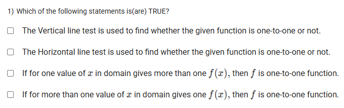
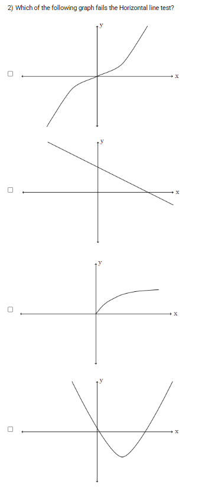
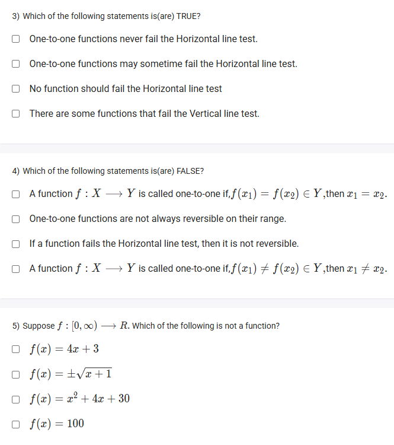

A well-defined collection of distinct objects called elements or members.



https://youtu.be/CiZrP2-cpGM

#### Learning Outcomes:

The student will be able to
(a) Perform vertical line test and horizontal line test to find whether a given relation
is function or not.
(b) Understand reversibility of a function.
(c) Properly define one-to-one function.

## Exercise Questions 🤯

Good evening! Here in India on this Sunday, let's explore these questions about functions. These problems test the fundamental rules that distinguish a simple mathematical relation from a function, and what makes a function a special "one-to-one" type.

### **Core Concepts: Functions and the One-to-One Property**

1.  **What is a Function?**
    A relation is a function if every input ($x$) has **exactly one** output ($y$). An input cannot produce two or more different outputs.
    * **The Vertical Line Test:** This is a graphical test. If you can draw a vertical line anywhere on a graph and it intersects the curve more than once, it is **NOT** a function.

2.  **What is a One-to-One Function?**
    A function is one-to-one if every output ($y$) comes from **exactly one** input ($x$). No two different inputs can produce the same output.
    * **The Horizontal Line Test:** This is a graphical test for a one-to-one function. If you can draw a horizontal line anywhere on a function's graph and it intersects the curve more than once, it is **NOT** one-to-one.
    * **Reversibility:** A function has a valid inverse (is reversible) if and only if it is one-to-one.

---

### **Question 1: The Purpose of the Line Tests** (from file `image_d08bd4.png`)

**The Question:**
Which of the following statements is(are) TRUE?
* The Vertical line test is used to find whether the given function is one-to-one or not.
* The Horizontal line test is used to find whether the given function is one-to-one or not.
* If for one value of $x$ in domain gives more than one $f(x)$, then $f$ is one-to-one function.
* If for more than one value of $x$ in domain gives one $f(x)$, then $f$ is one-to-one function.

**Detailed Solution:**

Let's evaluate each statement based on our core concepts.
* **First statement:** This is **FALSE**. The Vertical Line Test determines if a relation is a function in the first place, not if it's one-to-one.
* **Second statement:** This is **TRUE**. This is the exact purpose of the Horizontal Line Test.
* **Third statement:** This is **FALSE**. If one value of $x$ gives more than one value of $f(x)$, the relation is not a function at all.
* **Fourth statement:** This is **FALSE**. If more than one value of $x$ gives the same $f(x)$ (e.g., $f(2)=4$ and $f(-2)=4$), this is the definition of a function that is **not** one-to-one.

**Final Answer:** The only true statement is **"The Horizontal line test is used to find whether the given function is one-to-one or not."**



### **Question 2: Failing the Horizontal Line Test** (from file `image_d088d1.png`)

**The Question:**
Which of the following graph fails the Horizontal line test?

**Core Concept:** A graph fails the Horizontal Line Test if you can draw at least one horizontal line that crosses the graph in more than one place.

**Detailed Solution:**

* **Graph 1 (Cubic-like function):** A horizontal line can be drawn that intersects the graph in three places. **It fails the test.**
* **Graph 2 (Linear function):** Any horizontal line will cross this graph exactly once. **It passes the test.**
* **Graph 3 (Square root-like function):** Any horizontal line will cross this graph at most once. **It passes the test.**
* **Graph 4 (Parabola):** A horizontal line drawn above the vertex will intersect the graph in two places. **It fails the test.**

**Final Answer:** The **first graph** and the **fourth graph** fail the Horizontal Line Test.



### **Question 3: True Statements about Functions** (from file `image_d08857.png`)

**The Question:**
Which of the following statements is(are) TRUE?
* One-to-one functions never fail the Horizontal line test.
* One-to-one functions may sometime fail the Horizontal line test.
* No function should fail the Horizontal line test
* There are some functions that fail the Vertical line test.

**Detailed Solution:**

* **First statement:** This is **TRUE**. Passing the Horizontal Line Test is the graphical definition of a one-to-one function.
* **Second statement:** This is **FALSE**. If a function fails the HLT, it is by definition not one-to-one.
* **Third statement:** This is **FALSE**. Many valid functions are not one-to-one (e.g., $y=x^2$) and therefore fail the HLT.
* **Fourth statement:** This is **FALSE**. This is a trick statement. If a graph fails the Vertical Line Test, it is **not a function** by definition. Therefore, a "function" cannot fail the Vertical Line Test.

**Final Answer:** The only true statement is **"One-to-one functions never fail the Horizontal line test."**



### **Question 4: False Statements about One-to-One Functions** (from file `image_d08857.png`)

**The Question:**
Which of the following statements is(are) FALSE?

**Core Concept:** The question asks for the false statement. We must check the algebraic definition of a one-to-one function and its link to being reversible (invertible).

**Detailed Solution:**

* **"A function $f: X \to Y$ is called one-to-one if, if $f(x_1) = f(x_2) \in Y$, then $x_1 = x_2$."**
    * This is the formal definition of a one-to-one function. It means that if the outputs are the same, the inputs must have been the same. This statement is **TRUE**.
* **"One-to-one functions are not always reversible on their range."**
    * This is **FALSE**. A function is reversible (meaning its inverse is also a function) *if and only if* it is one-to-one. This is a fundamental property.
* **"If a function fails the Horizontal line test, then it is not reversible."**
    * If a function fails the HLT, it is not one-to-one. If it's not one-to-one, it is not reversible. This statement is **TRUE**.
* **"A function $f: X \to Y$ is called one-to-one if, if $f(x_1) \neq f(x_2) \in Y$, then $x_1 \neq x_2$."**
    * This is the "contrapositive" of the formal definition. It means that if the inputs are different, the outputs must be different. This is an equally valid definition. This statement is **TRUE**.

**Final Answer:** The false statement is **"One-to-one functions are not always reversible on their range."**



### **Question 5: Identifying a Non-Function** (from file `image_d08857.png`)

**The Question:**
Suppose $f:[0, \infty) \to \mathbb{R}$. Which of the following is not a function?

**Core Concept:** A relation is not a function if a single input value $x$ can produce more than one output value $y$.

**Detailed Solution:**

Let's examine each option.
* **$f(x) = 4x+3$**: This is a linear equation. For any input $x$, there is only one possible output $y$. This is a function.
* **$f(x) = \pm\sqrt{x} + 1$**: The `±` symbol is the key. It means "plus or minus". Let's test an input, for example, $x=4$.
    * One output is $y = +\sqrt{4} + 1 = 2 + 1 = 3$.
    * Another output is $y = -\sqrt{4} + 1 = -2 + 1 = -1$.
    * Since the single input $x=4$ produces two different outputs (3 and -1), this is **not a function**.
* **$f(x) = x^2 + 4x + 30$**: This is a quadratic equation. For any input $x$, there is only one possible output $y$. This is a function.
* **$f(x) = 100$**: This is a constant function. For any input $x$, the output is always 100. This is a function.

**Final Answer:** The relation that is not a function is **$f(x) = \pm\sqrt{x} + 1$**.
