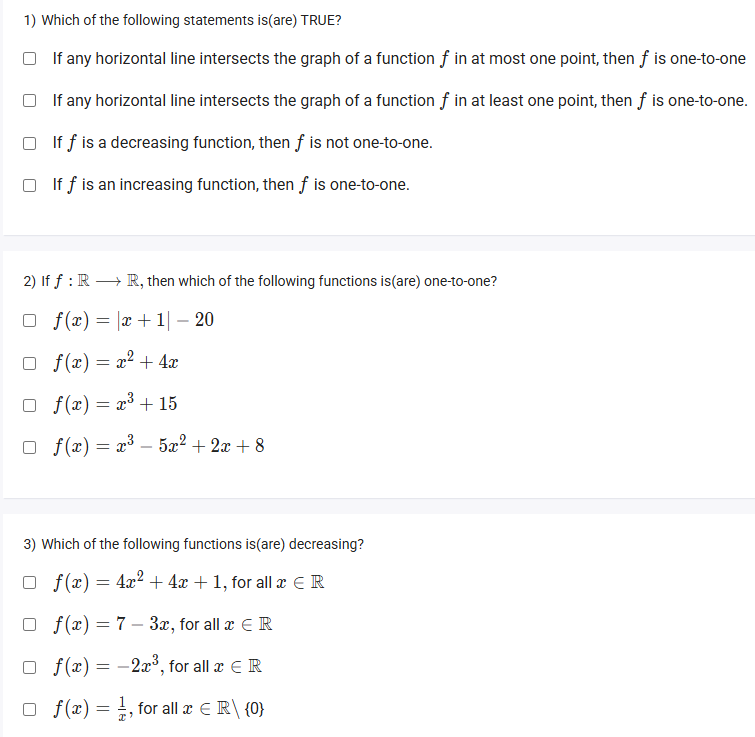
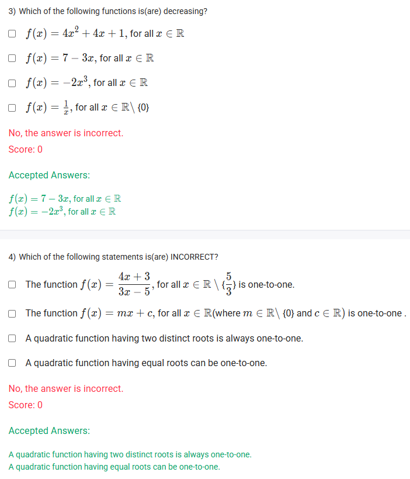

A well-defined collection of distinct objects called elements or members.



https://youtu.be/em8Lw7g776M

#### Learning Outcomes:

The student will be able to
(a) Understand one-to-one functions using examples.
(b) Describe increasing and decreasing functions.
(c) Identify the class of functions that are one-to-one.

## Exercise Questions 🤯

Good evening! Here in India on this Sunday, let's explore these questions about the behavior of functions. We'll be focusing on two key properties: whether a function is **one-to-one** and whether it is **increasing or decreasing**.

### **Core Concepts: Function Behavior**

1.  **One-to-One (Injective) Functions:**
    * **Definition:** A function is one-to-one if every output value ($y$) comes from exactly one unique input value ($x$). No two different inputs can produce the same output.
    * **The Horizontal Line Test:** This is the graphical test. A function is one-to-one if and only if **no horizontal line intersects its graph more than once**.

2.  **Increasing and Decreasing Functions:**
    * **Increasing Function:** A function is (strictly) increasing if its $y$-values always get larger as its $x$-values get larger. As you move from left to right on the graph, you are always going uphill.
    * **Decreasing Function:** A function is (strictly) decreasing if its $y$-values always get smaller as its $x$-values get larger. As you move from left to right on the graph, you are always going downhill.
    * **Important Link:** Any function that is strictly increasing or strictly decreasing over its entire domain is **always one-to-one**.

---

### **Question 1: True Statements about Functions** (from file `image_c693e9.png`)

**The Question:**
Which of the following statements is(are) TRUE?
* If any horizontal line intersects the graph of a function $f$ in at most one point, then $f$ is one-to-one
* If any horizontal line intersects the graph of a function $f$ in at least one point, then $f$ is one-to-one.
* If $f$ is a decreasing function, then $f$ is not one-to-one.
* If $f$ is an increasing function, then $f$ is one-to-one.

**Detailed Solution:**

* **First statement:** This is the precise definition of the Horizontal Line Test. **TRUE**.
* **Second statement:** This is **FALSE**. This statement is not a valid test. For example, a horizontal line intersects the parabola $f(x)=x^2$ (which is not one-to-one) at two points.
* **Third statement:** This is **FALSE**. A function that is always decreasing will never have the same y-value twice, so it will always pass the Horizontal Line Test and therefore *is* one-to-one.
* **Fourth statement:** This is **TRUE**. A function that is always increasing will never have the same y-value twice. It always passes the Horizontal Line Test and is therefore one-to-one.

**Final Answer:** The true statements are:
* **If any horizontal line intersects the graph of a function $f$ in at most one point, then $f$ is one-to-one**
* **If $f$ is an increasing function, then $f$ is one-to-one.**



### **Question 2: Identifying One-to-One Functions** (from file `image_c693e9.png`)

**The Question:**
If $f: \mathbb{R} \to \mathbb{R}$, then which of the following functions is(are) one-to-one?
* $f(x) = |x+1| - 20$
* $f(x) = x^2 + 4x$
* $f(x) = x^3 + 15$
* $f(x) = x^3 - 5x^2 + 2x + 8$

**Detailed Solution:**

We can test each function by considering its graph and the Horizontal Line Test.

* **$f(x) = |x+1| - 20$**: This is an absolute value function, which has a "V" shape. A V-shaped graph will always fail the Horizontal Line Test (a horizontal line can cut through both arms of the V). This is **not one-to-one**.
* **$f(x) = x^2 + 4x$**: This is a quadratic function. Its graph is a parabola, which is a "U" shape. A U-shaped graph will always fail the Horizontal Line Test. This is **not one-to-one**.
* **$f(x) = x^3 + 15$**: The graph of $y=x^3$ is a curve that is always increasing. Adding 15 simply shifts the entire graph up by 15 units. It remains an always-increasing function. Therefore, it will pass the Horizontal Line Test. This function **is one-to-one**.
* **$f(x) = x^3 - 5x^2 + 2x + 8$**: This is a cubic function. Unlike $x^3$, this one has multiple terms that can create "hills and valleys" (local maximums and minimums). A cubic function with turning points will fail the Horizontal Line Test. We can check for turning points by seeing if its derivative, $f'(x) = 3x^2 - 10x + 2$, can equal zero for two different x-values. The discriminant of this derivative is $(-10)^2 - 4(3)(2) = 100 - 24 = 76 > 0$, which means there are two turning points. Therefore, this function **is not one-to-one**.

**Final Answer:** The only one-to-one function listed is **$f(x) = x^3 + 15$**.



### **Question 3: Identifying Decreasing Functions** (from files `image_c693e9.png`, `image_c69371.png`)

**The Question:**
Which of the following functions is(are) decreasing?

**Detailed Solution:**

A function is decreasing if its y-value always gets smaller as the x-value gets larger (the graph always goes downhill from left to right).

* **$f(x) = 4x^2 + 4x + 1$**: This is a parabola that opens upwards. It decreases to the left of its vertex but increases to the right. It is **not** a decreasing function over its entire domain.
* **$f(x) = 7 - 3x$**: This is a straight line with a slope of -3. A line with a negative slope is always going downhill. This **is** a decreasing function.
* **$f(x) = -2x^3$**: The basic function $y=x^3$ is always increasing. The negative sign in front, $-2$, reflects the graph across the x-axis, turning it into a function that is always going downhill. This **is** a decreasing function.
* **$f(x) = \frac{1}{x}$**: This function's graph has two separate branches. While each branch is decreasing on its own interval, the function as a whole is not. For example, let $x_1 = -1$ and $x_2 = 1$. We have $x_1 < x_2$, but $f(x_1) = -1$ and $f(x_2) = 1$, so $f(x_1) < f(x_2)$. This violates the definition of a decreasing function. It is **not** a decreasing function over its entire domain.

**Final Answer:** The decreasing functions are:
* **$f(x) = 7 - 3x$**
* **$f(x) = -2x^3$**



### **Question 4: Identifying Incorrect Statements** (from file `image_c69371.png`)

**The Question:**
Which of the following statements is(are) INCORRECT?

**Detailed Solution:**

We are looking for the statements that are false.

* **"The function $f(x) = \frac{4x+3}{3x-5}$ for all $x \in \mathbb{R} \setminus \{\frac{5}{3}\}$ is one-to-one."**
    * This is a rational function whose graph is a hyperbola. Hyperbolas pass the Horizontal Line Test over their domain. This statement is **TRUE**.

* **"The function $f(x) = mx+c$, for all $x \in \mathbb{R}$ (where $m \in \mathbb{R} \setminus \{0\}$ and $c \in \mathbb{R}$) is one-to-one."**
    * Since $m \neq 0$, this is a non-horizontal straight line. Any slanted line passes the Horizontal Line Test. This statement is **TRUE**.

* **"A quadratic function having two distinct roots is always one-to-one."**
    * A quadratic function's graph is a parabola. If it has two distinct roots, it crosses the x-axis twice. A horizontal line drawn between the vertex and the x-axis will intersect the parabola twice. Therefore, it always fails the Horizontal Line Test. This statement is **FALSE**.

* **"A quadratic function having equal roots can be one-to-one."**
    * "Equal roots" means the parabola's vertex is on the x-axis. It is still a U-shaped parabola. Any horizontal line drawn above (or below) the vertex will still intersect it twice. It always fails the Horizontal Line Test. This statement is **FALSE**.

**Final Answer:** The incorrect statements are:
* **A quadratic function having two distinct roots is always one-to-one.**
* **A quadratic function having equal roots can be one-to-one.**
