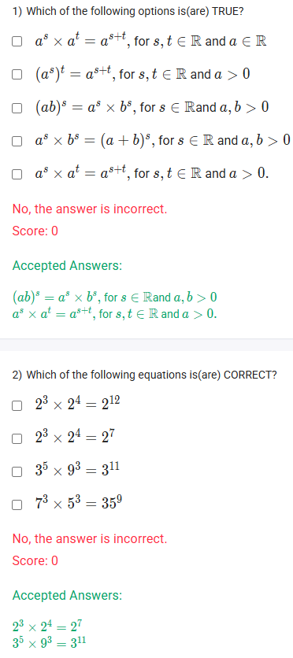
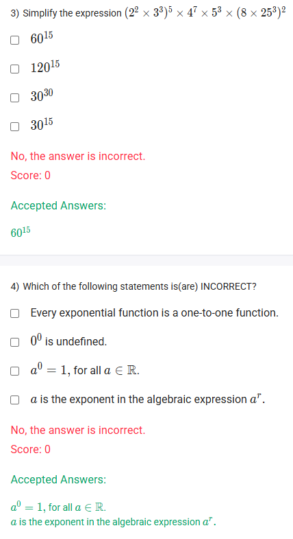
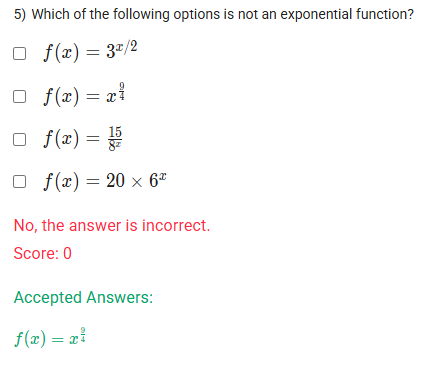

A well-defined collection of distinct objects called elements or members.



https://youtu.be/0l47NHJy-f4

#### Learning Outcomes:

The student will be able to
(a) Know the laws of exponents.
(b) Define exponential function in standard form.
(c) Understand the conditions for base and exponents.

## Exercise Questions 🤯

Good evening! Here in India on this Sunday, let's work through these questions covering the fundamental laws of exponents and the definition of exponential functions.

### **Core Concepts: Laws of Exponents and Exponential Functions**

1.  **What is an Exponential Function?**
    An exponential function is a function of the form $f(x) = a \cdot b^x$, where the **variable $x$ is in the exponent**. The base $b$ is a positive constant not equal to 1. This is different from a **power function** like $f(x) = x^n$, where the variable is in the base.

2.  **Key Laws of Exponents:**
    * **Product Rule:** $a^s \times a^t = a^{s+t}$ (When multiplying same bases, add the exponents).
    * **Power of a Power Rule:** $(a^s)^t = a^{s \times t}$ (To raise a power to a power, multiply the exponents).
    * **Power of a Product Rule:** $(ab)^s = a^s \times b^s$ (The exponent distributes to each factor in a product).
    * **Zero Exponent:** $a^0 = 1$ (for any non-zero number $a$).
    * **Important Note:** There is no rule for adding bases, so $a^s \times b^s \neq (a+b)^s$.

---

### **Question 1: True Statements about Exponent Laws** (from file `image_c68f8a.png`)

**The Question:**
Which of the following options is(are) TRUE? (Multiple Select Question)

**Detailed Solution:**

Let's evaluate each statement using the laws of exponents.
* **`a^s \times a^t = a^{s+t}`**: This is the correct **Product Rule**. The conditions given, for $s, t \in \mathbb{R}$ and $a > 0$, are the standard domain for this rule to apply universally. This statement is **TRUE**.

* **`(a^s)^t = a^{s+t}`**: This is **FALSE**. This incorrectly states the Power of a Power Rule. The exponents should be multiplied, not added. The correct rule is $(a^s)^t = a^{s \times t}$.

* **`(ab)^s = a^s \times b^s`**: This is the correct **Power of a Product Rule**. This statement is **TRUE**.

* **`a^s \times b^s = (a+b)^s`**: This is **FALSE**. This is a common algebraic mistake. You can combine the bases when they are multiplied ($(a \times b)^s$), but not when they are added.

* **`a^s \times a^t = a^{s+t}`**: This is a repeat of the first option and is **TRUE**.

**Final Answer:** The true statements are:
* **$(ab)^s = a^s \times b^s$, for $s \in \mathbb{R}$ and $a,b > 0$**
* **$a^s \times a^t = a^{s+t}$, for $s, t \in \mathbb{R}$ and $a > 0$.**



### **Question 2: Correct Equations** (from file `image_c68f8a.png`)

**The Question:**
Which of the following equations is(are) CORRECT? (Multiple Select Question)

**Detailed Solution:**

Let's apply the laws of exponents to check each equation.

* **`2^3 \times 2^4 = 2^12`**: **FALSE**. According to the Product Rule, when multiplying powers with the same base, we must add the exponents: $2^3 \times 2^4 = 2^{3+4} = 2^7$.

* **`2^3 \times 2^4 = 2^7`**: **TRUE**. This correctly applies the Product Rule.

* **`3^5 \times 9^3 = 3^11`**: **TRUE**. To solve this, we must first express both terms with the same base. Since $9 = 3^2$, we can rewrite the equation:
    * $3^5 \times (3^2)^3$
    * Apply the Power of a Power Rule: $3^5 \times 3^{2 \times 3} = 3^5 \times 3^6$
    * Apply the Product Rule: $3^{5+6} = 3^{11}$.

* **`7^3 \times 5^3 = 35^9`**: **FALSE**. When multiplying powers with the same exponent but different bases, we multiply the bases and keep the exponent: $7^3 \times 5^3 = (7 \times 5)^3 = 35^3$.

**Final Answer:** The correct equations are:
* **$2^3 \times 2^4 = 2^7$**
* **$3^5 \times 9^3 = 3^{11}$**



### **Question 3: Simplifying a Complex Expression** (from file `image_c68f0f.png`)

**The Question:**
Simplify the expression $(2^2 \times 3^3)^5 \times 4^7 \times 5^3 \times (8 \times 25^3)^2$.

**Detailed Solution:**

The strategy is to break down every number into its prime factors (2, 3, 5, etc.) and then use the exponent rules to combine them.

1.  **Break down each part of the expression:**
    * **Part 1:** $(2^2 \times 3^3)^5 = (2^2)^5 \times (3^3)^5 = 2^{10} \times 3^{15}$
    * **Part 2:** $4^7 = (2^2)^7 = 2^{14}$
    * **Part 3:** $5^3$ (already a prime base)
    * **Part 4:** $(8 \times 25^3)^2 = (2^3 \times (5^2)^3)^2 = (2^3 \times 5^6)^2 = (2^3)^2 \times (5^6)^2 = 2^6 \times 5^{12}$

2.  **Combine all the simplified parts:**
    * $(2^{10} \times 3^{15}) \times (2^{14}) \times (5^3) \times (2^6 \times 5^{12})$

3.  **Group the terms by their base:**
    * $(2^{10} \times 2^{14} \times 2^6) \times (3^{15}) \times (5^3 \times 5^{12})$

4.  **Add the exponents for each base (Product Rule):**
    * $2^{10+14+6} \times 3^{15} \times 5^{3+12} = 2^{30} \times 3^{15} \times 5^{15}$

5.  **Look for a common exponent to simplify further:**
    * Notice that the exponent 15 is common. We can rewrite $2^{30}$ as $(2^2)^{15} = 4^{15}$.
    * The expression is now: $4^{15} \times 3^{15} \times 5^{15}$

6.  **Combine the bases that have the same exponent:**
    * $(4 \times 3 \times 5)^{15} = (12 \times 5)^{15} = 60^{15}$

**Final Answer:** The simplified expression is **$60^{15}$**.



### **Question 4: Identifying Incorrect Statements** (from file `image_c68f0f.png`)

**The Question:**
Which of the following statements is(are) INCORRECT? (Multiple Select Question)

**Detailed Solution:**

We are looking for the statements that are false.

* **"Every exponential function is a one-to-one function."**
    * An exponential function, $f(x)=b^x$ (where $b>0, b \neq 1$), is either always increasing (if $b>1$) or always decreasing (if $0<b<1$). In either case, it passes the Horizontal Line Test. This statement is **TRUE**.

* **"$0^0$ is undefined."**
    * In most algebraic and calculus contexts, $0^0$ is considered an "indeterminate form" and is left undefined because its value depends on the context from which it arises. This statement is **TRUE**.

* **"$a^0 = 1$, for all $a \in \mathbb{R}$."**
    * This statement is **FALSE**. The zero exponent rule applies to all non-zero numbers, but it does not apply to $a=0$. As stated above, $0^0$ is undefined.

* **"`a` is the exponent in the algebraic expression $a^r$."**
    * This statement is **FALSE**. In the expression $a^r$, '$a$' is called the **base** and '$r$' is the **exponent** (or power).

**Final Answer:** The incorrect statements are:
* **$a^0 = 1$, for all $a \in \mathbb{R}$.**
* **$a$ is the exponent in the algebraic expression $a^r$.**



### **Question 5: Identifying a Non-Exponential Function** (from file `image_c68c2d.png`)

**The Question:**
Which of the following options is not an exponential function?
* $f(x) = 3^{x/2}$
* $f(x) = x^{9/4}$
* $f(x) = \frac{15}{8^x}$
* $f(x) = 20 \times 6^x$

**Core Concept:** The defining characteristic of an exponential function is that the **variable (like $x$) is in the exponent**. If the variable is the base, it's called a power function.

**Detailed Solution:**

Let's examine each function:

* **$f(x) = 3^{x/2}$**: The variable $x$ is in the exponent. This **is** an exponential function.
* **$f(x) = x^{9/4}$**: The variable $x$ is the base. This is a **power function**, not an exponential function.
* **$f(x) = \frac{15}{8^x}$**: We can rewrite this as $f(x) = 15 \times 8^{-x} = 15 \times (\frac{1}{8})^x$. The variable $x$ is in the exponent. This **is** an exponential function.
* **$f(x) = 20 \times 6^x$**: The variable $x$ is in the exponent. This **is** an exponential function.

**Final Answer:** The function that is not an exponential function is **$f(x) = x^{9/4}$**.
