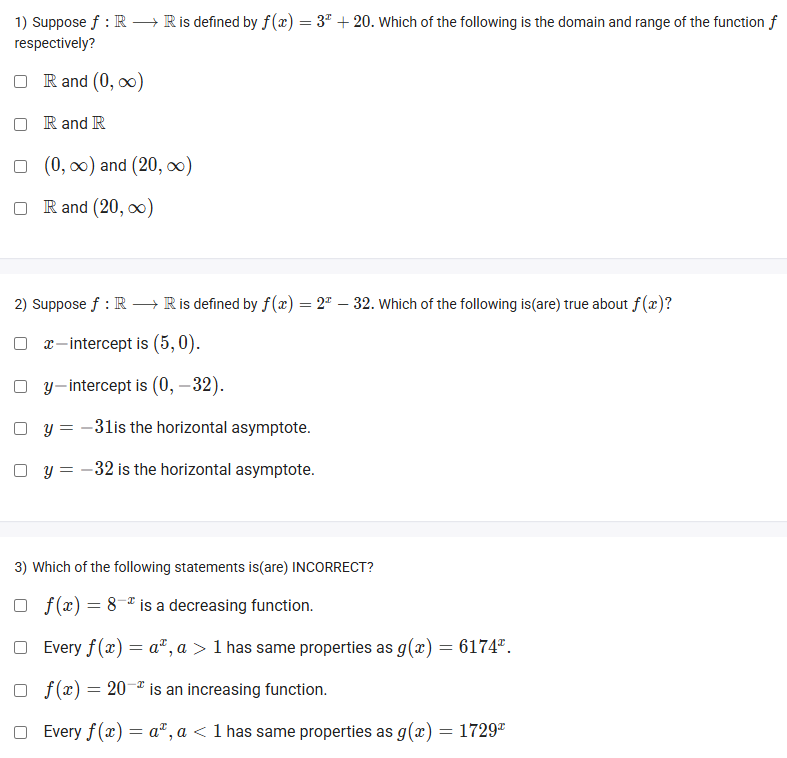
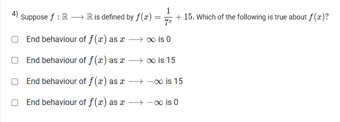
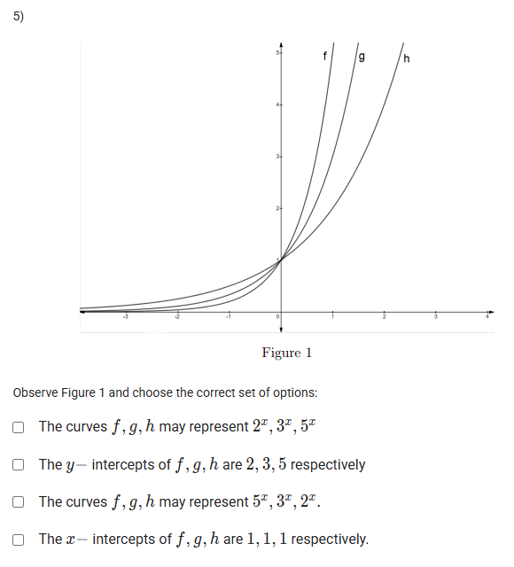

A well-defined collection of distinct objects called elements or members.



https://youtu.be/dMvBjIeJe80

https://youtu.be/dMvBjIeJe80

#### Learning Outcomes:

The student will be able to
(a) Understand the behaviour of exponential functions via graphs.
(b) Find the domain, range, intercepts, asymptotes, increasing or decreasing, end
behaviour of exponential functions.

## Exercise Questions 

Good evening! Here in India on this Sunday, let's explore these questions about exponential functions. We will cover their key characteristics, including domain, range, intercepts, end behavior, and how the "base" of the function affects the shape of its graph.

### **Core Concepts: The Exponential Function ($f(x) = b^x + c$)**

Let's review the properties of a standard exponential function, where $b > 0$ and $b \neq 1$.

1.  **Domain and Range:**
    * **Domain:** The set of all possible inputs ($x$). For any exponential function, this is **all real numbers** ($\mathbb{R}$).
    * **Range:** The set of all possible outputs ($y$). The term $b^x$ is always positive. Therefore, the range of $f(x) = b^x + c$ is always **above** the constant $c$. The range is $(c, \infty)$.

2.  **Horizontal Asymptote:** A line that the graph approaches but never touches. For $f(x) = b^x + c$, the horizontal asymptote is the line **$y=c$**.

3.  **Intercepts:**
    * **y-intercept:** The point where the graph crosses the y-axis (where $x=0$). Found by calculating $f(0) = b^0 + c = 1+c$.
    * **x-intercept:** The point where the graph crosses the x-axis (where $y=0$). Found by solving $b^x + c = 0$. This only has a real solution if $c$ is negative.

4.  **Increasing vs. Decreasing (Behavior):**
    * If the base **$b > 1$**, the function shows exponential growth and is **increasing**.
    * If **$0 < b < 1$**, the function shows exponential decay and is **decreasing**.

---

### **Question 1: Domain and Range** (from file `image_c6882a.png`)

**The Question:**
Suppose $f: \mathbb{R} \to \mathbb{R}$ is defined by $f(x) = 3^x + 20$. Which of the following is the domain and range of the function $f$ respectively?

**Detailed Solution:**

1.  **Domain:** As with all exponential functions of this form, the input $x$ can be any real number. So, the **Domain is $\mathbb{R}$**.

2.  **Range:** The function is $f(x) = 3^x + 20$.
    * The exponential part, $3^x$, is always positive. No matter what value you choose for $x$, $3^x > 0$.
    * Therefore, the entire function, $3^x + 20$, must always be greater than $0 + 20$, or simply greater than 20.
    * The **Range is $(20, \infty)$**.

**Final Answer:** The correct option is **$\mathbb{R}$ and $(20, \infty)$**.



### **Question 2: Properties of an Exponential Function** (from file `image_c6882a.png`)

**The Question:**
Suppose $f: \mathbb{R} \to \mathbb{R}$ is defined by $f(x) = 2^x - 32$. Which of the following is(are) true about $f(x)$?

**Detailed Solution:**

Let's analyze the function $f(x) = 2^x - 32$.

* **x-intercept:** We set $f(x) = 0$ and solve for $x$.
    * $2^x - 32 = 0 \implies 2^x = 32$.
    * We know that $32 = 2^5$.
    * So, $2^x = 2^5$, which means $x=5$.
    * The x-intercept is at the point **(5, 0)**. The first statement is **TRUE**.

* **y-intercept:** We set $x=0$.
    * $f(0) = 2^0 - 32 = 1 - 32 = -31$.
    * The y-intercept is at the point **(0, -31)**. The second statement, which says the intercept is (0, -32), is **FALSE**.

* **Horizontal Asymptote:** The function is in the form $b^x + c$, where $c = -32$.
    * The horizontal asymptote is the line $y=c$.
    * The horizontal asymptote is **$y = -32$**. The third statement is **FALSE**, and the fourth statement is **TRUE**.

**Final Answer:** The true statements are:
* **x-intercept is (5, 0).**
* **$y = -32$ is the horizontal asymptote.**



### **Question 3: Identifying Incorrect Statements** (from file `image_c6882a.png`)

**The Question:**
Which of the following statements is(are) INCORRECT?

**Detailed Solution:**

We are looking for the statements that are false.

* **"$f(x) = 8^{-x}$ is a decreasing function."**
    * We can rewrite this as $f(x) = (8^{-1})^x = (\frac{1}{8})^x$. The base is $b = 1/8$.
    * Since $0 < b < 1$, this is a classic exponential decay function. It is **decreasing**. The statement is **TRUE**.

* **"Every $f(x) = a^x, a > 1$ has same properties as $g(x) = 6174^x$."**
    * The function $g(x) = 6174^x$ has a base greater than 1, so it is an increasing exponential growth function. The statement says any function $f(x)=a^x$ where $a>1$ has the same properties. This is correct; they will all be increasing exponential growth functions. The statement is **TRUE**.

* **"$f(x) = 20^{-x}$ is an increasing function."**
    * We can rewrite this as $f(x) = (\frac{1}{20})^x$. The base is $b = 1/20$.
    * Since $0 < b < 1$, this is a **decreasing** function. The statement claims it is increasing. The statement is **FALSE**.

* **"Every $f(x) = a^x, a < 1$ has same properties as $g(x) = 1729^x$."**
    * The condition $a<1$ (and $a>0$ for exponential functions) means $f(x)$ is a decreasing function. The function $g(x)=1729^x$ has a base greater than 1, so it is an increasing function. A decreasing function does not have the same properties as an increasing one. The statement is **FALSE**.

**Final Answer:** The incorrect statements are:
* **$f(x) = 20^{-x}$ is an increasing function.**
* **Every $f(x) = a^x, a < 1$ has same properties as $g(x) = 1729^x$.**



### **Question 4: End Behavior** (from file `image_c687e8.png`)

**The Question:**
Suppose $f: \mathbb{R} \to \mathbb{R}$ is defined by $f(x) = \frac{1}{7^x} + 15$. Which of the following is true about $f(x)$?

**Core Concept:** End behavior describes what happens to the $y$-value of a function as $x$ approaches positive or negative infinity.

**Detailed Solution:**

1.  **Rewrite the function:**
    * $f(x) = \frac{1}{7^x} + 15 = 7^{-x} + 15 = (\frac{1}{7})^x + 15$.
    * This is an exponential decay function (base is 1/7) shifted vertically up by 15 units.

2.  **Analyze the end behavior as $x \to \infty$ (x becomes very large and positive):**
    * The term $(\frac{1}{7})^x$ will get extremely small, approaching 0. (e.g., $(\frac{1}{7})^{100}$ is a tiny fraction).
    * So, $f(x)$ approaches $0 + 15 = 15$.

3.  **Analyze the end behavior as $x \to -\infty$ (x becomes very large and negative):**
    * Let's take a large negative number, like $x = -100$.
    * The term $(\frac{1}{7})^{-100} = 7^{100}$, which is an enormous positive number.
    * So, as $x \to -\infty$, $f(x)$ approaches $\infty$.

4.  **Evaluate the options:**
    * "End behaviour of $f(x)$ as $x \to \infty$ is 0" -> FALSE.
    * "End behaviour of $f(x)$ as $x \to \infty$ is 15" -> TRUE.
    * "End behaviour of $f(x)$ as $x \to -\infty$ is 15" -> FALSE.
    * "End behaviour of $f(x)$ as $x \to -\infty$ is 0" -> FALSE.

**Final Answer:** **End behaviour of $f(x)$ as $x \to \infty$ is 15**.



### **Question 5: Comparing Exponential Graphs** (from file `image_c63615.png`)

**The Question:**
Observe Figure 1 and choose the correct set of options. The curves are labeled f, g, and h.

**Core Concept: Graphing $y=b^x$ for $b>1$**

* All graphs of the form $y=b^x$ pass through the y-intercept at **(0, 1)**, because $b^0 = 1$.
* For $x>0$ (to the right of the y-axis), a **larger base $b$** results in a **steeper, faster-growing** curve.
* For $x<0$ (to the left of the y-axis), a **larger base $b$** results in a curve that approaches zero **faster** (it is "flatter" or closer to the x-axis).

**Detailed Solution:**

1.  **Analyze the graph's features:**
    * All three curves (f, g, h) pass through the point (0, 1). This means they are all basic exponential functions of the form $y=b^x$.
    * To the right of the y-axis ($x>0$), curve **f** is the steepest, **g** is in the middle, and **h** is the least steep.
2.  **Relate steepness to the base:**
    * The steepest curve must have the largest base. Therefore, `base of f > base of g > base of h`.
3.  **Evaluate the options:**
    * **"The curves f, g, h may represent $2^x, 3^x, 5^x$."**: This would mean f has base 2, g has base 3, h has base 5. This contradicts our finding that the base of f is the largest. **FALSE**.
    * **"The y-intercepts of f, g, h are 2, 3, 5 respectively"**: The graph clearly shows all three have a y-intercept of 1. **FALSE**.
    * **"The curves f, g, h may represent $5^x, 3^x, 2^x$."**: This assigns the largest base (5) to the steepest curve (f), the middle base (3) to the middle curve (g), and the smallest base (2) to the least steep curve (h). This matches our analysis perfectly. **TRUE**.
    * **"The x-intercepts of f, g, h are 1, 1, 1 respectively."**: Exponential functions of the form $y=b^x$ never cross the x-axis. They have no x-intercepts. **FALSE**.

**Final Answer:** The correct statement is **"The curves f, g, h may represent $5^x, 3^x, 2^x$."**
