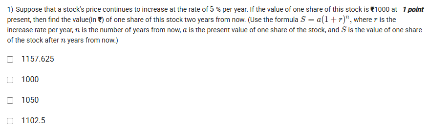
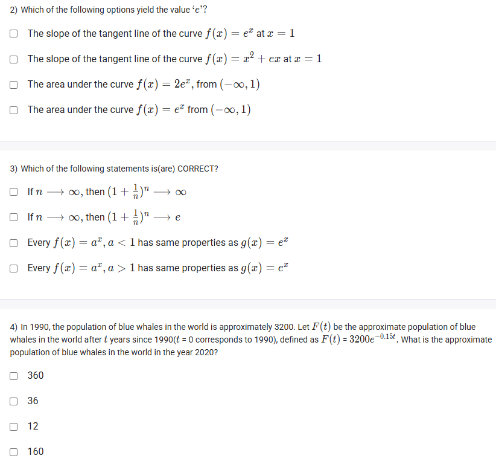
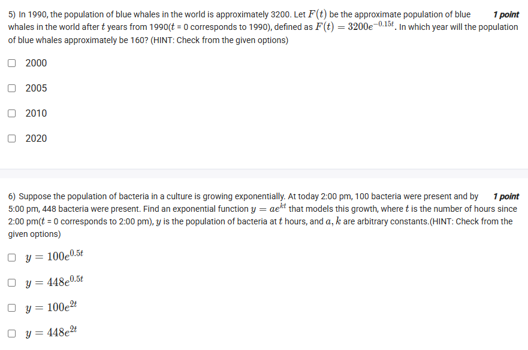

A well-defined collection of distinct objects called elements or members.



https://youtu.be/d_LJM7F33uo

#### Learning Outcomes:

The student will be able to
(a) Understand why is ‘e’ so important?
(b) Know the use of natural exponential function.
(c) Identify the graph of natural exponential function and its properties.

## Exercise Questions 

Good evening! Here in India on this Sunday, let's explore these questions. They are great examples of how exponential functions, especially those using the natural number $e$, model real-world phenomena like finance, population changes, and even concepts in calculus.

### **Core Concepts: The Exponential Function and the Number 'e'**

1.  **Exponential Growth/Decay:** Many real-world processes are modeled by these functions:
    * **Annual Growth (like interest):** $S = a(1 + r)^n$, where '$a$' is the initial amount, '$r$' is the growth rate per period, and '$n$' is the number of periods.
    * **Continuous Growth/Decay (like populations):** $F(t) = ae^{kt}$, where '$a$' is the initial amount, '$t$' is time, and '$k$' is the growth/decay constant. If $k$ is positive, it's growth; if $k$ is negative, it's decay.

2.  **The Natural Number $e$:**
    * $e$ is a special irrational number, approximately equal to **2.71828**.
    * It is defined by the limit: $e = \lim_{n\to\infty} \left(1 + \frac{1}{n}\right)^n$.
    * **In Calculus:** The function $f(x) = e^x$ is its own derivative, meaning the slope of the curve at any point $x$ is also $e^x$.

3.  **The Natural Logarithm ($\ln$):**
    * The natural logarithm is the inverse of the exponential function $e^x$. It is used to solve for a variable in an exponent: if $y = e^x$, then $\ln(y) = x$.

---

### **Question 1: Stock Price Growth** (from file `image_c6353c.png`)

**The Question:**
Suppose that a stock's price continues to increase at the rate of 5 % per year. If the value of one share of this stock is ₹1000 at present, then find the value(in ₹) of one share of this stock two years from now. (Use the formula $S = a(1+r)^n$)

**Detailed Solution:**

1.  **Identify the variables** from the problem and the formula $S = a(1+r)^n$:
    * Initial value (present value), $a = 1000$.
    * Increase rate per year, $r = 5\% = 0.05$.
    * Number of years, $n = 2$.
    * Final value, $S$, is what we need to find.
2.  **Substitute the values into the formula:**
    $$S = 1000(1 + 0.05)^2$$
3.  **Calculate the result:**
    $$S = 1000(1.05)^2$$$$S = 1000(1.1025)$$$$S = 1102.5$$

**Final Answer:** The value of one share two years from now will be **₹1102.5**.



### **Question 2: Which of the following options yield the value 'e'?** (from file `image_c6322d.png`)

**The Question:**
Which of the following options yield the value 'e'? (Multiple Select Question)

**Detailed Solution:**

Let's analyze each option based on the properties of $e$.

* **"The slope of the tangent line of the curve $f(x) = e^x$ at x = 1"**
    * A unique property of the function $f(x)=e^x$ is that its derivative (which gives the slope of the tangent line) is also $e^x$.
    * So, the slope at any point $x$ is $f'(x) = e^x$.
    * At $x=1$, the slope is $f'(1) = e^1 = e$. This statement is **TRUE**.

* **"The slope of the tangent line of the curve $f(x) = x^2 + ex$ at x = 1"**
    * The derivative is $f'(x) = 2x + e$.
    * At $x=1$, the slope is $f'(1) = 2(1) + e = 2+e$. This is not $e$. This statement is **FALSE**.

* **"The area under the curve $f(x) = 2e^x$, from $(-\infty, 1)$"**
    * This requires integration: $\int_{-\infty}^{1} 2e^x \,dx = [2e^x]_{-\infty}^{1} = 2e^1 - \lim_{a \to -\infty} 2e^a = 2e - 0 = 2e$. This is not $e$. This statement is **FALSE**.

* **"The area under the curve $f(x) = e^x$ from $(-\infty, 1)$"**
    * This requires integration: $\int_{-\infty}^{1} e^x \,dx = [e^x]_{-\infty}^{1} = e^1 - \lim_{a \to -\infty} e^a = e - 0 = e$. This statement is **TRUE**.

**Final Answer:**
* **The slope of the tangent line of the curve $f(x) = e^x$ at x = 1**
* **The area under the curve $f(x) = e^x$ from $(-\infty, 1)$**



### **Question 3: Correct Statements about 'e'** (from file `image_c6322d.png`)

**The Question:**
Which of the following statements is(are) CORRECT?

**Detailed Solution:**

* **"If $n \to \infty$, then $(1+\frac{1}{n})^n \to \infty$"**: **FALSE**. This is the famous limit that defines the number $e$. It does not go to infinity.
* **"If $n \to \infty$, then $(1+\frac{1}{n})^n \to e$"**: **TRUE**. This is the formal definition of the natural number $e$.
* **"Every $f(x) = a^x, a < 1$ has same properties as $g(x) = e^x$"**: **FALSE**. The base $e \approx 2.718$, which is greater than 1, so $g(x)=e^x$ is an increasing (growth) function. For $0<a<1$, $f(x)=a^x$ is a decreasing (decay) function. They have opposite properties.
* **"Every $f(x) = a^x, a > 1$ has same properties as $g(x) = e^x$"**: **TRUE**. Since $e > 1$, $g(x)=e^x$ is an exponential growth function. Any function $f(x)=a^x$ where the base $a$ is also greater than 1 will have the same fundamental properties (it will be increasing, have a domain of $\mathbb{R}$, a range of $(0, \infty)$, etc.).

**Final Answer:** The correct statements are:
* **If $n \to \infty$, then $(1+\frac{1}{n})^n \to e$**
* **Every $f(x) = a^x, a > 1$ has same properties as $g(x) = e^x$**



### **Question 4: Blue Whale Population (Future Prediction)** (from file `image_c6322d.png`)

**The Question:**
In 1990, the population of blue whales in the world is approximately 3200. Let $F(t)$ be the approximate population... after $t$ years since 1990, defined as $F(t) = 3200e^{-0.15t}$. What is the approximate population of blue whales in the world in the year 2020?

**Detailed Solution:**

1.  **Find the value of $t$:** The model starts in 1990 ($t=0$). We need to find the population in 2020.
    * $t = 2020 - 1990 = 30$ years.
2.  **Substitute $t=30$ into the function:**
    * $F(30) = 3200e^{-0.15 \times 30}$
    * $F(30) = 3200e^{-4.5}$
3.  **Calculate the value:**
    * Using a calculator, $e^{-4.5} \approx 0.011109$.
    * $F(30) \approx 3200 \times 0.011109 \approx 35.55$.
4.  **Approximate the answer:** The closest whole number is 36.

**Final Answer:** The approximate population is **36**.



### **Question 5: Blue Whale Population (Finding Time)** (from file `image_c63196.png`)

**The Question:**
...using the same function $F(t) = 3200e^{-0.15t}$, in which year will the population of blue whales approximately be 160?

**Detailed Solution:**

1.  **Set the function equal to the target population:**
    * $160 = 3200e^{-0.15t}$
2.  **Isolate the exponential term:**
    * Divide both sides by 3200:
    * $\frac{160}{3200} = e^{-0.15t}$
    * $\frac{1}{20} = e^{-0.15t} \implies 0.05 = e^{-0.15t}$
3.  **Use the natural logarithm ($\ln$) to solve for the exponent:**
    * Take the natural log of both sides: $\ln(0.05) = \ln(e^{-0.15t})$
    * Using the property $\ln(e^x) = x$, we get: $\ln(0.05) = -0.15t$
4.  **Calculate and solve for $t$:**
    * Using a calculator, $\ln(0.05) \approx -2.9957$.
    * $-2.9957 = -0.15t$
    * $t = \frac{-2.9957}{-0.15} \approx 19.97$ years.
5.  **Find the year:**
    * We can round $t$ to approximately 20 years.
    * The year is $1990 + t = 1990 + 20 = 2010$.

**Final Answer:** The population will be approximately 160 in the year **2010**.



### **Question 6: Bacterial Growth Model** (from file `image_c63196.png`)

**The Question:**
Suppose the population of bacteria in a culture is growing exponentially. At today 2:00 pm, 100 bacteria were present and by 5:00 pm, 448 bacteria were present. Find an exponential function $y = ae^{kt}$ that models this growth...

**Detailed Solution:**

Let $t$ be the number of hours since 2:00 pm.

1.  **Use the first data point to find 'a' (the initial amount):**
    * At 2:00 pm, $t=0$ and the population $y=100$.
    * Substitute into the model: $y = ae^{kt}$
    * $100 = ae^{k \cdot 0} = ae^0 = a \cdot 1$
    * So, the initial amount **$a = 100$**.
    * Our model is now $y = 100e^{kt}$.

2.  **Use the second data point to find 'k' (the growth constant):**
    * At 5:00 pm, $t = 5 - 2 = 3$ hours have passed. The population is $y=448$.
    * The problem provides a hint to "Check from the given options" rather than solving for k directly. Let's test the options where $a=100$.
    * **Option: $y=100e^{0.5t}$**. Let's check if it works for our second point ($t=3, y=448$).
        * $y = 100e^{0.5 \times 3} = 100e^{1.5}$
        * Using a calculator, $e^{1.5} \approx 4.4817$.
        * $y \approx 100 \times 4.4817 = 448.17$. This is a very close match to 448.
    * **Option: $y=100e^{2t}$**. Let's check this one.
        * $y = 100e^{2 \times 3} = 100e^6$.
        * Using a calculator, $e^6 \approx 403.4$.
        * $y \approx 100 \times 403.4 = 40340$. This is not close to 448.

**Final Answer:** The function that models the growth is **$y = 100e^{0.5t}$**.
