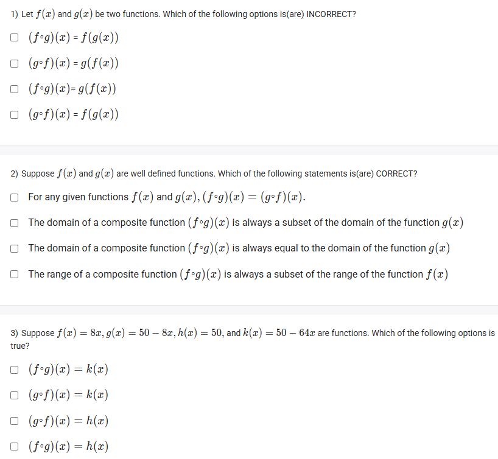

A well-defined collection of distinct objects called elements or members.



https://youtu.be/T4Q2bg0jQZ8

#### Learning Outcomes:

The student will be able to
(a) Define Composite function.
(b) Understand the practical application of composite function.
(c) Identify the domain of a composite function.

## Exercise Questions 

Good evening! Here in India on this Sunday, let's explore these questions on the **composition of functions**. This is a fundamental concept in algebra where you combine functions in a specific order to create a new one.

### **Core Concepts: Composition of Functions**

1.  **What is Function Composition?**
    The composition of a function $f$ with a function $g$ is written as $(f \circ g)(x)$. It's read as "f composed with g of x".
    It means you apply the "inner" function ($g$) first, and then apply the "outer" function ($f$) to the result of the first function.

2.  **The Definition and Notation:**
    The key definition to remember is:
    $$(f \circ g)(x) = f(g(x))$$
    To compute this, you take the entire expression for $g(x)$ and substitute it into every $x$ in the function $f(x)$.

3.  **Order Matters (Not Commutative):**
    In general, the order in which you compose functions is crucial.
    $$(f \circ g)(x) \text{ is usually NOT the same as } (g \circ f)(x)$$

4.  **Domain of a Composite Function:**
    The domain of $(f \circ g)(x)$ is the set of all $x$ in the domain of $g$ for which the output, $g(x)$, is in the domain of $f$. This means the domain of $(f \circ g)(x)$ is always a **subset** of the domain of the inner function, $g(x)$.

---

### **Question 1: Notation of Function Composition**

**The Question:**
Let $f(x)$ and $g(x)$ be two functions. Which of the following options is(are) INCORRECT?
* $(f \circ g)(x) = f(g(x))$
* $(g \circ f)(x) = g(f(x))$
* $(f \circ g)(x) = g(f(x))$
* $(g \circ f)(x) = f(g(x))$

**Detailed Solution:**

This question is a direct test of the definition. The notation $(f \circ g)(x)$ means "apply f to the result of g(x)".

* **First Option:** $(f \circ g)(x) = f(g(x))$. This is the **correct** definition.
* **Second Option:** $(g \circ f)(x) = g(f(x))$. This is also the **correct** definition for the reverse composition.
* **Third Option:** $(f \circ g)(x) = g(f(x))$. This is **INCORRECT**. It reverses the order of the functions.
* **Fourth Option:** $(g \circ f)(x) = f(g(x))$. This is **INCORRECT**. It also reverses the order.

**Final Answer:** The incorrect options are:
* **$(f \circ g)(x) = g(f(x))$**
* **$(g \circ f)(x) = f(g(x))$**



### **Question 2: Properties of Composite Functions**

**The Question:**
Suppose $f(x)$ and $g(x)$ are well defined functions. Which of the following statements is(are) CORRECT?
* For any given functions $f(x)$ and $g(x)$, $(f \circ g)(x) = (g \circ f)(x)$.
* The domain of a composite function $(f \circ g)(x)$ is always a subset of the domain of the function $g(x)$.
* The domain of a composite function $(f \circ g)(x)$ is always equal to the domain of the function $g(x)$.
* The range of a composite function $(f \circ g)(x)$ is always a subset of the range of the function $f(x)$.

**Detailed Solution:**

* **First statement:** This is **FALSE**. Function composition is not commutative. For example, if $f(x)=x+1$ and $g(x)=x^2$, then $f(g(x))=x^2+1$, but $g(f(x))=(x+1)^2$. These are not equal.

* **Second statement:** This is **TRUE**. To calculate $f(g(x))$, $x$ must first be a valid input for the inner function $g(x)$. The domain might be further restricted if the output $g(x)$ is not a valid input for $f(x)$, but it can never be larger than the domain of $g(x)$.

* **Third statement:** This is **FALSE**. The domain can be a *proper* subset (smaller than), but not always equal. For example, if $g(x)=x-5$ (domain is $\mathbb{R}$) and $f(x)=\sqrt{x}$ (domain is $x \ge 0$), the domain of $(f \circ g)(x)=\sqrt{x-5}$ is $x \ge 5$, which is a subset of, but not equal to, the domain of $g(x)$.

* **Fourth statement:** This is **TRUE**. The final outputs of the composite function $f(g(x))$ are produced by the outer function $f$. Therefore, the set of all possible outputs (the range of the composite) must be a subset of all possible outputs of $f$.

**Final Answer:** The correct options are:
* **The domain of a composite function $(f \circ g)(x)$ is always a subset of the domain of the function $g(x)$.**
* **The range of a composite function $(f \circ g)(x)$ is always a subset of the range of the function $f(x)$.**



### **Question 3: Computing Composite Functions**

**The Question:**
Suppose $f(x) = 8x$, $g(x) = 50 - 8x$, $h(x) = 50$, and $k(x) = 50 - 64x$ are functions. Which of the following options is true?
* $(f \circ g)(x) = k(x)$
* $(g \circ f)(x) = k(x)$
* $(g \circ f)(x) = h(x)$
* $(f \circ g)(x) = h(x)$

**Detailed Solution:**

We need to compute both $(f \circ g)(x)$ and $(g \circ f)(x)$ and compare them to $h(x)$ and $k(x)$.

**1. Compute $(f \circ g)(x) = f(g(x))$**
* Start with the outer function: $f(x) = 8x$.
* Replace the $x$ in $f(x)$ with the entire expression for $g(x)$:
    * $f(g(x)) = 8(g(x))$
    * $f(g(x)) = 8(50 - 8x)$
    * $f(g(x)) = 400 - 64x$
* This result does not match $h(x)$ or $k(x)$.

**2. Compute $(g \circ f)(x) = g(f(x))$**
* Start with the outer function: $g(x) = 50 - 8x$.
* Replace the $x$ in $g(x)$ with the entire expression for $f(x)$:
    * $g(f(x)) = 50 - 8(f(x))$
    * $g(f(x)) = 50 - 8(8x)$
    * $g(f(x)) = 50 - 64x$
* This result is exactly the definition of $k(x)$.

**Final Answer:** The correct option is **$(g \circ f)(x) = k(x)$**.
