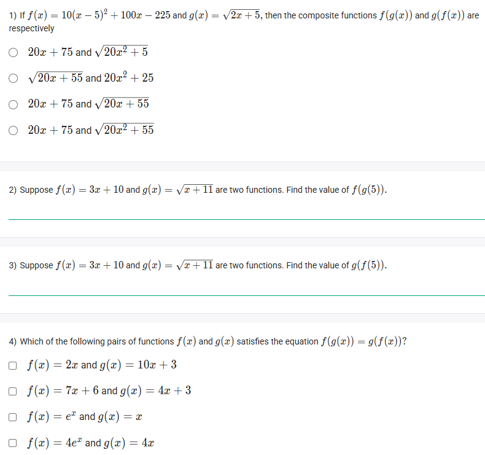
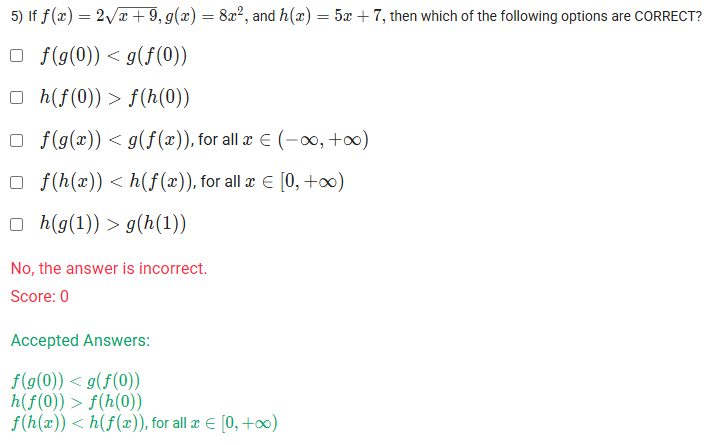

A well-defined collection of distinct objects called elements or members.



https://youtu.be/QfO-gh-Fpts

#### Learning Outcomes:

The student will be able to find the composite function of two given functions.

## Exercise Questions

Good evening! Here in India on this Sunday, let's work through these questions on the composition of functions. These problems are great practice for the core skill of substituting one function into another and evaluating the results.

### **Core Concept: Composition of Functions**

The composition of a function $f$ with a function $g$ is written as $(f \circ g)(x)$ and is defined as:
$$(f \circ g)(x) = f(g(x))$$
This means you work from the **inside out**:
1.  First, you apply the inner function, $g(x)$.
2.  Then, you take the entire result of $g(x)$ and use it as the input for the outer function, $f(x)$.

To evaluate at a specific number, like $(f \circ g)(5)$, you first calculate $g(5)$, get a number, and then plug that number into $f$.

---

### **Question 1: Computing Composite Functions** (from file `image_c62638.png`)

**The Question:**
If $f(x) = 10(x-5)^2 + 100x - 225$ and $g(x) = \sqrt{2x+5}$, then the composite functions $f(g(x))$ and $g(f(x))$ are respectively \_\_\_\_\_\_\_\_\_\_.

**Detailed Solution:**

First, let's simplify the function $f(x)$ to make the substitution easier.
* $f(x) = 10(x^2 - 10x + 25) + 100x - 225$
* $f(x) = 10x^2 - 100x + 250 + 100x - 225$
* The $-100x$ and $+100x$ terms cancel out.
* $f(x) = 10x^2 + 25$

Now we can compute the compositions.

**1. Find $f(g(x))$:**
* This means we substitute the entire expression for $g(x)$ into the $x$ of our simplified $f(x)$.
* $f(g(x)) = 10(g(x))^2 + 25$
* $f(g(x)) = 10(\sqrt{2x+5})^2 + 25$
* The square and the square root cancel each other out:
* $f(g(x)) = 10(2x+5) + 25$
* $f(g(x)) = 20x + 50 + 25 = 20x + 75$

**2. Find $g(f(x))$:**
* This means we substitute the entire expression for $f(x)$ into the $x$ of $g(x)$.
* $g(f(x)) = \sqrt{2(f(x)) + 5}$
* $g(f(x)) = \sqrt{2(10x^2 + 25) + 5}$
* $g(f(x)) = \sqrt{20x^2 + 50 + 5}$
* $g(f(x)) = \sqrt{20x^2 + 55}$

**Final Answer:** The composite functions are **$20x + 75$** and **$\sqrt{20x^2 + 55}$**.



### **Question 2: Evaluating a Composite Function** (from file `image_c62638.png`)

**The Question:**
Suppose $f(x) = 3x+10$ and $g(x) = \sqrt{x+11}$ are two functions. Find the value of $f(g(5))$.

**Detailed Solution:**

We evaluate this from the inside out.
1.  **First, calculate the inner function, $g(5)$:**
    * $g(5) = \sqrt{5+11} = \sqrt{16} = 4$.
2.  **Next, use this result as the input for the outer function, $f(x)$:**
    * We need to find $f(4)$.
    * $f(4) = 3(4) + 10 = 12 + 10 = 22$.

**Final Answer:** The value of $f(g(5))$ is **22**.



### **Question 3: Evaluating a Composite Function (Reversed)** (from file `image_c62638.png`)

**The Question:**
Suppose $f(x) = 3x+10$ and $g(x) = \sqrt{x+11}$ are two functions. Find the value of $g(f(5))$.

**Detailed Solution:**

This is similar to the last question, but the order of the functions is reversed.
1.  **First, calculate the inner function, $f(5)$:**
    * $f(5) = 3(5) + 10 = 15 + 10 = 25$.
2.  **Next, use this result as the input for the outer function, $g(x)$:**
    * We need to find $g(25)$.
    * $g(25) = \sqrt{25+11} = \sqrt{36} = 6$.

**Final Answer:** The value of $g(f(5))$ is **6**.



### **Question 4: Checking for Commutativity** (from file `image_c62638.png`)

**The Question:**
Which of the following pairs of functions $f(x)$ and $g(x)$ satisfies the equation $f(g(x)) = g(f(x))$?

**Detailed Solution:**

We must compute both compositions for each pair and check if the results are identical.

* **Pair 1:** $f(x) = 2x$ and $g(x) = 10x+3$
    * $f(g(x)) = 2(10x+3) = 20x+6$
    * $g(f(x)) = 10(2x)+3 = 20x+3$. (Not equal)

* **Pair 2:** $f(x) = 7x+6$ and $g(x) = 4x+3$
    * $f(g(x)) = 7(4x+3)+6 = 28x+21+6 = 28x+27$
    * $g(f(x)) = 4(7x+6)+3 = 28x+24+3 = 28x+27$. (**Equal**)

* **Pair 3:** $f(x) = e^x$ and $g(x) = x$
    * $f(g(x)) = e^{(x)} = e^x$
    * $g(f(x)) = (e^x) = e^x$. (**Equal**)

* **Pair 4:** $f(x) = 4e^x$ and $g(x) = 4x$
    * $f(g(x)) = 4e^{(4x)} = 4e^{4x}$
    * $g(f(x)) = 4(4e^x) = 16e^x$. (Not equal)

**Final Answer:** The pairs that satisfy the equation are:
* **$f(x) = 7x+6$ and $g(x) = 4x+3$**
* **$f(x) = e^x$ and $g(x) = x$**



### **Question 5: Comparing Function Values** (from file `image_c6232e.png`)

**The Question:**
If $f(x) = 2\sqrt{x} + 9$, $g(x) = 8x^2$, and $h(x) = 5x+7$, then which of the following options are CORRECT?

**Detailed Solution:**

Let's evaluate each statement carefully.

* **$f(g(0)) < g(f(0))$**
    * First, $g(0) = 8(0)^2 = 0$. So $f(g(0)) = f(0) = 2\sqrt{0}+9 = 9$.
    * Second, $f(0) = 9$. So $g(f(0)) = g(9) = 8(9)^2 = 8(81) = 648$.
    * Is $9 < 648$? Yes. This statement is **TRUE**.

* **$h(f(0)) > f(h(0))$**
    * First, $f(0) = 9$. So $h(f(0)) = h(9) = 5(9)+7 = 45+7 = 52$.
    * Second, $h(0) = 5(0)+7 = 7$. So $f(h(0)) = f(7) = 2\sqrt{7}+9$. Since $\sqrt{4}=2$ and $\sqrt{9}=3$, $\sqrt{7}$ is about 2.6. So $f(7) \approx 2(2.6)+9 = 5.2+9 = 14.2$.
    * Is $52 > 14.2$? Yes. This statement is **TRUE**.

* **$f(g(x)) < g(f(x))$, for all $x \in (-\infty, +\infty)$**
    * The domain of $f(x)$ is $x \ge 0$. The composite function $g(f(x)) = 8(2\sqrt{x}+9)^2$ is also only defined for $x \ge 0$. Since the statement requires the inequality to hold for all real numbers (including negatives), it cannot be correct. This statement is **FALSE**.

* **$f(h(x)) < h(f(x))$, for all $x \in [0, +\infty)$**
    * Let's find the functions:
        * $h(f(x)) = 5(f(x))+7 = 5(2\sqrt{x}+9)+7 = 10\sqrt{x}+45+7 = 10\sqrt{x}+52$.
        * $f(h(x)) = 2\sqrt{h(x)}+9 = 2\sqrt{5x+7}+9$.
    * Let's test a large value, $x=100$.
        * $h(f(100)) = 10\sqrt{100}+52 = 10(10)+52 = 152$.
        * $f(h(100)) = 2\sqrt{5(100)+7}+9 = 2\sqrt{507}+9 \approx 2(22.5)+9 = 54$.
    * For $x=100$, $54 < 152$. The linear term inside `h(f(x))` grows much faster than the square root term inside `f(h(x))`. This statement appears to be **TRUE**.

* **$h(g(1)) > g(h(1))$**
    * First, $g(1) = 8(1)^2=8$. So $h(g(1)) = h(8) = 5(8)+7 = 47$.
    * Second, $h(1) = 5(1)+7=12$. So $g(h(1)) = g(12) = 8(12)^2 = 8(144) = 1152$.
    * Is $47 > 1152$? No. This statement is **FALSE**.

**Final Answer:** The correct statements are:
* **$f(g(0)) < g(f(0))$**
* **$h(f(0)) > f(h(0))$**
* **$f(h(x)) < h(f(x))$, for all $x \in [0, +\infty)$**
