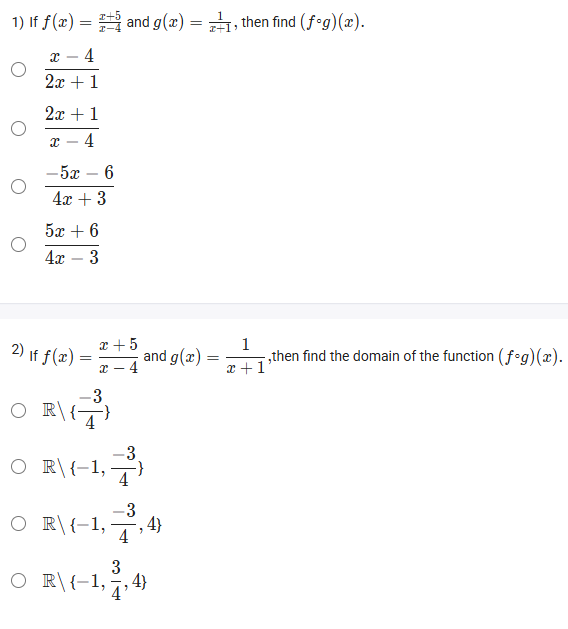
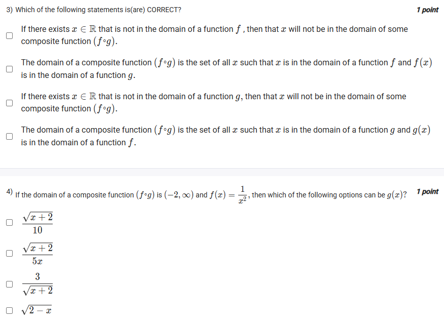

A well-defined collection of distinct objects called elements or members.



https://youtu.be/5u1OlsxuJnw

#### Learning Outcomes:

The student will be able to determine the domain for a composite function.

## Exercise Questions

Good evening! Here in India on this Sunday, let's explore these questions about the composition of functions. A major focus here is on a particularly important (and sometimes tricky) aspect: finding the domain of a composite function.

### **Core Concept: The Domain of a Composite Function**

To find the domain of a composite function, $(f \circ g)(x) = f(g(x))$, an input $x$ is only valid if it satisfies **two conditions**:

1.  **Condition 1:** $x$ must be in the domain of the **inner function**, $g(x)$.
2.  **Condition 2:** The output of the inner function, $g(x)$, must be in the domain of the **outer function**, $f(x)$.

The final domain is the set of all $x$-values that satisfy both of these conditions simultaneously.

---

### **Question 1: Computing a Composite Function** (from file `image_c61f68.png`)

**The Question:**
If $f(x) = \frac{x+5}{x-4}$ and $g(x) = \frac{1}{x+1}$, then find $(f \circ g)(x)$.

**Detailed Solution:**

1.  **Set up the composition:** We need to find $f(g(x))$. This means we will substitute the entire expression for $g(x)$ into every instance of $x$ in the function $f(x)$.
    $$f(g(x)) = \frac{g(x)+5}{g(x)-4} = \frac{\left(\frac{1}{x+1}\right) + 5}{\left(\frac{1}{x+1}\right) - 4}$$

2.  **Simplify the complex fraction:** The easiest way to simplify this is to multiply the main numerator and the main denominator by the "mini" denominator, which is $(x+1)$.
    * **Simplify the numerator:**
    $$(x+1) \cdot \left(\frac{1}{x+1} + 5\right) = (x+1)\frac{1}{x+1} + (x+1)5 = 1 + 5x + 5 = 5x + 6$$
    * **Simplify the denominator:**
    $$(x+1) \cdot \left(\frac{1}{x+1} - 4\right) = (x+1)\frac{1}{x+1} - (x+1)4 = 1 - (4x + 4) = 1 - 4x - 4 = -4x - 3$$

3.  **Combine the simplified parts:**
    $$f(g(x)) = \frac{5x+6}{-4x-3}$$
4.  **Match the format of the options:** We can factor out a -1 from the denominator to match the third option.
    $$f(g(x)) = \frac{5x+6}{-(4x+3)} = -\frac{5x+6}{4x+3} = \frac{-5x-6}{4x+3}$$

**Final Answer:** The composite function is **$\frac{-5x-6}{4x+3}$**.



### **Question 2: Finding the Domain of a Composite Function** (from file `image_c61f68.png`)

**The Question:**
If $f(x) = \frac{x+5}{x-4}$ and $g(x) = \frac{1}{x+1}$, then find the domain of the function $(f \circ g)(x)$.

**Detailed Solution:**

We must apply our two-condition rule.

1.  **Condition 1: Find the domain of the inner function, $g(x)$.**
    * $g(x) = \frac{1}{x+1}$. The denominator cannot be zero.
    * $x+1 \neq 0 \implies x \neq -1$.
    * So, our first restriction is that **$x$ cannot be -1**.

2.  **Condition 2: The output of $g(x)$ must be in the domain of the outer function, $f(x)$.**
    * First, find the domain of $f(x) = \frac{x+5}{x-4}$. Its denominator cannot be zero, so its domain is all real numbers except for 4.
    * This means the output of $g(x)$ cannot be 4. We must find which $x$-value causes this and exclude it.
    * Set $g(x) = 4$:
    $$\frac{1}{x+1} = 4$$$$1 = 4(x+1)$$$$1 = 4x + 4$$$$-3 = 4x$$$$x = -\frac{3}{4}$$
    * So, our second restriction is that **$x$ cannot be -3/4**.

3.  **Combine the restrictions:**
    The domain is all real numbers except for the values we must exclude from both conditions.
    The domain is $\mathbb{R} \setminus \{-1, -\frac{3}{4}\}$.

**Final Answer:** **$\mathbb{R} \setminus \{-1, -\frac{3}{4}\}$**.



### **Question 3: Correct Statements about the Domain of a Composite Function** (from file `image_c61f0c.png`)

**The Question:**
Which of the following statements is(are) CORRECT?

**Detailed Solution:**

Let's evaluate each statement based on the formal definition of the domain of a composite function, $(f \circ g)(x)$.

* **"If there exists $x \in \mathbb{R}$ that is not in the domain of a function $f$, then that $x$ will not be in the domain of some composite function $(f \circ g)$."**
    * This statement is not necessarily true and is poorly worded. For example, if $f(x)=\sqrt{x}$ and $g(x)=x^2$, $x=-2$ is not in the domain of $f$, but $x=-2$ *is* in the domain of $(f \circ g)(x) = \sqrt{x^2} = |x|$. The key restrictions come from the inner function first.

* **"The domain of a composite function $(f \circ g)$ is the set of all $x$ such that $x$ is in the domain of a function $f$ and $f(x)$ is in the domain of a function $g$."**
    * **FALSE**. This reverses the order. It describes the domain of $(g \circ f)(x)$.

* **"If there exists $x \in \mathbb{R}$ that is not in the domain of a function $g$, then that $x$ will not be in the domain of some composite function $(f \circ g)$."**
    * **TRUE**. This is a direct consequence of the definition. To calculate $f(g(x))$, we must first be able to calculate $g(x)$. If $x$ is not a valid input for $g$, the process fails at the first step.

* **"The domain of a composite function $(f \circ g)$ is the set of all $x$ such that $x$ is in the domain of a function $g$ and $g(x)$ is in the domain of a function $f$."**
    * **TRUE**. This is the precise, formal definition that combines our two conditions.

**Final Answer:** The correct statements are:
* **If there exists $x \in \mathbb{R}$ that is not in the domain of a function $g$, then that $x$ will not be in the domain of some composite function $(f \circ g)$.**
* **The domain of a composite function $(f \circ g)$ is the set of all $x$ such that $x$ is in the domain of a function $g$ and $g(x)$ is in the domain of a function $f$.**



### **Question 4: Finding a Function from a Composite Domain** (from file `image_c61f0c.png`)

**The Question:**
If the domain of a composite function $(f \circ g)$ is $(-\infty, 2)$ and $f(x) = \frac{1}{x^2}$, then which of the following options can be $g(x)$?

**Detailed Solution:**

Let's use our two-condition rule in reverse.

1.  **Analyze the outer function, $f(x)$:**
    * $f(x) = \frac{1}{x^2}$.
    * The domain of $f$ is all real numbers except where the denominator is zero. The domain is $x \neq 0$.

2.  **Apply the two conditions for the domain of $(f \circ g)(x) = f(g(x))$:**
    * Condition 1: $x$ must be in the domain of $g(x)$.
    * Condition 2: The output $g(x)$ must be in the domain of $f(x)$, which means $g(x) \neq 0$.

3.  We are told the final domain, after applying both conditions, is $(-\infty, 2)$, which means $x < 2$. Let's test each option for $g(x)$ to see which one results in this domain.

* **Option: $g(x) = \sqrt{2-x}$**
    * **Condition 1 (Domain of g):** The expression inside the square root must be non-negative. $2 - x \ge 0 \implies 2 \ge x$, or $x \le 2$.
    * **Condition 2 (g(x) must not be 0):** We need to find where $g(x)=0$ and exclude that point. $\sqrt{2-x} = 0 \implies 2-x = 0 \implies x = 2$. So we must exclude $x=2$.
    * **Combine:** The domain of $g(x)$ is $x \le 2$. The restriction from $f(x)$ is $x \neq 2$. The intersection of these two conditions is **$x < 2$**, which is the interval $(-\infty, 2)$. This is a perfect match.

* **Let's check another option to be sure:** $g(x) = \frac{3}{\sqrt{x+2}}$
    * **Condition 1 (Domain of g):** The expression in the square root must be strictly positive (since it's also in the denominator). $x+2 > 0 \implies x > -2$.
    * **Condition 2 (g(x) must not be 0):** The fraction $\frac{3}{\sqrt{x+2}}$ can never be zero. So there is no additional restriction.
    * **Combine:** The final domain would be $x > -2$, or $(-2, \infty)$, which does not match.

**Final Answer:** The correct option is **$g(x) = \sqrt{2-x}$**.
