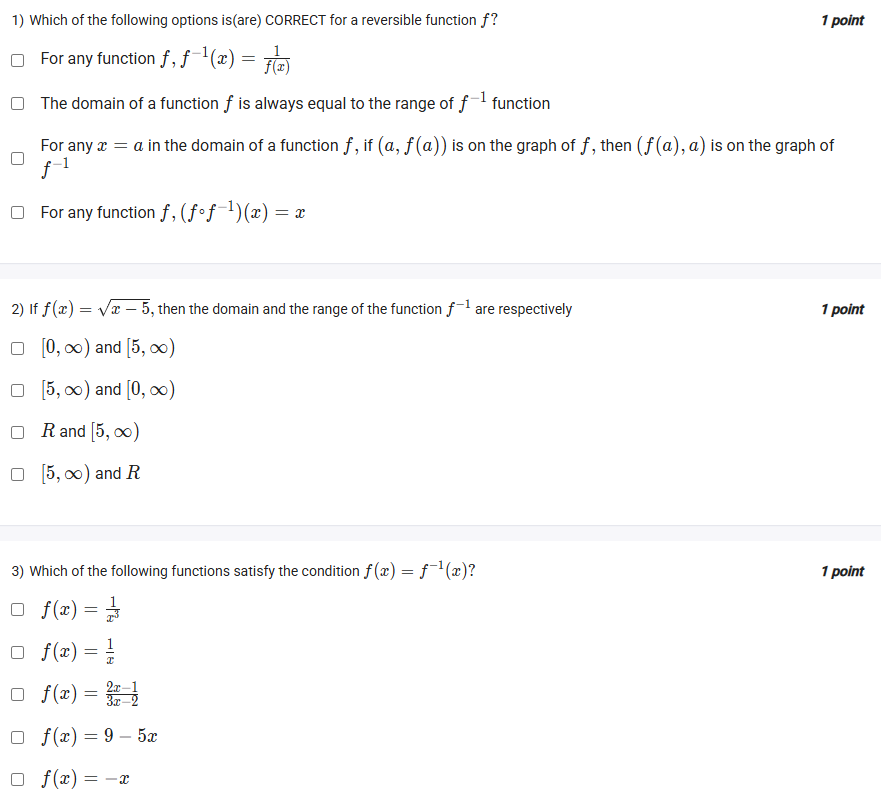
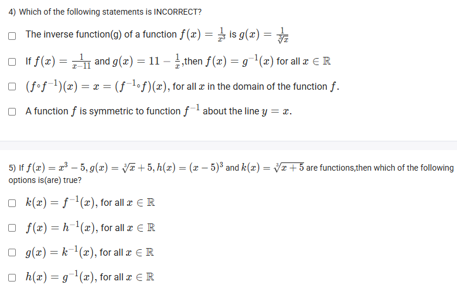

A well-defined collection of distinct objects called elements or members.



https://youtu.be/BpoWKCrLm14

#### Learning Outcomes:

The student will be able to
(a) Define Inverse of a function.
(b) Find the domain and range of inverse functions.

## Exercise Questions

Good evening! Here in India on this Sunday, let's explore these questions about a fascinating topic in algebra: **inverse functions**.

### **Core Concepts: Inverse Functions**

1.  **What is an Inverse Function?**
    An inverse function, denoted as $f^{-1}(x)$, essentially "undoes" the action of the original function $f(x)$. If $f$ takes an input $a$ to an output $b$, then $f^{-1}$ takes the input $b$ back to the original output $a$. For a function to have a true inverse, it must be **one-to-one**.

2.  **How to Find the Inverse Algebraically:**
    1.  Start with your function, written as $y = f(x)$.
    2.  **Swap** the positions of $x$ and $y$.
    3.  **Solve** the new equation for $y$. The resulting expression is your inverse function, $f^{-1}(x)$.

3.  **Key Properties of Inverses:**
    * **Domain and Range Swap:** The domain of $f(x)$ becomes the range of $f^{-1}(x)$, and the range of $f(x)$ becomes the domain of $f^{-1}(x)$.
    * **Composition Property:** Composing a function with its inverse gives you back the original input: $(f \circ f^{-1})(x) = x$ and $(f^{-1} \circ f)(x) = x$.
    * **Graphical Property:** The graph of $f^{-1}(x)$ is a mirror image (reflection) of the graph of $f(x)$ across the diagonal line $y=x$.
    * **Important Note:** The notation $f^{-1}(x)$ means "inverse", it does **not** mean the reciprocal $\frac{1}{f(x)}$.

---

### **Question 1: Correct Statements about Inverse Functions** (from file `image_c61b4b.png`)

**The Question:**
Which of the following options is(are) CORRECT for a reversible function $f$?

**Detailed Solution:**

Let's evaluate each statement based on the core properties.
* **"For any function f, $f^{-1}(x) = \frac{1}{f(x)}$"**: **FALSE**. This is a common notational confusion. $f^{-1}$ denotes the inverse operation, not the multiplicative reciprocal.
* **"The domain of a function $f$ is always equal to the range of $f^{-1}$ function"**: **TRUE**. This is a fundamental property of inverse functions; the inputs of the original are the outputs of the inverse.
* **"For any x = a in the domain of a function f, if (a, f(a)) is on the graph of f, then (f(a), a) is on the graph of $f^{-1}$"**: **TRUE**. This describes exactly how the coordinates of points are swapped between a function and its inverse.
* **"For any function f, $(f \circ f^{-1})(x) = x$"**: **TRUE**. This is the composition property, showing that the functions "undo" each other.

**Final Answer:** The three correct statements are:
* **The domain of a function $f$ is always equal to the range of $f^{-1}$ function**
* **For any x = a in the domain of a function f, if (a, f(a)) is on the graph of f, then (f(a), a) is on the graph of $f^{-1}$**
* **For any function f, $(f \circ f^{-1})(x) = x$**



### **Question 2: Domain and Range of an Inverse Function** (from file `image_c61b4b.png`)

**The Question:**
If $f(x) = \sqrt{x-5}$, then the domain and the range of the function $f^{-1}$ are respectively \_\_\_\_\_\_\_\_\_\_.

**Detailed Solution:**

We can use the domain/range swapping property.

1.  **Find the domain of the original function, $f(x)$:**
    * The expression inside the square root must be non-negative.
    * $x - 5 \ge 0 \implies x \ge 5$.
    * The domain of $f(x)$ is $[5, \infty)$.

2.  **Find the range of the original function, $f(x)$:**
    * The output of the principal square root function is always non-negative.
    * The smallest possible output is $\sqrt{5-5} = 0$.
    * The range of $f(x)$ is $[0, \infty)$.

3.  **Determine the domain and range of the inverse, $f^{-1}(x)$:**
    * Domain of $f^{-1}$ = Range of $f = [0, \infty)$.
    * Range of $f^{-1}$ = Domain of $f = [5, \infty)$.

**Final Answer:** The domain of $f^{-1}$ is $[0, \infty)$ and the range is $[5, \infty)$.



### **Question 3: Functions that are their Own Inverse** (from file `image_c61b4b.png`)

**The Question:**
Which of the following functions satisfy the condition $f(x) = f^{-1}(x)$?

**Detailed Solution:**
We will find the inverse for each function and see if it matches the original.

* **$f(x) = \frac{1}{x^3}$**:
    * $y = \frac{1}{x^3} \implies$ Swap: $x = \frac{1}{y^3} \implies y^3 = \frac{1}{x} \implies y = \sqrt[3]{\frac{1}{x}}$. Not the same.

* **$f(x) = \frac{1}{x}$**:
    * $y = \frac{1}{x} \implies$ Swap: $x = \frac{1}{y} \implies y = \frac{1}{x}$. This **is** its own inverse.

* **$f(x) = \frac{2x-1}{3x-2}$**:
    * $y = \frac{2x-1}{3x-2} \implies$ Swap: $x = \frac{2y-1}{3y-2} \implies x(3y-2) = 2y-1 \implies 3xy - 2x = 2y-1 \implies 3xy - 2y = 2x - 1 \implies y(3x-2) = 2x-1 \implies y = \frac{2x-1}{3x-2}$. This **is** its own inverse.

* **$f(x) = 9 - 5x$**:
    * $y = 9 - 5x \implies$ Swap: $x = 9 - 5y \implies 5y = 9 - x \implies y = \frac{9-x}{5}$. Not the same.

* **$f(x) = -x$**:
    * $y = -x \implies$ Swap: $x = -y \implies y = -x$. This **is** its own inverse.

**Final Answer:** The functions that are their own inverses are:
* **$f(x) = \frac{1}{x}$**
* **$f(x) = \frac{2x-1}{3x-2}$**
* **$f(x) = -x$**



### **Question 4: Incorrect Statements about Inverses** (from file `image_c61af5.png`)

**The Question:**
Which of the following statements is INCORRECT?

**Detailed Solution:**
We are looking for the statements that are false.

* **"The inverse function(g) of a function $f(x) = \frac{1}{x^3}$ is $g(x) = \frac{1}{\sqrt{x}}$"**:
    * Let's find the inverse of $f(x) = 1/x^3$.
    * $y = 1/x^3 \implies$ Swap: $x = 1/y^3 \implies y^3=1/x \implies y = \sqrt[3]{1/x} = 1/\sqrt[3]{x}$.
    * The correct inverse is $1/\sqrt[3]{x}$, not $1/\sqrt{x}$. This statement is **FALSE**.

* **"If $f(x) = \frac{1}{x-11}$ and $g(x) = 11 - \frac{1}{x}$, then $f(x)=g^{-1}(x)$ for all $x \in \mathbb{R}$"**:
    * This asks if $f$ is the inverse of $g$. Let's find the inverse of $g(x)$.
    * $y = 11 - \frac{1}{x} \implies$ Swap: $x = 11 - \frac{1}{y} \implies \frac{1}{y} = 11 - x \implies y = \frac{1}{11-x}$.
    * The inverse $g^{-1}(x) = \frac{1}{11-x}$, which is not the same as $f(x)=\frac{1}{x-11}$. This statement is **FALSE**.

* **"$(f \circ f^{-1})(x) = x = (f^{-1} \circ f)(x)$, for all $x$ in the domain of the function $f$."**: This is the correct statement of the composition property of inverse functions. This statement is **TRUE**.
* **"A function $f$ is symmetric to function $f^{-1}$ about the line $y=x$."**: This is the correct statement of the graphical property of inverse functions. This statement is **TRUE**.

**Final Answer:** The incorrect statements are:
* **The inverse function(g) of a function $f(x) = \frac{1}{x^3}$ is $g(x) = \frac{1}{\sqrt{x}}$**
* **If $f(x) = \frac{1}{x-11}$ and $g(x) = 11 - \frac{1}{x}$, then $f(x)=g^{-1}(x)$ for all $x \in \mathbb{R}$**



### **Question 5: Identifying Inverse Pairs** (from file `image_c61af5.png`)

**The Question:**
If $f(x)=x^3-5, g(x)=\sqrt{x}+5, h(x)=(x-5)^3$ and $k(x)=\sqrt[3]{x+5}$ are functions, then which of the following options is(are) true?

**Detailed Solution:**
We need to find the inverse for one function in each pair and see if it matches the other.

* **Check `k(x) = f^{-1}(x)`:**
    * Find the inverse of $f(x) = x^3 - 5$.
    * $y = x^3 - 5$
    * Swap variables: $x = y^3 - 5$
    * Solve for y: $x+5 = y^3 \implies y = \sqrt[3]{x+5}$.
    * This result, $\sqrt[3]{x+5}$, is exactly the definition of $k(x)$. This statement is **TRUE**.

* **Check `f(x) = h^{-1}(x)`:**
    * Find the inverse of $h(x) = (x-5)^3$.
    * $y = (x-5)^3$
    * Swap variables: $x = (y-5)^3$
    * Solve for y: $\sqrt[3]{x} = y-5 \implies y = \sqrt[3]{x} + 5$.
    * This is not equal to $f(x) = x^3 - 5$. This statement is **FALSE**.

* **Check `g(x) = k^{-1}(x)`:**
    * Find the inverse of $k(x) = \sqrt[3]{x+5}$.
    * $y = \sqrt[3]{x+5}$
    * Swap variables: $x = \sqrt[3]{y+5}$
    * Solve for y: $x^3 = y+5 \implies y = x^3 - 5$.
    * This is equal to $f(x)$, not $g(x)$. This statement is **FALSE**.

* **Check `h(x) = g^{-1}(x)`:**
    * Find the inverse of $g(x) = \sqrt{x} + 5$.
    * $y = \sqrt{x} + 5$
    * Swap variables: $x = \sqrt{y} + 5$
    * Solve for y: $x - 5 = \sqrt{y} \implies y = (x-5)^2$.
    * This is not equal to $h(x) = (x-5)^3$. This statement is **FALSE**.

**Final Answer:** The only true option is **$k(x) = f^{-1}(x)$, for all $x \in \mathbb{R}$**.
