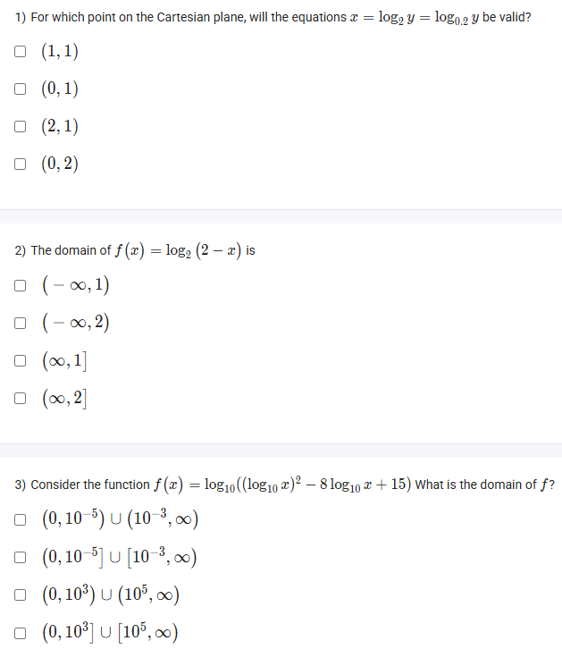
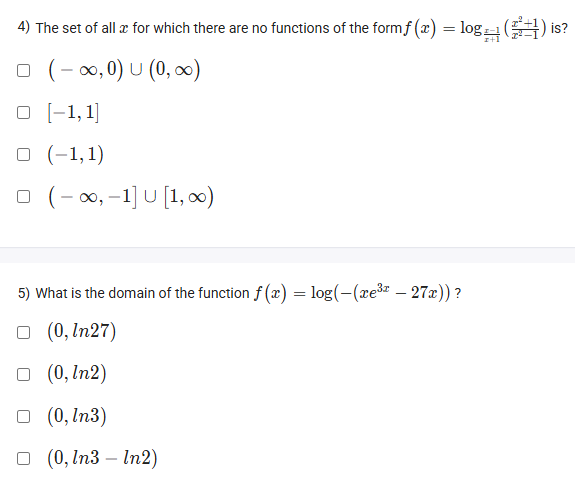

A well-defined collection of distinct objects called elements or members.



https://youtu.be/G5A7imv2Otc

#### Learning Outcomes:

1. To learn inverse of an exponential function and understand its properties
2. Learn ‘7-rule’
3. Understand the domain and range of exponential functions and logarithmic functions
4. Solve problems on domains and ranges of exponential functions and logarithmic functions
5. To plot graph of inverse function of exponential functions

## Exercise Questions 

Good evening! Here in India on this Sunday, let's explore these questions involving logarithmic functions. The key to solving almost all of these problems is a solid understanding of the rules that govern the **domain of a logarithm**.

### **Core Concepts: The Domain of a Logarithm**

For any logarithmic function written in the form $f(x) = \log_b (A)$:

1.  **The Argument must be Positive:** The expression inside the logarithm, the argument ($A$), must be strictly greater than zero.
    $$A > 0$$
2.  **The Base must be Positive:** The base ($b$) must be strictly greater than zero.
    $$b > 0$$
3.  **The Base cannot be 1:** The base ($b$) cannot be equal to one.
    $$b \neq 1$$

You must satisfy all relevant conditions for the function to be defined.

---

### **Question 1: Solving a System of Log Equations** (from file `image_c5c0f4.png`)

**The Question:**
For which point on the Cartesian plane, will the equations $x = \log_2 y$ and $x = \log_{0.2} y$ be valid?
* (1, 1)
* (0, 1)
* (2, 1)
* (0, 2)

**Detailed Solution:**

1.  **Set the equations equal:** Since both equations are equal to $x$, we can set them equal to each other:
    $$\log_2 y = \log_{0.2} y$$
2.  **Analyze the equation:** A logarithm, $\log_b y$, asks the question: "To what power must I raise the base $b$ to get the argument $y$?" The only way for this power to be the same for two different bases (2 and 0.2) is if the argument $y$ makes the result trivial.
3.  The value of any logarithm is 0 when its argument is 1 (i.e., $\log_b 1 = 0$ for any valid base $b$). Let's test this.
4.  **Test y = 1:**
    * If $y=1$, the first equation becomes $x = \log_2 (1) = 0$.
    * If $y=1$, the second equation becomes $x = \log_{0.2} (1) = 0$.
5.  **Find the point:** Both equations give a result of $x=0$ when $y=1$. This means the point $(0, 1)$ satisfies both equations.

**Final Answer:** The correct option is **(0, 1)**.



### **Question 2: Domain of a Simple Logarithm** (from file `image_c5c0f4.png`)

**The Question:**
The domain of $f(x) = \log_2(2-x)$ is \_\_\_\_\_\_\_\_\_\_.
* $(-\infty, 1)$
* $(-\infty, 2)$
* $(\infty, 1]$
* $(\infty, 2]$

**Core Concept:** The argument of any logarithm must be strictly positive.

**Detailed Solution:**

1.  **Identify the argument:** In the function $f(x) = \log_2(2-x)$, the argument is $(2-x)$.
2.  **Set the argument to be greater than zero:**
    $$2 - x > 0$$
3.  **Solve the inequality for x:**
    * Add $x$ to both sides: $2 > x$.
    * This is the same as $x < 2$.
4.  **Write in interval notation:** The set of all numbers less than 2 is the interval from negative infinity up to (but not including) 2.

**Final Answer:** The domain is **$(-\infty, 2)$**.



### **Question 3: Domain of a Nested Logarithm** (from file `image_c5c0f4.png`)

**The Question:**
Consider the function $f(x) = \log_{10}((\log_{10} x)^2 - 8\log_{10}x + 15)$. What is the domain of $f$?

**Detailed Solution:**

We have two conditions to satisfy for this nested logarithm.

1.  **Condition 1: Argument of the inner logarithm must be positive.**
    * The inner logarithm is $\log_{10}x$. Its argument is $x$.
    * Therefore, we must have **$x > 0$**.

2.  **Condition 2: Argument of the outer logarithm must be positive.**
    * The argument of the outer log is the entire expression $(\log_{10}x)^2 - 8\log_{10}x + 15$.
    * So, we must solve the inequality: $(\log_{10}x)^2 - 8\log_{10}x + 15 > 0$.
    * This is a quadratic inequality. Let $u = \log_{10}x$. The inequality becomes:
        $u^2 - 8u + 15 > 0$
    * Factor the quadratic: $(u-3)(u-5) > 0$.
    * The roots are $u=3$ and $u=5$. Since this is an upward-opening parabola, the expression is positive when $u$ is *outside* the roots.
    * So, we need $u < 3$ or $u > 5$.
3.  **Substitute back and solve for x:**
    * Substitute $u = \log_{10}x$ back into the inequalities:
        * $\log_{10}x < 3$  OR  $\log_{10}x > 5$
    * Convert to exponential form:
        * $x < 10^3$  OR  $x > 10^5$
        * $x < 1000$  OR  $x > 100000$

4.  **Combine all conditions:**
    * We need to satisfy Condition 1 **AND** Condition 2.
    * We need $x > 0$ **AND** ($x < 1000$ or $x > 100000$).
    * The intersection of these gives two separate intervals: $(0, 1000)$ and $(100000, \infty)$.

**Final Answer:** The domain is **$(0, 10^3) \cup (10^5, \infty)$**.



### **Question 4: Domain from the Logarithm Base** (from file `image_c5c098.png`)

**The Question:**
The set of all $x$ for which there are no functions of the form $f(x) = \log_{\frac{x}{x+1}}\left(\frac{x^3-1}{x^3-1}\right)$ is?

**Core Concept:** The question is asking for the set of x-values where the function is **not defined**. A logarithm is not defined if its base is not positive or if its base is equal to 1.

**Detailed Solution:**

1.  **Analyze the Argument:** The argument is $\frac{x^3-1}{x^3-1} = 1$, which is valid as long as the denominator is not zero (i.e., $x \neq 1$). The argument of a logarithm can be 1.

2.  **Analyze the Base:** The base is $b = \frac{x}{x+1}$. It has two conditions to be a valid base.
    * **Condition A (Base must not be 1):** $\frac{x}{x+1} \neq 1 \implies x \neq x+1 \implies 0 \neq 1$. This is always true, so the base is never 1.
    * **Condition B (Base must be positive):** We need to find where the base is **NOT** positive, i.e., where $\frac{x}{x+1} \le 0$.
3.  **Solve the inequality $\frac{x}{x+1} \le 0$:**
    * The critical points where the expression can change sign are the roots of the numerator ($x=0$) and the denominator ($x=-1$).
    * We can test the intervals around these points:
        * If $x < -1$ (e.g., -2): $\frac{-2}{-1} = +2$ (Positive, so function is defined here).
        * If $-1 < x < 0$ (e.g., -0.5): $\frac{-0.5}{+0.5} = -1$ (Negative, so function is **not defined** here).
        * If $x > 0$ (e.g., 5): $\frac{5}{6}$ (Positive, so function is defined here).
    * We also need to check the critical points themselves.
        * At $x=0$, the base is $0$, which is not positive. So the function is **not defined**.
        * At $x=-1$, the base is undefined. So the function is **not defined**.
4.  **Combine the results:** The function is not defined when $x=-1$, when $x=0$, and for all values between them. This is the interval $[-1, 0]$. We must also include the point $x=1$ where the argument is undefined. The full set of invalid points is $[-1, 0] \cup \{1\}$.

**Final Answer:** The closest and most encompassing option provided is **$[-1, 1]$**.



### **Question 5: Domain of a Complex Logarithm** (from file `image_c5c098.png`)

**The Question:**
What is the domain of the function $f(x) = \log(-(xe^{3x} - 27x))$?

**Core Concept:** The argument of the logarithm must be strictly greater than zero.

**Detailed Solution:**

1.  **Set the argument to be greater than zero:**
    $$-(xe^{3x} - 27x) > 0$$
2.  **Simplify the inequality:**
    * Multiply by -1 and remember to **flip the inequality sign**:
    * $xe^{3x} - 27x < 0$
3.  **Factor the expression:**
    * Factor out the common term $x$:
    * $x(e^{3x} - 27) < 0$
4.  **Find the critical points** (where the expression equals zero):
    * The first factor gives a critical point at $x=0$.
    * The second factor gives a critical point when $e^{3x} - 27 = 0 \implies e^{3x} = 27$.
        * Take the natural log of both sides: $\ln(e^{3x}) = \ln(27)$
        * $3x = \ln(3^3) = 3\ln(3)$
        * $x = \ln(3)$
5.  **Analyze the sign of the expression $x(e^{3x} - 27)$ in the intervals:**
    * Our critical points are $0$ and $\ln(3)$ (which is approximately 1.1).
    * **Interval 1: $x < 0$**. Let $x=-1$. The first factor ($x$) is negative. The second factor ($e^{-3}-27$) is negative. The product is $(-)(-) = (+)$. We want less than zero, so this is not part of the domain.
    * **Interval 2: $0 < x < \ln(3)$**. Let $x=1$. The first factor ($x$) is positive. The second factor ($e^3-27 \approx 20.1-27$) is negative. The product is $(+)(-) = (-)$. This is less than zero, so this **is** part of the domain.
    * **Interval 3: $x > \ln(3)$**. Let $x=2$. The first factor ($x$) is positive. The second factor ($e^6-27$) is positive. The product is $(+)(+) = (+)$. Not part of the domain.

**Final Answer:** The domain is the interval where the product is negative, which is **$(0, \ln3)$**.
