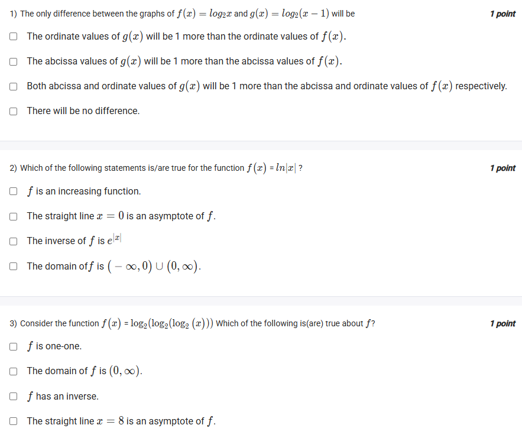

A well-defined collection of distinct objects called elements or members.



https://youtu.be/NL8MlTO-Yf8

#### Learning Outcomes:

1. To plot graph of different logarithmic functions
2. To define natural logarithmic functions

## Exercise Questions 

Good evening! Here in India on this Sunday, let's explore these questions which delve into some interesting properties of logarithmic functions, including graph transformations and the behavior of nested and absolute value logarithms.

### **Core Concepts: Logarithmic Functions**

1.  **Domain of $\log_b(A)$:** For any logarithmic function, there are strict rules for the values it can accept:
    * **Argument ($A$):** The expression inside the logarithm must be strictly positive ($A > 0$).
    * **Base ($b$):** The base must also be positive ($b > 0$) and cannot be equal to one ($b \neq 1$).

2.  **Graph Transformations:** Like other functions, the graph of a logarithm can be shifted:
    * **Vertical Shift:** $f(x) + c$ shifts the graph of $f(x)$ up by $c$ units.
    * **Horizontal Shift:** $f(x-c)$ shifts the graph of $f(x)$ to the **right** by $c$ units. Note the minus sign for a rightward shift.

3.  **The Function $f(x) = \ln|x|$:**
    * This is an **even function** because $f(-x) = \ln|-x| = \ln|x| = f(x)$. Its graph is symmetric about the y-axis.
    * Its domain excludes 0, i.e., $(-\infty, 0) \cup (0, \infty)$.
    * It has a vertical asymptote at $x=0$.
    * It is **not** one-to-one because it fails the Horizontal Line Test (e.g., $f(2) = f(-2)$).

---

### **Question 1: Graph Transformations**

**The Question:**
The only difference between the graphs of $f(x) = \log_2 x$ and $g(x) = \log_2(x-1)$ will be
* The ordinate values of g(x) will be 1 more than the ordinate values of f(x).
* The abscissa values of g(x) will be 1 more than the abscissa values of f(x).
* Both abscissa and ordinate values of g(x) will be 1 more than the abscissa and ordinate values of f(x) respectively.
* There will be no difference.

**Core Concept:** This question tests your knowledge of horizontal shifts. A function of the form $f(x-c)$ represents a shift of the original graph of $f(x)$ to the right by $c$ units.

**Detailed Solution:**

1.  We can see that $g(x) = \log_2(x-1)$ is in the form $f(x-1)$, where $f(x) = \log_2 x$.
2.  This represents a **horizontal shift** of the graph of $f(x)$ by **1 unit to the right**.
3.  A rightward shift means that for any given height (y-value, or "ordinate"), the corresponding x-value ("abscissa") on the graph of $g(x)$ will be 1 unit larger than it was on the graph of $f(x)$. For example, $f(x)$ passes through $(2, 1)$ because $\log_2 2 = 1$. The function $g(x)$ will have the same height of 1 when its abscissa is $2+1=3$, i.e., it passes through $(3, 1)$ because $\log_2(3-1) = \log_2 2 = 1$.

**Final Answer:** **The abscissa values of g(x) will be 1 more than the abscissa values of f(x).**



### **Question 2: Properties of $f(x) = \ln|x|$**

**The Question:**
Which of the following statements is/are true for the function $f(x) = \ln|x|$? (Multiple Select Question)

**Detailed Solution:**

Let's evaluate each statement.

* **"f is an increasing function."**
    * **FALSE**. Let's test points. $f(-2) = \ln|-2| = \ln(2)$. $f(-1) = \ln|-1| = \ln(1) = 0$. Here, as $x$ increases from -2 to -1, $f(x)$ decreases from $\ln(2)$ to 0. Therefore, the function is not always increasing. (It is decreasing for $x < 0$ and increasing for $x > 0$).

* **"The straight line $x=0$ is an asymptote of f."**
    * **TRUE**. As $x$ gets very close to 0 (from either the positive or negative side), $|x|$ gets very close to 0. The natural logarithm of a number approaching 0 goes to negative infinity. This is the definition of a vertical asymptote.

* **"The inverse of f is $e^{|x|}$"**
    * **FALSE**. The function $f(x) = \ln|x|$ is not one-to-one. For example, $f(2) = \ln|2| = \ln(2)$ and $f(-2) = \ln|-2| = \ln(2)$. Since different inputs (2 and -2) lead to the same output, it fails the Horizontal Line Test and does not have a true inverse function over its entire domain.

* **"The domain of f is $(-\infty, 0) \cup (0, \infty)$."**
    * **TRUE**. The argument of the logarithm, $|x|$, must be strictly greater than 0. The absolute value of $x$ is greater than 0 for all real numbers except for $x=0$.

**Final Answer:** The correct statements are:
* **The straight line $x=0$ is an asymptote of f.**
* **The domain of f is $(-\infty, 0) \cup (0, \infty)$.**



### **Question 3: Properties of a Nested Logarithm**

**The Question:**
Consider the function $f(x) = \log_2(\log_2(x))$. Which of the following is(are) true about $f$? (Multiple Select Question)

**Detailed Solution:**

Let's analyze the function's properties.

* **The Domain of f:** We have two conditions to meet.
    1.  **Inner Log:** The argument of the inner $\log_2(x)$ must be positive. So, $x > 0$.
    2.  **Outer Log:** The argument of the outer log, which is the entire expression $\log_2(x)$, must also be positive. So, $\log_2(x) > 0$.
    * To solve $\log_2(x) > 0$, we can rewrite it in exponential form: $x > 2^0 \implies x > 1$.
    * We must satisfy both conditions: $x > 0$ AND $x > 1$. The more restrictive condition is $x > 1$.
    * Therefore, the domain of $f$ is $(1, \infty)$. The statement "The domain of f is $(0, \infty)$" is **FALSE**.

* **Is f one-to-one? Does it have an inverse?**
    * The function $g(x)=\log_2(x)$ is a strictly increasing function. Our function is a composition of this function with itself, $f(x) = g(g(x))$.
    * The composition of two strictly increasing functions is also a strictly increasing function.
    * Any function that is strictly increasing over its entire domain will always pass the Horizontal Line Test.
    * Therefore, $f(x)$ **is one-to-one**. The first statement is **TRUE**.
    * A function has an inverse if and only if it is one-to-one. Since $f(x)$ is one-to-one, it **has an inverse**. The third statement is **TRUE**.

* **Asymptote of f:**
    * A vertical asymptote for a logarithmic function occurs where its argument approaches 0.
    * For our outer log, $\log_2(\log_2(x))$, this happens when its argument, $\log_2(x)$, approaches 0.
    * $\log_2(x)$ approaches 0 as $x$ approaches 1 (from the right side).
    * Therefore, the line $x=1$ is a vertical asymptote for $f(x)$. The statement "The straight line $x=8$ is an asymptote of f" is **FALSE**.

**Final Answer:** The correct statements are:
* **$f$ is one-one.**
* **$f$ has an inverse.**
