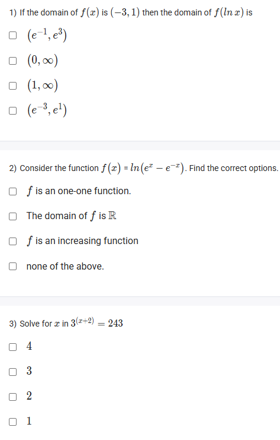
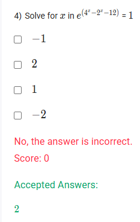

A well-defined collection of distinct objects called elements or members.



https://youtu.be/Q5ef_uFX7ug

#### Learning Outcomes:

1. To solve different exponential equations

## Exercise Questions 

Good morning! Here in India on this Monday, let's explore these problems. They are excellent for practicing how to solve exponential equations and how to analyze functions that combine logarithmic and exponential concepts, especially regarding their domains.

### **Core Concepts: Solving Logarithmic and Exponential Equations**

1.  **Domain of Composite Functions:** To find the domain of a composite function like $f(g(x))$, you must satisfy two conditions:
    * **Condition 1:** The input $x$ must be in the domain of the inner function, $g(x)$.
    * **Condition 2:** The output of the inner function, $g(x)$, must be in the domain of the outer function, $f(x)$.

2.  **Solving Exponential Equations:**
    * **Same Base Method:** If you can write both sides of the equation as a power of the same base, $b^A = b^B$, then you can set the exponents equal: $A=B$.
    * **Using Logarithms:** If $e^A = C$, you can solve for $A$ by taking the natural logarithm of both sides: $A = \ln(C)$. A special case is if $e^A=1$, then $A = \ln(1) = 0$.

---

### **Question 1: Domain of a Composite Function** (from file `image_99a1b3.png`)

**The Question:**
If the domain of $f(x)$ is $(-3, 1)$ then the domain of $f(\ln x)$ is \_\_\_\_\_\_\_\_\_\_.
* $(e^{-1}, e^3)$
* $(0, \infty)$
* $(1, \infty)$
* $(e^{-3}, e^1)$

**Detailed Solution:**

We are finding the domain of the composite function $f(g(x))$ where the outer function is $f$ and the inner function is $g(x)=\ln x$.

1.  **Condition 1: $x$ must be in the domain of the inner function, $\ln x$.**
    * The natural logarithm, $\ln x$, is only defined for positive numbers.
    * So, we must have $x > 0$.

2.  **Condition 2: The output of the inner function, $\ln x$, must be in the domain of the outer function, $f$.**
    * The domain of $f$ is given as $(-3, 1)$. This means the input to $f$ must be greater than -3 and less than 1.
    * In our case, the input to $f$ is $\ln x$. So we have the inequality:
    $$-3 < \ln x < 1$$
    * We can split this into two parts and solve for $x$ by converting to exponential form (using base $e$):
        * $\ln x > -3 \implies x > e^{-3}$
        * $\ln x < 1 \implies x < e^1$

3.  **Combine all conditions:**
    * We need to find the intersection of $x > 0$, $x > e^{-3}$, and $x < e^1$.
    * Since $e^{-3} = 1/e^3$ is a small positive number, the condition $x > e^{-3}$ is more restrictive than $x > 0$.
    * So our final combined condition is $e^{-3} < x < e^1$.

**Final Answer:** The domain is **$(e^{-3}, e^1)$**.



### **Question 2: Analyzing $f(x) = \ln(e^x - e^{-x})$** (from file `image_99a1b3.png`)

**The Question:**
Consider the function $f(x) = \ln(e^x - e^{-x})$. Find the correct options. (Multiple Select Question)

**Detailed Solution:**

Let's analyze the properties of this function.

* **Domain:** The argument of the natural logarithm must be strictly positive.
    * $e^x - e^{-x} > 0$
    * $e^x > e^{-x}$
    * Since $y=e^x$ is an increasing function, we can compare the exponents directly:
    * $x > -x$
    * $2x > 0 \implies x > 0$.
    * The domain is $(0, \infty)$. Therefore, the statement "The domain of $f$ is $\mathbb{R}$" is **FALSE**.

* **Is the function increasing?** We can find the derivative to check the slope. Using the chain rule, the derivative of $\ln(u)$ is $u'/u$.
    * Let $u = e^x - e^{-x}$. Then $u' = e^x - (-e^{-x}) = e^x + e^{-x}$.
    * $f'(x) = \frac{u'}{u} = \frac{e^x + e^{-x}}{e^x - e^{-x}}$.
    * For any $x$ in the domain ($x>0$), the numerator ($e^x + e^{-x}$) is always positive. The denominator ($e^x - e^{-x}$) is also positive.
    * Since the derivative $f'(x)$ is always positive on the domain, the function **is an increasing function**.

* **Is the function one-to-one?**
    * A function that is strictly increasing over its entire domain will always pass the Horizontal Line Test.
    * Since we've shown the function is always increasing, it **is a one-to-one function**.

**Final Answer:** The correct options are:
* **$f$ is an one-one function**
* **$f$ is an increasing function**



### **Question 3: Solving an Exponential Equation** (from file `image_99a1b3.png`)

**The Question:**
Solve for $x$ in $3^{(x+2)} = 243$.

**Core Concept:** If you can express both sides of an equation as a power of the same base ($b^A = b^B$), you can equate the exponents ($A=B$).

**Detailed Solution:**

1.  **The equation is $3^{x+2} = 243$.** The base on the left is 3. We need to write 243 as a power of 3.
2.  **Calculate powers of 3:**
    * $3^1 = 3$
    * $3^2 = 9$
    * $3^3 = 27$
    * $3^4 = 81$
    * $3^5 = 243$
3.  **Rewrite the equation with the same base:**
    * $3^{x+2} = 3^5$
4.  **Equate the exponents:**
    * $x + 2 = 5$
5.  **Solve for x:**
    * $x = 5 - 2 = 3$

**Final Answer:** The value of $x$ is **3**.



### **Question 4: Solving a Complex Exponential Equation** (from file `image_99a153.png`)

**The Question:**
Solve for $x$ in $e^{(4x^2 - 2x - 12)} = 1$.
*(Note: Based on the options and standard problem types, the exponent is interpreted as a quadratic $4x^2 - 2x - 12$.)*

**Core Concept:** The only way for $e$ raised to a power to equal 1 is if that power is 0, because $e^0 = 1$.

**Detailed Solution:**

1.  **Set the exponent equal to zero:**
    * Given the equation $e^{(4x^2 - 2x - 12)} = 1$, we can immediately conclude:
    * $4x^2 - 2x - 12 = 0$

2.  **Simplify the quadratic equation:**
    * Divide the entire equation by 2 to make it easier to work with:
    * $2x^2 - x - 6 = 0$

3.  **Solve the quadratic equation.** We can use factoring.
    * We are looking for two numbers that multiply to $a \cdot c = 2 \cdot (-6) = -12$ and add up to $b = -1$.
    * The numbers are -4 and +3.
    * Rewrite the middle term: $2x^2 - 4x + 3x - 6 = 0$.
    * Factor by grouping: $(2x^2 - 4x) + (3x - 6) = 0$.
    * $2x(x - 2) + 3(x - 2) = 0$.
    * $(2x + 3)(x - 2) = 0$.

4.  **Find the possible values for x:**
    * Either $2x + 3 = 0 \implies x = -3/2$
    * Or $x - 2 = 0 \implies x = 2$

5.  **Check the options:** The options are all integers, so we select the integer solution.

**Final Answer:** The value of $x$ is **2**.
