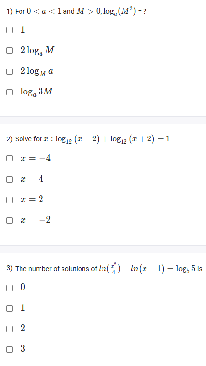

A well-defined collection of distinct objects called elements or members.



https://youtu.be/0WQFcv-wjiI

#### Learning Outcomes:

1. To understand the properties of logarithmic functions
2. To learn the laws of logarithm and corresponding proofs

## Exercise Questions 🧠

Good morning! Here in India on this Monday, let's dive into these questions on logarithmic functions. The key to solving them is a solid understanding of the three fundamental laws of logarithms and the importance of checking the domain of the functions.

### **Core Concepts: The Laws of Logarithms**

For any valid base $b$ ($b>0, b \neq 1$) and positive arguments $M$ and $N$:

1.  **Product Rule:** The log of a product is the sum of the logs.
    $$\log_b(M \cdot N) = \log_b M + \log_b N$$

2.  **Quotient Rule:** The log of a quotient is the difference of the logs.
    $$\log_b\left(\frac{M}{N}\right) = \log_b M - \log_b N$$

3.  **Power Rule:** The log of a number raised to a power is the power times the log of the number.
    $$\log_b(M^p) = p \cdot \log_b M$$

**Crucial Note for Solving Equations:** Always check your final answer(s) to make sure they are in the domain of the original logarithmic expressions. The argument of any logarithm must be **strictly positive**.

---

### **Question 1: The Power Rule of Logarithms**

**The Question:**
For $0 < a < 1$ and $M > 0$, $\log_a(M^2) = ?$
* 1
* $2\log_a M$
* $2\log_M a$
* $\log_a 3M$

**Core Concept:** This is a direct application of the Power Rule: $\log_b(M^p) = p \cdot \log_b M$.

**Detailed Solution:**

1.  The expression is $\log_a(M^2)$.
2.  In this expression, the base is $a$, the argument is $M$, and the power is $2$.
3.  According to the Power Rule, we can bring the exponent (2) to the front of the logarithm as a multiplier.
4.  This gives the result: $2 \log_a M$.

**Final Answer:** **$2\log_a M$**



### **Question 2: Solving a Logarithmic Equation**

**The Question:**
Solve for $x$: $\log_{12}(x-2) + \log_{12}(x+2) = 1$
* $x = -4$
* $x = 4$
* $x = 2$
* $x = -2$

**Detailed Solution:**

1.  **Determine the Domain:** Before solving, we find the values of $x$ for which the equation is defined.
    * For $\log_{12}(x-2)$, the argument must be positive: $x-2 > 0 \implies x > 2$.
    * For $\log_{12}(x+2)$, the argument must be positive: $x+2 > 0 \implies x > -2$.
    * To satisfy both conditions, we must have **$x > 2$**. Any solution we find must meet this condition.

2.  **Combine the Logarithms:** The left side is a sum of two logs with the same base. We can use the Product Rule to combine them.
    * $\log_{12}((x-2)(x+2)) = 1$
    * $\log_{12}(x^2 - 4) = 1$

3.  **Convert to Exponential Form:** The definition of a logarithm is $y = \log_b x \iff b^y = x$.
    * In our case, the base is 12, the exponent is 1, and the argument is $x^2-4$.
    * $12^1 = x^2 - 4$

4.  **Solve for x:**
    * $12 = x^2 - 4$
    * $16 = x^2$
    * $x = \pm\sqrt{16} \implies x=4$ or $x=-4$.

5.  **Check for Extraneous Solutions:** We must check our solutions against the domain requirement ($x > 2$).
    * $x=4$: This is valid because $4 > 2$.
    * $x=-4$: This is **not** valid because $-4$ is not greater than 2. This is an extraneous solution that must be discarded.

**Final Answer:** The only solution is **$x=4$**.



### **Question 3: Number of Solutions to a Logarithmic Equation**

**The Question:**
The number of solutions of $\ln(\frac{x^2}{4}) - \ln(x-1) = \log_5 5$ is \_\_\_\_\_\_\_\_\_\_.
* 0
* 1
* 2
* 3

**Detailed Solution:**

1.  **Determine the Domain:**
    * For $\ln(\frac{x^2}{4})$, we need $\frac{x^2}{4} > 0 \implies x^2 > 0 \implies x \neq 0$.
    * For $\ln(x-1)$, we need $x-1 > 0 \implies x > 1$.
    * To satisfy both, the domain of the equation is **$x > 1$**.

2.  **Simplify the Equation:**
    * The right side is $\log_5 5 = 1$.
    * The left side is a difference of two logs with the same base ($e$). We use the Quotient Rule.
    * $\ln\left(\frac{x^2/4}{x-1}\right) = 1$
    * $\ln\left(\frac{x^2}{4(x-1)}\right) = 1$

3.  **Convert to Exponential Form:** The base of $\ln$ is $e$.
    * $e^1 = \frac{x^2}{4(x-1)}$

4.  **Solve for x:**
    * $e = \frac{x^2}{4x - 4}$
    * $e(4x - 4) = x^2$
    * $4ex - 4e = x^2$
    * Rearrange into a standard quadratic equation: $x^2 - 4ex + 4e = 0$.

5.  **Check for Real Solutions using the Discriminant:**
    * For this quadratic, $a=1, b=-4e, c=4e$.
    * The discriminant is $\Delta = b^2 - 4ac = (-4e)^2 - 4(1)(4e) = 16e^2 - 16e$.
    * We can factor this: $\Delta = 16e(e-1)$.
    * Since $e \approx 2.718$, both $16e$ and $(e-1)$ are positive numbers. Therefore, the discriminant $\Delta$ is positive.
    * A positive discriminant means there are **two distinct real roots**.

6.  **Check if the roots are in the domain ($x>1$):**
    * The sum of the roots is $-b/a = 4e > 1$. The product of the roots is $c/a = 4e > 1$.
    * Since the sum and product are both positive, both roots must be positive.
    * We can also show that both roots are greater than 1 (as shown in the thought process). Both solutions are valid.

**Final Answer:** The number of solutions is **2**.
