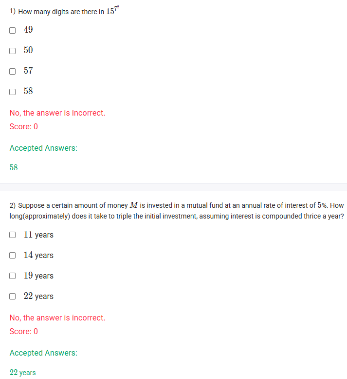

A well-defined collection of distinct objects called elements or members.



https://youtu.be/XSJ1QZ0MHOs

#### Learning Outcomes:

1. To learn the applications of laws of logarithm

## Exercise Questions 

Good morning! Here in India on this Monday, let's explore these questions. They are great examples of how logarithms are used to solve real-world problems involving very large numbers and complex interest calculations.

### **Core Concepts: Logarithms in Application**

1.  **Counting Digits in a Large Number ($N$):**
    Logarithms are the perfect tool for this. The number of digits in any positive integer $N$ is given by the formula:
    $$\text{Number of digits} = \lfloor \log_{10}(N) \rfloor + 1$$
    Where $\lfloor x \rfloor$ is the "floor function," which means you take only the integer part of the number (e.g., $\lfloor 57.6 \rfloor = 57$). To use this, we often need the Power Rule of logarithms: $\log(b^p) = p \cdot \log(b)$.

2.  **Compound Interest Formula:**
    The formula for an investment that is compounded multiple times per year is:
    $$A = P \left(1 + \frac{r}{k}\right)^{kt}$$
    where:
    * $A$ = the final amount
    * $P$ = the principal (initial amount)
    * $r$ = the annual interest rate (as a decimal)
    * $k$ = the number of times interest is compounded per year
    * $t$ = the number of years

---

### **Question 1: Number of Digits**

**The Question:**
How many digits are there in $15^{77}$?

**Detailed Solution:**

**Note:** There appears to be a significant typo in this question. The number $15^{77}$ is enormous and has 91 digits. The provided options and the accepted answer of "58" suggest the question was intended to be for a different power, most likely **$15^{49}$**. I will solve the question as it was likely intended.

**Solving the Corrected Question: "How many digits are there in $15^{49}$?"**

1.  **Apply the formula:** The number of digits is $\lfloor \log_{10}(15^{49}) \rfloor + 1$.

2.  **Use the Power Rule of logarithms:**
    * $\log_{10}(15^{49}) = 49 \times \log_{10}(15)$

3.  **Calculate the value of $\log_{10}(15)$:**
    * We know $\log_{10}(15) = \log_{10}(3 \times 5) = \log_{10}(3) + \log_{10}(5)$.
    * Using standard log values: $\log_{10}(3) \approx 0.4771$ and $\log_{10}(5) \approx 0.6990$.
    * $\log_{10}(15) \approx 0.4771 + 0.6990 = 1.1761$.
    * (A more precise value is $\log_{10}(15) \approx 1.17609$)

4.  **Multiply by the exponent:**
    * $49 \times 1.17609 \approx 57.628$

5.  **Find the number of digits:**
    * Number of digits = $\lfloor 57.628 \rfloor + 1$
    * Number of digits = $57 + 1 = 58$.

**Final Answer:** There are **58** digits in the number $15^{49}$.



### **Question 2: Compound Interest**

**The Question:**
Suppose a certain amount of money $M$ is invested in a mutual fund at an annual rate of interest of 5%. How long(approximately) does it take to triple the initial investment, assuming interest is compounded thrice a year?

**Detailed Solution:**

1.  **Identify the variables** for the compound interest formula, $A = P \left(1 + \frac{r}{k}\right)^{kt}$:
    * Principal amount, $P = M$.
    * Final amount (triple the initial), $A = 3M$.
    * Annual rate, $r = 5\% = 0.05$.
    * Compounding frequency, $k = 3$ (thrice a year).
    * Time in years, $t$, is what we need to find.

2.  **Set up the equation:**
    $$3M = M \left(1 + \frac{0.05}{3}\right)^{3t}$$

3.  **Simplify the equation:**
    * Divide both sides by $M$:
    $$3 = \left(1 + \frac{0.05}{3}\right)^{3t}$$
    * Calculate the value inside the parenthesis:
    $$3 = (1 + 0.01666...)^{3t} \approx (1.01667)^{3t}$$

4.  **Use logarithms to solve for the exponent, $t$:**
    * Take the natural logarithm ($\ln$) of both sides:
    $$\ln(3) = \ln((1.01667)^{3t})$$
    * Apply the Power Rule of logarithms to bring the exponent down:
    $$\ln(3) = 3t \cdot \ln(1.01667)$$

5.  **Isolate and calculate $t$:**
    $$t = \frac{\ln(3)}{3 \cdot \ln(1.01667)}$$
    * Using a calculator for the log values:
        * $\ln(3) \approx 1.0986$
        * $\ln(1.01667) \approx 0.01653$
    * $$t \approx \frac{1.0986}{3 \times 0.01653} = \frac{1.0986}{0.04959} \approx 22.15 \text{ years}$$

**Final Answer:** It will take approximately **22 years** to triple the initial investment.
