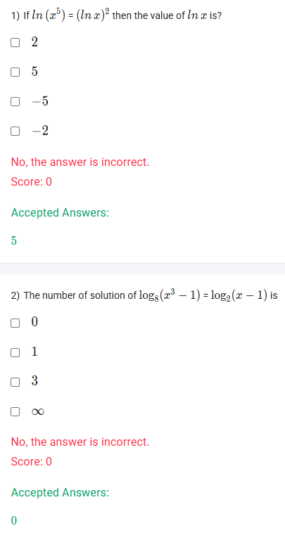

A well-defined collection of distinct objects called elements or members.



https://youtu.be/eMt8xq0Fuww

#### Learning Outcomes:

1. To learn the theorem of logarithm
2. To apply the ‘Change of base’ rule
3. To understand the proof of the ‘Change of base’ rule
4. To solve different numerical examples based on the aforementioned rules, laws and theorems

## Exercise Questions 🧠

Good morning! Here in India on this Monday, let's solve these logarithmic equations. These problems will make use of key logarithmic properties, including the Power Rule and the Change of Base formula.

### **Core Concepts: Laws and Formulas for Logarithms**

1.  **Power Rule:** This rule allows you to move an exponent from inside a logarithm to the front as a multiplier.
    $$\log_b(A^p) = p \cdot \log_b A$$

2.  **Change of Base Formula:** This lets you convert a logarithm from one base to another. This is very useful when solving equations with different log bases.
    $$\log_b A = \frac{\log_c A}{\log_c b}$$

3.  **Checking the Domain:** This is a crucial final step when solving any logarithmic equation. The argument of any logarithm must be **strictly positive**. Any potential solution that violates this condition must be discarded.

---

### **Question 1: Solving a Logarithmic Equation** (from file `image_9921d2.png`)

**The Question:**
If $\ln(x^5) = (\ln x)^2$ then the value of $\ln x$ is?
* 2
* 5
* -5
* -2

**Detailed Solution:**

1.  **State the Domain:** For the expression $\ln x$ to be defined, we must have $x > 0$.

2.  **Apply the Power Rule:** Use the power rule on the left side of the equation, $\ln(x^5)$, to bring the exponent 5 to the front.
    $$5 \ln x = (\ln x)^2$$

3.  **Rearrange into a Quadratic Equation:** Move all terms to one side to set the equation to zero. It's helpful to think of the term "$\ln x$" as a single variable, like '$u$'.
    $$(\ln x)^2 - 5 \ln x = 0$$

4.  **Solve the Quadratic:** This equation can be solved by factoring out the common term, $\ln x$.
    $$(\ln x)(\ln x - 5) = 0$$

5.  **Find the Possible Values for $\ln x$:** For the product to be zero, one of the factors must be zero.
    * **Possibility 1:** $\ln x = 0$
    * **Possibility 2:** $\ln x - 5 = 0 \implies \ln x = 5$

    Both of these lead to valid x-values ($x=e^0=1$ and $x=e^5$), which are in the domain ($x>0$). The question asks for the value of $\ln x$. The two possible values are 0 and 5.

6.  **Choose from the Options:** Looking at the given options, only 5 is listed.

**Final Answer:** The value of $\ln x$ is **5**.



### **Question 2: Number of Solutions** (from file `image_9921d2.png`)

**The Question:**
The number of solution of $\log_8(x^3 - 1) = \log_2(x - 1)$ is
* 0
* 1
* 3
* $\infty$

**Detailed Solution:**

1.  **Determine the Domain:** We find the values of $x$ for which all log arguments are positive.
    * For $\log_8(x^3 - 1)$: We need $x^3 - 1 > 0 \implies x^3 > 1 \implies x > 1$.
    * For $\log_2(x - 1)$: We need $x - 1 > 0 \implies x > 1$.
    * The combined domain for the entire equation is **$x > 1$**.

2.  **Change the Base:** The bases are 8 and 2. It's easiest to convert base 8 to base 2, since $8 = 2^3$. We use the Change of Base formula: $\log_b A = \frac{\log_c A}{\log_c b}$.
    * $\log_8(x^3-1) = \frac{\log_2(x^3-1)}{\log_2(8)}$
    * Since $\log_2(8) = 3$ (because $2^3=8$), this becomes:
    * $\log_8(x^3-1) = \frac{\log_2(x^3-1)}{3}$

3.  **Rewrite and Solve the Equation:**
    * Substitute the converted log back into the original equation:
    $$\frac{\log_2(x^3-1)}{3} = \log_2(x - 1)$$
    * Multiply both sides by 3:
    $$\log_2(x^3-1) = 3\log_2(x-1)$$
    * Use the Power Rule in reverse on the right side to move the 3 into the exponent:
    $$\log_2(x^3-1) = \log_2((x-1)^3)$$

4.  **Equate the Arguments:** Now that the bases are the same, we can set the arguments equal to each other.
    $$x^3-1 = (x-1)^3$$

5.  **Factor and Solve:**
    * The left side is a difference of cubes: $x^3-1 = (x-1)(x^2+x+1)$.
    * The equation becomes: $(x-1)(x^2+x+1) = (x-1)^3$.
    * Since our domain is $x>1$, we know that $(x-1)$ is not zero, so we can safely divide both sides by $(x-1)$:
    $$x^2+x+1 = (x-1)^2$$
    * Expand the right side:
    $$x^2+x+1 = x^2 - 2x + 1$$
    * Subtract $x^2$ and $1$ from both sides:
    $$x = -2x$$
    * Add $2x$ to both sides:
    $$3x = 0 \implies x = 0$$

6.  **Check the Solution against the Domain:**
    * Our potential solution is $x=0$.
    * Our domain requires $x>1$.
    * Since 0 is not greater than 1, the solution is extraneous and must be discarded.

**Final Answer:** There are **0** solutions.
