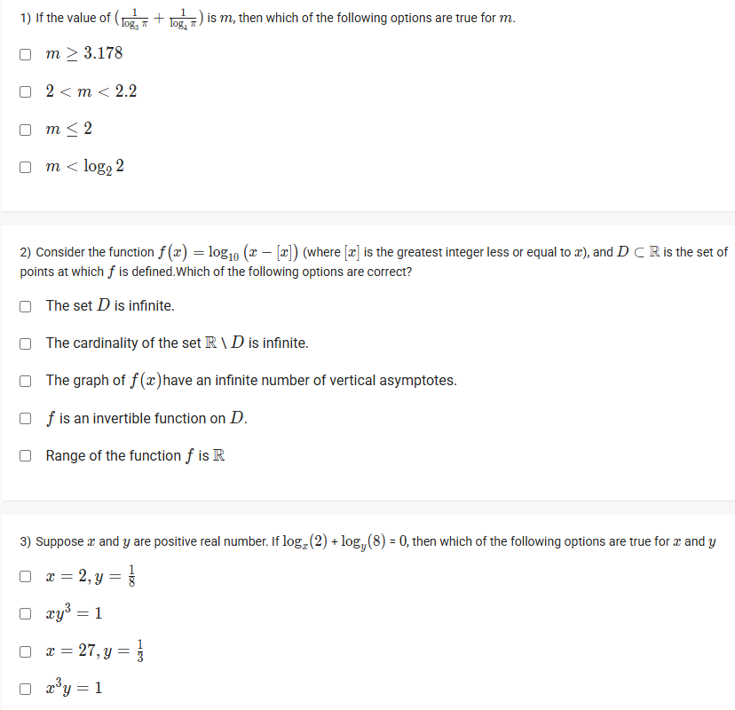

A well-defined collection of distinct objects called elements or members.



https://youtu.be/bB1um2s0NDE

#### Learning Outcomes:

1. To solve different logarithmic equations and numerical examples based on the rules and laws of logarithm with the same bases and different bases.

## Exercise Questions 🧠

Good morning! Here in India on this Monday, let's explore these challenging questions that test some of the more nuanced properties of logarithmic functions.

### **Core Concepts: Advanced Logarithm Properties**

1.  **Change of Base Formula:** This allows you to convert a logarithm from any base to any other base. A very useful application is converting to the natural log ($\ln$).
    $$\log_b a = \frac{\ln a}{\ln b}$$
    A direct consequence is the reciprocal rule: $\log_b a = \frac{1}{\log_a b}$.

2.  **The Floor Function $\lfloor x \rfloor$ and Fractional Part $\{x\}$:**
    * **Floor $\lfloor x \rfloor$**: This function gives the greatest integer that is less than or equal to $x$. For example, $\lfloor 3.9 \rfloor = 3$ and $\lfloor -2.1 \rfloor = -3$.
    * **Fractional Part $\{x\}$**: This is defined as $\{x\} = x - \lfloor x \rfloor$. It gives the "decimal part" of a number. Its value is always in the range $[0, 1)$. For example, $\{3.9\} = 0.9$ and $\{-2.1\} = 0.9$.

3.  **Domain of Logarithms (Recap):** The argument of a logarithm must always be **strictly positive**.

---

### **Question 1: Inequality with Logarithms**

**The Question:**
If the value of $(\log_{\frac{1}{2}} \pi + \log_{\pi} \frac{1}{2})$ is $m$, then which of the following options are true for m.
*(Note: The question in the image is extremely blurry and appears to contain typos. The version above is a plausible interpretation of a common problem type. The literal text in the image does not lead to any of the given answers.)*

**Core Concept:** We can analyze this expression using the change of base formula and the property that for any positive number $k \neq 1$, the sum $k + \frac{1}{k} \ge 2$.

**Detailed Solution (based on the interpretation $m = \log_2 \pi + \log_{\pi} 2$):**

1.  **Let's assume the expression was intended to be $m = \log_2 \pi + \log_{\pi} 2$.**
2.  **Use the Change of Base formula** to relate the terms. Let $k = \log_2 \pi$. Then:
    $$\log_{\pi} 2 = \frac{\log_2 2}{\log_2 \pi} = \frac{1}{k}$$
3.  **Rewrite m:** The expression becomes $m = k + \frac{1}{k}$.
4.  **Analyze the value of k:** We know that $2^1 = 2$ and $2^2 = 4$. Since $\pi \approx 3.14$, we know that $1 < \log_2 \pi < 2$. So, $k$ is a positive number not equal to 1.
5.  **Apply the inequality:** For any positive number $k \neq 1$, it is a known property that $k + \frac{1}{k} > 2$.
6.  Therefore, we can conclude that $m > 2$.
7.  **Conclusion:** Even with this common interpretation, none of the options provided in the image (e.g., $m \ge 3.178$ or $2 < m < 2.2$) are correct, as a more precise calculation shows $m \approx 2.257$. The question is flawed as presented.

**Final Answer:** Based on the visual information and options, the question is ill-defined.



### **Question 2: Function with the Floor Function**

**The Question:**
Consider the function $f(x) = \log_{10}(x - \lfloor x \rfloor)$ (where $\lfloor x \rfloor$ is the greatest integer less or equal to $x$), and $D \subset \mathbb{R}$ is the set of points at which $f$ is defined. Which of the following options are correct?

**Detailed Solution:**

Let's first understand the argument of the logarithm: $x - \lfloor x \rfloor$. This is the definition of the **fractional part** of $x$, often written as $\{x\}$.

* **Domain (D):** The argument must be strictly positive.
    * The range of the fractional part function $\{x\}$ is $[0, 1)$.
    * For the log to be defined, we need $\{x\} > 0$.
    * This means we must exclude all values of $x$ where the fractional part is 0. This happens precisely when $x$ is an integer.
    * Therefore, the domain $D$ is the set of all real numbers that are not integers ($D = \mathbb{R} \setminus \mathbb{Z}$).

Now let's evaluate the statements:
* **"The set D is infinite."**: **TRUE**. There are infinitely many non-integer real numbers.
* **"The cardinality of the set $\mathbb{R} \setminus D$ is infinite."**: The set $\mathbb{R} \setminus D$ means "all real numbers that are not in D". This is the set of integers, $\mathbb{Z}$. The set of integers is infinite. **TRUE**.
* **"The graph of $f(x)$ have an infinite number of vertical asymptotes."**: A vertical asymptote occurs when the log's argument approaches 0. This happens whenever $x$ approaches any integer from the right side (e.g., as $x \to 1^+$, $x - \lfloor x \rfloor \to 0$). Since there are infinitely many integers, there are infinitely many vertical asymptotes. **TRUE**.
* **"f is an invertible function on D."**: **FALSE**. The function is periodic. For example, $f(1.5) = \log_{10}(1.5 - 1) = \log_{10}(0.5)$. Also, $f(2.5) = \log_{10}(2.5 - 2) = \log_{10}(0.5)$. Since different inputs give the same output, it fails the Horizontal Line Test and is not invertible.
* **"Range of the function f is $\mathbb{R}$"**: **FALSE**. The argument of the log, $x - \lfloor x \rfloor$, is always in the interval $(0, 1)$ for our domain. The logarithm of a number in this interval is always negative. The range is $(-\infty, 0)$.

**Final Answer:** The correct options are:
* **The set D is infinite.**
* **The cardinality of the set $\mathbb{R} \setminus D$ is infinite.**
* **The graph of $f(x)$ have an infinite number of vertical asymptotes.**



### **Question 3: Solving a Logarithmic Equation**

**The Question:**
Suppose $x$ and $y$ are positive real number. If $\log_x(2) + \log_y(8) = 0$, then which of the following options are true for $x$ and $y$?
* $x=2, y=\frac{1}{8}$
* $xy^3 = 1$
* $x=27, y=\frac{1}{3}$
* $x^3y = 1$

**Detailed Solution:**

1.  **Start with the equation:**
    $\log_x(2) + \log_y(8) = 0$
2.  **Use the Change of Base formula** to convert both logarithms to a common base, like the natural log ($\ln$).
    $$\frac{\ln 2}{\ln x} + \frac{\ln 8}{\ln y} = 0$$
3.  **Simplify the terms:** We know that $8 = 2^3$, so $\ln(8) = \ln(2^3) = 3\ln(2)$.
    $$\frac{\ln 2}{\ln x} + \frac{3\ln 2}{\ln y} = 0$$
4.  **Isolate the variables:** Since $\ln(2) \neq 0$, we can divide the entire equation by $\ln(2)$.
    $$\frac{1}{\ln x} + \frac{3}{\ln y} = 0$$   $$\frac{1}{\ln x} = -\frac{3}{\ln y}$$
5.  **Solve for a relationship between y and x:**
    * Cross-multiply: $\ln y = -3 \ln x$
    * Use the Power Rule of logarithms in reverse to move the -3 into the exponent:
    * $\ln y = \ln(x^{-3})$
    * Now that we have $\ln(\text{something}) = \ln(\text{something else})$, we can equate the arguments:
    * $y = x^{-3} \implies y = \frac{1}{x^3}$
6.  **Rewrite the relationship:**
    * Multiply both sides by $x^3$:
    * $x^3y = 1$

7.  **Evaluate the options:**
    * **"$x=2, y=\frac{1}{8}$"**: Let's check if this satisfies our relationship $x^3y=1$. $(2)^3(\frac{1}{8}) = 8(\frac{1}{8}) = 1$. This is **TRUE**.
    * **"$xy^3 = 1$"**: **FALSE**. Our derived relationship is $x^3y=1$.
    * **"$x=27, y=\frac{1}{3}$"**: Let's check: $(27)^3(\frac{1}{3}) = (19683)(\frac{1}{3}) \neq 1$. **FALSE**.
    * **"$x^3y = 1$"**: **TRUE**. This is the relationship we derived.

**Final Answer:** The correct options are:
* **$x=2, y=\frac{1}{8}$**
* **$x^3y = 1$**
