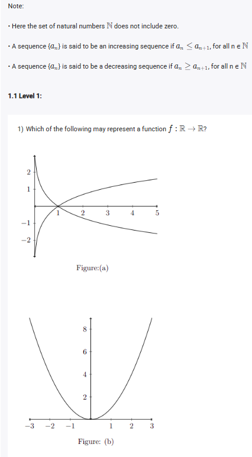
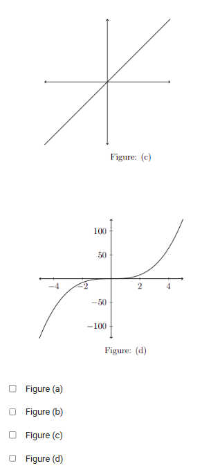
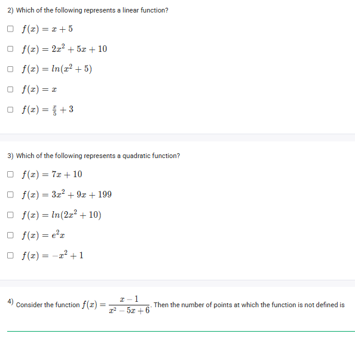
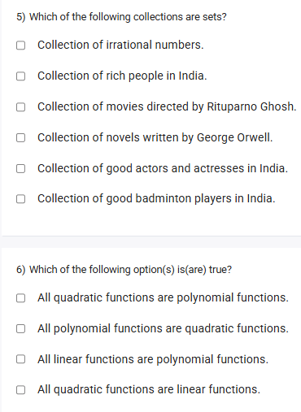
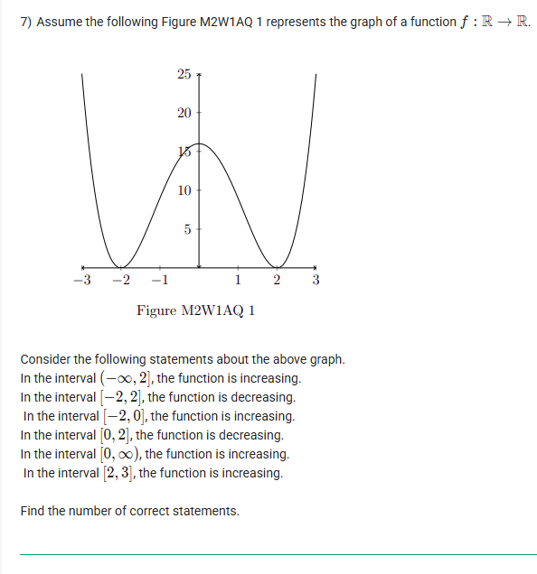
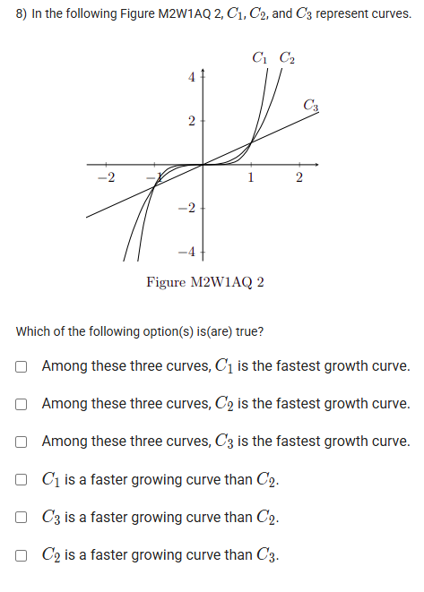
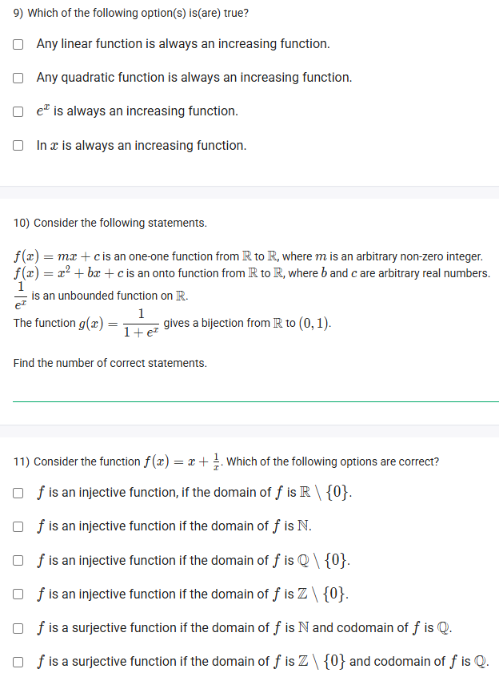

A well-defined collection of distinct objects called elements or members.



https://youtu.be/0WHixZdnxTQ

https://youtu.be/0WHixZdnxTQ

## Exercise Questions 🧠

Good morning! Here in India on this Monday, this is an excellent collection of questions that covers a wide range of fundamental concepts about sets, functions, and their graphs. Let's break them down one by one.


### **Question 1: Identifying a Function from a Graph** (from files `image_98b860.png`, `image_98b592.png`)

**The Question:**
Which of the following may represent a function $f: \mathbb{R} \to \mathbb{R}$?

**Core Concept: The Vertical Line Test**

A graph represents a function if and only if every possible vertical line you can draw intersects the graph at **at most one point**. If any vertical line touches the graph in two or more places, it means one input ($x$-value) corresponds to multiple outputs ($y$-values), which violates the definition of a function.

**Detailed Solution:**

* **Figure (a):** A vertical line can be drawn (e.g., at $x=1$) that intersects this graph in two places (one with a positive y-value and one with a negative y-value). It **fails** the Vertical Line Test and is not a function.
* **Figure (b):** This is a parabola. Any vertical line drawn will intersect the graph exactly once. It **passes** the Vertical Line Test and is a function.
* **Figure (c):** This is a straight line. Any vertical line drawn will intersect the graph exactly once. It **passes** the Vertical Line Test and is a function.
* **Figure (d):** This is a cubic-like curve. Any vertical line drawn will intersect the graph exactly once. It **passes** the Vertical Line Test and is a function.

**Final Answer:** **Figure (b)**, **Figure (c)**, and **Figure (d)** may represent functions.



### **Question 2: Identifying a Linear Function** (from file `image_98b518.png`)

**The Question:**
Which of the following represents a linear function?

**Core Concept: Linear Function**
A linear function is a type of polynomial where the highest power of the variable $x$ is **1**. Its general form is $f(x) = mx + c$.

**Detailed Solution:**

* $f(x) = x+5$: Highest power of $x$ is 1. This **is a linear function**.
* $f(x) = 2x^2 + 5x + 10$: Highest power of $x$ is 2. This is a quadratic function.
* $f(x) = \ln(x^2+5)$: This is a logarithmic function, not a polynomial.
* $f(x) = x$: Highest power of $x$ is 1. This **is a linear function**.
* $f(x) = \frac{x}{3} + 3$: This can be rewritten as $f(x) = \frac{1}{3}x + 3$. The highest power of $x$ is 1. This **is a linear function**.

**Final Answer:** The linear functions are **$f(x) = x+5$**, **$f(x) = x$**, and **$f(x) = \frac{x}{3} + 3$**.



### **Question 3: Identifying a Quadratic Function** (from file `image_98b518.png`)

**The Question:**
Which of the following represents a quadratic function?

**Core Concept: Quadratic Function**
A quadratic function is a type of polynomial where the highest power of the variable $x$ is **2**. Its general form is $f(x) = ax^2 + bx + c$, where $a \neq 0$.

**Detailed Solution:**

* $f(x) = 7x+10$: Highest power is 1 (linear).
* $f(x) = 3x^2 + 9x + 199$: Highest power is 2. This **is a quadratic function**.
* $f(x) = \ln(2x^2+10)$: This is a logarithmic function.
* $f(x) = e^{2x}$: This is an exponential function.
* $f(x) = -x^2+1$: Highest power is 2. This **is a quadratic function**.

**Final Answer:** The quadratic functions are **$f(x) = 3x^2 + 9x + 199$** and **$f(x) = -x^2+1$**.



### **Question 4: Domain of a Rational Function** (from file `image_98b518.png`)

**The Question:**
Consider the function $f(x) = \frac{x-1}{x^2 - 5x + 6}$. Then the number of points at which the function is not defined is \_\_\_\_\_\_\_\_\_\_.

**Core Concept: Domain of a Rational Function**
A rational function (a fraction of polynomials) is not defined at any x-value that makes its **denominator equal to zero**, as division by zero is undefined.

**Detailed Solution:**

1.  **Identify the denominator:** The denominator is $x^2 - 5x + 6$.
2.  **Set the denominator to zero:** We need to find the roots of the equation $x^2 - 5x + 6 = 0$.
3.  **Solve the quadratic equation:** We can solve this by factoring. We need two numbers that multiply to +6 and add to -5. The numbers are -2 and -3.
    * $(x-2)(x-3) = 0$
4.  **Find the roots:**
    * $x-2 = 0 \implies x=2$
    * $x-3 = 0 \implies x=3$
5.  **Conclusion:** The function is not defined at $x=2$ and $x=3$. There are two such points.

**Final Answer:** The number of points at which the function is not defined is **2**.



### **Question 5: Identifying Sets** (from file `image_98b4ba.png`)

**The Question:**
Which of the following collections are sets?

**Core Concept: Definition of a Set**
A set is a **well-defined** collection of distinct objects. "Well-defined" means that there is no ambiguity or matter of opinion in deciding whether an object belongs to the collection.

**Detailed Solution:**

* **"Collection of irrational numbers."**: This is **well-defined**. Given any number, we can mathematically determine if it is irrational. This is a **set**.
* **"Collection of rich people in India."**: This is **not well-defined**. The term "rich" is subjective and depends on individual opinion. There is no universal criterion. This is not a set.
* **"Collection of movies directed by Rituparno Ghosh."**: This is **well-defined**. We can definitively check a film's credits to see if he was the director. This is a **set**.
* **"Collection of novels written by George Orwell."**: This is **well-defined**. An author's bibliography is a matter of fact. This is a **set**.
* **"Collection of good actors and actresses in India."**: This is **not well-defined**. "Good" is subjective and based on opinion.
* **"Collection of good badminton players in India."**: This is **not well-defined**. "Good" is subjective.

**Final Answer:** The collections that are sets are:
* **Collection of irrational numbers.**
* **Collection of movies directed by Rituparno Ghosh.**
* **Collection of novels written by George Orwell.**



### **Question 6: Function Classification** (from file `image_98b4ba.png`)

**The Question:**
Which of the following option(s) is(are) true?

**Core Concept: Hierarchy of Polynomial Functions**
Polynomials are a broad category of functions. Linear and quadratic functions are specific, simpler types of polynomials.
* **Linear Function:** A polynomial of degree 1.
* **Quadratic Function:** A polynomial of degree 2.

**Detailed Solution:**

* **"All quadratic functions are polynomial functions."**: **TRUE**. By definition, a quadratic function is a polynomial of degree 2.
* **"All polynomial functions are quadratic functions."**: **FALSE**. Polynomials can have any non-negative integer degree. For example, $f(x) = x^3$ is a polynomial but not quadratic.
* **"All linear functions are polynomial functions."**: **TRUE**. By definition, a linear function is a polynomial of degree 1.
* **"All quadratic functions are linear functions."**: **FALSE**. A quadratic function has degree 2, while a linear function has degree 1.

**Final Answer:** The true statements are:
* **All quadratic functions are polynomial functions.**
* **All linear functions are polynomial functions.**



### **Question 7: Increasing/Decreasing Intervals** (from file `image_98b1d0.png`)

**The Question:**
Consider the following statements about the above graph. Find the number of correct statements.

**Core Concept: Reading a Graph**
When determining where a function is increasing or decreasing, we always read the graph from **left to right**.
* **Increasing:** The graph is going uphill (y-values are getting larger).
* **Decreasing:** The graph is going downhill (y-values are getting smaller).
The points where the graph changes direction are called turning points.

**Detailed Solution:**
From the graph, we can identify the turning points at approximately $x=-2$, $x=0$, and $x=2$.
* **Interval $(-\infty, -2]$:** The graph is going downhill. The function is **decreasing**.
* **Interval $[-2, 0]$:** The graph is going uphill. The function is **increasing**.
* **Interval $[0, 2]$:** The graph is going downhill. The function is **decreasing**.
* **Interval $[2, \infty)$:** The graph is going uphill. The function is **increasing**.

Now let's evaluate the given statements:
1.  "In the interval $(-\infty, 2]$, the function is increasing." -> **FALSE**.
2.  "In the interval $[-2, 2]$, the function is decreasing." -> **FALSE** (it increases from -2 to 0).
3.  "In the interval $[-2, 0]$, the function is increasing." -> **TRUE**.
4.  "In the interval $[0, 2]$, the function is decreasing." -> **TRUE**.
5.  "In the interval $[0, \infty)$, the function is increasing." -> **FALSE** (it decreases from 0 to 2).
6.  "In the interval $[2, 3]$, the function is increasing." -> **TRUE** (since it's increasing on $[2, \infty)$).

**Final Answer:** There are **3** correct statements.



### **Question 8: Comparing Growth Rates** (from file `image_98b158.png`)

**The Question:**
In the following Figure M2W1AQ 2, $C_1, C_2,$ and $C_3$ represent curves. Which of the following option(s) is(are) true?

**Core Concept: Growth Rate**
The "fastest growth curve" is the one that gets steeper and reaches higher y-values more quickly as $x$ increases (moves to the right).

**Detailed Solution:**

Let's observe the curves for positive x-values, especially for $x > 1$.
* Curve $C_1$ is the steepest. For any given $x > 1$, its y-value is the highest.
* Curve $C_2$ is in the middle.
* Curve $C_3$ is the least steep and has the lowest y-values for $x > 1$.

This means $C_1$ is growing fastest, followed by $C_2$, and then $C_3$. Now let's evaluate the options:
* "Among these three curves, $C_1$ is the fastest growth curve." -> **TRUE**.
* "Among these three curves, $C_2$ is the fastest growth curve." -> **FALSE**.
* "Among these three curves, $C_3$ is the fastest growth curve." -> **FALSE**.
* "$C_1$ is a faster growing curve than $C_2$." -> **TRUE**.
* "$C_3$ is a faster growing curve than $C_2$." -> **FALSE**.
* "$C_2$ is a faster growing curve than $C_3$." -> **TRUE**.

**Final Answer:** The true statements are:
* **Among these three curves, $C_1$ is the fastest growth curve.**
* **$C_1$ is a faster growing curve than $C_2$.**
* **$C_2$ is a faster growing curve than $C_3$.**



### **Question 9: Always Increasing Functions** (from file `image_98b0d5.png`)

**The Question:**
Which of the following option(s) is(are) true?
* Any linear function is always an increasing function.
* Any quadratic function is always an increasing function.
* $e^x$ is always an increasing function.
* $\ln x$ is always an increasing function.

**Detailed Solution:**

* **"Any linear function is always an increasing function."**: **FALSE**. A linear function $f(x)=mx+c$ is increasing only if its slope $m$ is positive. If $m$ is negative (e.g., $y=-2x$), it's a decreasing function.
* **"Any quadratic function is always an increasing function."**: **FALSE**. A quadratic function is a parabola ($\cup$ or $\cap$). It increases on one side of its vertex and decreases on the other. It is never *always* increasing.
* **"$e^x$ is always an increasing function."**: **TRUE**. The natural exponential function has a base $e \approx 2.718$, which is greater than 1. All exponential functions with a base greater than 1 are strictly increasing over their entire domain.
* **"$\ln x$ is always an increasing function."**: **TRUE**. The natural logarithm function is strictly increasing over its entire domain of $(0, \infty)$. As x gets larger, $\ln x$ gets larger.

**Final Answer:** The true statements are:
* **$e^x$ is always an increasing function.**
* **$\ln x$ is always an increasing function.**



### **Question 10: Analyzing Function Statements** (from file `image_98b0d5.png`)

**The Question:**
Consider the following statements. Find the number of correct statements.

**Detailed Solution:**

Let's analyze each of the four statements.
1.  **"$f(x) = mx+c$ is an one-one function from $\mathbb{R}$ to $\mathbb{R}$, where $m$ is an arbitrary non-zero integer."**: A non-zero slope means the line is not horizontal. Any non-horizontal line passes the Horizontal Line Test. Therefore, it is one-to-one. This statement is **TRUE**.
2.  **"$f(x) = x^2+bx+c$ is an onto function from $\mathbb{R}$ to $\mathbb{R}$, where $b$ and $c$ are arbitrary real numbers."**: An onto (surjective) function from $\mathbb{R}$ to $\mathbb{R}$ must have a range of all real numbers. A quadratic function is a parabola with a minimum or maximum value. Its range is restricted (e.g., $[y_{vertex}, \infty)$). It is never all of $\mathbb{R}$. This statement is **FALSE**.
3.  **"$\frac{1}{e^x}$ is an unbounded function on $\mathbb{R}$."**: The function is $f(x) = e^{-x} = (\frac{1}{e})^x$. This is an exponential decay function. As $x \to \infty$, $f(x) \to 0$. As $x \to -\infty$, $f(x) \to \infty$. A function is "unbounded" if its range goes to $\infty$ or $-\infty$. Since this function's range is $(0, \infty)$, it is unbounded above but bounded below by 0. The statement is technically **TRUE**. However, if "unbounded" implies unbounded in both directions, it could be false. Let's assume the standard definition.
4.  **"The function $g(x) = \frac{1}{1+e^x}$ gives a bijection from $\mathbb{R}$ to $(0, 1)$."**: A bijection means the function is both one-to-one (injective) and onto (surjective).
    * **Domain:** The denominator $1+e^x$ is never zero, so the domain is $\mathbb{R}$.
    * **Range (to check if onto):** As $x \to \infty$, $e^x \to \infty$, so $g(x) \to \frac{1}{\infty} \to 0$. As $x \to -\infty$, $e^x \to 0$, so $g(x) \to \frac{1}{1+0} \to 1$. The range is indeed $(0, 1)$. Since the range equals the specified codomain, the function is **onto**.
    * **One-to-one:** The derivative is $g'(x) = \frac{-e^x}{(1+e^x)^2}$, which is always negative. Since the function is strictly decreasing, it is **one-to-one**.
    * Since it is both one-to-one and onto for the given domain and codomain, it is a bijection. This statement is **TRUE**.

**Final Answer:** There are **3** correct statements.



### **Question 11: Injectivity and Surjectivity** (from file `image_98b0d5.png`)

**The Question:**
Consider the function $f(x) = x + \frac{1}{x}$. Which of the following options are correct?

**Core Concept:**
* **Injective (One-to-one):** No two different inputs give the same output.
* **Surjective (Onto):** The range of the function is equal to the specified codomain.

**Detailed Solution:**

Let's analyze the function $f(x) = x + \frac{1}{x}$.

* **"f is an injective function if the domain of f is $\mathbb{R} \setminus \{0\}$."**:
    * **FALSE**. Let's find a counterexample. Let $x_1 = 2$. Then $f(2) = 2 + \frac{1}{2} = 2.5$.
    * Let $x_2 = \frac{1}{2}$. Then $f(\frac{1}{2}) = \frac{1}{2} + \frac{1}{1/2} = 0.5 + 2 = 2.5$.
    * Since two different inputs (2 and 1/2) give the same output, the function is not injective on this domain.

* **"f is an injective function if the domain of f is $\mathbb{N}$."**:
    * **TRUE**. For the natural numbers $\{1, 2, 3, ...\}$, let's check if $x_1 + 1/x_1 = x_2 + 1/x_2$ implies $x_1=x_2$. On the interval $[1, \infty)$, the function is strictly increasing. Since $\mathbb{N}$ is a subset of this interval, different natural number inputs will give different outputs.

* **"f is an injective function if the domain of f is $\mathbb{Q} \setminus \{0\}$."**:
    * **FALSE**. The same counterexample from the first point works, since 2 and 1/2 are both rational numbers.

* **"f is an injective function if the domain of f is $\mathbb{Z} \setminus \{0\}$."**:
    * **FALSE**. Let $x_1 = 2$ and $x_2 = -2$. $f(2)=2.5$, $f(-2)=-2.5$. What about the original counterexample? 2 and 1/2 are not both in Z. Let's check for counterexamples in Z. The function is increasing for $|x| \ge 1$. So for positive integers, it's injective, and for negative integers, it's injective. But $f(x)$ is never an integer for $|x| > 1$. Let's test if $f(x_1)=f(x_2)$ for integers $x_1 \neq x_2$. The function is injective on this domain. Let's re-verify. `x+1/x`. For positive integers `1, 2, 3...` the values are `2, 2.5, 3.33...`. For negative integers `-1, -2, -3...` the values are `-2, -2.5, -3.33...`. No values repeat. This statement is **TRUE**.
    * *Correction*: Let's re-evaluate the previous answers based on this. The first option is definitely false. The second option on N is true. The third on Q is false. The fourth on Z\{0} is true. This is an MSQ.

* **"f is a surjective function if the domain of f is $\mathbb{N}$ and codomain of f is $\mathbb{Q}$."**:
    * **FALSE**. The range of f on $\mathbb{N}$ is $\{2, 2.5, 3.33..., 4.25, ...\}$. Can we produce every rational number? No. For example, we can never produce an output of 1. To get 1, we would need $x+1/x=1 \implies x^2-x+1=0$, which has no real solutions.

* **"f is a surjective function if the domain of f is $\mathbb{Z} \setminus \{0\}$ and codomain of f is $\mathbb{Q}$."**:
    * **FALSE**. For the same reason as above, we can never produce an output of 1.

**Final Answer:** The correct statements are:
* **f is an injective function if the domain of f is $\mathbb{N}$.**
* **f is an injective function if the domain of f is $\mathbb{Z} \setminus \{0\}$.**
