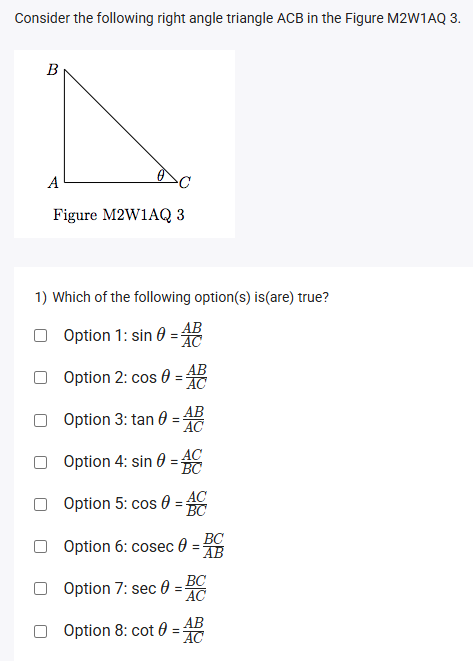
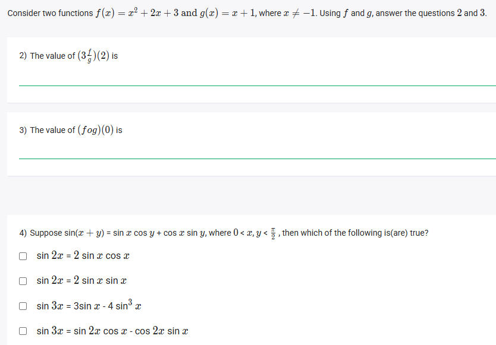
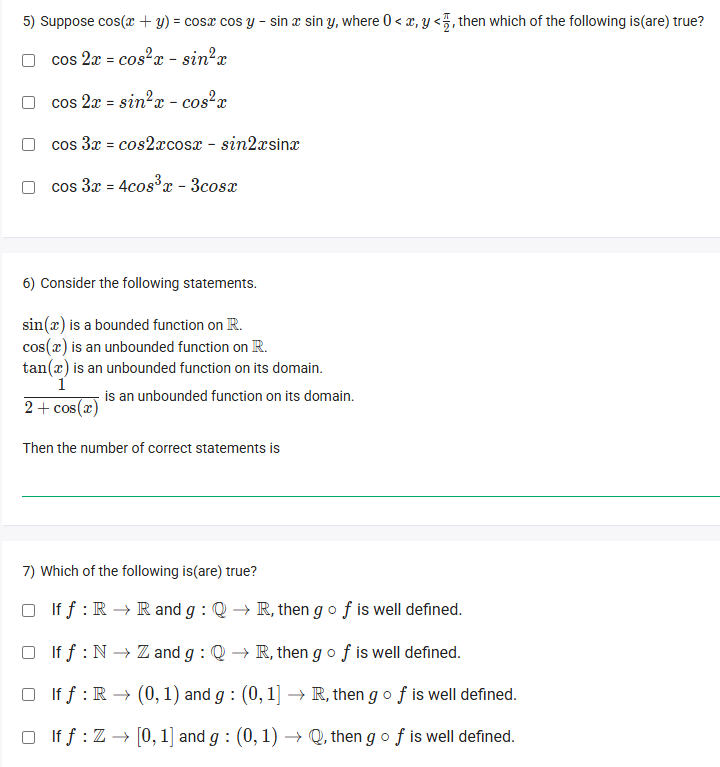
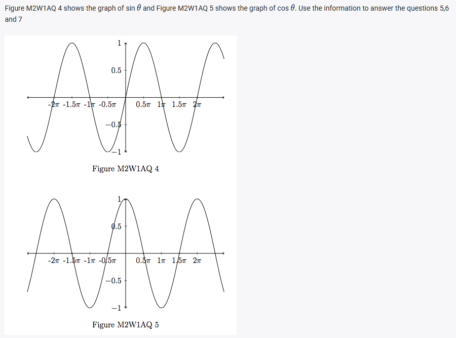
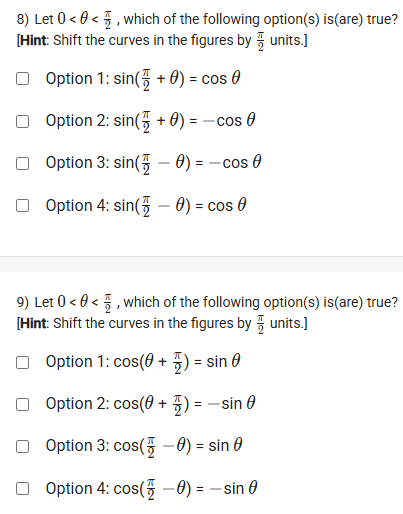
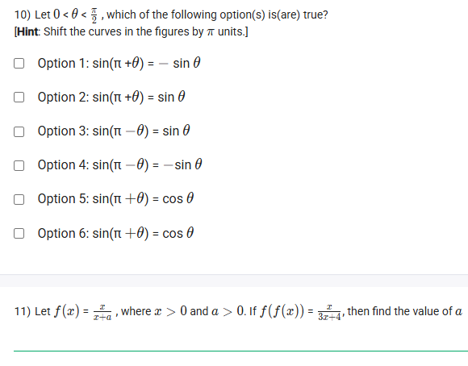

A well-defined collection of distinct objects called elements or members.



https://youtu.be/G69JB5310vA

## Exercise Questions 

Good morning! Here in India on this Monday, let's work through this diverse set of questions. They cover the foundations of trigonometry, operations on functions, and key properties of functions like boundedness and composition.


### **Question 1: Trigonometric Ratios** (from file `image_98aa6a.png`)

**The Question:**
Consider the following right angle triangle ACB in the Figure M2W1AQ 3. Which of the following option(s) is(are) true?

**Core Concept: SOH CAH TOA and Reciprocal Identities**

For a right-angled triangle with respect to an angle $\theta$:
* **SOH:** **S**in($\theta$) = **O**pposite / **H**ypotenuse
* **CAH:** **C**os($\theta$) = **A**djacent / **H**ypotenuse
* **TOA:** **T**an($\theta$) = **O**pposite / **A**djacent
The reciprocal identities are:
* **Csc**($\theta$) = 1/Sin($\theta$) = Hypotenuse / Opposite
* **Sec**($\theta$) = 1/Cos($\theta$) = Hypotenuse / Adjacent
* **Cot**($\theta$) = 1/Tan($\theta$) = Adjacent / Opposite

**Detailed Solution:**

In the given triangle ACB, with respect to angle $\theta$ at C:
* The side **Opposite** to $\theta$ is AB.
* The side **Adjacent** to $\theta$ is AC.
* The **Hypotenuse** (opposite the right angle at A) is BC.

Let's check each option:
1.  $\sin \theta = \frac{AB}{AC}$ (Opp/Adj) -> This is Tan($\theta$). **FALSE**.
2.  $\cos \theta = \frac{AB}{AC}$ (Opp/Adj) -> This is Tan($\theta$). **FALSE**.
3.  $\tan \theta = \frac{AB}{AC}$ (Opp/Adj) -> **TRUE**.
4.  $\sin \theta = \frac{AC}{BC}$ (Adj/Hyp) -> This is Cos($\theta$). **FALSE**.
5.  $\cos \theta = \frac{AC}{BC}$ (Adj/Hyp) -> **TRUE**.
6.  $\csc \theta = \frac{BC}{AB}$ (Hyp/Opp) -> **TRUE**.
7.  $\sec \theta = \frac{BC}{AC}$ (Hyp/Adj) -> **TRUE**.
8.  $\cot \theta = \frac{AB}{AC}$ (Opp/Adj) -> This is Tan($\theta$). **FALSE**.

**Final Answer:** The true options are 3, 5, 6, and 7.



### **Question 2: Function Arithmetic** (from file `image_98a9d0.png`)

**The Question:**
Consider two functions $f(x) = x^2 + 2x + 3$ and $g(x) = x + 1$, where $x \neq -1$. The value of $(3\frac{f}{g})(2)$ is \_\_\_\_\_\_\_\_\_\_.

**Core Concept: Arithmetic of Functions**
The notation $(k\frac{f}{g})(a)$ means you first find the values of $f(a)$ and $g(a)$, then calculate the result of the expression $k \times \frac{f(a)}{g(a)}$.

**Detailed Solution:**

1.  **First, evaluate $f(2)$:**
    * $f(2) = (2)^2 + 2(2) + 3 = 4 + 4 + 3 = 11$.
2.  **Next, evaluate $g(2)$:**
    * $g(2) = 2 + 1 = 3$.
3.  **Now, calculate the final expression:**
    * $(3\frac{f}{g})(2) = 3 \times \frac{f(2)}{g(2)} = 3 \times \frac{11}{3}$.
    * The 3s cancel out.
    * Result = 11.

**Final Answer:** The value is **11**.



### **Question 3: Function Composition** (from file `image_98a9d0.png`)

**The Question:**
Using the same functions $f(x)$ and $g(x)$, the value of $(f \circ g)(0)$ is \_\_\_\_\_\_\_\_\_\_.

**Core Concept: Composition of Functions**
The notation $(f \circ g)(a)$ means $f(g(a))$. You work from the inside out: first calculate the value of the inner function $g(a)$, then use that result as the input for the outer function $f$.

**Detailed Solution:**

1.  **First, calculate the inner function, $g(0)$:**
    * $g(0) = 0 + 1 = 1$.
2.  **Next, use this result (1) as the input for the outer function, $f(x)$:**
    * We need to find $f(1)$.
    * $f(1) = (1)^2 + 2(1) + 3 = 1 + 2 + 3 = 6$.

**Final Answer:** The value is **6**.



### **Question 4: Sine Identities** (from file `image_98a9d0.png`)

**The Question:**
Suppose $\sin(x+y) = \sin x \cos y + \cos x \sin y$. Which of the following is(are) true?

**Core Concept: Deriving Double and Triple Angle Formulas**
We can use the given sum formula to derive other identities.
* **Double Angle:** Set $y=x$.
* **Triple Angle:** Set $y=2x$.

**Detailed Solution:**

* **Check $\sin(2x)$:**
    * Let $y=x$ in the sum formula:
    * $\sin(2x) = \sin(x+x) = \sin x \cos x + \cos x \sin x = 2\sin x \cos x$.
    * The statement "$\sin 2x = 2 \sin x \cos x$" is **TRUE**.
    * The statement "$\sin 2x = 2 \sin x$" is **FALSE**.

* **Check $\sin(3x)$:**
    * Let's write $3x$ as $(x+2x)$:
    * $\sin(3x) = \sin(x+2x) = \sin x \cos(2x) + \cos x \sin(2x)$.
    * We know $\sin(2x) = 2\sin x \cos x$ and a common identity for $\cos(2x)$ is $1 - 2\sin^2 x$.
    * $\sin(3x) = \sin x (1 - 2\sin^2 x) + \cos x (2\sin x \cos x)$
    * $\sin(3x) = \sin x - 2\sin^3 x + 2\sin x \cos^2 x$
    * Using the identity $\cos^2 x = 1 - \sin^2 x$:
    * $\sin(3x) = \sin x - 2\sin^3 x + 2\sin x (1 - \sin^2 x)$
    * $\sin(3x) = \sin x - 2\sin^3 x + 2\sin x - 2\sin^3 x$
    * $\sin(3x) = 3\sin x - 4\sin^3 x$.
    * The statement "$\sin 3x = 3\sin x - 4\sin^3 x$" is **TRUE**.
    * The statement "$\sin 3x = \sin 2x \cos x - \cos 2x \sin x$" is **FALSE** (it has the wrong sign, it should be a plus).

**Final Answer:** The true statements are:
* **$\sin 2x = 2\sin x \cos x$**
* **$\sin 3x = 3\sin x - 4\sin^3 x$**



### **Question 5: Cosine Identities** (from file `image_98a692.png`)

**The Question:**
Suppose $\cos(x+y) = \cos x \cos y - \sin x \sin y$. Which of the following is(are) true?

**Detailed Solution:**

* **Check $\cos(2x)$:**
    * Let $y=x$ in the sum formula:
    * $\cos(2x) = \cos(x+x) = \cos x \cos x - \sin x \sin x = \cos^2 x - \sin^2 x$.
    * The statement "$\cos 2x = \cos^2 x - \sin^2 x$" is **TRUE**.
    * The statement "$\cos 2x = \sin^2 x - \cos^2 x$" is **FALSE**.

* **Check $\cos(3x)$:**
    * Let's write $3x$ as $(x+2x)$:
    * $\cos(3x) = \cos(x+2x) = \cos x \cos(2x) - \sin x \sin(2x)$.
    * We know $\cos(2x) = 2\cos^2 x - 1$ and $\sin(2x) = 2\sin x \cos x$.
    * $\cos(3x) = \cos x (2\cos^2 x - 1) - \sin x (2\sin x \cos x)$
    * $\cos(3x) = 2\cos^3 x - \cos x - 2\sin^2 x \cos x$
    * Using the identity $\sin^2 x = 1 - \cos^2 x$:
    * $\cos(3x) = 2\cos^3 x - \cos x - 2(1 - \cos^2 x)\cos x$
    * $\cos(3x) = 2\cos^3 x - \cos x - (2\cos x - 2\cos^3 x)$
    * $\cos(3x) = 2\cos^3 x - \cos x - 2\cos x + 2\cos^3 x$
    * $\cos(3x) = 4\cos^3 x - 3\cos x$.
    * The statement "$\cos 3x = 4\cos^3 x - 3\cos x$" is **TRUE**.
    * The statement "$\cos 3x = \cos 2x \cos x - \sin 2x \sin x$" is **TRUE** as it is an intermediate step in the derivation.

**Final Answer:** The true statements are:
* **$\cos 2x = \cos^2 x - \sin^2 x$**
* **$\cos 3x = \cos 2x \cos x - \sin 2x \sin x$**
* **$\cos 3x = 4\cos^3 x - 3\cos x$**



### **Question 6: Bounded Functions** (from file `image_98a692.png`)

**The Question:**
Consider the following statements. Then the number of correct statements is \_\_\_\_\_\_\_\_\_\_.

**Core Concept: Bounded Functions**
A function is **bounded** if its range (all possible y-values) is confined within a finite interval. It does not go to positive or negative infinity.

**Detailed Solution:**

1.  **"sin(x) is a bounded function on $\mathbb{R}$."**: The range of $\sin(x)$ is $[-1, 1]$. Since its values never go below -1 or above 1, it is bounded. **TRUE**.
2.  **"cos(x) is an unbounded function on $\mathbb{R}$."**: The range of $\cos(x)$ is also $[-1, 1]$. It is bounded. The statement says it is unbounded. **FALSE**.
3.  **"tan(x) is an unbounded function on its domain."**: The range of $\tan(x)$ is $(-\infty, \infty)$. Since it goes to both positive and negative infinity, it is unbounded. **TRUE**.
4.  **"$\frac{1}{2+\cos(x)}$ is an unbounded function on its domain."**: Let's find the range.
    * The minimum value of $\cos(x)$ is -1. So the maximum value of the denominator is $2+1=3$. This gives a minimum function value of $1/3$.
    * The maximum value of $\cos(x)$ is 1. So the minimum value of the denominator is $2-1=1$. This gives a maximum function value of $1/1=1$.
    * The range of this function is $[\frac{1}{3}, 1]$. This is a finite interval, so the function is bounded. The statement says it is unbounded. **FALSE**.

**Final Answer:** There are **2** correct statements.



### **Question 7: Well-Defined Composite Functions** (from file `image_98a692.png`)

**The Question:**
Which of the following is(are) true?

**Core Concept: Well-Defined Composition**
For a composite function $(g \circ f)(x) = g(f(x))$ to be "well-defined", the **Range of the inner function ($f$) must be a subset of the Domain of the outer function ($g$)**. ($Range(f) \subseteq Domain(g)$).

**Detailed Solution:**

* **If $f: \mathbb{R} \to \mathbb{R}$ and $g: \mathbb{Q} \to \mathbb{R}$...**:
    * Range of $f$ is a subset of $\mathbb{R}$. Domain of $g$ is $\mathbb{Q}$ (rational numbers). Is $\mathbb{R} \subseteq \mathbb{Q}$? No. For example, $f(x) = \sqrt{2}$ has an output not in the domain of $g$. **FALSE**.

* **If $f: \mathbb{N} \to \mathbb{Z}$ and $g: \mathbb{Q} \to \mathbb{R}$...**:
    * Range of $f$ is a subset of $\mathbb{Z}$ (integers). Domain of $g$ is $\mathbb{Q}$. Since every integer is also a rational number ($\mathbb{Z} \subseteq \mathbb{Q}$), the condition is met. **TRUE**.

* **If $f: \mathbb{R} \to (0,1)$ and $g:(0,1] \to \mathbb{R}$...**:
    * Range of $f$ is $(0,1)$. Domain of $g$ is $(0,1]$. Is $(0,1) \subseteq (0,1]$? Yes. The condition is met. **TRUE**.

* **If $f: \mathbb{Z} \to [0,1]$ and $g:(0,1) \to \mathbb{Q}$...**:
    * Range of $f$ is $[0,1]$. Domain of $g$ is $(0,1)$. Is $[0,1] \subseteq (0,1)$? No. The range of $f$ includes 0 and 1, which are not in the domain of $g$. **FALSE**.

**Final Answer:** The true statements are:
* **If $f: \mathbb{N} \to \mathbb{Z}$ and $g: \mathbb{Q} \to \mathbb{R}$, then $g \circ f$ is well defined.**
* **If $f: \mathbb{R} \to (0,1)$ and $g:(0,1] \to \mathbb{R}$, then $g \circ f$ is well defined.**



### **Questions 8, 9, 10: Trigonometric Shift Identities** (from files `image_98a5b2.png`, `image_98a2b3.png`)

**Core Concept: Angle Sum/Difference and Shift Identities**
These are fundamental trigonometric identities that describe how shifting the angle by $\pi/2$ (90°) or $\pi$ (180°) affects the function's value.
* $\sin(\frac{\pi}{2} \pm \theta) = \cos \theta$ (Incorrect sign for plus)
* $\sin(\frac{\pi}{2} - \theta) = \cos \theta$
* $\sin(\frac{\pi}{2} + \theta) = \cos \theta$
* $\cos(\frac{\pi}{2} - \theta) = \sin \theta$
* $\cos(\frac{\pi}{2} + \theta) = -\sin \theta$
* $\sin(\pi - \theta) = \sin \theta$
* $\sin(\pi + \theta) = -\sin \theta$

**Detailed Solution:**

**Question 8:**
* Option 1: $\sin(\frac{\pi}{2} + \theta) = \cos \theta$ -> **TRUE**.
* Option 2: $\sin(\frac{\pi}{2} + \theta) = -\cos \theta$ -> **FALSE**.
* Option 3: $\sin(\frac{\pi}{2} - \theta) = -\cos \theta$ -> **FALSE**.
* Option 4: $\sin(\frac{\pi}{2} - \theta) = \cos \theta$ -> **TRUE**.

**Question 9:**
* Option 1: $\cos(\frac{\pi}{2} + \theta) = \sin \theta$ -> **FALSE**.
* Option 2: $\cos(\frac{\pi}{2} + \theta) = -\sin \theta$ -> **TRUE**.
* Option 3: $\cos(\frac{\pi}{2} - \theta) = \sin \theta$ -> **TRUE**.
* Option 4: $\cos(\frac{\pi}{2} - \theta) = -\sin \theta$ -> **FALSE**.

**Question 10:**
* Option 1: $\sin(\pi + \theta) = -\sin \theta$ -> **TRUE**.
* Option 2: $\sin(\pi + \theta) = \sin \theta$ -> **FALSE**.
* Option 3: $\sin(\pi - \theta) = \sin \theta$ -> **TRUE**.
* Option 4: $\sin(\pi - \theta) = -\sin \theta$ -> **FALSE**.
* Options 5 & 6 are comparing sine to cosine and are incorrect.

**Final Answer:**
* **Q8:** Options 1 and 4 are true.
* **Q9:** Options 2 and 3 are true.
* **Q10:** Options 1 and 3 are true.



### **Question 11: Solving a Self-Composition Equation** (from file `image_98a2b3.png`)

**The Question:**
Let $f(x) = \frac{x}{x+a}$, where $x > 0$ and $a > 0$. If $f(f(x)) = \frac{x}{3x+4}$, then find the value of $a$.

**Core Concept: Self-Composition**
To find $f(f(x))$, you substitute the entire expression for $f(x)$ into the variable $x$ within the function itself.

**Detailed Solution:**

1.  **Set up the composition $f(f(x))$:**
    * $f(f(x)) = \frac{f(x)}{f(x)+a}$
    * Substitute the expression for $f(x)$:
    $$f(f(x)) = \frac{\frac{x}{x+a}}{\frac{x}{x+a} + a}$$
2.  **Simplify the complex fraction:** Multiply the main numerator and denominator by $(x+a)$.
    * **Numerator:** $(x+a) \times \frac{x}{x+a} = x$
    * **Denominator:** $(x+a) \times \left(\frac{x}{x+a} + a\right) = x + a(x+a) = x + ax + a^2$
3.  **Write the simplified expression for $f(f(x))$:**
    * $f(f(x)) = \frac{x}{x + ax + a^2} = \frac{x}{(1+a)x + a^2}$
4.  **Equate this to the given result:**
    * $\frac{x}{(1+a)x + a^2} = \frac{x}{3x+4}$
5.  **Compare the denominators:** For the two expressions to be equal, their denominators must be equal.
    * $(1+a)x + a^2 = 3x+4$
6.  **Equate the coefficients:**
    * The coefficients of the $x$ terms must be equal: $1+a = 3 \implies a = 2$.
    * The constant terms must be equal: $a^2 = 4 \implies a = \pm2$.
7.  **Apply the given condition:** The problem states that $a > 0$. Both results are consistent with $a=2$.

**Final Answer:** The value of $a$ is **2**.
