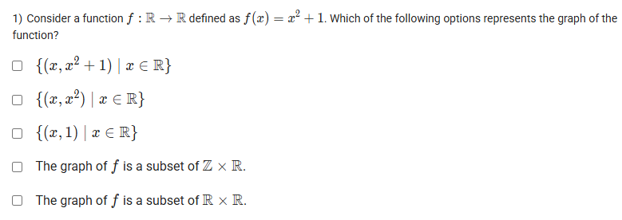
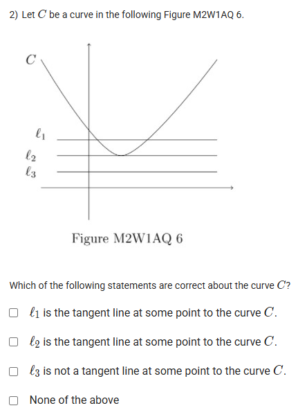
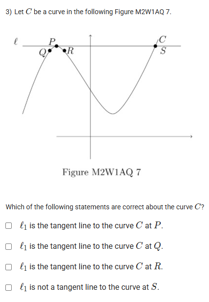
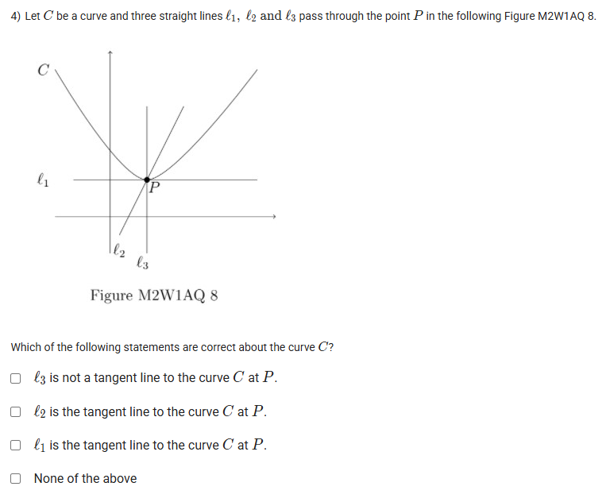
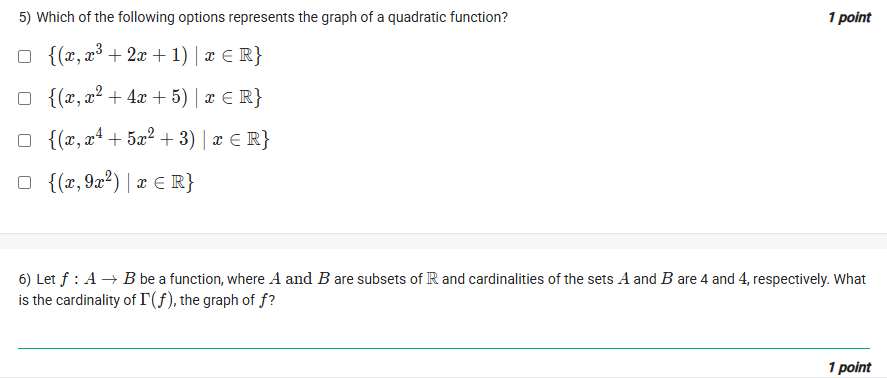
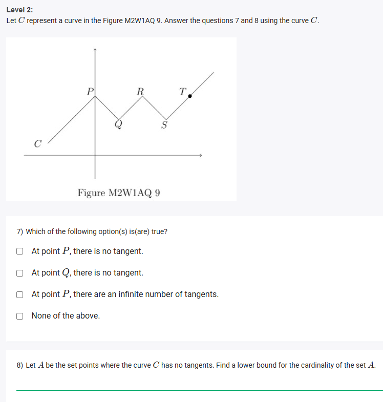
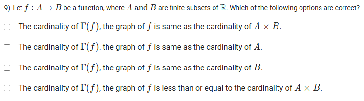

A well-defined collection of distinct objects called elements or members.



https://youtu.be/EIwT-ibJ7bA

## Exercise Questions 

Good morning! Here in India on this Monday, let's go through this excellent set of questions. They cover some very important foundational concepts, from the definition of a set and a function's graph to an introduction to the geometric idea of a tangent line.


### **Question 1: Graph of a Function** (from file `image_989e54.png`)

**The Question:**
Consider a function $f: \mathbb{R} \to \mathbb{R}$ defined as $f(x) = x^0 + 1$. Which of the following options represents the graph of the function?
* $\{(x, x^2+1) \mid x \in \mathbb{R}\}$
* $\{(x, x^2) \mid x \in \mathbb{R}\}$
* $\{(x, 1) \mid x \in \mathbb{R}\}$
* The graph of $f$ is a subset of $\mathbb{Z} \times \mathbb{R}$.
* The graph of $f$ is a subset of $\mathbb{R} \times \mathbb{R}$.

**Core Concept: The Graph of a Function and the Zero Exponent Rule**
* **Graph of a Function:** The graph of a function $f$ is the set of all ordered pairs $(x, f(x))$ where $x$ is an element of the domain.
* **Zero Exponent Rule:** For any non-zero real number $x$, $x^0 = 1$. In the context of functions from $\mathbb{R} \to \mathbb{R}$, it is a standard convention to define $0^0=1$ to ensure continuity.

**Detailed Solution:**

1.  **Simplify the function:** Following the convention, we define $x^0=1$ for all $x \in \mathbb{R}$.
    * $f(x) = x^0 + 1 = 1 + 1 = 2$.
    * This means that for any input $x$, the output is always 2. This is a constant function.
2.  **Represent the graph as a set:** The graph is the set of all points $(x, f(x))$, which is $\{(x, 2) \mid x \in \mathbb{R}\}$.
3.  **Evaluate the options:**
    * The first three options describe different functions and are incorrect.
    * **"The graph of $f$ is a subset of $\mathbb{Z} \times \mathbb{R}$."** This would mean the x-coordinates must be integers ($\mathbb{Z}$), but the domain is all real numbers ($\mathbb{R}$). This is **FALSE**.
    * **"The graph of $f$ is a subset of $\mathbb{R} \times \mathbb{R}$."** A graph on the Cartesian plane is a set of ordered pairs $(x, y)$ where both $x$ and $y$ are real numbers. This is the definition of the Cartesian product $\mathbb{R} \times \mathbb{R}$. Any function graph from $\mathbb{R} \to \mathbb{R}$ must be a subset of this. This is **TRUE**.

**Final Answer:** **The graph of $f$ is a subset of $\mathbb{R} \times \mathbb{R}$.**



### **Question 2: Tangent Lines to a Curve** (from file `image_984c91.png`)

**The Question:**
Let $C$ be a curve in the following Figure M2W1AQ 6. Which of the following statements are correct about the curve $C$?

**Core Concept: Tangent Lines**
A tangent line to a smooth curve at a given point is a straight line that "just touches" the curve at that point without crossing through it. It has the same direction (slope) as the curve at that exact point. A line that cuts through the curve is a secant line.

**Detailed Solution:**

* **Line $l_1$**: This line cuts through the parabola at two distinct points. It is a secant line, not a tangent line.
* **Line $l_2$**: This line touches the parabola at its lowest point (the vertex). It does not cross through the curve. This is the definition of a tangent line at the vertex. The statement **"$l_2$ is the tangent line at some point to the curve C"** is **TRUE**.
* **Line $l_3$**: This line does not intersect the curve at all. Therefore, it cannot be a tangent line. The statement **"$l_3$ is not a tangent line at some point to the curve C"** is also **TRUE**.

**Final Answer:** The correct statements are:
* **$l_2$ is the tangent line at some point to the curve $C$.**
* **$l_3$ is not a tangent line at some point to the curve $C$.**



### **Question 3: Tangent vs. Secant** (from file `image_984c35.png`)

**The Question:**
Let $C$ be a curve in the following Figure M2W1AQ 7. Which of the following statements are correct about the curve $C$?

**Detailed Solution:**

Let's examine the line labeled $\ell$ (which the options call $l_1$) and its relationship to the curve at the specified points.
* The line $\ell$ clearly intersects the curve at two points, $Q$ and $S$. A line that intersects a curve at two points is a **secant line**.
* **At point P:** The line $\ell$ passes above the curve. It does not touch the curve at P. Therefore, it is not a tangent at P.
* **At point Q:** The line $\ell$ passes *through* the curve. It is not a tangent at Q.
* **At point R:** The line $\ell$ passes below the curve. It does not touch the curve at R. Therefore, it is not a tangent at R.
* **At point S:** The line $\ell$ passes *through* the curve. It is not a tangent at S.

Based on this, the statement **"$l_1$ is not a tangent line to the curve $C$ at $S$"** is **TRUE**. All other statements claiming it *is* a tangent at P, Q, or R are false.

**Final Answer:** **$l_1$ is not a tangent line to the curve $C$ at $S$.**



### **Question 4: Identifying a Tangent Line** (from file `image_984bf7.png`)

**The Question:**
Let $C$ be a curve and three straight lines $l_1, l_2$ and $l_3$ pass through the point $P$. Which of the following statements are correct about the curve $C$?

**Detailed Solution:**

We must identify which of the three lines has the properties of a tangent at point P.
* **Line $l_3$**: This line clearly cuts through the curve at point P. It is a secant line.
* **Line $l_2$**: This line also cuts through the curve at point P, just at a different angle. It is also a secant line.
* **Line $l_1$**: This line just grazes the curve at point P, matching its curvature at that one point without crossing to the other side. This is the visual definition of a tangent line.

**Final Answer:** **$l_1$ is the tangent line to the curve $C$ at $P$.**



### **Question 5: Representing a Quadratic Function** (from file `image_984b7f.png`)

**The Question:**
Which of the following options represents the graph of a quadratic function?

**Core Concept: Quadratic Function**
A quadratic function is a function of the form $f(x) = ax^2 + bx + c$ where $a \neq 0$. Its graph is the set of all points $(x, y)$ such that $y = ax^2 + bx + c$.

**Detailed Solution:**
Let's examine the set notation for each option. The notation $\{(x, y) \mid \text{condition}\}$ represents a set of points.
* **Option 1:** $\{(x, x^3 + 2x + 1) \mid x \in \mathbb{R}\}$. This represents $y=x^3+2x+1$, which is a cubic function.
* **Option 2:** $\{(x, x^2 + 4x + 5) \mid x \in \mathbb{R}\}$. This represents $y=x^2+4x+5$, which has a highest power of 2. This **is a quadratic function**.
* **Option 3:** $\{(x, x^4 + 5x^2 + 3) \mid x \in \mathbb{R}\}$. This represents $y=x^4+5x^2+3$, which is a quartic (degree 4) function.
* **Option 4:** $\{(x, 9x^2) \mid x \in \mathbb{R}\}$. This represents $y=9x^2$, which has a highest power of 2. This **is a quadratic function**.

**Final Answer:**
* **$\{(x, x^2+4x+5) \mid x \in \mathbb{R}\}$**
* **$\{(x, 9x^2) \mid x \in \mathbb{R}\}$**



### **Question 6: Cardinality of a Function's Graph** (from file `image_984b7f.png`)

**The Question:**
Let $f: A \to B$ be a function, where A and B are subsets of $\mathbb{R}$ and cardinalities of the sets A and B are 4 and 4, respectively. What is the cardinality of $\Gamma(f)$, the graph of $f$?

**Core Concept: Cardinality of a Graph**
The graph of a function $f$ with domain $A$ is the set of all ordered pairs $(x, f(x))$ for every $x$ in $A$. By definition, a function assigns exactly one output for each input. Therefore, the number of ordered pairs in the graph is exactly equal to the number of elements in the domain.

**Detailed Solution:**
1.  The domain of the function is the set $A$.
2.  The cardinality of the domain is given as $|A| = 4$.
3.  The graph of the function consists of one point for each element in the domain.
4.  Therefore, the cardinality of the graph, $|\Gamma(f)|$, must be equal to the cardinality of the domain $A$.
5.  $|\Gamma(f)| = |A| = 4$.

**Final Answer:** The cardinality of the graph of $f$ is **4**.



### **Questions 7 & 8: Tangents on a Non-Smooth Curve** (from file `image_984897.png`)

**Core Concept: Differentiability and Tangents**
A tangent line can only be defined at a point where a curve is **smooth**. A tangent line does not exist at **sharp corners** or **cusps** because the direction of the curve is not uniquely defined at those points.

---
#### **7) Which of the following option(s) is(are) true?**

**Detailed Solution:**
Let's examine the curve $C$ at each point.
* **At point P:** There is a sharp corner. The curve changes direction abruptly. Therefore, there is **no tangent** at P.
* **At point Q:** There is another sharp corner. Therefore, there is **no tangent** at Q.
* **At points R and S:** The curve appears smooth at these points, so a tangent would exist.
* **At point T:** The line segment is straight, so the tangent is the line itself.

Evaluating the options:
* **"At point P, there is no tangent."** -> **TRUE**.
* **"At point Q, there is no tangent."** -> **TRUE**.
* **"At point P, there are an infinite number of tangents."** -> **FALSE**. There are none.

**Final Answer:**
* **At point P, there is no tangent.**
* **At point Q, there is no tangent.**

---
#### **8) Let A be the set points where the curve C has no tangents. Find a lower bound for the cardinality of the set A.**

**Detailed Solution:**
1.  From the previous question, we identified that the curve has no tangents at the sharp corners, which are points P and Q.
2.  Therefore, the set A must contain at least these two points: $\{P, Q\} \subseteq A$.
3.  This means the cardinality of A, $|A|$, must be at least 2.
4.  A lower bound for the cardinality is a number that it is guaranteed to be greater than or equal to.

**Final Answer:** A lower bound for the cardinality of the set A is **2**.



### **Question 9: Cardinality of a Graph (General Case)** (from file `image_98483b.png`)

**The Question:**
Let $f: A \to B$ be a function, where A and B are finite subsets of $\mathbb{R}$. Which of the following options are correct?

**Detailed Solution:**

As explained in Question 6, the graph of a function $f$ is the set of ordered pairs $(a, f(a))$ for every single element $a$ in the domain $A$.
* The number of these pairs is therefore exactly equal to the number of elements in $A$. So, $|\Gamma(f)| = |A|$.

Let's evaluate the options:
* **"The cardinality of $\Gamma(f)$... is same as the cardinality of $A \times B$."**: **FALSE**. The cardinality of the Cartesian product is $|A| \times |B|$. The cardinality of the graph is just $|A|$.
* **"The cardinality of $\Gamma(f)$... is same as the cardinality of $A$."**: **TRUE**. This is the definition.
* **"The cardinality of $\Gamma(f)$... is same as the cardinality of $B$."**: **FALSE**. This would only be true if the function were a bijection (both one-to-one and onto) *and* $|A|=|B|$. It is not true in general.
* **"The cardinality of $\Gamma(f)$... is less than or equal to the cardinality of $A \times B$."**: **TRUE**. Since $|\Gamma(f)| = |A|$ and $|A \times B| = |A| \times |B|$, and we assume B is not empty ($|B| \ge 1$), then $|A| \le |A| \times |B|$. While true, the second option is more precise.

**Final Answer:** The most precise correct statement is **"The cardinality of $\Gamma(f)$, the graph of $f$ is same as the cardinality of $A$."**
