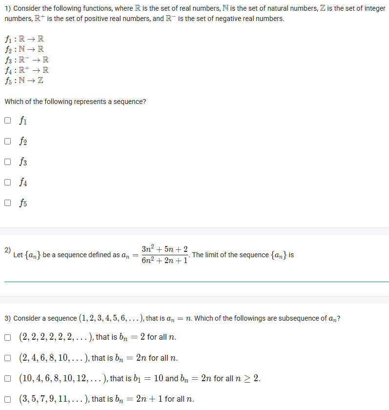
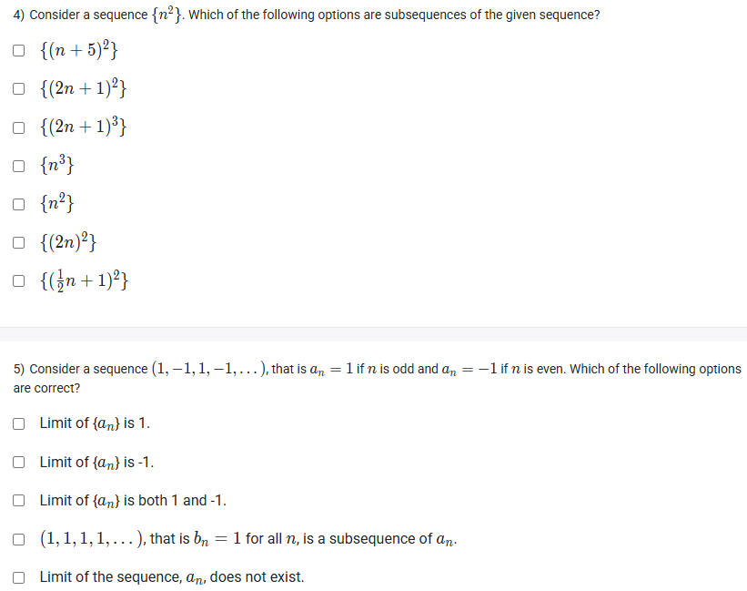
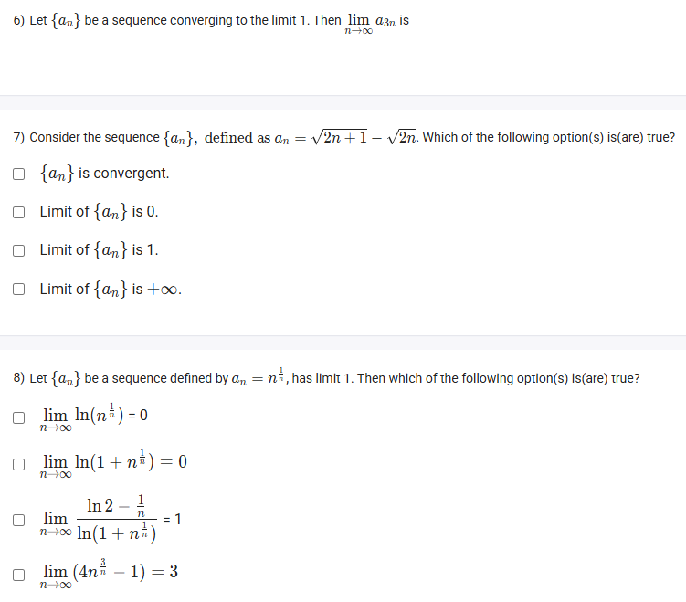
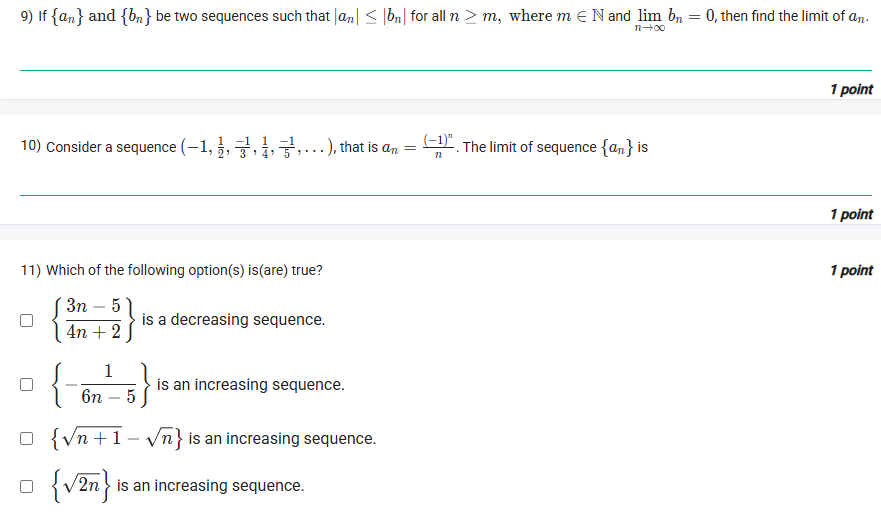

A well-defined collection of distinct objects called elements or members.



https://youtu.be/1uySBjXUR1k

## Exericse Questions

Good morning! Here in India on this Monday, let's work through this excellent set of questions covering the mathematical concept of **sequences and their limits**. This topic is a cornerstone of calculus and higher mathematics.

### **Core Concepts: Sequences and Limits**

1.  **What is a Sequence?** A sequence is a function whose domain is the set of natural numbers ($\mathbb{N} = \{1, 2, 3, ...\}$). It's an ordered list of numbers, like $a_1, a_2, a_3, ...$.

2.  **Convergence and Limits:** A sequence **converges** if its terms get closer and closer to a single, finite number as $n$ goes to infinity. This number is called the **limit**. If a sequence does not approach a single finite number, it **diverges**.

3.  **Subsequence:** A subsequence is a sequence formed by taking some elements from the original sequence, while keeping them in their original relative order. If a sequence converges to a limit $L$, every single one of its subsequences must also converge to $L$.

4.  **The Squeeze Theorem:** If a sequence $a_n$ is "squeezed" between two other sequences, $b_n$ and $c_n$, (i.e., $b_n \le a_n \le c_n$) and both $b_n$ and $c_n$ converge to the same limit $L$, then $a_n$ must also converge to $L$.

5.  **Monotonic Sequences:**
    * An **increasing** sequence is one where each term is greater than or equal to the previous one ($a_{n+1} \ge a_n$).
    * A **decreasing** sequence is one where each term is less than or equal to the previous one ($a_{n+1} \le a_n$).

---

### **Question 1: Definition of a Sequence** (from file `image_984037.png`)

**The Question:**
Which of the following represents a sequence?

**Detailed Solution:**
By definition, a sequence is a function whose domain is the set of natural numbers ($\mathbb{N}$) or a similar set like the non-negative integers. We need to find the functions listed that have a domain of $\mathbb{N}$ or $\mathbb{R}^+$ (positive real numbers, which includes $\mathbb{N}$).
* $f_1: \mathbb{R} \to \mathbb{R}$: Domain is all real numbers. Not a sequence.
* $f_2: \mathbb{N} \to \mathbb{R}$: Domain is the natural numbers. **This is a sequence.**
* $f_3: \mathbb{R}^- \to \mathbb{R}$: Domain is negative real numbers. Not a sequence.
* $f_4: \mathbb{R}^+ \to \mathbb{R}$: Domain is positive real numbers. This is a broader category, but a function defined on $\mathbb{N}$ could be restricted from this. However, $f_2$ is more precise.
* $f_5: \mathbb{N} \to \mathbb{Z}$: Domain is the natural numbers. **This is a sequence.**

**Final Answer:** **$f_2$** and **$f_5$** represent sequences.



### **Question 2: Limit of a Rational Sequence** (from file `image_984037.png`)

**The Question:**
Let $\{a_n\}$ be a sequence defined as $a_n = \frac{3n^2+5n+2}{6n^2+2n+1}$. The limit of the sequence $\{a_n\}$ is \_\_\_\_\_\_\_\_\_\_.

**Core Concept:** To find the limit of a rational function of $n$ as $n \to \infty$, we divide the numerator and the denominator by the highest power of $n$ present in the denominator.

**Detailed Solution:**
1.  The highest power of $n$ in the denominator is $n^2$.
2.  Divide every term in the expression by $n^2$:
    $$a_n = \frac{\frac{3n^2}{n^2} + \frac{5n}{n^2} + \frac{2}{n^2}}{\frac{6n^2}{n^2} + \frac{2n}{n^2} + \frac{1}{n^2}} = \frac{3 + \frac{5}{n} + \frac{2}{n^2}}{6 + \frac{2}{n} + \frac{1}{n^2}}$$
3.  Now, take the limit as $n \to \infty$. Any term with $n$ in the denominator will approach 0.
    $$\lim_{n\to\infty} a_n = \frac{3 + 0 + 0}{6 + 0 + 0} = \frac{3}{6} = \frac{1}{2}$$

**Final Answer:** The limit is **1/2**.



### **Question 3: Identifying Subsequences** (from file `image_984037.png`)

**The Question:**
Consider a sequence $(1, 2, 3, 4, 5, 6, ...)$, that is $a_n = n$. Which of the followings are subsequence of $a_n$?

**Detailed Solution:**
The original sequence is $\{1, 2, 3, 4, 5, 6, 7, 8, ...\}$. A subsequence must consist of terms from this sequence, in their correct order.
* **$b_n=2$ for all $n$**: This sequence is $(2, 2, 2, ...)$. This is **not a subsequence** because you can't pick the number 2 multiple times.
* **$b_n=2n$ for all $n$**: This sequence is $(2, 4, 6, 8, ...)$. All these terms are in the original sequence, and they are in the correct order. This **is a subsequence**.
* **$b_n=10$ and $b_n=2n$ for $n \ge 2$**: This sequence is $(10, 4, 6, 8, ...)$. This is **not a subsequence** because the terms are not in their original increasing order (10 comes after 4, 6, 8 in the original sequence).
* **$b_n=2n+1$ for all $n$**: This sequence is $(3, 5, 7, 9, ...)$. All these terms are in the original sequence, and they are in the correct order. This **is a subsequence**.

**Final Answer:** The subsequences are **$b_n=2n$** and **$b_n=2n+1$**.



### **Question 4: Subsequences of $\{n^2\}$** (from file `image_983d54.png`)

**The Question:**
Consider a sequence $\{n^2\}$. Which of the following options are subsequences of the given sequence?

**Detailed Solution:**
The original sequence is $\{1^2, 2^2, 3^2, 4^2, ...\} = \{1, 4, 9, 16, ...\}$. A subsequence must be a sequence of squares where the base is an increasing sequence of natural numbers.
* **$\{(n+5)^2\}$**: This generates the sequence $\{6^2, 7^2, 8^2, ...\} = \{36, 49, 64, ...\}$. This **is a subsequence**.
* **$\{(2n+1)^2\}$**: This generates the sequence of squares of odd numbers $\{3^2, 5^2, 7^2, ...\} = \{9, 25, 49, ...\}$. This **is a subsequence**.
* **$\{(2n+1)^3\}$**: This generates a sequence of cubes, not squares. **Not a subsequence**.
* **$\{n^3\}$**: A sequence of cubes, not squares. **Not a subsequence**.
* **$\{n^2\}$**: The sequence itself is trivially a subsequence of itself. **Is a subsequence**.
* **$\{(2n)^2\}$**: This generates the sequence of squares of even numbers $\{2^2, 4^2, 6^2, ...\} = \{4, 16, 36, ...\}$. This **is a subsequence**.
* **$\{(\frac{1}{2}n+1)^2\}$**: The base, $(\frac{1}{2}n+1)$, is not always an integer. For example, when $n=2$, the base is 2, but when $n=1$, the base is 1.5. A subsequence must pick terms from the original, so the base must be a natural number. **Not a subsequence**.

**Final Answer:** The subsequences are **$\{(n+5)^2\}$, $\{(2n+1)^2\}$, $\{n^2\}$, $\{(2n)^2\}$**.



### **Question 5: Alternating Sequence** (from file `image_983d54.png`)

**The Question:**
Consider a sequence $(1, -1, 1, -1, ...)$, that is $a_n=1$ if $n$ is odd and $a_n=-1$ if $n$ is even. Which of the following options are correct?

**Detailed Solution:**
* **Limit of $\{a_n\}$ is 1 / -1 / both:** The terms of the sequence alternate between 1 and -1 and never settle on a single value. Therefore, the sequence diverges. These statements are **FALSE**.
* **Limit of the sequence, $a_n$, does not exist.**: **TRUE**. Since the sequence does not approach a single finite number, it does not have a limit.
* **$(1, 1, 1, ...)$ is a subsequence of $a_n$**: **TRUE**. We can form this subsequence by picking only the terms at odd positions ($a_1, a_3, a_5, ...$), which are all equal to 1.

**Final Answer:** The correct statements are:
* **$(1, 1, 1, ...)$, that is $b_n=1$ for all $n$, is a subsequence of $a_n$.**
* **Limit of the sequence, $a_n$, does not exist.**



### **Question 6: Limit of a Subsequence** (from file `image_983cd4.png`)

**The Question:**
Let $\{a_n\}$ be a sequence converging to the limit $l$. Then $\lim_{n \to \infty} a_{3n}$ is \_\_\_\_\_\_\_\_\_\_.

**Core Concept:** A fundamental theorem of convergent sequences states that if a sequence converges to a limit $L$, then **every possible subsequence** of that sequence must also converge to the same limit $L$.

**Detailed Solution:**
1.  We are given that the sequence $\{a_n\}$ converges to $l$.
2.  The sequence $\{a_{3n}\}$ represents the subsequence formed by taking every third term of the original sequence ($a_3, a_6, a_9, ...$).
3.  According to the theorem, since the original sequence converges to $l$, this subsequence must also converge to $l$.

**Final Answer:** The limit is **l**.



### **Question 7: Limit with Radicals** (from file `image_983cd4.png`)

**The Question:**
Consider the sequence $\{a_n\}$, defined as $a_n = \sqrt{2n+1} - \sqrt{2n}$. Which of the following option(s) is(are) true?

**Core Concept:** To find the limit of an expression in the form $\infty - \infty$ involving square roots, we multiply by the **conjugate**. The conjugate of $(A-B)$ is $(A+B)$.

**Detailed Solution:**
1.  The expression is $a_n = \sqrt{2n+1} - \sqrt{2n}$.
2.  Multiply the expression by 1 in the form of its conjugate divided by itself:
    $$a_n = (\sqrt{2n+1} - \sqrt{2n}) \times \frac{\sqrt{2n+1} + \sqrt{2n}}{\sqrt{2n+1} + \sqrt{2n}}$$
3.  The numerator becomes a difference of squares, $(A-B)(A+B) = A^2 - B^2$:
    $$a_n = \frac{(\sqrt{2n+1})^2 - (\sqrt{2n})^2}{\sqrt{2n+1} + \sqrt{2n}} = \frac{(2n+1) - (2n)}{\sqrt{2n+1} + \sqrt{2n}} = \frac{1}{\sqrt{2n+1} + \sqrt{2n}}$$
4.  Now, take the limit as $n \to \infty$:
    $$\lim_{n\to\infty} a_n = \lim_{n\to\infty} \frac{1}{\sqrt{2n+1} + \sqrt{2n}}$$
5.  As $n$ approaches infinity, the denominator approaches infinity. A constant divided by infinity approaches 0.

**Final Answer:**
* **$\{a_n\}$ is convergent.** (TRUE)
* **Limit of $\{a_n\}$ is 0.** (TRUE)
* The other options are false.



### **Question 8: Limits involving $n^{1/n}$** (from file `image_983cd4.png`)

**The Question:**
Let $\{a_n\}$ be a sequence defined by $a_n=n^{1/n}$, has limit 1. Then which of the following option(s) is(are) true?

**Core Concept:** We can use limit laws and the given fact that $\lim_{n \to \infty} n^{1/n} = 1$.

**Detailed Solution:**
* **$\lim_{n \to \infty} \ln(n^{1/n})$**: Since $\ln(x)$ is a continuous function, we can bring the limit inside: $\ln(\lim_{n \to \infty} n^{1/n}) = \ln(1) = 0$. This statement is **TRUE**.
* **$\lim_{n \to \infty} \ln(1+n^{1/n})$**: Again, bring the limit inside: $\ln(1 + \lim_{n \to \infty} n^{1/n}) = \ln(1+1) = \ln(2)$. The statement says the limit is 0. This is **FALSE**.
* **$\lim_{n \to \infty} \frac{\ln 2 - \frac{1}{n}}{\ln(1+n^{1/n})}$**: We evaluate the limit of the numerator and denominator separately.
    * Limit of numerator: $\lim_{n \to \infty} (\ln 2 - \frac{1}{n}) = \ln 2 - 0 = \ln 2$.
    * Limit of denominator: $\lim_{n \to \infty} \ln(1+n^{1/n}) = \ln(2)$, as shown above.
    * The limit of the fraction is $\frac{\ln 2}{\ln 2} = 1$. This statement is **TRUE**.
* **$\lim_{n \to \infty} (4n^{3/n} - 1)$**: We can rewrite $n^{3/n}$ as $(n^{1/n})^3$.
    * The limit becomes $\lim_{n \to \infty} (4(n^{1/n})^3 - 1) = 4(\lim_{n \to \infty} n^{1/n})^3 - 1 = 4(1)^3 - 1 = 4 - 1 = 3$. This statement is **TRUE**.

**Final Answer:**
* **$\lim_{n \to \infty} \ln(n^{1/n}) = 0$**
* **$\lim_{n \to \infty} \frac{\ln 2 - \frac{1}{n}}{\ln(1+n^{1/n})} = 1$**
* **$\lim_{n \to \infty} (4n^{3/n} - 1) = 3$**



### **Question 9: The Squeeze Theorem** (from file `image_983c7b.png`)

**The Question:**
If $\{a_n\}$ and $\{b_n\}$ be two sequences such that $|a_n| \le |b_n|$ for all $n \ge m$, where $m \in \mathbb{N}$ and $\lim_{n \to \infty} b_n = 0$, then find the limit of $a_n$.

**Detailed Solution:**
1.  We are given $\lim_{n \to \infty} b_n = 0$. This implies that $\lim_{n \to \infty} |b_n| = 0$ as well.
2.  We are given the inequality $|a_n| \le |b_n|$. We also know that the absolute value must be non-negative, so $0 \le |a_n|$.
3.  Combining these, we can "squeeze" the sequence $|a_n|$:
    $$0 \le |a_n| \le |b_n|$$
4.  Now we take the limit of all parts as $n \to \infty$.
    * $\lim_{n \to \infty} 0 = 0$.
    * $\lim_{n \to \infty} |b_n| = 0$.
5.  By the Squeeze Theorem, since $|a_n|$ is squeezed between two sequences that both go to 0, the limit of $|a_n|$ must also be 0.
6.  If $\lim_{n \to \infty} |a_n| = 0$, then it must be that $\lim_{n \to \infty} a_n = 0$.

**Final Answer:** The limit of $a_n$ is **0**.



### **Question 10: Limit of an Alternating Sequence** (from file `image_983c7b.png`)

**The Question:**
Consider a sequence $(-1, \frac{1}{2}, -\frac{1}{3}, \frac{1}{4}, -\frac{1}{5}, ...)$, that is $a_n = \frac{(-1)^n}{n}$. The limit of sequence $\{a_n\}$ is \_\_\_\_\_\_\_\_\_\_.

**Core Concept:** The Squeeze Theorem is perfect for alternating sequences whose magnitude goes to zero.

**Detailed Solution:**
1.  The sequence is $a_n = \frac{(-1)^n}{n}$. The terms bounce between positive and negative while getting smaller.
2.  We can bound the sequence. The smallest possible value is when the numerator is -1, and the largest is when it's 1.
    $$-\frac{1}{n} \le \frac{(-1)^n}{n} \le \frac{1}{n}$$
3.  Now, we find the limits of the outer "squeezing" sequences:
    * $\lim_{n \to \infty} -\frac{1}{n} = 0$.
    * $\lim_{n \to \infty} \frac{1}{n} = 0$.
4.  Since our sequence $a_n$ is squeezed between two sequences that both approach 0, by the Squeeze Theorem, its limit must also be 0.

**Final Answer:** The limit is **0**.



### **Question 11: Monotonic Sequences** (from file `image_983c7b.png`)

**The Question:**
Which of the following option(s) is(are) true?

**Detailed Solution:**
A sequence is increasing if $a_{n+1} \ge a_n$ and decreasing if $a_{n+1} \le a_n$.

* **$\{a_n\} = \{\frac{3n-5}{4n+2}\}$ is a decreasing sequence.**
    * Let's check the first few terms: $a_1 = \frac{-2}{6} = -0.33$. $a_2 = \frac{1}{10}=0.1$. $a_3 = \frac{4}{14} \approx 0.28$. The terms are increasing. **FALSE**.

* **$\{-\frac{1}{6n-5}\}$ is an increasing sequence.**
    * As $n$ increases, the denominator $6n-5$ increases.
    * The fraction $\frac{1}{6n-5}$ therefore decreases.
    * Multiplying by -1 reverses the direction, so $-\frac{1}{6n-5}$ **is increasing**. **TRUE**.

* **$\{\sqrt{n+1} - \sqrt{n}\}$ is an increasing sequence.**
    * Let's simplify by multiplying by the conjugate: $\frac{(\sqrt{n+1}-\sqrt{n})(\sqrt{n+1}+\sqrt{n})}{\sqrt{n+1}+\sqrt{n}} = \frac{1}{\sqrt{n+1}+\sqrt{n}}$.
    * As $n$ increases, the denominator increases, which means the overall fraction decreases. **FALSE**.

* **$\{\sqrt[n]{2n}\}$ is an increasing sequence.**
    * Let's test the first few terms:
        * $a_1 = \sqrt[1]{2(1)} = 2$.
        * $a_2 = \sqrt[2]{2(2)} = \sqrt{4} = 2$.
        * $a_3 = \sqrt[3]{2(3)} = \sqrt[3]{6} \approx 1.817$.
    * The sequence goes from 2 to 2 to 1.817. It is not increasing. **FALSE**.

**Final Answer:** The only true statement is **$\{-\frac{1}{6n-5}\}$ is an increasing sequence.**
