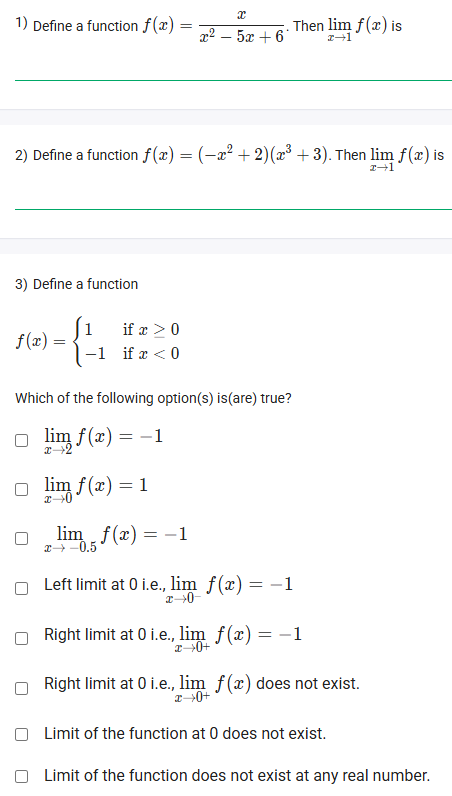
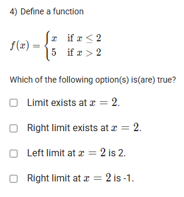
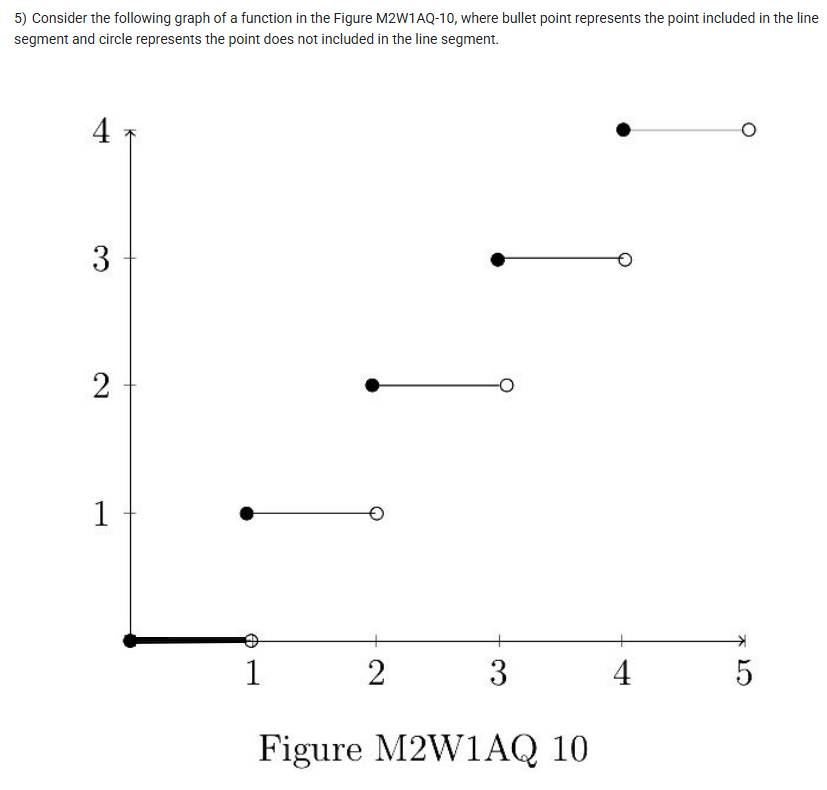
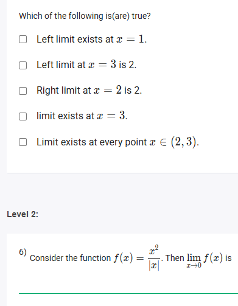
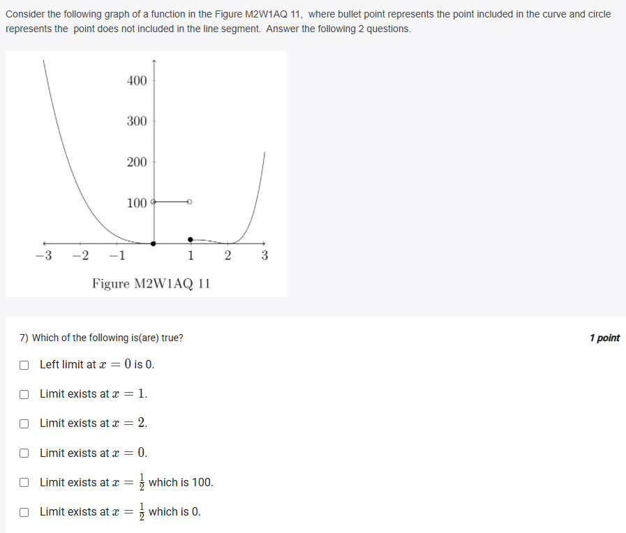
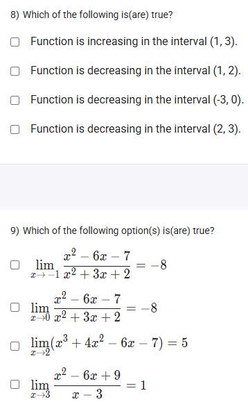
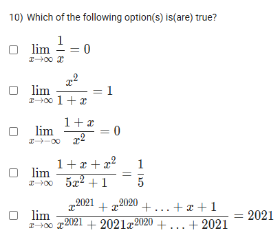

A well-defined collection of distinct objects called elements or members.



https://youtu.be/wXPoDGuv1wM

## Exercise Questions

Good morning! Here in India on this Monday, this is a fantastic set of questions that will help us build a strong foundation in the calculus concept of **limits**.

### **Core Concepts: Understanding Limits**

1.  **What is a Limit?**
    The limit of a function at a certain point tells us the value that the function's output ($y$) **approaches** as its input ($x$) gets infinitely close to that point. The limit doesn't care about the function's actual value *at* the point, only what it approaches. We write this as $\lim_{x \to c} f(x) = L$.

2.  **One-Sided Limits:**
    * **Left-Hand Limit ($\lim_{x \to c^-}$):** The value the function approaches as $x$ gets close to $c$ from the left side (from numbers smaller than $c$).
    * **Right-Hand Limit ($\lim_{x \to c^+}$):** The value the function approaches as $x$ gets close to $c$ from the right side (from numbers larger than $c$).

3.  **The Existence of a Limit:**
    A limit exists if and only if the left-hand limit and the right-hand limit are equal.
    $$\lim_{x \to c} f(x) \text{ exists } \iff \lim_{x \to c^-} f(x) = \lim_{x \to c^+} f(x)$$

4.  **How to Evaluate Limits:**
    * **Direct Substitution:** For continuous functions (like polynomials), the limit at a point is simply the function's value at that point.
    * **Factoring:** If direct substitution gives an indeterminate form like $\frac{0}{0}$, you must simplify the expression first, often by factoring and canceling common terms.
    * **Limits at Infinity ($\lim_{x \to \infty}$):** For rational functions, a quick method is to compare the degrees of the numerator and denominator. A general method is to divide every term by the highest power of $x$ in the denominator.

---

### **Question 1: Limit by Direct Substitution** (from file `image_9834f7.png`)

**The Question:**
Define a function $f(x) = \frac{x}{x^2 - 5x + 6}$. Then $\lim_{x \to 1} f(x)$ is \_\_\_\_\_\_\_\_\_\_.

**Detailed Solution:**
This function is a rational function. A limit can be found by direct substitution as long as the denominator does not become zero at the point.
1.  **Substitute $x=1$ into the function:**
    $$f(1) = \frac{1}{(1)^2 - 5(1) + 6} = \frac{1}{1 - 5 + 6} = \frac{1}{2}$$
2.  Since we get a defined numerical value, this is the limit.

**Final Answer:** The limit is **1/2**.



### **Question 2: Limit of a Polynomial** (from file `image_9834f7.png`)

**The Question:**
Define a function $f(x) = (-x^2 + 2)(x^3 + 3)$. Then $\lim_{x \to -1} f(x)$ is \_\_\_\_\_\_\_\_\_\_.

**Detailed Solution:**
Polynomials are continuous everywhere, so we can always find their limits by direct substitution.
1.  **Substitute $x=-1$ into the function:**
    $$f(-1) = (-(-1)^2 + 2)((-1)^3 + 3)$$$$f(-1) = (-(1) + 2)(-1 + 3)$$$$f(-1) = (1)(2) = 2$$

**Final Answer:** The limit is **2**.



### **Question 3: Limits of a Piecewise Function** (from file `image_9834f7.png`)

**The Question:**
Define a function $f(x) = \begin{cases} 1 & \text{if } x \ge 0 \\ -1 & \text{if } x < 0 \end{cases}$. Which of the following is(are) true?

**Detailed Solution:**
* **$\lim_{x \to 2} f(x) = -1$**: At $x=2$, we use the rule $f(x)=1$ since $2 \ge 0$. So the limit is 1. **FALSE**.
* **$\lim_{x \to 0} f(x) = 1$**: We must check both one-sided limits at $x=0$.
    * Left limit ($x \to 0^-$): Use the rule for $x<0$, so $f(x)=-1$. The limit is -1.
    * Right limit ($x \to 0^+$): Use the rule for $x \ge 0$, so $f(x)=1$. The limit is 1.
    * Since Left Limit $\neq$ Right Limit, the limit at $x=0$ does not exist. **FALSE**.
* **$\lim_{x \to -0.5} f(x) = -1$**: At $x=-0.5$, we use the rule $f(x)=-1$ since $-0.5 < 0$. **TRUE**.
* **Left limit at 0 is -1**: As calculated above, this is **TRUE**.
* **Right limit at 0 is -1**: **FALSE**, it is 1.
* **Right limit at 0 does not exist**: **FALSE**, it exists and is 1.
* **Limit of the function at 0 does not exist**: **TRUE**, because the one-sided limits are not equal.
* **Limit does not exist at any real number**: **FALSE**. The limit exists everywhere except at $x=0$.

**Final Answer:** The true statements are:
* **$\lim_{x \to -0.5} f(x) = -1$**
* **Left limit at 0 i.e., $\lim_{x \to 0^-} f(x) = -1$**
* **Limit of the function at 0 does not exist.**



### **Question 4: One-Sided Limits** (from file `image_983214.png`)

**The Question:**
Define a function $f(x) = \begin{cases} x & \text{if } x \le 2 \\ 5 & \text{if } x > 2 \end{cases}$. Which of the following is(are) true?

**Detailed Solution:**
We are analyzing the limits at the breakpoint, $x=2$.
* **Left limit at x=2 ($\lim_{x \to 2^-}$):** We approach 2 from values less than 2, so we use the rule $f(x)=x$.
    * $\lim_{x \to 2^-} f(x) = \lim_{x \to 2^-} x = 2$.
    * The statement "Left limit at $x=2$ is 2." is **TRUE**.
* **Right limit at x=2 ($\lim_{x \to 2^+}$):** We approach 2 from values greater than 2, so we use the rule $f(x)=5$.
    * $\lim_{x \to 2^+} f(x) = \lim_{x \to 2^+} 5 = 5$.
    * The statement "Right limit exists at $x=2$." is **TRUE**.
    * The statement "Right limit at $x=2$ is -1." is **FALSE**.
* **Limit exists at x=2:** For the limit to exist, the left and right limits must be equal. Here, $2 \neq 5$. So the limit **does not exist**. The statement "Limit exists at $x=2$." is **FALSE**.

**Final Answer:**
* **Right limit exists at $x=2$.**
* **Left limit at $x=2$ is 2.**



### **Question 5: Limits from a Step Graph** (from files `image_983152.png`, `image_982e8f.png`)

**The Question:**
Consider the following graph of a function...where bullet point represents the point included...and circle represents the point does not included... Which of the following is(are) true?

**Detailed Solution:**
Let's analyze the limits at the integer points where the graph "jumps".
* **At x = 1:**
    * Left limit ($\lim_{x \to 1^-}$): As we approach 1 from the left, the graph is at a height of 0. The limit is 0.
    * Right limit ($\lim_{x \to 1^+}$): As we approach 1 from the right, the graph is at a height of 1. The limit is 1.
    * The statement "Left limit at $x=1$ is 1" is **FALSE**.
* **At x = 2:**
    * Right limit ($\lim_{x \to 2^+}$): As we approach 2 from the right, the graph is at a height of 2. The limit is 2. The statement "Right limit at $x=2$ is 2" is **TRUE**.
* **At x = 3:**
    * Left limit ($\lim_{x \to 3^-}$): As we approach 3 from the left, the graph is at a height of 2. The limit is 2. The statement "Left limit at $x=3$ is 2" is **TRUE**.
    * Right limit ($\lim_{x \to 3^+}$): As we approach 3 from the right, the graph is at a height of 3. The limit is 3.
    * Since Left Limit $\neq$ Right Limit, the statement "limit exists at $x=3$" is **FALSE**.
* **In the interval (2, 3):**
    * For any point $c$ strictly between 2 and 3, the graph is a continuous horizontal line at a height of 2. The left and right limits will both be 2. So the statement "Limit exists at every point $x \in (2,3)$" is **TRUE**.

**Final Answer:** The true statements are:
* **Left limit at $x=3$ is 2.**
* **Right limit at $x=2$ is 2.**
* **Limit exists at every point $x \in (2,3)$.**



### **Question 6: Limit with Absolute Value** (from file `image_982e8f.png`)

**The Question:**
Consider the function $f(x) = \frac{x^2}{|x|}$. Then $\lim_{x \to 0} f(x)$ is \_\_\_\_\_\_\_\_\_\_.

**Detailed Solution:**
The absolute value function $|x|$ has a piecewise definition. We must analyze the function for $x>0$ and $x<0$ to find the one-sided limits.
* **For $x > 0$:** $|x|=x$. The function becomes $f(x) = \frac{x^2}{x} = x$.
* **For $x < 0$:** $|x|=-x$. The function becomes $f(x) = \frac{x^2}{-x} = -x$.

Now let's find the one-sided limits at $x=0$.
* **Right limit ($\lim_{x \to 0^+}$):** We use the rule for $x>0$, so we find $\lim_{x \to 0^+} x = 0$.
* **Left limit ($\lim_{x \to 0^-}$):** We use the rule for $x<0$, so we find $\lim_{x \to 0^-} -x = -0 = 0$.
Since the left-hand limit (0) equals the right-hand limit (0), the limit exists and is equal to 0.

**Final Answer:** The limit is **0**.



### **Question 7: Limits from a Piecewise Graph** (from file `image_982e15.png`)

**The Question:**
Consider the following graph of a function... Which of the following is(are) true?

**Detailed Solution:**
Let's analyze the limits at the specified points on the graph.
* **At x = 0:** The graph is a smooth, continuous curve passing through a local maximum near $y=100$. As we approach $x=0$ from the left and the right, the curve approaches the same point. **Limit exists at $x=0$**.
* **At x = 1:** There is a "jump discontinuity".
    * Left limit ($\lim_{x \to 1^-}$): The curve approaches the filled-in bullet point at a height of 100.
    * Right limit ($\lim_{x \to 1^+}$): The graph starts again as a parabola at a height near 0.
    * Since Left Limit $\neq$ Right Limit, the **Limit does not exist at $x=1$**.
* **At x = 2:** The graph is a smooth, continuous curve passing through its minimum. The limit exists.
* **At x = 1/2:** This point is on the smooth part of the curve between 0 and 1. The limit exists. The height at this point is approximately 100.

Evaluating the options:
* "Left limit at x = 0 is 0." -> FALSE.
* "Limit exists at x = 1." -> FALSE.
* "Limit exists at x = 2." -> TRUE.
* "Limit exists at x = 0." -> TRUE.
* "Limit exists at $x = \frac{1}{2}$ which is 100." -> TRUE.
* "Limit exists at $x = \frac{1}{2}$ which is 0." -> FALSE.

**Final Answer:** The true statements are:
* **Limit exists at $x=2$.**
* **Limit exists at $x=0$.**
* **Limit exists at $x=\frac{1}{2}$ which is 100.**



### **Question 8: Increasing/Decreasing Intervals** (from file `image_982dd5.png`)

**The Question:**
Which of the following is(are) true?
* Function is increasing in the interval (1, 3).
* Function is decreasing in the interval (1, 2).
* Function is decreasing in the interval (-3, 0).
* Function is decreasing in the interval (2, 3).

**Note:** This question is unanswerable as it refers to a function's behavior on specific intervals, but no corresponding graph or function definition is provided with it. The previous questions had their own figures.

**Final Answer:** Incomplete question.



### **Question 9: Evaluating Limits** (from file `image_982dd5.png`)

**The Question:**
Which of the following option(s) is(are) true?

**Detailed Solution:**
* **$\lim_{x \to -1} \frac{x^2 - 6x - 7}{x^2 + 3x + 2}$**:
    * Direct substitution gives $\frac{1+6-7}{1-3+2} = \frac{0}{0}$. We must factor.
    * Numerator: $x^2-6x-7 = (x-7)(x+1)$.
    * Denominator: $x^2+3x+2 = (x+2)(x+1)$.
    * The limit becomes $\lim_{x \to -1} \frac{(x-7)(x+1)}{(x+2)(x+1)} = \lim_{x \to -1} \frac{x-7}{x+2} = \frac{-1-7}{-1+2} = \frac{-8}{1} = -8$. This is **TRUE**.

* **$\lim_{x \to 0} \frac{x^2 - 6x - 7}{x^2 + 3x + 2}$**:
    * Direct substitution gives $\frac{0-0-7}{0+0+2} = -\frac{7}{2}$. The statement says the limit is -8. This is **FALSE**.

* **$\lim_{x \to 2} (x^3 + 4x^2 - 6x - 7)$**:
    * Direct substitution: $(2)^3 + 4(2)^2 - 6(2) - 7 = 8 + 4(4) - 12 - 7 = 8 + 16 - 12 - 7 = 24 - 19 = 5$. This is **TRUE**.

* **$\lim_{x \to 3} \frac{x^2 - 6x + 9}{x-3}$**:
    * Direct substitution gives $\frac{9-18+9}{3-3} = \frac{0}{0}$. We must factor.
    * The numerator is a perfect square: $x^2-6x+9 = (x-3)^2$.
    * The limit becomes $\lim_{x \to 3} \frac{(x-3)^2}{x-3} = \lim_{x \to 3} (x-3) = 3-3=0$. The statement says the limit is 1. This is **FALSE**.

**Final Answer:** The true statements are:
* **$\lim_{x \to -1} \frac{x^2 - 6x - 7}{x^2 + 3x + 2} = -8$**
* **$\lim_{x \to 2} (x^3 + 4x^2 - 6x - 7) = 5$**



### **Question 10: Limits at Infinity** (from file `image_982d75.png`)

**The Question:**
Which of the following option(s) is(are) true?

**Core Concept:** For limits of rational functions as $x \to \infty$, the behavior is dominated by the terms with the highest power in the numerator and denominator.
* If degree(num) < degree(den), limit is 0.
* If degree(num) = degree(den), limit is the ratio of leading coefficients.
* If degree(num) > degree(den), limit is $\infty$ or $-\infty$.

**Detailed Solution:**
* **$\lim_{x \to \infty} \frac{1}{x}$**: Degree of numerator (0) < degree of denominator (1). The limit is **0**. **TRUE**.
* **$\lim_{x \to \infty} \frac{x^2}{1+x}$**: Degree of numerator (2) > degree of denominator (1). The limit is $\infty$. **FALSE**.
* **$\lim_{x \to \infty} \frac{1+x}{x^2}$**: Degree of numerator (1) < degree of denominator (2). The limit is **0**. **TRUE**.
* **$\lim_{x \to \infty} \frac{1+x+x^2}{5x^2+1}$**: Degrees are equal (2). The limit is the ratio of the leading coefficients: $\frac{1}{5}$. **TRUE**.
* **$\lim_{x \to \infty} \frac{x^{2021} + ...}{x^{2021} + ...}$**: The degrees are equal (2021). The limit is the ratio of the leading coefficients: $\frac{1}{1} = 1$. The statement says the limit is 2021. **FALSE**.

**Final Answer:** The true statements are:
* **$\lim_{x \to \infty} \frac{1}{x} = 0$**
* **$\lim_{x \to \infty} \frac{1+x}{x^2} = 0$**
* **$\lim_{x \to \infty} \frac{1+x+x^2}{5x^2+1} = \frac{1}{5}$**
