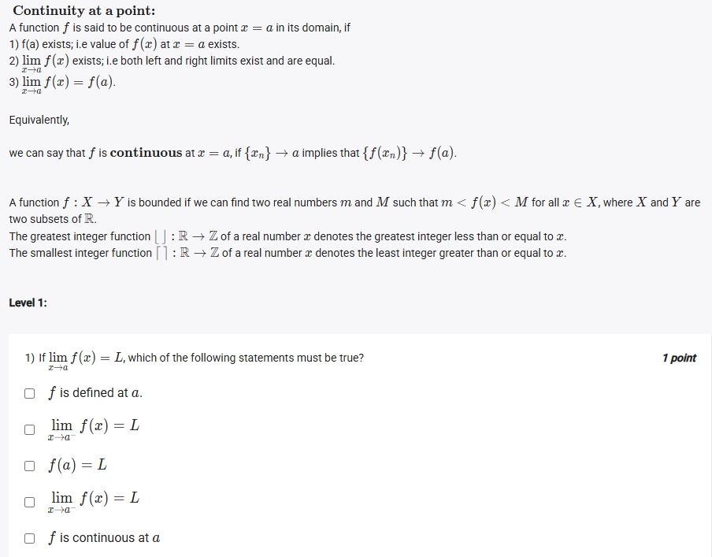
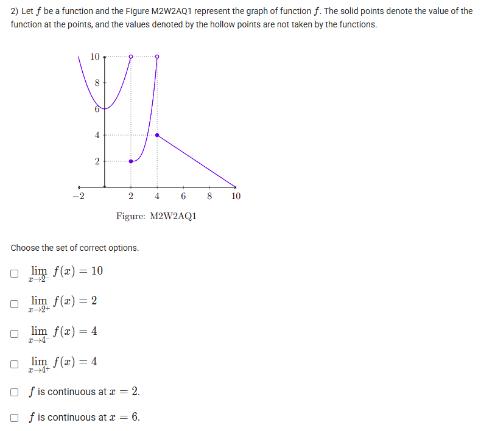
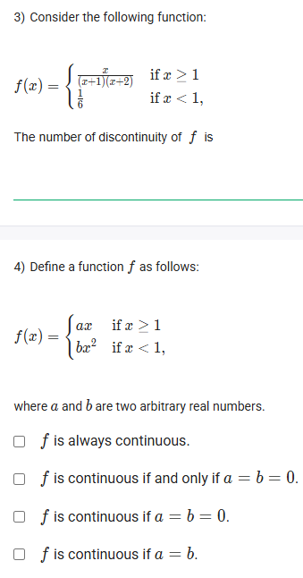
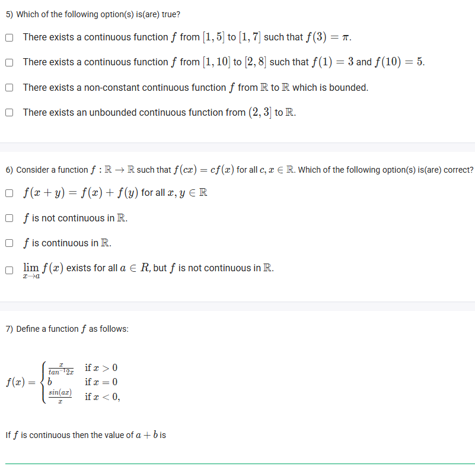
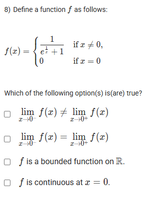

A well-defined collection of distinct objects called elements or members.



https://youtu.be/do-iDBxQCpw

https://youtu.be/do-iDBxQCpw

## Exercise Questions 

Good morning! Here in India on this Monday, this is a wonderful set of questions that goes right to the heart of a key concept in calculus: **continuity**. Let's explore these problems in detail.

### **Core Concepts: Limits and Continuity**

1.  **What is a Limit?**
    The limit of a function at a point $c$, written $\lim_{x \to c} f(x)$, is the value that $f(x)$ approaches as $x$ gets infinitely close to $c$. The limit does not care about the actual value of the function *at* $c$.

2.  **The Three Conditions for Continuity:**
    A function $f$ is said to be **continuous** at a point $x=a$ if it meets all three of the following conditions. If any one of them fails, the function is discontinuous at that point.
    1.  **$f(a)$ is defined:** The point must exist on the graph.
    2.  **$\lim_{x \to a} f(x)$ exists:** This means the left-hand limit must equal the right-hand limit ($\lim_{x \to a^-} f(x) = \lim_{x \to a^+} f(x)$). The graph must approach the same height from both sides.
    3.  **$\lim_{x \to a} f(x) = f(a)$:** The value the graph approaches must be the same as the actual value of the point.

3.  **The Intermediate Value Theorem (IVT):**
    If a function is continuous on a closed interval $[a, b]$, it must take on every value between $f(a)$ and $f(b)$.

---

### **Question 1: Definition of a Limit** (from file `image_665adc.png`)

**The Question:**
If $\lim_{x \to a} f(x) = L$, which of the following statements must be true?

**Detailed Solution:**
The statement $\lim_{x \to a} f(x) = L$ means that the two-sided limit exists and is equal to L.
* The existence of a two-sided limit implies that both one-sided limits exist and are equal to each other (and to L).
* However, the existence of a limit tells us nothing about the actual value of the function *at* the point, $f(a)$. The point could be undefined (a hole in the graph) or defined at a different value.

Let's evaluate the options:
* **"$f$ is defined at a."**: Not necessarily true.
* **"$\lim_{x \to a^-} f(x) = L$"**: **TRUE**. This is required for the two-sided limit to be L.
* **"$f(a) = L$"**: Not necessarily true. This is only required if the function is also continuous at a.
* **"$\lim_{x \to a^+} f(x) = L$"**: **TRUE**. This is also required.
* **"$f$ is continuous at a"**: Not necessarily true. Condition 3 for continuity might fail.

**Final Answer:**
* **$\lim_{x \to a^-} f(x) = L$**
* **$\lim_{x \to a^+} f(x) = L$**



### **Question 2: Limits & Continuity from a Graph** (from file `image_665a99.png`)

**The Question:**
Let $f$ be a function and the Figure M2W2AQ1 represent the graph of function $f$. Choose the set of correct options.

**Detailed Solution:**
Let's analyze the graph at the specified points.
* **At x = 2:**
    * Left limit ($\lim_{x \to 2^-}$): As we approach $x=2$ from the left, the graph approaches the hollow circle at a height of 10.
    * Right limit ($\lim_{x \to 2^+}$): As we approach $x=2$ from the right, the graph approaches the solid bullet point at a height of 2.
    * The statement **"$\lim_{x \to 2} f(x) = 10$" is FALSE** because the left and right limits are not equal.
    * The statement **"$\lim_{x \to 2^+} f(x) = 2$" is TRUE**.
* **At x = 4:**
    * Left limit ($\lim_{x \to 4^-}$): As we approach $x=4$ from the left, the graph approaches the solid bullet point at a height of 4.
    * Right limit ($\lim_{x \to 4^+}$): As we approach $x=4$ from the right, the graph approaches the solid bullet point at a height of 10.
    * The statements **"$\lim_{x \to 4^-} f(x) = 4$" is TRUE** and **"$\lim_{x \to 4^+} f(x) = 4$" is FALSE** (it is 10).
* **Continuity:**
    * **"f is continuous at x = 2."**: **FALSE**. The limit does not exist at $x=2$.
    * **"f is continuous at x = 6."**: **TRUE**. At $x=6$, the graph is a continuous straight line. The limit from the left and right both approach the same point, and the function's value is defined there.

**Final Answer:**
* **$\lim_{x \to 2^+} f(x) = 2$**
* **$\lim_{x \to 4^-} f(x) = 4$**
* **$f$ is continuous at $x = 6$.**



### **Question 3: Discontinuity of a Piecewise Function** (from file `image_665a40.png`)

**The Question:**
Consider the following function: $f(x) = \begin{cases} (x+1)(x-2) & \text{if } x \ge 1 \\ \frac{1}{6} & \text{if } x < 1 \end{cases}$. The number of discontinuity of $f$ is \_\_\_\_\_\_\_\_\_\_.

**Detailed Solution:**
The two pieces of the function are polynomials, which are continuous everywhere. The only potential point of discontinuity is at the "breakpoint" where the rule changes, which is at $x=1$. Let's check the three conditions for continuity at $x=1$.

1.  **Is $f(1)$ defined?** Yes. For $x \ge 1$, we use the first rule:
    * $f(1) = (1+1)(1-2) = (2)(-1) = -2$.

2.  **Does the limit exist at $x=1$?** We check the one-sided limits.
    * **Right Limit ($x \to 1^+$):** Use the rule for $x \ge 1$: $\lim_{x \to 1^+} (x+1)(x-2) = (1+1)(1-2) = -2$.
    * **Left Limit ($x \to 1^-$):** Use the rule for $x < 1$: $\lim_{x \to 1^-} \frac{1}{6} = \frac{1}{6}$.
    * Since the Left Limit ($\frac{1}{6}$) is not equal to the Right Limit ($-2$), the limit does not exist at $x=1$.

3.  **Conclusion:** Since condition 2 fails, the function is discontinuous at $x=1$. This is the only point of discontinuity.

**Final Answer:** The number of discontinuities is **1**.



### **Question 4: Continuity Condition** (from file `image_665a40.png`)

**The Question:**
Define a function $f$ as follows: $f(x) = \begin{cases} ax & \text{if } x \ge 1 \\ bx^2 & \text{if } x < 1 \end{cases}$. Then $f$ is continuous if $a = b$.

**Detailed Solution:**
For the function to be continuous everywhere, it must be continuous at the breakpoint $x=1$. Let's apply the three conditions.

1.  **$f(1)$ must be defined.** We use the rule for $x \ge 1$: $f(1) = a(1) = a$.
2.  **The limit must exist.** This means the left and right limits must be equal.
    * **Right Limit ($x \to 1^+$):** Use the rule for $x \ge 1$: $\lim_{x \to 1^+} ax = a(1) = a$.
    * **Left Limit ($x \to 1^-$):** Use the rule for $x < 1$: $\lim_{x \to 1^-} bx^2 = b(1)^2 = b$.
    * For the limit to exist, we must have **Left Limit = Right Limit**, so we need $b = a$.
3.  **The limit must equal the function value.** From step 2, the limit is $a$ (if it exists). From step 1, the function value is $a$. So if the limit exists, this condition is automatically satisfied.

The only condition required for continuity is that $a=b$. The other options ($a=b=0$) are just a specific case of this.

**Final Answer:** **$f$ is continuous if $a=b$.**



### **Question 5: Intermediate Value Theorem** (from file `image_665757.png`)

**The Question:**
Which of the following option(s) is(are) true?

**Detailed Solution:**
* **"There exists a continuous function $f$ from $[1, 5]$ to $[1, 7]$ such that $f(3) = \pi$."**: **TRUE**. The domain is $[1,5]$ and the codomain is $[1,7]$. Since $\pi \approx 3.14$ is within the codomain $[1,7]$, it is a possible output. A simple straight line, for example, could connect points to make this happen.
* **"There exists a continuous function $f$ from $[1, 10]$ to $[2, 8]$ such that $f(1)=3$ and $f(10)=5$."**: **TRUE**. The start and end points $(1,3)$ and $(10,5)$ are both valid (since 3 and 5 are in the codomain $[2,8]$), and a continuous function (like a straight line) can easily exist between them.
* **"There exists a non-constant continuous function $f$ from $\mathbb{R}$ to $\mathbb{R}$ which is bounded."**: **TRUE**. A function is bounded if its range is finite. A classic example is $f(x) = \sin(x)$, which is non-constant, continuous, and bounded between -1 and 1.
* **"There exists an unbounded continuous function from $[2, 3]$ to $\mathbb{R}$."**: **FALSE**. The Extreme Value Theorem states that any function that is continuous on a **closed, bounded interval** (like $[2,3]$) must be bounded on that interval.

**Final Answer:** The first three statements are true.



### **Question 6: Functional Equations** (from file `image_665757.png`)

**The Question:**
Consider a function $f: \mathbb{R} \to \mathbb{R}$ such that $f(cx) = cf(x)$ for all $c, x \in \mathbb{R}$. Which of the following option(s) is(are) correct?

**Detailed Solution:**
The condition $f(cx) = cf(x)$ is a property called homogeneity of degree 1. The simplest functions that satisfy this are linear functions of the form **$f(x) = mx$**. Let's assume this form and test the options.
* **"$f(x+y) = f(x)+f(y)$ for all $x, y \in \mathbb{R}$"**: Let's check if $f(x)=mx$ satisfies this.
    * Left side: $f(x+y) = m(x+y) = mx + my$.
    * Right side: $f(x)+f(y) = mx + my$.
    * They are equal. This statement is **TRUE**.
* **"$f$ is not continuous in $\mathbb{R}$."**: A function $f(x)=mx$ is a straight line, which is continuous everywhere. **FALSE**.
* **"$f$ is continuous in $\mathbb{R}$."**: **TRUE**.
* **"$\lim_{x \to a} f(x)$ exists for all $a \in \mathbb{R}$, but $f$ is not continuous in $\mathbb{R}$."**: This is contradictory. For a function like this, if the limit exists everywhere, it must be continuous. **FALSE**.

**Final Answer:**
* **$f(x+y) = f(x) + f(y)$ for all $x,y \in \mathbb{R}$**
* **$f$ is continuous in $\mathbb{R}$.**



### **Question 7: Continuity with Trigonometric Limits** (from file `image_665757.png`)

**The Question:**
Define a function $f(x) = \begin{cases} \frac{x}{\tan(2x)} & \text{if } x > 0 \\ b & \text{if } x=0 \\ \frac{\sin(ax)}{x} & \text{if } x < 0 \end{cases}$. If $f$ is continuous then the value of $a+b$ is \_\_\_\_\_\_\_\_\_\_.

**Core Concept:** For $f$ to be continuous at $x=0$, we must have $\lim_{x \to 0^-} f(x) = f(0) = \lim_{x \to 0^+} f(x)$. We will use the standard limits: $\lim_{u \to 0} \frac{\sin u}{u} = 1$ and $\lim_{u \to 0} \frac{\tan u}{u} = 1$.

**Detailed Solution:**
1.  **Calculate the Right-Hand Limit ($x \to 0^+$):**
    * $\lim_{x \to 0^+} \frac{x}{\tan(2x)}$. We can rewrite this to use the standard limit.
    * $\lim_{x \to 0^+} \frac{1}{\frac{\tan(2x)}{x}} = \lim_{x \to 0^+} \frac{1}{2 \cdot \frac{\tan(2x)}{2x}} = \frac{1}{2 \cdot 1} = \frac{1}{2}$.
2.  **Evaluate the function at $x=0$:**
    * $f(0) = b$.
3.  **Calculate the Left-Hand Limit ($x \to 0^-$):**
    * $\lim_{x \to 0^-} \frac{\sin(ax)}{x}$. We can rewrite this.
    * $\lim_{x \to 0^-} a \cdot \frac{\sin(ax)}{ax} = a \cdot 1 = a$.
4.  **Set them all equal:** For continuity, we need $a = b = \frac{1}{2}$.
5.  **Calculate $a+b$:**
    * $a+b = \frac{1}{2} + \frac{1}{2} = 1$.

**Final Answer:** The value of $a+b$ is **1**.



### **Question 8: Continuity at a Point** (from file `image_6656f8.png`)

**The Question:**
Define a function $f$ as follows: $f(x) = \begin{cases} \frac{1}{e^{1/x} + 1} & \text{if } x \neq 0 \\ 0 & \text{if } x=0 \end{cases}$. Which of the following is(are) true?

**Detailed Solution:**
Let's analyze the function at $x=0$.
1.  **Find the Right-Hand Limit ($x \to 0^+$):**
    * As $x \to 0^+$, the exponent $\frac{1}{x} \to +\infty$.
    * Then $e^{1/x} \to \infty$.
    * The function becomes $\lim_{x \to 0^+} \frac{1}{\infty + 1}$, which approaches **0**.
2.  **Find the Left-Hand Limit ($x \to 0^-$):**
    * As $x \to 0^-$, the exponent $\frac{1}{x} \to -\infty$.
    * Then $e^{1/x} \to 0$.
    * The function becomes $\lim_{x \to 0^-} \frac{1}{0 + 1}$, which is **1**.
3.  **Evaluate the options:**
    * **"$\lim_{x \to 0^-} f(x) \neq \lim_{x \to 0^+} f(x)$"**: This is **TRUE**, since $1 \neq 0$.
    * **"$\lim_{x \to 0^-} f(x) = \lim_{x \to 0^+} f(x)$"**: This is **FALSE**.
    * **"$f$ is continuous at $x=0$."**: This is **FALSE**. For continuity, the limit must exist, but it doesn't.
    * **"$f$ is a bounded function on $\mathbb{R}$."**: Let's check the range. We know the function approaches 0 from the right and 1 from the left. As $x \to \pm\infty$, $\frac{1}{x} \to 0$, so $e^{1/x} \to 1$, and $f(x) \to \frac{1}{1+1} = \frac{1}{2}$. The graph is contained between 0 and 1. The function is **bounded**. This statement is **TRUE**.

**Final Answer:**
* **$\lim_{x \to 0^-} f(x) \neq \lim_{x \to 0^+} f(x)$**
* **$f$ is a bounded function on $\mathbb{R}$.**
