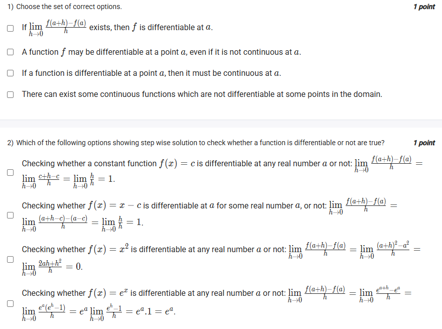
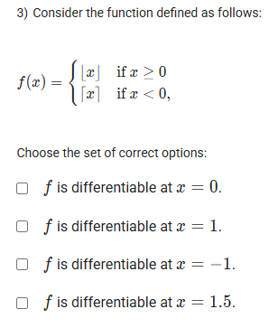
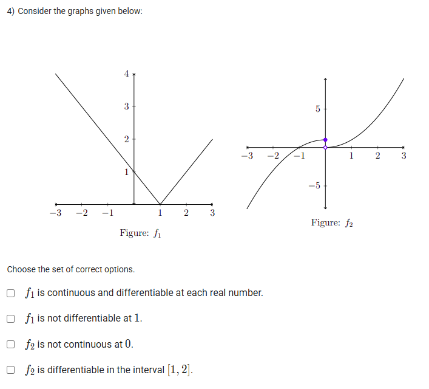
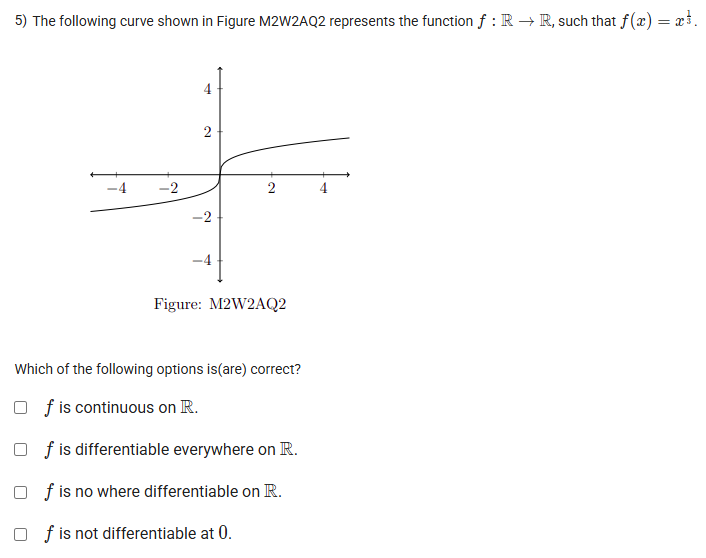
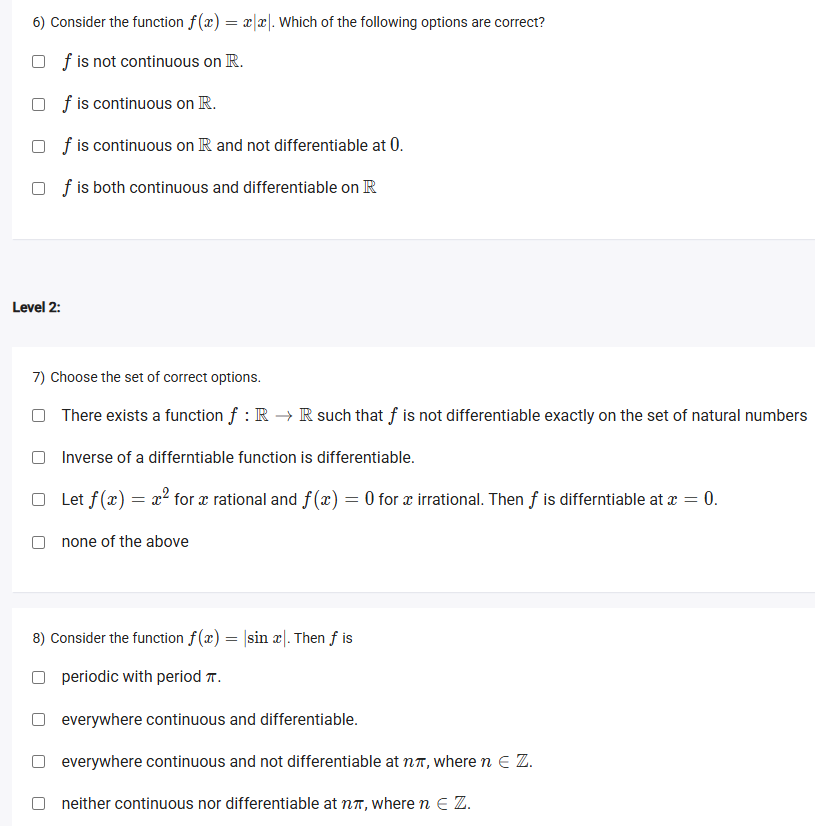
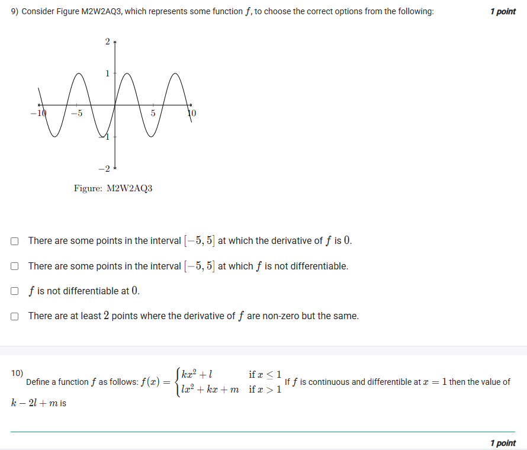

A well-defined collection of distinct objects called elements or members.



https://youtu.be/w8R2RdS6xQ4

## Exercise Questions

Good morning! Here in India on this Monday, we have a great set of questions that explore **differentiability**, a core concept in calculus that formalizes the idea of a function being "smooth" and having a well-defined slope at every point.

### **Core Concepts: Differentiability and Continuity**

1.  **The Definition of the Derivative:** A function $f$ is **differentiable** at a point $x=a$ if the slope of the tangent line at that point exists. This is defined by the limit:
    $$f'(a) = \lim_{h \to 0} \frac{f(a+h) - f(a)}{h}$$
    If this limit exists, the function is differentiable at $a$.

2.  **The Link to Continuity:** This is a crucial, one-way relationship.
    * **Differentiability $\implies$ Continuity:** If a function is differentiable at a point, it **must** be continuous at that point. You cannot have a defined slope where there is a break or hole in the graph.
    * **Continuity $\not\implies$ Differentiability:** If a function is continuous, it is **not necessarily** differentiable. A continuous graph can still have "problem spots".

3.  **When is a Function NOT Differentiable?**
    A function is not differentiable at any point where it is not "smooth." This happens at:
    * **Corners or Cusps:** Sharp points where the slope changes abruptly (e.g., the point of a 'V' shape).
    * **Vertical Tangents:** Points where the tangent line is perfectly vertical, as a vertical line has an undefined slope.
    * **Discontinuities:** Any point where the function is not continuous (jumps, holes).

---

### **Question 1: Definitions of Differentiability** (from file `image_6652de.png`)

**The Question:**
Choose the set of correct options. (Multiple Select Question)

**Detailed Solution:**

* **"If $\lim_{h \to 0} \frac{f(a+h) - f(a)}{h}$ exists, then $f$ is differentiable at a."**: **TRUE**. This is the formal definition of differentiability.
* **"A function $f$ may be differentiable at a point a, even if it is not continuous at a."**: **FALSE**. Differentiability requires continuity. If a function is not continuous, it cannot be differentiable.
* **"If a function is differentiable at a point a, then it must be continuous at a."**: **TRUE**. This is the fundamental relationship between the two concepts.
* **"There can exist some continuous functions which are not differentiable at some points in the domain."**: **TRUE**. The classic example is $f(x) = |x|$, which is continuous everywhere but is not differentiable at the sharp corner at $x=0$.

**Final Answer:** The correct statements are the first, third, and fourth options.



### **Question 2: Derivative from First Principles** (from file `image_6652de.png`)

**The Question:**
Which of the following options showing step wise solution to check whether a function is differentiable or not are true?

**Detailed Solution:**

Let's check each calculation using the limit definition $f'(a) = \lim_{h \to 0} \frac{f(a+h) - f(a)}{h}$.

* **For $f(x)=c$:**
    * $\lim_{h \to 0} \frac{f(a+h) - f(a)}{h} = \lim_{h \to 0} \frac{c - c}{h} = \lim_{h \to 0} \frac{0}{h} = 0$.
    * The option says the limit is 1. **FALSE**.

* **For $f(x)=x-c$:**
    * $\lim_{h \to 0} \frac{f(a+h) - f(a)}{h} = \lim_{h \to 0} \frac{((a+h)-c) - (a-c)}{h} = \lim_{h \to 0} \frac{a+h-c-a+c}{h} = \lim_{h \to 0} \frac{h}{h} = 1$.
    * The option says the limit is 1. **TRUE**.

* **For $f(x)=x^2$ (written as $x^0$ in the image, a typo):**
    * Assuming $f(x)=x^2$: $\lim_{h \to 0} \frac{(a+h)^2 - a^2}{h} = \lim_{h \to 0} \frac{a^2+2ah+h^2-a^2}{h} = \lim_{h \to 0} \frac{2ah+h^2}{h} = \lim_{h \to 0} (2a+h) = 2a$.
    * The option shows a different calculation that results in 0. **FALSE**.

* **For $f(x)=e^x$:**
    * $\lim_{h \to 0} \frac{e^{a+h} - e^a}{h} = \lim_{h \to 0} \frac{e^a e^h - e^a}{h} = \lim_{h \to 0} \frac{e^a(e^h - 1)}{h}$.
    * Using the fundamental limit $\lim_{h \to 0} \frac{e^h - 1}{h} = 1$, the result is $e^a \cdot 1 = e^a$.
    * The option correctly shows these steps and the final result. **TRUE**.

**Final Answer:**
* **Checking whether $f(x)=x-c$ is differentiable...**
* **Checking whether $f(x)=e^x$ is differentiable...**



### **Question 3: Differentiability of a Piecewise Function** (from file `image_664f1c.png`)

**The Question:**
Consider the function defined as follows: $f(x) = \begin{cases} |x| & \text{if } x \ge 0 \\ \lfloor x \rfloor & \text{if } x < 0 \end{cases}$. Choose the set of correct options.

**Detailed Solution:**

1.  **Simplify the function:**
    * For $x \ge 0$, $|x| = x$. So, $f(x)=x$ for $x \ge 0$.
    * For $x < 0$, $f(x) = \lfloor x \rfloor$ (the floor function), which is a step function.
2.  **Analyze Differentiability:**
    * **At $x=0$:** There is a "jump discontinuity". The right side approaches 0, while the left side approaches -1. Since it's not continuous, it is **not differentiable at x=0**.
    * **At $x=1.5$:** Here, $x > 0$, so we use the rule $f(x)=x$. The graph is a smooth straight line. It **is differentiable at x=1.5**.
    * **At $x=1$:** Here, $x > 0$, so we use the rule $f(x)=x$. The graph is a smooth straight line. It **is differentiable at x=1**.
    * **At $x=-1$:** This is an integer where the floor function jumps. It is discontinuous here. Therefore, it is **not differentiable at x=-1**.

**Final Answer:**
* **$f$ is differentiable at $x=1$.**
* **$f$ is differentiable at $x=1.5$.**



### **Question 4: Differentiability from Graphs** (from file `image_664edc.png`)

**The Question:**
Consider the graphs given below. Choose the set of correct options.

**Detailed Solution:**
* **Figure $f_1$ (V-shape):** This is the graph of an absolute value function, likely $y=|x-1|+1$.
    * **"f1 is continuous and differentiable at each real number."**: **FALSE**. It is continuous everywhere, but the sharp corner at $x=1$ means it is not differentiable there.
    * **"f1 is not differentiable at 1."**: **TRUE**. A sharp corner means the slope is not uniquely defined.
* **Figure $f_2$ (Curve with a hole):**
    * **"f2 is not continuous at 0."**: **TRUE**. There is a hole (a removable discontinuity) at $x=0$.
    * **"f2 is differentiable in the interval [1, 2]."**: **TRUE**. In the interval $[1, 2]$, the graph is a smooth, unbroken curve. It is differentiable at every point in this interval.

**Final Answer:**
* **$f_1$ is not differentiable at 1.**
* **$f_2$ is not continuous at 0.**
* **$f_2$ is differentiable in the interval [1, 2].**



### **Question 5: Properties of $f(x) = x^{1/3}$** (from file `image_664bd7.png`)

**The Question:**
The following curve shown in Figure M2W2AQ2 represents the function $f: \mathbb{R} \to \mathbb{R}$, such that $f(x) = x^{1/3}$. Which of the following options is(are) correct?

**Detailed Solution:**
* **"$f$ is continuous on $\mathbb{R}$."**: **TRUE**. The graph can be drawn in one stroke without any breaks or holes.
* **"$f$ is differentiable everywhere on $\mathbb{R}$."**: **FALSE**. At $x=0$, the graph becomes perfectly vertical for an instant. A vertical line has an undefined slope. Therefore, the function has a vertical tangent at $x=0$ and is not differentiable there.
* **"$f$ is no where differentiable on $\mathbb{R}$."**: **FALSE**. It is differentiable everywhere except at $x=0$.
* **"$f$ is not differentiable at 0."**: **TRUE**, due to the vertical tangent.

**Final Answer:**
* **$f$ is continuous on $\mathbb{R}$.**
* **$f$ is not differentiable at 0.**



### **Question 6: Properties of $f(x)=x|x|$** (from file `image_664b74.png`)

**The Question:**
Consider the function $f(x) = x|x|$. Which of the following options are correct?

**Detailed Solution:**
1.  **Rewrite as a piecewise function:**
    * If $x \ge 0$, $|x|=x$, so $f(x) = x(x) = x^2$.
    * If $x < 0$, $|x|=-x$, so $f(x) = x(-x) = -x^2$.
    $f(x) = \begin{cases} x^2 & \text{if } x \ge 0 \\ -x^2 & \text{if } x < 0 \end{cases}$
2.  **Check Continuity:** The two pieces are parabolas, which are continuous. We only need to check the breakpoint at $x=0$.
    * Right limit: $\lim_{x \to 0^+} x^2 = 0$.
    * Left limit: $\lim_{x \to 0^-} -x^2 = 0$.
    * Function value: $f(0)=0^2=0$.
    * Since all three are equal, the function **is continuous on $\mathbb{R}$**.
3.  **Check Differentiability at $x=0$:** We check if the derivatives from the left and right are equal.
    * Derivative from the right (for $x>0$): The derivative of $x^2$ is $2x$. At $x=0$, the slope is $2(0)=0$.
    * Derivative from the left (for $x<0$): The derivative of $-x^2$ is $-2x$. At $x=0$, the slope is $-2(0)=0$.
    * Since the left-derivative and right-derivative are both 0, the function **is differentiable at $x=0$**.
4.  **Conclusion:** The function is continuous and differentiable on all of $\mathbb{R}$.

**Final Answer:** **$f$ is both continuous and differentiable on $\mathbb{R}$**.



### **Question 7: Advanced Differentiability Concepts** (from file `image_664b74.png`)

**The Question:**
Choose the set of correct options.

**Detailed Solution:**
* **"There exists a function $f: \mathbb{R} \to \mathbb{R}$ such that $f$ is not differentiable exactly on the set of natural numbers"**: **TRUE**. This is possible. The Weierstrass function is an example of a function that is continuous everywhere but differentiable nowhere. More simply, one can construct a function by summing "sawtooth" functions centered at each natural number.
* **"Inverse of a differentiable function is differentiable."**: **FALSE**. A counterexample is $f(x)=x^3$. It is differentiable everywhere. Its inverse is $f^{-1}(x) = x^{1/3}$, which is not differentiable at $x=0$. This happens when the original function has a point with a horizontal tangent ($f'(x)=0$).
* **"Let $f(x) = x^2$ for x rational and $f(x)=0$ for x irrational. Then $f$ is differentiable at $x=0$."**: **TRUE**. This is a famous example. Using the limit definition of the derivative at $a=0$, we get $\lim_{h \to 0} \frac{f(0+h)-f(0)}{h} = \lim_{h \to 0} \frac{f(h)}{h}$. If $h$ is rational, this is $\frac{h^2}{h}=h$. If $h$ is irrational, this is $\frac{0}{h}=0$. In both cases, as $h \to 0$, the limit is 0. So the derivative exists and is 0.

**Final Answer:**
* **There exists a function $f: \mathbb{R} \to \mathbb{R}$ such that $f$ is not differentiable exactly on the set of natural numbers**
* **Let $f(x) = x^2$ for x rational and $f(x)=0$ for x irrational. Then $f$ is differentiable at $x=0$.**



### **Question 8: Properties of $f(x)=|\sin x|$** (from file `image_664b74.png`)

**The Question:**
Consider the function $f(x)=|\sin x|$. Then $f$ is...

**Detailed Solution:**
* **Periodicity:** The function $\sin x$ has a period of $2\pi$. The absolute value function $|\sin x|$ reflects the negative parts of the sine wave upwards. The resulting shape now repeats every $\pi$ units. The function is **periodic with period $\pi$**.
* **Continuity:** The function $\sin x$ is continuous everywhere. The absolute value function is also continuous everywhere. The composition of two continuous functions is continuous. So, $f(x)=|\sin x|$ is **everywhere continuous**.
* **Differentiability:** The graph of $|\sin x|$ has sharp corners wherever the original $\sin x$ graph crossed the x-axis (except where it was already tangent). This happens when $\sin x = 0$, which is at $x = n\pi$ for every integer $n$ (..., $-\pi, 0, \pi, 2\pi$, ...). At these sharp points, the function is **not differentiable**.

**Final Answer:**
* **periodic with period $\pi$.**
* **everywhere continuous.**
* **everywhere continuous and not differentiable at $n\pi$, where $n \in \mathbb{Z}$.**



### **Question 9: Derivative from a Graph** (from file `image_664b15.png`)

**The Question:**
Consider Figure M2W2AQ3, which represents some function $f$, to choose the correct options from the following.

**Detailed Solution:**
The graph shows a smooth, wave-like function (like a sine or cosine wave).
* **"There are some points in the interval $[-5, 5]$ at which the derivative of $f$ is 0."**: **TRUE**. The derivative is the slope of the tangent line. The slope is 0 at every peak (local maximum) and valley (local minimum). The graph clearly shows several peaks and valleys in the interval $[-5, 5]$.
* **"There are some points in the interval $[-5, 5]$ at which $f$ is not differentiable."**: **FALSE**. The graph shown is perfectly smooth and continuous, with no corners, cusps, or vertical tangents. It appears to be differentiable everywhere.
* **"$f$ is not differentiable at 0."**: **FALSE**. The graph is smooth at $x=0$.
* **"There are at least 2 points where the derivative of $f$ are non-zero but the same."**: **TRUE**. For example, the slope at $x=0$ is positive and steep. Due to the wave-like nature, there will be another point (e.g., near $x=2\pi \approx 6.28$, or more relevantly, near $x=-2\pi \approx -6.28$, and also around $x=0$ but on the other side of the peak) where the slope is the same. Even more simply, take a point on an upslope, say at $x=-4$. The slope is positive. There's another upslope around $x=2$ that will have a point with the exact same positive slope.

**Final Answer:**
* **There are some points in the interval $[-5, 5]$ at which the derivative of $f$ is 0.**
* **There are at least 2 points where the derivative of $f$ are non-zero but the same.**



### **Question 10: Differentiable Piecewise Function** (from file `image_664b15.png`)

**The Question:**
Define a function $f$ as follows: $f(x) = \begin{cases} kx^2 + l & \text{if } x \le 1 \\ lx^2 + kx + m & \text{if } x > 1 \end{cases}$. If $f$ is continuous and differentiable at $x=1$ then the value of $k-2l+m$ is \_\_\_\_\_\_\_\_\_\_.

**Detailed Solution:**
The function must be continuous and differentiable at the breakpoint $x=1$.

1.  **Continuity Condition:** The values of the two pieces must be equal at $x=1$.
    * From the top piece: $f(1) = k(1)^2 + l = k+l$.
    * From the bottom piece (as a limit): $\lim_{x \to 1^+} (lx^2+kx+m) = l(1)^2+k(1)+m = l+k+m$.
    * Set them equal: $k+l = l+k+m$.
    * This simplifies to **$m=0$**.

2.  **Differentiability Condition:** The derivatives of the two pieces must be equal at $x=1$.
    * Find the derivative of the top piece: $\frac{d}{dx}(kx^2+l) = 2kx$. At $x=1$, this is $2k(1) = 2k$.
    * Find the derivative of the bottom piece: $\frac{d}{dx}(lx^2+kx+m) = 2lx+k$. At $x=1$, this is $2l(1)+k = 2l+k$.
    * Set them equal: $2k = 2l+k$.
    * This simplifies to **$k = 2l$**.

3.  **Calculate the final expression:**
    * We need to find the value of $k-2l+m$.
    * Substitute the relationships we found: $k=2l$ and $m=0$.
    * $(2l) - 2l + 0 = 0$.

**Final Answer:** The value of $k-2l+m$ is **0**.
