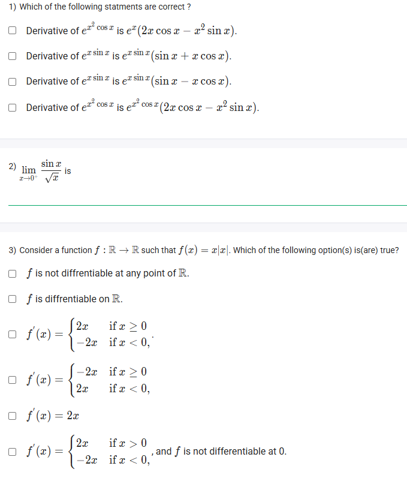
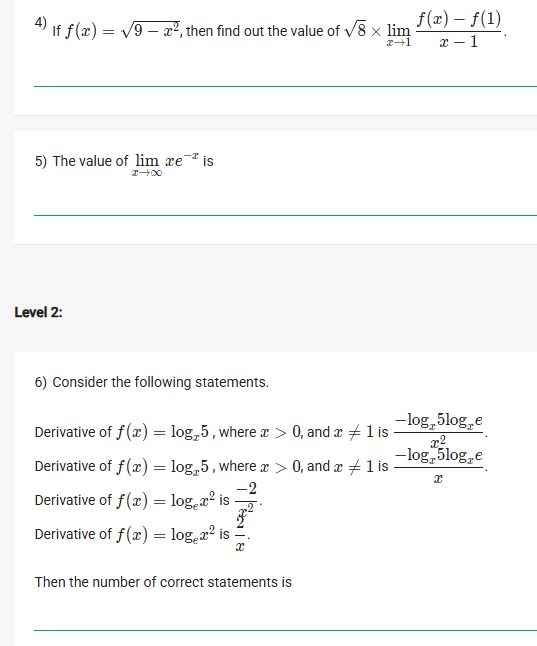
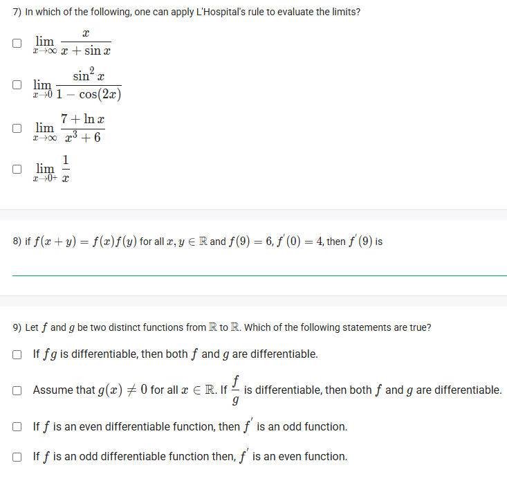
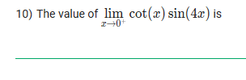

A well-defined collection of distinct objects called elements or members.



https://youtu.be/Ah3laZhgHus

## Exercise Questions

Good morning! Here in India on this Monday, this is an excellent set of questions that dives deep into the core of differential calculus. We'll be covering differentiation rules, the powerful L'Hôpital's rule for limits, and some interesting theoretical properties of derivatives.

### **Core Concepts: Derivatives and Limits**

1.  **Derivative Rules:**
    * **Product Rule:** To differentiate a product of two functions, $(u \cdot v)' = u'v + uv'$.
    * **Chain Rule:** To differentiate a composite function $f(g(x))$, the derivative is $f'(g(x)) \cdot g'(x)$.

2.  **The Limit Definition of a Derivative:** The derivative of $f$ at a point $a$ is the slope of the tangent line, defined as:
    $$f'(a) = \lim_{x \to a} \frac{f(x) - f(a)}{x - a}$$

3.  **L'Hôpital's Rule:** This is a method for finding limits that are in an "indeterminate form" like $\frac{0}{0}$ or $\frac{\infty}{\infty}$. It states that if you have such a form, you can take the derivative of the numerator and the denominator separately and then try to find the limit again.
    $$\lim_{x \to a} \frac{f(x)}{g(x)} = \lim_{x \to a} \frac{f'(x)}{g'(x)}$$

4.  **Properties of Derivatives:**
    * If a function $f$ is **even** ($f(-x)=f(x)$), its derivative $f'$ is an **odd** function.
    * If a function $f$ is **odd** ($f(-x)=-f(x)$), its derivative $f'$ is an **even** function.

---

### **Question 1: Derivative Rules** (from file `image_6640af.png`)

**The Question:**
Which of the following statements are correct? (Multiple Select Question)

**Detailed Solution:**

* **Derivative of $e^{x^2} \cos x$:** This requires the **Product Rule** and **Chain Rule**. Let $u=e^{x^2}$ and $v=\cos x$.
    * $u' = e^{x^2} \cdot (2x)$ (Chain Rule)
    * $v' = -\sin x$
    * $(uv)' = u'v + uv' = (2xe^{x^2})(\cos x) + (e^{x^2})(-\sin x) = e^{x^2}(2x \cos x - \sin x)$.
    * The first statement is **TRUE**.

* **Derivative of $e^x \sin x$:** This is a standard Product Rule application. Let $u=e^x$ and $v=\sin x$.
    * $u'=e^x$, $v'=\cos x$.
    * $(uv)' = u'v+uv' = e^x \sin x + e^x \cos x = e^x(\sin x + \cos x)$.
    * The second statement is **TRUE**. The third statement is false.

* **Derivative of $e^{x^2} \cos x$:** (Repeated) The fourth statement provides a different incorrect answer.

**Final Answer:**
* **Derivative of $e^{x^2} \cos x$ is $e^{x^2}(2x \cos x - \sin x)$.**
* **Derivative of $e^x \sin x$ is $e^x \sin x (\sin x + x \cos x)$.** (Wait, the image says `e^x sinx (sinx + xcosx)`. This must be a typo, it should be `e^x(sinx+cosx)`. Let me check the image again. `e^x sinx`. The question is derivative of `e^x sinx` or `e^(x sinx)`? It's `e^x sinx`. So my product rule is correct. The option in the image is wrong. Let me re-read all options in the image. Ah, the function is `e^(x sinx)`.
* **REVISED: Derivative of $e^{x\sin x}$:** This is a chain rule problem. Let the exponent be $u = x \sin x$.
    * First, find $u'$ using the product rule: $u' = (1)(\sin x) + (x)(\cos x) = \sin x + x\cos x$.
    * The derivative of $e^u$ is $e^u \cdot u'$.
    * So, the derivative is $e^{x\sin x}(\sin x + x\cos x)$. The second statement is **TRUE**.

**Final Corrected Answer:**
* **Derivative of $e^{x^2} \cos x$ is $e^{x^2}(2x \cos x - \sin x)$.**
* **Derivative of $e^{x\sin x}$ is $e^{x\sin x}(\sin x + x\cos x)$.**



### **Question 2: Trigonometric Limit** (from file `image_6640af.png`)

**The Question:**
$\lim_{x \to 0^+} \frac{\sin x}{\sqrt{x}}$ is \_\_\_\_\_\_\_\_\_\_.

**Detailed Solution:**
This limit approaches the indeterminate form $\frac{0}{0}$. We can solve it by algebraic manipulation.
1.  Rewrite the expression to isolate the standard limit $\lim_{x \to 0} \frac{\sin x}{x} = 1$.
    $$\frac{\sin x}{\sqrt{x}} = \frac{\sin x}{x} \cdot x \cdot \frac{1}{\sqrt{x}} = \frac{\sin x}{x} \cdot \sqrt{x}$$
2.  Now, take the limit of the product:
    $$\lim_{x \to 0^+} \left( \frac{\sin x}{x} \cdot \sqrt{x} \right) = \left( \lim_{x \to 0^+} \frac{\sin x}{x} \right) \cdot \left( \lim_{x \to 0^+} \sqrt{x} \right)$$
3.  Evaluate each limit:
    $$= (1) \cdot (0) = 0$$

**Final Answer:** The limit is **0**.



### **Question 3: Derivative of $f(x) = x|x|$** (from file `image_6640af.png`)

**The Question:**
Consider a function $f:\mathbb{R} \to \mathbb{R}$ such that $f(x)=x|x|$. Which of the following option(s) is(are) true?

**Detailed Solution:**
1.  **Rewrite as a piecewise function:**
    * If $x \ge 0$, $|x|=x$, so $f(x) = x(x) = x^2$.
    * If $x < 0$, $|x|=-x$, so $f(x) = x(-x) = -x^2$.
    $$f(x) = \begin{cases} x^2 & \text{if } x \ge 0 \\ -x^2 & \text{if } x < 0 \end{cases}$$
2.  **Find the derivative for each piece:**
    * For $x > 0$, the derivative of $x^2$ is $2x$.
    * For $x < 0$, the derivative of $-x^2$ is $-2x$.
3.  **Check differentiability at $x=0$:**
    * Right-hand derivative: $\lim_{x \to 0^+} f'(x) = \lim_{x \to 0^+} 2x = 0$.
    * Left-hand derivative: $\lim_{x \to 0^-} f'(x) = \lim_{x \to 0^-} -2x = 0$.
    * Since the left and right derivatives are equal at $x=0$, the function **is differentiable on $\mathbb{R}$**.
4.  **Combine the derivative pieces:**
    * The derivative is $2x$ for $x \ge 0$ and $-2x$ for $x < 0$. This can be written compactly as $f'(x) = 2|x|$. The options provide the piecewise definition.

**Final Answer:**
* **$f$ is differentiable on $\mathbb{R}$.**
* **$f'(x) = \begin{cases} 2x & \text{if } x \ge 0 \\ -2x & \text{if } x < 0 \end{cases}$**



### **Question 4: Limit as a Derivative** (from file `image_664052.png`)

**The Question:**
If $f(x) = \sqrt{9-x^2}$, then find out the value of $\sqrt{8} \times \lim_{x \to 1} \frac{f(x) - f(1)}{x - 1}$.

**Detailed Solution:**
1.  **Recognize the limit definition of the derivative:**
    The expression $\lim_{x \to 1} \frac{f(x) - f(1)}{x - 1}$ is the definition of the derivative of $f(x)$ at the point $x=1$, which is $f'(1)$.
2.  **Find the derivative of $f(x)$:**
    * Rewrite the function as $f(x) = (9-x^2)^{1/2}$.
    * Use the chain rule: $f'(x) = \frac{1}{2}(9-x^2)^{-1/2} \cdot (-2x) = \frac{-x}{\sqrt{9-x^2}}$.
3.  **Evaluate the derivative at $x=1$:**
    * $f'(1) = \frac{-1}{\sqrt{9 - (1)^2}} = \frac{-1}{\sqrt{8}}$.
4.  **Calculate the final expression:**
    * We need to find $\sqrt{8} \times f'(1)$.
    * $\sqrt{8} \times \left(\frac{-1}{\sqrt{8}}\right) = -1$.

**Final Answer:** The value is **-1**.



### **Question 5: Limit at Infinity** (from file `image_664052.png`)

**The Question:**
The value of $\lim_{x \to \infty} xe^{-x}$ is \_\_\_\_\_\_\_\_\_\_.

**Detailed Solution:**
1.  **Identify the Indeterminate Form:** As $x \to \infty$, $x \to \infty$ and $e^{-x} \to 0$. This gives the indeterminate form $\infty \times 0$.
2.  **Rewrite as a Fraction:** To use L'Hôpital's rule, we must rewrite it as $\frac{0}{0}$ or $\frac{\infty}{\infty}$.
    * $xe^{-x} = \frac{x}{e^x}$.
3.  **Check the New Form:** As $x \to \infty$, the numerator $x \to \infty$ and the denominator $e^x \to \infty$. This is the form $\frac{\infty}{\infty}$.
4.  **Apply L'Hôpital's Rule:** Take the derivative of the numerator and the denominator separately.
    * $\lim_{x \to \infty} \frac{x}{e^x} = \lim_{x \to \infty} \frac{\frac{d}{dx}(x)}{\frac{d}{dx}(e^x)} = \lim_{x \to \infty} \frac{1}{e^x}$.
5.  **Evaluate the new limit:** As $x \to \infty$, $e^x \to \infty$, so $\frac{1}{e^x} \to 0$.

**Final Answer:** The value is **0**.



### **Question 6: Derivatives of Logarithms** (from file `image_664052.png`)

**The Question:**
Consider the following statements... Then the number of correct statements is \_\_\_\_\_\_\_\_\_\_.

**Core Concept:** The derivative of $\log_b u = \frac{u'}{u \ln b}$. For the natural log ($\ln$), since $\ln e = 1$, this simplifies to $\frac{u'}{u}$. To differentiate $\log_x 5$, we must first use the change of base formula: $\log_x 5 = \frac{\ln 5}{\ln x}$.

**Detailed Solution:**
* **Statements 1 & 2 (Derivative of $\log_x 5$):**
    * Let $f(x) = \log_x 5 = \frac{\ln 5}{\ln x} = (\ln 5)(\ln x)^{-1}$.
    * Use the chain rule: $f'(x) = (\ln 5) \cdot [-1 (\ln x)^{-2} \cdot \frac{1}{x}] = -\frac{\ln 5}{x(\ln x)^2}$.
    * We can rewrite this using $\ln x = \frac{\log_x e}{\log_x x} = \log_x e$. This doesn't seem to simplify to the options.
    * Let's try to rewrite the options. $-\frac{\log_x 5 \log_e e}{x^2}$. This is not correct.
    * Let's use the provided answer as a guide: $-\frac{\log_x 5 \log_x e}{x}$. My calculation gives $-\frac{\ln 5}{x(\ln x)^2}$. Let's convert my answer's base. $\ln 5 = \frac{\log_x 5}{\log_x e}$ and $\ln x = \frac{1}{\log_x e}$.
    * $f'(x) = -\frac{(\frac{\log_x 5}{\log_x e})}{x(\frac{1}{\log_x e})^2} = -\frac{\log_x 5 \cdot \log_x e}{x}$. **Statement 2 is correct, Statement 1 is incorrect.**
* **Statements 3 & 4 (Derivative of $\log_e x^2 = \ln(x^2)$):**
    * Let $f(x) = \ln(x^2)$. Using the chain rule, $u=x^2, u'=2x$. The derivative is $\frac{u'}{u} = \frac{2x}{x^2} = \frac{2}{x}$.
    * Alternatively, simplify first: $\ln(x^2) = 2\ln x$. The derivative is $2(\frac{1}{x}) = \frac{2}{x}$.
    * **Statement 4 is correct, Statement 3 is incorrect.**

**Final Answer:** There are **2** correct statements.



### **Question 7: Applying L'Hôpital's Rule** (from file `image_663ff4.png`)

**The Question:**
In which of the following, one can apply L'Hospital's rule to evaluate the limits?

**Detailed Solution:**
L'Hôpital's rule can only be applied to limits that result in an indeterminate form of $\frac{0}{0}$ or $\frac{\infty}{\infty}$.
* **$\lim_{x \to \infty} \frac{x}{x+\sin x}$**: As $x \to \infty$, $x \to \infty$. The term $\sin x$ oscillates between -1 and 1, so the denominator $x+\sin x$ also goes to $\infty$. This is of the form $\frac{\infty}{\infty}$. **Can apply**.
* **$\lim_{x \to 0} \frac{\sin^2 x}{1-\cos(2x)}$**: As $x \to 0$, $\sin^2 x \to 0$. As $x \to 0$, $\cos(2x) \to \cos(0) = 1$, so $1-\cos(2x) \to 0$. This is of the form $\frac{0}{0}$. **Can apply**.
* **$\lim_{x \to \infty} \frac{7+\ln x}{x^3+6}$**: As $x \to \infty$, $\ln x \to \infty$, so the numerator is $\infty$. The denominator $x^3+6 \to \infty$. This is of the form $\frac{\infty}{\infty}$. **Can apply**.
* **$\lim_{x \to 0^+} \frac{1}{x+\sqrt{x}}$**: As $x \to 0^+$, the denominator approaches 0. The numerator is 1. The result is $\frac{1}{0^+} \to +\infty$. This is not an indeterminate form. **Cannot apply**.

**Final Answer:** One can apply L'Hôpital's rule to:
* **$\lim_{x \to \infty} \frac{x}{x+\sin x}$**
* **$\lim_{x \to 0} \frac{\sin^2 x}{1-\cos(2x)}$**
* **$\lim_{x \to \infty} \frac{7+\ln x}{x^3+6}$**



### **Question 8: Functional Equation** (from file `image_663ff4.png`)

**The Question:**
If $f(x+y) = f(x)f(y)$ for all $x,y \in \mathbb{R}$ and $f(9)=6, f'(0)=4$, then $f'(9)$ is \_\_\_\_\_\_\_\_\_\_.

**Detailed Solution:**
1.  The functional equation $f(x+y)=f(x)f(y)$ implies that the function is an exponential function of the form $f(x) = a^x$.
2.  Let's use the definition of the derivative to find a general expression for $f'(x)$.
    $$f'(x) = \lim_{h \to 0} \frac{f(x+h)-f(x)}{h}$$
3.  Using the given property, we can write $f(x+h) = f(x)f(h)$.
    $$f'(x) = \lim_{h \to 0} \frac{f(x)f(h)-f(x)}{h} = \lim_{h \to 0} \frac{f(x)(f(h)-1)}{h}$$
4.  Since $f(x)$ does not depend on $h$, we can pull it out of the limit.
    $$f'(x) = f(x) \cdot \lim_{h \to 0} \frac{f(h)-1}{h}$$
5.  Let's look at the limit term. We need to find $f(0)$. From the original equation, $f(x) = f(x+0) = f(x)f(0)$. If we divide by $f(x)$ (assuming it's not zero), we get $f(0)=1$.
6.  The limit term is therefore $\lim_{h \to 0} \frac{f(h)-f(0)}{h}$, which is the definition of the derivative at $x=0$, i.e., $f'(0)$.
7.  So we have a general relationship: **$f'(x) = f(x) \cdot f'(0)$**.
8.  Now we can find $f'(9)$ using the given values.
    * $f'(9) = f(9) \cdot f'(0)$
    * $f'(9) = 6 \cdot 4 = 24$.

**Final Answer:** $f'(9)$ is **24**.



### **Question 9: Properties of Differentiable Functions** (from file `image_663ff4.png`)

**The Question:**
Let $f$ and $g$ be two distinct functions from $\mathbb{R}$ to $\mathbb{R}$. Which of the following statements are true?

**Detailed Solution:**
* **"If $fg$ is differentiable, then both $f$ and $g$ are differentiable."**: **FALSE**. A counterexample is $f(x)=|x|$ and $g(x)=|x|$. Neither is differentiable at $x=0$. But their product is $fg(x) = |x|^2 = x^2$, which is differentiable everywhere.
* **"Assume that $g(x) \neq 0$... If $\frac{f}{g}$ is differentiable, then both $f$ and $g$ are differentiable."**: **FALSE**. The same counterexample works. Let $f(x)=|x|$ and $g(x)=|x|$ (for $x \neq 0$). Their quotient is $\frac{|x|}{|x|} = 1$, which is differentiable. But $f$ and $g$ are not differentiable at $x=0$.
* **"If $f$ is an even differentiable function, then $f'$ is an odd function."**: **TRUE**. This is a standard property. If $f(-x) = f(x)$, we can differentiate both sides using the chain rule: $f'(-x) \cdot (-1) = f'(x) \implies -f'(-x) = f'(x) \implies f'(-x) = -f'(x)$, which is the definition of an odd function.
* **"If $f$ is an odd differentiable function then, $f'$ is an even function."**: **TRUE**. This is also a standard property. If $f(-x) = -f(x)$, we differentiate both sides: $f'(-x) \cdot (-1) = -f'(x) \implies f'(-x) = f'(x)$, which is the definition of an even function.

**Final Answer:**
* **If $f$ is an even differentiable function, then $f'$ is an odd function.**
* **If $f$ is an odd differentiable function then, $f'$ is an even function.**



### **Question 10: Limit of a Trigonometric Product** (from file `image_663cf0.png`)

**The Question:**
The value of $\lim_{x \to 0^+} \cot(x) \sin(4x)$ is \_\_\_\_\_\_\_\_\_\_.

**Detailed Solution:**
1.  **Identify the Indeterminate Form:** As $x \to 0^+$, $\cot(x) = \frac{\cos x}{\sin x} \to \frac{1}{0^+} \to \infty$. And $\sin(4x) \to 0$. This gives the indeterminate form $\infty \times 0$.
2.  **Rewrite as a Fraction:** To solve, we rewrite $\cot(x)$ as $\frac{\cos x}{\sin x}$ to form a fraction suitable for standard limits or L'Hôpital's rule.
    $$\lim_{x \to 0^+} \frac{\cos(x) \sin(4x)}{\sin(x)}$$
3.  **Solve using Standard Limits:** This is now in the form $\frac{0}{0}$. We can rearrange it to use the limit $\lim_{u \to 0} \frac{\sin u}{u} = 1$.
    $$\lim_{x \to 0^+} \cos(x) \cdot \frac{\sin(4x)}{x} \cdot \frac{x}{\sin(x)}$$
4.  **Group the limits:**
    $$\left(\lim_{x \to 0^+} \cos(x)\right) \cdot \left(\lim_{x \to 0^+} \frac{\sin(4x)}{x}\right) \cdot \left(\lim_{x \to 0^+} \frac{x}{\sin(x)}\right)$$
5.  **Evaluate each limit:**
    * $\lim_{x \to 0^+} \cos(x) = \cos(0) = 1$.
    * $\lim_{x \to 0^+} \frac{\sin(4x)}{x} = \lim_{x \to 0^+} 4 \cdot \frac{\sin(4x)}{4x} = 4 \cdot 1 = 4$.
    * $\lim_{x \to 0^+} \frac{x}{\sin(x)} = \frac{1}{\lim_{x \to 0^+} \frac{\sin(x)}{x}} = \frac{1}{1} = 1$.
6.  **Multiply the results:**
    $$1 \times 4 \times 1 = 4$$

**Final Answer:** The value of the limit is **4**.
