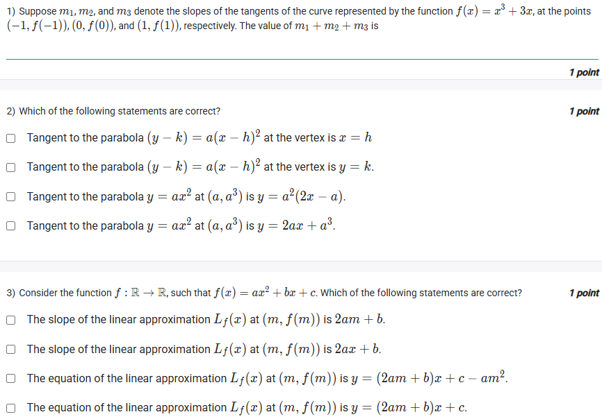
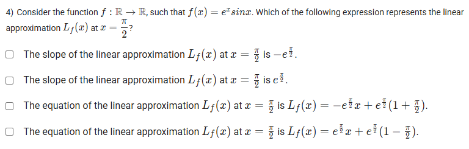
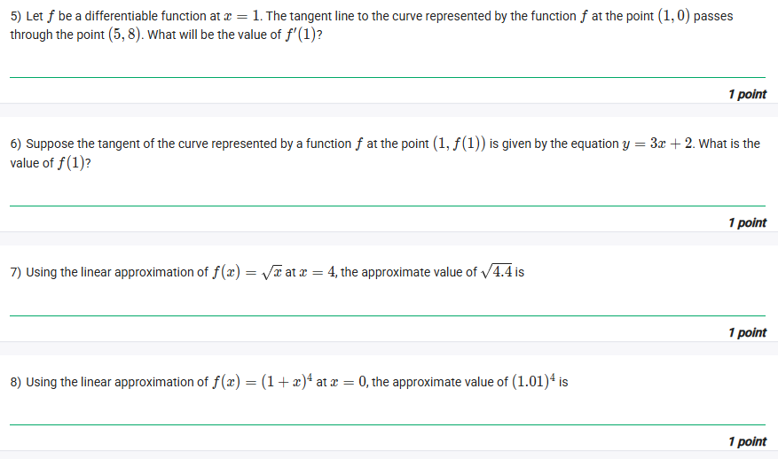

A well-defined collection of distinct objects called elements or members.



https://youtu.be/4IpVR6QpBok

## Exercise Questions

Good morning! Here in India on this Monday, this is a fantastic set of questions that explores one of the most important applications of derivatives: **tangent lines and linear approximations**.

### **Core Concepts: The Derivative, Tangents, and Approximations**

1.  **The Derivative is the Slope of the Tangent Line:**
    The derivative of a function at a point, $f'(a)$, gives you the exact slope of the line that is tangent to the curve $y=f(x)$ at the point $(a, f(a))$.

2.  **Equation of the Tangent Line:**
    Once you know the point of tangency $(a, f(a))$ and the slope $m=f'(a)$, you can write the equation of the tangent line using the point-slope form:
    $$y - f(a) = f'(a)(x - a)$$

3.  **Linear Approximation:**
    The tangent line is the best possible linear approximation of the function near the point of tangency. The formula for the linear approximation, $L(x)$, of a function $f(x)$ near a point $x=a$ is simply the equation of the tangent line solved for y:
    $$L(x) = f(a) + f'(a)(x - a)$$
    For values of $x$ very close to $a$, we can say that $f(x) \approx L(x)$.

---

### **Question 1: Sum of Slopes** (from file `image_65e9ff.png`)

**The Question:**
Suppose $m_1, m_2$, and $m_3$ denote the slopes of the tangents of the curve represented by the function $f(x) = x^3 + 3x$, at the points $(-1, f(-1))$, $(0, f(0))$, and $(1, f(1))$, respectively. The value of $m_1+m_2+m_3$ is \_\_\_\_\_\_\_\_\_\_.

**Detailed Solution:**
1.  **Find the derivative of the function.** The derivative will give us the formula for the slope at any point $x$.
    * $f(x) = x^3 + 3x$
    * $f'(x) = 3x^2 + 3$
2.  **Calculate the slope at each point:**
    * At $x=-1$, the slope is $m_1 = f'(-1) = 3(-1)^2 + 3 = 3(1) + 3 = 6$.
    * At $x=0$, the slope is $m_2 = f'(0) = 3(0)^2 + 3 = 0 + 3 = 3$.
    * At $x=1$, the slope is $m_3 = f'(1) = 3(1)^2 + 3 = 3(1) + 3 = 6$.
3.  **Find the sum:**
    * $m_1 + m_2 + m_3 = 6 + 3 + 6 = 15$.

**Final Answer:** The value is **15**.



### **Question 2: Tangent to a Parabola** (from file `image_65e9ff.png`)

**The Question:**
Which of the following statements are correct?

**Detailed Solution:**
Let's analyze the properties of tangents for the given parabolas.
* **"Tangent to the parabola $(y-k) = a(x-h)^2$ at the vertex is $x=h$"**: The vertex of this parabola is at the point $(h, k)$. At the vertex, the tangent line to a standard parabola is always **horizontal**. A horizontal line has the equation $y=\text{constant}$. So the tangent is $y=k$. The statement says the tangent is $x=h$ (a vertical line). This is **FALSE**.
* **"Tangent to the parabola $(y-k) = a(x-h)^2$ at the vertex is $y=k$"**: As explained above, the tangent at the vertex is a horizontal line passing through the vertex. This statement is **TRUE**.
* **"Tangent to the parabola $y=ax^2$ at $(a, a^3)$ is $y=a^2(2x-a)$"**: Let $f(x)=ax^2$. The derivative is $f'(x)=2ax$. The point of tangency is at $x=a$. The slope at this point is $f'(a)=2a(a)=2a^2$. The y-coordinate is $f(a)=a(a)^2=a^3$. Using the point-slope form: $y - a^3 = 2a^2(x - a) \implies y = 2a^2x - 2a^3 + a^3 \implies y = 2a^2x - a^3$. This does not match the given equation. **FALSE**.
* **"Tangent to the parabola $y=ax^2$ at $(a, a^3)$ is $y=2ax+a^3$"**: This is also **FALSE** based on the calculation above.

**Final Answer:** The only correct statement is **"Tangent to the parabola $(y-k) = a(x-h)^2$ at the vertex is $y=k$."**



### **Question 3: Linear Approximation of a Quadratic** (from file `image_65e9ff.png`)

**The Question:**
Consider the function $f: \mathbb{R} \to \mathbb{R}$, such that $f(x) = ax^2+bx+c$. Which of the following statements are correct?

**Detailed Solution:**
We need to find the linear approximation $L_f(x)$ at the point $(m, f(m))$.
1.  **Find the necessary components for the formula $L(x) = f(m) + f'(m)(x-m)$:**
    * **$f(m)$**: $f(m) = am^2 + bm + c$.
    * **$f'(x)$**: The derivative of $f(x)$ is $f'(x) = 2ax + b$.
    * **$f'(m)$**: The slope at $x=m$ is $f'(m) = 2am + b$.
2.  **Evaluate the options about the slope:**
    * "The slope of the linear approximation... is $2am+b$". This is **TRUE**, as the slope of the approximation is $f'(m)$.
    * "The slope... is $2ax+b$". This is **FALSE**; this is the general derivative function, not the specific slope at $x=m$.
3.  **Construct the equation of the linear approximation:**
    * $L(x) = (am^2 + bm + c) + (2am + b)(x-m)$
    * $L(x) = am^2 + bm + c + (2am+b)x - m(2am+b)$
    * $L(x) = (2am+b)x + am^2 + bm + c - 2am^2 - bm$
    * $L(x) = (2am+b)x + c - am^2$.
4.  **Evaluate the options about the equation:**
    * "The equation... is $y = (2am+b)x + c - am^2$". This matches our calculation. **TRUE**.
    * "The equation... is $y = (2am+b)x + c$". This is **FALSE**.

**Final Answer:**
* **The slope of the linear approximation $L_f(x)$ at $(m, f(m))$ is $2am+b$.**
* **The equation of the linear approximation $L_f(x)$ at $(m, f(m))$ is $y=(2am+b)x+c-am^2$.**



### **Question 4: Linear Approximation of $e^x \sin x$** (from file `image_65e9ba.png`)

**The Question:**
Consider the function $f: \mathbb{R} \to \mathbb{R}$, such that $f(x) = e^x \sin x$. Which of the following expression represents the linear approximation $L_f(x)$ at $x = \frac{\pi}{2}$?

**Detailed Solution:**
We need to find the linear approximation $L(x)$ at $a = \pi/2$.
1.  **Find the point of tangency $(a, f(a))$:**
    * $a = \pi/2$.
    * $f(\pi/2) = e^{\pi/2} \sin(\pi/2) = e^{\pi/2}(1) = e^{\pi/2}$.
2.  **Find the slope of the tangent line, $f'(a)$:**
    * First, find the derivative $f'(x)$ using the product rule:
    * $f'(x) = (e^x)'(\sin x) + (e^x)(\sin x)' = e^x \sin x + e^x \cos x$.
    * Now, evaluate the derivative at $a = \pi/2$:
    * $f'(\pi/2) = e^{\pi/2} \sin(\pi/2) + e^{\pi/2} \cos(\pi/2) = e^{\pi/2}(1) + e^{\pi/2}(0) = e^{\pi/2}$.
3.  **Evaluate the options:**
    * **"The slope of the linear approximation... is $-e^{\pi/2}$"**: **FALSE**. The slope is $e^{\pi/2}$.
    * **"The slope of the linear approximation... is $e^{\pi/2}$"**: **TRUE**.
4.  **Construct the equation of the linear approximation:**
    * $L(x) = f(a) + f'(a)(x-a)$
    * $L(x) = e^{\pi/2} + e^{\pi/2}(x - \pi/2)$
    * We can factor out $e^{\pi/2}$:
    * $L(x) = e^{\pi/2}(1 + x - \pi/2)$ or $L(x) = e^{\pi/2}x + e^{\pi/2}(1 - \pi/2)$.
5.  **Evaluate the options about the equation:**
    * The options given are `-e^{\pi/2}x + ...` and `e^{\pi/2}x + ...`. Our equation's x-term is $e^{\pi/2}x$. Let's check the fourth option:
    * "The equation... is $L_f(x) = e^{\pi/2}x + e^{\pi/2}(1-\frac{\pi}{2})$". This matches our factored form. **TRUE**.

**Final Answer:**
* **The slope of the linear approximation $L_f(x)$ at $x=\frac{\pi}{2}$ is $e^{\pi/2}$.**
* **The equation of the linear approximation... is $L_f(x) = e^{\pi/2}x + e^{\pi/2}(1-\frac{\pi}{2})$.**



### **Question 5: Finding the Derivative from a Tangent Line** (from file `image_65e95c.png`)

**The Question:**
Let $f$ be a differentiable function at $x=1$. The tangent line to the curve represented by the function $f$ at the point $(1, 0)$ passes through the point $(5, 8)$. What will be the value of $f'(1)$?

**Detailed Solution:**
1.  The value of the derivative at a point, $f'(1)$, is the **slope** of the tangent line at $x=1$.
2.  We are told the tangent line passes through two points: the point of tangency $(1, 0)$ and another point $(5, 8)$.
3.  We can calculate the slope ($m$) of this line using the standard slope formula:
    $$m = \frac{y_2 - y_1}{x_2 - x_1} = \frac{8 - 0}{5 - 1} = \frac{8}{4} = 2$$
4.  Since the slope of the tangent line is 2, the value of the derivative at that point is also 2.

**Final Answer:** The value of $f'(1)$ is **2**.



### **Question 6: Finding the Derivative from an Equation** (from file `image_65e95c.png`)

**The Question:**
Suppose the tangent of the curve represented by a function $f$ at the point $(1, f(1))$ is given by the equation $y = 3x+2$. What is the value of $f'(1)$?

**Detailed Solution:**
1.  The value of the derivative, $f'(1)$, is the slope of the tangent line at $x=1$.
2.  The equation of the tangent line is given as $y=3x+2$.
3.  This equation is in the slope-intercept form, $y=mx+c$, where $m$ is the slope.
4.  By comparing the equations, we can see that the slope $m=3$.

**Final Answer:** The value of $f'(1)$ is **3**.



### **Question 7: Linear Approximation of a Square Root** (from file `image_65e95c.png`)

**The Question:**
Using the linear approximation of $f(x) = \sqrt{x}$ at $x=4$, the approximate value of $\sqrt{4.4}$ is \_\_\_\_\_\_\_\_\_\_.

**Detailed Solution:**
1.  **Identify the function and the point of approximation:**
    * $f(x) = \sqrt{x}$
    * We are approximating near a "nice" point, $a=4$.
2.  **Find the components for the linear approximation formula $L(x) = f(a) + f'(a)(x-a)$:**
    * **$f(a)$**: $f(4) = \sqrt{4} = 2$.
    * **$f'(x)$**: The derivative of $\sqrt{x} = x^{1/2}$ is $f'(x) = \frac{1}{2}x^{-1/2} = \frac{1}{2\sqrt{x}}$.
    * **$f'(a)$**: $f'(4) = \frac{1}{2\sqrt{4}} = \frac{1}{2 \cdot 2} = \frac{1}{4}$.
3.  **Construct the linear approximation equation:**
    * $L(x) = 2 + \frac{1}{4}(x-4)$.
4.  **Use the approximation to find the value:**
    * We want to approximate $\sqrt{4.4}$, so we use $x=4.4$.
    * $\sqrt{4.4} \approx L(4.4) = 2 + \frac{1}{4}(4.4 - 4) = 2 + \frac{1}{4}(0.4) = 2 + 0.1 = 2.1$.

**Final Answer:** The approximate value is **2.1**.



### **Question 8: Linear Approximation of a Power Function** (from file `image_65e95c.png`)

**The Question:**
Using the linear approximation of $f(x) = (1+x)^4$ at $x=0$, the approximate value of $(1.01)^4$ is \_\_\_\_\_\_\_\_\_\_.

**Detailed Solution:**
1.  **Identify the function and the point of approximation:**
    * $f(x) = (1+x)^4$.
    * We are approximating near the "nice" point, $a=0$.
    * We want to find $(1.01)^4$, which is the same as $f(0.01)$. So, we will use $x=0.01$.
2.  **Find the components for the linear approximation formula $L(x) = f(a) + f'(a)(x-a)$:**
    * **$f(a)$**: $f(0) = (1+0)^4 = 1$.
    * **$f'(x)$**: Using the chain rule, the derivative is $f'(x) = 4(1+x)^3 \cdot (1) = 4(1+x)^3$.
    * **$f'(a)$**: $f'(0) = 4(1+0)^3 = 4$.
3.  **Construct the linear approximation equation:**
    * $L(x) = 1 + 4(x-0) = 1 + 4x$.
4.  **Use the approximation to find the value:**
    * We want to approximate $f(0.01)$.
    * $(1.01)^4 \approx L(0.01) = 1 + 4(0.01) = 1 + 0.04 = 1.04$.

**Final Answer:** The approximate value is **1.04**.
