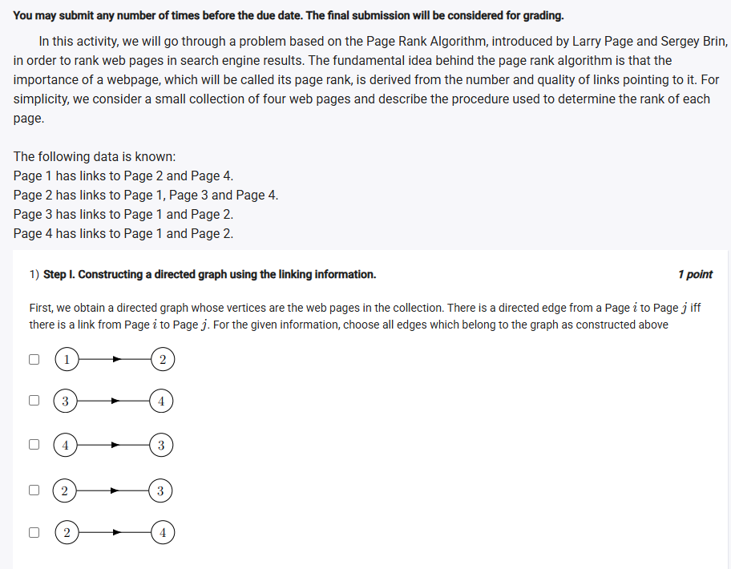
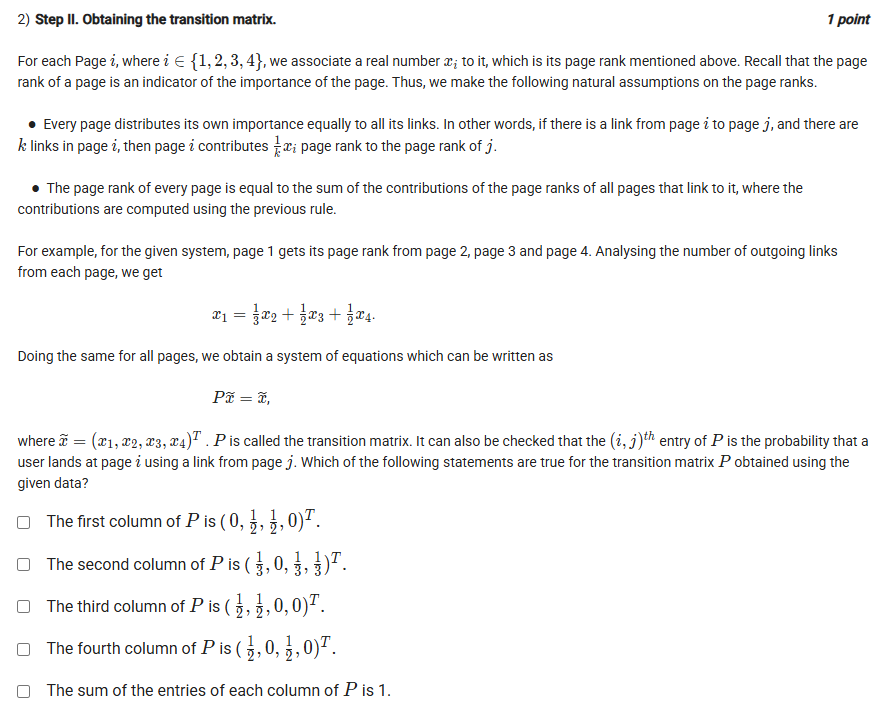
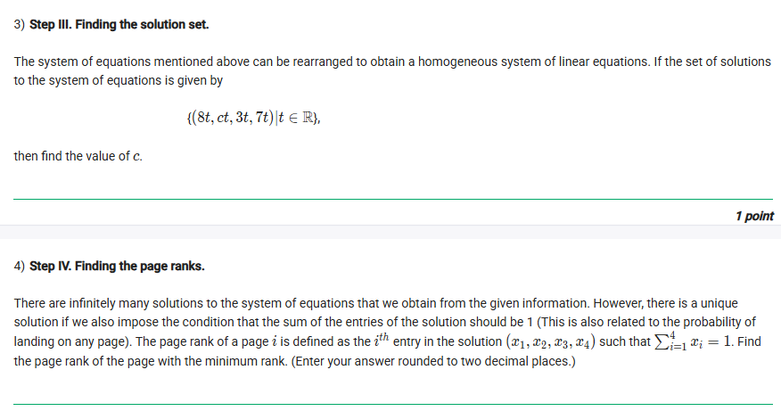

## Exercise Questions 🔥

## Exercise Solutions 🧯

Good morning! Here in India on this Wednesday, let's break down this excellent problem on the PageRank algorithm. It's a great example of how linear algebra is used to model and solve real-world problems like ranking webpages.

This is a multi-step problem, so we'll go through each part in order.

---

### **Question 1: Constructing a directed graph**

**The Question:**
First, we obtain a directed graph whose vertices are the web pages in the collection. There is a directed edge from a Page $i$ to Page $j$ iff there is a link from Page $i$ to Page $j$. For the given information, choose all edges which belong to the graph as constructed above.

**Core Concept:**
We need to translate the given linking information into a visual representation of a directed graph. A link from Page A to Page B is shown as an arrow: A $\to$ B.

**Detailed Solution:**
Let's list the links given in the problem description:
* **Page 1** has links to Page 2 and Page 4. (Edges: $1 \to 2$, $1 \to 4$)
* **Page 2** has links to Page 1, Page 3 and Page 4. (Edges: $2 \to 1$, $2 \to 3$, $2 \to 4$)
* **Page 3** has links to Page 1 and Page 2. (Edges: $3 \to 1$, $3 \to 2$)
* **Page 4** has links to Page 1 and Page 2. (Edges: $4 \to 1$, $4 \to 2$)

Now, we check the options provided in the image:
* $1 \to 2$: This is in our list. **Correct.**
* $3 \to 4$: This is not in our list. Page 3 only links to 1 and 2. Incorrect.
* $4 \to 3$: This is not in our list. Page 4 only links to 1 and 2. Incorrect.
* $2 \to 3$: This is in our list. **Correct.**
* $2 \to 4$: This is in our list. **Correct.**

**Final Answer:** The edges that belong to the graph are **$1 \to 2$**, **$2 \to 3$**, and **$2 \to 4$**.


---

### **Question 2: Obtaining the transition matrix**

**The Question:**
Which of the following statements are true for the transition matrix $P$ obtained using the given data?

**Core Concept:**
The transition matrix $P$ describes how "importance" or page rank is passed between pages. The entry in the $i$-th row and $j$-th column, $P_{ij}$, represents the contribution from page $j$ to page $i$. If page $j$ has $k$ total outgoing links, it contributes $\frac{1}{k}$ of its rank to each page it links to. Therefore, the $j$-th column of the matrix represents the links *from* page $j$.

**Detailed Solution:**
First, let's determine the number of outgoing links from each page:
* Page 1: 2 outgoing links (to 2, 4)
* Page 2: 3 outgoing links (to 1, 3, 4)
* Page 3: 2 outgoing links (to 1, 2)
* Page 4: 2 outgoing links (to 1, 2)

Now we construct the matrix $P$ column by column:

* **Column 1 (From Page 1):** Links to 2 and 4. It contributes $\frac{1}{2}$ to each. The column is $(0, \frac{1}{2}, 0, \frac{1}{2})^T$.
* **Column 2 (From Page 2):** Links to 1, 3, and 4. It contributes $\frac{1}{3}$ to each. The column is $(\frac{1}{3}, 0, \frac{1}{3}, \frac{1}{3})^T$.
* **Column 3 (From Page 3):** Links to 1 and 2. It contributes $\frac{1}{2}$ to each. The column is $(\frac{1}{2}, \frac{1}{2}, 0, 0)^T$.
* **Column 4 (From Page 4):** Links to 1 and 2. It contributes $\frac{1}{2}$ to each. The column is $(\frac{1}{2}, \frac{1}{2}, 0, 0)^T$.

Let's evaluate the given statements:
* "The first column of $P$ is $(0, \frac{1}{2}, 1, 0)^T$." - **FALSE**.
* "The second column of $P$ is $(\frac{1}{3}, 0, \frac{1}{3}, \frac{1}{3})^T$." - **TRUE**.
* "The third column of $P$ is $(\frac{1}{2}, \frac{1}{2}, 0, 0)^T$." - **TRUE**.
* "The fourth column of $P$ is $(\frac{1}{2}, 0, \frac{1}{2}, 0)^T$." - **FALSE**.
* "The sum of the entries of each column of $P$ is 1." - Let's check:
    * Col 1: $0 + \frac{1}{2} + 0 + \frac{1}{2} = 1$
    * Col 2: $\frac{1}{3} + 0 + \frac{1}{3} + \frac{1}{3} = 1$
    * Col 3: $\frac{1}{2} + \frac{1}{2} + 0 + 0 = 1$
    * Col 4: $\frac{1}{2} + \frac{1}{2} + 0 + 0 = 1$
    This statement is **TRUE**.

**Final Answer:** The true statements are:
* **The second column of $P$ is $(\frac{1}{3}, 0, \frac{1}{3}, \frac{1}{3})^T$.**
* **The third column of $P$ is $(\frac{1}{2}, \frac{1}{2}, 0, 0)^T$.**
* **The sum of the entries of each column of $P$ is 1.**


---

### **Question 3: Finding the solution set**

**The Question:**
The system of equations mentioned above can be rearranged to obtain a homogeneous system of linear equations. If the set of solutions to the system of equations is given by $\{(8t, ct, 3t, 7t)|t \in \mathbb{R}\}$, then find the value of $c$.

**Core Concept:**
The solution set represents the eigenvectors corresponding to the eigenvalue 1 of the matrix $P$. This means any vector from the solution set, for example when $t=1$, must satisfy the system of equations $P\vec{x} = \vec{x}$.

**Detailed Solution:**
The system of equations is given by the rows of the matrix $P$ we found in the previous step. The third equation (third row) is the simplest:
$$0 \cdot x_1 + \frac{1}{3} \cdot x_2 + 0 \cdot x_3 + 0 \cdot x_4 = x_3$$
This simplifies to:
$$\frac{1}{3}x_2 = x_3$$
We are given a general form for the solution: $(x_1, x_2, x_3, x_4) = (8t, ct, 3t, 7t)$. Let's substitute these into our simple equation:
$$\frac{1}{3}(ct) = 3t$$
Assuming $t \neq 0$, we can divide both sides by $t$:
$$\frac{1}{3}c = 3$$
Multiplying both sides by 3 gives:
$$c = 9$$

**Final Answer:** The value of $c$ is **9**.


---

### **Question 4: Finding the page ranks**

**The Question:**
There are infinitely many solutions to the system of equations that we obtain from the given information. However, there is a unique solution if we also impose the condition that the sum of the entries of the solution should be 1. The page rank of a page $i$ is defined as the $i^{th}$ entry in the solution $(x_1, x_2, x_3, x_4)$ such that $\sum_{i=1}^4 x_i = 1$. Find the page rank of the page with the minimum rank. (Enter your answer rounded to two decimal places.)

**Core Concept:**
To find the unique page rank vector, we take the general solution and "normalize" it by enforcing the condition that the sum of its components must equal 1.

**Detailed Solution:**
1.  From the previous question, we have the general solution vector:
    $\vec{x} = (8t, 9t, 3t, 7t)$
2.  Apply the condition that the sum of the components is 1:
    $$8t + 9t + 3t + 7t = 1$$
    $$27t = 1$$
    $$t = \frac{1}{27}$$
3.  Now substitute this value of $t$ back into the solution vector to find the specific page ranks:
    * Page Rank 1 ($x_1$) = $8t = \frac{8}{27}$
    * Page Rank 2 ($x_2$) = $9t = \frac{9}{27}$
    * Page Rank 3 ($x_3$) = $3t = \frac{3}{27}$
    * Page Rank 4 ($x_4$) = $7t = \frac{7}{27}$
4.  Identify the minimum rank:
    Comparing the numerators (8, 9, 3, 7), the smallest value is 3. The minimum page rank is $x_3 = \frac{3}{27}$.
5.  Calculate the decimal value and round to two decimal places:
    $$\frac{3}{27} = \frac{1}{9} = 0.1111...$$
    Rounding to two decimal places gives 0.11.

**Final Answer:** The minimum page rank is **0.11**.
