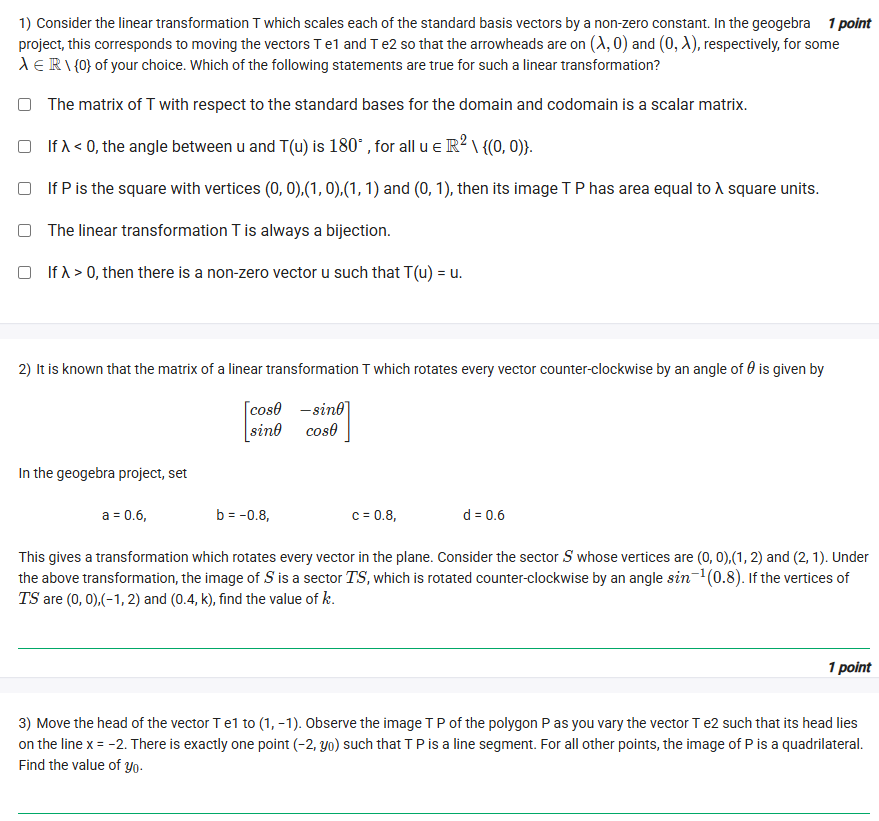
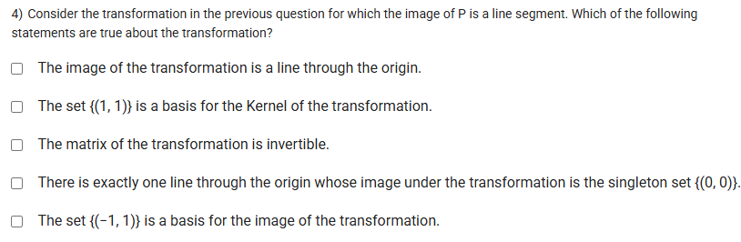

## Exercise Questions 🔥

## Exercise Solutions 🔬

Here are the detailed solutions and concept explanations for each question from your images.



### ❓ Question 1

> 1) Consider the linear transformation T which scales each of the standard basis vectors by a non-zero constant $\lambda$. In the geogebra project, this corresponds to moving the vectors $\mathbf{Te1}$ and $\mathbf{Te2}$ so that the arrowheads are on $(\lambda, 0)$ and $(0, \lambda)$, respectively, for some $\lambda \in \mathbb{R} \setminus \{0\}$ of your choice. Which of the following statements are true for such a linear transformation?
>
> * $\Box$ The matrix of T with respect to the standard bases for the domain and codomain is a scalar matrix.
> * $\Box$ If $\lambda < 0$, the angle between $\mathbf{u}$ and $T(\mathbf{u})$ is $180^\circ$, for all $\mathbf{u} \in \mathbb{R}^2 \setminus \{(0, 0)\}$.
> * $\Box$ If P is the square with vertices $(0, 0), (1, 0), (1, 1)$ and $(0, 1)$, then its image T P has area equal to $\lambda$ square units.
> * $\Box$ If $\lambda > 0$, then there is a non-zero vector $\mathbf{u}$ such that $T(\mathbf{u}) = \mathbf{u}$.

---

### 💡 Answer and Concepts

The **correct statements** are the first two:
* **[TRUE]** The matrix of T... is a scalar matrix.
* **[TRUE]** If $\lambda < 0$, the angle between $\mathbf{u}$ and $T(\mathbf{u})$ is $180^\circ$...

---

### 🧠 Detailed Breakdown

#### 1. Setting up the Matrix
First, let's find the matrix $A$ for this transformation $T$. The context image tells us that the columns of the matrix are the images of the standard basis vectors, $\mathbf{e1} = \begin{bmatrix} 1 \\ 0 \end{bmatrix}$ and $\mathbf{e2} = \begin{bmatrix} 0 \\ 1 \end{bmatrix}$.

* The image of $\mathbf{e1}$ is $\mathbf{Te1} = (\lambda, 0) = \begin{bmatrix} \lambda \\ 0 \end{bmatrix}$. This is the first column.
* The image of $\mathbf{e2}$ is $\mathbf{Te2} = (0, \lambda) = \begin{bmatrix} 0 \\ \lambda \end{bmatrix}$. This is the second column.

So, the matrix of transformation $T$ is:
$$A = \begin{bmatrix} \lambda & 0 \\ 0 & \lambda \end{bmatrix}$$
This transformation is called a **scaling** (or dilation). It scales every vector by a factor of $\lambda$. Let's check this:
$T(\mathbf{u}) = A\mathbf{u} = \begin{bmatrix} \lambda & 0 \\ 0 & \lambda \end{bmatrix} \begin{bmatrix} x \\ y \end{bmatrix} = \begin{bmatrix} \lambda x \\ \lambda y \end{bmatrix} = \lambda \begin{bmatrix} x \\ y \end{bmatrix} = \lambda\mathbf{u}$

Now let's evaluate each statement.

#### 2. Evaluating the Statements

* **Statement 1: "The matrix ... is a scalar matrix."**
    * **Concept:** A **scalar matrix** is a special type of diagonal matrix where all the main diagonal entries are equal. It has the form $kI$, where $k$ is a scalar and $I$ is the identity matrix.
    * **Analysis:** Our matrix is $A = \begin{bmatrix} \lambda & 0 \\ 0 & \lambda \end{bmatrix} = \lambda \begin{bmatrix} 1 & 0 \\ 0 & 1 \end{bmatrix} = \lambda I$.
    * **Conclusion:** This perfectly matches the definition of a scalar matrix. **This statement is TRUE.**

* **Statement 2: "If $\lambda < 0$, the angle between $\mathbf{u}$ and $T(\mathbf{u})$ is $180^\circ$..."**
    * **Concept:** When you multiply a vector $\mathbf{u}$ by a negative scalar (like $\lambda < 0$), the resulting vector $\lambda\mathbf{u}$ has the same magnitude (scaled by $|\lambda|$) but points in the exact opposite direction.
    * **Analysis:** We found that $T(\mathbf{u}) = \lambda\mathbf{u}$. If $\lambda$ is negative, $T(\mathbf{u})$ is a vector pointing in the opposite direction to $\mathbf{u}$. The angle between two vectors pointing in opposite directions is $180^\circ$.
    * **Conclusion:** **This statement is TRUE.**

* **Statement 3: "...its image T P has area equal to $\lambda$ square units."**
    * **Concept:** For any linear transformation $T$ with matrix $A$, the area of a transformed shape is the *original area* multiplied by the *absolute value of the determinant* of the matrix $A$.
    * $\text{Area}(TP) = |\det(A)| \times \text{Area}(P)$
    * **Analysis:**
        * The original shape $P$ is a unit square (vertices (0,0), (1,0), (1,1), (0,1)). Its area is $1 \times 1 = 1$ square unit.
        * The determinant of our matrix $A$ is:
            $\det(A) = \det \begin{bmatrix} \lambda & 0 \\ 0 & \lambda \end{bmatrix} = (\lambda \times \lambda) - (0 \times 0) = \lambda^2$
        * The new area is $\text{Area}(TP) = |\lambda^2| \times 1 = \lambda^2$ (since $\lambda^2$ is always non-negative).
    * **Conclusion:** The statement says the area is $\lambda$. The correct area is $\lambda^2$. These are not the same (unless $\lambda=1$). For example, if $\lambda=3$, the area is $9$, not $3$. If $\lambda=-2$, the area is $4$, not $-2$. **This statement is FALSE.**

* **Statement 4: "If $\lambda > 0$, then there is a non-zero vector $\mathbf{u}$ such that $T(\mathbf{u}) = \mathbf{u}$."**
    * **Concept:** A non-zero vector $\mathbf{u}$ such that $T(\mathbf{u}) = \mathbf{u}$ is called an **eigenvector** of $T$ with an **eigenvalue** of $1$. We need to see if $1$ is an eigenvalue of $A$.
    * **Analysis:** We are looking for a non-zero $\mathbf{u}$ that solves the equation $T(\mathbf{u}) = \mathbf{u}$.
        * We already know $T(\mathbf{u}) = \lambda\mathbf{u}$.
        * So, we need to solve $\lambda\mathbf{u} = \mathbf{u}$.
        * Rearranging gives: $\lambda\mathbf{u} - \mathbf{u} = \mathbf{0} \implies (\lambda - 1)\mathbf{u} = \mathbf{0}$.
        * Since we need a *non-zero* vector $\mathbf{u}$, the only way this equation can be true is if the scalar part is zero: $\lambda - 1 = 0 \implies \lambda = 1$.
    * **Conclusion:** A non-zero vector $\mathbf{u}$ with $T(\mathbf{u})=\mathbf{u}$ exists *only if* $\lambda=1$. The statement claims it's true for *any* $\lambda > 0$ (like $\lambda=2, 3, 0.5$, etc.). This is not true. **This statement is FALSE.**





### ❓ Question 2

> 2) It is known that the matrix of a transformation T which rotates every vector counter-clockwise by an angle of $\theta$ is given by
> $$\begin{bmatrix} \cos\theta & -\sin\theta \\ \sin\theta & \cos\theta \end{bmatrix}$$
> In the geogebra project, set $a = 0.6$, $b = -0.8$, $c = 0.8$, $d = 0.6$.
> This gives a transformation which rotates every vector in the plane. Consider the sector S whose vertices are $(0, 0), (1, 2)$ and $(2, 1)$. Under the above transformation, the image of S is a sector TS, which is rotated counter-clockwise by an angle $\sin^{-1}(0.8)$. If the vertices of TS are $(0, 0), (-1, 2)$ and $(0.4, k)$, find the value of $k$.

---

### 💡 Answer and Concepts

The value of **$k$ is $2.2$**.

---

### 🧠 Detailed Breakdown

#### 1. Identify the Transformation
We are given $a = 0.6$, $b = -0.8$, $c = 0.8$, and $d = 0.6$. The matrix $A$ is:
$$A = \begin{bmatrix} a & b \\ c & d \end{bmatrix} = \begin{bmatrix} 0.6 & -0.8 \\ 0.8 & 0.6 \end{bmatrix}$$
This matches the rotation matrix form with $\cos\theta = 0.6$ and $\sin\theta = 0.8$.

#### 2. Identify the Original Vertices
The vertices of the original sector $S$ are:
* $\mathbf{v}_1 = (0, 0)$
* $\mathbf{v}_2 = (1, 2)$
* $\mathbf{v}_3 = (2, 1)$

#### 3. Identify the Transformed Vertices
The vertices of the image sector $TS$ are the *images* of the original vertices under the transformation $T$.
* $T(\mathbf{v}_1) = T(0, 0)$
* $T(\mathbf{v}_2) = T(1, 2)$
* $T(\mathbf{v}_3) = T(2, 1)$

The problem states these transformed vertices are $(0, 0)$, $(-1, 2)$, and $(0.4, k)$.

#### 4. Calculate the Transformed Vertices
We use matrix multiplication ($T(\mathbf{u}) = A\mathbf{u}$) to find the images.

* **Image of $\mathbf{v}_1$:**
    $T(0, 0) = \begin{bmatrix} 0.6 & -0.8 \\ 0.8 & 0.6 \end{bmatrix} \begin{bmatrix} 0 \\ 0 \end{bmatrix} = \begin{bmatrix} 0 \\ 0 \end{bmatrix}$.
    This is $(0, 0)$. This matches the first vertex given for $TS$.

* **Image of $\mathbf{v}_2$:**
    $T(1, 2) = \begin{bmatrix} 0.6 & -0.8 \\ 0.8 & 0.6 \end{bmatrix} \begin{bmatrix} 1 \\ 2 \end{bmatrix} = \begin{bmatrix} (0.6 \times 1) + (-0.8 \times 2) \\ (0.8 \times 1) + (0.6 \times 2) \end{bmatrix} = \begin{bmatrix} 0.6 - 1.6 \\ 0.8 + 1.2 \end{bmatrix} = \begin{bmatrix} -1.0 \\ 2.0 \end{bmatrix}$.
    This is $(-1, 2)$. This matches the second vertex given for $TS$.

* **Image of $\mathbf{v}_3$:**
    $T(2, 1) = \begin{bmatrix} 0.6 & -0.8 \\ 0.8 & 0.6 \end{bmatrix} \begin{bmatrix} 2 \\ 1 \end{bmatrix} = \begin{bmatrix} (0.6 \times 2) + (-0.8 \times 1) \\ (0.8 \times 2) + (0.6 \times 1) \end{bmatrix} = \begin{bmatrix} 1.2 - 0.8 \\ 1.6 + 0.6 \end{bmatrix} = \begin{bmatrix} 0.4 \\ 2.2 \end{bmatrix}$.
    This is $(0.4, 2.2)$.

#### 5. Find k
The problem states that the third vertex of $TS$ is $(0.4, k)$. By comparing this with our calculation, we can see:
$(0.4, k) = (0.4, 2.2)$
Therefore, **$k = 2.2$**.





### ❓ Question 3

> 3) Move the head of the vector $\mathbf{Te1}$ to $(1, -1)$. Observe the image T P of the polygon P as you vary the vector $\mathbf{Te2}$ such that its head lies on the line $x = -2$. There is exactly one point $(-2, y_0)$ such that T P is a line segment. For all other points, the image of P is a quadrilateral. Find the value of $y_0$.

---

### 💡 Answer and Concepts

The value of **$y_0$ is $2$**.

---

### 🧠 Detailed Breakdown

#### 1. Concept: When does a 2D shape collapse to a line?
A linear transformation $T: \mathbb{R}^2 \to \mathbb{R}^2$ maps the *entire plane* onto a *line* (or a single point) if and only if its matrix $A$ is **singular**.
* A matrix is **singular** if its determinant is zero ($\det(A) = 0$).
* If $\det(A) = 0$, the columns of the matrix are linearly dependent. This means one column is a scalar multiple of the other.
* This also means the transformation is not invertible and it "collapses" 2D space into a lower dimension (a 1D line or 0D point).

The question states that the image $TP$ (which is normally a 2D quadrilateral) becomes a 1D **line segment**. This tells us we must find the value of $y_0$ that makes the transformation matrix $A$ singular, i.e., $\det(A) = 0$.

#### 2. Set up the Matrix
* We are told to move $\mathbf{Te1}$ to $(1, -1)$. This gives us the first column of $A$:
    $\mathbf{c}_1 = \begin{bmatrix} 1 \\ -1 \end{bmatrix}$
* We are told $\mathbf{Te2}$ is a point $(-2, y_0)$. This gives us the second column of $A$:
    $\mathbf{c}_2 = \begin{bmatrix} -2 \\ y_0 \end{bmatrix}$

* The full matrix $A$ is:
    $$A = \begin{bmatrix} 1 & -2 \\ -1 & y_0 \end{bmatrix}$$

#### 3. Solve for $y_0$
Now, we set the determinant of $A$ to zero and solve for $y_0$.

* $\det(A) = (1 \times y_0) - (-2 \times -1)$
* $\det(A) = y_0 - 2$

* Set the determinant to zero:
    $y_0 - 2 = 0$
    $y_0 = 2$

#### 4. Verification (Optional)
If $y_0 = 2$, the matrix is $A = \begin{bmatrix} 1 & -2 \\ -1 & 2 \end{bmatrix}$.
Notice that the second column $\begin{bmatrix} -2 \\ 2 \end{bmatrix}$ is exactly $-2$ times the first column $\begin{bmatrix} 1 \\ -1 \end{bmatrix}$. They are linearly dependent, confirming the matrix is singular.

This matrix will map *any* vector $\mathbf{u} = (x, y)$ onto the line $v = -u$.
$T(x, y) = \begin{bmatrix} 1 & -2 \\ -1 & 2 \end{bmatrix} \begin{bmatrix} x \\ y \end{bmatrix} = \begin{bmatrix} x - 2y \\ -x + 2y \end{bmatrix} = (x - 2y) \begin{bmatrix} 1 \\ -1 \end{bmatrix}$.
Since $(x - 2y)$ is just a scalar, every output vector is a multiple of $(1, -1)$, which describes the line $v = -u$. Thus, the entire square $P$ is squashed onto a segment of this line.





### ❓ Question 4

> 4) Consider the transformation in the previous question for which the image of P is a line segment. Which of the following statements are true about the transformation?
>
> * $\Box$ The image of the transformation is a line through the origin.
> * $\Box$ The set $\{(1, 1)\}$ is a basis for the Kernel of the transformation.
> * $\Box$ The matrix of the transformation is invertible.
> * $\Box$ There is exactly one line through the origin whose image under the transformation is the singleton set $\{(0, 0)\}$.
> * $\Box$ The set $\{(-1, 1)\}$ is a basis for the image of the transformation.

---

### 💡 Answer and Concepts

From the previous question, we are using the transformation $T$ defined by the matrix $A = \begin{bmatrix} 1 & -2 \\ -1 & 2 \end{bmatrix}$.

The **correct statements** are:
* **[TRUE]** The image of the transformation is a line through the origin.
* **[TRUE]** There is exactly one line through the origin whose image under the transformation is the singleton set $\{(0, 0)\}$.
* **[TRUE]** The set $\{(-1, 1)\}$ is a basis for the image of the transformation.

---

### 🧠 Detailed Breakdown

Let's analyze our matrix $A = \begin{bmatrix} 1 & -2 \\ -1 & 2 \end{bmatrix}$.

* **Statement 1: "The image ... is a line through the origin."**
    * **Concept:** The **Image** (also called the Range or Column Space) of a transformation $T$ is the set of all possible output vectors. It is the span of the columns of its matrix $A$.
    * **Analysis:** The columns of $A$ are $\mathbf{c}_1 = \begin{bmatrix} 1 \\ -1 \end{bmatrix}$ and $\mathbf{c}_2 = \begin{bmatrix} -2 \\ 2 \end{bmatrix}$.
        * Since $\mathbf{c}_2 = -2 \times \mathbf{c}_1$, the two vectors are linearly dependent. They point along the same line.
        * The span of these two vectors is just the span of one of them, e.g., $\text{span}(\begin{bmatrix} 1 \\ -1 \end{bmatrix})$.
        * The set of all vectors $k \begin{bmatrix} 1 \\ -1 \end{bmatrix}$ (for any scalar $k$) describes the line $y = -x$.
    * **Conclusion:** A line $y = -x$ is, by definition, a line through the origin. **This statement is TRUE.**

* **Statement 2: "The set $\{(1, 1)\}$ is a basis for the Kernel..."**
    * **Concept:** The **Kernel** (or Null Space) of $T$ is the set of all input vectors $\mathbf{u}$ that get mapped to the zero vector: $T(\mathbf{u}) = \mathbf{0}$. We find it by solving $A\mathbf{u} = \mathbf{0}$.
    * **Analysis:** We need to solve $\begin{bmatrix} 1 & -2 \\ -1 & 2 \end{bmatrix} \begin{bmatrix} x \\ y \end{bmatrix} = \begin{bmatrix} 0 \\ 0 \end{bmatrix}$.
        * This gives the system:
            $x - 2y = 0$
            $-x + 2y = 0$
        * Both equations simplify to $x = 2y$.
        * Any vector in the kernel must have the form $\begin{bmatrix} x \\ y \end{bmatrix} = \begin{bmatrix} 2y \\ y \end{bmatrix} = y \begin{bmatrix} 2 \\ 1 \end{bmatrix}$.
        * The kernel is the line spanned by the vector $(2, 1)$. A basis for the kernel is $\{(2, 1)\}$.
    * **Conclusion:** The statement says the basis is $\{(1, 1)\}$. This is incorrect. The vector $(1, 1)$ isn't even in the kernel (since $1 \neq 2 \times 1$). **This statement is FALSE.**

* **Statement 3: "The matrix ... is invertible."**
    * **Concept:** A matrix is **invertible** if and only if its determinant is non-zero.
    * **Analysis:** We found in Q3 that this matrix is singular.
        $\det(A) = (1)(2) - (-2)(-1) = 2 - 2 = 0$.
    * **Conclusion:** Since the determinant is 0, the matrix is *not* invertible. **This statement is FALSE.**

* **Statement 4: "There is exactly one line through the origin whose image ... is ... $\{(0, 0)\}$."**
    * **Concept:** This is just a rephrasing of the definition of the Kernel. The set of *all* vectors whose image is $\{(0, 0)\}$ *is* the kernel.
    * **Analysis:** In our analysis for Statement 2, we found that the kernel is the set of vectors $y \begin{bmatrix} 2 \\ 1 \end{bmatrix}$. This is the line $y = (1/2)x$.
    * **Conclusion:** The kernel is indeed a single, unique line passing through the origin. **This statement is TRUE.**

* **Statement 5: "The set $\{(-1, 1)\}$ is a basis for the image..."**
    * **Concept:** A **basis** for a space is a set of linearly independent vectors that span that space. For a 1D space (a line), any single non-zero vector on that line is a valid basis.
    * **Analysis:** In Statement 1, we found the image is the line $y = -x$, spanned by the vector $(1, -1)$.
        * The vector given is $(-1, 1)$.
        * Does $(-1, 1)$ lie on the line $y = -x$? Yes, $1 = -(-1)$.
        * Is $(-1, 1)$ a scalar multiple of our original basis vector $(1, -1)$? Yes, $(-1, 1) = -1 \times (1, -1)$.
    * **Conclusion:** Since $\{(-1, 1)\}$ is a non-zero vector that spans the exact same line (the image), it is a valid basis for the image. **This statement is TRUE.**



I hope this detailed breakdown helps you understand the concepts of linear transformations! Would you like to explore any of these concepts, like "kernel" or "determinant," in more detail?