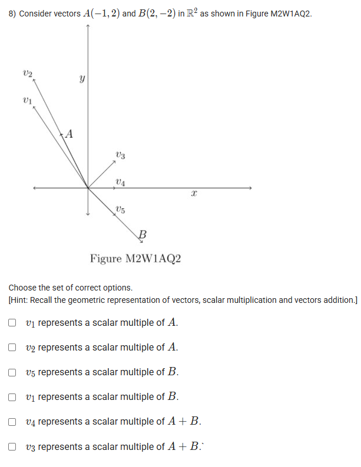



https://youtu.be/1So2VV9Tm_A

## Exercise Questions 🔥

## Exercise Solutions 🧯

Of course! Here are the detailed answers and concepts for each of the questions you provided.



### Question 1: Basic Vector Operations

**Problem**
Choose the set of correct options using Figure M2W1AQ1.
(The figure shows points A(1, 2) and B(2, 3) which can be represented by vectors `A = (1, 2)` and `B = (2, 3)`).

**Options**
* `2A` is the vector `(2, 4)`.
* `3B` is the vector `(6, 9)`.
* `A + B` is the vector `(3, 5)`. (Assuming a typo in the original option)
* `A - B` is the vector `(-1, -1)`.

***

#### **Correct Options**
* `2A` is the vector `(2, 4)`.
* `3B` is the vector `(6, 9)`.
* `A + B` is the vector `(3, 5)`.
* `A - B` is the vector `(-1, -1)`.

#### **Concepts Explained 💡**
Vector operations are performed coordinate-wise.
* **Scalar Multiplication:** To multiply a vector by a scalar (a number), you multiply each component of the vector by that scalar.
    * `k * (x, y) = (k*x, k*y)`
* **Vector Addition/Subtraction:** To add or subtract vectors, you add or subtract their corresponding components.
    * `(x₁, y₁) + (x₂, y₂) = (x₁ + x₂, y₁ + y₂)`
    * `(x₁, y₁) - (x₂, y₂) = (x₁ - x₂, y₁ - y₂)`

#### **Step-by-Step Solution**
* **`2A`**: `2 * (1, 2) = (2 * 1, 2 * 2) = (2, 4)`
* **`3B`**: `3 * (2, 3) = (3 * 2, 3 * 3) = (6, 9)`
* **`A + B`**: `(1, 2) + (2, 3) = (1 + 2, 2 + 3) = (3, 5)`
* **`A - B`**: `(1, 2) - (2, 3) = (1 - 2, 2 - 3) = (-1, -1)`

All the statements are correct.




### Question 2: Linear Combination of Vectors

**Problem**
Let `V₁ = (1, 1)`, `V₂ = (1, 0)`, and `V₃ = (0, 1)` be three vectors. Find out the correct set of options.

**Options**
* `(2, 3) = 2V₁ + 0V₂ + V₃`
* `(2, 3) = 0V₁ + 2V₂ + 3V₃`
* `(2, 3) = 2V₁ + V₂ + 0V₃`
* `(2, 3) = 0V₁ + 3V₂ + 2V₃`

***

#### **Correct Options**
* `(2, 3) = 2V₁ + 0V₂ + V₃`
* `(2, 3) = 0V₁ + 2V₂ + 3V₃`

#### **Concepts Explained 💡**
A **linear combination** of vectors is an expression constructed from a set of vectors by multiplying each vector by a scalar and adding the results. To check if an equation is true, simply calculate the right-hand side and see if it equals the left-hand side.

#### **Step-by-Step Solution**
We evaluate the right-hand side for each option:
* **Option 1:** `2(1, 1) + 0(1, 0) + 1(0, 1) = (2, 2) + (0, 0) + (0, 1) = (2, 3)`. **This is correct.**
* **Option 2:** `0(1, 1) + 2(1, 0) + 3(0, 1) = (0, 0) + (2, 0) + (0, 3) = (2, 3)`. **This is correct.**
* **Option 3:** `2(1, 1) + 1(1, 0) + 0(0, 1) = (2, 2) + (1, 0) + (0, 0) = (3, 2)`. This is incorrect.
* **Option 4:** `0(1, 1) + 3(1, 0) + 2(0, 1) = (0, 0) + (3, 0) + (0, 2) = (3, 2)`. This is incorrect.




### Question 3, 4, 5: Vectors in Data Representation

This set of questions refers to the following table of marks:

|          | Quiz 1 | Quiz 2 | End sem |
| :------- | :----: | :----: | :-----: |
| Karthika |   51   |   50   |   61    |
| Romy     |   33   |   41   |   45    |
| Farzana  |   38   |   21   |   35    |

***

### Question 3: Vector Representation

**Problem**
Choose the following set of correct options.
* Marks obtained by Romy in Quiz 1, Quiz 2 and End sem represent a row vector.
* Quiz 2 marks of Karthika, Romy and Farzana represent a column vector.
* Number of components in column vector representing Quiz 2 marks are 9.
* Number of components in row vector representing Romy's marks are 3.

#### **Correct Options**
* Marks obtained by Romy in Quiz 1, Quiz 2 and End sem represent a row vector.
* Quiz 2 marks of Karthika, Romy and Farzana represent a column vector.
* Number of components in row vector representing Romy's marks are 3.

#### **Explanation**
* **Romy's marks** across the exams can be written as `[33, 41, 45]`, which is a **row vector** with **3 components**.
* The **Quiz 2 marks** for all students can be written as `[50, 41, 21]ᵀ`, which is a **column vector** with **3 components**.
* The statement that the Quiz 2 vector has 9 components is incorrect.

***

### Question 4: Scalar Multiplication

**Problem**
In order to improve her marks, Farzana undertook project work and succeeded in increasing her marks. Her marks became doubled for each exam. Choose the correct options.
* To obtain the marks obtained by Farzana after completion of the project, scalar multiplication has to be done by 2 to the row vector representing Farzana's marks.
* After completion of the project the row vector representing Farzana's marks is (76, 42, 70).

#### **Correct Options**
* To obtain the marks obtained by Farzana after completion of the project, scalar multiplication has to be done by 2 to the row vector representing Farzana's marks.
* After completion of the project the row vector representing Farzana's marks is (76, 42, 70).

#### **Explanation**
* Farzana's initial marks vector is `F = [38, 21, 35]`.
* Doubling her marks means performing a **scalar multiplication by 2**.
* The new marks vector is `2 * F = 2 * [38, 21, 35] = [76, 42, 70]`.

***

### Question 5: Vector Addition

**Problem**
Following Farzana's improved marks (doubled for each exam), all students were given bonus marks in Quiz 2, given by the column vector `[10, 12, 15]ᵀ`. What will be the column vector representing the final marks obtained in Quiz 2 by Karthika, Romy and Farzana?

#### **Correct Option**
* `[60, 53, 57]ᵀ`

#### **Explanation**
1.  **Initial Quiz 2 Marks:** The column vector for original Quiz 2 marks is `Q₂_initial = [50, 41, 21]ᵀ`.
2.  **Farzana's Improvement:** Farzana's Quiz 2 mark is doubled: `21 * 2 = 42`. The marks vector before the bonus is `Q₂_improved = [50, 41, 42]ᵀ`.
3.  **Add Bonus Marks:** Add the bonus vector to the improved marks vector.
    `Final Marks = Q₂_improved + Bonus`
    `= [50, 41, 42]ᵀ + [10, 12, 15]ᵀ`
    `= [50+10, 41+12, 42+15]ᵀ = [60, 53, 57]ᵀ`.




### Question 6: Vector Identities

**Problem**
Let A and B be two vectors. Which of the following statements is (are) true?
* `3A + 5B = 3(A + B) + [(A + B) - (A - B)]`
* `3A + 5B = 5(A + B) - [(A + B) - (A - B)]`
* `3A + 5B = 3(A + B) + [(A + B) + (A - B)]`
* `3A + 5B = 5(A + B) - [(A + B) + (A - B)]`

***

#### **Correct Options**
* `3A + 5B = 3(A + B) + [(A + B) - (A - B)]`
* `3A + 5B = 5(A + B) - [(A + B) + (A - B)]`

#### **Concepts Explained 💡**
To verify vector identities, simplify the right-hand side (RHS) using basic vector algebra and check if it equals the left-hand side (LHS). Two helpful simplifications are:
* `(A + B) + (A - B) = 2A`
* `(A + B) - (A - B) = 2B`

#### **Step-by-Step Solution**
* **Option 1:**
    RHS = `3(A + B) + [2B] = 3A + 3B + 2B = 3A + 5B`. This matches the LHS. **Correct.**
* **Option 2:**
    RHS = `5(A + B) - [2B] = 5A + 5B - 2B = 5A + 3B`. This does not match. Incorrect.
* **Option 3:**
    RHS = `3(A + B) + [2A] = 3A + 3B + 2A = 5A + 3B`. This does not match. Incorrect.
* **Option 4:**
    RHS = `5(A + B) - [2A] = 5A + 5B - 2A = 3A + 5B`. This matches the LHS. **Correct.**




### Question 7: Standard Basis Vectors

**Problem**
Let `V₁ = (1, 0, 0)`, `V₂ = (0, 1, 0)` and `V₃ = (0, 0, 1)` be three vectors and `a, b, c` be three real numbers (scalars). Which of the following is (are) true?
* `(a, b, c) = aV₁ + bV₂ + cV₃`
* `(a, b, c) = abV₁ + bcV₂ + caV₃`
* `(a, 0, c) = aV₁ + cV₂ + 0V₃`
* `(a, 0, c) = aV₁ + 0V₂ + cV₃`

***

#### **Correct Options**
* `(a, b, c) = aV₁ + bV₂ + cV₃`
* `(a, 0, c) = aV₁ + 0V₂ + cV₃`

#### **Concepts Explained 💡**
The vectors `V₁`, `V₂`, and `V₃` are the **standard basis vectors** in 3D space, often denoted as `î`, `ĵ`, and `k̂`. Any vector `(x, y, z)` can be uniquely expressed as a linear combination `xV₁ + yV₂ + zV₃`.

#### **Step-by-Step Solution**
* **Option 1:** `aV₁ + bV₂ + cV₃ = a(1,0,0) + b(0,1,0) + c(0,0,1) = (a,0,0) + (0,b,0) + (0,0,c) = (a,b,c)`. **Correct.**
* **Option 2:** `abV₁ + bcV₂ + caV₃ = (ab, bc, ca)`. This is not equal to `(a,b,c)`. Incorrect.
* **Option 3:** `aV₁ + cV₂ + 0V₃ = a(1,0,0) + c(0,1,0) = (a, c, 0)`. This is not equal to `(a,0,c)`. Incorrect.
* **Option 4:** `aV₁ + 0V₂ + cV₃ = a(1,0,0) + 0 + c(0,0,1) = (a, 0, c)`. **Correct.**




### Question 8: Geometric Interpretation of Vectors

**Problem**
Consider vectors `A(-1, 2)` and `B(2, -2)`. Choose the set of correct options based on the figure.

#### **Correct Options**
* `v₁` represents a scalar multiple of A.
* `v₂` represents a scalar multiple of A.
* `v₅` represents a scalar multiple of B.
* `v₄` represents a scalar multiple of A + B.

#### **Concepts Explained 💡**
* **Scalar Multiple:** The vector `k * A` is a scalar multiple of `A`. Geometrically, it lies on the same line as `A` (passing through the origin). If `k > 0`, it's in the same direction; if `k < 0`, it's in the opposite direction.
* **Vector Addition:** The vector `A + B` is found by adding the components. Geometrically, it is the diagonal of the parallelogram formed by vectors A and B.

#### **Step-by-Step Solution**
1.  **Analyze Scalar Multiples of A:** Vector `A = (-1, 2)` is in the second quadrant. Any scalar multiple of A must lie on the line passing through the origin and `(-1, 2)`. Both `v₁` and `v₂` lie on this line.
2.  **Analyze Scalar Multiples of B:** Vector `B = (2, -2)` is in the fourth quadrant. Any scalar multiple of B must lie on the line passing through the origin and `(2, -2)`. Vector `v₅` lies on this line.
3.  **Analyze A + B:** `A + B = (-1, 2) + (2, -2) = (1, 0)`. This is a vector pointing along the positive x-axis. Any scalar multiple of `A + B` must lie on the x-axis. Vector `v₄` lies on the positive x-axis.




### Question 9 & 10: Solving a Vector Equation

**Problem**
Let `A = (1, 1, 1)` and `B = (2, -1, 4)` be two vectors. Suppose `c.A + 3B = (4, j, k)`, where `c, j, k` are real numbers (scalars).
**9) Find the value of c.**
**10) Find the value of j + k.**

***

#### **Answers**
* **9) c = -2**
* **10) j + k = 5**

#### **Concepts Explained 💡**
To solve a vector equation, perform the scalar multiplication and vector addition on one side. Then, equate the corresponding components of the vectors on both sides of the equation to form a system of simple equations.

#### **Step-by-Step Solution**
1.  **Set up the equation:**
    `c * (1, 1, 1) + 3 * (2, -1, 4) = (4, j, k)`

2.  **Perform the operations on the left side:**
    `(c, c, c) + (6, -3, 12) = (4, j, k)`
    `(c + 6, c - 3, c + 12) = (4, j, k)`

3.  **Equate components to find c (for Question 9):**
    The first components must be equal:
    `c + 6 = 4`
    `c = 4 - 6 = -2`

4.  **Use c to find j and k (for Question 10):**
    * Equate the second components: `j = c - 3 = -2 - 3 = -5`
    * Equate the third components: `k = c + 12 = -2 + 12 = 10`

5.  **Calculate j + k:**
    `j + k = -5 + 10 = 5`

