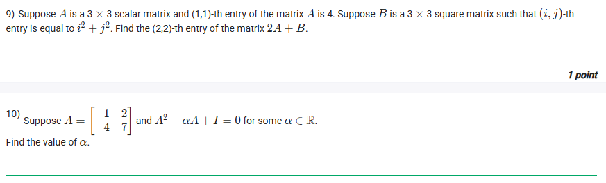



https://youtu.be/rnIDlZnrCc0

Of course! Here are the detailed solutions and explanations for each of the questions you provided.



### Question 1: Matrix Basics

**Problem**
Suppose $A = \begin{bmatrix} 2 & 4 & 5 & 1 \\ 11 & -2 & 9 & -6 \\ -3 & 4 & 7 & 7 \end{bmatrix}$. Which of the following is true about the matrix A?
[Hint: The (i, j)-th entry is the entry which is at the i-th row and j-th column.]

**Options**
* It is a $4 \times 3$ matrix.
* It is a $3 \times 4$ matrix.
* (2, 3)-th entry of the matrix A is 4.
* (2, 3)-th entry of the matrix A is 9.

***

#### **Correct Options**
* It is a $3 \times 4$ matrix.
* (2, 3)-th entry of the matrix A is 9.

#### **Concepts Explained 💡**
* **Order of a Matrix:** The order (or dimension) of a matrix is given by `(number of rows) × (number of columns)`.
* **Matrix Entry:** An entry is identified by its position, `(row, column)`. The `(i, j)`-th entry is the element located at the i-th row and j-th column.

#### **Step-by-Step Solution**
1.  **Determine the Order:** The matrix A has 3 horizontal rows and 4 vertical columns. Therefore, its order is $3 \times 4$.
2.  **Identify the (2, 3)-th Entry:** We need the element in the 2nd row and the 3rd column.
    * Row 2 is `[11, -2, 9, -6]`.
    * The 3rd element in this row is `9`.
    * Therefore, the (2, 3)-th entry is 9.




### Question 2: Types of Matrices

**Problem**
Which of the following statements is (are) TRUE?
[Hint: Recall, the definitions of scalar matrix, diagonal matrix, and identity matrix.]

**Options**
* Any diagonal matrix is a scalar matrix.
* Scalar matrices may not be square matrices.
* Scalar matrices must be square matrices.
* Any scalar matrix is an identity matrix.

***

#### **Correct Option**
* Scalar matrices must be square matrices.

#### **Concepts Explained 💡**
* **Square Matrix:** A matrix with an equal number of rows and columns.
* **Diagonal Matrix:** A **square matrix** where all elements outside the main diagonal are zero. The diagonal elements can be any value. Example: $\begin{bmatrix} 1 & 0 \\ 0 & 5 \end{bmatrix}$.
* **Scalar Matrix:** A special type of **diagonal matrix** where all the elements on the main diagonal are equal. Example: $\begin{bmatrix} 7 & 0 \\ 0 & 7 \end{bmatrix}$.
* **Identity Matrix (I):** A special type of **scalar matrix** where all the elements on the main diagonal are 1. Example: $\begin{bmatrix} 1 & 0 \\ 0 & 1 \end{bmatrix}$.

The hierarchy is: Identity Matrix $\subset$ Scalar Matrix $\subset$ Diagonal Matrix $\subset$ Square Matrix.

#### **Analysis of Options**
* **Any diagonal matrix is a scalar matrix:** False. A diagonal matrix can have different values on its diagonal (e.g., $\begin{bmatrix} 1 & 0 \\ 0 & 5 \end{bmatrix}$), while a scalar matrix must have equal values.
* **Scalar matrices may not be square matrices:** False. A scalar matrix is a type of diagonal matrix, which, by definition, must be square.
* **Scalar matrices must be square matrices:** True. This follows directly from the definition.
* **Any scalar matrix is an identity matrix:** False. A scalar matrix can have any value on its diagonal (e.g., $\begin{bmatrix} 7 & 0 \\ 0 & 7 \end{bmatrix}$), while the identity matrix must have 1s.




### Question 3: Matrix Representation of Linear Equations

**Problem**
Given the system of linear equations:
$7x_1 + 10x_2 + 12x_3 = 36$
$8x_1 + 4x_2 - 9x_3 = 11$
$4x_1 - x_2 + 3x_3 = 10$
if the matrix representation is $Ax = b$, where $x = \begin{bmatrix} x_1 \\ x_2 \\ x_3 \end{bmatrix}$, then what are A and b?

***

#### **Correct Option**
* $A = \begin{bmatrix} 7 & 10 & 12 \\ 8 & 4 & -9 \\ 4 & -1 & 3 \end{bmatrix}, b = \begin{bmatrix} 36 \\ 11 \\ 10 \end{bmatrix}$

#### **Concepts Explained 💡**
A system of linear equations can be written in the compact matrix form $Ax = b$.
* **A** is the **coefficient matrix**, containing the coefficients of the variables in each equation. Each row in the matrix corresponds to an equation.
* **x** is the **variable vector**, a column vector containing the variables.
* **b** is the **constant vector**, a column vector containing the constants from the right-hand side of each equation.

#### **Step-by-Step Solution**
1.  **Form the Coefficient Matrix (A):** Write the coefficients of $x_1, x_2, x_3$ from each equation as a row in the matrix.
    * From Eq 1: `[7, 10, 12]`
    * From Eq 2: `[8, 4, -9]`
    * From Eq 3: `[4, -1, 3]` (Note that $-x_2$ has a coefficient of -1).
2.  **Form the Constant Vector (b):** Write the constants from the right-hand side of each equation as a column vector.
    * `[36, 11, 10]`
This matches the first option.




### Question 4: Rules for Matrix Operations

**Problem**
Which of the following statements is (are) TRUE?

**Options**
* Addition of two matrices is possible only if the number of columns in the first matrix is same as the number of rows in the second matrix.
* Addition of two matrices is possible only if the orders of both the matrices are the same.
* Defining $AB$ is possible if the number of rows in the matrix $A$ is same as the number of columns in the matrix $B$.
* Defining $AB$ is possible if the number of columns in the matrix $A$ is same as the number of rows in the matrix $B$.

***

#### **Correct Options**
* Addition of two matrices is possible only if the orders of both the matrices are the same.
* Defining $AB$ is possible if the number of columns in the matrix $A$ is same as the number of rows in the matrix $B$.

#### **Concepts Explained 💡**
* **Matrix Addition:** To add two matrices, they must have the exact same dimensions (e.g., both are $3 \times 2$). The addition is then performed element-wise.
* **Matrix Multiplication:** For the product $AB$ to be defined, the "inner" dimensions must match. If A is an $m \times \mathbf{n}$ matrix and B is an $\mathbf{n} \times p$ matrix, the product is possible, and the resulting matrix will have the order $m \times p$.




### Question 5: Matrix Operations and Orders

**Problem**
Suppose $P = \begin{bmatrix} 3 & -1 & 7 \\ 4 & 0 & 1 \\ 2 & -5 & 2 \end{bmatrix}, Q = \begin{bmatrix} 1 & 4 & -9 \end{bmatrix}, R = \begin{bmatrix} 0 & -3 & 10 \end{bmatrix}, D = \begin{bmatrix} -2 \\ 4 \\ 5 \end{bmatrix}$.
Which of the following statements are true?

***

#### **Correct Options**
* The matrix $PD$ is of order $3 \times 1$.
* The matrix $QD$ is of order $1 \times 1$.
* The matrix $DQ$ is of order $3 \times 3$.
* The product $QR$ is not defined.
* The addition $P + Q$ is not defined.
* The addition $P + D$ is not defined.

#### **Concepts Explained 💡**
* **Order of Product:** If A is ($m \times n$) and B is ($n \times p$), then AB is ($m \times p$).
* **Condition for Addition:** Matrices must have the same order to be added.

#### **Step-by-Step Analysis**
1.  **List the orders:**
    * P: $3 \times 3$
    * Q: $1 \times 3$
    * R: $1 \times 3$
    * D: $3 \times 1$
2.  **Check each statement:**
    * **PD:** P($3 \times \mathbf{3}$) and D($\mathbf{3} \times 1$). Inner dimensions (3 and 3) match. The resulting order is $3 \times 1$.
    * **QD:** Q($1 \times \mathbf{3}$) and D($\mathbf{3} \times 1$). Inner dimensions (3 and 3) match. The resulting order is $1 \times 1$.
    * **DQ:** D($3 \times \mathbf{1}$) and Q($\mathbf{1} \times 3$). Inner dimensions (1 and 1) match. The resulting order is $3 \times 3$.
    * **QR:** Q($1 \times 3$) and R($1 \times 3$). Inner dimensions (3 and 1) do not match. Product is not defined.
    * **P + Q:** P($3 \times 3$) and Q($1 \times 3$). Orders are different. Addition is not defined.
    * **P + D:** P($3 \times 3$) and D($3 \times 1$). Orders are different. Addition is not defined.




### Question 6: Matrix Properties and Equations

**Problem**
Choose the set of correct options.

***

#### **Correct Options**
* If $A$ and $B$ are square matrices of order 3 and $A + B = 0$, then $B = -A$.
* If $A$ is a scalar matrix of order 3, $B$ is a non-zero square matrix of order 3 and $AB = 0$, then $A = 0$.

#### **Concepts Explained 💡**
* **Additive Inverse:** For any matrix A, there exists a matrix -A such that $A + (-A) = 0$. The matrix $B$ such that $A+B=0$ is the additive inverse of A.
* **Zero Divisors:** In matrix multiplication, it's possible for the product of two non-zero matrices to be the zero matrix ($AB=0$ where $A\neq0, B\neq0$).
* **Scalar Matrix Property:** A scalar matrix is of the form $kI$. Multiplying by a scalar matrix is equivalent to multiplying by the scalar: $(kI)B = k(IB) = kB$.

#### **Analysis of Options**
* **If $A^2 = I$, then $A = I$ or $A = -I$**: False. This is not generally true for matrices. A counterexample is the reflection matrix $A = \begin{bmatrix} 1 & 0 \\ 0 & -1 \end{bmatrix}$. Here, $A^2 = I$, but $A$ is neither $I$ nor $-I$.
* **If $A^2 = 0$, then $A = 0$**: False. A matrix where $A^k=0$ for some $k$ is called nilpotent. A counterexample is $A = \begin{bmatrix} 0 & 1 \\ 0 & 0 \end{bmatrix}$. Here, $A^2 = \begin{bmatrix} 0 & 0 \\ 0 & 0 \end{bmatrix}$, but $A$ is not the zero matrix.
* **If $A + B = 0$, then $B = -A$**: True. This is the definition of the additive inverse in matrix algebra. Subtracting A from both sides gives $B = 0 - A = -A$.
* **If A is a scalar matrix... and $AB = 0$, then $A = 0$**: True. Let A be the scalar matrix $kI$. The equation becomes $(kI)B = 0$, which simplifies to $kB = 0$. Since we are given that B is a non-zero matrix, the only way for the product $kB$ to be the zero matrix is if the scalar $k=0$. If $k=0$, then the matrix $A=kI$ is the zero matrix.




### Question 7: Column-wise Matrix Multiplication

**Problem**
If $A$ is a square matrix of order 2 whose first column is denoted by $C_1$ and second column is denoted by $C_2$ and $B = \begin{bmatrix} b_{11} & b_{12} \\ b_{21} & b_{22} \end{bmatrix}$, then choose the set of correct options.

***

#### **Correct Options**
* The first column of $AB$ is $b_{11}C_1 + b_{21}C_2$.
* The second column of $AB$ is $b_{12}C_1 + b_{22}C_2$.

#### **Concepts Explained 💡**
Matrix multiplication can be viewed column by column. The j-th column of a product $AB$ is the matrix $A$ multiplied by the j-th column of the matrix $B$. This product results in a linear combination of the columns of $A$, with the coefficients coming from the corresponding column of $B$.

#### **Step-by-Step Solution**
Let $A = [C_1 | C_2]$ (representing A by its columns).
* **First Column of AB:**
    This is calculated as $A \times (\text{first column of B})$.
    $A \begin{bmatrix} b_{11} \\ b_{21} \end{bmatrix} = [C_1 | C_2] \begin{bmatrix} b_{11} \\ b_{21} \end{bmatrix} = b_{11}C_1 + b_{21}C_2$.
* **Second Column of AB:**
    This is calculated as $A \times (\text{second column of B})$.
    $A \begin{bmatrix} b_{12} \\ b_{22} \end{bmatrix} = [C_1 | C_2] \begin{bmatrix} b_{12} \\ b_{22} \end{bmatrix} = b_{12}C_1 + b_{22}C_2$.




### Question 8: Existence of Matrices

**Problem**
Choose the set of correct options.

***

#### **Correct Options**
* There exist some real matrices $A$ and $B$, such that $AB = BA$.
* There exists some real $2 \times 2$ matrix $A$, such that $A^2 + A + I = 0$.

#### **Concepts Explained 💡**
* **Commutativity:** Matrix multiplication is not generally commutative ($AB \neq BA$). However, there are many specific cases where it is.
* **Idempotent Matrix:** A matrix such that $A^2 = A$.
* **Cayley-Hamilton Theorem:** Every square matrix satisfies its own characteristic equation. This theorem can be used to prove the existence of matrices that satisfy certain polynomial equations.

#### **Analysis of Options**
* **There exist some real matrices A and B, such that AB = BA:** True. Many examples exist. For instance, if $A=I$ (the identity matrix), then $IB = B$ and $BI = B$, so $IB=BI$. Another example is if $B$ is the inverse of $A$ ($B=A^{-1}$), then $AA^{-1} = A^{-1}A = I$.
* **There do not exist any...:** False, as shown above.
* **There does not exist any real matrix A, such that A² = A:** False. Both the zero matrix ($0^2=0$) and the identity matrix ($I^2=I$) are examples. They are called idempotent matrices.
* **There exists some real 2x2 matrix A, such that A² + A + I = 0:** True. By the Cayley-Hamilton theorem, a matrix must satisfy its characteristic polynomial. The polynomial $\lambda^2 + \lambda + 1 = 0$ has complex roots. A real matrix can have complex eigenvalues (as long as they appear in conjugate pairs). A rotation matrix for an angle of $120^\circ$ (or $2\pi/3$ radians) is an example of such a matrix.




### Question 9: Scalar Matrix Operations

**Problem**
Suppose A is a $3 \times 3$ scalar matrix and (1,1)-th entry of the matrix A is 4. Suppose B is a $3 \times 3$ square matrix such that (i, j)-th entry is equal to $i^2 + j^2$. Find the (2,2)-th entry of the matrix $2A + B$.

***

#### **Answer: 16**

#### **Concepts Explained 💡**
* **Scalar Matrix:** A diagonal matrix where all diagonal entries are equal. All non-diagonal entries are 0.
* **Matrix Operations:** Scalar multiplication (`kA`) and addition (`A+B`) are performed element-wise. The `(i,j)`-th entry of `kA+B` is `k \cdot a_{ij} + b_{ij}`.

#### **Step-by-Step Solution**
1.  **Determine the (2,2)-th entry of A:**
    A is a scalar matrix, and its (1,1)-th entry is 4. This means all its diagonal entries are 4, and all non-diagonal entries are 0.
    So, the (2,2)-th entry of A, `a₂₂`, is 4.
2.  **Determine the (2,2)-th entry of B:**
    The formula for an entry in B is `bᵢⱼ = i² + j²`.
    For the (2,2)-th entry, `i=2` and `j=2`.
    So, `b₂₂ = 2² + 2² = 4 + 4 = 8`.
3.  **Calculate the (2,2)-th entry of 2A + B:**
    The (2,2)-th entry of the final matrix is `2 \cdot a₂₂ + b₂₂`.
    `2 * (4) + 8 = 8 + 8 = 16`.




### Question 10: Cayley-Hamilton Theorem

**Problem**
Suppose $A = \begin{bmatrix} -1 & 2 \\ -4 & 7 \end{bmatrix}$ and $A^2 - \alpha A + I = 0$ for some $\alpha \in \mathbb{R}$.
Find the value of $\alpha$.

***

#### **Answer: 6**

#### **Concepts Explained 💡**
**Cayley-Hamilton Theorem:** This fundamental theorem states that any square matrix satisfies its own characteristic equation.
* **Characteristic Equation:** For a matrix A, the characteristic equation is given by `det(A - λI) = 0`, where λ is a variable.

#### **Step-by-Step Solution**
1.  **Find the characteristic equation of A:**
    First, find the matrix `A - λI`:
    $A - \lambda I = \begin{bmatrix} -1 & 2 \\ -4 & 7 \end{bmatrix} - \lambda \begin{bmatrix} 1 & 0 \\ 0 & 1 \end{bmatrix} = \begin{bmatrix} -1-\lambda & 2 \\ -4 & 7-\lambda \end{bmatrix}$
2.  **Calculate the determinant:**
    `det(A - λI) = (-1-\lambda)(7-\lambda) - (2)(-4)`
    `= -7 + \lambda - 7\lambda + \lambda^2 + 8`
    `= \lambda^2 - 6\lambda + 1`
    So, the characteristic equation is $\lambda^2 - 6\lambda + 1 = 0$.
3.  **Apply the Cayley-Hamilton Theorem:**
    The theorem states that A satisfies this equation. We replace λ with A (and the constant term `1` with `1 \cdot I`):
    $A^2 - 6A + I = 0$
4.  **Compare and find α:**
    We are given the equation $A^2 - \alpha A + I = 0$.
    Comparing this with the equation from the theorem, we can see that $\alpha = 6$.

