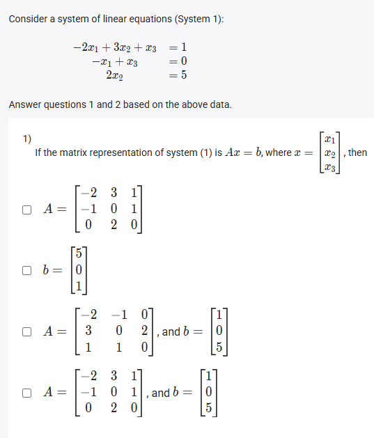
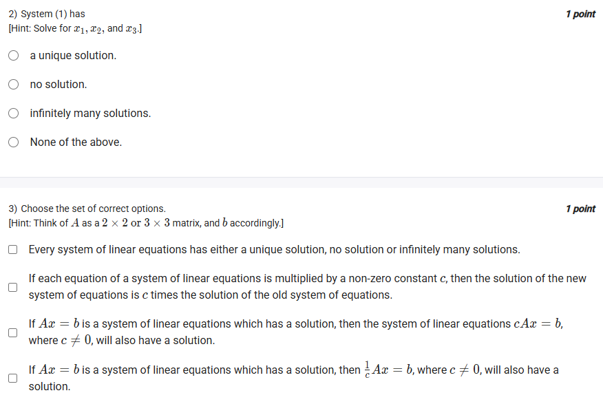
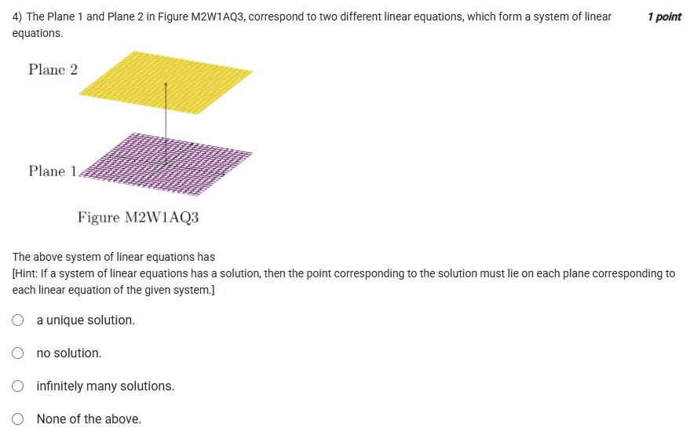
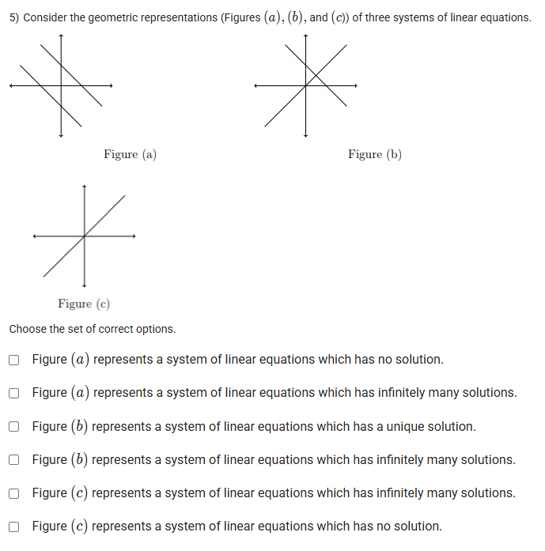
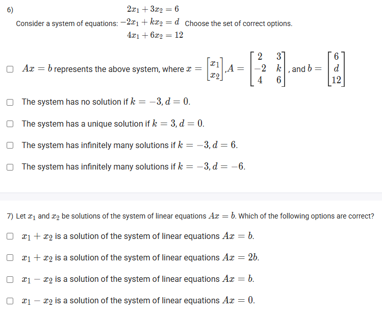
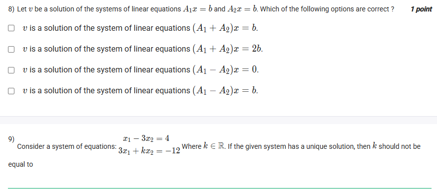
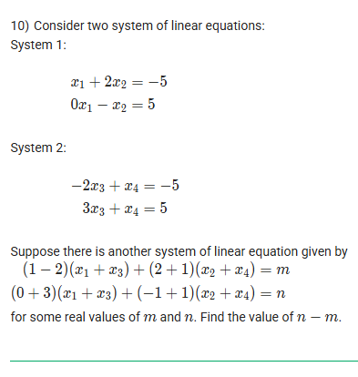



https://youtu.be/WzR4NKeLHMY

## Exercise Questions 🔥

## Exercise Solutions 🧯

Of course! Here are the detailed solutions and explanations for the questions about systems of linear equations.



### Question 1 & 2: Solving a System of Linear Equations

**Problem**
Consider a system of linear equations (System 1):
$-2x_1 + 3x_2 + x_3 = 1$
$-x_1 + x_3 = 0$
$2x_2 = 5$

**1) If the matrix representation of system (1) is $Ax = b$, where $x = \begin{bmatrix} x_1 \\ x_2 \\ x_3 \end{bmatrix}$, then identify A and b.**
**2) System (1) has:**
* a unique solution.
* no solution.
* infinitely many solutions.
* None of the above.

***

#### **Answers**
**1)** The correct representation is the last option:
$A = \begin{bmatrix} -2 & 3 & 1 \\ -1 & 0 & 1 \\ 0 & 2 & 0 \end{bmatrix}$, and $b = \begin{bmatrix} 1 \\ 0 \\ 5 \end{bmatrix}$

**2)** The system has **a unique solution**.

#### **Concepts Explained 💡**
* **Matrix Representation:** A system of linear equations can be written as $Ax=b$. The **coefficient matrix A** contains the coefficients of the variables, and the **constant vector b** contains the constants on the right side. Be careful with missing terms; their coefficient is 0.
* **Solving a System:** You can solve a system by substitution or elimination. If you find a single, specific value for each variable, the system has a unique solution.

#### **Step-by-Step Solution**
1.  **Matrix Representation (Q1):**
    * The coefficients of the variables in the three equations form the rows of matrix A.
        * Row 1: `[-2, 3, 1]`
        * Row 2: `[-1, 0, 1]` (since $x_2$ is missing, its coefficient is 0)
        * Row 3: `[0, 2, 0]` (since $x_1$ and $x_3$ are missing, their coefficients are 0)
    * The constants on the right side form the vector b: `[1, 0, 5]ᵀ`.
    * This matches the last option provided.

2.  **Solving the System (Q2):**
    * From the 3rd equation: $2x_2 = 5 \implies x_2 = \frac{5}{2}$.
    * From the 2nd equation: $-x_1 + x_3 = 0 \implies x_1 = x_3$.
    * Substitute these results into the 1st equation:
        $-2x_1 + 3(\frac{5}{2}) + x_3 = 1$
    * Now substitute $x_1$ for $x_3$:
        $-2x_1 + \frac{15}{2} + x_1 = 1$
        $-x_1 = 1 - \frac{15}{2} = \frac{2}{2} - \frac{15}{2} = -\frac{13}{2}$
        $x_1 = \frac{13}{2}$
    * Since $x_3 = x_1$, we have $x_3 = \frac{13}{2}$.
    * We found a single value for each variable: $(x_1, x_2, x_3) = (\frac{13}{2}, \frac{5}{2}, \frac{13}{2})$. This is a **unique solution**.




### Question 3: Properties of Linear Systems

**Problem**
Choose the set of correct options.

**Options**
* Every system of linear equations has either a unique solution, no solution or infinitely many solutions.
* If each equation of a system of linear equations is multiplied by a non-zero constant $c$, then the solution of the new system of equations is $c$ times the solution of the old system of equations.
* If $Ax = b$ is a system of linear equations which has a solution, then the system of linear equations $cAx = b$, where $c \neq 0$, will also have a solution.
* If $Ax = b$ is a system of linear equations which has a solution, then the system $\frac{1}{c}Ax = b$, where $c \neq 0$, will also have a solution.

***

#### **Correct Options**
* Every system of linear equations has either a unique solution, no solution or infinitely many solutions.
* If $Ax = b$ is a system of linear equations which has a solution, then the system of linear equations $cAx = b$, where $c \neq 0$, will also have a solution.
* If $Ax = b$ is a system of linear equations which has a solution, then the system $\frac{1}{c}Ax = b$, where $c \neq 0$, will also have a solution.

#### **Concepts Explained 💡**
* **Solution Types:** A key theorem in linear algebra states that any system of linear equations will have exactly one of three outcomes: one unique solution, no solution at all, or infinitely many solutions.
* **Column Space:** A system $Ax=b$ has a solution if and only if the vector $b$ is in the column space of $A$ (i.e., $b$ can be written as a linear combination of the columns of $A$). A column space is a vector space, which means it is closed under scalar multiplication.

#### **Analysis of Options**
* **Statement 1:** True. This is a fundamental property of linear systems.
* **Statement 2:** False. If $x_0$ is a solution to $Ax=b$, then $A x_0 = b$. If we multiply each equation by $c$, the new system is $(cA)x = cb$. Substituting $x_0$ gives $(cA)x_0 = c(Ax_0) = cb$. So, $x_0$ is also the solution to the new system, not $cx_0$. The solution set remains unchanged.
* **Statement 3:** True. The new system can be written as $Ax = \frac{1}{c}b$. Since the original system $Ax=b$ has a solution, the vector $b$ must be in the column space of $A$. Because a column space is a vector space, it is closed under scalar multiplication, meaning any scalar multiple of $b$ (like $\frac{1}{c}b$) is also in the column space of $A$. Therefore, the new system must also have a solution.
* **Statement 4:** True. This follows the same logic as statement 3. The new system can be written as $Ax = cb$. Since $b$ is in the column space of $A$, $cb$ must also be in the column space of $A$. Therefore, a solution must exist.




### Question 4: Geometric Interpretation (Planes)

**Problem**
The Plane 1 and Plane 2 in Figure M2W1AQ3, correspond to two different linear equations, which form a system of linear equations. The above system of linear equations has...
(The figure shows two distinct, parallel planes).

***

#### **Correct Option**
* no solution.

#### **Concepts Explained 💡**
* **Geometric Interpretation:** A linear equation with three variables (e.g., $ax + by + cz = d$) represents a plane in 3D space.
* **Solution of a System:** A solution to a system of equations is a point $(x, y, z)$ that satisfies all equations simultaneously. Geometrically, this means the point must lie on all the planes represented by the equations.
* **Parallel Planes:** If two planes are parallel and distinct, they never intersect.

#### **Explanation**
The figure shows two parallel planes that do not touch. Since there is no point of intersection, there is no point $(x, y, z)$ that lies on both planes. Therefore, the corresponding system of linear equations has **no solution**.




### Question 5: Geometric Interpretation (Lines)

**Problem**
Consider the geometric representations (Figures (a), (b), and (c)) of three systems of linear equations. Choose the set of correct options.

***

#### **Correct Options**
* Figure (a) represents a system of linear equations which has no solution.
* Figure (b) represents a system of linear equations which has a unique solution.
* Figure (c) represents a system of linear equations which has infinitely many solutions.

#### **Concepts Explained 💡**
* **Geometric Interpretation:** A linear equation with two variables (e.g., $ax + by = c$) represents a line in 2D space.
* **Solution Types (Lines):**
    * **No Solution:** The lines are parallel and distinct; they never intersect.
    * **Unique Solution:** The lines intersect at exactly one point.
    * **Infinitely Many Solutions:** The lines are coincident (they are the same line), so every point on the line is an intersection point.

#### **Analysis of Figures**
* **Figure (a):** Shows two distinct parallel lines. They will never intersect, so there is **no solution**.
* **Figure (b):** Shows three distinct lines all intersecting at a single, common point. This represents a **unique solution**.
* **Figure (c):** Shows multiple lines that are all lying on top of each other (coincident). They share all their points, so there are **infinitely many solutions**.




### Question 6: Analyzing a System with Parameters

**Problem**
Consider a system of equations:
$2x_1 + 3x_2 = 6$
$-2x_1 + kx_2 = d$
$4x_1 + 6x_2 = 12$
Choose the set of correct options.

***

#### **Correct Options**
* $Ax = b$ represents the above system, where $x = \begin{bmatrix} x_1 \\ x_2 \end{bmatrix}, A = \begin{bmatrix} 2 & 3 \\ -2 & k \\ 4 & 6 \end{bmatrix}$, and $b = \begin{bmatrix} 6 \\ d \\ 12 \end{bmatrix}$.
* The system has no solution if $k = -3, d = 0$.
* The system has a unique solution if $k = 3, d = 0$.
* The system has infinitely many solutions if $k = -3, d = -6$.

#### **Concepts Explained 💡**
For a system of linear equations, the relationship between equations determines the nature of the solution.
* **Redundant Equation:** If one equation is a multiple of another, it provides no new information and can be ignored.
* **Conditions for Solutions (2x2 system):**
    * **Unique Solution:** The lines have different slopes. For $a_1x+b_1y=c_1$ and $a_2x+b_2y=c_2$, this means $\frac{a_1}{a_2} \neq \frac{b_1}{b_2}$.
    * **No Solution / Infinite Solutions:** The lines have the same slope ($\frac{a_1}{a_2} = \frac{b_1}{b_2}$). It's **no solution** if the intercepts are different ($\frac{a_1}{a_2} = \frac{b_1}{b_2} \neq \frac{c_1}{c_2}$) and **infinite solutions** if the intercepts are the same ($\frac{a_1}{a_2} = \frac{b_1}{b_2} = \frac{c_1}{c_2}$).

#### **Step-by-Step Solution**
1.  **Simplify the System:** Notice that the third equation ($4x_1 + 6x_2 = 12$) is exactly 2 times the first equation ($2x_1 + 3x_2 = 6$). This means the third equation is redundant, and we only need to analyze the first two:
    * `Eq 1: 2x₁ + 3x₂ = 6`
    * `Eq 2: -2x₁ + kx₂ = d`
2.  **Solve by Elimination:** Add the two equations to eliminate $x_1$:
    * $(2 - 2)x_1 + (3 + k)x_2 = 6 + d$
    * $(3 + k)x_2 = 6 + d$
3.  **Analyze the Result:**
    * **Unique Solution:** If the coefficient of $x_2$ is non-zero (i.e., $3+k \neq 0$ or $k \neq -3$), we can solve for a unique value of $x_2$. The option `k=3, d=0` satisfies $k \neq -3$, so it has a unique solution.
    * **No or Infinite Solutions:** If the coefficient of $x_2$ is zero (i.e., $3+k = 0$ or $k = -3$), the equation becomes $0 = 6+d$.
        * **No Solution:** If $6+d \neq 0$ (i.e., $d \neq -6$), the equation is $0 = (\text{non-zero})$, which is a contradiction. The option `k=-3, d=0` satisfies this, leading to no solution.
        * **Infinitely Many Solutions:** If $6+d = 0$ (i.e., $d = -6$), the equation is $0 = 0$, which is always true. This means the two original equations were dependent, leading to infinitely many solutions. The option `k=-3, d=-6` satisfies this.




### Question 7 & 8: Properties of Solutions

#### **Question 7**
Let $x_1$ and $x_2$ be solutions of the system of linear equations $Ax = b$. Which of the following options are correct?

#### **Question 8**
Let $v$ be a solution of the systems of linear equations $A_1x = b$ and $A_2x = b$. Which of the following options are correct?

***

#### **Correct Options**
* **For Q7:**
    * $x_1 + x_2$ is a solution of the system of linear equations $Ax = 2b$.
    * $x_1 - x_2$ is a solution of the system of linear equations $Ax = 0$.
* **For Q8:**
    * $v$ is a solution of the system of linear equations $(A_1 + A_2)x = 2b$.
    * $v$ is a solution of the system of linear equations $(A_1 - A_2)x = 0$.

#### **Concepts Explained 💡**
These questions test the **linearity properties** of matrix-vector multiplication. For any matrices A, B and vectors x, y:
* $A(x+y) = Ax + Ay$ (Distributive property)
* $(A+B)x = Ax + Bx$ (Distributive property)

#### **Step-by-Step Derivations**

**For Question 7:**
* We are given `Ax₁ = b` and `Ax₂ = b`.
* **Test Sum:** $A(x_1 + x_2) = Ax_1 + Ax_2 = b + b = 2b$. Thus, $x_1 + x_2$ is a solution to $Ax=2b$.
* **Test Difference:** $A(x_1 - x_2) = Ax_1 - Ax_2 = b - b = 0$. Thus, $x_1 - x_2$ is a solution to $Ax=0$.

**For Question 8:**
* We are given `A₁v = b` and `A₂v = b`.
* **Test Sum:** $(A_1 + A_2)v = A_1v + A_2v = b + b = 2b$. Thus, $v$ is a solution to $(A_1+A_2)x=2b$.
* **Test Difference:** $(A_1 - A_2)v = A_1v - A_2v = b - b = 0$. Thus, $v$ is a solution to $(A_1-A_2)x=0$.




### Question 9: Condition for a Unique Solution

**Problem**
Consider a system of equations:
$x_1 - 3x_2 = 4$
$3x_1 + kx_2 = -12$
Where $k \in \mathbb{R}$. If the given system has a unique solution, then $k$ should not be equal to

***

#### **Answer: -9**

#### **Concepts Explained 💡**
A $2 \times 2$ system of linear equations has a **unique solution** if and only if the determinant of its coefficient matrix is non-zero. If the determinant is zero, the system has either no solution or infinitely many solutions.

#### **Step-by-Step Solution**
1.  **Write the coefficient matrix A:**
    $A = \begin{bmatrix} 1 & -3 \\ 3 & k \end{bmatrix}$
2.  **Calculate the determinant of A:**
    $det(A) = (1)(k) - (-3)(3) = k + 9$
3.  **Set the condition for a unique solution:**
    For a unique solution, we must have $det(A) \neq 0$.
    $k + 9 \neq 0 \implies k \neq -9$
4.  **Interpret the question:**
    The question asks for the value that $k$ should *not* be equal to if the system is to have a unique solution. Based on our condition, the value that prevents a unique solution is `-9`.




### Question 10: Solving Coupled Systems

**Problem**
Consider two system of linear equations:
**System 1:**
$x_1 + 2x_2 = -5$
$0x_1 - x_2 = 5$
**System 2:**
$-2x_3 + x_4 = -5$
$3x_3 + x_4 = 5$
Suppose there is another system of linear equation given by
$(1-2)(x_1+x_3) + (2+1)(x_2+x_4) = m$
$(0+3)(x_1+x_3) + (-1+1)(x_2+x_4) = n$
for some real values of $m$ and $n$. Find the value of $n - m$.

***

#### **Answer: 46**

#### **Concepts Explained 💡**
This problem requires solving two independent systems of linear equations and then substituting their solutions into a third system to find the unknown parameters.

#### **Step-by-Step Solution**
1.  **Solve System 1:**
    * From the second equation: $-x_2 = 5 \implies x_2 = -5$.
    * Substitute into the first equation: $x_1 + 2(-5) = -5 \implies x_1 - 10 = -5 \implies x_1 = 5$.
    * Solution 1 is `(x₁, x₂) = (5, -5)`.

2.  **Solve System 2:**
    * We have:
        * $-2x_3 + x_4 = -5$
        * $3x_3 + x_4 = 5$
    * Subtract the first equation from the second to eliminate $x_4$:
        * $(3x_3 - (-2x_3)) + (x_4 - x_4) = 5 - (-5)$
        * $5x_3 = 10 \implies x_3 = 2$.
    * Substitute $x_3=2$ into the second equation: $3(2) + x_4 = 5 \implies 6 + x_4 = 5 \implies x_4 = -1$.
    * Solution 2 is `(x₃, x₄) = (2, -1)`.

3.  **Set up the Third System:**
    * Let $y_1 = x_1 + x_3$ and $y_2 = x_2 + x_4$.
    * Calculate $y_1$ and $y_2$:
        * $y_1 = 5 + 2 = 7$
        * $y_2 = -5 + (-1) = -6$
    * Now substitute these into the third system after simplifying its coefficients:
        * $(-1)y_1 + (3)y_2 = m \implies -y_1 + 3y_2 = m$
        * $(3)y_1 + (0)y_2 = n \implies 3y_1 = n$

4.  **Solve for m and n:**
    * From the second new equation: $n = 3y_1 = 3(7) = 21$.
    * From the first new equation: $m = -y_1 + 3y_2 = -(7) + 3(-6) = -7 - 18 = -25$.

5.  **Calculate n - m:**
    * $n - m = 21 - (-25) = 21 + 25 = 46$.

