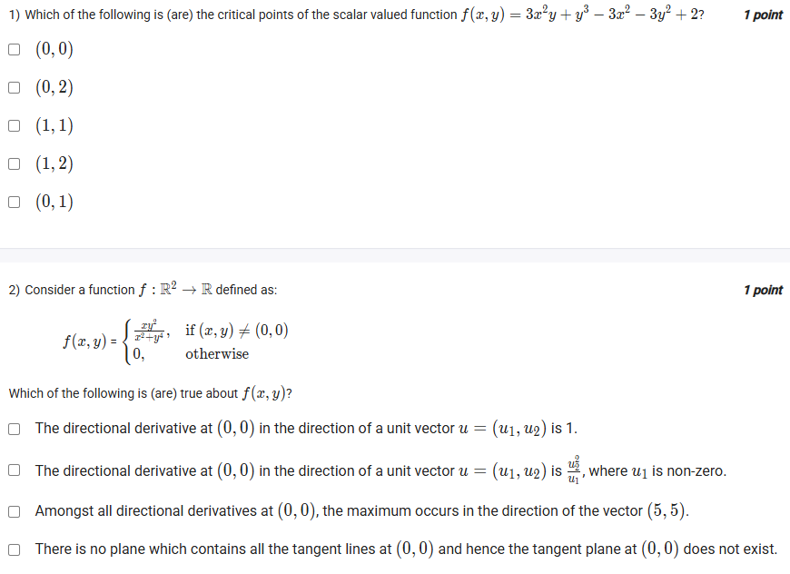
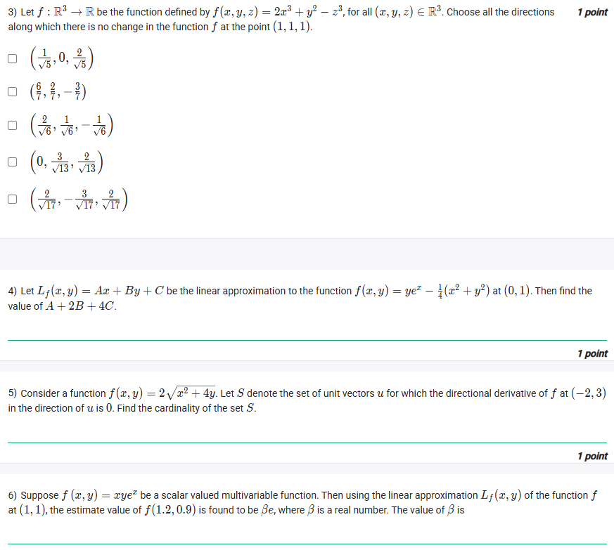
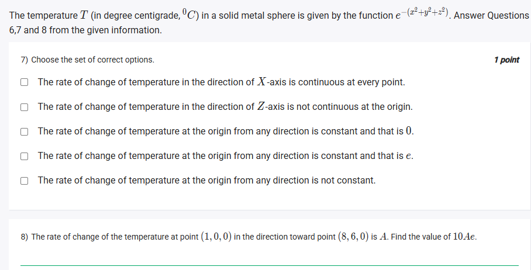
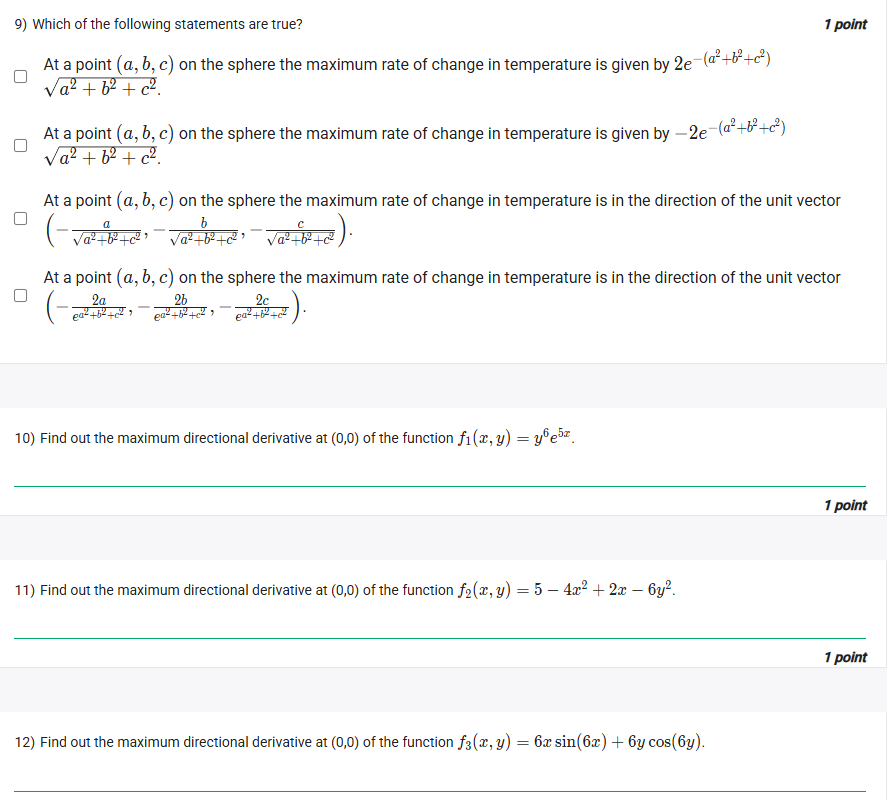
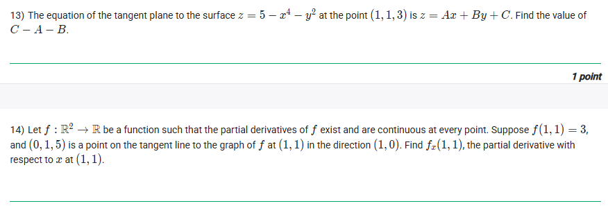

## Exercise Questions ❓

## Solutions 🃏

Here are the detailed step-by-step solutions for the questions extracted from the uploaded images.

---

### **Section 1: Bayesian Statistics (The "Fill in the Blanks" Problem)**

**Problem Overview:**
We are analyzing a customer transaction success rate $p$.
* **Likelihood:** Bernoulli($p$) with $n=40$ trials and $k=28$ successes.
* **Prior:** Beta Distribution with Mean $\mu = 0.4$ and Variance $\sigma^2 = 0.02$.
* **Goal:** Find prior parameters, posterior distribution, and posterior mean.


#### **Step 1: Determine Prior Parameters (Blanks A, B, C)**
**Concept:**
For a Beta distribution $\text{Beta}(\alpha, \beta)$:
1.  $\text{Mean } \mu = \frac{\alpha}{\alpha + \beta}$
2.  $\text{Variance } \sigma^2 = \frac{\mu(1-\mu)}{\alpha + \beta + 1}$

**Calculation:**
* Given $\mu = 0.4$ and $\sigma^2 = 0.02$.
* Using the variance formula:
    $$0.02 = \frac{0.4(1 - 0.4)}{\alpha + \beta + 1}$$
    $$0.02 = \frac{0.24}{\alpha + \beta + 1}$$
    $$\alpha + \beta + 1 = \frac{0.24}{0.02} = 12$$
    $$\alpha + \beta = 11$$
* Using the mean formula:
    $$\frac{\alpha}{11} = 0.4 \implies \alpha = 4.4$$
* Finding $\beta$:
    $$\beta = 11 - 4.4 = 6.6$$

**Matches from Option List:**
* **A ($\alpha$) = 4.4** [Option 12]
* **B ($\beta$) = 6.6** [Option 3]
* **C (Prior Distribution) = Beta(4.4, 6.6)** [Option 5]

**Answers:**
* Q11 (A): **12**
* Q12 (B): **3**
* Q13 (C): **5**



#### **Step 2: Bayesian Update (Blanks D, E, F)**
**Concept:**
$$\text{Posterior} \propto \text{Likelihood} \times \text{Prior}$$
* Likelihood (Binomial/Bernoulli): $L(p) \propto p^{\text{successes}}(1-p)^{\text{failures}}$
* Prior (Beta): $\pi(p) \propto p^{\alpha-1}(1-p)^{\beta-1}$

**Calculation:**
* **Likelihood (D):** $n=40, k=28$, failures $= 12$.
    $$L(p) = p^{28}(1-p)^{12}$$ [Matches Option 6]
* **Prior Term (E):** $\alpha=4.4, \beta=6.6$.
    $$\pi(p) = p^{4.4-1}(1-p)^{6.6-1} = p^{3.4}(1-p)^{5.6}$$ [Matches Option 13]
* **Posterior Density (F):** Multiply D and E. Add exponents.
    $$p^{28+3.4}(1-p)^{12+5.6} = p^{31.4}(1-p)^{17.6}$$ [Matches Option 1]

**Answers:**
* Q14 (D): **6**
* Q15 (E): **13**
* Q16 (F): **1**



#### **Step 3: Posterior Results (Blanks G, H)**
**Concept:**
The posterior density $p^{31.4}(1-p)^{17.6}$ corresponds to a Beta distribution with parameters $\alpha_{new} - 1 = 31.4$ and $\beta_{new} - 1 = 17.6$.

**Calculation:**
* **Posterior Distribution (G):**
    $\alpha_{post} = 32.4$, $\beta_{post} = 18.6$.
    $$\text{Beta}(32.4, 18.6)$$ [Matches Option 4]
* **Posterior Mean (H):**
    $$\text{Mean} = \frac{\alpha_{post}}{\alpha_{post} + \beta_{post}} = \frac{32.4}{32.4 + 18.6} = \frac{32.4}{51} \approx 0.635$$
    Rounding to two decimal places gives **0.64**. [Matches Option 2]

**Answers:**
* Q17 (G): **4**
* Q18 (H): **2**


---

### **Section 2: Multivariable Calculus - Critical Points & Directions**


**1) Critical Points of $f(x, y) = 3x^2y + y^3 - 3x^2 - 3y^2 + 2$**

**Concept:** Critical points occur where the gradient $\nabla f = \langle f_x, f_y \rangle$ is $\langle 0, 0 \rangle$.

**Solution:**
1.  **Partial Derivatives:**
    $$f_x = 6xy - 6x = 6x(y - 1)$$
    $$f_y = 3x^2 + 3y^2 - 6y$$
2.  **Solve $f_x = 0$:**
    $6x(y-1) = 0 \implies x = 0 \text{ or } y = 1$.
3.  **Case 1: $x = 0$**
    Substitute into $f_y = 0$: $3(0)^2 + 3y^2 - 6y = 0 \implies 3y(y-2) = 0$.
    Points: $(0, 0)$ and $(0, 2)$.
4.  **Case 2: $y = 1$**
    Substitute into $f_y = 0$: $3x^2 + 3(1)^2 - 6(1) = 0 \implies 3x^2 - 3 = 0 \implies x = \pm 1$.
    Points: $(1, 1)$ and $(-1, 1)$.

**Answer:** The set of critical points includes **$(0, 0), (0, 2), (1, 1)$**.



**2) Directional Derivative of $f(x, y) = \frac{xy^2}{x^2+y^4}$ at $(0,0)$**

**Concept:** Using the limit definition of the directional derivative for a unit vector $u = (u_1, u_2)$.
$$D_u f(0,0) = \lim_{t \to 0} \frac{f(tu_1, tu_2) - f(0,0)}{t}$$

**Solution:**
1.  Substitute points:
    $$\frac{f(tu_1, tu_2)}{t} = \frac{1}{t} \left( \frac{(tu_1)(tu_2)^2}{(tu_1)^2 + (tu_2)^4} \right) = \frac{t^3 u_1 u_2^2}{t(t^2 u_1^2 + t^4 u_2^4)}$$
    $$= \frac{t^3 u_1 u_2^2}{t^3(u_1^2 + t^2 u_2^4)} = \frac{u_1 u_2^2}{u_1^2 + t^2 u_2^4}$$
2.  Take limit as $t \to 0$:
    $$\lim_{t \to 0} \frac{u_1 u_2^2}{u_1^2 + t^2 u_2^4} = \frac{u_1 u_2^2}{u_1^2} = \frac{u_2^2}{u_1}$$
    *Note: This is valid only if $u_1 \neq 0$.*

**Answer:** **The directional derivative... is $\frac{u_2^2}{u_1}$, where $u_1$ is non-zero.** (Option 2)



**3) Directions of no change for $f(x, y, z) = 2x^3 + y^2 - z^3$ at $(1, 1, 1)$**

**Concept:** "No change" means the directional derivative is 0. This happens when the direction vector is orthogonal (perpendicular) to the gradient vector.

**Solution:**
1.  **Gradient $\nabla f$:**
    $\langle 6x^2, 2y, -3z^2 \rangle$.
2.  **At $(1, 1, 1)$:**
    $\nabla f = \langle 6, 2, -3 \rangle$.
3.  **Check orthogonality ($\nabla f \cdot \mathbf{v} = 0$) for options:**
    * $\langle 1/\sqrt{5}, 0, 2/\sqrt{5} \rangle \cdot \langle 6, 2, -3 \rangle = \frac{6 - 6}{\sqrt{5}} = 0$. (Yes)
    * $\langle 0, 3/\sqrt{13}, 2/\sqrt{13} \rangle \cdot \langle 6, 2, -3 \rangle = \frac{6 - 6}{\sqrt{13}} = 0$. (Yes)
    * $\langle 2/\sqrt{17}, -3/\sqrt{17}, 2/\sqrt{17} \rangle \cdot \langle 6, 2, -3 \rangle = \frac{12 - 6 - 6}{\sqrt{17}} = 0$. (Yes)

**Answer:** The vectors **$(1/\sqrt{5}, 0, 2/\sqrt{5})$**, **$(0, 3/\sqrt{13}, 2/\sqrt{13})$**, and **$(2/\sqrt{17}, -3/\sqrt{17}, 2/\sqrt{17})$** are correct.


---

### **Section 3: Linear Approximation & Gradients**


**4) Linear Approximation of $f(x, y) = y e^x - \frac{1}{4}(x^2+y^2)$ at $(0, 1)$**

**Concept:** $L(x, y) = f(a, b) + f_x(a,b)(x-a) + f_y(a,b)(y-b)$.

**Solution:**
1.  $f(0, 1) = 1 \cdot e^0 - \frac{1}{4}(0+1) = 1 - 0.25 = 0.75$.
2.  $f_x = y e^x - \frac{x}{2} \implies f_x(0,1) = 1(1) - 0 = 1$. ($A=1$)
3.  $f_y = e^x - \frac{y}{2} \implies f_y(0,1) = 1 - 0.5 = 0.5$. ($B=0.5$)
4.  Form: $L = 0.75 + 1(x) + 0.5(y-1) = x + 0.5y + 0.25$.
    So $C = 0.25$.
5.  **Calculate $A + 2B + 4C$:**
    $$1 + 2(0.5) + 4(0.25) = 1 + 1 + 1 = 3$$

**Answer:** **3**



**5) Cardinality of set S for $f(x, y) = 2\sqrt{x^2+4y}$**

**Concept:** We need unit vectors $\mathbf{u}$ such that $D_u f(-2, 3) = 0$. This implies $\mathbf{u} \perp \nabla f$. In 2D, there are always exactly 2 unit vectors perpendicular to any non-zero gradient.

**Solution:**
1.  $\nabla f = \langle \frac{2x}{\sqrt{x^2+4y}}, \frac{4}{\sqrt{x^2+4y}} \rangle$.
2.  At $(-2, 3)$: Denom = $\sqrt{4+12} = 4$.
    $\nabla f = \langle -4/4, 4/4 \rangle = \langle -1, 1 \rangle$.
3.  Perpendicular vectors to $\langle -1, 1 \rangle$ are parallel to $\langle 1, 1 \rangle$.
4.  Unit vectors: $\pm (\frac{1}{\sqrt{2}}, \frac{1}{\sqrt{2}})$. Total count is 2.

**Answer:** **2**



**6) Estimate $f(1.2, 0.9)$ using Linear Approximation for $f = xy e^x$**

**Solution:**
1.  Point $(1, 1)$. $f(1, 1) = e$.
2.  $f_x = y(e^x + xe^x)$. At $(1, 1) \to 1(e+e) = 2e$.
3.  $f_y = x e^x$. At $(1, 1) \to e$.
4.  $L(x, y) = e + 2e(x-1) + e(y-1)$.
5.  Input $x=1.2, y=0.9$:
    $$L(1.2, 0.9) = e + 2e(0.2) + e(-0.1) = e + 0.4e - 0.1e = 1.3e$$
6.  Result is $\beta e$, so $\beta = 1.3$.

**Answer:** **1.3**


---

### **Section 4: Max Rate of Change & Tangents**


**Questions 9, 10, 11, 12: Max Directional Derivative**

**Concept:** The maximum directional derivative at a point occurs in the direction of the gradient $\nabla f$. Its value is the magnitude $|\nabla f|$.

**Solutions:**
* **Q9:** For $T = e^{-(x^2+y^2+z^2)}$, $\nabla T = -2 \langle x, y, z \rangle e^{-(x^2+y^2+z^2)}$.
    * Max rate is magnitude: $2 \sqrt{x^2+y^2+z^2} e^{-(x^2+y^2+z^2)}$. (Matches first statement option).
    * Direction is $\nabla T$, which points opposite to the position vector. Normalized: $-\frac{\langle x, y, z \rangle}{\sqrt{x^2+y^2+z^2}}$. (Matches third statement option).
    * **Answer:** Options 1 and 3 are true.

* **Q10:** $f_1 = y^6 e^{5x}$. $\nabla f$ at $(0,0)$.
    * $f_x = 5y^6 e^{5x} \to 0$. $f_y = 6y^5 e^{5x} \to 0$.
    * **Answer:** **0**

* **Q11:** $f_2 = 5 - 4x^2 + 2x - 6y^2$.
    * $f_x = -8x + 2 \to 2$. $f_y = -12y \to 0$.
    * Magnitude $|\langle 2, 0 \rangle| = 2$.
    * **Answer:** **2**

* **Q12:** $f_3 = 6x \sin(6x) + 6y \cos(6y)$.
    * $f_x \to 0$ (since $\sin(0)=0$ and $x=0$).
    * $f_y = 6\cos(6y) - 36y\sin(6y) \to 6(1) - 0 = 6$.
    * Magnitude $|\langle 0, 6 \rangle| = 6$.
    * **Answer:** **6**



**13) Tangent Plane to $z = 5 - x^4 - y^2$ at $(1, 1, 3)$**

**Solution:**
1.  Let $F(x, y, z) = x^4 + y^2 + z - 5 = 0$.
2.  Normal vector $\mathbf{n} = \langle 4x^3, 2y, 1 \rangle$.
3.  At $(1, 1, 3)$: $\mathbf{n} = \langle 4, 2, 1 \rangle$.
4.  Plane eq: $4(x-1) + 2(y-1) + 1(z-3) = 0$.
    $4x + 2y + z - 4 - 2 - 3 = 0 \implies 4x + 2y + z = 9$.
    $z = -4x - 2y + 9$.
5.  $A = -4, B = -2, C = 9$.
6.  $C - A - B = 9 - (-4) - (-2) = 9 + 4 + 2 = 15$.

**Answer:** **15**



**8) Rate of change of $T$ at $(1, 0, 0)$ toward $(8, 6, 0)$**

**Solution:**
1.  Gradient $\nabla T$ at $(1, 0, 0)$ is $\langle -2/e, 0, 0 \rangle$.
2.  Vector $\mathbf{v}$ from $(1,0,0)$ to $(8,6,0)$ is $\langle 7, 6, 0 \rangle$.
3.  Unit vector $\mathbf{u} = \frac{\langle 7, 6, 0 \rangle}{\sqrt{7^2+6^2}} = \frac{\langle 7, 6, 0 \rangle}{\sqrt{85}}$.
4.  $A = \nabla T \cdot \mathbf{u} = \frac{-2}{e} \cdot \frac{7}{\sqrt{85}} = \frac{-14}{e\sqrt{85}}$.
5.  Value asked: $10Ae = 10 \left( \frac{-14}{e\sqrt{85}} \right) e = \frac{-140}{\sqrt{85}}$.

**Answer:** **$\frac{-140}{\sqrt{85}}$** (approx -15.18)



**14) Find $f_x(1, 1)$ given tangent line info**

**Concept:** The slope of the tangent line in the direction of the x-axis (direction $\langle 1, 0 \rangle$) is the partial derivative with respect to x, $f_x$.

**Solution:**
1.  Tangent line passes through contact point $(1, 1, f(1,1)) = (1, 1, 3)$.
2.  It also passes through $(0, 1, 5)$.
3.  The change in $y$ is 0, so this line represents the slope in the x-direction.
4.  Slope $m = \frac{\Delta z}{\Delta x} = \frac{5 - 3}{0 - 1} = \frac{2}{-1} = -2$.
5.  Therefore, $f_x(1, 1) = -2$.

**Answer:** **-2**
