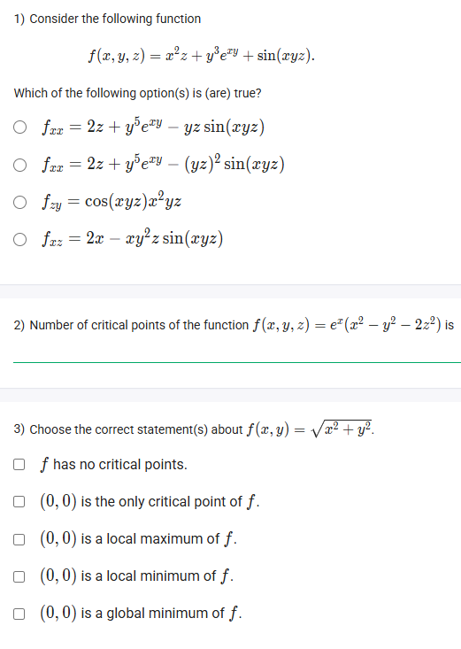
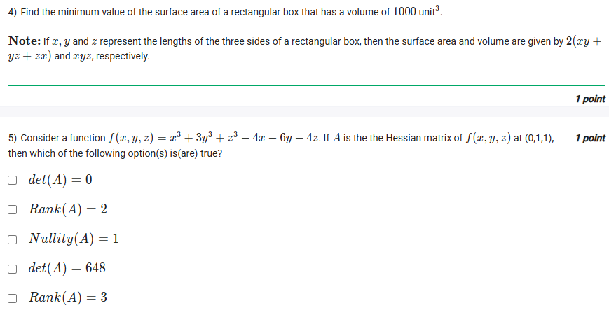
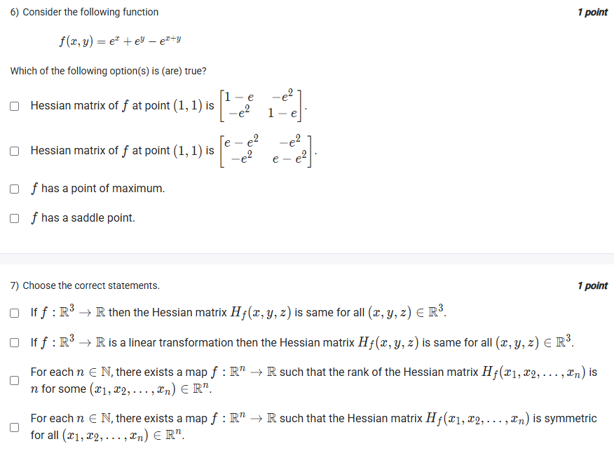
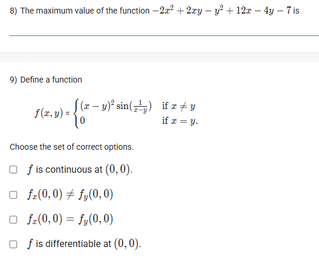
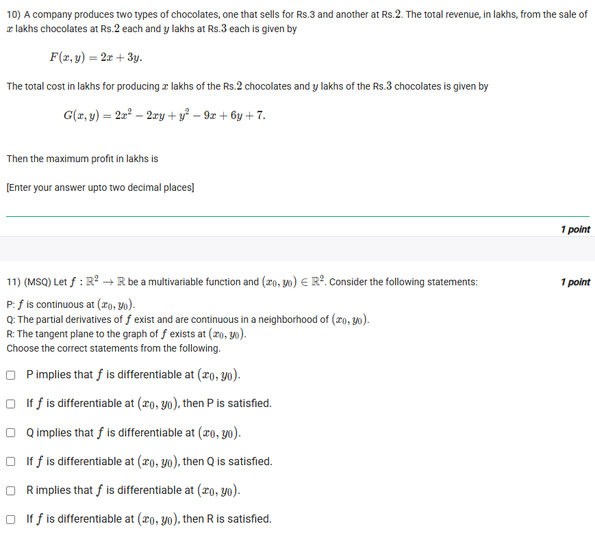
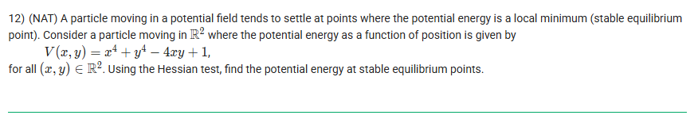

## Exercise Questions ❓

## SOlutions 🟩

Here are the detailed solutions for the Calculus and Statistics questions provided in the images, organized by topic.

### **Topic 1: Multivariable Calculus (Differentiation & Optimization)**


### **Question 1**
**Problem:** Find the correct second partial derivative $f_{xx}$ for $f(x, y, z) = x^2z + y^3e^{xy} + \sin(xyz)$.

**Concept: Partial Differentiation**
To find $f_{xx}$, we first differentiate $f$ with respect to $x$ (treating $y, z$ as constants), and then differentiate the result by $x$ again.

**Step 1: First Derivative ($f_x$)**
* $\frac{\partial}{\partial x}(x^2z) = 2xz$
* $\frac{\partial}{\partial x}(y^3e^{xy}) = y^3 \cdot \frac{\partial}{\partial x}(e^{xy}) = y^3 \cdot (ye^{xy}) = y^4e^{xy}$
* $\frac{\partial}{\partial x}(\sin(xyz)) = \cos(xyz) \cdot \frac{\partial}{\partial x}(xyz) = yz\cos(xyz)$

$$f_x = 2xz + y^4e^{xy} + yz\cos(xyz)$$

**Step 2: Second Derivative ($f_{xx}$)**
* $\frac{\partial}{\partial x}(2xz) = 2z$
* $\frac{\partial}{\partial x}(y^4e^{xy}) = y^4 \cdot (ye^{xy}) = y^5e^{xy}$
* $\frac{\partial}{\partial x}(yz\cos(xyz)) = yz \cdot (-\sin(xyz) \cdot yz) = -y^2z^2\sin(xyz)$

$$f_{xx} = 2z + y^5e^{xy} - (yz)^2\sin(xyz)$$

**Answer Option:**
**$f_{xx} = 2z + y^5e^{xy} - (yz)^2 \sin(xyz)$** (Second Option)



### **Question 2**
**Problem:** Number of critical points of $f(x, y, z) = e^x(x^2 - y^2 - 2z^2)$.

**Concept: Critical Points**
Critical points occur where the gradient is zero ($\nabla f = \vec{0}$). We set partial derivatives $f_x, f_y, f_z$ to 0.

**Step 1: Partial Derivatives**
* $f_y = e^x(-2y)$. Setting $f_y = 0 \implies y=0$.
* $f_z = e^x(-4z)$. Setting $f_z = 0 \implies z=0$.
* $f_x = \frac{\partial}{\partial x}(e^x) \cdot (x^2 - y^2 - 2z^2) + e^x \cdot \frac{\partial}{\partial x}(x^2 - y^2 - 2z^2)$
    $f_x = e^x(x^2 - y^2 - 2z^2) + e^x(2x) = e^x(x^2 + 2x - y^2 - 2z^2)$.

**Step 2: Solve System**
Substitute $y=0, z=0$ into $f_x=0$:
$$e^x(x^2 + 2x - 0 - 0) = 0$$
Since $e^x \neq 0$, we solve $x^2 + 2x = 0$:
$$x(x+2) = 0 \implies x = 0, x = -2$$

**Step 3: Count Points**
The critical points are $(0, 0, 0)$ and $(-2, 0, 0)$.

**Answer:** **2**



### **Question 3**
**Problem:** Analyze $f(x, y) = \sqrt{x^2 + y^2}$ at $(0,0)$.

**Concept: Geometry of the Cone**
This function represents an inverted cone with the tip at the origin.
* **Global Minimum:** Since $\sqrt{\dots} \ge 0$ and $f(0,0)=0$, the point $(0,0)$ is the absolute lowest point.
* **Differentiability:** The cone has a sharp "cusp" or point at the origin. It is continuous but **not differentiable** at $(0,0)$. (Imagine trying to place a tangent plane on the tip of a sharp pencil—it wobbles).

**Correct Statements:**
* $(0,0)$ is a local minimum of $f$.
* $(0,0)$ is a global minimum of $f$.
* $(0,0)$ is the only critical point (where derivative is undefined).

**Answer Selection:**
**$(0,0)$ is a global minimum of $f$.**



### **Question 4**
**Problem:** Find the minimum surface area of a rectangular box with Volume = 1000.

**Concept: Optimization**
For a rectangular box with fixed volume, the surface area is minimized when the box is a **cube**.
Let sides be $x, y, z$.
Volume $V = xyz = 1000$.
Surface Area $S = 2(xy + yz + zx)$.

**Calculation:**
For a cube, $x = y = z$.
$$x^3 = 1000 \implies x = 10$$
$$S = 2(10\cdot10 + 10\cdot10 + 10\cdot10) = 2(100 + 100 + 100) = 2(300) = 600$$

**Answer:** **600**



### **Question 5**
**Problem:** Hessian Matrix properties for $f(x,y,z) = x^3 + 3y^3 + z^3 - 4x - 6y - 4z$ at $(0,1,1)$.

**Concept: Hessian Matrix**
The Hessian is the matrix of second-order partial derivatives.
$$H = \begin{bmatrix} f_{xx} & f_{xy} & f_{xz} \\ f_{yx} & f_{yy} & f_{yz} \\ f_{zx} & f_{zy} & f_{zz} \end{bmatrix}$$

**Step 1: First Derivatives**
$f_x = 3x^2 - 4$
$f_y = 9y^2 - 6$
$f_z = 3z^2 - 4$

**Step 2: Second Derivatives**
$f_{xx} = 6x$, $f_{yy} = 18y$, $f_{zz} = 6z$.
All mixed terms ($f_{xy}$, etc.) are 0.

**Step 3: Evaluate at $(0,1,1)$**
$f_{xx}(0) = 0$
$f_{yy}(1) = 18$
$f_{zz}(1) = 6$

$$A = \begin{bmatrix} 0 & 0 & 0 \\ 0 & 18 & 0 \\ 0 & 0 & 6 \end{bmatrix}$$

**Step 4: Matrix Properties**
* **Determinant:** Product of diagonal = $0 \times 18 \times 6 = 0$.
* **Rank:** Number of non-zero rows = 2.
* **Nullity:** Dimension - Rank = $3 - 2 = 1$.

**Correct Options:**
* $\det(A) = 0$
* $Rank(A) = 2$
* $Nullity(A) = 1$



### **Question 8**
**Problem:** Max value of $-2x^2 + 2xy - y^2 + 12x - 4y - 7$.

**Concept: Unconstrained Optimization**
Find critical points ($f_x=0, f_y=0$).

**Step 1: Partials**
$f_x = -4x + 2y + 12 = 0 \implies 2x - y = 6$ (Eq 1)
$f_y = 2x - 2y - 4 = 0 \implies x - y = 2$ (Eq 2)

**Step 2: Solve**
Subtract Eq 2 from Eq 1:
$(2x - y) - (x - y) = 6 - 2$
$x = 4$
Sub into Eq 2:
$4 - y = 2 \implies y = 2$

**Step 3: Evaluate**
$f(4,2) = -2(16) + 2(4)(2) - (4) + 12(4) - 4(2) - 7$
$= -32 + 16 - 4 + 48 - 8 - 7$
$= 13$

**Answer:** **13**



### **Question 10**
**Problem:** Maximize Profit.
Revenue $R = 2x + 3y$.
Cost $C = 2x^2 - 2xy + y^2 - 9x + 6y + 7$.
Profit $P = R - C$.

**Step 1: Profit Function**
$P(x,y) = (2x + 3y) - (2x^2 - 2xy + y^2 - 9x + 6y + 7)$
$P = -2x^2 + 2xy - y^2 + 11x - 3y - 7$

**Step 2: Gradients**
$P_x = -4x + 2y + 11 = 0$
$P_y = 2x - 2y - 3 = 0$

**Step 3: Solve**
Add the two equations:
$(-4x + 2y + 11) + (2x - 2y - 3) = 0$
$-2x + 8 = 0 \implies x = 4$.
Sub $x=4$ into $P_y$:
$2(4) - 2y - 3 = 0 \implies 5 = 2y \implies y = 2.5$.

**Step 4: Max Profit**
$P(4, 2.5) = -2(16) + 2(4)(2.5) - (2.5)^2 + 11(4) - 3(2.5) - 7$
$= -32 + 20 - 6.25 + 44 - 7.5 - 7$
$= 11.25$

**Answer:** **11.25**



### **Question 12**
**Problem:** Find stable equilibrium point (Potential Energy at Minimum) for $V(x,y) = x^4 + y^4 - 4xy + 1$.

**Step 1: Critical Points**
$V_x = 4x^3 - 4y = 0 \implies y = x^3$
$V_y = 4y^3 - 4x = 0 \implies x = y^3$
Sub $y$: $x = (x^3)^3 = x^9 \implies x(x^8-1) = 0$.
$x = 0, 1, -1$.
Points: $(0,0), (1,1), (-1,-1)$.

**Step 2: Hessian Test**
$V_{xx} = 12x^2, V_{yy} = 12y^2, V_{xy} = -4$.
Determinant $D = 144x^2y^2 - 16$.

* **At (0,0):** $D = -16 < 0$ (Saddle).
* **At (1,1):** $D = 144-16 > 0$ and $V_{xx}=12 > 0$ (Local Min).
* **At (-1,-1):** $D = 144-16 > 0$ and $V_{xx}=12 > 0$ (Local Min).

**Step 3: Potential Energy Value**
$V(1,1) = 1 + 1 - 4 + 1 = -1$.
$V(-1,-1) = 1 + 1 - 4 + 1 = -1$.

**Answer:** **-1.00**


---

### **Topic 2: Statistics (Hypothesis Testing)**


### **Case Study: Fitness App (Q9-Q19, Q20-Q27)**
**Context:** $\mu=100, \sigma=2, n=9$.
Acceptance Region: $98.5 \le \bar{X} \le 101.5$.
Reject if $\bar{X} < 98.5$ or $\bar{X} > 101.5$.

**Q10-Q19: Significance Level ($\alpha$)**
1.  **Q10 (Blank 1):** Sampling dist is **Normal** (Option 2).
2.  **Q11 (Blank 2):** Mean is **100** (Option 4).
3.  **Q12 (Blank 3):** Variance is $\sigma^2/n = 4/9$ (Option 6).
4.  **Q13 (Blank 4):** Reject if $\bar{X} >$ **101.5** (Option 8).
5.  **Q14 (Blank 5):** Reject if $\bar{X} <$ **98.5** (Option 7).
6.  **Q16 (Blank 7):** Critical Z = $\frac{101.5 - 100}{\sqrt{4/9}} = \frac{1.5}{2/3} = 2.25$. **2.25** (Option 13).
7.  **Q17 (Blank 8):** Lower Z = **-2.25** (Option 12).
8.  **Q19 (Blank 10):** $\alpha = 1 - P(-2.25 < Z < 2.25) \approx 1 - 0.975 = 0.025$. Answer **0.02** (Option 14).

**Q20-Q27: Power ($1-\beta$) at $\mu=103$**
1.  **Q21 (Blank 1):** Upper boundary **101.5** (Option 3).
2.  **Q22 (Blank 2):** Lower boundary **98.5** (Option 1).
3.  **Q23 (Blank 3):** Standardized Upper $Z = \frac{101.5 - 103}{2/3} = -2.25$. **-2.25** (Option 12).
4.  **Q24 (Blank 4):** Standardized Lower $Z = \frac{98.5 - 103}{2/3} = -6.75$. **-6.75** (Option 7).
5.  **Q25 (Blank 5):** $P(Z > -2.25) = P(Z < 2.25) \approx$ **0.99** (Option 10).
6.  **Q27 (Blank 7):** Power = **0.99** + 0.



### **Question 10 (Independent)**
**Problem:** Sample Size for Z-test.
$X \sim N(\mu_1, 3)$ and $Y \sim N(\mu_2, 4)$. (Note: 3 and 4 are Variances).
Rejection rule: $|\bar{X} - \bar{Y}| > 1.625$. $\alpha=0.05 \implies Z_{crit}=1.96$.

**Formula:**
Critical Value $c = Z_{\alpha/2} \sqrt{\frac{\sigma_1^2}{n_1} + \frac{\sigma_2^2}{n_2}}$
$1.625 = 1.96 \sqrt{\frac{3}{n} + \frac{4}{8}}$

**Calculation:**
Divide by 1.96: $0.829 = \sqrt{\frac{3}{n} + 0.5}$
Square both sides: $0.687 = \frac{3}{n} + 0.5$
$\frac{3}{n} = 0.187$
$n = \frac{3}{0.187} \approx 16.04$

**Answer:** **17** (Next greatest integer)



### **Question 11 (Battery Case Study)**
**Problem:** Find critical value $c$ for t-test.
$H_0: \mu = 11.5$, $H_A: \mu > 11.5$.
$n=25, s=2.5$. $\alpha=0.05$.
Degrees of freedom = 24.
Critical $t$ from table ($F_{t24}(1.711) = 0.95$) is **1.711**.

**Calculation:**
$\frac{c - 11.5}{s/\sqrt{n}} = 1.711$
$c - 11.5 = 1.711 \times \frac{2.5}{5}$
$c - 11.5 = 1.711 \times 0.5$
$c = 11.5 + 0.8555 = 12.3555$

**Answer:** **12.36**



### **Question 7 (Drug Variance)**
**Problem:** Identify Hypothesis.
Pharmacist suspects variability ($\sigma$) is **higher** than expected ($0.00002$).

**Concept:**
* Null Hypothesis ($H_0$): Status quo ($\sigma = 0.00002$).
* Alternative ($H_A$): The claim/suspicion ($\sigma > 0.00002$).

**Answer:** **$H_0: \sigma = 0.00002, H_A: \sigma > 0.00002$** (Option 1)



### **Question 8 (Drug Variance Test)**
**Problem:** Chi-Square test for Q7.
$n=8, s=0.00005, \sigma_0=0.00002$.

**Calculation:**
$\chi^2 = \frac{(n-1)s^2}{\sigma_0^2} = \frac{7 \cdot (5 \times 10^{-5})^2}{(2 \times 10^{-5})^2} = 7 \cdot (2.5)^2 = 7 \cdot 6.25 = 43.75$.
Critical Value (given hint): 18.475.
Since $43.75 > 18.475$, we Reject $H_0$ and Accept $H_A$.

**Answer:** **Accept the alternative hypothesis.**
