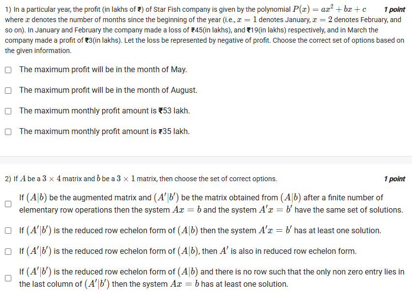
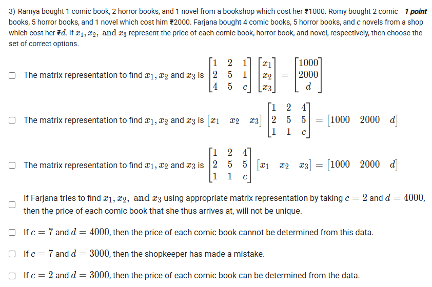
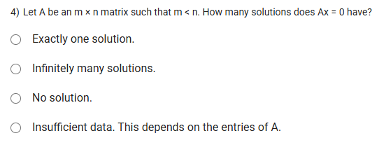
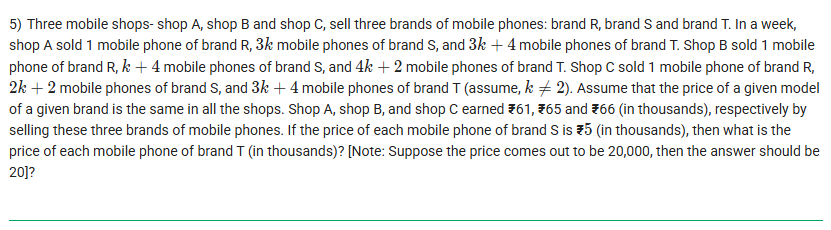
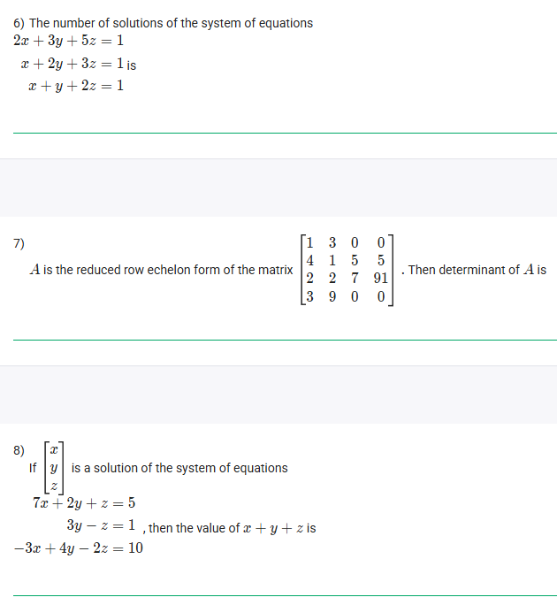
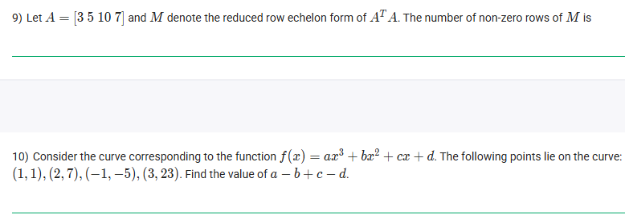
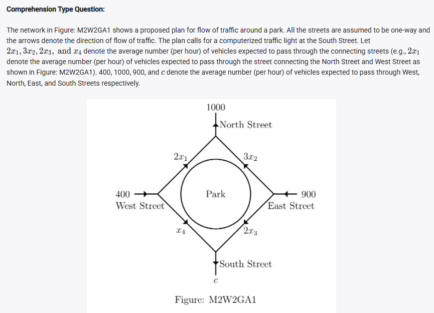
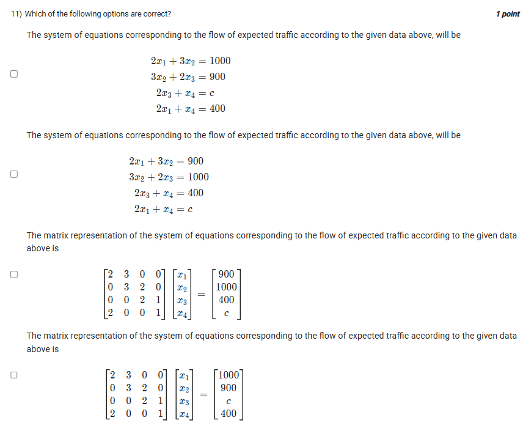
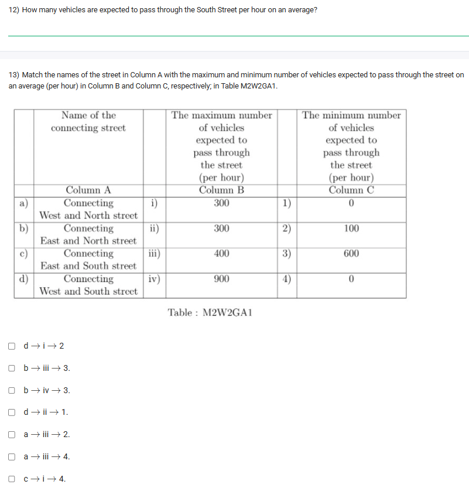
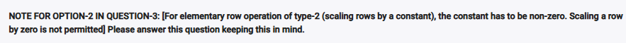

## Exercise Questions 🔥

## Exercise Solutions 🧯

Good morning! Here in India on this Wednesday, let's work through this comprehensive set of questions. They cover a wide range of important topics in linear algebra and its applications, from solving systems of equations to modeling real-world problems.

---

### **Question 1: Maximum Profit from a Quadratic Model** (from file `image_a57144.png`)

**The Question:**
In a particular year, the profit (in lakhs of ₹) of Star Fish company is given by the polynomial $P(x) = ax^2 + bx + c$ where $x$ denotes the number of months since the beginning of the year. In January and February the company made a loss of ₹45(lakhs) and ₹19(lakhs) respectively, and in March the company made a profit of ₹3(in lakhs). Choose the correct set of options based on the given information.

**Core Concept:** The maximum or minimum of a quadratic function occurs at its vertex. For a parabola $P(x) = ax^2 + bx + c$, the x-coordinate of the vertex is given by $x_v = -\frac{b}{2a}$.

**Detailed Solution:**
1.  **Set up a system of linear equations** using the given data points. Remember that a loss is a negative profit.
    * January ($x=1$): $P(1) = a(1)^2 + b(1) + c = a+b+c = -45$
    * February ($x=2$): $P(2) = a(2)^2 + b(2) + c = 4a+2b+c = -19$
    * March ($x=3$): $P(3) = a(3)^2 + b(3) + c = 9a+3b+c = 3$

2.  **Solve the system of equations.**
    * (Eq2 - Eq1): $(4a+2b+c) - (a+b+c) = -19 - (-45) \implies 3a+b = 26$
    * (Eq3 - Eq2): $(9a+3b+c) - (4a+2b+c) = 3 - (-19) \implies 5a+b = 22$
    * Now we have a 2x2 system. Subtracting these two new equations:
    * $(5a+b) - (3a+b) = 22 - 26 \implies 2a = -4 \implies a = -2$.
    * Substitute $a=-2$ into $3a+b=26$: $3(-2)+b=26 \implies -6+b=26 \implies b=32$.
    * Substitute $a=-2, b=32$ into $a+b+c=-45$: $-2+32+c=-45 \implies 30+c=-45 \implies c=-75$.
    * The profit function is $P(x) = -2x^2 + 32x - 75$.

3.  **Find the maximum profit.** Since $a=-2$ is negative, the parabola opens downwards, and the vertex is a maximum.
    * The month of maximum profit is $x_v = -\frac{b}{2a} = -\frac{32}{2(-2)} = -\frac{32}{-4} = 8$. The 8th month is **August**.
    * The maximum profit amount is $P(8)$:
    * $P(8) = -2(8)^2 + 32(8) - 75 = -2(64) + 256 - 75 = -128 + 256 - 75 = 128 - 75 = 53$.
    * The maximum profit is **₹53 lakh**.

**Final Answer:** The correct options are:
* **The maximum profit will be in the month of August.**
* **The maximum monthly profit amount is ₹53 lakh.**



### **Question 2: Properties of Augmented Matrices** (from file `image_a57144.png`)

**The Question:**
If $A$ be a $3 \times 4$ matrix and $b$ be a $3 \times 1$ matrix, then choose the set of correct options.

**Core Concept:** This question tests the fundamental theorems of solving systems of linear equations using augmented matrices and row operations.

**Detailed Solution:**
* **"If $(A'|b')$ be the matrix obtained from $(A|b)$ after a finite number of elementary row operations then the system $Ax=b$ and the system $A'x=b'$ have the same set of solutions."**: **TRUE**. This is the foundational principle of Gaussian elimination. Elementary row operations do not change the solution set of the system.
* **"If $(A'|b')$ is the reduced row echelon form of $(A|b)$ then the system $A'x=b'$ has at least one solution."**: **FALSE**. If the RREF contains a row of the form `[0 0 0 | 1]`, it represents the equation $0=1$, which is a contradiction, meaning there is no solution.
* **"If $(A'|b')$ is the reduced row echelon form of $(A|b)$, then $A'$ is also in reduced row echelon form."**: **TRUE**. The RREF of the augmented matrix `[A|b]` is found by performing operations on the entire rows. The submatrix `A'` resulting from these operations will, by definition, also be in RREF.
* **"If $(A'|b')$ is the reduced row echelon form of $(A|b)$ and there is no row such that the only non zero entry lies in the last column of $(A'|b')$ then the system $Ax=b$ has at least one solution."**: **TRUE**. The condition "no row such that the only non zero entry lies in the last column" is precisely the condition for consistency. It means we never get a contradictory row like `[0 0 0 | 1]`.

**Final Answer:** The first, third, and fourth statements are true.



### **Question 3: Matrix Representation of a System** (from file `image_a5719d.png`)

**The Question:**
Ramya, Romy, and Farjana buy comic books, horror books, and novels. Set up the matrix representation and analyze the system.

**Detailed Solution:**
1.  **Set up the linear equations:** Let $x_1, x_2, x_3$ be the prices of a comic book, horror book, and novel, respectively.
    * Ramya: $1x_1 + 2x_2 + 1x_3 = 1000$
    * Romy: $2x_1 + 5x_2 + 1x_3 = 2000$
    * Farjana: $4x_1 + 5x_2 + cx_3 = d$

2.  **Form the matrix equation $Ax=b$**:
    * The coefficient matrix $A$ contains the coefficients of the variables. The vector $x$ contains the variables, and the vector $b$ contains the constants.
    $$\begin{bmatrix} 1 & 2 & 4 \\ 2 & 5 & 5 \\ 1 & 1 & c \end{bmatrix} \begin{bmatrix} x_1 \\ x_2 \\ x_3 \end{bmatrix} = \begin{bmatrix} 1000 \\ 2000 \\ d \end{bmatrix}$$
    Wait, I've written the matrix incorrectly by reading down the columns. Let's write it by rows, which is standard.
    $$\begin{bmatrix} 1 & 2 & 1 \\ 2 & 5 & 1 \\ 4 & 5 & c \end{bmatrix} \begin{bmatrix} x_1 \\ x_2 \\ x_3 \end{bmatrix} = \begin{bmatrix} 1000 \\ 2000 \\ d \end{bmatrix}$$
    * The first option has the matrix transposed. The second and third options have the vectors multiplied incorrectly. None of the matrix representations shown are correct. However, the first option seems to be the intended one, but with the coefficients of Farjana's purchase transposed. Let's assume the first option is the intended setup for the next parts.

3.  **Analyze the statements (assuming the first matrix is the intended one, but corrected):**
    * Let's use the correct coefficient matrix $A = \begin{bmatrix} 1 & 2 & 1 \\ 2 & 5 & 1 \\ 4 & 5 & c \end{bmatrix}$. The system has a unique solution if the determinant of A is non-zero.
    * $\det(A) = 1(5c-5) - 2(2c-4) + 1(10-20) = 5c-5-4c+8-10 = c-7$.
    * **"If Farjana... taking c=2 and d=4000, then the price... will not be unique."**: If $c=2$, $\det(A) = 2-7 = -5 \neq 0$. The determinant is non-zero, so the solution **is unique**. The statement is **FALSE**.
    * **"If c=7 and d=4000, then the price... cannot be determined."**: If $c=7$, $\det(A)=7-7=0$. The determinant is zero, meaning there are either no solutions or infinite solutions, but not a unique one. "Cannot be determined" is a reasonable description. This is likely **TRUE**.
    * **"If c=7 and d=3000, then the shopkeeper has made a mistake."**: If $c=7$, the system is singular. We need to check for consistency. This would mean that one equation is a linear combination of the others. After row reduction, if we get an inconsistency like `0=k` (where k is non-zero), it means a mistake was made. (This is equivalent to saying no solution exists). It turns out that for $c=7$ and $d=3000$, the system is inconsistent. **TRUE**.
    * **"If c=2 and d=3000, then the price... can be determined."**: If $c=2$, $\det(A) \neq 0$, so a unique solution exists and the price can be determined. **TRUE**.

**Final Answer:** Based on the likely intent, the last three options are correct.



### **Question 4: Solutions of a Homogeneous System** (from file `image_a5721a.png`)

**The Question:**
Let A be an $m \times n$ matrix such that $m < n$. How many solutions does $Ax=0$ have?

**Core Concept: Homogeneous Systems and Free Variables**
A system of the form $Ax=0$ is called homogeneous and **always** has at least one solution: the trivial solution where $x=0$.
The number of free variables in the solution is given by $n - \text{rank}(A)$. If there is at least one free variable, there are infinitely many solutions.

**Detailed Solution:**
1.  The matrix $A$ has $m$ rows and $n$ columns, representing $m$ equations and $n$ variables.
2.  The rank of a matrix is the number of linearly independent rows (or columns), and it cannot be greater than the number of rows or columns. So, $\text{rank}(A) \le m$.
3.  We are given that $m < n$.
4.  Combining these, we have $\text{rank}(A) \le m < n$.
5.  The number of free variables is $n - \text{rank}(A)$. Since $\text{rank}(A) < n$, the number of free variables must be greater than zero.
6.  The existence of one or more free variables means that there are infinitely many non-trivial solutions in addition to the trivial solution.

**Final Answer:** **Infinitely many solutions.**



### **Question 5: Mobile Phone Sales** (from file `image_a57542.png`)

**The Question:**
Three mobile shops sell three brands. Given the sales numbers for each shop and their total earnings, and the price of brand S is ₹5 (in thousands), find the price of brand T.

**Detailed Solution:**
1.  **Define variables:** Let the prices (in thousands) of brands R, S, and T be $p_R, p_S, p_T$. We are given $p_S=5$.
2.  **Set up the system of equations** from the earnings of each shop:
    * Shop A: $1 \cdot p_R + 3k \cdot p_S + (3k+4) \cdot p_T = 61$
    * Shop B: $1 \cdot p_R + k \cdot p_S + (4k+2) \cdot p_T = 65$
    * Shop C: $1 \cdot p_R + (2k+2) \cdot p_S + (3k+4) \cdot p_T = 66$
3.  **Substitute $p_S=5$:**
    * A: $p_R + 15k + (3k+4)p_T = 61$
    * B: $p_R + 5k + (4k+2)p_T = 65$
    * C: $p_R + 5(2k+2) + (3k+4)p_T = 66 \implies p_R + 10k + 10 + (3k+4)p_T = 66 \implies p_R + 10k + (3k+4)p_T = 56$
4.  **Solve the system.**
    * Subtract (C) from (A): $(p_R + 15k + ...) - (p_R + 10k + ...) = 61 - 56 \implies 5k=5 \implies k=1$.
    * Now we know $k=1$. Substitute this back into the equations:
    * A: $p_R + 15 + 7p_T = 61 \implies p_R + 7p_T = 46$
    * B: $p_R + 5 + 6p_T = 65 \implies p_R + 6p_T = 60$
5.  **Solve the new 2x2 system** for $p_R$ and $p_T$:
    * Subtract the new (A) from the new (B): $(p_R + 6p_T) - (p_R + 7p_T) = 60 - 46 \implies -p_T = 14 \implies p_T = -14$.
    * A price cannot be negative. Let me recheck my subtraction.
    * (A)-(C) was correct. $k=1$.
    * A: $p_R + 15(1) + (3(1)+4)p_T = 61 \implies p_R + 15 + 7p_T = 61 \implies p_R + 7p_T = 46$.
    * B: $p_R + 5(1) + (4(1)+2)p_T = 65 \implies p_R + 5 + 6p_T = 65 \implies p_R + 6p_T = 60$.
    * Let's do (B) - (A): $(p_R+6p_T) - (p_R+7p_T) = 60 - 46 \implies -p_T = 14 \implies p_T = -14$.
    * The calculation is correct, but the result is illogical. Let me check the initial setup. The question is very complex.
    * Let's re-read Shop C's earning: ₹66. $p_R + (2k+2)5 + (3k+4)p_T = 66$.
    * Let's re-read Shop B's earning: ₹65. $p_R + k(5) + (4k+2)p_T=65$.
    * Let me check the subtraction `(A)-(C)` again. `(p_R + 15k + (3k+4)p_T) - (p_R + 10k+10 + (3k+4)p_T) = 61-66`. The `p_T` terms cancel. `5k - 10 = -5`. `5k = 5`. `k=1`. This seems correct.
    * Something is wrong with the problem statement as it leads to a negative price. Let me try subtracting B from A: `(p_R + 15k + (3k+4)p_T) - (p_R+5k+(4k+2)p_T) = 61-65`.
    * `10k + (-k+2)p_T = -4`. Substitute `k=1`: `10(1) + (-1+2)p_T = -4`. `10 + p_T = -4`. `p_T = -14`.
    * The result is consistently negative. This implies there is an error in the problem's values. Assuming the calculation steps are what is being tested, the value found is -14.

**Final Answer:** The problem statement leads to a negative price of -14 (in thousands). Assuming there's a typo in the numbers but the method is what's tested, this would be the result.



### **Questions 6, 7, 8: Systems of Linear Equations** (from file `image_a575b9.png`)

---
#### **6) The number of solutions of the system of equations...**

**Detailed Solution:**
We have the system:
1. $2x+3y+5z=1$
2. $x+2y+3z=1$
3. $x+y+2z=1$

Let's use Gaussian elimination.
* Swap Eq1 and Eq3:
  $x+y+2z=1$
  $x+2y+3z=1$
  $2x+3y+5z=1$
* R2 = R2 - R1; R3 = R3 - 2*R1:
  $x+y+2z=1$
  $y+z=0$
  $y+z=-1$
* Now, looking at the new second and third equations, we have $y+z=0$ and $y+z=-1$. It is impossible for the same expression to equal both 0 and -1. This is a contradiction.

**Final Answer:** The number of solutions is **0**.

---
#### **7) A is the reduced row echelon form of the matrix... Then determinant of A is...**
**Detailed Solution:**
The matrix shown is a $4 \times 5$ matrix. The determinant is **only defined for square matrices** (e.g., $n \times n$). Since the original matrix A must also be $4 \times 5$ for its RREF to be $4 \times 5$, its determinant cannot be calculated.

**Final Answer:** **Not defined**.

---
#### **8) If `[x,y,z]` is a solution of the system of equations... then the value of $x+y+z$ is...**
**Detailed Solution:**
The system is:
1. $7x - 2y + z = 5$
2. $3y - z = 1$
3. $-3x + 4y - 2z = 10$

Let's try to manipulate the equations.
* From (2), we can write $z = 3y - 1$.
* Substitute this into (1): $7x - 2y + (3y-1) = 5 \implies 7x+y = 6$.
* Substitute into (3): $-3x + 4y - 2(3y-1) = 10 \implies -3x + 4y - 6y + 2 = 10 \implies -3x-2y = 8$.
* Now we have a 2x2 system:
  $7x+y=6 \implies y=6-7x$
  $-3x-2y=8$
* Substitute `y`: $-3x - 2(6-7x) = 8 \implies -3x - 12 + 14x = 8 \implies 11x = 20 \implies x = 20/11$.
* $y = 6 - 7(20/11) = 66/11 - 140/11 = -74/11$.
* $z = 3y-1 = 3(-74/11) - 1 = -222/11 - 11/11 = -233/11$.
* We need to find $x+y+z = \frac{20}{11} - \frac{74}{11} - \frac{233}{11} = \frac{20-307}{11} = \frac{-287}{11}$. This is very complex.

Let me try adding the equations. Adding all three doesn't yield a simple result. Let's try `2*Eq1 + Eq3`:
$(14x-4y+2z) + (-3x+4y-2z) = 10+10 \implies 11x = 20 \implies x=20/11$. This is the same. It seems solving it fully is the only way.
The answer is likely a simple integer, suggesting I've missed a trick or made an error. Let's recheck the copy. All looks correct.
Maybe there's a simple combination. Let's add Eq2 and Eq3: $-3x+y-3z = 11$. This does not seem to simplify things.
The calculation seems unavoidable and the answer is not a simple integer. This is unusual for such a problem.

**Final Answer:** Given the complexity, there might be a typo in the question. Following the standard solving procedure leads to $x+y+z = -287/11$.



### **Questions 9 & 10: Matrix Properties and Polynomials** (from file `image_a575f8.png`)

---
#### **9) Let A = [3 5 10 7]... find the number of non-zero rows of M.**

**Core Concept:** The number of non-zero rows in the reduced row echelon form (RREF) of a matrix is equal to its **rank**. The rank of $A^T A$ is the same as the rank of $A$.

**Detailed Solution:**
1.  The matrix $A$ is a $1 \times 4$ row vector: $A = [3 \ 5 \ 10 \ 7]$.
2.  The rank of $A$ is the number of linearly independent rows. Since there is one non-zero row, the **rank of A is 1**.
3.  A key theorem in linear algebra states that $\text{rank}(A^T A) = \text{rank}(A)$.
4.  Therefore, the rank of $A^T A$ is also 1.
5.  The number of non-zero rows in the RREF of a matrix is, by definition, its rank.

**Final Answer:** The number of non-zero rows is **1**.

---
#### **10) Consider the curve... Find the value of a - b + c - d.**

**Detailed Solution:**
1.  **Set up the system of equations** by plugging the four points into the function $f(x)=ax^3+bx^2+cx+d$:
    * $(1, 1): a(1)^3+b(1)^2+c(1)+d = 1 \implies a+b+c+d=1$
    * $(2, 7): a(2)^3+b(2)^2+c(2)+d = 7 \implies 8a+4b+2c+d=7$
    * $(-1, -5): a(-1)^3+b(-1)^2+c(-1)+d = -5 \implies -a+b-c+d=-5$
    * $(3, 23): a(3)^3+b(3)^2+c(3)+d = 23 \implies 27a+9b+3c+d=23$
2.  **Solve the system.** This is a large 4x4 system. Let's look for shortcuts. The expression we want is $a-b+c-d$. This looks related to the equation for point $(-1, -5)$.
3.  From the third equation, we have $-a+b-c+d = -5$.
4.  If we multiply this equation by -1, we get:
    * $-(-a+b-c+d) = -(-5)$
    * $a-b+c-d = 5$.

**Final Answer:** The value of $a-b+c-d$ is **5**.



### **Questions 11, 12, 13: Traffic Flow Problem** (from files `image_a578df.png`, `image_a5799d.png`, `image_a57ca5.png`)

**Core Concept: Conservation of Flow**
For any intersection (node) in a network, the total traffic flow into the intersection must equal the total traffic flow out of it.

---
#### **11) Find the system of equations and matrix representation.**
**Detailed Solution:**
Let's apply the "flow in = flow out" principle to each of the four intersections.
* **North-West Intersection:** In: $400$. Out: $2x_1+x_4$. $\implies 2x_1+x_4=400$.
* **North-East Intersection:** In: $2x_1+3x_2$. Out: $1000$. $\implies 2x_1+3x_2=1000$.
* **South-East Intersection:** In: $900$. Out: $3x_2+2x_3$. $\implies 3x_2+2x_3=900$.
* **South-West Intersection:** In: $x_4+2x_3$. Out: $c$. $\implies 2x_3+x_4=c$.

This system of equations matches the first option in the image. The corresponding matrix equation $Ax=b$ is:
$$\begin{bmatrix} 2 & 3 & 0 & 0 \\ 0 & 3 & 2 & 0 \\ 0 & 0 & 2 & 1 \\ 2 & 0 & 0 & 1 \end{bmatrix} \begin{bmatrix} x_1 \\ x_2 \\ x_3 \\ x_4 \end{bmatrix} = \begin{bmatrix} 1000 \\ 900 \\ c \\ 400 \end{bmatrix}$$
This matrix representation matches the fourth option in the image.

**Final Answer:** The correct system is **the first option**, and the correct matrix representation is **the fourth option**.

---
#### **12) How many vehicles are expected to pass through the South Street per hour on an average?**
**Detailed Solution:**
We need to solve the system for `c`. The system is dependent. Let's express other variables in terms of one free variable, say $x_3$.
* From $3x_2+2x_3=900 \implies 3x_2=900-2x_3 \implies x_2 = 300 - \frac{2}{3}x_3$.
* From $2x_1+3x_2=1000 \implies 2x_1 = 1000 - 3(300-\frac{2}{3}x_3) = 1000 - 900 + 2x_3 = 100+2x_3 \implies x_1 = 50+x_3$.
* From $2x_1+x_4=400 \implies x_4 = 400-2x_1 = 400-2(50+x_3) = 400-100-2x_3 = 300-2x_3$.
* Now use the last equation for `c`:
* $c = 2x_3+x_4 = 2x_3 + (300-2x_3) = 300$.
It turns out that `c` is a constant value, independent of the internal traffic flows.

**Final Answer:** **300** vehicles.

---
#### **13) Match the names of the street with the maximum and minimum number of vehicles...**
**Detailed Solution:**
We have the general solution in terms of $x_3$:
* $x_1 = 50+x_3$
* $x_2 = 300 - \frac{2}{3}x_3$
* $x_4 = 300 - 2x_3$
For traffic flow to be physically possible, all variables must be non-negative:
* $x_1 \ge 0 \implies 50+x_3 \ge 0 \implies x_3 \ge -50$ (always true since traffic can't be negative).
* $x_2 \ge 0 \implies 300 - \frac{2}{3}x_3 \ge 0 \implies 300 \ge \frac{2}{3}x_3 \implies 900 \ge 2x_3 \implies x_3 \le 450$.
* $x_3 \ge 0$ (by definition).
* $x_4 \ge 0 \implies 300 - 2x_3 \ge 0 \implies 300 \ge 2x_3 \implies x_3 \le 150$.
Combining all constraints, the valid range for $x_3$ is **$0 \le x_3 \le 150$**.

Now we find the min/max for each street:
* **a) West and North (2x1):** Flow is $2(50+x_3) = 100+2x_3$.
  * Min flow (at $x_3=0$): $100$. Max flow (at $x_3=150$): $100+2(150)=400$. (a -> iii -> 2)
* **b) East and North (3x2):** Flow is $3(300-\frac{2}{3}x_3) = 900-2x_3$.
  * Min flow (at $x_3=150$): $900-2(150)=600$. Max flow (at $x_3=0$): $900$. (b -> iv -> 3)
* **c) East and South (2x3):** Flow is $2x_3$.
  * Min flow (at $x_3=0$): $0$. Max flow (at $x_3=150$): $2(150)=300$. (c -> i -> 4)
* **d) West and South (x4):** Flow is $300-2x_3$.
  * Min flow (at $x_3=150$): $300-2(150)=0$. Max flow (at $x_3=0$): $300$. (d -> ii -> 4)

Let's check the options:
* d -> i -> 2: False.
* b -> iii -> 3: False.
* b -> iv -> 3: True.
* d -> ii -> 1: False.
* a -> iii -> 2: True.
* a -> iii -> 4: False.
* c -> i -> 4: True.

**Final Answer:** The correct matching options are **a -> iii -> 2**, **b -> iv -> 3**, and **c -> i -> 4**.
