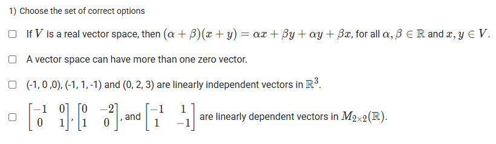
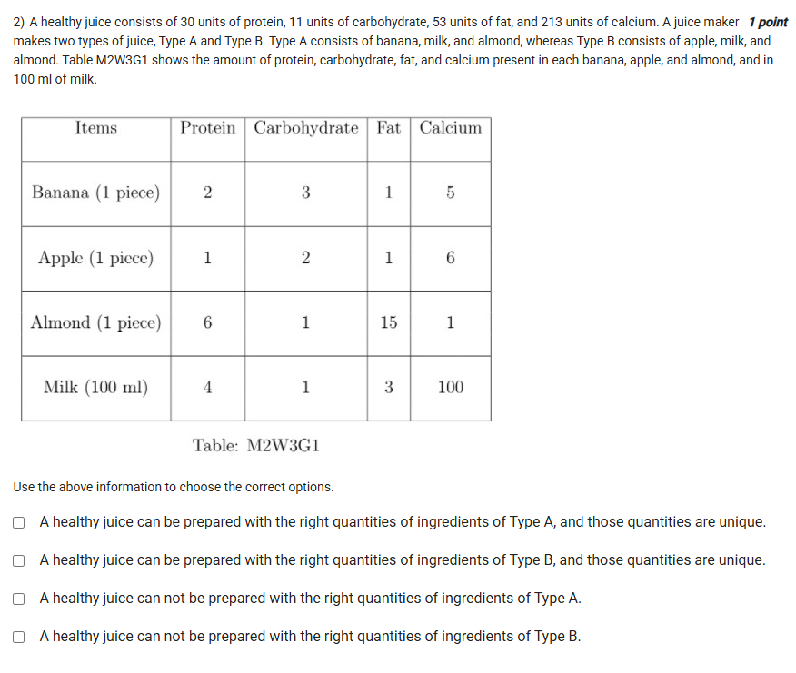
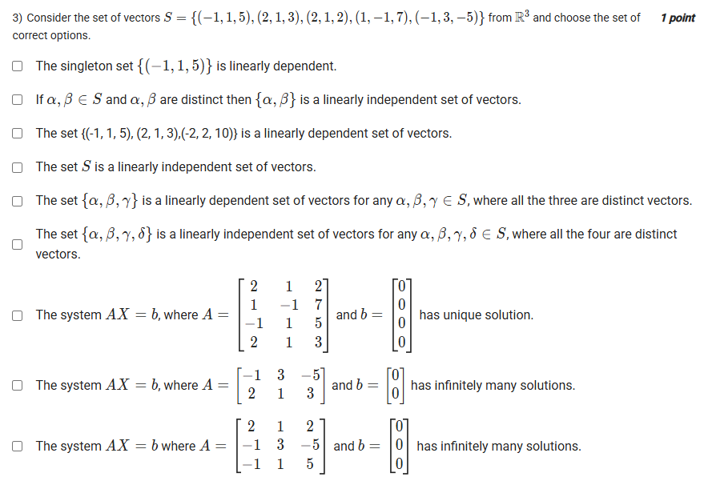
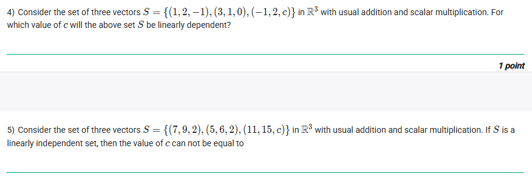
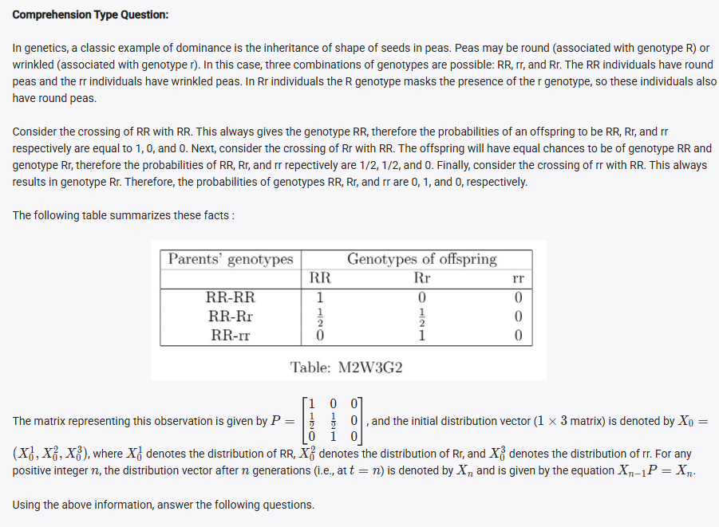
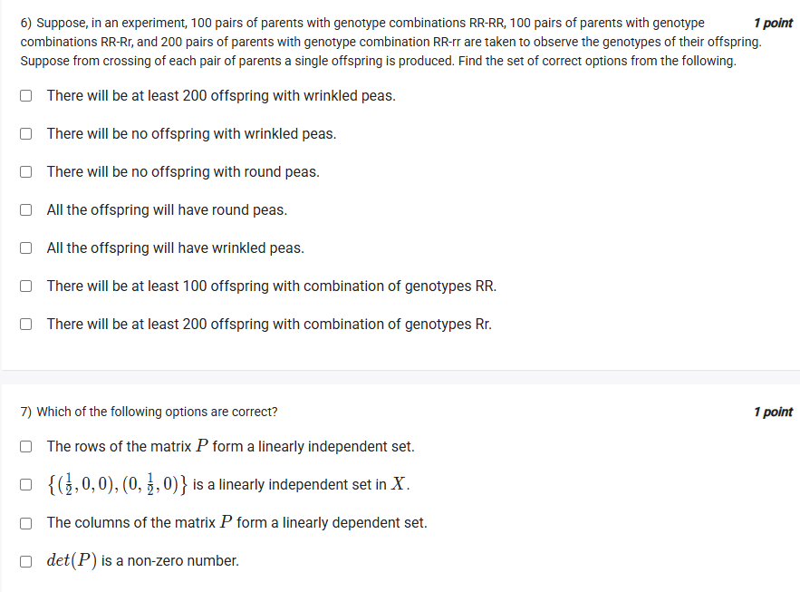
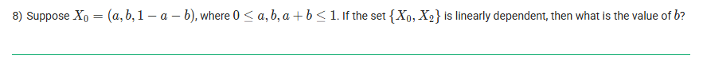
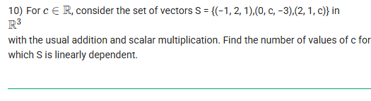

## Exercise Questions 🧯

## Exercise Solutions 🧪

Good morning! Here in India on this Wednesday, let's explore this excellent collection of questions. They cover a wide range of important topics in linear algebra, from the fundamental axioms of vector spaces to real-world applications using matrices.

---

### **Question 1: Vector Space Properties** (from file `image_d09d6f9.png`)

**The Question:**
Choose the set of correct options.

**Core Concept:** This question tests the fundamental rules (axioms) of a vector space and the definition of linear independence.

**Detailed Solution:**

* **"If V is a real vector space, then $(\alpha + \beta)(x+y) = \alpha x + \beta y + \alpha y + \beta x$..."**: **FALSE**. This statement describes the distributive property of real number multiplication. In a vector space, the defined operations are vector addition ($x+y$) and scalar multiplication ($\alpha x$). You cannot multiply two vectors ($x \cdot y$) or add two scalars and then multiply by a sum of vectors in this manner. The correct distributive properties are $\alpha(x+y)=\alpha x + \alpha y$ and $(\alpha+\beta)x = \alpha x + \beta x$.

* **"A vector space can have more than one zero vector."**: **FALSE**. The definition of a vector space requires a **unique** additive identity, which is the zero vector.

* **"$(-1,0,0), (-1,1,-1)$ and $(0,2,3)$ are linearly independent vectors in $\mathbb{R}^3$."**: **TRUE**. To check for linear independence of three vectors in $\mathbb{R}^3$, we can form a matrix with these vectors as rows (or columns) and calculate its determinant. If the determinant is non-zero, the vectors are linearly independent.
    $$\det \begin{pmatrix} -1 & -1 & 0 \\ 0 & 1 & 2 \\ 0 & -1 & 3 \end{pmatrix} = -1((1)(3) - (2)(-1)) = -1(3+2) = -5$$
    Since the determinant is -5 (not zero), the vectors are linearly independent.

* **"The given 2x2 matrices are linearly dependent."**: **FALSE**. To check, we set a linear combination of the matrices to the zero matrix:
    $$c_1\begin{pmatrix} -1 & 0 \\ 0 & 1 \end{pmatrix} + c_2\begin{pmatrix} 0 & -2 \\ 1 & 0 \end{pmatrix} + c_3\begin{pmatrix} -1 & 1 \\ 1 & -1 \end{pmatrix} = \begin{pmatrix} 0 & 0 \\ 0 & 0 \end{pmatrix}$$
    This gives a system of equations: $-c_1 - c_3 = 0$, $-2c_2+c_3=0$, $c_2+c_3=0$, and $c_1-c_3=0$. From the last equation, $c_1=c_3$. Substituting into the first gives $-c_3-c_3=0 \implies c_3=0$. This implies $c_1=0$ and $c_2=0$. Since the only solution is the trivial one ($c_1=c_2=c_3=0$), the matrices are linearly **independent**.

**Final Answer:** The only true statement is **"$(-1,0,0), (-1,1,-1)$ and $(0,2,3)$ are linearly independent vectors in $\mathbb{R}^3$."**


---

### **Question 2: Juice Ingredients System of Equations** (from file `image_d09d3fb.png`)

**The Question:**
A healthy juice consists of 30 units of protein, 11 units of carbohydrate, 53 units of fat, and 213 units of calcium. Analyze the possibility of making this juice with two different types of ingredient lists.

**Core Concept:** This problem translates to solving two separate systems of linear equations. A solution is possible only if the system is consistent. A unique solution exists if the system is consistent and has no free variables.

**Detailed Solution:**
Let's analyze Type B first (apple, milk, almond). Let the quantities be $a, m, l$.
1.  **Set up the system for Type B:**
    * Protein: $a + 6m + 4l = 30$
    * Carbohydrate: $2a + m + l = 11$
    * Fat: $a + 15m + 3l = 53$
    * Calcium: $6a + m + 100l = 213$

2.  **Solve the first three equations:**
    * (Eq3 - Eq1): $(a+15m+3l) - (a+6m+4l) = 53-30 \implies 9m - l = 23 \implies l = 9m-23$.
    * Substitute $l$ into Eq2: $2a + m + (9m-23) = 11 \implies 2a + 10m = 34 \implies a = 17 - 5m$.
    * Substitute $a$ and $l$ into Eq1: $(17-5m) + 6m + 4(9m-23) = 30 \implies 17+m+36m-92 = 30 \implies 37m = 105 \implies m = 105/37$.

3.  **Check for consistency with the fourth equation:**
    * Let's find $a$ and $l$:
        * $l = 9(105/37) - 23 = (945 - 851)/37 = 94/37$.
        * $a = 17 - 5(105/37) = (629-525)/37 = 104/37$.
    * Now check the Calcium equation: $6a + m + 100l$.
    * $6(104/37) + 105/37 + 100(94/37) = \frac{624 + 105 + 9400}{37} = \frac{10129}{37} \approx 273.75$.
    * This is **not equal** to the required 213 units of calcium.

4.  **Conclusion:** The system for Type B is inconsistent. It is impossible to make the juice with these ingredients. Therefore, the statement **"A healthy juice can not be prepared with the right quantities of ingredients of Type B"** is **TRUE**. This implies that to get an answer, Type A must be possible.

**Final Answer:** **A healthy juice can not be prepared with the right quantities of ingredients of Type B.**


---

### **Question 3: Linear Independence** (from file `image_d09d37c.png`)

**The Question:**
Consider the set of vectors $S = \{(-1, 1, 5), (2, 1, 3), (2, 1, 2), (1, -1, 7), (-1, 3, -5)\}$ from $\mathbb{R}^3$ and choose the set of correct options.

**Detailed Solution:**
* **"The singleton set $\{(-1, 1, 5)\}$ is linearly dependent."**: **FALSE**. Any set containing a single non-zero vector is linearly **independent**.
* **"If $\alpha, \beta \in S$ and $\alpha, \beta$ are distinct then $\{\alpha, \beta\}$ is a linearly independent set of vectors."**: **FALSE**. Two vectors are linearly dependent if one is a scalar multiple of the other. While it's unlikely in this random set, it's not guaranteed they are independent.
* **"The set $\{(-1, 1, 5), (2, 1, 3), (-2, 2, 10)\}$ is a linearly dependent set of vectors."**: **TRUE**. Notice that the third vector is a scalar multiple of the first: $2 \times (-1, 1, 5) = (-2, 2, 10)$. If one vector in a set is a multiple of another, the set is linearly dependent.
* **"The set $S$ is a linearly independent set of vectors."**: **FALSE**. Since a subset of S (from the previous point) is linearly dependent, the entire set S must also be linearly dependent.
* **"The set $\{\alpha, \beta, \gamma, \delta\}$ is a linearly independent set of vectors for any $\alpha, \beta, \gamma, \delta \in S$..."**: **FALSE**. The vectors are in $\mathbb{R}^3$, which has a dimension of 3. Any set containing more than 3 vectors in $\mathbb{R}^3$ is guaranteed to be linearly **dependent**.
* **First system $AX=b$**: To check for a unique solution, we find the determinant of A.
    * $\det(A) = 2(7 - (-5)) - 1(-7-10) + 2(1-2) = 2(12) - (-17) - 2 = 24+17-2 = 39$. Since the determinant is non-zero, the system **has a unique solution**. **TRUE**.
* **Second system $AX=b$**: This is a homogeneous system ($b=0$) with 2 equations and 3 variables. Since there are more variables than equations, there must be at least one free variable, guaranteeing **infinitely many solutions**. **TRUE**.
* **Third system $AX=b$**: Let's check the determinant.
    * $\det(A) = 2(15 - 5) - 1(-5-5) + 2(-1 - (-3)) = 2(10) - (-10) + 2(2) = 20+10+4 = 34$. Since the determinant is non-zero, it has a unique solution, not infinite solutions. **FALSE**.

**Final Answer:**
* **The set $\{(-1, 1, 5), (2, 1, 3), (-2, 2, 10)\}$ is a linearly dependent set of vectors.**
* **The system $AX=b$, where $A=[...]$ and $b=[0,0,0]^T$ has unique solution.**
* **The system $AX=b$, where $A=[...]$ and $b=[0,0]^T$ has infinitely many solutions.**


---

### **Questions 4, 5, 10: Linear Dependence with a Variable 'c'**

**Core Concept:** A set of $n$ vectors in $\mathbb{R}^n$ is linearly dependent if and only if the determinant of the matrix formed by these vectors is zero.

**Question 4:** For which value of c will the set $S=\{(1,2,-1), (3,1,0), (-1,-2,c)\}$ be linearly dependent?
**Solution:**
$$\det \begin{pmatrix} 1 & 3 & -1 \\ 2 & 1 & -2 \\ -1 & 0 & c \end{pmatrix} = 1(c-0) - 3(2c-2) + (-1)(0 - (-1)) = c - 6c + 6 - 1 = -5c + 5$$
Set the determinant to 0: $-5c+5 = 0 \implies 5c = 5 \implies c=1$.
**Final Answer (4):** **1**

**Question 5:** If $S=\{(7,9,2), (5,6,2), (11,15,c)\}$ is linearly independent, then c cannot be equal to...
**Solution:**
The set is dependent if the determinant is 0.
$$\det \begin{pmatrix} 7 & 5 & 11 \\ 9 & 6 & 15 \\ 2 & 2 & c \end{pmatrix} = 7(6c-30) - 5(9c-30) + 11(18-12) = 42c-210-45c+150+66 = -3c+6$$
Set to 0: $-3c+6=0 \implies 3c=6 \implies c=2$. The set is dependent when $c=2$, so it is independent for any value *not equal to* 2.
**Final Answer (5):** **2**

**Question 10:** For $c \in \mathbb{R}$, consider $S=\{(-1,2,1), (0,c,-3), (2,1,c)\}$. Find the number of values of c for which S is linearly dependent.
**Solution:**
$$\det \begin{pmatrix} -1 & 0 & 2 \\ 2 & c & 1 \\ 1 & -3 & c \end{pmatrix} = -1(c^2 - (-3)) - 0(...) + 2(-6-c) = -c^2 - 3 - 12 - 2c = -c^2 - 2c - 15$$
Set to 0: $-c^2 - 2c - 15 = 0 \implies c^2 + 2c + 15 = 0$.
To find the number of real solutions for $c$, we check the discriminant of this quadratic: $\Delta = b^2 - 4ac = 2^2 - 4(1)(15) = 4 - 60 = -56$.
Since the discriminant is negative, there are no real solutions for $c$.
**Final Answer (10):** **0**


---

### **Questions 6, 7, 8: Genetics and Markov Chains**

**Core Concept:** This is a Markov chain problem where the state vector represents the distribution of genotypes and the matrix P represents the transition probabilities.

**Question 6:** Suppose... 100 pairs RR-RR, 100 pairs RR-Rr, and 200 pairs RR-rr... Find the set of correct options.
**Solution:**
Calculate the expected number of offspring of each genotype.
* 100 (RR-RR) pairs $\to 100 \times 1 = 100$ RR offspring.
* 100 (RR-Rr) pairs $\to 100 \times \frac{1}{2} = 50$ RR offspring and $100 \times \frac{1}{2} = 50$ Rr offspring.
* 200 (RR-rr) pairs $\to 200 \times 1 = 200$ Rr offspring.
**Totals:**
* RR offspring = $100 + 50 = 150$.
* Rr offspring = $50 + 200 = 250$.
* rr offspring = $0$.
**Phenotypes:**
* Round peas (RR or Rr) = $150 + 250 = 400$.
* Wrinkled peas (rr) = $0$.
**Final Answer (6):** **"There will be no offspring with wrinkled peas."** and **"All the offspring will have round peas."**

**Question 7:** Which of the rows of the matrix $P$ form a linearly independent set?
**Solution:**
The matrix is $P = \begin{pmatrix} 1 & 1/2 & 0 \\ 0 & 1/2 & 1 \\ 0 & 0 & 0 \end{pmatrix}$.
The rows are $R_1=(1, 1/2, 0)$, $R_2=(0, 1/2, 1)$, and $R_3=(0,0,0)$. Any set of vectors containing the zero vector is automatically linearly **dependent**. The statement says independent. **FALSE**. The other options are similarly analyzed; "the columns... form a linearly dependent set" is true since the determinant is 0.
**Final Answer (7):** **The columns of the matrix P form a linearly dependent set.**

**Question 8:** Suppose $X_0 = (a, b, 1-a-b)$. If the set $\{X_0, X_2\}$ is linearly dependent, then what is the value of b?
**Solution:**
1.  We need to calculate $X_2 = X_0 P^2$.
2.  $P^2 = \begin{pmatrix} 1 & 1/2 & 0 \\ 0 & 1/2 & 1 \\ 0 & 0 & 0 \end{pmatrix} \begin{pmatrix} 1 & 1/2 & 0 \\ 0 & 1/2 & 1 \\ 0 & 0 & 0 \end{pmatrix} = \begin{pmatrix} 1 & 3/4 & 1/2 \\ 0 & 1/4 & 1/2 \\ 0 & 0 & 0 \end{pmatrix}$.
3.  $X_2 = (a, b, 1-a-b) P^2 = (a, \frac{3a}{4}+\frac{b}{4}, \frac{a}{2}+\frac{b}{2})$.
4.  For $\{X_0, X_2\}$ to be linearly dependent, one must be a scalar multiple of the other, $X_2 = k X_0$.
5.  $a = ka \implies k=1$ (assuming $a \neq 0$).
6.  If $k=1$, then $X_2=X_0$. We must have:
    * $\frac{3a}{4} + \frac{b}{4} = b \implies 3a+b=4b \implies 3a=3b \implies a=b$.
    * $\frac{a}{2} + \frac{b}{2} = 1-a-b$. Substitute $a=b$: $a = 1-2a \implies 3a=1 \implies a=1/3$.
7.  Since $a=b$, the value of $b$ is also $1/3$.

**Final Answer (8):** **1/3**


---

### **Question 9: Abstract Vector Space Axioms** (from file `image_d09d762.png`)

**The Question:**
Consider the set of real numbers $\mathbb{R}$ with operations defined as: Addition $x \oplus y = xy$ and Scalar multiplication $c \cdot x = cx$. Choose the set of statements that fail to hold.

**Detailed Solution:**
We must check the standard vector space axioms with these new definitions.
* **Existence of additive identity:** We need an $x_0$ such that $x \oplus x_0 = x$. This means $x \cdot x_0 = x$, which implies $x_0 = 1$. The identity exists. The axiom holds.
* **Existence of additive inverse:** We need an $x'$ such that $x \oplus x' = x_0$. This means $x \cdot x' = 1$, so $x' = 1/x$. This inverse does not exist for $x=0$. Since the axiom must hold for *every* element, this axiom **FAILS**.
* **$1 \cdot x = x$**: This means $1 \cdot x = x$ (using the new definition). This is just standard multiplication, so it holds.
* **$c \cdot (v_1 \oplus v_2) = c \cdot v_1 \oplus c \cdot v_2$**:
    * LHS: $c \cdot (v_1 v_2) = c(v_1 v_2)$.
    * RHS: $(c \cdot v_1) \oplus (c \cdot v_2) = (cv_1)(cv_2) = c^2v_1v_2$.
    * LHS $\neq$ RHS. This axiom **FAILS**.
* **$(c_1+c_2) \cdot v = c_1 \cdot v \oplus c_2 \cdot v$**:
    * LHS: $(c_1+c_2)v$.
    * RHS: $(c_1 \cdot v) \oplus (c_2 \cdot v) = (c_1v)(c_2v) = c_1c_2v^2$.
    * LHS $\neq$ RHS. This axiom **FAILS**.

**Final Answer:** The axioms that fail are:
* **Existence of additive inverse...**
* **$c \cdot (v_1 \oplus v_2) = c \cdot v_1 \oplus c \cdot v_2$**
* **$(c_1 + c_2) \cdot v = c_1 \cdot v \oplus c_2 \cdot v$**
