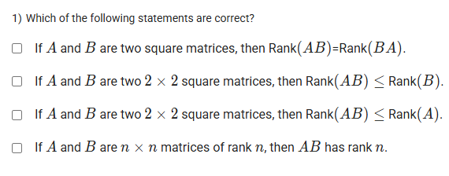
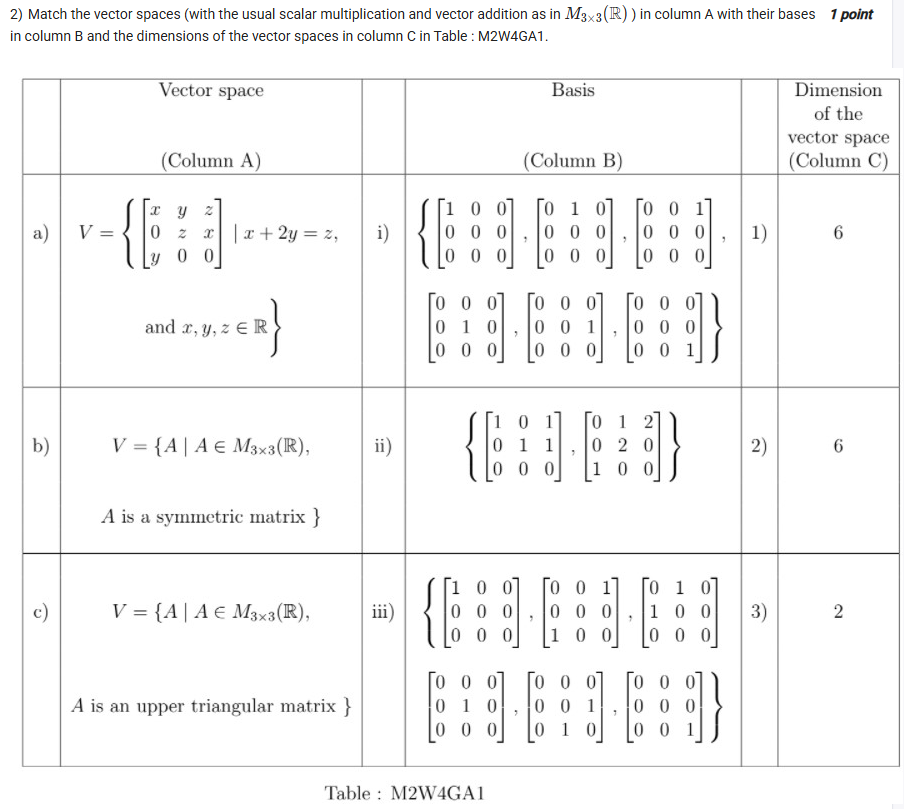
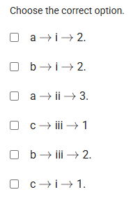
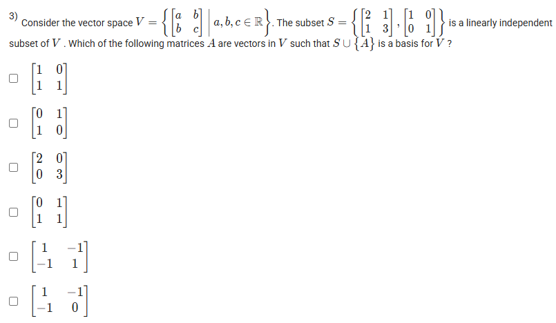
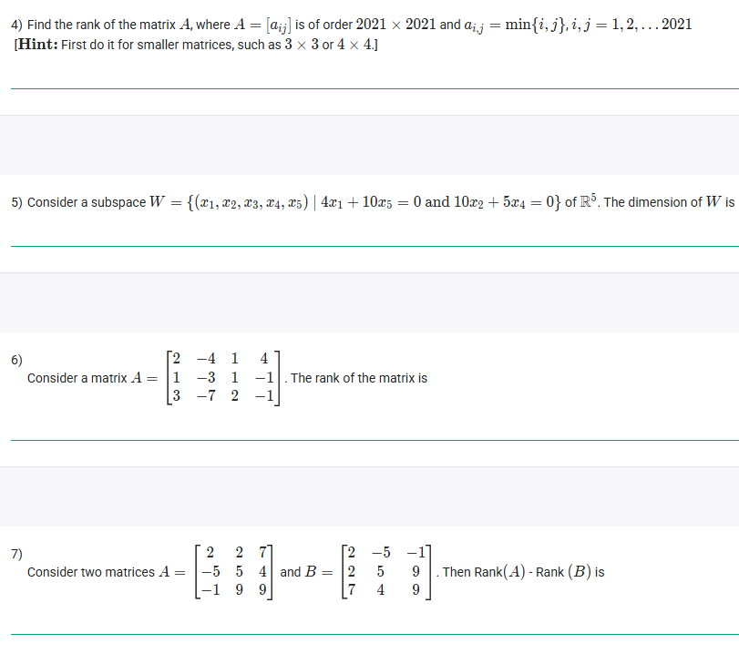
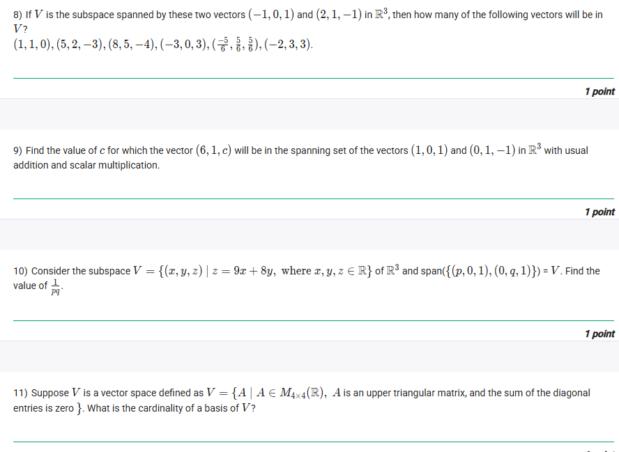
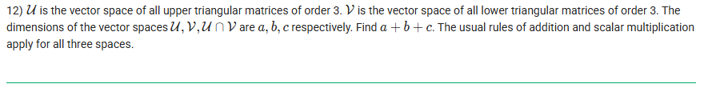

## Exercise Questions ❓

## Exercise Solutions 🧪

Good morning! Here in India on this Monday, this is a great set of questions covering many essential topics in linear algebra. Let's work through them.

### **Core Concepts: Matrices, Vector Spaces, and Linear Independence**

1.  **Rank of a Matrix:** The rank is the maximum number of linearly independent rows (or columns) in the matrix. It represents the dimension of the row space or column space. Elementary row operations do not change the rank.
2.  **Vector Space:** A set of objects (vectors) that can be added together and multiplied by scalars, obeying certain axioms (like closure, associativity, identity elements, etc.). $\mathbb{R}^n$ and the set of $m \times n$ matrices ($M_{m \times n}(\mathbb{R})$) are common examples.
3.  **Subspace:** A subset of a vector space that is itself a vector space under the same operations. It must contain the zero vector and be closed under addition and scalar multiplication.
4.  **Basis:** A set of linearly independent vectors that span the entire vector space (or subspace).
5.  **Dimension:** The number of vectors in a basis for a vector space (or subspace).
6.  **Linear Independence:** A set of vectors is linearly independent if the only way to make a linear combination of them equal to the zero vector is by using all zero coefficients. Otherwise, they are linearly dependent.
7.  **Span:** The span of a set of vectors is the set of all possible linear combinations of those vectors. It forms a subspace.

---

### **Question 1: Properties of Rank** (from file `image_743d9c.png`)

**The Question:**
Which of the following statements are correct?

**Detailed Solution:**
* **"If A and B are two square matrices, then Rank(AB)=Rank(BA)."**: **FALSE**. Matrix multiplication is not commutative. Consider $A=\begin{pmatrix} 1 & 0 \\ 0 & 0 \end{pmatrix}, B=\begin{pmatrix} 0 & 1 \\ 0 & 0 \end{pmatrix}$. Then $AB=\begin{pmatrix} 0 & 1 \\ 0 & 0 \end{pmatrix}$ (Rank 1), but $BA=\begin{pmatrix} 0 & 0 \\ 0 & 0 \end{pmatrix}$ (Rank 0).
* **"If A and B are two $2 \times 2$ square matrices, then Rank(AB) $\le$ Rank(B)."**: **TRUE**. This is a general property of rank. The rank of a product is less than or equal to the minimum of the ranks of the factors. Since the columns of AB are linear combinations of the columns of A, the column space of AB is a subspace of the column space of A, meaning Rank(AB) $\le$ Rank(A). Also, the row space of AB is a subspace of the row space of B, meaning Rank(AB) $\le$ Rank(B).
* **"If A and B are two $2 \times 2$ square matrices, then Rank(AB) $\le$ Rank(A)."**: **TRUE**. See explanation above.
* **"If A and B are $n \times n$ matrices of rank n, then AB has rank n."**: **TRUE**. Matrices of rank $n$ (full rank) are invertible. The product of two invertible matrices is also invertible. An invertible $n \times n$ matrix always has rank $n$.

**Final Answer:** The last three statements are correct.


---

### **Question 2: Matching Vector Spaces, Bases, and Dimensions** (from file `image_7440a8.png` & `image_74404e.png`)

**The Question:**
Match the vector spaces (Column A) with their bases (Column B) and dimensions (Column C).

**Detailed Solution:**

* **a) $V = \{ \begin{pmatrix} x & y & z \\ 0 & z & x \\ y & 0 & 0 \end{pmatrix} | x+2y=z \}$**:
    * An arbitrary matrix in this space depends on $x, y, z$ with the constraint $z=x+2y$.
    * Substitute $z$: $\begin{pmatrix} x & y & x+2y \\ 0 & x+2y & x \\ y & 0 & 0 \end{pmatrix}$
    * Separate into basis vectors by isolating $x$ and $y$:
        $x \begin{pmatrix} 1 & 0 & 1 \\ 0 & 1 & 1 \\ 0 & 0 & 0 \end{pmatrix} + y \begin{pmatrix} 0 & 1 & 2 \\ 0 & 2 & 0 \\ 1 & 0 & 0 \end{pmatrix}$
    * This shows a basis with 2 vectors. The **dimension is 2**. This basis matches option **(ii)**. So, **a $\to$ ii $\to$ 3**.

* **b) $V = \{ A \in M_{3\times3}(\mathbb{R}) | A \text{ is a symmetric matrix} \}$**:
    * A symmetric matrix $A = A^T$. $a_{ij} = a_{ji}$.
    * $\begin{pmatrix} a & b & c \\ b & d & e \\ c & e & f \end{pmatrix}$. We can choose the diagonal elements (a, d, f) and the elements above the diagonal (b, c, e) freely. The elements below are then determined.
    * There are $3+3 = 6$ free parameters. The **dimension is 6**. The basis shown in **(i)** corresponds to setting each free parameter to 1 and others to 0. So, **b $\to$ i $\to$ 1 (or 2, depending on C column numbers)**. The C column shows dimension 6 twice (options 1 and 2).

* **c) $V = \{ A \in M_{3\times3}(\mathbb{R}) | A \text{ is an upper triangular matrix} \}$**:
    * An upper triangular matrix has zeros below the main diagonal.
    * $\begin{pmatrix} a & b & c \\ 0 & d & e \\ 0 & 0 & f \end{pmatrix}$. The 6 entries on or above the diagonal can be chosen freely.
    * The **dimension is 6**. The basis shown in **(iii)** corresponds to setting each of these 6 entries to 1 and others to 0. So, **c $\to$ iii $\to$ 1 (or 2)**.

**Matching:**
* a $\to$ ii $\to$ 3 (Dimension 2)
* b $\to$ i $\to$ 1 or 2 (Dimension 6)
* c $\to$ iii $\to$ 1 or 2 (Dimension 6)

Checking the options:
* a $\to$ i $\to$ 2: False (Basis mismatch)
* b $\to$ i $\to$ 2: Possible if C column 2 is Dim 6.
* a $\to$ ii $\to$ 3: True.
* c $\to$ iii $\to$ 1: Possible if C column 1 is Dim 6.
* b $\to$ iii $\to$ 2: False (Basis mismatch)
* c $\to$ i $\to$ 1: False (Basis mismatch)

The only fully consistent option listed is **a $\to$ ii $\to$ 3**.

**Final Answer:** **a $\to$ ii $\to$ 3**.


---

### **Question 3: Basis Extension** (from file `image_743d45.png`)

**The Question:**
Consider the vector space $V = \{ \begin{pmatrix} a & b \\ b & c \end{pmatrix} | a, b, c \in \mathbb{R} \}$. The subset $S = \{ \begin{pmatrix} 2 & 1 \\ 1 & 3 \end{pmatrix}, \begin{pmatrix} 1 & 0 \\ 0 & 1 \end{pmatrix} \}$ is a linearly independent subset of $V$. Which of the following matrices $A$ are vectors in $V$ such that $S \cup \{A\}$ is a basis for $V$?

**Detailed Solution:**
1.  **Find the dimension of V:** The space $V$ is the set of all $2 \times 2$ symmetric matrices.
    * A basis for $V$ is $\left\{ \begin{pmatrix} 1 & 0 \\ 0 & 0 \end{pmatrix}, \begin{pmatrix} 0 & 1 \\ 1 & 0 \end{pmatrix}, \begin{pmatrix} 0 & 0 \\ 0 & 1 \end{pmatrix} \right\}$.
    * The **dimension of V is 3**.
2.  **Basis Condition:** Since the dimension is 3, any basis must contain exactly 3 linearly independent vectors. $S$ already contains 2 linearly independent vectors. We need to add a third vector $A$ such that $A \in V$ and $A$ is **not** in the span of $S$.
3.  **Check which options are in V (symmetric):**
    * (1) Yes. (2) No. (3) No. (4) Yes. (5) Yes. (6) Yes.
4.  **Check which symmetric options are in the span of S:** We need to see if $A = k_1 \begin{pmatrix} 2 & 1 \\ 1 & 3 \end{pmatrix} + k_2 \begin{pmatrix} 1 & 0 \\ 0 & 1 \end{pmatrix}$ for some scalars $k_1, k_2$.
    * $A = \begin{pmatrix} 2k_1+k_2 & k_1 \\ k_1 & 3k_1+k_2 \end{pmatrix}$
    * **Test Option (1): $A = \begin{pmatrix} 1 & 0 \\ 0 & 1 \end{pmatrix}$**. This requires $k_1=0$, which gives $A=\begin{pmatrix} k_2 & 0 \\ 0 & k_2 \end{pmatrix}$. Yes, if $k_1=0, k_2=1$. This matrix is already in $S$. Cannot form a basis.
    * **Test Option (4): $A = \begin{pmatrix} 0 & 1 \\ 1 & 1 \end{pmatrix}$**. Requires $k_1=1$. Then $A=\begin{pmatrix} 2+k_2 & 1 \\ 1 & 3+k_2 \end{pmatrix}$. If $k_1=1$, the top-left element is $2+k_2=0 \implies k_2=-2$. Let's check the bottom-right: $3+k_2 = 3-2=1$. It works! So Option (4) is in the span of S. Cannot form a basis.
    * **Test Option (5): $A = \begin{pmatrix} 1 & -1 \\ -1 & 1 \end{pmatrix}$**. Requires $k_1=-1$. Then $A=\begin{pmatrix} -2+k_2 & -1 \\ -1 & -3+k_2 \end{pmatrix}$. If $k_1=-1$, top-left is $-2+k_2=1 \implies k_2=3$. Bottom-right: $-3+k_2 = -3+3=0 \neq 1$. Not in the span.
    * **Test Option (6): $A = \begin{pmatrix} 1 & -1 \\ -1 & 0 \end{pmatrix}$**. Requires $k_1=-1$. Then $A=\begin{pmatrix} -2+k_2 & -1 \\ -1 & -3+k_2 \end{pmatrix}$. If $k_1=-1$, top-left is $-2+k_2=1 \implies k_2=3$. Bottom-right: $-3+k_2 = -3+3=0$. It works! So Option (6) is in the span of S. Cannot form a basis.
5.  **Conclusion:** Only Option (5) is a symmetric matrix that is not in the span of S. Adding it to S will create a set of 3 linearly independent vectors in V, which forms a basis.

**Final Answer:** The fifth option: $\begin{pmatrix} 1 & -1 \\ -1 & 1 \end{pmatrix}$


---

### **Question 4: Rank of $A = [\min(i,j)]$** (from file `image_743ce7.png`)

**The Question:**
Find the rank of the matrix A, where $A = [a_{ij}]$ is of order $2021 \times 2021$ and $a_{ij} = \min\{i, j\}$.

**Detailed Solution:**
Let's follow the hint and look at smaller examples.
* **2x2:** $A = \begin{pmatrix} \min(1,1) & \min(1,2) \\ \min(2,1) & \min(2,2) \end{pmatrix} = \begin{pmatrix} 1 & 1 \\ 1 & 2 \end{pmatrix}$. Rank is 2.
* **3x3:** $A = \begin{pmatrix} 1 & 1 & 1 \\ 1 & 2 & 2 \\ 1 & 2 & 3 \end{pmatrix}$. Row operations: $R_2 \to R_2-R_1$, $R_3 \to R_3-R_1$. $\begin{pmatrix} 1 & 1 & 1 \\ 0 & 1 & 1 \\ 0 & 1 & 2 \end{pmatrix}$. $R_3 \to R_3-R_2$. $\begin{pmatrix} 1 & 1 & 1 \\ 0 & 1 & 1 \\ 0 & 0 & 1 \end{pmatrix}$. This is row echelon form with 3 non-zero rows. Rank is 3.
* **4x4:** $A = \begin{pmatrix} 1 & 1 & 1 & 1 \\ 1 & 2 & 2 & 2 \\ 1 & 2 & 3 & 3 \\ 1 & 2 & 3 & 4 \end{pmatrix}$. Row operations: $R_i \to R_i-R_1$ for $i=2,3,4$. $\begin{pmatrix} 1 & 1 & 1 & 1 \\ 0 & 1 & 1 & 1 \\ 0 & 1 & 2 & 2 \\ 0 & 1 & 2 & 3 \end{pmatrix}$. $R_i \to R_i-R_2$ for $i=3,4$. $\begin{pmatrix} 1 & 1 & 1 & 1 \\ 0 & 1 & 1 & 1 \\ 0 & 0 & 1 & 1 \\ 0 & 0 & 1 & 2 \end{pmatrix}$. $R_4 \to R_4-R_3$. $\begin{pmatrix} 1 & 1 & 1 & 1 \\ 0 & 1 & 1 & 1 \\ 0 & 0 & 1 & 1 \\ 0 & 0 & 0 & 1 \end{pmatrix}$. Rank is 4.

The pattern shows that the $n \times n$ matrix constructed this way has rank $n$. This is because row reducing always leaves a pivot in every column.

**Final Answer:** The rank is **2021**.


---

### **Question 5: Dimension of a Subspace** (from file `image_743ce7.png`)

**The Question:**
Consider a subspace $W = \{(x_1, x_2, x_3, x_4, x_5) | 4x_1 + 10x_5 = 0 \text{ and } 10x_2 + 5x_4 = 0\}$ of $\mathbb{R}^5$. The dimension of W is \_\_\_\_\_\_\_\_\_\_.

**Core Concept:** The dimension of a subspace defined by a system of linear homogeneous equations is the number of variables minus the number of linearly independent equations (or constraints).

**Detailed Solution:**
1.  The space is $\mathbb{R}^5$, so there are 5 variables ($n=5$).
2.  The subspace is defined by two equations:
    * $4x_1 + 10x_5 = 0 \implies 2x_1 + 5x_5 = 0$
    * $10x_2 + 5x_4 = 0 \implies 2x_2 + x_4 = 0$
3.  These two equations are clearly independent (they involve different variables). The number of independent constraints is $k=2$.
4.  The dimension of the subspace is $n - k = 5 - 2 = 3$.

**Final Answer:** The dimension is **3**.


---

### **Question 6: Rank by Row Reduction** (from file `image_743ce7.png`)

**The Question:**
Consider matrix $A = \begin{pmatrix} 2 & -4 & 1 & 4 \\ 1 & -3 & 1 & -1 \\ 3 & -7 & 2 & -1 \end{pmatrix}$. The rank of the matrix is \_\_\_\_\_\_\_\_\_\_.

**Detailed Solution:**
We use Gaussian elimination to find the row echelon form.
1.  Swap R1 and R2:
    $\begin{pmatrix} 1 & -3 & 1 & -1 \\ 2 & -4 & 1 & 4 \\ 3 & -7 & 2 & -1 \end{pmatrix}$
2.  R2 = R2 - 2*R1; R3 = R3 - 3*R1:
    $\begin{pmatrix} 1 & -3 & 1 & -1 \\ 0 & 2 & -1 & 6 \\ 0 & 2 & -1 & 2 \end{pmatrix}$
3.  R3 = R3 - R2:
    $\begin{pmatrix} 1 & -3 & 1 & -1 \\ 0 & 2 & -1 & 6 \\ 0 & 0 & 0 & -4 \end{pmatrix}$
4.  This is row echelon form. There are 3 non-zero rows.

**Final Answer:** The rank is **3**.


---

### **Question 7: Rank Invariance** (from file `image_743ce7.png`)

**The Question:**
Consider two matrices A and B. Then Rank(A) - Rank(B) is \_\_\_\_\_\_\_\_\_\_.
$A = \begin{pmatrix} 2 & 2 & 7 \\ -5 & 5 & 4 \\ -1 & 9 & 9 \end{pmatrix}$, $B = \begin{pmatrix} 2 & -5 & -1 \\ 5 & 5 & 9 \\ 7 & 4 & 9 \end{pmatrix}$

**Detailed Solution:**
1.  Observe the relationship between A and B. Matrix B is the **transpose** of matrix A ($B=A^T$).
2.  A fundamental theorem of linear algebra states that the rank of a matrix is equal to the rank of its transpose: $\text{Rank}(A) = \text{Rank}(A^T)$.
3.  Therefore, $\text{Rank}(A) = \text{Rank}(B)$.
4.  The difference $\text{Rank}(A) - \text{Rank}(B) = 0$.

**Final Answer:** **0**


---

### **Question 8: Checking Span** (from file `image_743c8e.png`)

**The Question:**
If $V$ is the subspace spanned by these two vectors $(-1, 0, 1)$ and $(2, 1, -1)$ in $\mathbb{R}^3$, then how many of the following vectors will be in $V$? (List of 8 vectors)

**Core Concept:** A vector $w$ is in the span of $v_1, v_2$ if it can be written as a linear combination $w = c_1v_1 + c_2v_2$ for some scalars $c_1, c_2$. For vectors in $\mathbb{R}^3$, we can also check if the set $\{v_1, v_2, w\}$ is linearly dependent (its determinant is 0).

**Detailed Solution:**
Let $v_1=(-1,0,1)$ and $v_2=(2,1,-1)$. Let's check each vector $w=(x,y,z)$.
We need to solve $w = c_1v_1 + c_2v_2$, which is $(x,y,z) = c_1(-1,0,1) + c_2(2,1,-1) = (-c_1+2c_2, c_2, c_1-c_2)$.
This gives $y=c_2$, $x=-c_1+2c_2$, $z=c_1-c_2$.
Substitute $c_2=y$ into the other equations: $x=-c_1+2y$ and $z=c_1-y$.
From the second, $c_1=z+y$. Substitute into the first: $x=-(z+y)+2y = -z-y+2y = y-z$.
So, a vector $(x,y,z)$ is in the span if it satisfies the condition **$x = y-z$** or **$x-y+z=0$**.

Let's test the vectors:
1.  (1, 1, 0): $1 - 1 + 0 = 0$. **Yes**.
2.  (5, 2, -3): $5 - 2 + (-3) = 0$. **Yes**.
3.  (8, 5, -4): $8 - 5 + (-4) = -1 \neq 0$. **No**.
4.  (-3, 0, 3): $-3 - 0 + 3 = 0$. **Yes**.
5.  (-5/3, 5/6, -5/6): $-5/3 - 5/6 + (-5/6) = -10/6 - 10/6 = -20/6 \neq 0$. **No**.
6.  (-2, 3, 3): $-2 - 3 + 3 = -2 \neq 0$. **No**.

*Counting the "Yes" answers: 1, 2, 4. There are 3 vectors.*

**Final Answer:** **3**


---

### **Question 9: Vector in Span** (from file `image_743c8e.png`)

**The Question:**
Find the value of c for which the vector $(6, 1, c)$ will be in the spanning set of the vectors $(1, 0, 1)$ and $(0, 1, -1)$.

**Detailed Solution:**
We need to find $c_1, c_2$ such that $(6, 1, c) = c_1(1, 0, 1) + c_2(0, 1, -1)$.
* $(6, 1, c) = (c_1, c_2, c_1 - c_2)$.
* Equating components:
    * $c_1 = 6$
    * $c_2 = 1$
    * $c = c_1 - c_2$
* Substitute the values: $c = 6 - 1 = 5$.

**Final Answer:** **5**


---

### **Question 10: Subspace Basis** (from file `image_743c8e.png`)

**The Question:**
Consider the subspace $V = \{(x, y, z) | z = 9x + 8y\}$ of $\mathbb{R}^3$ and $\text{span}(\{(p, 0, 1), (0, q, 1)\}) = V$. Find the value of $\frac{1}{pq}$.

**Detailed Solution:**
1.  **Find a basis for V:** Any vector in V can be written as $(x, y, 9x+8y)$. We can separate this based on the free variables $x$ and $y$:
    * $(x, y, 9x+8y) = x(1, 0, 9) + y(0, 1, 8)$.
    * So, a basis for V is $B = \{(1, 0, 9), (0, 1, 8)\}$.
2.  **Relate the given spanning set to the basis:** The given spanning set $S = \{(p, 0, 1), (0, q, 1)\}$ must also be a basis for V (since the dimension is 2). This means the vectors in $S$ must be in $V$ and must be linearly independent.
3.  **Check if vectors in S are in V:** A vector $(x,y,z)$ is in V if $z=9x+8y$.
    * For $(p, 0, 1)$: Check if $1 = 9(p) + 8(0) \implies 1 = 9p \implies p = 1/9$.
    * For $(0, q, 1)$: Check if $1 = 9(0) + 8(q) \implies 1 = 8q \implies q = 1/8$.
4.  **Calculate $\frac{1}{pq}$:**
    * $\frac{1}{pq} = \frac{1}{(1/9)(1/8)} = \frac{1}{1/72} = 72$.

**Final Answer:** **72**


---

### **Question 11: Dimension of a Subspace of Matrices** (from file `image_743c8e.png`)

**The Question:**
Suppose $V$ is a vector space defined as $V = \{A | A \in M_{4\times4}(\mathbb{R}), A \text{ is an upper triangular matrix, and the sum of the diagonal entries is zero}\}$. What is the cardinality of a basis of $V$?

**Detailed Solution:**
1.  **Start with the space of $4 \times 4$ upper triangular matrices:** An upper triangular matrix has zeros below the diagonal.
    $$\begin{pmatrix} a_{11} & a_{12} & a_{13} & a_{14} \\ 0 & a_{22} & a_{23} & a_{24} \\ 0 & 0 & a_{33} & a_{34} \\ 0 & 0 & 0 & a_{44} \end{pmatrix}$$
    There are $4+3+2+1 = 10$ entries that can be chosen freely. The dimension is 10.
2.  **Apply the constraint:** The sum of the diagonal entries is zero.
    * $a_{11} + a_{22} + a_{33} + a_{44} = 0$.
3.  **Find the dimension:** This single, non-trivial linear constraint reduces the number of free variables by one.
    * Dimension = (Dimension of original space) - (Number of independent constraints)
    * Dimension = $10 - 1 = 9$.
4.  The cardinality of a basis is the dimension of the space.

**Final Answer:** **9**


---

### **Question 12: Dimensions related to Triangular Matrices** (from file `image_73ea92.png`)

**The Question:**
$\mathcal{U}$ is the vector space of all upper triangular matrices of order 3. $\mathcal{V}$ is the vector space of all lower triangular matrices of order 3. The dimensions of $\mathcal{U}$, $\mathcal{V}$, $\mathcal{U} \cap \mathcal{V}$ are $a, b, c$ respectively. Find $a+b+c$.

**Detailed Solution:**
1.  **Dimension of $\mathcal{U}$ (Upper Triangular):**
    * $\begin{pmatrix} x & y & z \\ 0 & u & v \\ 0 & 0 & w \end{pmatrix}$. 6 free variables. $a=6$.
2.  **Dimension of $\mathcal{V}$ (Lower Triangular):**
    * $\begin{pmatrix} x & 0 & 0 \\ y & u & 0 \\ z & v & w \end{pmatrix}$. 6 free variables. $b=6$.
3.  **Intersection $\mathcal{U} \cap \mathcal{V}$:** A matrix that is both upper and lower triangular must have zeros both below and above the main diagonal. It must be a **diagonal** matrix.
    * $\begin{pmatrix} x & 0 & 0 \\ 0 & u & 0 \\ 0 & 0 & w \end{pmatrix}$. 3 free variables. $c=3$.
4.  **Calculate $a+b+c$**:
    * $a+b+c = 6 + 6 + 3 = 15$.

**Final Answer:** **15**
