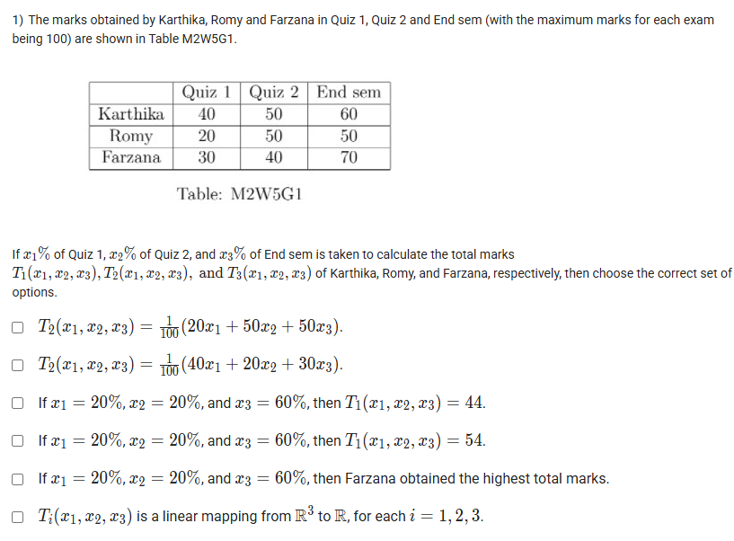
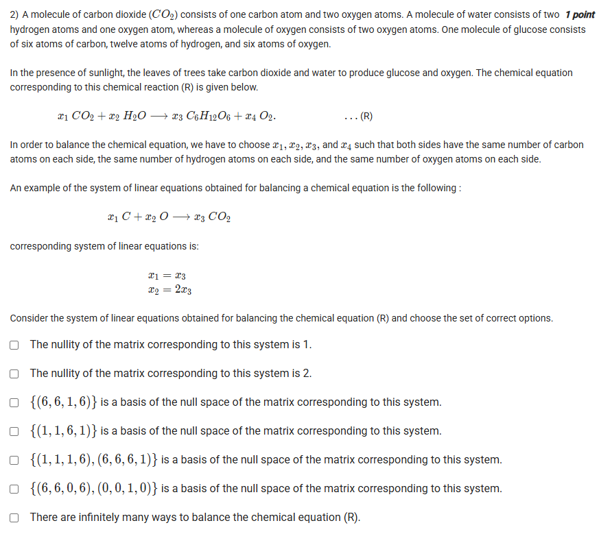
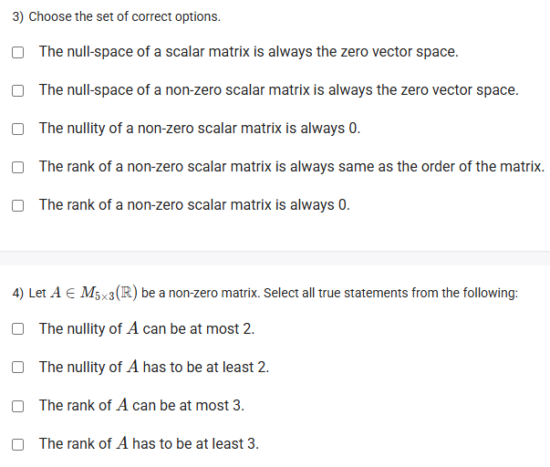
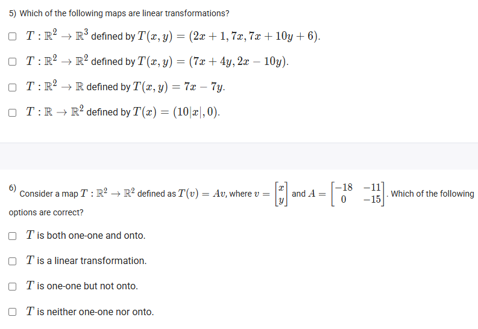
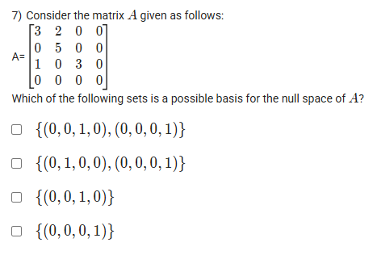
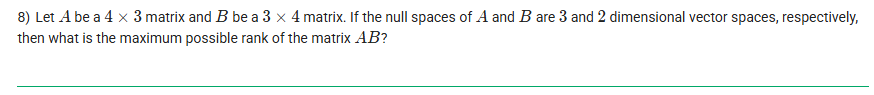
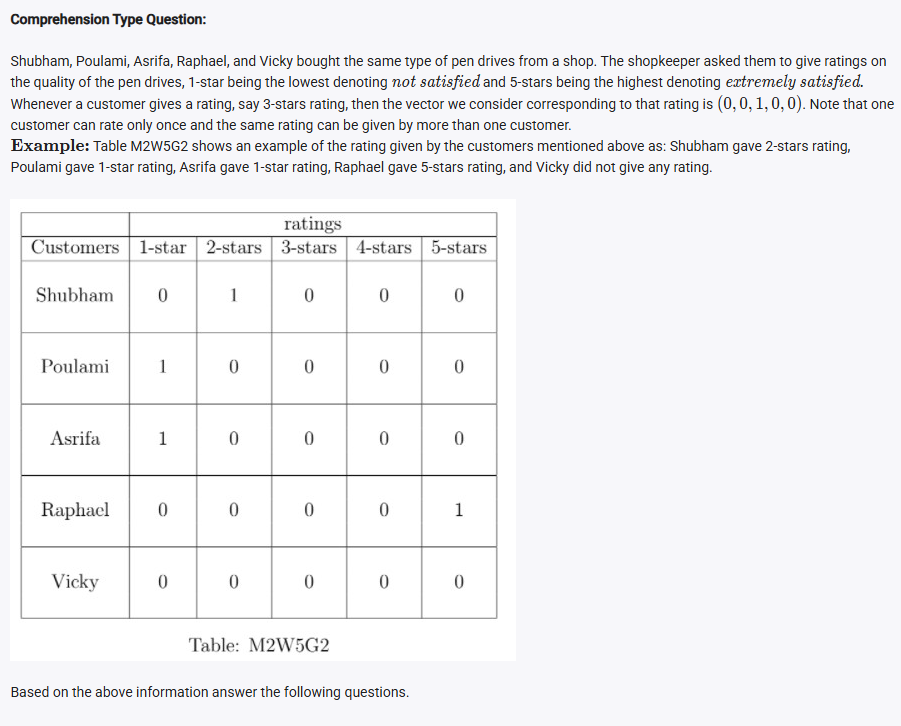
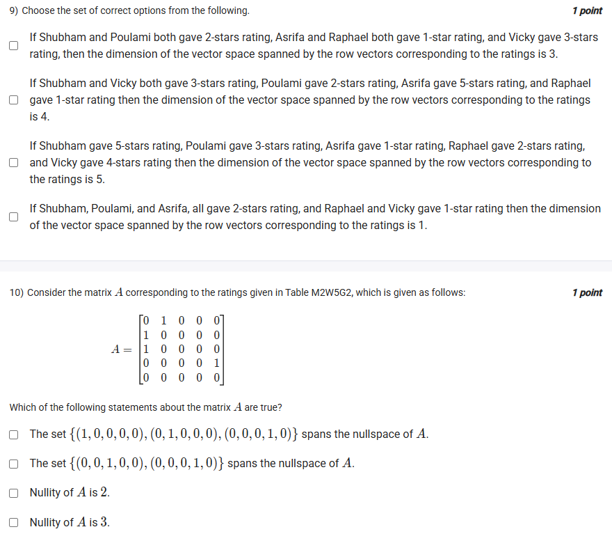
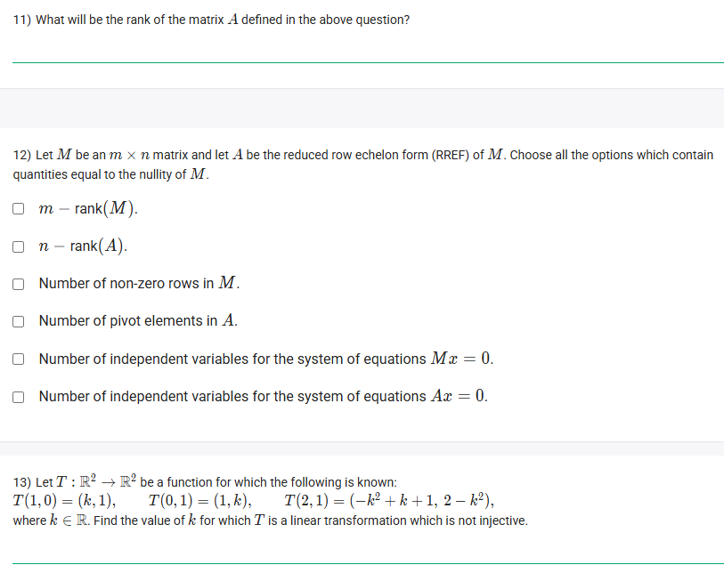

## Exercise Questions ❓

## Exercise Solutions 🔬

Hello! I can certainly help you with these linear algebra questions. Here is a detailed breakdown of each problem with the core concepts and step-by-step solutions.



### ❓ Question 1: Student Marks

> The marks obtained by Karthika, Romy and Farzana in Quiz 1, Quiz 2 and End sem (with the maximum marks for each exam being 100) are shown in Table M2W5G1.
>
> | | Quiz 1 | Quiz 2 | End sem |
> | :--- | :--- | :--- | :--- |
> | **Karthika** | 40 | 50 | 60 |
> | **Romy** | 20 | 50 | 50 |
> | **Farzana** | 30 | 40 | 70 |
>
> If $x_1\%$ of Quiz 1, $x_2\%$ of Quiz 2, and $x_3\%$ of End sem is taken to calculate the total marks $T_1(x_1, x_2, x_3)$, $T_2(x_1, x_2, x_3)$, and $T_3(x_1, x_2, x_3)$ of Karthika, Romy, and Farzana, respectively, then choose the correct set of options.
>
> * $T_2(x_1, x_2, x_3) = \frac{1}{100}(20x_1 + 50x_2 + 50x_3)$
> * $T_2(x_1, x_2, x_3) = \frac{1}{100}(40x_1 + 20x_2 + 30x_3)$
> * If $x_1 = 20\%$, $x_2 = 20\%$, and $x_3 = 60\%$, then $T_1(x_1, x_2, x_3) = 44$.
> * If $x_1 = 20\%$, $x_2 = 20\%$, and $x_3 = 60\%$, then $T_1(x_1, x_2, x_3) = 54$.
> * If $x_1 = 20\%$, $x_2 = 20\%$, and $x_3 = 60\%$, then Farzana obtained the highest total marks.
> * $T_i(x_1, x_2, x_3)$ is a linear mapping from $\mathbb{R}^3$ to $\mathbb{R}$, for each $i = 1, 2, 3$.

#### Core Concepts

1.  **Weighted Average:** The total score is a weighted sum of the individual scores. If the scores are $s_1, s_2, s_3$ and the weights are $x_1\%, x_2\%, x_3\%$, the total $T$ is:
    $$T = s_1 \left(\frac{x_1}{100}\right) + s_2 \left(\frac{x_2}{100}\right) + s_3 \left(\frac{x_3}{100}\right) = \frac{1}{100}(s_1 x_1 + s_2 x_2 + s_3 x_3)$$
2.  **Linear Transformation:** A mapping $T: \mathbb{R}^n \to \mathbb{R}^m$ is linear if $T(\mathbf{u} + \mathbf{v}) = T(\mathbf{u}) + T(\mathbf{v})$ and $T(c\mathbf{u}) = cT(\mathbf{u})$. A mapping from $\mathbb{R}^3$ to $\mathbb{R}$ of the form $T(x_1, x_2, x_3) = c_1 x_1 + c_2 x_2 + c_3 x_3$ (a linear combination) is a linear mapping.

#### Solution

Let's write the functions for each student using the formula:
* **Karthika ($T_1$):** Scores [40, 50, 60] $\implies T_1 = \frac{1}{100}(40x_1 + 50x_2 + 60x_3)$
* **Romy ($T_2$):** Scores [20, 50, 50] $\implies T_2 = \frac{1}{100}(20x_1 + 50x_2 + 50x_3)$
* **Farzana ($T_3$):** Scores [30, 40, 70] $\implies T_3 = \frac{1}{100}(30x_1 + 40x_2 + 70x_3)$

Now, let's check each option:

* **$T_2(x_1, x_2, x_3) = \frac{1}{100}(20x_1 + 50x_2 + 50x_3)$**
    * This perfectly matches our derived formula for Romy ($T_2$). **This is correct.**
* **$T_2(x_1, x_2, x_3) = \frac{1}{100}(40x_1 + 20x_2 + 30x_3)$**
    * This does not match the formula for $T_2$. This is incorrect.
* **If $x_1 = 20, x_2 = 20, x_3 = 60$, then $T_1 = 44$.**
    * $T_1 = \frac{1}{100}(40(20) + 50(20) + 60(60))$
    * $T_1 = \frac{1}{100}(800 + 1000 + 3600) = \frac{1}{100}(5400) = 54$.
    * The option says 44. This is incorrect.
* **If $x_1 = 20, x_2 = 20, x_3 = 60$, then $T_1 = 54$.**
    * As calculated above, $T_1 = 54$. **This is correct.**
* **If $x_1 = 20, x_2 = 20, x_3 = 60$, then Farzana obtained the highest total marks.**
    * We need to calculate all three scores:
    * $T_1$ (Karthika) = 54 (from above)
    * $T_2$ (Romy) = $\frac{1}{100}(20(20) + 50(20) + 50(60)) = \frac{1}{100}(400 + 1000 + 3000) = 44$
    * $T_3$ (Farzana) = $\frac{1}{100}(30(20) + 40(20) + 70(60)) = \frac{1}{100}(600 + 800 + 4200) = 56$
    * The scores are 54, 44, and 56. Farzana's score (56) is the highest. **This is correct.**
* **$T_i(x_1, x_2, x_3)$ is a linear mapping from $\mathbb{R}^3$ to $\mathbb{R}$, for each $i = 1, 2, 3$.**
    * Yes. Each function $T_i$ is of the form $c_1 x_1 + c_2 x_2 + c_3 x_3$ (where the $c$'s are the scores divided by 100). This is the definition of a linear mapping from $\mathbb{R}^3$ to $\mathbb{R}$. **This is correct.**

**✅ Correct Options:**
* $T_2(x_1, x_2, x_3) = \frac{1}{100}(20x_1 + 50x_2 + 50x_3)$
* If $x_1 = 20\%$, $x_2 = 20\%$, and $x_3 = 60\%$, then $T_1(x_1, x_2, x_3) = 54$.
* If $x_1 = 20\%$, $x_2 = 20\%$, and $x_3 = 60\%$, then Farzana obtained the highest total marks.
* $T_i(x_1, x_2, x_3)$ is a linear mapping from $\mathbb{R}^3$ to $\mathbb{R}$, for each $i = 1, 2, 3$.





### ❓ Question 2: Balancing Chemical Equations

> ...The chemical equation corresponding to this chemical reaction (R) is given below.
> $x_1 CO_2 + x_2 H_2O \to x_3 C_6H_{12}O_6 + x_4 O_2$ ...(R)
> ...
> Consider the system of linear equations obtained for balancing the chemical equation (R) and choose the set of correct options.
>
> * The nullity of the matrix corresponding to this system is 1.
> * The nullity of the matrix corresponding to this system is 2.
> * $\{(6, 6, 1, 6)\}$ is a basis of the null space of the matrix corresponding to this system.
> * $\{(1, 1, 6, 1)\}$ is a basis of the null space of the matrix corresponding to this system.
> * $\{(1, 1, 1, 6), (6, 6, 1, 1)\}$ is a basis of the null space of the matrix corresponding to this system.
> * $\{(6, 6, 0, 6), (0, 0, 1, 0)\}$ is a basis of the null space of the matrix corresponding to this system.
> * There are infinitely many ways to balance the chemical equation (R).

#### Core Concepts

1.  **Balancing Equations:** To balance a chemical equation, you conserve the number of atoms of each element on both sides. This creates a system of linear equations.
2.  **Homogeneous System:** The resulting system is "homogeneous" (of the form $A\mathbf{x} = \mathbf{0}$) because all constants are zero.
3.  **Null Space:** The set of all solutions $\mathbf{x}$ to $A\mathbf{x} = \mathbf{0}$ is called the null space of $A$.
4.  **Nullity:** The dimension of the null space (the number of free variables, or the number of vectors in a basis) is the nullity.

#### Solution

Let's build the system of equations by balancing each atom type:
* **Carbon (C):** $x_1 = 6x_3 \implies x_1 - 6x_3 = 0$
* **Hydrogen (H):** $2x_2 = 12x_3 \implies x_2 - 6x_3 = 0$
* **Oxygen (O):** $2x_1 + x_2 = 6x_3 + 2x_4 \implies 2x_1 + x_2 - 6x_3 - 2x_4 = 0$

This is our system $A\mathbf{x} = \mathbf{0}$. Let's solve it.
1.  From the first two equations, we see that $x_1$ and $x_2$ depend on $x_3$. Let's choose $x_3$ as a free variable.
    * Let $x_3 = t$
    * From $x_1 - 6x_3 = 0 \implies x_1 = 6x_3 = 6t$
    * From $x_2 - 6x_3 = 0 \implies x_2 = 6x_3 = 6t$
2.  Now substitute these into the third equation to find $x_4$:
    * $2(6t) + (6t) - 6(t) - 2x_4 = 0$
    * $12t + 6t - 6t - 2x_4 = 0$
    * $12t - 2x_4 = 0 \implies 2x_4 = 12t \implies x_4 = 6t$
3.  The solution vector $\mathbf{x} = (x_1, x_2, x_3, x_4)$ is:
    * $\mathbf{x} = (6t, 6t, t, 6t)$
    * We can factor out the free variable $t$: $\mathbf{x} = t(6, 6, 1, 6)$

This means the null space is spanned by the single vector $(6, 6, 1, 6)$.
* The **basis** for the null space is $\{(6, 6, 1, 6)\}$.
* The **nullity** (dimension of the basis) is 1.
* Since $t$ can be any real number, there are infinitely many mathematical solutions.

Let's check the options:
* **The nullity... is 1.** **Correct.**
* **The nullity... is 2.** Incorrect.
* **$\{(6, 6, 1, 6)\}$ is a basis...** **Correct.**
* **$\{(1, 1, 6, 1)\}$ is a basis...** Incorrect.
* **$\{(1, 1, 1, 6), (6, 6, 1, 1)\}$ is a basis...** Incorrect.
* **$\{(6, 6, 0, 6), (0, 0, 1, 0)\}$ is a basis...** Incorrect.
* **There are infinitely many ways to balance...** **Correct.** The solution set is a line in $\mathbb{R}^4$, containing infinite vectors.

**✅ Correct Options:**
* The nullity of the matrix corresponding to this system is 1.
* $\{(6, 6, 1, 6)\}$ is a basis of the null space of the matrix corresponding to this system.
* There are infinitely many ways to balance the chemical equation (R).





### ❓ Question 3: Scalar Matrix

> Choose the set of correct options.
>
> * The null-space of a scalar matrix is always the zero vector space.
> * The null-space of a non-zero scalar matrix is always the zero vector space.
> * The nullity of a non-zero scalar matrix is always 0.
> * The rank of a non-zero scalar matrix is always same as the order of the matrix.
> * The rank of a non-zero scalar matrix is always 0.

#### Core Concepts

1.  **Scalar Matrix:** An $n \times n$ matrix $A$ of the form $A = kI$, where $I$ is the identity matrix and $k$ is a scalar.
    $$A = \begin{pmatrix} k & 0 & \dots \\ 0 & k & \dots \\ \vdots & \vdots & \ddots \end{pmatrix}$$
2.  **Zero Matrix:** If $k=0$, the scalar matrix is the zero matrix ($\mathbf{0}$).
3.  **Non-zero Scalar Matrix:** If $k \ne 0$.
4.  **Null Space ($A\mathbf{x} = \mathbf{0}$):** The set of solutions $\mathbf{x}$.
5.  **Nullity:** The dimension of the null space.
6.  **Rank:** The number of linearly independent rows/columns.
7.  **Rank-Nullity Theorem:** For an $n \times n$ matrix, $\text{rank}(A) + \text{nullity}(A) = n$.

#### Solution

Let's check each option:

* **The null-space of a scalar matrix is always the zero vector space.**
    * This is **false**. Consider the scalar matrix with $k=0$ (the zero matrix). The equation $A\mathbf{x} = \mathbf{0}$ becomes $\mathbf{0}\mathbf{x} = \mathbf{0}$, which is true for *any* vector $\mathbf{x}$. The null space is the entire $\mathbb{R}^n$, not just $\{\mathbf{0}\}$.
* **The null-space of a non-zero scalar matrix is always the zero vector space.**
    * "Non-zero" means $k \ne 0$. We are solving $A\mathbf{x} = \mathbf{0}$, or $(kI)\mathbf{x} = \mathbf{0}$.
    * This simplifies to $k(I\mathbf{x}) = \mathbf{0}$, or $k\mathbf{x} = \mathbf{0}$.
    * Since $k \ne 0$, we can divide by it, leaving $\mathbf{x} = \mathbf{0}$.
    * The only solution is the trivial solution. The null space is $\{\mathbf{0}\}$, which is the zero vector space. **This is correct.**
* **The nullity of a non-zero scalar matrix is always 0.**
    * From the previous point, the null space is $\{\mathbf{0}\}$. The dimension of the zero vector space is 0.
    * Therefore, the nullity is 0. **This is correct.**
* **The rank of a non-zero scalar matrix is always same as the order of the matrix.**
    * Let the matrix be $n \times n$ (order $n$). Since it's a non-zero scalar matrix, $k \ne 0$.
    * The matrix is $\text{diag}(k, k, \dots, k)$. The $n$ columns are linearly independent.
    * Thus, the rank is $n$.
    * Alternatively, using Rank-Nullity: $\text{rank}(A) + \text{nullity}(A) = n$. From the previous point, $\text{nullity}(A) = 0$. So, $\text{rank}(A) + 0 = n \implies \text{rank}(A) = n$. **This is correct.**
* **The rank of a non-zero scalar matrix is always 0.**
    * This is **false**. As just shown, the rank is $n$.

**✅ Correct Options:**
* The null-space of a non-zero scalar matrix is always the zero vector space.
* The nullity of a non-zero scalar matrix is always 0.
* The rank of a non-zero scalar matrix is always same as the order of the matrix.





### ❓ Question 4: $A \in M_{5 \times 3}(\mathbb{R})$

> Let $A \in M_{5 \times 3}(\mathbb{R})$ be a non-zero matrix. Select all true statements from the following:
>
> * The nullity of $A$ can be at most 2.
> * The nullity of $A$ has to be at least 2.
> * The rank of $A$ can be at most 3.
> * The rank of $A$ has to be at least 3.

#### Core Concepts

1.  **Matrix Dimensions:** $A$ is a $5 \times 3$ matrix.
    * $m = 5$ (rows, dimension of the target space $\mathbb{R}^5$)
    * $n = 3$ (columns, dimension of the domain $\mathbb{R}^3$)
2.  **Rank Bounds:** The rank is the number of linearly independent columns (or rows).
    * The number of independent columns can't be more than the number of columns ($n=3$).
    * The number of independent rows can't be more than the number of rows ($m=5$).
    * Therefore, $\text{rank}(A) \le \min(m, n) = \min(5, 3) = 3$.
3.  **Rank-Nullity Theorem:** $\text{rank}(A) + \text{nullity}(A) = n$ (number of columns).
    * For this matrix, $\text{rank}(A) + \text{nullity}(A) = 3$.

#### Solution

1.  **Bounds on Rank:**
    * We know $\text{rank}(A) \le 3$.
    * The problem states $A$ is a **non-zero** matrix, which means its rank must be at least 1. (A rank of 0 implies it's the zero matrix).
    * So, the true range for rank is: $1 \le \text{rank}(A) \le 3$.
2.  **Bounds on Nullity:**
    * From the Rank-Nullity Theorem: $\text{nullity}(A) = 3 - \text{rank}(A)$.
    * Let's use the range of rank to find the range of nullity:
        * If $\text{rank}(A) = 1$ (its minimum), $\text{nullity}(A) = 3 - 1 = 2$.
        * If $\text{rank}(A) = 3$ (its maximum), $\text{nullity}(A) = 3 - 3 = 0$.
    * So, the true range for nullity is: $0 \le \text{nullity}(A) \le 2$.

Now, let's check the options:
* **The nullity of $A$ can be at most 2.**
    * Our range is $0 \le \text{nullity}(A) \le 2$. The maximum value is 2. **This is correct.**
* **The nullity of $A$ has to be at least 2.**
    * This is false. If $\text{rank}(A) = 3$, the nullity would be 0.
* **The rank of $A$ can be at most 3.**
    * Our range is $1 \le \text{rank}(A) \le 3$. The maximum value is 3. **This is correct.**
* **The rank of $A$ has to be at least 3.**
    * This is false. If $A$ has only one non-zero column, the rank could be 1.

**✅ Correct Options:**
* The nullity of $A$ can be at most 2.
* The rank of $A$ can be at most 3.





### ❓ Question 5: Linear Transformations

> Which of the following maps are linear transformations?
>
> * $T : \mathbb{R}^2 \to \mathbb{R}^3$ defined by $T(x, y) = (2x + 1, 7x, 7x + 10y + 6)$.
> * $T : \mathbb{R}^2 \to \mathbb{R}^2$ defined by $T(x, y) = (7x + 4y, 2x - 10y)$.
> * $T : \mathbb{R}^2 \to \mathbb{R}$ defined by $T(x, y) = 7x - 7y$.
> * $T : \mathbb{R} \to \mathbb{R}^2$ defined by $T(x) = (10|x|, 0)$.

#### Core Concepts

A transformation $T$ is linear if it satisfies two conditions:
1.  **Additivity:** $T(\mathbf{u} + \mathbf{v}) = T(\mathbf{u}) + T(\mathbf{v})$ for all $\mathbf{u}, \mathbf{v}$.
2.  **Homogeneity:** $T(c\mathbf{u}) = cT(\mathbf{u})$ for all scalars $c$ and vectors $\mathbf{u}$.

**A simple test:**
1.  It **must** map the zero vector to the zero vector: $T(\mathbf{0}) = \mathbf{0}$. If not, it's not linear.
2.  Each output component must be a **linear combination** of the input variables (e.g., $ax + by$). No constants, powers ($x^2$), or non-linear functions ($|x|, \sin(x), \sqrt{x}$).

#### Solution

* **$T(x, y) = (2x + 1, 7x, 7x + 10y + 6)$**
    * Test $T(\mathbf{0})$: $T(0, 0) = (2(0) + 1, 7(0), 7(0) + 10(0) + 6) = (1, 0, 6)$.
    * This is not the zero vector $(0, 0, 0)$. It is **not linear**.
* **$T(x, y) = (7x + 4y, 2x - 10y)$**
    * Test $T(\mathbf{0})$: $T(0, 0) = (0, 0)$. This passes.
    * Check components:
        * 1st component: $7x + 4y$. This is a linear combination.
        * 2nd component: $2x - 10y$. This is a linear combination.
    * This transformation is **linear**.
* **$T(x, y) = 7x - 7y$**
    * Test $T(\mathbf{0})$: $T(0, 0) = 0$. This passes.
    * Check components: The only component is $7x - 7y$, which is a linear combination.
    * This transformation is **linear**.
* **$T(x) = (10|x|, 0)$**
    * Test $T(\mathbf{0})$: $T(0) = (10|0|, 0) = (0, 0)$. This passes.
    * Let's test homogeneity: $T(c x) = c T(x)$.
    * Let $x = 1$ and $c = -1$.
    * $T(c x) = T(-1 \cdot 1) = T(-1) = (10|-1|, 0) = (10, 0)$.
    * $c T(x) = -1 \cdot T(1) = -1 \cdot (10|1|, 0) = -1 \cdot (10, 0) = (-10, 0)$.
    * Since $(10, 0) \ne (-10, 0)$, $T(cx) \ne cT(x)$. It is **not linear**.

**✅ Correct Options:**
* $T : \mathbb{R}^2 \to \mathbb{R}^2$ defined by $T(x, y) = (7x + 4y, 2x - 10y)$.
* $T : \mathbb{R}^2 \to \mathbb{R}$ defined by $T(x, y) = 7x - 7y$.





### ❓ Question 6: Map $T(v) = Av$

> Consider a map $T : \mathbb{R}^2 \to \mathbb{R}^2$ defined as $T(v) = Av$, where $v = \begin{bmatrix} x \\ y \end{bmatrix}$ and $A = \begin{bmatrix} -18 & -11 \\ 0 & -15 \end{bmatrix}$. Which of the following options are correct?
>
> * $T$ is both one-one and onto.
> * $T$ is a linear transformation.
> * $T$ is one-one but not onto.
> * $T$ is neither one-one nor onto.

#### Core Concepts

1.  **Matrix Transformation:** Any transformation defined by $T(\mathbf{v}) = A\mathbf{v}$ (matrix multiplication) is **always** a linear transformation.
2.  **Invertible Matrix Theorem (IMT):** For a square $n \times n$ matrix $A$, the following statements are equivalent (all true or all false):
    * $A$ is invertible.
    * $\det(A) \ne 0$.
    * The transformation $T(\mathbf{v}) = A\mathbf{v}$ is **one-to-one** (injective).
    * The transformation $T(\mathbf{v}) = A\mathbf{v}$ is **onto** (surjective).

#### Solution

1.  **Check for Linearity:**
    * The map is defined as $T(v) = Av$. By definition, any transformation defined by matrix multiplication is a linear transformation.
    * Therefore, **"$T$ is a linear transformation" is correct.**
2.  **Check for One-to-one and Onto:**
    * Since $A$ is a square ($2 \times 2$) matrix, we can use the determinant to check its properties.
    * $A$ is an upper triangular matrix (all entries below the main diagonal are zero).
    * The determinant of a triangular matrix is the product of its diagonal entries.
    * $\det(A) = (-18) \cdot (-15) = 270$.
    * Since $\det(A) = 270 \ne 0$, the matrix $A$ is invertible.
    * According to the Invertible Matrix Theorem, the transformation $T$ is **both one-to-one and onto.**
    * Therefore, **"$T$ is both one-one and onto" is correct.**

Let's check the options:
* **$T$ is both one-one and onto.** **Correct.**
* **$T$ is a linear transformation.** **Correct.**
* **$T$ is one-one but not onto.** Incorrect.
* **$T$ is neither one-one nor onto.** Incorrect.

**✅ Correct Options:**
* $T$ is both one-one and onto.
* $T$ is a linear transformation.





### ❓ Question 7: Basis for Null Space

> Consider the matrix $A$ given as follows:
> $A= \begin{bmatrix} 3 & 2 & 0 & 0 \\ 0 & 5 & 0 & 0 \\ 1 & 0 & 3 & 0 \\ 0 & 0 & 0 & 0 \end{bmatrix}$
> Which of the following sets is a possible basis for the null space of $A$?
>
> * $\{(0, 0, 1, 0), (0, 0, 0, 1)\}$
> * $\{(0, 1, 0, 0), (0, 0, 0, 1)\}$
> * $\{(0, 0, 1, 0)\}$
> * $\{(0, 0, 0, 1)\}$

#### Core Concepts

The **null space** of a matrix $A$ is the set of all vectors $\mathbf{x}$ that solve the homogeneous equation $A\mathbf{x} = \mathbf{0}$. A **basis** for the null space is a set of linearly independent vectors that span this solution set.

#### Solution

We need to solve $A\mathbf{x} = \mathbf{0}$, where $\mathbf{x} = \begin{pmatrix} x_1 \\ x_2 \\ x_3 \\ x_4 \end{pmatrix}$.
This gives the following system of equations:
1.  $3x_1 + 2x_2 = 0$
2.  $5x_2 = 0$
3.  $x_1 + 3x_3 = 0$
4.  $0 = 0$

Let's solve this system from the simplest equation:
* From (2): $5x_2 = 0 \implies x_2 = 0$.
* Substitute $x_2 = 0$ into (1): $3x_1 + 2(0) = 0 \implies 3x_1 = 0 \implies x_1 = 0$.
* Substitute $x_1 = 0$ into (3): $(0) + 3x_3 = 0 \implies 3x_3 = 0 \implies x_3 = 0$.
* The variable $x_4$ does not appear in any equation (it is not a pivot variable), so it is a **free variable**. We can set it to any value. Let $x_4 = t$.

The general solution vector $\mathbf{x}$ is:
$\mathbf{x} = \begin{pmatrix} x_1 \\ x_2 \\ x_3 \\ x_4 \end{pmatrix} = \begin{pmatrix} 0 \\ 0 \\ 0 \\ t \end{pmatrix} = t \begin{pmatrix} 0 \\ 0 \\ 0 \\ 1 \end{pmatrix}$

The null space is spanned by the single vector $(0, 0, 0, 1)$.
* A basis for the null space is $\{(0, 0, 0, 1)\}$.
* The nullity (dimension) is 1.

**✅ Correct Option:**
* $\{(0, 0, 0, 1)\}$





### ❓ Question 8: Maximum Rank of AB

> Let $A$ be a $4 \times 3$ matrix and $B$ be a $3 \times 4$ matrix. If the null spaces of $A$ and $B$ are 3 and 2 dimensional vector spaces, respectively, then what is the maximum possible rank of the matrix $AB$?

#### Core Concepts

1.  **Rank-Nullity Theorem:** For any $m \times n$ matrix $M$,
    $\text{rank}(M) + \text{nullity}(M) = n$ (the number of columns).
2.  **Rank of a Product:** $\text{rank}(AB) \le \min(\text{rank}(A), \text{rank}(B))$.
3.  **Zero Matrix:** A matrix with $\text{rank} = 0$ is the zero matrix. The product of a zero matrix with any other matrix (where defined) is the zero matrix.

#### Solution

1.  **Find $\text{rank}(A)$:**
    * $A$ is a $4 \times 3$ matrix ($n=3$).
    * We are given $\text{nullity}(A) = 3$.
    * Using Rank-Nullity: $\text{rank}(A) + \text{nullity}(A) = n$
    * $\text{rank}(A) + 3 = 3$
    * $\text{rank}(A) = 0$
2.  **Find $\text{rank}(B)$:**
    * $B$ is a $3 \times 4$ matrix ($n=4$).
    * We are given $\text{nullity}(B) = 2$.
    * Using Rank-Nullity: $\text{rank}(B) + \text{nullity}(B) = n$
    * $\text{rank}(B) + 2 = 4$
    * $\text{rank}(B) = 2$
3.  **Find $\text{rank}(AB)$:**
    * We know $\text{rank}(A) = 0$. A matrix with rank 0 is the **zero matrix**.
    * So, $A$ is the $4 \times 3$ zero matrix ($A = \mathbf{0}_{4 \times 3}$).
    * The product $AB$ is $A_{4 \times 3} B_{3 \times 4}$.
    * $AB = \mathbf{0}_{4 \times 3} \cdot B_{3 \times 4} = \mathbf{0}_{4 \times 4}$
    * The product $AB$ must be the $4 \times 4$ zero matrix.
    * The rank of the zero matrix is 0.
    * Therefore, the only possible rank for $AB$ is 0.

The maximum possible rank is **0**.

*(Self-check using the inequality: $\text{rank}(AB) \le \min(\text{rank}(A), \text{rank}(B)) \implies \text{rank}(AB) \le \min(0, 2) \implies \text{rank}(AB) \le 0$. Since rank cannot be negative, $\text{rank}(AB) = 0$.)*

**✅ Final Answer:** 0



Here are the detailed solutions and concepts for each of the questions you provided.



### ❓ Question 9: Dimension of Rating Space

> Choose the set of correct options from the following.
>
> * If Shubham and Poulami both gave 2-stars rating, Asrifa and Raphael both gave 1-star rating, and Vicky gave 3-stars rating, then the dimension of the vector space spanned by the row vectors corresponding to the ratings is 3.
> * If Shubham and Vicky both gave 3-stars rating, Poulami gave 2-stars rating, Asrifa gave 5-stars rating, and Raphael gave 1-star rating then the dimension of the vector space spanned by the row vectors corresponding to the ratings is 4.
> * If Shubham gave 5-stars rating, Poulami gave 3-stars rating, Asrifa gave 1-star rating, Raphael gave 2-stars rating, and Vicky gave 4-stars rating then the dimension of the vector space spanned by the row vectors corresponding to the ratings is 5.
> * If Shubham, Poulami, and Asrifa, all gave 2-stars rating, and Raphael and Vicky gave 1-star rating then the dimension of the vector space spanned by the row vectors corresponding to the ratings is 1.

#### Core Concept 🧠

The **"dimension of the vector space spanned by the row vectors"** is simply the **rank** of the matrix formed by those row vectors. The rank is the total number of **linearly independent** rows.

A 1-star rating is the vector `[1 0 0 0 0]`.
A 2-star rating is `[0 1 0 0 0]`.
A 3-star rating is `[0 0 1 0 0]`.
A 4-star rating is `[0 0 0 1 0]`.
A 5-star rating is `[0 0 0 0 1]`.
No rating is `[0 0 0 0 0]`.

These rating vectors are special: they are the **standard basis vectors** (plus the zero vector). They are, by definition, linearly independent of each other. Therefore, the rank is simply the number of *unique* ratings given (excluding the 'no rating' vector).

#### Solution

1.  **Check Option 1:**
    * **Ratings:** 2-star, 2-star, 1-star, 1-star, 3-star.
    * **Unique Ratings:** {1-star, 2-star, 3-star}.
    * **Vectors:** `[1 0 0 0 0]`, `[0 1 0 0 0]`, `[0 0 1 0 0]`.
    * These 3 vectors are linearly independent. The rank is 3.
    * **This option is CORRECT.** ✅

2.  **Check Option 2:**
    * **Ratings:** 3-star, 3-star, 2-star, 5-star, 1-star.
    * **Unique Ratings:** {1-star, 2-star, 3-star, 5-star}.
    * **Vectors:** `[1 0 0 0 0]`, `[0 1 0 0 0]`, `[0 0 1 0 0]`, `[0 0 0 0 1]`.
    * These 4 vectors are linearly independent. The rank is 4.
    * **This option is CORRECT.** ✅

3.  **Check Option 3:**
    * **Ratings:** 5-star, 3-star, 1-star, 2-star, 4-star.
    * **Unique Ratings:** {1-star, 2-star, 3-star, 4-star, 5-star}.
    * **Vectors:** `[1 0 0 0 0]`, `[0 1 0 0 0]`, `[0 0 1 0 0]`, `[0 0 0 1 0]`, `[0 0 0 0 1]`.
    * These 5 vectors are the standard basis for $\mathbb{R}^5$ and are linearly independent. The rank is 5.
    * **This option is CORRECT.** ✅

4.  **Check Option 4:**
    * **Ratings:** 2-star, 2-star, 2-star, 1-star, 1-star.
    * **Unique Ratings:** {1-star, 2-star}.
    * **Vectors:** `[1 0 0 0 0]`, `[0 1 0 0 0]`.
    * These 2 vectors are linearly independent. The rank is 2.
    * The option says the dimension is 1. **This option is INCORRECT.** ❌

**✅ Correct Options:**
* The first, second, and third options are all correct.





### ❓ Question 10: Analysis of Matrix A

> Consider the matrix $A$ corresponding to the ratings given in Table M2W5G2, which is given as follows:
> $A = \begin{bmatrix} 0 & 1 & 0 & 0 & 0 \\ 1 & 0 & 0 & 0 & 0 \\ 1 & 0 & 0 & 0 & 0 \\ 0 & 0 & 0 & 0 & 1 \\ 0 & 0 & 0 & 0 & 0 \end{bmatrix}$
>
> Which of the following statements about the matrix $A$ are true?
>
> * The set `{(1, 0, 0, 0, 0), (0, 1, 0, 0, 0), (0, 0, 0, 1, 0)}` spans the nullspace of $A$.
> * The set `{(0, 0, 1, 0, 0), (0, 0, 0, 1, 0)}` spans the nullspace of $A$.
> * Nullity of $A$ is 2.
> * Nullity of $A$ is 3.

#### Core Concepts 🧠

1.  **Null Space:** The null space of a matrix $A$ is the set of all vectors $\mathbf{x}$ that solve the homogeneous equation $A\mathbf{x} = \mathbf{0}$.
2.  **Nullity:** The nullity is the **dimension** of the null space. It's the number of free variables in the solution to $A\mathbf{x} = \mathbf{0}$.
3.  **Rank-Nullity Theorem:** For any $m \times n$ matrix, $\text{rank}(A) + \text{nullity}(A) = n$ (where $n$ is the number of **columns**).

#### Solution

1.  **Find the Null Space:** We need to solve $A\mathbf{x} = \mathbf{0}$.
    Let $\mathbf{x} = \begin{pmatrix} x_1 \\ x_2 \\ x_3 \\ x_4 \\ x_5 \end{pmatrix}$.
    The system of equations is:
    * $0x_1 + 1x_2 + 0x_3 + 0x_4 + 0x_5 = 0 \implies x_2 = 0$
    * $1x_1 + 0x_2 + 0x_3 + 0x_4 + 0x_5 = 0 \implies x_1 = 0$
    * $1x_1 + 0x_2 + 0x_3 + 0x_4 + 0x_5 = 0 \implies x_1 = 0$ (This is a redundant equation)
    * $0x_1 + 0x_2 + 0x_3 + 0x_4 + 1x_5 = 0 \implies x_5 = 0$
    * $0 = 0$ (This is always true)

2.  **Identify Variables:**
    * **Pivot Variables** (solved for): $x_1, x_2, x_5$.
    * **Free Variables** (not solved for): $x_3, x_4$.
    * We have 2 free variables. This immediately tells us the **nullity is 2**.

3.  **Find the Basis:**
    * We know $x_1 = 0$, $x_2 = 0$, $x_5 = 0$.
    * Let $x_3 = s$ (a free parameter).
    * Let $x_4 = t$ (another free parameter).
    * The solution vector $\mathbf{x}$ is:
        $$\mathbf{x} = \begin{pmatrix} 0 \\ 0 \\ s \\ t \\ 0 \end{pmatrix} = s \begin{pmatrix} 0 \\ 0 \\ 1 \\ 0 \\ 0 \end{pmatrix} + t \begin{pmatrix} 0 \\ 0 \\ 0 \\ 1 \\ 0 \end{pmatrix}$$
    * The null space is spanned by the set `{(0, 0, 1, 0, 0), (0, 0, 0, 1, 0)}`.

4.  **Check the Options:**
    * `The set {(1, 0, 0, 0, 0), (0, 1, 0, 0, 0), (0, 0, 0, 1, 0)} spans the nullspace...`
        **False**. This set is the basis for the *row space* (the space spanned by the rows).
    * `The set {(0, 0, 1, 0, 0), (0, 0, 0, 1, 0)} spans the nullspace...`
        **True**. This is exactly what we found.
    * `Nullity of A is 2.`
        **True**. We found 2 free variables.
    * `Nullity of A is 3.`
        **False**.

**✅ Correct Options:**
* The set `{(0, 0, 1, 0, 0), (0, 0, 0, 1, 0)}` spans the nullspace of $A$.
* Nullity of $A$ is 2.





### ❓ Question 11: Rank of Matrix A

> What will be the rank of the matrix $A$ defined in the above question?

#### Core Concept 🧠

**Rank** is the number of linearly independent rows (or columns) in a matrix. There are several ways to find it:
1.  Count the number of non-zero rows in the **RREF** (Row Echelon Form).
2.  Count the number of **pivot** columns.
3.  By inspection, count the number of rows that cannot be created by adding/scaling other rows.
4.  Use the **Rank-Nullity Theorem**: $\text{rank}(A) = n - \text{nullity}(A)$.

#### Solution

**Method 1: By Inspection**
* Row 1: `[0 1 0 0 0]`
* Row 2: `[1 0 0 0 0]`
* Row 3: `[1 0 0 0 0]` (This is identical to Row 2, so it's linearly dependent)
* Row 4: `[0 0 0 0 1]`
* Row 5: `[0 0 0 0 0]` (This is the zero vector, always dependent)
The unique, non-zero, linearly independent rows are `(0, 1, 0, 0, 0)`, `(1, 0, 0, 0, 0)`, and `(0, 0, 0, 0, 1)`.
There are 3 such rows. Therefore, the **rank is 3**.

**Method 2: Using Rank-Nullity Theorem**
* From **Question 10**, we definitively found that **$\text{nullity}(A) = 2$**.
* The matrix $A$ has $n = 5$ columns.
* $\text{rank}(A) + \text{nullity}(A) = n$
* $\text{rank}(A) + 2 = 5$
* $\text{rank}(A) = 3$

Both methods give the same result.

**✅ Final Answer:** 3





### ❓ Question 12: Nullity Equivalents

> Let $M$ be an $m \times n$ matrix and let $A$ be the reduced row echelon form (RREF) of $M$. Choose all the options which contain quantities equal to the nullity of $M$.
>
> * $m - \text{rank}(M)$
> * $n - \text{rank}(A)$
> * Number of non-zero rows in $M$
> * Number of pivot elements in $A$
> * Number of independent variables for the system of equations $Mx = 0$
> * Number of independent variables for the system of equations $Ax = 0$

#### Core Concepts 🧠

1.  **Nullity:** The dimension of the null space.
2.  **Rank-Nullity Theorem:** This is the key. $\text{rank}(M) + \text{nullity}(M) = n$ (number of columns). This can be rearranged to $\text{nullity}(M) = n - \text{rank}(M)$.
3.  **Properties of RREF:** Row reduction does not change the row space, the null space, or the rank.
    * $\text{rank}(M) = \text{rank}(A)$
    * $\text{nullity}(M) = \text{nullity}(A)$
    * The solution to $M\mathbf{x} = \mathbf{0}$ is the same as the solution to $A\mathbf{x} = \mathbf{0}$.
4.  **Rank Definitions:** $\text{rank}(A)$ = Number of pivot elements in $A$ = Number of non-zero rows in $A$.
5.  **Nullity Definitions:** $\text{nullity}(M)$ = Number of free variables in the system $M\mathbf{x} = \mathbf{0}$. (The term "independent variables" is often used to mean free variables, as their values can be chosen independently).

#### Solution

Let's check each option against these facts.

* **$m - \text{rank}(M)$**
    * The formula involves $n$ (columns), not $m$ (rows). **Incorrect.**
* **$n - \text{rank}(A)$**
    * We know $\text{rank}(A) = \text{rank}(M)$.
    * So this expression is $n - \text{rank}(M)$.
    * By the Rank-Nullity Theorem, $\text{nullity}(M) = n - \text{rank}(M)$. **Correct.**
* **Number of non-zero rows in $M$**
    * This is not a useful quantity. A matrix can have all non-zero rows and still have a large nullity (e.g., if all rows are identical). The important quantity is the number of non-zero rows in the *RREF (A)*, which is the rank. **Incorrect.**
* **Number of pivot elements in $A$**
    * This is the definition of $\text{rank}(A)$, which is $\text{rank}(M)$. This is the *rank*, not the nullity. **Incorrect.**
* **Number of independent variables for the system of equations $Mx = 0$**
    * "Independent variables" (or free variables) are the variables not associated with a pivot column. The number of free variables is the dimension of the null space. This is the definition of nullity. **Correct.**
* **Number of independent variables for the system of equations $Ax = 0$**
    * Since $A$ is the RREF of $M$, the systems $M\mathbf{x}=\mathbf{0}$ and $A\mathbf{x}=\mathbf{0}$ have the *exact same solution set*.
    * Therefore, they have the same number of free (independent) variables. This is also the nullity. **Correct.**

**✅ Correct Options:**
* $n - \text{rank}(A)$
* Number of independent variables for the system of equations $Mx = 0$
* Number of independent variables for the system of equations $Ax = 0$





### ❓ Question 13: Non-Injective Linear Transformation

> Let $T : \mathbb{R}^2 \to \mathbb{R}^2$ be a function for which the following is known:
> $T(1, 0) = (k, 1)$, $T(0, 1) = (1, k)$, $T(2, 1) = (-k^2 + k + 1, 2 - k^2)$,
> where $k \in \mathbb{R}$. Find the value of $k$ for which $T$ is a linear transformation which is not injective.

#### Core Concepts 🧠

This problem has two separate conditions that $k$ must satisfy:
1.  **Condition for Linearity:** If $T$ is linear, it must satisfy $T(\mathbf{u} + \mathbf{v}) = T(\mathbf{u}) + T(\mathbf{v})$ and $T(c\mathbf{u}) = cT(\mathbf{u})$.
    * We can use $T(2, 1) = T(2(1,0) + (0,1)) = 2T(1,0) + T(0,1)$.
2.  **Condition for "Not Injective":** For a square matrix $A$ representing a linear map $T$, "not injective" (not one-to-one) is equivalent to:
    * $A$ is not invertible.
    * $\det(A) = 0$.

We must find the value(s) of $k$ that satisfy Condition 1, find the value(s) that satisfy Condition 2, and then find the **intersection** of those two sets.

#### Solution

**Step 1: Find $k$ that makes $T$ linear.**
* Let's calculate what $T(2, 1)$ *must* be if $T$ is linear:
    $T(2, 1) = 2 \cdot T(1, 0) + 1 \cdot T(0, 1)$
    $T(2, 1) = 2 \cdot (k, 1) + 1 \cdot (1, k)$
    $T(2, 1) = (2k, 2) + (1, k)$
    $T(2, 1) = (2k + 1, 2 + k)$
* The problem *gives* us $T(2, 1) = (-k^2 + k + 1, 2 - k^2)$.
* For $T$ to be linear, these two must be equal:
    * **X-component:** $2k + 1 = -k^2 + k + 1 \implies 2k = -k^2 + k \implies k^2 + k = 0 \implies k(k+1) = 0$.
    * **Y-component:** $2 + k = 2 - k^2 \implies k = -k^2 \implies k^2 + k = 0 \implies k(k+1) = 0$.
* Both components give the same equation. The values of $k$ that make $T$ linear are $k=0$ or $k=-1$.
    * **Linearity Set:** $k \in \{0, -1\}$.

**Step 2: Find $k$ that makes $T$ "not injective".**
* First, we build the matrix $A$ for the transformation $T$. The columns of $A$ are the images of the basis vectors, $T(1,0)$ and $T(0,1)$.
    * $A = \begin{bmatrix} T(1,0) & T(0,1) \end{bmatrix} = \begin{bmatrix} k & 1 \\ 1 & k \end{bmatrix}$
* For $T$ to be **not injective**, the matrix $A$ must not be invertible, which means $\det(A) = 0$.
* $\det(A) = (k \cdot k) - (1 \cdot 1) = k^2 - 1$.
* Set the determinant to zero:
    $k^2 - 1 = 0 \implies (k-1)(k+1) = 0$.
* The values of $k$ that make $T$ not injective are $k=1$ or $k=-1$.
    * **Not Injective Set:** $k \in \{1, -1\}$.

**Step 3: Find the $k$ that satisfies BOTH conditions.**
* We need $k$ to be in the "Linearity Set" **AND** the "Not Injective Set".
* $\text{Intersection}(\{0, -1\}, \{1, -1\}) = \{-1\}$
* The only value that works is $k = -1$.

**✅ Final Answer:** -1


