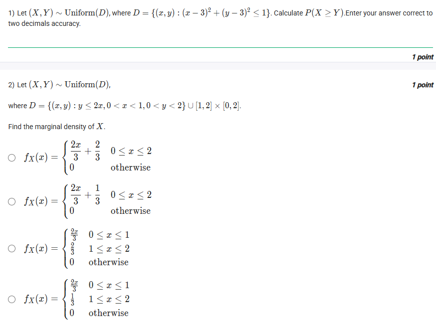
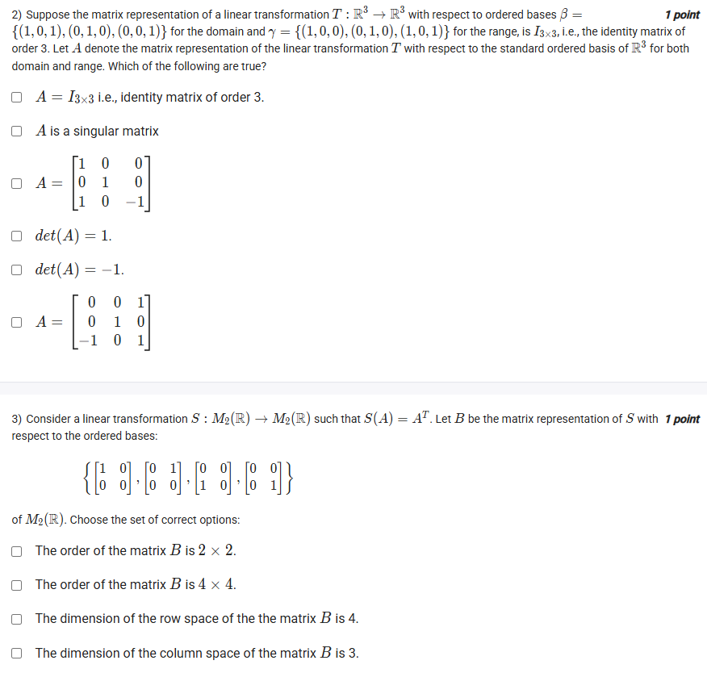
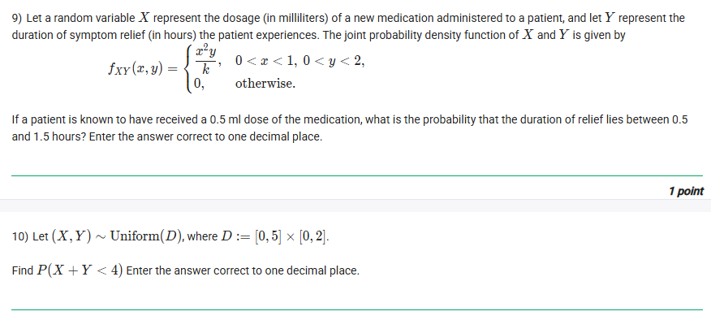
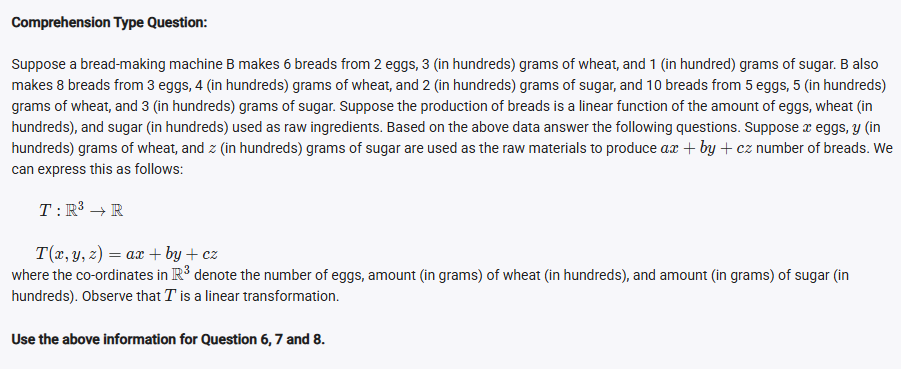
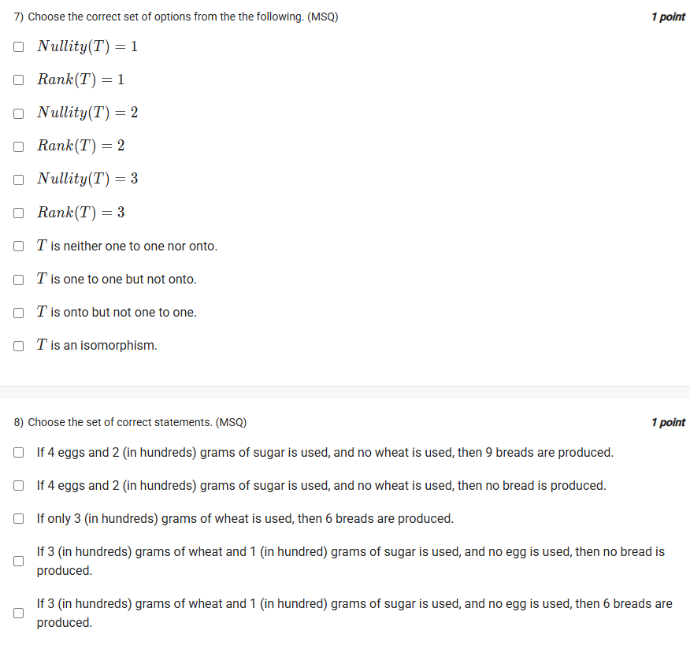
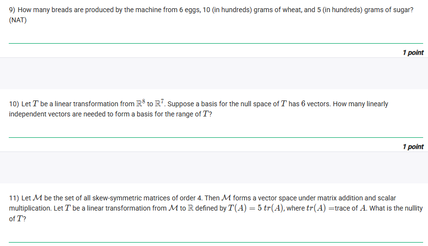

## Exercise Questions ❓

## Exercise Solutions

Here is a detailed breakdown of each question, including the core concepts and step-by-step solutions.



### ❓ Question 1

> 1) A function $T: V \to W$ between two vector spaces $V$ and $W$ is said to be a linear transformation if the following conditions hold:
>
> **Condition 1:** $T(v_1 + v_2) = T(v_1) + T(v_2)$ for all $v_1, v_2 \in V$.
> **Condition 2:** $T(cv) = cT(v)$ for all $v \in V$ and $c \in \mathbb{R}$.
>
> Consider the following function:
> $T: \mathbb{R}^2 \to \mathbb{R}$
> $T(x, y) = \begin{cases} 3x & \text{if } y = 0 \\ 4y & \text{if } y \neq 0 \end{cases}$
>
> Which of the following statements is true?
> * Condition 1 holds.
> * Condition 1 does not hold.
> * Condition 2 holds.
> * Condition 2 does not hold.

---

#### 💡 Concepts Involved

* **Linear Transformation:** A function between vector spaces is linear if it preserves the operations of vector addition (additivity, Condition 1) and scalar multiplication (homogeneity, Condition 2).
* **Proving vs. Disproving:** To *prove* a condition holds, you must show it's true for all possible general cases. To *disprove* a condition, you only need to find *one single* counterexample.

#### ✅ Detailed Solution

Let's test both conditions.

**Testing Condition 1 (Additivity):**
To find a counterexample, we should pick vectors that "cross" the function's piecewise rule (i.e., where one vector has $y=0$ and the other has $y \neq 0$).

* Let $v_1 = (1, 0)$. Here, $y=0$, so $T(v_1) = T(1, 0) = 3(1) = 3$.
* Let $v_2 = (0, 1)$. Here, $y \neq 0$, so $T(v_2) = T(0, 1) = 4(1) = 4$.
* Now, let's find the sum of their outputs:
    $T(v_1) + T(v_2) = 3 + 4 = 7$.

* Next, let's add the vectors *first* and then apply the transformation:
    $v_1 + v_2 = (1, 0) + (0, 1) = (1, 1)$.
* For the vector $(1, 1)$, $y \neq 0$, so we use the second rule:
    $T(v_1 + v_2) = T(1, 1) = 4(1) = 4$.

* **Comparison:** We see that $T(v_1 + v_2) = 4$ but $T(v_1) + T(v_2) = 7$.
* Since $4 \neq 7$, Condition 1 is violated.
* **Conclusion: Condition 1 does not hold.**

**Testing Condition 2 (Homogeneity):**
We must check $T(cv) = cT(v)$ for all cases. Let $v = (x, y)$.

* **Case 1: $y = 0$**
    * $v = (x, 0)$.
    * LHS: $T(cv) = T(c(x, 0)) = T(cx, 0)$. Since the y-coordinate is 0, $T(cx, 0) = 3(cx) = 3cx$.
    * RHS: $cT(v) = cT(x, 0) = c(3x) = 3cx$.
    * LHS = RHS. The condition holds for this case.

* **Case 2: $y \neq 0$**
    * $v = (x, y)$.
    * RHS: $cT(v) = cT(x, y) = c(4y) = 4cy$.
    * LHS: $T(cv) = T(c(x, y)) = T(cx, cy)$.
        * **Subcase 2a: $c \neq 0$.** If $c \neq 0$, then $cy \neq 0$. So we use the second rule: $T(cx, cy) = 4(cy) = 4cy$. This matches the RHS.
        * **Subcase 2b: $c = 0$.** If $c = 0$, then $cy = 0$. So we must use the *first* rule: $T(cx, cy) = T(0, 0) = 3(0) = 0$. The RHS is $cT(v) = 0 \cdot (4y) = 0$. This also matches the RHS.

* Since the condition $T(cv) = cT(v)$ holds for all possible cases, Condition 2 is satisfied.
* **Conclusion: Condition 2 holds.**

**Final Answer:** The correct statements are **"Condition 1 does not hold"** and **"Condition 2 holds"**.





### ❓ Question 2

> 2) Suppose the matrix representation of a linear transformation $T: \mathbb{R}^3 \to \mathbb{R}^3$ with respect to ordered bases $\beta = \{(1, 0, 1), (0, 1, 0), (0, 0, 1)\}$ for the domain and $\gamma = \{(1, 0, 0), (0, 1, 0), (0, 0, 1)\}$ for the range, is $I_{3 \times 3}$. Let $A$ denote the matrix representation of $T$ with respect to the standard ordered basis ($E$) of $\mathbb{R}^3$ for both domain and range. Which of the following are true?
> * $A = I_{3 \times 3}$
> * $A$ is a singular matrix
> * $A = \begin{bmatrix} 1 & 0 & 0 \\ 0 & 1 & 0 \\ 1 & 0 & -1 \end{bmatrix}$
> * $\det(A) = 1$
> * $\det(A) = -1$
> * $A = \begin{bmatrix} 0 & 0 & 1 \\ 0 & 1 & 0 \\ -1 & 0 & 1 \end{bmatrix}$

---

#### 💡 Concepts Involved

* **Matrix Representation:** A matrix $[T]_{\beta}^{\gamma}$ describes how $T$ transforms basis vectors from $\beta$ into coordinates of $\gamma$.
* **Standard Basis:** The standard basis for $\mathbb{R}^3$ is $E = \{e_1, e_2, e_3\} = \{(1, 0, 0), (0, 1, 0), (0, 0, 1)\}$.
* **Change of Basis:** The easiest way to solve this is often to use the definition directly, rather than complex change-of-basis formulas.

#### ✅ Detailed Solution

1.  **Understand the Given Information:**
    * The basis for the domain is $\beta = \{v_1, v_2, v_3\} = \{(1, 0, 1), (0, 1, 0), (0, 0, 1)\}$.
    * The basis for the range is $\gamma = \{(1, 0, 0), (0, 1, 0), (0, 0, 1)\}$. Notice that $\gamma$ is just the standard basis $E$.
    * The matrix representation is $[T]_{\beta}^{\gamma} = I = \begin{bmatrix} 1 & 0 & 0 \\ 0 & 1 & 0 \\ 0 & 0 & 1 \end{bmatrix}$.

2.  **Interpret the Matrix:**
    The columns of $[T]_{\beta}^{\gamma}$ tell us what $T$ does to the $\beta$ vectors, expressed in $\gamma$ coordinates.
    * Column 1: $T(v_1) = 1\gamma_1 + 0\gamma_2 + 0\gamma_3 = \gamma_1 = (1, 0, 0)$.
    * Column 2: $T(v_2) = 0\gamma_1 + 1\gamma_2 + 0\gamma_3 = \gamma_2 = (0, 1, 0)$.
    * Column 3: $T(v_3) = 0\gamma_1 + 0\gamma_2 + 1\gamma_3 = \gamma_3 = (0, 0, 1)$.

    So, we know the action of $T$ on the $\beta$ basis vectors:
    * $T(1, 0, 1) = (1, 0, 0)$
    * $T(0, 1, 0) = (0, 1, 0)$
    * $T(0, 0, 1) = (0, 0, 1)$

3.  **Find the Standard Matrix A:**
    We want to find $A = [T]_{E}^{E}$. The columns of $A$ are $T(e_1)$, $T(e_2)$, and $T(e_3)$.
    * $e_1 = (1, 0, 0)$
    * $e_2 = (0, 1, 0)$
    * $e_3 = (0, 0, 1)$

    * **Column 2:** We already know $T(e_2) = T(0, 1, 0) = (0, 1, 0)$.
    * **Column 3:** We already know $T(e_3) = T(0, 0, 1) = (0, 0, 1)$.
    * **Column 1:** We need to find $T(e_1) = T(1, 0, 0)$. We can express $e_1$ using the $\beta$ basis vectors.
        * Notice that $v_1 = (1, 0, 1) = (1, 0, 0) + (0, 0, 1) = e_1 + e_3$.
        * Therefore, $e_1 = v_1 - e_3$.
        * Since $T$ is a linear transformation, we can write:
            $T(e_1) = T(v_1 - e_3) = T(v_1) - T(e_3)$
        * Substitute the values we know:
            $T(e_1) = (1, 0, 0) - (0, 0, 1) = (1, 0, -1)$.

4.  **Assemble the Matrix A:**
    * Column 1: $T(e_1) = (1, 0, -1)$
    * Column 2: $T(e_2) = (0, 1, 0)$
    * Column 3: $T(e_3) = (0, 0, 1)$
    $A = \begin{bmatrix} 1 & 0 & 0 \\ 0 & 1 & 0 \\ -1 & 0 & 1 \end{bmatrix}$

5.  **Check the Options:**
    * $A = I_{3 \times 3}$? **False.**
    * $A$ is singular? Let's find the determinant. $\det(A) = 1(1 \cdot 1 - 0 \cdot 0) - 0 + 0 = 1$. Since $\det(A) \neq 0$, $A$ is non-singular. **False.**
    * $A = \begin{bmatrix} 1 & 0 & 0 \\ 0 & 1 & 0 \\ 1 & 0 & -1 \end{bmatrix}$? **False.** (Sign error).
    * $\det(A) = 1$? **True.**
    * $\det(A) = -1$? **False.**
    * $A = \begin{bmatrix} 0 & 0 & 1 \\ 0 & 1 & 0 \\ -1 & 0 & 1 \end{bmatrix}$? **False.**

**Final Answer:** The only true statement is **$\det(A) = 1$**.





### ❓ Question 3

> 3) Consider a linear transformation $S: M_2(\mathbb{R}) \to M_2(\mathbb{R})$ such that $S(A) = A^T$. Let $B$ be the matrix representation of $S$ with respect to the ordered bases:
> $\{ \begin{bmatrix} 1 & 0 \\ 0 & 0 \end{bmatrix}, \begin{bmatrix} 0 & 1 \\ 0 & 0 \end{bmatrix}, \begin{bmatrix} 0 & 0 \\ 1 & 0 \end{bmatrix}, \begin{bmatrix} 0 & 0 \\ 0 & 1 \end{bmatrix} \}$ of $M_2(\mathbb{R})$.
> Choose the set of correct options:
> * The order of the matrix $B$ is $2 \times 2$.
> * The order of the matrix $B$ is $4 \times 4$.
> * The dimension of the row space of the matrix $B$ is 4.
> * The dimension of the column space of the matrix $B$ is 3.
> * The nullity of the matrix $B$ is 1.
> * The rank of the matrix $B$ is 4.
> * $S$ is surjective.

---

#### 💡 Concepts Involved

* **Vector Space of Matrices:** $M_2(\mathbb{R})$ is the vector space of all $2 \times 2$ matrices. The standard basis is given in the problem.
* **Dimension:** The dimension of $M_2(\mathbb{R})$ is 4, as it takes 4 independent numbers to define a $2 \times 2$ matrix.
* **Matrix Representation:** Since the domain and codomain are 4-dimensional, the matrix $B$ representing the transformation $S$ must be $4 \times 4$.
* **Rank-Nullity Theorem:** For a transformation $T: V \to W$, $\text{rank}(T) + \text{nullity}(T) = \text{dim}(V)$. The rank is the dimension of the image (row space/column space), and the nullity is the dimension of the kernel.
* **Surjective:** A transformation is surjective (onto) if its rank equals the dimension of the *codomain*.

#### ✅ Detailed Solution

1.  **Determine the Order of B:**
    * The vector space is $M_2(\mathbb{R})$, which has dimension 4.
    * The transformation $S$ maps from a 4-dimensional space to a 4-dimensional space.
    * Therefore, its matrix representation $B$ must be $4 \times 4$.
    * ✅ **"The order of the matrix B is $4 \times 4$"** is **True**.
    * ❌ **"The order of the matrix B is $2 \times 2$"** is **False**.

2.  **Find the Matrix B:**
    Let the basis be $\beta = \{v_1, v_2, v_3, v_4\}$, where:
    * $v_1 = \begin{bmatrix} 1 & 0 \\ 0 & 0 \end{bmatrix}$
    * $v_2 = \begin{bmatrix} 0 & 1 \\ 0 & 0 \end{bmatrix}$
    * $v_3 = \begin{bmatrix} 0 & 0 \\ 1 & 0 \end{bmatrix}$
    * $v_4 = \begin{bmatrix} 0 & 0 \\ 0 & 1 \end{bmatrix}$

    We find the columns of $B$ by applying $S(A) = A^T$ to each basis vector:
    * **Col 1:** $S(v_1) = S\left(\begin{bmatrix} 1 & 0 \\ 0 & 0 \end{bmatrix}\right) = \begin{bmatrix} 1 & 0 \\ 0 & 0 \end{bmatrix}^T = \begin{bmatrix} 1 & 0 \\ 0 & 0 \end{bmatrix} = \mathbf{1}v_1 + \mathbf{0}v_2 + \mathbf{0}v_3 + \mathbf{0}v_4 \implies \text{Col 1} = (1, 0, 0, 0)^T$
    * **Col 2:** $S(v_2) = S\left(\begin{bmatrix} 0 & 1 \\ 0 & 0 \end{bmatrix}\right) = \begin{bmatrix} 0 & 1 \\ 0 & 0 \end{bmatrix}^T = \begin{bmatrix} 0 & 0 \\ 1 & 0 \end{bmatrix} = \mathbf{0}v_1 + \mathbf{0}v_2 + \mathbf{1}v_3 + \mathbf{0}v_4 \implies \text{Col 2} = (0, 0, 1, 0)^T$
    * **Col 3:** $S(v_3) = S\left(\begin{bmatrix} 0 & 0 \\ 1 & 0 \end{bmatrix}\right) = \begin{bmatrix} 0 & 0 \\ 1 & 0 \end{bmatrix}^T = \begin{bmatrix} 0 & 1 \\ 0 & 0 \end{bmatrix} = \mathbf{0}v_1 + \mathbf{1}v_2 + \mathbf{0}v_3 + \mathbf{0}v_4 \implies \text{Col 3} = (0, 1, 0, 0)^T$
    * **Col 4:** $S(v_4) = S\left(\begin{bmatrix} 0 & 0 \\ 0 & 1 \end{bmatrix}\right) = \begin{bmatrix} 0 & 0 \\ 0 & 1 \end{bmatrix}^T = \begin{bmatrix} 0 & 0 \\ 0 & 1 \end{bmatrix} = \mathbf{0}v_1 + \mathbf{0}v_2 + \mathbf{0}v_3 + \mathbf{1}v_4 \implies \text{Col 4} = (0, 0, 0, 1)^T$

    So, $B = \begin{bmatrix} 1 & 0 & 0 & 0 \\ 0 & 0 & 1 & 0 \\ 0 & 1 & 0 & 0 \\ 0 & 0 & 0 & 1 \end{bmatrix}$.

3.  **Analyze Matrix B and Transformation S:**
    * **Rank:** The columns of $B$ are the standard basis vectors for $\mathbb{R}^4$ (just reordered). They are clearly linearly independent. Therefore, the rank is 4.
        * The **rank** is the dimension of the column space and the row space.
        * ✅ **"The dimension of the row space ... is 4"** is **True**.
        * ✅ **"The rank of the matrix B is 4"** is **True**.
        * ❌ **"The dimension of the column space ... is 3"** is **False**.
    * **Nullity:** By the Rank-Nullity Theorem: $\text{rank}(B) + \text{nullity}(B) = \text{dim}(\text{domain}) = 4$.
        * $4 + \text{nullity}(B) = 4 \implies \text{nullity}(B) = 0$.
        * ❌ **"The nullity of the matrix B is 1"** is **False**.
    * **Surjectivity:** $S$ is surjective if $\text{rank}(S) = \text{dim}(\text{codomain})$.
        * $\text{rank}(S) = \text{rank}(B) = 4$.
        * $\text{dim}(M_2(\mathbb{R})) = 4$.
        * Since $4 = 4$, the transformation $S$ is surjective.
        * ✅ **"$S$ is surjective"** is **True**.

**Final Answer:** The correct options are:
* **The order of the matrix $B$ is $4 \times 4$.**
* **The dimension of the row space of the matrix $B$ is 4.**
* **The rank of the matrix $B$ is 4.**
* **$S$ is surjective.**





### ❓ Question 4

> 4) Let $T: \mathbb{R}^n \to \mathbb{R}^m$ be a linear transformation and let $\{v_1, v_2, \dots, v_n\}$ be a basis of $\mathbb{R}^n$. Suppose $\{T(v_1), T(v_2), \dots, T(v_n)\}$ is a spanning set for $\mathbb{R}^m$. Choose all the correct statements.
> * $T$ is a surjective linear transformation.
> * $T$ is a linear isomorphism.
> * $m \le n$.
> * For any basis $\{w_1, w_2, \dots, w_n\}$ of $\mathbb{R}^n$, the set $\{T(w_1), T(w_2), \dots, T(w_n)\}$ is a spanning set for $\mathbb{R}^m$.
> * The matrix of the linear transformation $T$ has rank equal to $n$.

---

#### 💡 Concepts Involved

* **Image (Range):** The image of $T$, denoted $\text{Im}(T)$, is the set of all possible outputs of $T$. $\text{Im}(T)$ is *always* spanned by the image of a basis of the domain. So, $\text{Im}(T) = \text{span}\{T(v_1), \dots, T(v_n)\}$.
* **Surjective (Onto):** $T$ is surjective if its image equals its codomain. $\text{Im}(T) = \mathbb{R}^m$.
* **Rank:** $\text{rank}(T) = \text{dim}(\text{Im}(T))$.
* **Spanning Set Property:** A set of $k$ vectors can only span a space of dimension *at most* $k$.

#### ✅ Detailed Solution

1.  **Analyze the Given Statement:**
    * We are *given* that $\text{span}\{T(v_1), \dots, T(v_n)\} = \mathbb{R}^m$.
    * From the concept above, we also know $\text{Im}(T) = \text{span}\{T(v_1), \dots, T(v_n)\}$.
    * Therefore, $\text{Im}(T) = \mathbb{R}^m$.

2.  **Check the Options:**
    * **"$T$ is a surjective linear transformation."**
        * This is the *definition* of surjective: the image equals the codomain.
        * **True.**
    * **"$T$ is a linear isomorphism."**
        * An isomorphism must be surjective *and* injective (one-to-one).
        * $T$ is injective if $\text{nullity}(T) = 0$.
        * We know $\text{rank}(T) = \text{dim}(\text{Im}(T)) = \text{dim}(\mathbb{R}^m) = m$.
        * By Rank-Nullity: $m + \text{nullity}(T) = n$.
        * So, $\text{nullity}(T) = n - m$. This is only 0 if $n=m$.
        * If $T: \mathbb{R}^3 \to \mathbb{R}^2$ (e.g., $T(x,y,z)=(x,y)$), $n=3, m=2$. $T$ is surjective, but $\text{nullity} = 3-2=1$, so it's not injective.
        * Therefore, $T$ is not necessarily an isomorphism. **False.**
    * **"$m \le n$."**
        * We have a set of $n$ vectors $\{T(v_1), \dots, T(v_n)\}$ that spans $\mathbb{R}^m$.
        * The dimension of $\mathbb{R}^m$ is $m$.
        * A fundamental theorem of linear algebra states that to span a space of dimension $m$, you need *at least* $m$ vectors.
        * Since our spanning set has $n$ vectors, $n$ must be greater than or equal to $m$.
        * **True.**
    * **"For any basis $\{w_1, \dots, w_n\}$ of $\mathbb{R}^n$, the set $\{T(w_1), \dots, T(w_n)\}$ is a spanning set for $\mathbb{R}^m$."**
        * The image of *any* basis of the domain spans the image of $T$.
        * $\text{span}\{T(w_1), \dots, T(w_n)\} = \text{Im}(T)$.
        * We have already established from the problem's premise that $\text{Im}(T) = \mathbb{R}^m$.
        * Therefore, $\text{span}\{T(w_1), \dots, T(w_n)\} = \mathbb{R}^m$.
        * **True.**
    * **"The matrix of the linear transformation $T$ has rank equal to $n$."**
        * The rank of $T$ is $\text{dim}(\text{Im}(T))$.
        * We found that $\text{Im}(T) = \mathbb{R}^m$, so $\text{rank}(T) = \text{dim}(\mathbb{R}^m) = m$.
        * The rank is $m$, not $n$ (unless $m=n$). **False.**

**Final Answer:** The correct statements are:
* **$T$ is a surjective linear transformation.**
* **$m \le n$.**
* **For any basis $\{w_1, w_2, \dots, w_n\}$ of $\mathbb{R}^n$, the set $\{T(w_1), T(w_2), \dots, T(w_n)\}$ is a spanning set for $\mathbb{R}^m$.**





### ❓ Question 5

> 5) Consider the following statements:
> **Statement 1:** Consider a linear transformation $T: \mathbb{R}^3 \to \mathbb{R}^4$ such that $T$ is not injective. Then $\text{rank}(T) < 3$.
> **Statement 2:** if $T: V \to W$ is... (matrix given)... where $\alpha, \beta, \gamma \in \mathbb{R} \setminus \{0\}$, then the rank of $T$ is 3.
> **Statement 3:** If $T: \mathbb{R}^3 \to \mathbb{R}^4$ ... $T(x, y, z) = (2x - z, 3y - 2z, z, 0)$, then $\{(-3, 1, 1, 0), (1, -5, 1, 0), (3, 5, -1, 0)\}$ is a basis of the image space.
> **Statement 4:** If $T: M_2(\mathbb{R}) \to M_2(\mathbb{R})$ ... $T(A) = PA$, where $P = \begin{bmatrix} -1 & 1 \\ 1 & -1 \end{bmatrix}$, then $\{...\}$ is a basis of the kernel.
>
> Write down the statement numbers corresponding to the correct statements in increasing order.

---

#### 💡 Concepts Involved

* **Rank-Nullity Theorem:** $\text{rank}(T) + \text{nullity}(T) = \text{dim}(\text{domain})$.
* **Injective:** $T$ is injective $\iff \text{Kernel}(T) = \{0\} \iff \text{nullity}(T) = 0$.
* **Rank of a Matrix:** The number of linearly independent columns (or rows).
* **Basis of Image Space:** A set of vectors $S$ is a basis for $\text{Im}(T)$ if:
    1.  Every vector in $S$ is in $\text{Im}(T)$.
    2.  $S$ is linearly independent.
    3.  $\text{dim}(\text{span}(S)) = \text{rank}(T)$.
* **Kernel (Null Space):** The set of all input vectors $v$ such that $T(v) = 0$.

#### ✅ Detailed Solution

* **Statement 1: True**
    * $T: \mathbb{R}^3 \to \mathbb{R}^4$. $\text{dim}(\text{domain}) = 3$.
    * By Rank-Nullity: $\text{rank}(T) + \text{nullity}(T) = 3$.
    * $T$ is **not injective**, which means $\text{nullity}(T) > 0$.
    * Since nullity must be an integer, $\text{nullity}(T) \ge 1$.
    * $\text{rank}(T) = 3 - \text{nullity}(T)$.
    * Since $\text{nullity}(T) \ge 1$, it follows that $\text{rank}(T) \le 3 - 1 = 2$.
    * If $\text{rank}(T) \le 2$, then $\text{rank}(T) < 3$. The statement is **True**.

* **Statement 2: True**
    * We need the rank of $M = \begin{bmatrix} 0 & \alpha & \gamma \\ 1 & 0 & \gamma \\ 0 & \beta & 0 \\ 0 & \beta & \alpha^2 \end{bmatrix}$. We are given $\alpha, \beta, \gamma \neq 0$.
    * Let's check if the columns $c_1, c_2, c_3$ are linearly independent. Set $k_1 c_1 + k_2 c_2 + k_3 c_3 = 0$:
        1.  $\alpha k_2 + \gamma k_3 = 0$
        2.  $k_1 + \gamma k_3 = 0$
        3.  $\beta k_2 = 0$
        4.  $\beta k_2 + \alpha^2 k_3 = 0$
    * From (3), since $\beta \neq 0$, we must have $k_2 = 0$.
    * Substitute $k_2=0$ into (1): $\alpha(0) + \gamma k_3 = 0 \implies \gamma k_3 = 0$. Since $\gamma \neq 0$, $k_3 = 0$.
    * Substitute $k_3=0$ into (2): $k_1 + \gamma(0) = 0 \implies k_1 = 0$.
    * The only solution is $k_1=k_2=k_3=0$. The three columns are linearly independent.
    * The rank of the matrix is 3. The statement is **True**.

* **Statement 3: True**
    * $T(x, y, z) = (2x - z, 3y - 2z, z, 0)$.
    * First, find a basis for the image. The image is spanned by the columns of the standard matrix:
        * $T(1,0,0) = (2, 0, 0, 0)$
        * $T(0,1,0) = (0, 3, 0, 0)$
        * $T(0,0,1) = (-1, -2, 1, 0)$
    * These three vectors are clearly linearly independent (they form an echelon matrix). Thus, $\text{rank}(T) = 3$.
    * The problem gives a set of 3 vectors and claims it's a basis. Since we know the dimension is 3, we just need to check if they are (1) in the image and (2) linearly independent.
    * (1) All three vectors $(..., ..., ..., 0)$ are in the correct form. A quick check (or trust) shows they are combinations of the basis we found. E.g., $(-3, 1, 1, 0) = -T(e_1) + T(e_2) + T(e_3)$. All three vectors are in the image.
    * (2) Are they linearly independent? Let's check the determinant of the matrix formed by their non-zero components:
        $\det \begin{bmatrix} -3 & 1 & 3 \\ 1 & -5 & 5 \\ 1 & 1 & -1 \end{bmatrix} = -3(5-5) - 1(-1-5) + 3(1 - (-5)) = -3(0) - 1(-6) + 3(6) = 0 + 6 + 18 = 24$.
    * Since the determinant is $24 \neq 0$, the vectors are linearly independent.
    * We have 3 linearly independent vectors in a 3-dimensional image space. They form a basis. The statement is **True**.

* **Statement 4: False**
    * $T(A) = PA = 0$. We need to find the kernel.
    * Let $A = \begin{bmatrix} a & b \\ c & d \end{bmatrix}$.
    * $PA = \begin{bmatrix} -1 & 1 \\ 1 & -1 \end{bmatrix} \begin{bmatrix} a & b \\ c & d \end{bmatrix} = \begin{bmatrix} -a+c & -b+d \\ a-c & b-d \end{bmatrix} = \begin{bmatrix} 0 & 0 \\ 0 & 0 \end{bmatrix}$
    * This gives the conditions $c = a$ and $d = b$.
    * So, any matrix $A$ in the kernel looks like $A = \begin{bmatrix} a & b \\ a & b \end{bmatrix}$.
    * A basis for this kernel is $A = a\begin{bmatrix} 1 & 0 \\ 1 & 0 \end{bmatrix} + b\begin{bmatrix} 0 & 1 \\ 0 & 1 \end{bmatrix}$.
    * A basis is $\{ \begin{bmatrix} 1 & 0 \\ 1 & 0 \end{bmatrix}, \begin{bmatrix} 0 & 1 \\ 0 & 1 \end{bmatrix} \}$.
    * The dimension of the kernel (nullity) is 2.
    * The statement provides a set of *three* vectors. A basis for a 2-dimensional space cannot have three vectors.
    * The statement is **False**.

**Final Answer:** Statements 1, 2, and 3 are correct. In increasing order, the answer is **123**.





### ❓ Question 6

> 6) Let $T: \mathbb{R}^3 \to \mathbb{R}^2$ be a linear transformation. The matrix of the linear transformation $T$ with respect to the standard bases for the domain and codomain is given by $\begin{bmatrix} 12 & k & -9 \\ 8 & -2 & 2k \end{bmatrix}$ where $k \in \mathbb{R}$. Find the value of $k$ for which $T$ is a linear transformation which is **not** surjective.

---

#### 💡 Concepts Involved

* **Surjective (Onto):** A transformation $T: \mathbb{R}^3 \to \mathbb{R}^2$ is surjective if its image is all of the codomain $\mathbb{R}^2$.
* **Rank:** $T$ is surjective if $\text{rank}(T) = \text{dim}(\mathbb{R}^2) = 2$.
* **Not Surjective:** The question asks for $T$ to be *not* surjective. This means $\text{rank}(T) < 2$.
* **Rank of a Matrix:** The rank of the matrix $A = \begin{bmatrix} 12 & k & -9 \\ 8 & -2 & 2k \end{bmatrix}$ must be less than 2. Since the matrix is not all zeros, the rank must be 1.
* **Rank 1 Condition:** A matrix has rank 1 if and only if all its rows are scalar multiples of each other.

#### ✅ Detailed Solution

1.  For $T$ to be *not* surjective, the rank of its matrix $A$ must be less than 2.
    $A = \begin{bmatrix} 12 & k & -9 \\ 8 & -2 & 2k \end{bmatrix}$
2.  For $\text{rank}(A) < 2$ (i.e., $\text{rank}(A)=1$), the two rows must be linearly dependent.
    This means Row 1 is a scalar multiple of Row 2.
    $R_1 = c \cdot R_2$
    $(12, k, -9) = c \cdot (8, -2, 2k)$

3.  This gives a system of three equations:
    1.  $12 = c \cdot 8$
    2.  $k = c \cdot (-2)$
    3.  $-9 = c \cdot (2k)$

4.  Solve for $c$ and $k$:
    * From (1): $c = 12/8 = 3/2$.
    * Substitute $c = 3/2$ into (2):
        $k = (3/2) \cdot (-2) \implies$ **$k = -3$**

5.  **Verify** this value of $k$ using equation (3):
    * LHS: $-9$
    * RHS: $c \cdot (2k) = (3/2) \cdot (2 \cdot -3) = (3/2) \cdot (-6) = -18/2 = -9$.
    * LHS = RHS. The value $k = -3$ is correct.

When $k = -3$, the matrix becomes $\begin{bmatrix} 12 & -3 & -9 \\ 8 & -2 & -6 \end{bmatrix}$.
You can see that Row 1 is $\frac{3}{2}$ times Row 2. Since the rows are dependent, the rank is 1.
If the rank is 1, the image is a 1-dimensional line, which is not the entire 2-dimensional codomain $\mathbb{R}^2$. Thus, $T$ is not surjective.

**Final Answer:** The value of $k$ is **-3**.



Here is a detailed breakdown of each question from the images you provided.



### ❓ Comprehension (Questions 7, 8, and 9)

> **Comprehension Type Question:**
> Suppose a bread-making machine B makes 6 breads from 2 eggs, 3 (in hundreds) grams of wheat, and 1 (in hundred) grams of sugar. B also makes 8 breads from 3 eggs, 4 (in hundreds) grams of wheat, and 2 (in hundreds) grams of sugar, and 10 breads from 5 eggs, 5 (in hundreds) grams of wheat, and 3 (in hundreds) grams of sugar. Suppose the production of breads is a linear function of the amount of eggs, wheat (in hundreds), and sugar (in hundreds) used as raw ingredients.
>
> We can express this as follows:
> $T: \mathbb{R}^3 \to \mathbb{R}$
> $T(x, y, z) = ax + by + cz$
> where the co-ordinates in $\mathbb{R}^3$ denote the number of eggs, amount (in grams) of wheat (in hundreds), and amount (in grams) of sugar (in hundreds) used...

---

#### 💡 Concepts Involved

* **Linear Transformation:** The problem states the output (breads) is a linear function $T(x, y, z) = ax + by + cz$ of the inputs (eggs, wheat, sugar).
* **System of Linear Equations:** We can use the given data points to create a system of equations to solve for the unknown constants $a$, $b$, and $c$.

#### Solution for $T(x, y, z)$

First, let's find the specific formula for $T$ by solving for $a$, $b$, and $c$.

* **Variables:**
    * $x$ = number of eggs
    * $y$ = wheat (in hundreds of grams)
    * $z$ = sugar (in hundreds of grams)
* **Data Points:**
    1.  $T(2, 3, 1) = 6 \implies 2a + 3b + c = 6$
    2.  $T(3, 4, 2) = 8 \implies 3a + 4b + 2c = 8$
    3.  $T(5, 5, 3) = 10 \implies 5a + 5b + 3c = 10$

* **Solving the System:**
    Let's use elimination.
    * Subtract (Eq 1) from (Eq 2):
        $(3a + 4b + 2c) - (2a + 3b + c) = 8 - 6$
        $\implies a + b + c = 2$  (Eq 4)
    * Subtract (Eq 2) from (Eq 3):
        $(5a + 5b + 3c) - (3a + 4b + 2c) = 10 - 8$
        $\implies 2a + b + c = 2$ (Eq 5)
    * Now subtract (Eq 4) from (Eq 5):
        $(2a + b + c) - (a + b + c) = 2 - 2$
        $\implies a = 0$
    * Substitute $a = 0$ into (Eq 4):
        $0 + b + c = 2 \implies c = 2 - b$
    * Substitute $a = 0$ and $c = 2 - b$ into the original (Eq 1):
        $2(0) + 3b + (2 - b) = 6$
        $2b + 2 = 6$
        $2b = 4 \implies$ **$b = 2$**
    * Find $c$:
        $c = 2 - b = 2 - 2 \implies$ **$c = 0$**

The solution is $a = 0, b = 2, c = 0$.
Therefore, the linear transformation is: **$T(x, y, z) = 2y$**

This means the number of breads produced is simply **twice the amount (in hundreds of grams) of wheat used**. The eggs and sugar have no effect.

---

### ❓ Question 7

> 7) Choose the correct set of options from the the following. (MSQ)
> * $Nullity(T) = 1$
> * $Rank(T) = 1$
> * $Nullity(T) = 2$
> * $Rank(T) = 2$
> * $Nullity(T) = 3$
> * $Rank(T) = 3$
> * $T$ is neither one to one nor onto.
> * $T$ is one to one but not onto.
> * $T$ is onto but not one to one.
> * $T$ is an isomorphism.

---

#### 💡 Concepts Involved

* **Rank:** The dimension of the image (range) of $T$. The image is the set of all possible outputs.
* **Nullity:** The dimension of the null space (kernel) of $T$. The null space is the set of all inputs $(x, y, z)$ that result in an output of 0.
* **Rank-Nullity Theorem:** $\text{rank}(T) + \text{nullity}(T) = \text{dim}(\text{domain})$.
* **One-to-one (Injective):** $T$ is one-to-one if $\text{nullity}(T) = 0$.
* **Onto (Surjective):** $T$ is onto if $\text{rank}(T) = \text{dim}(\text{codomain})$.

#### ✅ Detailed Solution

We use the formula $T(x, y, z) = 2y$, with $T: \mathbb{R}^3 \to \mathbb{R}$.

1.  **Rank:** The image is the set of all possible values of $2y$. Since $y$ can be any real number, $2y$ can also be any real number. The image is $\mathbb{R}$.
    * $\text{dim}(\text{Image}) = \text{dim}(\mathbb{R}) = 1$.
    * **$\text{Rank}(T) = 1$**.

2.  **Nullity:** The null space is the set of inputs $(x, y, z)$ where $T(x, y, z) = 0$.
    * $2y = 0 \implies y = 0$.
    * The null space consists of all vectors of the form $(x, 0, z)$, where $x$ and $z$ can be any real numbers.
    * A basis for this space is $\{(1, 0, 0), (0, 0, 1)\}$.
    * The dimension of this space is 2.
    * **$\text{Nullity}(T) = 2$**.
    * *(Check: $\text{Rank} + \text{Nullity} = 1 + 2 = 3 = \text{dim}(\mathbb{R}^3)$. It's correct.)*

3.  **Properties:**
    * **One-to-one?** $\text{Nullity}(T) = 2$, which is not 0. So, $T$ is **not one-to-one**. (For example, $T(1,0,0) = 0$ and $T(5,0,3) = 0$).
    * **Onto?** $\text{Rank}(T) = 1$. The codomain is $\mathbb{R}$, and $\text{dim}(\mathbb{R}) = 1$. Since $\text{Rank} = \text{dim}(\text{codomain})$, $T$ is **onto**.
    * **Conclusion:** $T$ is onto but not one-to-one.

**Final Answer:** The correct options are:
* **$\text{Rank}(T) = 1$**
* **$\text{Nullity}(T) = 2$**
* **$T$ is onto but not one to one.**

---

### ❓ Question 8

> 8) Choose the set of correct statements. (MSQ)
> * If 4 eggs and 2 (in hundreds) grams of sugar is used, and no wheat is used, then 9 breads are produced.
> * If 4 eggs and 2 (in hundreds) grams of sugar is used, and no wheat is used, then no bread is produced.
> * If only 3 (in hundreds) grams of wheat is used, then 6 breads are produced.
> * If 3 (in hundreds) grams of wheat and 1 (in hundred) grams of sugar is used, and no egg is used, then no bread is produced.
> * If 3 (in hundreds) grams of wheat and 1 (in hundred) grams of sugar is used, and no egg is used, then 6 breads are produced.

---

#### ✅ Detailed Solution

We test each statement using our formula $T(x, y, z) = 2y$ (Breads = $2 \times$ wheat).

* **Statement 1:** Input is $x=4, z=2, y=0$.
    * $T(4, 0, 2) = 2(0) = 0$ breads.
    * The statement says 9 breads. **False.**
* **Statement 2:** Input is $x=4, z=2, y=0$.
    * $T(4, 0, 2) = 2(0) = 0$ breads.
    * The statement says 0 breads. **True.**
* **Statement 3:** Input is $y=3, x=0, z=0$.
    * $T(0, 3, 0) = 2(3) = 6$ breads.
    * The statement says 6 breads. **True.**
* **Statement 4:** Input is $y=3, z=1, x=0$.
    * $T(0, 3, 1) = 2(3) = 6$ breads.
    * The statement says 0 breads. **False.**
* **Statement 5:** Input is $y=3, z=1, x=0$.
    * $T(0, 3, 1) = 2(3) = 6$ breads.
    * The statement says 6 breads. **True.**

**Final Answer:** The correct statements are the 2nd, 3rd, and 5th ones.

---

### ❓ Question 9

> 9) How many breads are produced by the machine from 6 eggs, 10 (in hundreds) grams of wheat, and 5 (in hundreds) grams of sugar? (NAT)

---

#### ✅ Detailed Solution

We need to calculate $T(x, y, z)$ for the input $(6, 10, 5)$.
* $x = 6$ (eggs)
* $y = 10$ (wheat)
* $z = 5$ (sugar)

Using the formula $T(x, y, z) = 2y$:
$T(6, 10, 5) = 2(10) = 20$

**Final Answer:** **20**





### ❓ Question 10

> 10) Let $T$ be a linear transformation from $\mathbb{R}^8$ to $\mathbb{R}^7$. Suppose a basis for the null space of $T$ has 6 vectors. How many linearly independent vectors are needed to form a basis for the range of $T$?

---

#### 💡 Concepts Involved

* **Rank-Nullity Theorem:** For any linear transformation $T: V \to W$, the following relationship holds:
    $\text{rank}(T) + \text{nullity}(T) = \text{dim}(V)$
* **Nullity:** The dimension of the null space (kernel). The problem states a basis for the null space has 6 vectors, so $\text{nullity}(T) = 6$.
* **Rank:** The dimension of the range (image). This is what the question is asking for, as it's the number of linearly independent vectors needed for a basis of the range.
* **Domain:** The domain is $V = \mathbb{R}^8$, so $\text{dim}(V) = 8$.

#### ✅ Detailed Solution

1.  Identify the given values:
    * $\text{dim}(\text{domain}) = \text{dim}(\mathbb{R}^8) = 8$
    * $\text{nullity}(T) = 6$
2.  Apply the Rank-Nullity Theorem:
    $\text{rank}(T) + \text{nullity}(T) = \text{dim}(\text{domain})$
    $\text{rank}(T) + 6 = 8$
3.  Solve for the rank:
    $\text{rank}(T) = 8 - 6 = 2$

The number of linearly independent vectors needed for a basis of the range is the rank.

**Final Answer:** **2**





### ❓ Question 11

> 11) Let $M$ be the set of all skew-symmetric matrices of order 4. Then $M$ forms a vector space under matrix addition and scalar multiplication. Let $T$ be a linear transformation from $M$ to $\mathbb{R}$ defined by $T(A) = 5 \operatorname{tr}(A)$, where $\operatorname{tr}(A) = \text{trace of } A$. What is the nullity of $T$?

---

#### 💡 Concepts Involved

* **Skew-Symmetric Matrix:** A matrix $A$ is skew-symmetric if $A^T = -A$.
* **Trace ($\operatorname{tr}$):** The trace of a matrix is the sum of its diagonal elements.
* **Property of Skew-Symmetric Matrices:** For any skew-symmetric matrix, all of its diagonal elements must be 0. (Because $a_{ii} = -a_{ii} \implies 2a_{ii} = 0 \implies a_{ii} = 0$).
* **Nullity:** The dimension of the kernel (null space) of $T$. The kernel is the set of all inputs $A$ such that $T(A) = 0$.
* **Dimension of $M$:** The dimension of the vector space of $n \times n$ skew-symmetric matrices is $\frac{n(n-1)}{2}$.

#### ✅ Detailed Solution

1.  **Analyze the Transformation $T(A)$:**
    * The domain is $M$, the set of all $4 \times 4$ skew-symmetric matrices.
    * Let $A$ be *any* matrix in $M$.
    * By definition of a skew-symmetric matrix, all its diagonal elements are 0.
    * Therefore, the trace of $A$ is $\operatorname{tr}(A) = a_{11} + a_{22} + a_{33} + a_{44} = 0 + 0 + 0 + 0 = 0$.
    * The transformation $T$ is $T(A) = 5 \operatorname{tr}(A) = 5(0) = 0$.
    * This means that $T$ is the **zero transformation**: it maps *every* input matrix $A$ in $M$ to the output 0.

2.  **Find the Nullity:**
    * The nullity is the dimension of the null space (kernel).
    * The kernel is the set of all $A \in M$ such that $T(A) = 0$.
    * Since $T(A) = 0$ for *all* $A \in M$, the kernel is the entire domain $M$.
    * $\text{Kernel}(T) = M$.
    * Therefore, $\text{nullity}(T) = \text{dim}(\text{Kernel}(T)) = \text{dim}(M)$.

3.  **Calculate $\text{dim}(M)$:**
    * $M$ is the space of $4 \times 4$ skew-symmetric matrices, so $n = 4$.
    * $\text{dim}(M) = \frac{n(n-1)}{2} = \frac{4(4-1)}{2} = \frac{4 \times 3}{2} = \frac{12}{2} = 6$.

4.  **Conclusion:**
    * $\text{nullity}(T) = \text{dim}(M) = 6$.

**Final Answer:** **6**





### ❓ Question 12

> 12) Let $T: \mathbb{R}^3 \to \mathbb{R}^2$ be defined by $T(x, y, z) = (2x + 7y, 4z)$. Choose the correct options about $T$.
> * The matrix of $T$ is $\begin{bmatrix} 2 & 0 \\ 7 & 0 \\ 0 & 4 \end{bmatrix}$.
> * A basis for the range of $T$ is $\{(2, 2)\}$.
> * A basis for the null space of $T$ is $\{(1, -2/7, 0)\}$.
> * A basis for the range of $T$ is $\{(2, 7), (0, 4)\}$.
> * A basis for the null space of $T$ is $\{(1, -2/7, 0), (0, 0, 4)\}$.
> * The matrix of $T$ is $\begin{bmatrix} 2 & 7 & 0 \\ 0 & 0 & 4 \end{bmatrix}$.

---

#### 💡 Concepts Involved

* **Standard Matrix:** For $T: \mathbb{R}^n \to \mathbb{R}^m$, the standard matrix $A$ is an $m \times n$ matrix whose columns are the transformations of the standard basis vectors $e_1, e_2, \dots, e_n$.
* **Range (Image Space):** The span of the columns of the matrix $A$. Its dimension is the rank.
* **Null Space (Kernel):** The set of all input vectors $v$ such that $T(v) = 0$ (or $Av = 0$). Its dimension is the nullity.

#### ✅ Detailed Solution

1.  **Find the Standard Matrix:**
    * The domain is $\mathbb{R}^3$, codomain is $\mathbb{R}^2$. The matrix will be $2 \times 3$.
    * $e_1 = (1, 0, 0) \implies T(1, 0, 0) = (2(1) + 7(0), 4(0)) = (2, 0)$
    * $e_2 = (0, 1, 0) \implies T(0, 1, 0) = (2(0) + 7(1), 4(0)) = (7, 0)$
    * $e_3 = (0, 0, 1) \implies T(0, 0, 1) = (2(0) + 7(0), 4(1)) = (0, 4)$
    * The matrix $A$ is formed by these column vectors:
        $A = \begin{bmatrix} 2 & 7 & 0 \\ 0 & 0 & 4 \end{bmatrix}$
    * This means **"The matrix of $T$ is $\begin{bmatrix} 2 & 7 & 0 \\ 0 & 0 & 4 \end{bmatrix}$" is True.**
    * And **"The matrix of $T$ is $\begin{bmatrix} 2 & 0 \\ 7 & 0 \\ 0 & 4 \end{bmatrix}$" is False.**

2.  **Find the Range (Image Space):**
    * The range is the span of the columns: $\text{span}\{(2, 0), (7, 0), (0, 4)\}$.
    * Notice $(7, 0)$ is just $3.5 \times (2, 0)$, so it's redundant.
    * $\text{Range} = \text{span}\{(2, 0), (0, 4)\}$.
    * These two vectors are linearly independent and span all of $\mathbb{R}^2$. So, $\text{Rank}(T) = 2$.
    * Any set of 2 linearly independent vectors in $\mathbb{R}^2$ is a basis for the range.
    * **Option: "A basis for the range of $T$ is $\{(2, 2)\}$."** **False.** This set only has one vector; the dimension is 2.
    * **Option: "A basis for the range of $T$ is $\{(2, 7), (0, 4)\}$."** This set contains two vectors. Are they linearly independent? Yes (one is not a multiple of the other). Since the range is $\mathbb{R}^2$ (dim 2), any 2 independent vectors form a basis. **True.**

3.  **Find the Null Space (Kernel):**
    * We need to solve $T(x, y, z) = (0, 0)$.
    * $(2x + 7y, 4z) = (0, 0)$
    * This gives two equations:
        1.  $4z = 0 \implies z = 0$
        2.  $2x + 7y = 0 \implies 2x = -7y \implies x = -7/2 y$
    * A vector in the null space has the form $(x, y, z) = (-7/2 y, y, 0)$.
    * We can factor out $y$: $y(-7/2, 1, 0)$.
    * A basis for the null space is $\{(-7/2, 1, 0)\}$. The nullity is 1.
    * **Option: "A basis for the null space of $T$ is $\{(1, -2/7, 0)\}$."**
        * Let's check if this vector is a multiple of our basis vector.
        * Is $c(-7/2, 1, 0) = (1, -2/7, 0)$?
        * From the second component: $c \cdot 1 = -2/7 \implies c = -2/7$.
        * Check first component: $c \cdot (-7/2) = (-2/7) \cdot (-7/2) = 1$. (It matches).
        * Since this is a non-zero scalar multiple of our basis vector, it is also a valid basis. **True.**
    * **Option: "A basis for the null space of $T$ is $\{(1, -2/7, 0), (0, 0, 4)\}$."** **False.** The nullity is 1, so the basis can only have one vector. Also, $T(0, 0, 4) = (0, 16) \neq (0, 0)$.

**Final Answer:** The correct options are:
* **A basis for the null space of $T$ is $\{(1, -2/7, 0)\}$.**
* **A basis for the range of $T$ is $\{(2, 7), (0, 4)\}$.**
* **The matrix of $T$ is $\begin{bmatrix} 2 & 7 & 0 \\ 0 & 0 & 4 \end{bmatrix}$.**

