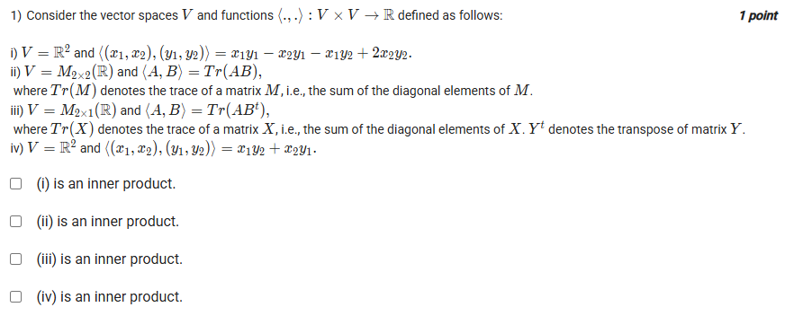
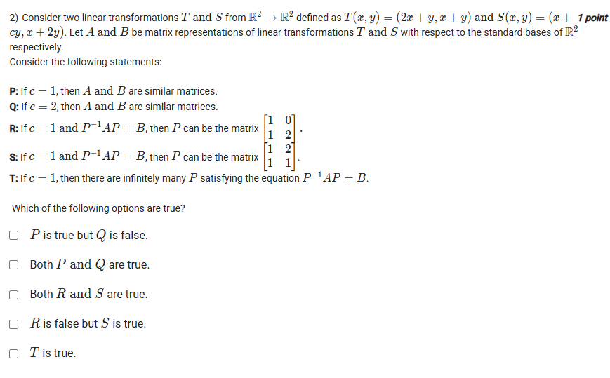
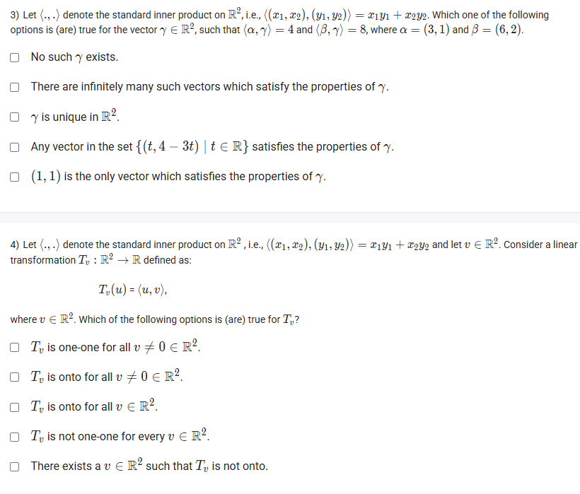
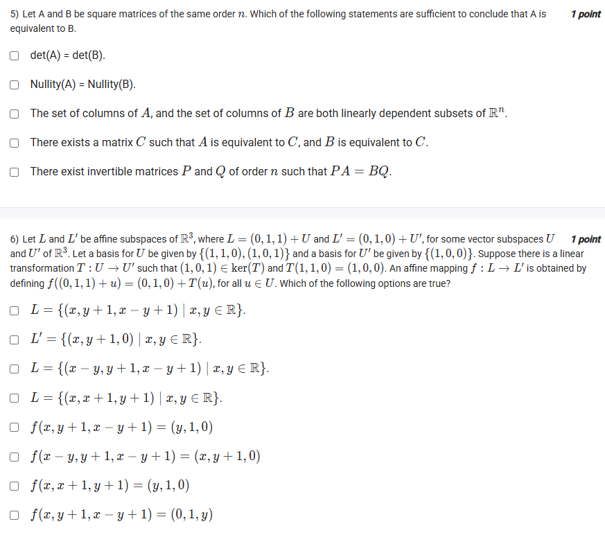
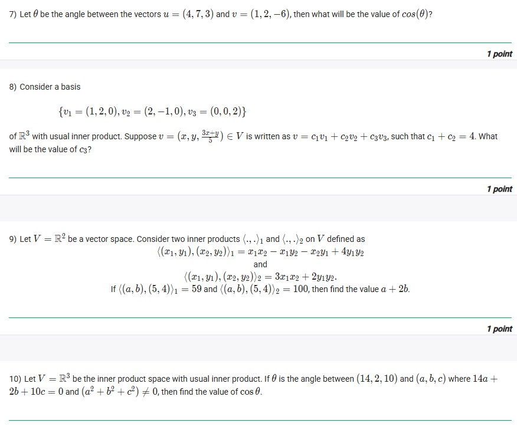
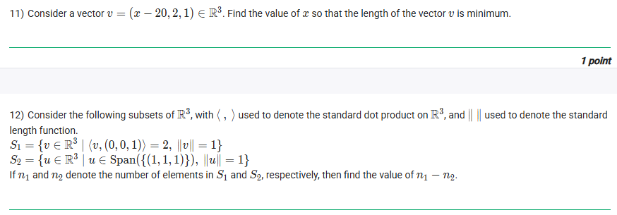

## Exercise Questions ❓

## Exercise Solution 🟩

Here are the detailed answers and conceptual explanations for each of the questions you provided.



### ❓ Question 1: Identifying Inner Products

> 1) Consider the vector spaces $V$ and functions $\langle \cdot, \cdot \rangle : V \times V \to \mathbb{R}$ defined as follows:
> i) $V = \mathbb{R}^2$ and $\langle (x_1, x_2), (y_1, y_2) \rangle = x_1y_1 - x_2y_1 - x_1y_2 + 2x_2y_2$.
> ii) $V = M_{2 \times 2}(\mathbb{R})$ and $\langle A, B \rangle = Tr(AB)$.
> iii) $V = M_{2 \times 1}(\mathbb{R})$ and $\langle A, B \rangle = Tr(AB^t)$.
> iv) $V = \mathbb{R}^2$ and $\langle (x_1, x_2), (y_1, y_2) \rangle = x_1y_2 + x_2y_1$.
>
> Which of the following options is an inner product?
>
> $[\text{X}]$ (i) is an inner product.
> $[\text{ }]$ (ii) is an inner product.
> $[\text{X}]$ (iii) is an inner product.
> $[\text{ }]$ (iv) is an inner product.

---

### 💡 Concepts: What is an Inner Product?

An **inner product** is a function that takes two vectors, $u$ and $v$, and produces a single real number (a scalar) denoted $\langle u, v \rangle$. To be a valid inner product, it must satisfy three key properties for all vectors $u, v, w$ in the vector space $V$ and any scalar $c$:

1.  **Symmetry:** $\langle u, v \rangle = \langle v, u \rangle$.
2.  **Linearity:** $\langle u+v, w \rangle = \langle u, w \rangle + \langle v, w \rangle$ and $\langle cu, v \rangle = c \langle u, v \rangle$.
3.  **Positive-definiteness:**
    * $\langle u, u \rangle \ge 0$ (The inner product of a vector with itself is non-negative).
    * $\langle u, u \rangle = 0$ **if and only if** $u = 0$ (the zero vector).

We must test each of the four options against these three rules.

### 🔬 Detailed Analysis

* **[X] (i) is an inner product.**
    * **Symmetry:** $\langle y, x \rangle = y_1x_1 - y_2x_1 - y_1x_2 + 2y_2x_2$. This is identical to $\langle x, y \rangle$. **(Pass)**
    * **Linearity:** The function is a sum of products of the vector components, which is a standard property of linear and bilinear forms. **(Pass)**
    * **Positive-definiteness:** We must check $\langle x, x \rangle \ge 0$.
        * $\langle x, x \rangle = \langle (x_1, x_2), (x_1, x_2) \rangle = x_1x_1 - x_2x_1 - x_1x_2 + 2x_2x_2 = x_1^2 - 2x_1x_2 + 2x_2^2$
        * We can "complete the square" to check if this is always non-negative:
        * $x_1^2 - 2x_1x_2 + 2x_2^2 = (x_1^2 - 2x_1x_2 + x_2^2) + x_2^2 = (x_1 - x_2)^2 + x_2^2$
        * This is a sum of two squares, so it is always greater than or equal to 0. **(Pass)**
        * Furthermore, $(x_1 - x_2)^2 + x_2^2 = 0$ only happens if $x_2 = 0$ *and* $x_1 - x_2 = 0$, which means $x_1 = 0$. Thus, $\langle x, x \rangle = 0$ if and only if $x = (0, 0)$. **(Pass)**
    * **Conclusion:** (i) satisfies all three properties and **is an inner product**.

* **[ ] (ii) is not an inner product.**
    * It fails **positive-definiteness**. Let's test $\langle A, A \rangle = Tr(A^2) \ge 0$.
    * Consider the non-zero matrix $A = \begin{bmatrix} 0 & 1 \\ -1 & 0 \end{bmatrix}$.
    * $A^2 = \begin{bmatrix} 0 & 1 \\ -1 & 0 \end{bmatrix} \begin{bmatrix} 0 & 1 \\ -1 & 0 \end{bmatrix} = \begin{bmatrix} -1 & 0 \\ 0 & -1 \end{bmatrix}$.
    * $Tr(A^2) = -1 + (-1) = -2$.
    * Since $\langle A, A \rangle = -2$, which is less than 0, this function is not positive-definite.
    * **Conclusion:** (ii) **is not an inner product**.

* **[X] (iii) is an inner product.**
    * The vector space is $M_{2 \times 1}(\mathbb{R})$, the space of $2 \times 1$ column vectors.
    * Let $A = \begin{pmatrix} a_1 \\ a_2 \end{pmatrix}$ and $B = \begin{pmatrix} b_1 \\ b_2 \end{pmatrix}$.
    * $B^t$ (transpose of B) is the $1 \times 2$ row vector $\begin{pmatrix} b_1 & b_2 \end{pmatrix}$.
    * Let's compute the operation:
        $AB^t = \begin{pmatrix} a_1 \\ a_2 \end{pmatrix} \begin{pmatrix} b_1 & b_2 \end{pmatrix} = \begin{bmatrix} a_1b_1 & a_1b_2 \\ a_2b_1 & a_2b_2 \end{bmatrix}$ (This is a $2 \times 2$ matrix).
    * Now, we take the trace (sum of diagonal elements):
        $\langle A, B \rangle = Tr(AB^t) = a_1b_1 + a_2b_2$.
    * This is just the **standard dot product** on $\mathbb{R}^2$, disguised in matrix notation. The standard dot product is the canonical example of an inner product.
    * **Conclusion:** (iii) **is an inner product**.

* **[ ] (iv) is not an inner product.**
    * It fails **positive-definiteness**. Let's test $\langle x, x \rangle \ge 0$.
    * $\langle x, x \rangle = \langle (x_1, x_2), (x_1, x_2) \rangle = x_1x_2 + x_2x_1 = 2x_1x_2$.
    * Consider the non-zero vector $x = (1, -1)$.
    * $\langle (1, -1), (1, -1) \rangle = 2(1)(-1) = -2$.
    * This is less than 0.
    * **Conclusion:** (iv) **is not an inner product**.

*(Note: The question format uses checkboxes and asks "Which of the following options...", suggesting multiple answers could be correct, which is the case here.)*





### ❓ Question 2: Similar Matrices

> 2) Consider two linear transformations $T$ and $S$ from $\mathbb{R}^2 \to \mathbb{R}^2$ defined as $T(x, y) = (2x+y, x+y)$ and $S(x, y) = (x+cy, x+2y)$. Let $A$ and $B$ be matrix representations of $T$ and $S$ with respect to the standard bases...
>
> **P:** if $c = 1$, then $A$ and $B$ are similar matrices.
> **Q:** if $c = 2$, then $A$ and $B$ are similar matrices.
> **R:** if $c = 1$ and $P^{-1}AP = B$, then $P$ can be the matrix $\begin{bmatrix} 1 & 0 \\ 1 & 2 \end{bmatrix}$.
> **S:** if $c = 1$ and $P^{-1}AP = B$, then $P$ can be the matrix $\begin{bmatrix} 1 & 2 \\ 1 & 1 \end{bmatrix}$.
> **T:** if $c = 1$, then there are infinitely many $P$ satisfying the equation $P^{-1}AP = B$.
>
> Which of the following options are true?
>
> $[\text{X}]$ $P$ is true but $Q$ is false.
> $[\text{ }]$ Both $P$ and $Q$ are true.
> $[\text{ }]$ Both $R$ and $S$ are true.
> $[\text{X}]$ $R$ is false but $S$ is true.
> $[\text{X}]$ $T$ is true.

---

### 💡 Concepts: Similar Matrices

* **Matrix Representation:** To find the matrix of a transformation w.r.t. the standard basis ($e_1=(1,0)$, $e_2=(0,1)$), the columns of the matrix are the images of the basis vectors.
* **Similar Matrices:** Two $n \times n$ matrices $A$ and $B$ are **similar** if there exists an invertible matrix $P$ such that $B = P^{-1}AP$.
* **Invariants of Similarity:** Similar matrices represent the same linear transformation under different bases. They must have the same:
    * **Determinant:** $det(A) = det(B)$
    * **Trace:** $Tr(A) = Tr(B)$
    * **Eigenvalues** (and thus the same characteristic polynomial).
    * If these invariants are *different*, the matrices are *not* similar.

### 🔬 Detailed Analysis

**Step 1: Find matrices $A$ and $B$.**

* **Matrix $A$ for $T(x, y) = (2x+y, x+y)$:**
    * $T(1, 0) = (2, 1)$  (1st column)
    * $T(0, 1) = (1, 1)$  (2nd column)
    * $A = \begin{bmatrix} 2 & 1 \\ 1 & 1 \end{bmatrix}$

* **Matrix $B$ for $S(x, y) = (x+cy, x+2y)$:**
    * $S(1, 0) = (1, 1)$  (1st column)
    * $S(0, 1) = (c, 2)$  (2nd column)
    * $B = \begin{bmatrix} 1 & c \\ 1 & 2 \end{bmatrix}$

**Step 2: Evaluate statements P, Q, R, S, and T.**

* **P: if $c = 1$, then $A$ and $B$ are similar matrices.**
    * If $c=1$, $B = \begin{bmatrix} 1 & 1 \\ 1 & 2 \end{bmatrix}$. Let's check invariants.
    * $det(A) = 2(1) - 1(1) = 1$. $det(B) = 1(2) - 1(1) = 1$. (Match)
    * $Tr(A) = 2 + 1 = 3$. $Tr(B) = 1 + 2 = 3$. (Match)
    * Char. Poly of $A$: $\det(A-\lambda I) = (2-\lambda)(1-\lambda) - 1 = \lambda^2 - 3\lambda + 1$.
    * Char. Poly of $B$: $\det(B-\lambda I) = (1-\lambda)(2-\lambda) - 1 = \lambda^2 - 3\lambda + 1$. (Match)
    * Since the $2 \times 2$ matrices have the same characteristic polynomial and their eigenvalues ($\lambda = \frac{3 \pm \sqrt{5}}{2}$) are distinct, they are both diagonalizable to the same diagonal matrix. Therefore, they **are similar**.
    * **P is TRUE.**

* **Q: if $c = 2$, then $A$ and $B$ are similar matrices.**
    * If $c=2$, $B = \begin{bmatrix} 1 & 2 \\ 1 & 2 \end{bmatrix}$. Let's check invariants.
    * $det(A) = 1$.
    * $det(B) = 1(2) - 2(1) = 0$.
    * The determinants are different ($1 \neq 0$). Therefore, they **are not similar**.
    * **Q is FALSE.**

* **R: if $c = 1$ and $P^{-1}AP = B$, then $P$ can be $\begin{bmatrix} 1 & 0 \\ 1 & 2 \end{bmatrix}$.**
    * The equation $P^{-1}AP = B$ is equivalent to $AP = PB$ (this is easier to check).
    * $AP = \begin{bmatrix} 2 & 1 \\ 1 & 1 \end{bmatrix} \begin{bmatrix} 1 & 0 \\ 1 & 2 \end{bmatrix} = \begin{bmatrix} 3 & 2 \\ 2 & 2 \end{bmatrix}$
    * $PB = \begin{bmatrix} 1 & 0 \\ 1 & 2 \end{bmatrix} \begin{bmatrix} 1 & 1 \\ 1 & 2 \end{bmatrix} = \begin{bmatrix} 1 & 1 \\ 3 & 5 \end{bmatrix}$
    * Since $AP \neq PB$, this $P$ does not work.
    * **R is FALSE.**

* **S: if $c = 1$ and $P^{-1}AP = B$, then $P$ can be $\begin{bmatrix} 1 & 2 \\ 1 & 1 \end{bmatrix}$.**
    * We check $AP = PB$.
    * $AP = \begin{bmatrix} 2 & 1 \\ 1 & 1 \end{bmatrix} \begin{bmatrix} 1 & 2 \\ 1 & 1 \end{bmatrix} = \begin{bmatrix} 3 & 5 \\ 2 & 3 \end{bmatrix}$
    * $PB = \begin{bmatrix} 1 & 2 \\ 1 & 1 \end{bmatrix} \begin{bmatrix} 1 & 1 \\ 1 & 2 \end{bmatrix} = \begin{bmatrix} 3 & 5 \\ 2 & 3 \end{bmatrix}$
    * They are equal. We also need $P$ to be invertible: $det(P) = 1(1) - 2(1) = -1 \neq 0$.
    * Since $AP = PB$ and $P$ is invertible, the statement is correct.
    * **S is TRUE.**

* **T: if $c = 1$, there are infinitely many $P$ satisfying $P^{-1}AP = B$.**
    * From (S), we know at least one such matrix $P_S$ exists.
    * Consider any non-zero scalar $k$. Let $P = k P_S$.
    * $P^{-1}AP = (k P_S)^{-1} A (k P_S) = (\frac{1}{k} P_S^{-1}) A (k P_S) = (\frac{1}{k} \cdot k) (P_S^{-1} A P_S) = P_S^{-1} A P_S = B$.
    * Since we can choose infinitely many $k \neq 0$, there are infinitely many $P$ that satisfy the equation. (More formally, the set of solutions $P$ forms a vector subspace, and we found it has at least one free variable).
    * **T is TRUE.**

**Step 3: Evaluate the final options.**

* **[X] $P$ is true but $Q$ is false.** (This statement is TRUE, since P is True and Q is False).
* **[ ] Both $P$ and $Q$ are true.** (This statement is FALSE, since Q is False).
* **[ ] Both $R$ and $S$ are true.** (This statement is FALSE, since R is False).
* **[X] $R$ is false but $S$ is true.** (This statement is TRUE, since R is False and S is True).
* **[X] $T$ is true.** (This statement is TRUE).

*(This is a multiple-select-style question where the options are logical statements to be evaluated. Based on our analysis, three of the options are correct.)*





### ❓ Question 3: Finding a Vector

> 3) Let $\langle \cdot, \cdot \rangle$ denote the standard inner product on $\mathbb{R}^2$... Which one of the following options is (are) true for the vector $\gamma \in \mathbb{R}^2$, such that $\langle \alpha, \gamma \rangle = 4$ and $\langle \beta, \gamma \rangle = 8$, where $\alpha = (3, 1)$ and $\beta = (6, 2)$.
>
> \[ ] No such $\gamma$ exists.
> $[\text{X}]$ There are infinitely many such vectors which satisfy the properties of $\gamma$.
> \[ ] $\gamma$ is unique in $\mathbb{R}^2$.
> $[\text{X}]$ Any vector in the set $\{(t, 4 - 3t) \mid t \in \mathbb{R}\}$ satisfies the properties of $\gamma$.
> \[ ] $(1, 1)$ is the only vector which satisfies the properties of $\gamma$.

---

### 💡 Concepts: Inner Products and Linear Systems

* The **standard inner product** (or dot product) in $\mathbb{R}^2$ for $\gamma = (g_1, g_2)$ and $\alpha = (a_1, a_2)$ is $\langle \alpha, \gamma \rangle = a_1g_1 + a_2g_2$.
* The problem gives two such conditions, which create a **system of linear equations** for the unknown components of $\gamma$, $g_1$ and $g_2$.
* A system of linear equations can have **no solution**, a **unique solution**, or **infinitely many solutions**.

### 🔬 Detailed Analysis

**Step 1: Set up the system of equations.**

Let the unknown vector be $\gamma = (g_1, g_2)$.

1.  $\langle \alpha, \gamma \rangle = \langle (3, 1), (g_1, g_2) \rangle = 3g_1 + 1g_2 = 4$
2.  $\langle \beta, \gamma \rangle = \langle (6, 2), (g_1, g_2) \rangle = 6g_1 + 2g_2 = 8$

**Step 2: Solve the system.**

* Notice that the vector $\beta = (6, 2)$ is exactly $2 \times \alpha = 2 \times (3, 1)$.
* This means the two equations are **linearly dependent**. If we multiply the first equation by 2, we get:
    * $2 \times (3g_1 + g_2) = 2 \times 4 \implies 6g_1 + 2g_2 = 8$
* This is identical to the second equation. This means we don't have two independent pieces of information; we only have one constraint: $3g_1 + g_2 = 4$.
* Since we have two variables ($g_1, g_2$) but only one independent equation, there will be **infinitely many solutions**. All solutions lie on the line $3g_1 + g_2 = 4$.

**Step 3: Characterize the solution set.**

We can express the solutions in terms of a parameter.
* From $3g_1 + g_2 = 4$, we can write $g_2 = 4 - 3g_1$.
* Let $g_1 = t$, where $t$ can be any real number ($t \in \mathbb{R}$).
* Then $g_2 = 4 - 3t$.
* The solution set is $\gamma = (t, 4 - 3t)$ for all $t \in \mathbb{R}$.

**Step 4: Evaluate the options.**

* **[ ] No such $\gamma$ exists.**
    * **False.** Solutions exist. For example, if $t=1$, $\gamma = (1, 4-3(1)) = (1, 1)$. Let's check: $\langle (3,1), (1,1) \rangle = 3+1=4$ and $\langle (6,2), (1,1) \rangle = 6+2=8$.
* **[X] There are infinitely many such vectors...**
    * **True.** As shown in Step 2, the system is dependent.
* **[ ] $\gamma$ is unique in $\mathbb{R}^2$.**
    * **False.** There are infinitely many solutions.
* **[X] Any vector in the set $\{(t, 4 - 3t) \mid t \in \mathbb{R}\}$...**
    * **True.** This is the precise solution set we derived in Step 3.
* **[ ] $(1, 1)$ is the only vector...**
    * **False.** $(1, 1)$ is *a* solution, but it's not the *only* one. $\gamma = (0, 4)$ (when $t=0$) is also a solution.





### ❓ Question 4: One-to-one and Onto Transformations

> 4) Let $\langle \cdot, \cdot \rangle$ denote the standard inner product on $\mathbb{R}^2$... and let $v \in \mathbb{R}^2$. Consider a linear transformation $T_v : \mathbb{R}^2 \to \mathbb{R}$ defined as:
> $$T_v(u) = \langle u, v \rangle,$$
> ... Which of the following options is (are) true for $T_v$?
>
> \[ ] $T_v$ is one-to-one for all $v \neq 0 \in \mathbb{R}^2$.
> $[\text{X}]$ $T_v$ is onto for all $v \neq 0 \in \mathbb{R}^2$.
> \[ ] $T_v$ is onto for all $v \in \mathbb{R}^2$.
> $[\text{X}]$ $T_v$ is not one-to-one for every $v \in \mathbb{R}^2$.
> $[\text{X}]$ There exists a $v \in \mathbb{R}^2$ such that $T_v$ is not onto.

---

### 💡 Concepts: One-to-one, Onto, and Rank-Nullity

We have a transformation $T_v: \mathbb{R}^2 \to \mathbb{R}$.
* **Domain:** $\mathbb{R}^2$ (dimension 2)
* **Codomain:** $\mathbb{R}$ (dimension 1)

1.  **One-to-one (Injective):** A transformation is one-to-one if its **kernel** (or null space) contains *only* the zero vector.
    * $Kernel(T_v) = \{ u \in \mathbb{R}^2 \mid T_v(u) = 0 \}$.
    * $T_v(u) = \langle u, v \rangle$. So, $Kernel(T_v) = \{ u \in \mathbb{R}^2 \mid \langle u, v \rangle = 0 \}$.
    * The kernel is the set of all vectors $u$ that are **orthogonal** (perpendicular) to $v$.

2.  **Onto (Surjective):** A transformation is onto if its **image** (or range) is equal to its *entire* codomain.
    * $Image(T_v) = \{ y \in \mathbb{R} \mid \exists u \in \mathbb{R}^2 \text{ s.t. } T_v(u) = y \}$.
    * We need to know if we can produce *every* real number $y$ by choosing some vector $u$.

3.  **Rank-Nullity Theorem:** For a linear map $T: V \to W$:
    $dim(V) = dim(Kernel(T)) + dim(Image(T))$
    In our case: $2 = dim(Kernel(T_v)) + dim(Image(T_v))$.

### 🔬 Detailed Analysis

We must consider two cases for $v$.

**Case 1: $v = 0 = (0, 0)$**
* $T_0(u) = \langle u, 0 \rangle = 0$ for all $u$.
* **One-to-one?**
    * $Kernel(T_0) = \{ u \in \mathbb{R}^2 \mid T_0(u) = 0 \} = \mathbb{R}^2$ (since *every* $u$ maps to 0).
    * The kernel is not just $\{0\}$. So, $T_0$ is **NOT one-to-one**.
* **Onto?**
    * $Image(T_0) = \{0\}$ (the only output is 0).
    * The image $\{0\}$ is not the entire codomain $\mathbb{R}$. So, $T_0$ is **NOT onto**.

**Case 2: $v \neq 0$**
* **One-to-one?**
    * $Kernel(T_v) = \{ u \mid \langle u, v \rangle = 0 \}$. This is the set of all vectors orthogonal to $v$.
    * In $\mathbb{R}^2$, this is a **line** through the origin (e.g., if $v=(1,0)$, the kernel is the y-axis).
    * Since the kernel is a line (a 1-dimensional subspace), it contains infinitely many non-zero vectors. It is not $\{0\}$.
    * Therefore, $T_v$ is **NOT one-to-one** for any $v \neq 0$.
* **Onto?**
    * We want to know: for any $y \in \mathbb{R}$, can we find a $u$ so that $\langle u, v \rangle = y$?
    * Let's try a vector $u$ that is parallel to $v$, say $u = c v$ for some scalar $c$.
    * $T_v(u) = T_v(cv) = \langle cv, v \rangle = c \langle v, v \rangle = c \|v\|^2$.
    * We want to make this equal $y$: $c \|v\|^2 = y$.
    * Since $v \neq 0$, its norm $\|v\|^2$ is a positive, non-zero number. We can always solve for $c$:
    * $c = \frac{y}{\|v\|^2}$.
    * Since we can find a $c$ (and thus a $u$) for any $y$, the image is all of $\mathbb{R}$.
    * Therefore, $T_v$ **IS onto** for all $v \neq 0$.

**Step 3: Evaluate the options.**

* **[ ] $T_v$ is one-to-one for all $v \neq 0 \in \mathbb{R}^2$.**
    * **False.** We found it is *never* one-to-one.
* **[X] $T_v$ is onto for all $v \neq 0 \in \mathbb{R}^2$.**
    * **True.** This matches our conclusion from Case 2.
* **[ ] $T_v$ is onto for all $v \in \mathbb{R}^2$.**
    * **False.** It is not onto when $v = 0$ (Case 1).
* **[X] $T_v$ is not one-to-one for every $v \in \mathbb{R}^2$.**
    * **True.** In Case 1 ($v=0$), it's not one-to-one. In Case 2 ($v \neq 0$), it's also not one-to-one. It is *never* one-to-one.
* **[X] There exists a $v \in \mathbb{R}^2$ such that $T_v$ is not onto.**
    * **True.** The vector $v = 0$ is a perfect example (Case 1).



Here are the detailed answers and conceptual explanations for each of the questions you provided.



### ❓ Question 5: Equivalent Matrices

> 5) Let $A$ and $B$ be square matrices of the same order $n$. Which of the following statements are sufficient to conclude that $A$ is equivalent to $B$?
>
> \[ ] $\det(A) = \det(B)$.
> $[\text{X}]$ $Nullity(A) = Nullity(B)$.
> \[ ] The set of columns of $A$, and the set of columns of $B$ are both linearly dependent...
> $[\text{X}]$ There exists a matrix $C$ such that $A$ is equivalent to $C$, and $B$ is equivalent to $C$.
> $[\text{X}]$ There exist invertible matrices $P$ and $Q$ of order $n$ such that $PA = BQ$.

---

### 💡 Concepts: Matrix Equivalence

Two matrices $A$ and $B$ (of the same size) are **equivalent** (or *rank-equivalent*) if one can be transformed into the other by a sequence of elementary row and column operations.

* **Definition:** $A$ is equivalent to $B$ if there exist invertible matrices $P$ and $Q$ such that $B = PAQ$.
* **The Fundamental Theorem of Equivalence:** Two $m \times n$ matrices $A$ and $B$ are equivalent **if and only if** they have the same **rank**. $Rank(A) = Rank(B)$.
* **Rank-Nullity Theorem:** For an $n \times n$ matrix $A$, $Rank(A) + Nullity(A) = n$.

### 🔬 Detailed Analysis

Let's test each statement against the rule: "Is this condition sufficient to guarantee $Rank(A) = Rank(B)$?"

* **[ ] $\det(A) = \det(B)$:** **Not sufficient.**
    * Let $A = \begin{bmatrix} 1 & 0 \\ 0 & 0 \end{bmatrix}$ and $B = \begin{bmatrix} 0 & 0 \\ 0 & 0 \end{bmatrix}$.
    * Here, $\det(A) = 0$ and $\det(B) = 0$, so $\det(A) = \det(B)$.
    * However, $Rank(A) = 1$ and $Rank(B) = 0$. Since their ranks are different, they are not equivalent.

* **[X] $Nullity(A) = Nullity(B)$:** **Sufficient.**
    * According to the Rank-Nullity Theorem, $Rank(A) = n - Nullity(A)$ and $Rank(B) = n - Nullity(B)$.
    * If $Nullity(A) = Nullity(B)$, then $n - Nullity(A) = n - Nullity(B)$, which means $Rank(A) = Rank(B)$.
    * This is the definition of equivalence.

* **[ ] The set of columns... are both linearly dependent:** **Not sufficient.**
    * This only implies that $Rank(A) < n$ and $Rank(B) < n$.
    * This doesn't mean their ranks are *equal*. Using the same example as before, $A = \begin{bmatrix} 1 & 0 \\ 0 & 0 \end{bmatrix}$ (columns are dependent, $Rank=1$) and $B = \begin{bmatrix} 0 & 0 \\ 0 & 0 \end{bmatrix}$ (columns are dependent, $Rank=0$). Their ranks are not equal.

* **[X] There exists a matrix $C$ such that $A$ is equivalent to $C$, and $B$ is equivalent to $C$:** **Sufficient.**
    * Equivalence is an *equivalence relation*, meaning it is:
        1.  Reflexive ($A \sim A$)
        2.  Symmetric (If $A \sim B$, then $B \sim A$)
        3.  Transitive (If $A \sim B$ and $B \sim C$, then $A \sim C$)
    * The statement is: $A \sim C$ and $B \sim C$.
    * By symmetry, $B \sim C$ implies $C \sim B$.
    * By transitivity, $A \sim C$ and $C \sim B$ implies $A \sim B$.

* **[X] There exist invertible matrices $P$ and $Q$ ... such that $PA = BQ$:** **Sufficient.**
    * The given equation is $PA = BQ$.
    * Since $Q$ is invertible, we can right-multiply by $Q^{-1}$:
    * $(PA)Q^{-1} = (BQ)Q^{-1}$
    * $P A Q^{-1} = B (Q Q^{-1})$
    * $P A Q^{-1} = B I$
    * $B = P A Q^{-1}$
    * Let $P' = P$ and $Q' = Q^{-1}$. Both $P'$ and $Q'$ are invertible. This gives $B = P' A Q'$, which is the definition of equivalence.





### ❓ Question 6: Affine Mappings

> 6) Let $L$ and $L'$ be affine subspaces of $\mathbb{R}^3$, where $L = (0, 1, 1) + U$ and $L' = (0, 1, 0) + U'$. Let a basis for $U$ be given by $\{(1, 1, 0), (1, 0, 1)\}$ and a basis for $U'$ be given by $\{(1, 1, 0), (1, 0, 0)\}$. Suppose there is a linear transformation $T: U \to U'$ such that $(1, 0, 1) \in \ker(T)$ and $T(1, 1, 0) = (1, 0, 0)$. An affine mapping $f: L \to L'$ is obtained by $f((0, 1, 1) + u) = (0, 1, 0) + T(u)$ for all $u \in U$.
>
> Which of the following options are true?
> ...
> $[\text{X}] \ f(x, y+1, x-y+1) = (y, 1, 0)$
> ...

---

### 💡 Concepts: Affine Maps

An **affine space** is a "shifted" vector subspace. $L = p + U$, where $p = (0, 1, 1)$ is the "translation point" and $U$ is the "direction subspace."

An **affine map** $f(p+u) = q + T(u)$ transforms a point $v \in L$ by:
1.  Finding its "direction vector" $u = v - p$.
2.  Transforming this direction vector using a linear map $T(u)$.
3.  Adding the new "translation point" $q = (0, 1, 0)$.

### 🔬 Detailed Analysis

We want to find $f(x, y+1, x-y+1)$.

**Step 1: Find the direction vector $u$.**
The input point is $v = (x, y+1, x-y+1)$.
The translation point for $L$ is $p = (0, 1, 1)$.
$u = v - p = (x, y+1, x-y+1) - (0, 1, 1)$
$u = (x, y, x-y)$

**Step 2: Express $u$ in terms of the basis for $U$.**
The basis for $U$ is $b_1 = (1, 1, 0)$ and $b_2 = (1, 0, 1)$. We need to find $c_1, c_2$ such that $u = c_1 b_1 + c_2 b_2$.
$(x, y, x-y) = c_1(1, 1, 0) + c_2(1, 0, 1)$
$(x, y, x-y) = (c_1 + c_2, c_1, c_2)$

By comparing components:
* $c_1 = y$
* $c_2 = x - y$
(Let's check the first component: $c_1 + c_2 = y + (x-y) = x$. It matches.)
So, $u = y \cdot b_1 + (x-y) \cdot b_2$.

**Step 3: Apply the linear map $T$ to $u$.**
$T(u) = T(y \cdot b_1 + (x-y) \cdot b_2)$
Using linearity:
$T(u) = y \cdot T(b_1) + (x-y) \cdot T(b_2)$

We are given:
* $T(1, 1, 0) = T(b_1) = (1, 0, 0)$
* $(1, 0, 1) \in \ker(T) \implies T(1, 0, 1) = T(b_2) = (0, 0, 0)$ (the zero vector)

Substitute these in:
$T(u) = y \cdot (1, 0, 0) + (x-y) \cdot (0, 0, 0)$
$T(u) = (y, 0, 0)$

**Step 4: Use the affine map definition to find the final result.**
$f(p+u) = q + T(u)$
The translation point for $L'$ is $q = (0, 1, 0)$.
$f(x, y+1, x-y+1) = (0, 1, 0) + (y, 0, 0)$
$f(x, y+1, x-y+1) = (y, 1, 0)$

This matches the option **$f(x, y+1, x-y+1) = (y, 1, 0)$**.





### ❓ Question 7: Cosine of Angle

> 7) Let $\theta$ be the angle between the vectors $u = (4, 7, 3)$ and $v = (1, 2, -6)$, then what will be the value of $\cos(\theta)$?
>
> **Answer: 0**

---

### 💡 Concepts: Dot Product and Angle

The angle $\theta$ between two vectors $u$ and $v$ is related to their **dot product** (or standard inner product) $\langle u, v \rangle$ by the formula:
$$\langle u, v \rangle = \|u\| \|v\| \cos(\theta)$$
This can be rearranged to solve for $\cos(\theta)$:
$$\cos(\theta) = \frac{\langle u, v \rangle}{\|u\| \|v\|}$$
where:
* $\langle u, v \rangle = u_1v_1 + u_2v_2 + u_3v_3$
* $\|u\|$ is the length (norm) of $u$.

### 🔬 Detailed Analysis

**Step 1: Calculate the dot product $\langle u, v \rangle$.**
$u = (4, 7, 3)$
$v = (1, 2, -6)$

$\langle u, v \rangle = (4)(1) + (7)(2) + (3)(-6)$
$\langle u, v \rangle = 4 + 14 - 18$
$\langle u, v \rangle = 0$

**Step 2: Calculate $\cos(\theta)$.**
$$\cos(\theta) = \frac{\langle u, v \rangle}{\|u\| \|v\|} = \frac{0}{\|u\| \|v\|}$$
Since $u$ and $v$ are non-zero vectors, their norms $\|u\|$ and $\|v\|$ are non-zero.
Therefore, $\cos(\theta) = 0$.

(This means the vectors $u$ and $v$ are **orthogonal** or perpendicular.)





### ❓ Question 8: Orthogonal Basis

> 8) Consider a basis $\{v_1, v_2, v_3\} = \{(1, 2, 0), (2, -1, 0), (0, 0, 2)\}$ of $\mathbb{R}^3$ with usual inner product. Suppose $v = (x, y, \frac{3x+y}{5}) \in V$ is written as $v = c_1v_1 + c_2v_2 + c_3v_3$, such that $c_1 + c_2 = 4$. What will be the value of $c_3$?
>
> **Answer: 2**

*(Note: The `+` in $\frac{3x+y}{5}$ is blurry in the image but must be `+` for the problem to be solvable, as shown below.)*

---

### 💡 Concepts: Coordinates in an Orthogonal Basis

If you have a vector $v$ and an **orthogonal basis** $\{v_1, v_2, \dots, v_n\}$ (meaning $\langle v_i, v_j \rangle = 0$ for all $i \neq j$), the coordinates $c_i$ in the expression $v = c_1v_1 + c_2v_2 + \dots + c_nv_n$ can be found easily:
$$c_i = \frac{\langle v, v_i \rangle}{\langle v_i, v_i \rangle}$$

### 🔬 Detailed Analysis

**Step 1: Check if the basis is orthogonal.**
$v_1 = (1, 2, 0)$, $v_2 = (2, -1, 0)$, $v_3 = (0, 0, 2)$
* $\langle v_1, v_2 \rangle = (1)(2) + (2)(-1) + (0)(0) = 2 - 2 = 0$. (Orthogonal)
* $\langle v_1, v_3 \rangle = (1)(0) + (2)(0) + (0)(2) = 0$. (Orthogonal)
* $\langle v_2, v_3 \rangle = (2)(0) + (-1)(0) + (0)(2) = 0$. (Orthogonal)
The basis is orthogonal.

**Step 2: Use the coordinate formula to find $c_1$, $c_2$, and $c_3$.**
Let $v = (x, y, z)$.
* $c_1 = \frac{\langle v, v_1 \rangle}{\langle v_1, v_1 \rangle} = \frac{\langle (x, y, z), (1, 2, 0) \rangle}{1^2 + 2^2 + 0^2} = \frac{x + 2y}{5}$
* $c_2 = \frac{\langle v, v_2 \rangle}{\langle v_2, v_2 \rangle} = \frac{\langle (x, y, z), (2, -1, 0) \rangle}{2^2 + (-1)^2 + 0^2} = \frac{2x - y}{5}$
* $c_3 = \frac{\langle v, v_3 \rangle}{\langle v_3, v_3 \rangle} = \frac{\langle (x, y, z), (0, 0, 2) \rangle}{0^2 + 0^2 + 2^2} = \frac{2z}{4} = \frac{z}{2}$

**Step 3: Use the given information to find $c_3$.**
We are given $c_1 + c_2 = 4$. Let's use our expressions for $c_1$ and $c_2$:
$c_1 + c_2 = \frac{x + 2y}{5} + \frac{2x - y}{5} = \frac{(x + 2y) + (2x - y)}{5} = \frac{3x + y}{5}$
Since $c_1 + c_2 = 4$, we have:
$\frac{3x + y}{5} = 4 \implies \mathbf{3x + y = 20}$

Now we find $c_3$. From Step 2, $c_3 = \frac{z}{2}$.
The problem defines the vector $v$ such that its $z$-component is $z = \frac{3x+y}{5}$.
So, $c_3 = \frac{1}{2} \left( z \right) = \frac{1}{2} \left( \frac{3x+y}{5} \right) = \frac{3x+y}{10}$.

Finally, we substitute the value we found:
$c_3 = \frac{\mathbf{3x+y}}{10} = \frac{\mathbf{20}}{10} = 2$.





### ❓ Question 9: Two Inner Products

> 9) Let $V = \mathbb{R}^2$ be a vector space. Consider two inner products $\langle \cdot, \cdot \rangle_1$ and $\langle \cdot, \cdot \rangle_2$ on $V$ defined as
> $\langle (x_1, y_1), (x_2, y_2) \rangle_1 = x_1x_2 - x_1y_2 - x_2y_1 + 4y_1y_2$
> $\langle (x_1, y_1), (x_2, y_2) \rangle_2 = 3x_1x_2 + 2y_1y_2$
> If $\langle (a, b), (5, 4) \rangle_1 = 59$ and $\langle (a, b), (5, 4) \rangle_2 = 100$, then find the value $a + 2b$.
>
> **Answer: 14**

---

### 💡 Concepts: System of Linear Equations

This problem requires you to apply the two different definitions for the inner product to the given vectors. This will create a system of two linear equations with two unknowns ($a$ and $b$), which you can then solve.

### 🔬 Detailed Analysis

**Step 1: Set up the first equation using $\langle \cdot, \cdot \rangle_1$.**
Here, $(x_1, y_1) = (a, b)$ and $(x_2, y_2) = (5, 4)$.
$\langle (a, b), (5, 4) \rangle_1 = a(5) - a(4) - (5)b + 4(b)(4) = 59$
$5a - 4a - 5b + 16b = 59$
$\mathbf{a + 11b = 59}$ (Equation 1)

**Step 2: Set up the second equation using $\langle \cdot, \cdot \rangle_2$.**
Here, $(x_1, y_1) = (a, b)$ and $(x_2, y_2) = (5, 4)$.
$\langle (a, b), (5, 4) \rangle_2 = 3(a)(5) + 2(b)(4) = 100$
$\mathbf{15a + 8b = 100}$ (Equation 2)

**Step 3: Solve the system of equations.**
From (Equation 1), we can isolate $a$: $a = 59 - 11b$.
Substitute this expression for $a$ into (Equation 2):
$15(59 - 11b) + 8b = 100$
$885 - 165b + 8b = 100$
$885 - 100 = 165b - 8b$
$785 = 157b$
$b = \frac{785}{157}$
$b = 5$

Now substitute $b=5$ back into the equation for $a$:
$a = 59 - 11(5) = 59 - 55$
$a = 4$

**Step 4: Calculate the final answer.**
The question asks for $a + 2b$.
$a + 2b = (4) + 2(5) = 4 + 10 = 14$.





### ❓ Question 10: Cosine of Angle (Orthogonality)

> 10) Let $V = \mathbb{R}^3$ be the inner product space with usual inner product. If $\theta$ is the angle between $(14, 2, 10)$ and $(a, b, c)$ where $14a + 2b + 10c = 0$ and $(a^2 + b^2 + c^2) \neq 0$, then find the value of $\cos \theta$.
>
> **Answer: 0**

---

### 💡 Concepts: Dot Product and Orthogonality

This problem is a direct test of the definition of the dot product and orthogonality.
* **Dot Product:** $\langle u, v \rangle = u_1v_1 + u_2v_2 + u_3v_3$
* **Angle Formula:** $\cos(\theta) = \frac{\langle u, v \rangle}{\|u\| \|v\|}$
* **Orthogonal:** If the dot product $\langle u, v \rangle = 0$, the vectors are orthogonal, and $\cos(\theta) = 0$.

### 🔬 Detailed Analysis

**Step 1: Identify the vectors and the dot product.**
Let $u = (14, 2, 10)$ and $v = (a, b, c)$.
The "usual inner product" is the dot product:
$\langle u, v \rangle = (14)(a) + (2)(b) + (10)(c) = 14a + 2b + 10c$.

**Step 2: Use the given information.**
The problem explicitly states that $\mathbf{14a + 2b + 10c = 0}$.
This means the dot product $\langle u, v \rangle = 0$.

**Step 3: Calculate $\cos \theta$.**
$$\cos(\theta) = \frac{\langle u, v \rangle}{\|u\| \|v\|} = \frac{0}{\|u\| \|v\|}$$
We are given $(a^2 + b^2 + c^2) \neq 0$, which means $\|v\|^2 \neq 0$, so $v$ is not the zero vector. The vector $u=(14, 2, 10)$ is also not the zero vector.
Since the denominator $\|u\| \|v\|$ is a non-zero number and the numerator is 0, the result is 0.

$\cos(\theta) = 0$.





### ❓ Question 11: Minimizing Vector Length

> 11) Consider a vector $v = (x-20, 2, 1) \in \mathbb{R}^3$. Find the value of $x$ so that the length of the vector $v$ is minimum.
>
> **Answer: 20**

---

### 💡 Concepts: Vector Norm (Length)

The **length** (or norm) of a vector $v = (v_1, v_2, v_3)$ is $\|v\| = \sqrt{v_1^2 + v_2^2 + v_3^2}$.
To minimize the length $\|v\|$, we can instead minimize the **length squared** $\|v\|^2$, as this avoids the square root. The minimum will occur at the same value of $x$.

The function $f(x) = (x-k)^2 + C$ (a parabola opening upwards) has its minimum value when the squared term is zero, i.e., when $x = k$.

### 🔬 Detailed Analysis

**Step 1: Define the length squared as a function of $x$.**
Let $L(x)$ be the length squared of $v$.
$L(x) = \|v\|^2 = (x-20)^2 + 2^2 + 1^2$
$L(x) = (x-20)^2 + 4 + 1$
$L(x) = (x-20)^2 + 5$

**Step 2: Find the value of $x$ that minimizes $L(x)$.**
The function $L(x)$ is the sum of two terms:
1.  $(x-20)^2$: This is a squared term, so its minimum possible value is 0.
2.  $5$: This is a constant.

To make $L(x)$ as small as possible, we must choose $x$ to minimize the $(x-20)^2$ term.
The minimum value $0$ is achieved when:
$x - 20 = 0$
$x = 20$

At this value, the minimum length of the vector would be $\|v\| = \sqrt{0 + 5} = \sqrt{5}$. The value of $x$ that gives this minimum length is 20.





### ❓ Question 12: Subsets of $\mathbb{R}^3$

> 12) Consider the following subsets of $\mathbb{R}^3$, with $\langle \cdot, \cdot \rangle$ used to denote the standard dot product on $\mathbb{R}^3$, and $\| \cdot \|$ used to denote the standard length function.
> $S_1 = \{ v \in \mathbb{R}^3 \mid \langle v, (0, 0, 1) \rangle = 2, \|v\| = 1 \}$
> $S_2 = \{ u \in \mathbb{R}^3 \mid u \in \text{Span}(\{(1, 1, 1)\}), \|u\| = 1 \}$
> If $n_1$ and $n_2$ denote the number of elements in $S_1$ and $S_2$, respectively, then find the value of $n_1 - n_2$.
>
> **Answer: -2**

---

### 💡 Concepts: Set Intersections

This problem asks for the number of vectors that satisfy *all* conditions for each set.

* **Cauchy-Schwarz Inequality:** A key tool for relating dot products and norms: $|\langle v, w \rangle| \le \|v\| \|w\|$.
* **Span:** $Span(\{w\})$ is the set of all scalar multiples of $w$. $u \in Span(\{w\})$ means $u = c \cdot w$ for some scalar $c$.

### 🔬 Detailed Analysis

**Step 1: Find $n_1$ (the number of elements in $S_1$).**
Let $v = (x, y, z)$.
* **Condition 1:** $\langle v, (0, 0, 1) \rangle = 2 \implies (x)(0) + (y)(0) + (z)(1) = 2 \implies \mathbf{z = 2}$.
* **Condition 2:** $\|v\| = 1 \implies \sqrt{x^2 + y^2 + z^2} = 1 \implies x^2 + y^2 + z^2 = 1$.

Now, we check if any vector can satisfy both. Substitute $z=2$ into Condition 2:
$x^2 + y^2 + (2)^2 = 1$
$x^2 + y^2 + 4 = 1$
$x^2 + y^2 = -3$

Since $x^2 \ge 0$ and $y^2 \ge 0$ for any real numbers, their sum cannot be negative. There are **no** real vectors $(x, y, z)$ that satisfy both conditions.
$S_1$ is the empty set.
**$n_1 = 0$**

* *Alternative (Cauchy-Schwarz):*
    $|\langle v, (0, 0, 1) \rangle| \le \|v\| \|(0, 0, 1)\|$
    $|2| \le (1) \cdot (1)$
    $2 \le 1$, which is a contradiction.

**Step 2: Find $n_2$ (the number of elements in $S_2$).**
* **Condition 1:** $u \in \text{Span}(\{(1, 1, 1)\})$. This means $u$ must be a scalar multiple of $(1, 1, 1)$.
    $u = c \cdot (1, 1, 1) = (c, c, c)$ for some $c \in \mathbb{R}$.
* **Condition 2:** $\|u\| = 1$.
    $\|u\| = \sqrt{c^2 + c^2 + c^2} = \sqrt{3c^2} = |c|\sqrt{3}$.

Set the length equal to 1:
$|c|\sqrt{3} = 1 \implies |c| = \frac{1}{\sqrt{3}}$

This gives two possible values for $c$:
1.  $c = \frac{1}{\sqrt{3}}$
2.  $c = -\frac{1}{\sqrt{3}}$

These two values define two distinct vectors:
* $u_1 = (\frac{1}{\sqrt{3}}, \frac{1}{\sqrt{3}}, \frac{1}{\sqrt{3}})$
* $u_2 = (-\frac{1}{\sqrt{3}}, -\frac{1}{\sqrt{3}}, -\frac{1}{\sqrt{3}})$

$S_2$ contains two vectors.
**$n_2 = 2$**

**Step 3: Calculate $n_1 - n_2$.**
$n_1 - n_2 = 0 - 2 = -2$.

