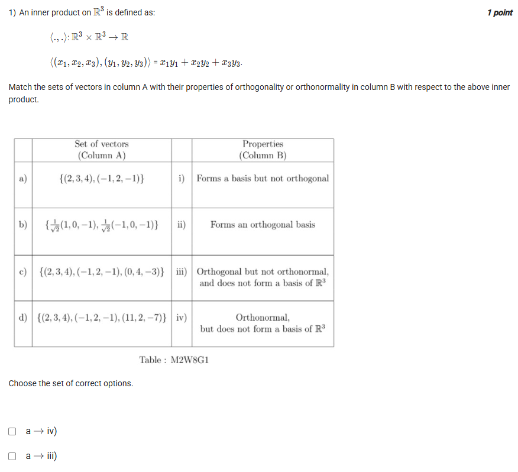
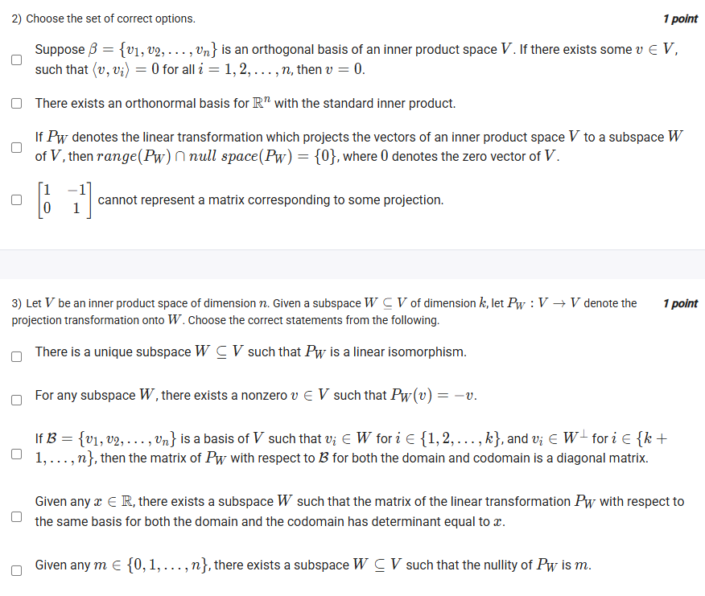
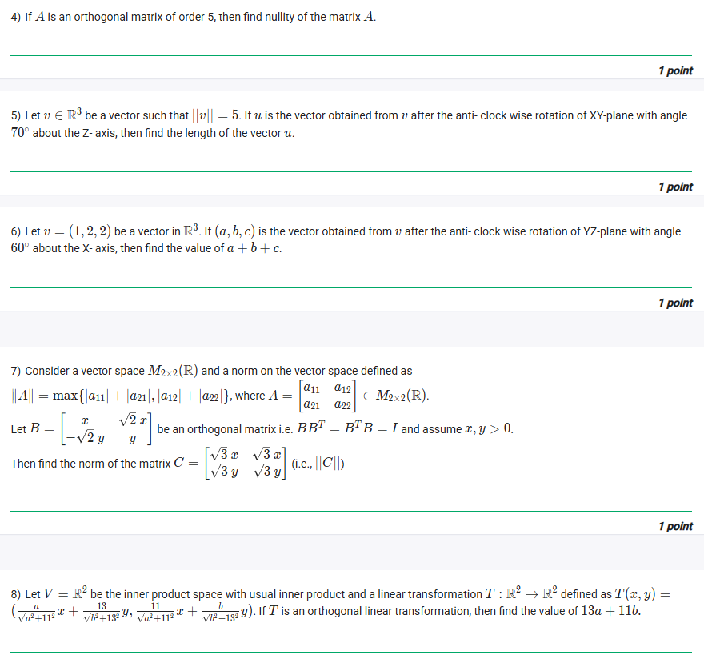
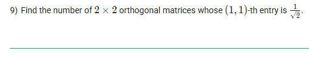
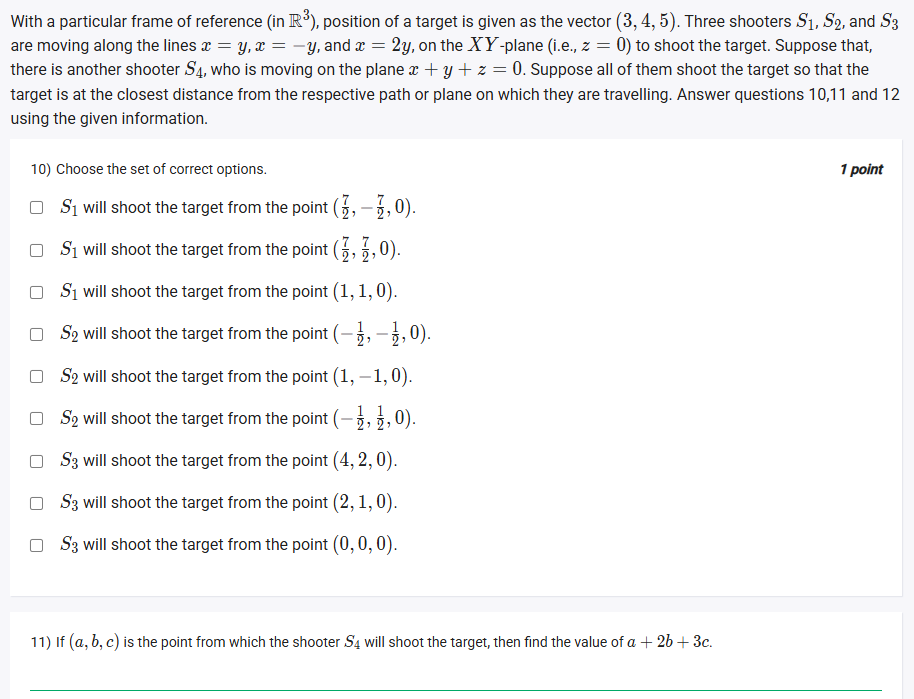

## Exercise Questions ❓

## Exercise Solutions 🟩

Here is a detailed solution and explanation for the matching problem.



## ❓ Problem Analysis

You are asked to match sets of vectors (Column A) with their correct mathematical properties (Column B). The space is $\mathbb{R}^3$ (vectors with 3 components) and the inner product is the standard **dot product**:
$\langle (x_1, x_2, x_3), (y_1, y_2, y_3) \rangle = x_1y_1 + x_2y_2 + x_3y_3$

---

### 🧠 Key Concepts

* **Orthogonal:** A set of vectors is **orthogonal** if the inner product (dot product) of any two *different* vectors in the set is **zero**.
* **Norm (Length):** The norm of a single vector $v = (x_1, x_2, x_3)$ is $\|v\| = \sqrt{\langle v, v \rangle} = \sqrt{x_1^2 + x_2^2 + x_3^2}$.
* **Orthonormal:** A set of vectors is **orthonormal** if it is **orthogonal** AND every vector in the set has a norm (length) of **one**.
* **Basis of $\mathbb{R}^3$:** A basis for $\mathbb{R}^3$ is a set of vectors that are linearly independent and span the entire 3D space.
    * A basis for $\mathbb{R}^3$ **must** contain exactly **3** vectors.
    * Any set with fewer than 3 vectors (like in a & b) **cannot** form a basis.
    * A set of 3 orthogonal (and non-zero) vectors is automatically linearly independent and thus **forms a basis**.

---

### 📝 Step-by-Step Solution

Let's test each set of vectors from Column A against the properties.

#### a) $S_a = \{(2, 3, 4), (-1, 2, -1)\}$
* Let $v_1 = (2, 3, 4)$ and $v_2 = (-1, 2, -1)$.
* **Basis?** No. A basis for $\mathbb{R}^3$ must have 3 vectors. This set only has 2.
* **Orthogonal?** Let's check the inner product $\langle v_1, v_2 \rangle$:
    $\langle v_1, v_2 \rangle = (2)(-1) + (3)(2) + (4)(-1) = -2 + 6 - 4 = 0$.
    Yes, the set is **orthogonal**.
* **Orthonormal?** Let's check the norms:
    $\|v_1\| = \sqrt{2^2 + 3^2 + 4^2} = \sqrt{4+9+16} = \sqrt{29} \ne 1$.
    The set is **not orthonormal**.
* **Conclusion:** The set is "Orthogonal but not orthonormal, and does not form a basis of $\mathbb{R}^3$".
* **Match: `a -> iii`**

#### b) $S_b = \{\frac{1}{\sqrt{2}}(1, 0, -1), \frac{1}{\sqrt{3}}(-1, 0, -1)\}$
* Let $v_1 = (1/\sqrt{2}, 0, -1/\sqrt{2})$ and $v_2 = (-1/\sqrt{3}, 0, -1/\sqrt{3})$.
* **Basis?** No. It's a set of 2 vectors.
* **Orthogonal?**
    $\langle v_1, v_2 \rangle = (\frac{1}{\sqrt{2}})(-\frac{1}{\sqrt{3}}) + (0)(0) + (-\frac{1}{\sqrt{2}})(-\frac{1}{\sqrt{3}}) = -\frac{1}{\sqrt{6}} + \frac{1}{\sqrt{6}} = 0$.
    Yes, the set is **orthogonal**.
* **Orthonormal?**
    $\|v_1\| = \sqrt{(1/\sqrt{2})^2 + 0^2 + (-1/\sqrt{2})^2} = \sqrt{1/2 + 1/2} = \sqrt{1} = 1$.
    $\|v_2\| = \sqrt{(-1/\sqrt{3})^2 + 0^2 + (-1/\sqrt{3})^2} = \sqrt{1/3 + 1/3} = \sqrt{2/3} \ne 1$.
    The set is **not orthonormal** because $\|v_2\|$ is not 1.
* **Conclusion:** The set is "Orthogonal but not orthonormal, and does not form a basis of $\mathbb{R}^3$".
* **Match: `b -> iii`**

#### c) $S_c = \{(2, 3, 4), (-1, 2, -1), (0, 4, -3)\}$
* Let $v_1 = (2, 3, 4)$, $v_2 = (-1, 2, -1)$, and $v_3 = (0, 4, -3)$.
* **Basis?** It's a set of 3 vectors, so it *could* be a basis.
* **Orthogonal?**
    From (a), we know $\langle v_1, v_2 \rangle = 0$.
    $\langle v_1, v_3 \rangle = (2)(0) + (3)(4) + (4)(-3) = 0 + 12 - 12 = 0$.
    $\langle v_2, v_3 \rangle = (-1)(0) + (2)(4) + (-1)(-3) = 0 + 8 + 3 = 11 \ne 0$.
    The set is **not orthogonal**.
* **Basis Check:** Since it's not orthogonal, we must check for linear independence (e.g., using a determinant).
    $\det \begin{vmatrix} 2 & 3 & 4 \\ -1 & 2 & -1 \\ 0 & 4 & -3 \end{vmatrix} = 2(-6 - (-4)) - 3(3 - 0) + 4(-4 - 0) = 2(-2) - 3(3) + 4(-4) = -4 - 9 - 16 = -29 \ne 0$.
    Since the determinant is not zero, the vectors are linearly independent and **form a basis**.
* **Conclusion:** The set "Forms a basis but not orthogonal".
* **Match: `c -> i`**

#### d) $S_d = \{(2, 3, 4), (-1, 2, -1), (11, 2, -7)\}$
* Let $v_1 = (2, 3, 4)$, $v_2 = (-1, 2, -1)$, and $v_3 = (11, 2, -7)$.
* **Basis?** It's a set of 3 vectors.
* **Orthogonal?** We must check all 3 pairs:
    $\langle v_1, v_2 \rangle = (2)(-1) + (3)(2) + (4)(-1) = -2 + 6 - 4 = 0$.
    $\langle v_1, v_3 \rangle = (2)(11) + (3)(2) + (4)(-7) = 22 + 6 - 28 = 0$.
    $\langle v_2, v_3 \rangle = (-1)(11) + (2)(2) + (-1)(-7) = -11 + 4 + 7 = 0$.
    Yes, the set is **orthogonal**.
* **Basis?** Since it is an orthogonal set of 3 non-zero vectors in $\mathbb{R}^3$, it is automatically linearly independent and thus **forms a basis**.
* **Orthonormal?** From (a), we know $\|v_1\| = \sqrt{29} \ne 1$. The set is **not orthonormal**.
* **Conclusion:** The set "Forms an orthogonal basis".
* **Match: `d -> ii`**

---

### ✅ Correct Options

Based on our analysis, the correct matches are:
* **`a -> iii`**
* **`b -> iii`**
* **`c -> i`**
* **`d -> ii`**

The following checkboxes should be selected:
* `a -> iii)`
* `b -> iii)`
* `c -> i)`
* `d -> ii)`

The other options are incorrect:
* `a -> iv)`: False (not orthonormal)
* `b -> iv)`: False (not orthonormal)
* `c -> ii)`: False (not orthogonal)
* `d -> i)`: False (it is orthogonal)



Here are the detailed solutions and concept explanations for each question you provided.



## ❓ Question 2

**Problem:** Choose the set of correct options.
1.  Suppose $\beta = \{v_1, v_2, \ldots, v_n\}$ is an orthogonal basis of an inner product space $V$. If there exists some $v \in V$, such that $\langle v, v_i \rangle = 0$ for all $i = 1, 2, \ldots, n$, then $v = 0$.
2.  There exists an orthonormal basis for $\mathbb{R}^n$ with the standard inner product.
3.  If $P_W$ denotes the linear transformation which projects the vectors of an inner product space $V$ to a subspace $W$ of $V$, then $range(P_W) \cap null\_space(P_W) = \{0\}$, where 0 denotes the zero vector of $V$.
4.  $\begin{pmatrix} 1 & 0 \\ -1 & 1 \end{pmatrix}$ cannot represent a matrix corresponding to some projection.

### 🧠 Concepts
* **Orthogonal Basis:** A basis $\{v_1, \ldots, v_n\}$ where $\langle v_i, v_j \rangle = 0$ for all $i \ne j$.
* **Orthonormal Basis (ONB):** An orthogonal basis where each vector has a norm (length) of 1, i.e., $\|v_i\| = \sqrt{\langle v_i, v_i \rangle} = 1$.
* **Projection ($P_W$):** A linear transformation that maps any vector $v$ to its closest point in a subspace $W$.
    * The **range** (or image) of $P_W$ is the subspace $W$ itself: $range(P_W) = W$.
    * The **null space** (or kernel) of $P_W$ is the set of vectors that map to 0. These are the vectors orthogonal to $W$, also known as the orthogonal complement $W^\perp$: $null\_space(P_W) = W^\perp$.
* **Idempotent Matrix:** A matrix $P$ representing a projection must be **idempotent**, which means $P^2 = P$. Applying the projection twice is the same as applying it once.

### 📝 Solution

1.  **Statement 1: TRUE**
    Since $\beta$ is a basis for $V$, any vector $v \in V$ can be uniquely written as a linear combination of the basis vectors: $v = c_1v_1 + c_2v_2 + \ldots + c_nv_n$.
    Let's find the coefficient $c_i$ by taking the inner product of $v$ with $v_i$:
    $\langle v, v_i \rangle = \langle (c_1v_1 + \ldots + c_nv_n), v_i \rangle$
    $\langle v, v_i \rangle = c_1\langle v_1, v_i \rangle + \ldots + c_i\langle v_i, v_i \rangle + \ldots + c_n\langle v_n, v_i \rangle$
    Because the basis is orthogonal, $\langle v_j, v_i \rangle = 0$ for $j \ne i$. This simplifies to:
    $\langle v, v_i \rangle = c_i\langle v_i, v_i \rangle = c_i\|v_i\|^2$
    The problem states $\langle v, v_i \rangle = 0$ for all $i$. So, $c_i\|v_i\|^2 = 0$. Since $v_i$ is a basis vector, it is not the zero vector, meaning $\|v_i\|^2 \ne 0$. The only possibility is that $c_i = 0$.
    If $c_i = 0$ for all $i$, then $v = 0v_1 + \ldots + 0v_n = 0$.

2.  **Statement 2: TRUE**
    The simplest example is the **standard basis** for $\mathbb{R}^n$:
    $e_1 = (1, 0, \ldots, 0)$
    $e_2 = (0, 1, \ldots, 0)$
    ...
    $e_n = (0, 0, \ldots, 1)$
    Using the standard inner product (dot product), $\langle e_i, e_j \rangle = 0$ if $i \ne j$, and $\langle e_i, e_i \rangle = 1$ for all $i$. This set is an orthonormal basis.

3.  **Statement 3: TRUE**
    As defined in the concepts:
    * $range(P_W) = W$
    * $null\_space(P_W) = W^\perp$
    The statement is asking to evaluate $W \cap W^\perp$. Let $v$ be a vector in this intersection.
    * If $v \in W$ and $v \in W^\perp$, then $v$ must be orthogonal to itself.
    * This means $\langle v, v \rangle = 0$.
    * By the definition of an inner product, $\langle v, v \rangle = 0$ if and only if $v = 0$.
    * Therefore, $W \cap W^\perp = \{0\}$.

4.  **Statement 4: TRUE**
    A matrix $P$ for a projection must be idempotent ($P^2 = P$). Let $P = \begin{pmatrix} 1 & 0 \\ -1 & 1 \end{pmatrix}$.
    Let's compute $P^2$:
    $P^2 = P \cdot P = \begin{pmatrix} 1 & 0 \\ -1 & 1 \end{pmatrix} \begin{pmatrix} 1 & 0 \\ -1 & 1 \end{pmatrix}$
    $P^2 = \begin{pmatrix} (1 \cdot 1 + 0 \cdot -1) & (1 \cdot 0 + 0 \cdot 1) \\ (-1 \cdot 1 + 1 \cdot -1) & (-1 \cdot 0 + 1 \cdot 1) \end{pmatrix} = \begin{pmatrix} 1 & 0 \\ -2 & 1 \end{pmatrix}$
    Since $P^2 \ne P$, this matrix cannot represent a projection.

---
**Answer:** All four statements are correct.





## ❓ Question 3

**Problem:** Let $V$ be an inner product space of dimension $n$. Given a subspace $W \subseteq V$ of dimension $k$, let $P_W : V \to V$ denote the projection transformation onto $W$. Choose the correct statements from the following.
1.  There is a unique subspace $W \subseteq V$ such that $P_W$ is a linear isomorphism.
2.  For any subspace $W$, there exists a nonzero $v \in V$ such that $P_W(v) = -v$.
3.  If $B = \{v_1, \ldots, v_n\}$ is a basis of $V$ such that $v_i \in W$ for $i \in \{1, \ldots, k\}$, and $v_i \in W^\perp$ for $i \in \{k+1, \ldots, n\}$, then the matrix of $P_W$ with respect to $B$ for both the domain and codomain is a diagonal matrix.
4.  Given any $x \in \mathbb{R}$, there exists a subspace $W$ such that the matrix of the linear transformation $P_W$ with respect to the same basis for both the domain and codomain has determinant equal to $x$.
5.  Given any $m \in \{0, 1, \ldots, n\}$, there exists a subspace $W \subseteq V$ such that the nullity of $P_W$ is $m$.

### 🧠 Concepts
* **Isomorphism:** A linear transformation that is both **injective** (null space = $\{0\}$) and **surjective** (range = codomain).
* **Projection Properties:** $range(P_W) = W$ and $null\_space(P_W) = W^\perp$.
* **Matrix of a Linear Transformation:** The $j$-th column of the matrix (with respect to a basis $B = \{v_1, \ldots, v_n\}$) is the coordinate vector of $T(v_j)$.
* **Determinant of Projection:** The eigenvalues of a projection $P_W$ can only be 0 or 1. The determinant is the product of the eigenvalues.
* **Rank-Nullity Theorem:** For $P_W$, $dim(range(P_W)) + dim(null\_space(P_W)) = dim(V)$. This translates to $dim(W) + dim(W^\perp) = n$.
* **Nullity:** The dimension of the null space, $nullity(P_W) = dim(null\_space(P_W))$.

### 📝 Solution

1.  **Statement 1: TRUE**
    For $P_W$ to be an isomorphism, it must be injective and surjective.
    * **Injective:** $null\_space(P_W) = \{0\}$. This means $W^\perp = \{0\}$.
    * **Surjective:** $range(P_W) = V$. This means $W = V$.
    If $W = V$, then its orthogonal complement $W^\perp = V^\perp = \{0\}$. Both conditions are satisfied. This subspace $W=V$ is unique. (In this case, $P_W$ is just the identity transformation $I$, which is an isomorphism).

2.  **Statement 2: FALSE**
    This is asking if -1 can be an eigenvalue for $P_W$. Consider the counterexample from statement 1: let $W = V$. Then $P_W(v) = v$ for all $v$. The equation $P_W(v) = -v$ becomes $v = -v$, which implies $2v = 0$, so $v = 0$. The statement requires a *nonzero* $v$. Therefore, it is not true for *any* subspace $W$.

3.  **Statement 3: TRUE**
    We need to find the matrix $A$ of $P_W$ w.r.t. basis $B$. We find $P_W(v_j)$ for each basis vector $v_j$.
    * **For $j \in \{1, \ldots, k\}$:** $v_j$ is in $W$. The projection of a vector already in $W$ is the vector itself.
        $P_W(v_j) = v_j = 0v_1 + \ldots + 1v_j + \ldots + 0v_n$.
        The $j$-th column of $A$ will have a 1 in the $j$-th row and 0s everywhere else.
    * **For $j \in \{k+1, \ldots, n\}$:** $v_j$ is in $W^\perp$. The projection of any vector in the orthogonal complement $W^\perp$ onto $W$ is the zero vector.
        $P_W(v_j) = 0 = 0v_1 + \ldots + 0v_n$.
        The $j$-th column of $A$ will be all zeros.
    The resulting matrix $A$ will have $k$ ones on its diagonal, followed by $n-k$ zeros. All off-diagonal entries are zero. This is a **diagonal matrix**.

4.  **Statement 4: FALSE**
    As shown in statement 3, the matrix of $P_W$ with respect to an adapted basis is diagonal with entries of 0 or 1. The determinant is the product of these diagonal entries.
    * If $W \ne V$, then $k < n$, and at least one diagonal entry is 0. The determinant will be 0.
    * If $W = V$, then $k = n$, and all diagonal entries are 1. The determinant will be 1.
    The determinant of a projection matrix can only be 0 or 1. It cannot be any arbitrary $x \in \mathbb{R}$ (like $x=2$ or $x=-1$).

5.  **Statement 5: TRUE**
    We are asked if we can find a subspace $W$ such that $nullity(P_W) = m$.
    * $nullity(P_W) = dim(null\_space(P_W)) = dim(W^\perp)$.
    * From the Rank-Nullity theorem, $dim(W) + dim(W^\perp) = n$.
    * So, we need to find a $W$ such that $dim(W^\perp) = m$. This is equivalent to finding a $W$ such that $dim(W) = n - m$.
    * Since $m$ can be any integer from $0$ to $n$, $k = n-m$ can also be any integer from $0$ to $n$.
    * For any $k \in \{0, \ldots, n\}$, it's always possible to find a subspace $W$ of dimension $k$.
    * Therefore, for any $m$, we can choose $k=n-m$, find a $k$-dimensional subspace $W$, and its $P_W$ will have $dim(W^\perp) = n-k = n-(n-m) = m$.

---
**Answer:** The correct statements are 1, 3, and 5.





## ❓ Question 4

**Problem:** If $A$ is an orthogonal matrix of order 5, find nullity of the matrix $A$.

### 🧠 Concepts
* **Orthogonal Matrix:** A square matrix $A$ is orthogonal if its transpose is its inverse: $A^T A = A A^T = I$, where $I$ is the identity matrix.
* **Invertible Matrix:** A matrix $A$ is invertible if there exists a matrix $A^{-1}$ such that $A A^{-1} = I$. A matrix is invertible if and only if its determinant is non-zero ($\det(A) \ne 0$).
* **Nullity:** The dimension of the null space of a matrix. The null space is the set of vectors $x$ such that $Ax = 0$.
* **Rank-Nullity Theorem:** For an $n \times n$ matrix $A$, $rank(A) + nullity(A) = n$.
* **Rank:** The dimension of the column space (or row space) of $A$. An $n \times n$ matrix is invertible if and only if it has full rank, i.e., $rank(A) = n$.

### 📝 Solution
1.  The problem states $A$ is an orthogonal matrix. By definition, this means $A$ is invertible (its inverse is $A^T$).
2.  An invertible $n \times n$ matrix has a non-zero determinant and full rank $n$.
3.  Here, $A$ is a $5 \times 5$ matrix ("order 5"). Since it's invertible, it has full rank.
    $rank(A) = 5$.
4.  Using the Rank-Nullity Theorem:
    $rank(A) + nullity(A) = 5$
    $5 + nullity(A) = 5$
    $nullity(A) = 5 - 5 = 0$.
5.  **Alternatively:** The nullity is the dimension of the solution space for $Ax=0$. Since $A$ is invertible, we can multiply by $A^{-1}$:
    $A^{-1}(Ax) = A^{-1}(0) \Rightarrow Ix = 0 \Rightarrow x = 0$.
    The only solution is the zero vector. The dimension of the space containing only the zero vector is 0.

---
**Answer:** The nullity of the matrix $A$ is **0**.





## ❓ Question 5

**Problem:** Let $v \in \mathbb{R}^3$ be a vector such that $\|v\| = 5$. If $u$ is the vector obtained from $v$ after the anti-clockwise wise rotation of XY-plane with angle $70^\circ$ about the Z-axis, find the length of the vector $u$.

### 🧠 Concepts
* **Rotation:** A rotation is a type of linear transformation.
* **Orthogonal Transformation:** A linear transformation $T$ that preserves the inner product (and thus norms and angles) is an orthogonal transformation. Rotations and reflections are the primary examples.
* **Length Preservation:** For an orthogonal transformation $T$, the norm (length) of the transformed vector $T(v)$ is the same as the norm of the original vector $v$.
    $\|T(v)\| = \|v\|$

### 📝 Solution
1.  The transformation described is a **rotation**.
2.  Rotations are orthogonal transformations.
3.  A key property of orthogonal transformations is that they **preserve length** (norm).
4.  We are given $u = T(v)$, where $T$ is the rotation.
5.  Therefore, $\|u\| = \|T(v)\| = \|v\|$.
6.  Since $\|v\| = 5$, the length of $u$ must also be 5.

---
**Answer:** The length of the vector $u$ is **5**.





## ❓ Question 6

**Problem:** Let $v = (1, 2, 2)$ be a vector in $\mathbb{R}^3$. If $(a, b, c)$ is the vector obtained from $v$ after the anti-clockwise wise rotation of YZ-plane with angle $60^\circ$ about the X-axis, find the value of $a + b + c$.

### 🧠 Concepts
* **Rotation Matrix (about X-axis):** An anti-clockwise rotation by an angle $\theta$ about the X-axis maps a vector $(x, y, z)$ to a new vector $(x', y', z')$.
    * The x-coordinate does not change: $x' = x$.
    * The y and z coordinates rotate in the YZ-plane:
        $y' = y \cos\theta - z \sin\theta$
        $z' = y \sin\theta + z \cos\theta$
    The corresponding rotation matrix is $R_x(\theta) = \begin{pmatrix} 1 & 0 & 0 \\ 0 & \cos\theta & -\sin\theta \\ 0 & \sin\theta & \cos\theta \end{pmatrix}$.

### 📝 Solution
1.  We are given the initial vector $v = (x, y, z) = (1, 2, 2)$.
2.  The rotation angle is $\theta = 60^\circ$.
    * $\cos(60^\circ) = \frac{1}{2}$
    * $\sin(60^\circ) = \frac{\sqrt{3}}{2}$
3.  The new vector is $u = (a, b, c)$. We can find its components:
    * $a = x = \mathbf{1}$
    * $b = y \cos\theta - z \sin\theta = 2(\frac{1}{2}) - 2(\frac{\sqrt{3}}{2}) = \mathbf{1 - \sqrt{3}}$
    * $c = y \sin\theta + z \cos\theta = 2(\frac{\sqrt{3}}{2}) + 2(\frac{1}{2}) = \mathbf{\sqrt{3} + 1}$
4.  Now, we calculate the required sum $a + b + c$:
    $a + b + c = (1) + (1 - \sqrt{3}) + (\sqrt{3} + 1)$
    $a + b + c = 1 + 1 - \sqrt{3} + \sqrt{3} + 1 = 3$

---
**Answer:** The value of $a + b + c$ is **3**.





## ❓ Question 7

**Problem:** Consider a vector space $M_{2\times2}(\mathbb{R})$ and a norm... $\|A\| = \max\{|a_{11}|+|a_{21}|, |a_{12}|+|a_{22}|\}$. Let $B = \begin{pmatrix} x & \sqrt{2}x \\ -\sqrt{2}y & y \end{pmatrix}$ be an orthogonal matrix... and assume $x, y > 0$. Then find the norm of the matrix $C = \begin{pmatrix} \sqrt{3}x & \sqrt{3}x \\ \sqrt{3}y & \sqrt{3}y \end{pmatrix}$.

### 🧠 Concepts
* **Orthogonal Matrix:** A matrix $B$ is orthogonal if its columns (and rows) form an **orthonormal basis**.
    1.  **Orthogonal:** The dot product of any two different columns is 0.
    2.  **Normal:** The norm (length) of each column is 1.
* **Column Norm:** The norm of a column vector $\begin{pmatrix} c_1 \\ c_2 \end{pmatrix}$ is $\sqrt{c_1^2 + c_2^2}$. Its norm squared is $c_1^2 + c_2^2$.

### 📝 Solution
1.  Let $c_1 = \begin{pmatrix} x \\ -\sqrt{2}y \end{pmatrix}$ and $c_2 = \begin{pmatrix} \sqrt{2}x \\ y \end{pmatrix}$ be the columns of the orthogonal matrix $B$.
2.  **Use the orthogonal property ($\langle c_1, c_2 \rangle = 0$):**
    $(x)(\sqrt{2}x) + (-\sqrt{2}y)(y) = 0$
    $\sqrt{2}x^2 - \sqrt{2}y^2 = 0$
    $x^2 = y^2$
    Since $x > 0$ and $y > 0$, we must have $x = y$.
3.  **Use the normal property ($\|c_1\|^2 = 1$):**
    $x^2 + (-\sqrt{2}y)^2 = 1$
    $x^2 + 2y^2 = 1$
4.  **Solve the system:** Substitute $x = y$ into the second equation:
    $x^2 + 2(x^2) = 1$
    $3x^2 = 1 \Rightarrow x^2 = \frac{1}{3}$
    Since $x > 0$, $x = \frac{1}{\sqrt{3}}$.
    Because $x = y$, we also have $y = \frac{1}{\sqrt{3}}$.
5.  **Find the matrix C:** Substitute the values of $x$ and $y$ into $C$.
    $C = \begin{pmatrix} \sqrt{3}x & \sqrt{3}x \\ \sqrt{3}y & \sqrt{3}y \end{pmatrix} = \begin{pmatrix} \sqrt{3}(\frac{1}{\sqrt{3}}) & \sqrt{3}(\frac{1}{\sqrt{3}}) \\ \sqrt{3}(\frac{1}{\sqrt{3}}) & \sqrt{3}(\frac{1}{\sqrt{3}}) \end{pmatrix}$
    $C = \begin{pmatrix} 1 & 1 \\ 1 & 1 \end{pmatrix}$
6.  **Calculate the norm of C** using the given definition:
    $\|C\| = \max\{|a_{11}|+|a_{21}|, |a_{12}|+|a_{22}|\}$
    $\|C\| = \max\{|1|+|1|, |1|+|1|\} = \max\{2, 2\}$

---
**Answer:** The norm of the matrix $C$ is **2**.





## ❓ Question 8

**Problem:** Let $V = \mathbb{R}^2$ be the inner product space... and a linear transformation $T: \mathbb{R}^2 \to \mathbb{R}^2$ defined as $T(x,y) = (\frac{a}{\sqrt{a^2+11^2}}x + \frac{13}{\sqrt{b^2+13^2}}y, \frac{11}{\sqrt{a^2+11^2}}x + \frac{b}{\sqrt{b^2+13^2}}y)$. If $T$ is an orthogonal linear transformation, then find the value of $13a + 11b$.

### 🧠 Concepts
* **Orthogonal Linear Transformation:** A transformation $T$ whose matrix $A$ (with respect to an orthonormal basis, like the standard basis) is an **orthogonal matrix**.
* **Orthogonal Matrix:** A matrix whose columns (and rows) form an orthonormal basis.
    * This means the dot product of any two distinct columns is 0.
    * This means the norm (length) of each column is 1.

### 📝 Solution
1.  First, find the matrix $A$ that represents $T$ (with respect to the standard basis):
    $T\begin{pmatrix} x \\ y \end{pmatrix} = \begin{pmatrix} \frac{a}{\sqrt{a^2+11^2}} & \frac{13}{\sqrt{b^2+13^2}} \\ \frac{11}{\sqrt{a^2+11^2}} & \frac{b}{\sqrt{b^2+13^2}} \end{pmatrix} \begin{pmatrix} x \\ y \end{pmatrix}$
    So, $A = \begin{pmatrix} \frac{a}{\sqrt{a^2+11^2}} & \frac{13}{\sqrt{b^2+13^2}} \\ \frac{11}{\sqrt{a^2+11^2}} & \frac{b}{\sqrt{b^2+13^2}} \end{pmatrix}$.
2.  Let $c_1$ and $c_2$ be the columns of $A$:
    $c_1 = \begin{pmatrix} \frac{a}{\sqrt{a^2+11^2}} \\ \frac{11}{\sqrt{a^2+11^2}} \end{pmatrix} \quad c_2 = \begin{pmatrix} \frac{13}{\sqrt{b^2+13^2}} \\ \frac{b}{\sqrt{b^2+13^2}} \end{pmatrix}$
3.  Since $T$ is orthogonal, $A$ is an orthogonal matrix. Its columns must be orthonormal.
    * **Check norms:**
        $\|c_1\|^2 = (\frac{a}{\sqrt{a^2+11^2}})^2 + (\frac{11}{\sqrt{a^2+11^2}})^2 = \frac{a^2}{a^2+11^2} + \frac{11^2}{a^2+11^2} = \frac{a^2+11^2}{a^2+11^2} = 1$.
        $\|c_2\|^2 = (\frac{13}{\sqrt{b^2+13^2}})^2 + (\frac{b}{\sqrt{b^2+13^2}})^2 = \frac{13^2}{b^2+13^2} + \frac{b^2}{b^2+13^2} = \frac{13^2+b^2}{b^2+13^2} = 1$.
        The columns are already normalized (have length 1) by their construction.
    * **Check orthogonality:** The dot product of $c_1$ and $c_2$ must be 0.
        $\langle c_1, c_2 \rangle = (\frac{a}{\sqrt{a^2+11^2}})(\frac{13}{\sqrt{b^2+13^2}}) + (\frac{11}{\sqrt{a^2+11^2}})(\frac{b}{\sqrt{b^2+13^2}}) = 0$
4.  Since the denominators are positive, we can multiply the whole equation by them, leaving just the numerator:
    $a(13) + 11(b) = 0$
    $13a + 11b = 0$
    This is exactly the value we were asked to find.

---
**Answer:** The value of $13a + 11b$ is **0**.





## ❓ Question 9

**Problem:** Find the number of $2 \times 2$ orthogonal matrices whose (1, 1)-th entry is $\frac{1}{\sqrt{2}}$.

### 🧠 Concepts
* **Orthogonal Matrix:** A matrix $A = \begin{pmatrix} a & b \\ c & d \end{pmatrix}$ is orthogonal if its rows (and columns) form an orthonormal basis.
    * **Row Properties:**
        1.  Row 1 norm = 1: $a^2 + b^2 = 1$
        2.  Row 2 norm = 1: $c^2 + d^2 = 1$
        3.  Rows are orthogonal: $ac + bd = 0$
    * (The column properties $a^2+c^2=1$, $b^2+d^2=1$, $ab+cd=0$ are equivalent).

### 📝 Solution
1.  Let the matrix be $A = \begin{pmatrix} a & b \\ c & d \end{pmatrix}$.
2.  We are given the (1, 1)-th entry is $a = \frac{1}{\sqrt{2}}$.
3.  **Using Row 1 norm ($a^2 + b^2 = 1$):**
    $(\frac{1}{\sqrt{2}})^2 + b^2 = 1$
    $\frac{1}{2} + b^2 = 1 \Rightarrow b^2 = \frac{1}{2}$
    This gives two possible values for $b$: $b = \frac{1}{\sqrt{2}}$ or $b = -\frac{1}{\sqrt{2}}$.
4.  **Using Column 1 norm ($a^2 + c^2 = 1$):**
    $(\frac{1}{\sqrt{2}})^2 + c^2 = 1$
    $\frac{1}{2} + c^2 = 1 \Rightarrow c^2 = \frac{1}{2}$
    This gives two possible values for $c$: $c = \frac{1}{\sqrt{2}}$ or $c = -\frac{1}{\sqrt{2}}$.
5.  **Using the orthogonality condition ($ac + bd = 0$):**
    $bd = -ac$.
    We now have 2 choices for $b$ and 2 choices for $c$. We must check all 4 combinations and see what $d$ must be.
    * **Case 1:** $b = \frac{1}{\sqrt{2}}$ and $c = \frac{1}{\sqrt{2}}$.
        $bd = -ac \Rightarrow (\frac{1}{\sqrt{2}})d = -(\frac{1}{\sqrt{2}})(\frac{1}{\sqrt{2}}) = -\frac{1}{2}$
        $d = -\frac{\sqrt{2}}{2} = -\frac{1}{\sqrt{2}}$.
        **Matrix 1:** $\begin{pmatrix} 1/\sqrt{2} & 1/\sqrt{2} \\ 1/\sqrt{2} & -1/\sqrt{2} \end{pmatrix}$. (Check $c^2+d^2=1$: $(1/\sqrt{2})^2 + (-1/\sqrt{2})^2 = 1/2+1/2 = 1$. It works.)
    * **Case 2:** $b = \frac{1}{\sqrt{2}}$ and $c = -\frac{1}{\sqrt{2}}$.
        $bd = -ac \Rightarrow (\frac{1}{\sqrt{2}})d = -(\frac{1}{\sqrt{2}})(-\frac{1}{\sqrt{2}}) = \frac{1}{2}$
        $d = \frac{\sqrt{2}}{2} = \frac{1}{\sqrt{2}}$.
        **Matrix 2:** $\begin{pmatrix} 1/\sqrt{2} & 1/\sqrt{2} \\ -1/\sqrt{2} & 1/\sqrt{2} \end{pmatrix}$. (Check $c^2+d^2=1$: $(-1/\sqrt{2})^2 + (1/\sqrt{2})^2 = 1/2+1/2 = 1$. It works.)
    * **Case 3:** $b = -\frac{1}{\sqrt{2}}$ and $c = \frac{1}{\sqrt{2}}$.
        $bd = -ac \Rightarrow (-\frac{1}{\sqrt{2}})d = -(\frac{1}{\sqrt{2}})(\frac{1}{\sqrt{2}}) = -\frac{1}{2}$
        $d = \frac{\sqrt{2}}{2} = \frac{1}{\sqrt{2}}$.
        **Matrix 3:** $\begin{pmatrix} 1/\sqrt{2} & -1/\sqrt{2} \\ 1/\sqrt{2} & 1/\sqrt{2} \end{pmatrix}$. (Check $c^2+d^2=1$: $(1/\sqrt{2})^2 + (1/\sqrt{2})^2 = 1/2+1/2 = 1$. It works.)
    * **Case 4:** $b = -\frac{1}{\sqrt{2}}$ and $c = -\frac{1}{\sqrt{2}}$.
        $bd = -ac \Rightarrow (-\frac{1}{\sqrt{2}})d = -(\frac{1}{\sqrt{2}})(-\frac{1}{\sqrt{2}}) = \frac{1}{2}$
        $d = -\frac{\sqrt{2}}{2} = -\frac{1}{\sqrt{2}}$.
        **Matrix 4:** $\begin{pmatrix} 1/\sqrt{2} & -1/\sqrt{2} \\ -1/\sqrt{2} & -1/\sqrt{2} \end{pmatrix}$. (Check $c^2+d^2=1$: $(-1/\sqrt{2})^2 + (-1/\sqrt{2})^2 = 1/2+1/2 = 1$. It works.)

In all 4 cases, we found a valid $d$ that satisfies the orthogonality conditions. Therefore, there are 4 such matrices.

---
**Answer:** The number of $2 \times 2$ orthogonal matrices is **4**.



Here are the detailed solutions and concept explanations for each question.

The problem setup is:
* **Target $T$:** $T = (3, 4, 5)$
* **Shooter $S_1$ path:** Line $x=y$, $z=0$
* **Shooter $S_2$ path:** Line $x=-y$, $z=0$
* **Shooter $S_3$ path:** Line $x=2y$, $z=0$
* **Shooter $S_4$ path:** Plane $x+y+z=0$

All shooters shoot from the point on their path that is **closest** to the target $T$. This point is the **orthogonal projection** of $T$ onto the shooter's path (which is either a line or a plane).



## ❓ Question 10

**Problem:** Choose the set of correct options.
* $S_1$ will shoot the target from the point...
* $S_2$ will shoot the target from the point...
* $S_3$ will shoot the target from the point...

### 🧠 Concepts: Closest Point on a Line
To find the point $P$ on a line $L$ that is closest to an external point $T$, we can use vector calculus.
1.  **Parametrize the line $L$:** A line is defined by a point $A$ on the line and a direction vector $\vec{v}$. The line can be written as $L(t) = A + t\vec{v}$.
2.  **Form a vector:** Create a vector $\vec{d}(t)$ that runs from a point on the line $L(t)$ to the target $T$: $\vec{d}(t) = T - L(t)$.
3.  **Use Orthogonality:** The shortest distance occurs when the vector $\vec{d}(t)$ is orthogonal (perpendicular) to the line's direction vector $\vec{v}$. Two vectors are orthogonal if their dot product is zero.
    $$\vec{d}(t) \cdot \vec{v} = 0$$
4.  **Solve for $t$:** Solving this equation gives the specific $t$-value for the closest point.
5.  **Find $P$:** Plug this $t$-value back into the line's parametrization $L(t)$ to get the coordinates of the closest point $P$.

---
### 📝 Solution:
The target is $T = (3, 4, 5)$.

#### Shooter $S_1$:
1.  **Path:** Line $x=y$, $z=0$. We can use $A=(0,0,0)$ and $\vec{v}_1 = (1, 1, 0)$.
    Line $L_1(t) = (0,0,0) + t(1,1,0) = (t, t, 0)$.
2.  **Vector:** $\vec{d}(t) = T - L_1(t) = (3-t, 4-t, 5-0)$.
3.  **Orthogonality:** $\vec{d}(t) \cdot \vec{v}_1 = 0$
    $(3-t, 4-t, 5) \cdot (1, 1, 0) = 0$
    $(3-t)(1) + (4-t)(1) + (5)(0) = 0$
    $7 - 2t = 0 \Rightarrow t = 7/2$
4.  **Point $P_1$:** $L_1(7/2) = (7/2, 7/2, 0)$.

#### Shooter $S_2$:
1.  **Path:** Line $x=-y$, $z=0$. We can use $A=(0,0,0)$ and $\vec{v}_2 = (1, -1, 0)$.
    Line $L_2(t) = (t, -t, 0)$.
2.  **Vector:** $\vec{d}(t) = T - L_2(t) = (3-t, 4-(-t), 5-0) = (3-t, 4+t, 5)$.
3.  **Orthogonality:** $\vec{d}(t) \cdot \vec{v}_2 = 0$
    $(3-t, 4+t, 5) \cdot (1, -1, 0) = 0$
    $(3-t)(1) + (4+t)(-1) + (5)(0) = 0$
    $3 - t - 4 - t = 0$
    $-1 - 2t = 0 \Rightarrow t = -1/2$
4.  **Point $P_2$:** $L_2(-1/2) = (-1/2, -(-1/2), 0) = (-1/2, 1/2, 0)$.

#### Shooter $S_3$:
1.  **Path:** Line $x=2y$, $z=0$. We can use $A=(0,0,0)$ and $\vec{v}_3 = (2, 1, 0)$.
    Line $L_3(t) = (2t, t, 0)$.
2.  **Vector:** $\vec{d}(t) = T - L_3(t) = (3-2t, 4-t, 5-0)$.
3.  **Orthogonality:** $\vec{d}(t) \cdot \vec{v}_3 = 0$
    $(3-2t, 4-t, 5) \cdot (2, 1, 0) = 0$
    $(3-2t)(2) + (4-t)(1) + (5)(0) = 0$
    $6 - 4t + 4 - t = 0$
    $10 - 5t = 0 \Rightarrow t = 2$
4.  **Point $P_3$:** $L_3(2) = (2(2), 2, 0) = (4, 2, 0)$.

---
**Answer:** The set of correct options is:
* $S_1$ will shoot the target from the point $(7/2, 7/2, 0)$.
* $S_2$ will shoot the target from the point $(-1/2, 1/2, 0)$.
* $S_3$ will shoot the target from the point $(4, 2, 0)$.





## ❓ Question 11

**Problem:** If $(a, b, c)$ is the point from which the shooter $S_4$ will shoot the target, then find the value of $a + 2b + 3c$.

### 🧠 Concepts: Closest Point on a Plane
To find the point $P$ on a plane that is closest to an external point $T$, we project $T$ onto the plane.
1.  **Get Plane Normal $\vec{n}$:** For a plane $Ax+By+Cz+D=0$, the normal vector is $\vec{n} = (A, B, C)$.
2.  **Form a Line:** Construct a line $L$ that passes through the target $T$ and is parallel to the normal vector $\vec{n}$.
    $L(t) = T + t\vec{n}$
3.  **Find Intersection:** The closest point $P$ is the intersection of this line $L$ with the plane. To find it, substitute the $(x, y, z)$ components of $L(t)$ into the plane's equation.
4.  **Solve for $t$:** Solve this equation for $t$.
5.  **Find $P$:** Plug this $t$-value back into the line's equation $L(t)$ to get the coordinates of $P$.

---
### 📝 Solution:
1.  **Target $T$:** $(3, 4, 5)$.
2.  **Plane Path:** $x+y+z=0$. The normal vector is $\vec{n} = (1, 1, 1)$.
3.  **Line $L_4$:** $L_4(t) = T + t\vec{n} = (3, 4, 5) + t(1, 1, 1) = (3+t, 4+t, 5+t)$.
4.  **Intersection:** The point $P_4(a, b, c)$ is on this line, so $a=3+t, b=4+t, c=5+t$. This point must also be on the plane, so it satisfies $a+b+c=0$.
    $(3+t) + (4+t) + (5+t) = 0$
    $12 + 3t = 0$
    $t = -4$
5.  **Point $P_4$:** Now we find the coordinates $(a, b, c)$ by plugging $t=-4$ back in:
    * $a = 3 + (-4) = -1$
    * $b = 4 + (-4) = 0$
    * $c = 5 + (-4) = 1$
    The shooting point is $P_4 = (-1, 0, 1)$.
6.  **Calculate Value:** The question asks for $a + 2b + 3c$.
    $a + 2b + 3c = (-1) + 2(0) + 3(1) = -1 + 0 + 3 = 2$.

---
**Answer:** The value of $a + 2b + 3c$ is **2**.





## ❓ Question 12

**Problem:** Let $d_i$ be the distance of the target from the point where the shooter $S_i$ shoots the target, for $i=1,2,3,4$ and let $d$ be the minimum amongst the $d_i$. Find the value of $d^2$.

### 🧠 Concepts: Squared Distance
The distance $d$ between two points $T(x_1, y_1, z_1)$ and $P(x_2, y_2, z_2)$ is $d = \sqrt{(x_1-x_2)^2 + (y_1-y_2)^2 + (z_1-z_2)^2}$.
The **squared distance** $d^2$ is simply:
$$d^2 = (x_1-x_2)^2 + (y_1-y_2)^2 + (z_1-z_2)^2$$
We need to find the squared distance for all four shooters and identify the minimum.

---
### 📝 Solution:
The target is $T = (3, 4, 5)$. From the previous questions, our shooting points are:
* $P_1 = (7/2, 7/2, 0) = (3.5, 3.5, 0)$
* $P_2 = (-1/2, 1/2, 0) = (-0.5, 0.5, 0)$
* $P_3 = (4, 2, 0)$
* $P_4 = (-1, 0, 1)$

Now, we calculate $d_i^2 = \|T - P_i\|^2$ for each $i$:

1.  **$d_1^2$:**
    $d_1^2 = (3 - 3.5)^2 + (4 - 3.5)^2 + (5 - 0)^2$
    $d_1^2 = (-0.5)^2 + (0.5)^2 + 5^2$
    $d_1^2 = 0.25 + 0.25 + 25 = \mathbf{25.5}$

2.  **$d_2^2$:**
    $d_2^2 = (3 - (-0.5))^2 + (4 - 0.5)^2 + (5 - 0)^2$
    $d_2^2 = (3.5)^2 + (3.5)^2 + 5^2$
    $d_2^2 = 12.25 + 12.25 + 25 = 24.5 + 25 = \mathbf{49.5}$

3.  **$d_3^2$:**
    $d_3^2 = (3 - 4)^2 + (4 - 2)^2 + (5 - 0)^2$
    $d_3^2 = (-1)^2 + 2^2 + 5^2$
    $d_3^2 = 1 + 4 + 25 = \mathbf{30}$

4.  **$d_4^2$:**
    $d_4^2 = (3 - (-1))^2 + (4 - 0)^2 + (5 - 1)^2$
    $d_4^2 = 4^2 + 4^2 + 4^2$
    $d_4^2 = 16 + 16 + 16 = \mathbf{48}$

Finally, we find the minimum squared distance $d^2$:
$$d^2 = \min(d_1^2, d_2^2, d_3^2, d_4^2)$$
$$d^2 = \min(25.5, 49.5, 30, 48)$$

---
**Answer:** The value of $d^2$ is **25.5**.

