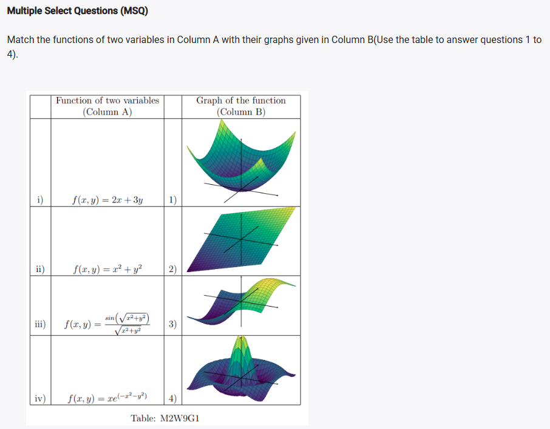
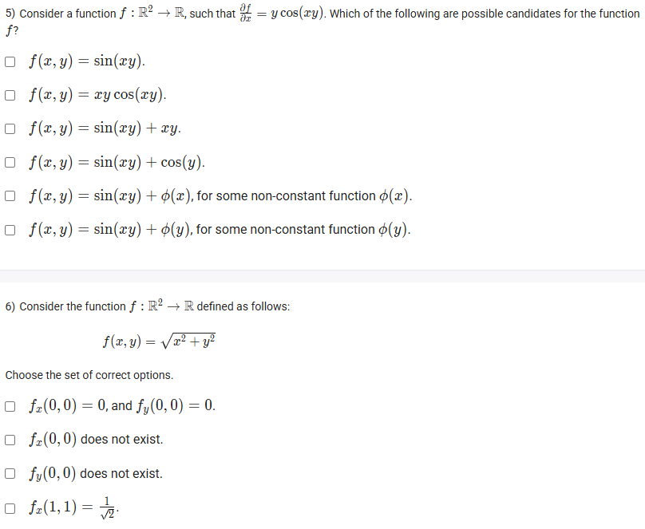
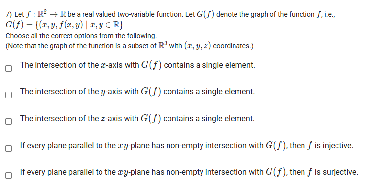
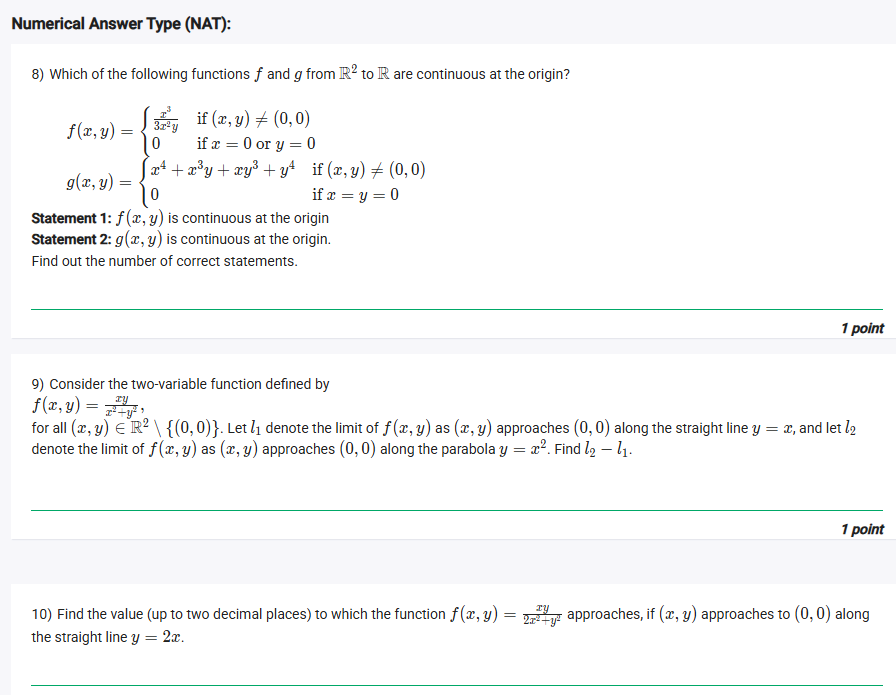
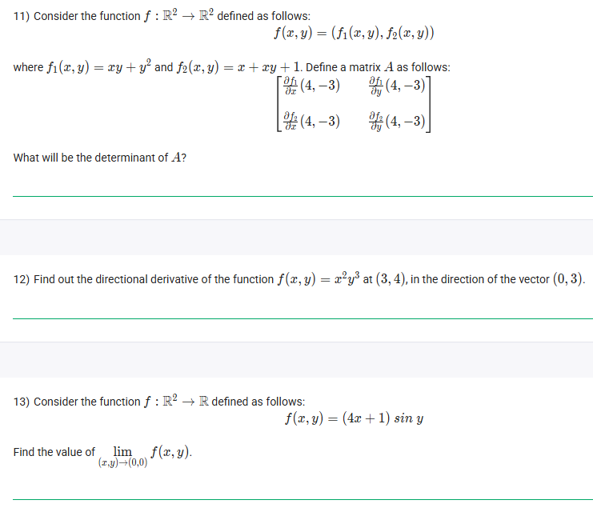
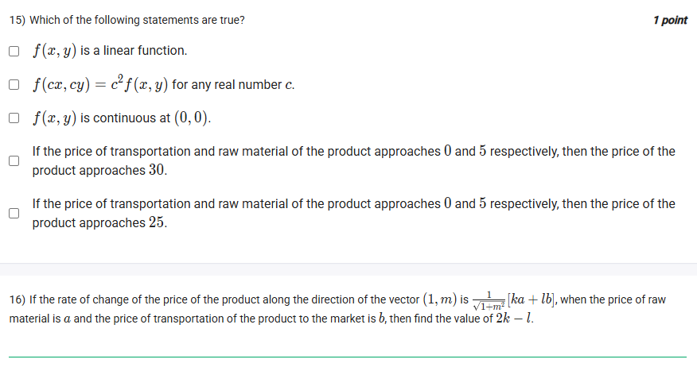

## Exercise Questions ❓

## SOlutions 

Hello Aryan. These questions explore the visualization of multivariable functions, partial derivatives, and the fundamental definitions of function graphs and properties.

Here are the step-by-step solutions for all 7 questions.


### Questions 1 - 4: Matching Functions to Graphs

**Concept:**
To match the functions, we analyze their shapes and symmetries:
* **Linear functions** ($ax + by$) create flat **planes**.
* **Quadratic functions** ($x^2 + y^2$) create curved surfaces like **paraboloids** (bowls).
* **Oscillating functions** ($\sin$, $\cos$) create waves or ripples.
* **Decaying functions** ($e^{-x^2}$) approach zero as you move away from the origin.

**Analysis:**

1.  **Function i) $f(x, y) = 2x + 3y$**
    * This is a linear equation of the form $z = ax + by$.
    * It represents a flat surface (a plane) passing through the origin.
    * **Match:** Graph **2)** (The only flat plane).

2.  **Function ii) $f(x, y) = x^2 + y^2$**
    * This describes a circular paraboloid.
    * At the origin $(0,0)$, $z=0$. As $x$ or $y$ increases, $z$ increases rapidly.
    * It looks like a bowl opening upwards.
    * **Match:** Graph **1)** (The bowl shape).

3.  **Function iii) $f(x, y) = \frac{\sin(\sqrt{x^2+y^2})}{\sqrt{x^2+y^2}}$**
    * This is the classic "Sombrero" or "Sinc" function.
    * It depends only on the distance from the origin ($r = \sqrt{x^2+y^2}$).
    * At $r=0$, the limit is 1 (the central peak). As $r$ increases, it oscillates and decays (ripples).
    * **Match:** Graph **4)** (The central peak with ripples).

4.  **Function iv) $f(x, y) = xe^{-(x^2+y^2)}$** [Assumed from shape, likely typo in image label or just complex]
    * This function is odd with respect to $x$ (if you swap $x$ for $-x$, the sign flips).
    * This creates a "peak" on one side and a "valley" on the other side of the axis.
    * **Match:** Graph **3)** (Shows a peak and a valley antisymmetric across the center).

**Answers:**
1) The graph of the function i) has the serial number **2**.
2) The graph of the function ii) has the serial number **1**.
3) The graph of the function iii) has the serial number **4**.
4) The graph of the function iv) has the serial number **3**.



### Question 5: Partial Integration

**Problem:**
Find $f(x, y)$ such that $\frac{\partial f}{\partial x} = y \cos(xy)$.

**Solution:**
To find $f(x, y)$, we integrate the partial derivative with respect to $x$. When integrating with respect to $x$, we treat $y$ as a constant.

$$f(x, y) = \int y \cos(xy) \, dx$$

Using u-substitution where $u = xy$ (so $du = y \, dx$):
$$f(x, y) = \int \cos(u) \, du = \sin(u) + C$$
$$f(x, y) = \sin(xy) + C(y)$$

*Important:* In partial integration, the "constant of integration" $C$ can be any function that depends *only* on the variable held constant (in this case, $y$).

**Evaluating the Options:**
* $\sin(xy)$: Valid (where $C(y) = 0$).
* $xy \cos(xy)$: Invalid.
* $\sin(xy) + xy$: Invalid ($xy$ depends on $x$).
* $\sin(xy) + \cos(y)$: Valid ($C(y) = \cos(y)$, depends only on $y$).
* $\sin(xy) + \phi(x)$: Invalid (cannot depend on $x$).
* $\sin(xy) + \phi(y)$: Valid ($C(y) = \phi(y)$, depends only on $y$).

**Correct Options:**
* $f(x, y) = \sin(xy)$
* $f(x, y) = \sin(xy) + \cos(y)$
* $f(x, y) = \sin(xy) + \phi(y)$, for some non-constant function $\phi(y)$.



### Question 6: Differentiability of the Cone

**Problem:**
$f(x, y) = \sqrt{x^2 + y^2}$. Analyze partial derivatives at $(0,0)$ and $(1,1)$. 
**Analysis:**
The graph of this function is a cone with its sharp vertex at the origin $(0,0)$. Sharp points usually imply derivatives do not exist.

1.  **Check $f_x(0,0)$:**
    Definition: $\lim_{h \to 0} \frac{f(0+h, 0) - f(0,0)}{h} = \lim_{h \to 0} \frac{\sqrt{h^2} - 0}{h} = \lim_{h \to 0} \frac{|h|}{h}$
    * If $h > 0$, limit is $1$.
    * If $h < 0$, limit is $-1$.
    * Since limits don't match, **$f_x(0,0)$ does not exist.**

2.  **Check $f_y(0,0)$:**
    By the same logic, **$f_y(0,0)$ does not exist.**

3.  **Check $f_x(1,1)$:**
    For points other than the origin, we can use standard derivative rules.
    $$\frac{\partial}{\partial x} (x^2 + y^2)^{1/2} = \frac{1}{2}(x^2 + y^2)^{-1/2} \cdot (2x) = \frac{x}{\sqrt{x^2+y^2}}$$
    Substitute $(1,1)$:
    $$f_x(1,1) = \frac{1}{\sqrt{1^2 + 1^2}} = \frac{1}{\sqrt{2}}$$

**Correct Options:**
* $f_x(0, 0)$ does not exist.
* $f_y(0, 0)$ does not exist.
* $f_x(1, 1) = \frac{1}{\sqrt{2}}$.



### Question 7: Geometry of the Graph G(f)

**Problem:**
Analyze the graph $G(f)$ as a subset of $\mathbb{R}^3$. $z = f(x, y)$.

**Analysis:**

1.  **Intersection with axes:**
    * **x-axis ($y=0, z=0$):** Intersection requires $f(x,0) = 0$. This depends on the specific function. It might have no solutions or many. (False)
    * **y-axis ($x=0, z=0$):** Intersection requires $f(0,y) = 0$. Same issue. (False)
    * **z-axis ($x=0, y=0$):** Intersection requires $z = f(0,0)$. Since $f$ is a function, it yields exactly **one** output for the input $(0,0)$. Thus, there is exactly one point $(0, 0, f(0,0))$ on the graph intersecting the z-axis. **(True)**

2.  **Intersection with planes parallel to xy-plane ($z = c$):**
    * The statement "Every plane... has non-empty intersection" means for every height $c$, there is some point on the graph.
    * Mathematically: For all $c \in \mathbb{R}$, there exists $(x,y)$ such that $f(x,y) = c$.
    * This is the exact definition of a **Surjective** (or "onto") function.
    * It does *not* imply Injectivity (one-to-one), because a plane could slice the graph in a circle (like the paraboloid) or a line, meaning many inputs give the same output.

**Correct Options:**
* The intersection of the z-axis with $G(f)$ contains a single element.
* If every plane parallel to the xy-plane has non-empty intersection with $G(f)$, then $f$ is surjective.


Hello Aryan. Here are the step-by-step solutions for the problems from your uploaded images, covering limits, continuity, partial differentiation, and the Jacobian.


### Question 8: Continuity at the Origin

**Problem Statement:**
Determine the number of correct statements regarding the continuity of functions $f$ and $g$ at the origin.
1.  $f(x,y) = \frac{x^3}{3x^2y}$ if $(x,y) \ne (0,0)$, else $0$.
2.  $g(x,y) = x^4 + x^3y + xy^3 + y^4$ if $(x,y) \ne (0,0)$, else $0$.

**Analysis of $f(x,y)$:**
To check continuity at the origin, the limit as $(x,y) \to (0,0)$ must equal the function value ($0$). Let's check different paths.
* **Path 1 ($y = x$):**
    $$\lim_{x \to 0} \frac{x^3}{3x^2(x)} = \lim_{x \to 0} \frac{x^3}{3x^3} = \frac{1}{3}$$
* **Path 2 ($y = 2x$):**
    $$\lim_{x \to 0} \frac{x^3}{3x^2(2x)} = \lim_{x \to 0} \frac{x^3}{6x^3} = \frac{1}{6}$$
Since the limits are different ($1/3 \ne 1/6$), the limit does not exist. **Statement 1 is False.**

**Analysis of $g(x,y)$:**
The function $g(x,y) = x^4 + x^3y + xy^3 + y^4$ is a polynomial. Polynomial functions are continuous everywhere on their domain. The limit as $(x,y) \to (0,0)$ is simply $0 + 0 + 0 + 0 = 0$, which matches the defined value. **Statement 2 is True.**

**Conclusion:**
Only Statement 2 is correct.

**Answer:**
**1** (Because there is 1 correct statement)



### Question 9: Difference of Limits

**Problem Statement:**
For $f(x,y) = \frac{xy}{x^2+y^2}$, find $l_2 - l_1$.
* $l_1$: Limit along line $y=x$.
* $l_2$: Limit along parabola $y=x^2$.

**Solution:**
1.  **Calculate $l_1$ (Path $y=x$):**
    $$\lim_{x \to 0} \frac{x(x)}{x^2 + x^2} = \lim_{x \to 0} \frac{x^2}{2x^2} = \frac{1}{2} = 0.5$$

2.  **Calculate $l_2$ (Path $y=x^2$):**
    $$\lim_{x \to 0} \frac{x(x^2)}{x^2 + (x^2)^2} = \lim_{x \to 0} \frac{x^3}{x^2 + x^4} = \lim_{x \to 0} \frac{x^3}{x^2(1+x^2)} = \lim_{x \to 0} \frac{x}{1+x^2} = \frac{0}{1} = 0$$

3.  **Calculate Difference:**
    $$l_2 - l_1 = 0 - 0.5 = -0.5$$

**Answer:**
**-0.5**



### Question 10: Limit Value

**Problem Statement:**
Find the value to which $f(x,y) = \frac{xy}{2x^2+y^2}$ approaches along the line $y=2x$.

**Solution:**
Substitute $y=2x$ into the function:
$$\lim_{x \to 0} \frac{x(2x)}{2x^2 + (2x)^2}$$
$$= \lim_{x \to 0} \frac{2x^2}{2x^2 + 4x^2}$$
$$= \lim_{x \to 0} \frac{2x^2}{6x^2}$$
$$= \frac{2}{6} = \frac{1}{3}$$

**Answer:**
**0.33** (rounded to two decimal places)



### Question 11: Jacobian Determinant

**Problem Statement:**
Find the determinant of the Jacobian matrix $A$ for $f(x,y) = (f_1, f_2)$ at $(4, -3)$.
* $f_1(x,y) = xy + y^2$
* $f_2(x,y) = x + xy + 1$

**Solution:**
1.  **Find Partial Derivatives:**
    * $\frac{\partial f_1}{\partial x} = y$
    * $\frac{\partial f_1}{\partial y} = x + 2y$
    * $\frac{\partial f_2}{\partial x} = 1 + y$
    * $\frac{\partial f_2}{\partial y} = x$

2.  **Evaluate at $(4, -3)$:**
    * $\frac{\partial f_1}{\partial x} = -3$
    * $\frac{\partial f_1}{\partial y} = 4 + 2(-3) = 4 - 6 = -2$
    * $\frac{\partial f_2}{\partial x} = 1 + (-3) = -2$
    * $\frac{\partial f_2}{\partial y} = 4$

3.  **Construct Matrix A:**
    $$A = \begin{bmatrix} -3 & -2 \\ -2 & 4 \end{bmatrix}$$

4.  **Calculate Determinant:**
    $$\det(A) = (-3)(4) - (-2)(-2) = -12 - 4 = -16$$

**Answer:**
**-16**



### Question 12: Directional Derivative

**Problem Statement:**
Find the directional derivative of $f(x,y) = x^2y^3$ at $(3,4)$ in the direction of vector $\vec{v} = (0, 3)$.

**Concept:**
The directional derivative is given by $D_{\vec{u}}f = \nabla f \cdot \vec{u}$, where $\vec{u}$ is the **unit vector** in the direction of $\vec{v}$.

**Solution:**
1.  **Calculate Gradient $\nabla f$:**
    $$\nabla f = \left( \frac{\partial f}{\partial x}, \frac{\partial f}{\partial y} \right) = (2xy^3, 3x^2y^2)$$

2.  **Evaluate Gradient at $(3,4)$:**
    * $f_x = 2(3)(4^3) = 6(64) = 384$
    * $f_y = 3(3^2)(4^2) = 27(16) = 432$
    * $\nabla f(3,4) = (384, 432)$

3.  **Find Unit Vector $\vec{u}$:**
    Magnitude of $\vec{v} = \sqrt{0^2 + 3^2} = 3$.
    $$\vec{u} = \frac{(0,3)}{3} = (0, 1)$$

4.  **Calculate Dot Product:**
    $$D_{\vec{u}}f = (384, 432) \cdot (0, 1) = 384(0) + 432(1) = 432$$

**Answer:**
**432**



### Question 13: Limit Calculation

**Problem Statement:**
Find $\lim_{(x,y)\to(0,0)} (4x+1)\sin y$.

**Solution:**
Since the function is a product of polynomial and trigonometric functions, it is continuous at $(0,0)$. We can use direct substitution.
$$\lim_{(x,y)\to(0,0)} (4x+1)\sin y = (4(0)+1)\sin(0) = (1)(0) = 0$$

**Answer:**
**0**



### Comprehension Set: Questions 14, 15, 16

**Context:**
Price function $f(x,y) = x^2 + xy + y^2$.
$x$: Price of raw materials.
$y$: Price of transportation.

**Question 14: Rate of Change Equality**
We want the rate of change wrt $x$ to equal the rate of change wrt $y$.
$$\frac{\partial f}{\partial x} = \frac{\partial f}{\partial y}$$
$$2x + y = x + 2y$$
$$x = y$$
This implies the price of raw materials is the same as the price of transportation.
**Answer:** **Statement 3** (Enter 3)

**Question 15: True Statements**
* **Linear?** No, degree is 2.
* **Homogeneous?** Yes, $f(cx, cy) = (cx)^2 + (cx)(cy) + (cy)^2 = c^2(x^2+xy+y^2) = c^2f(x,y)$. **(True)**
* **Continuous?** Yes, it is a polynomial. **(True)**
* **Limit check:** If $y \to 0$ and $x \to 5$:
    $f(x,y) \to 5^2 + 5(0) + 0^2 = 25$.
    The statement saying it approaches 30 is False.
    The statement saying it approaches 25 is **(True)**.
**Answer:** Select the checkboxes for **Homogeneity**, **Continuity**, and **Price approaches 25**.

**Question 16: Directional Derivative Value**
Given: Rate of change along $(1, m)$ is $\frac{1}{\sqrt{1+m^2}}[ka + lb]$ at point $(a, b)$. Find $2k - l$.

1.  **Calculate Directional Derivative:**
    Unit vector $\vec{u} = \frac{1}{\sqrt{1+m^2}}(1, m)$.
    Gradient at $(a, b)$ is $(2a+b, a+2b)$.
    $$D_{\vec{u}}f = \nabla f \cdot \vec{u} = \frac{1}{\sqrt{1+m^2}} [1(2a+b) + m(a+2b)]$$

2.  **Group terms by $a$ and $b$:**
    $$= \frac{1}{\sqrt{1+m^2}} [2a + b + ma + 2mb]$$
    $$= \frac{1}{\sqrt{1+m^2}} [a(2+m) + b(1+2m)]$$

3.  **Compare with given form:**
    Given form: $\frac{1}{\sqrt{1+m^2}} [ka + lb]$
    Therefore:
    $$k = 2+m$$
    $$l = 1+2m$$

4.  **Compute $2k - l$:**
    $$2k - l = 2(2+m) - (1+2m)$$
    $$= 4 + 2m - 1 - 2m$$
    $$= 3$$

**Answer:**
**3**


