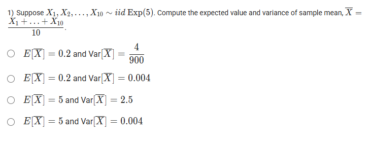
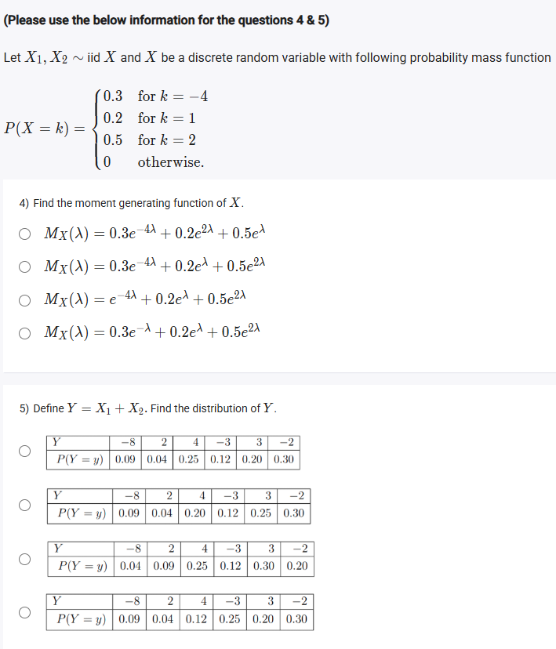
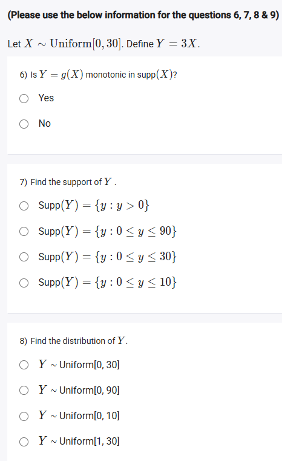
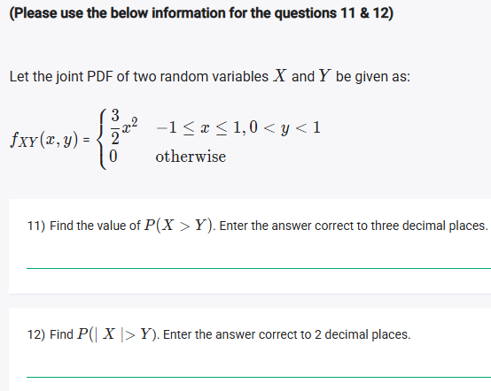
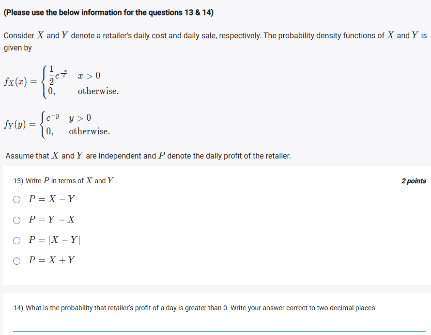
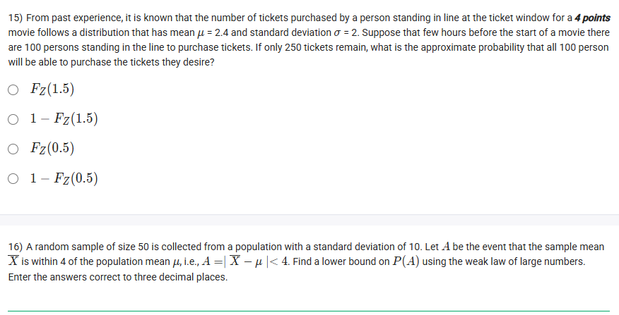
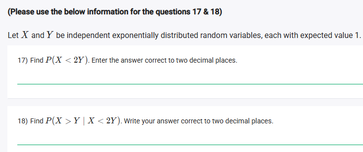
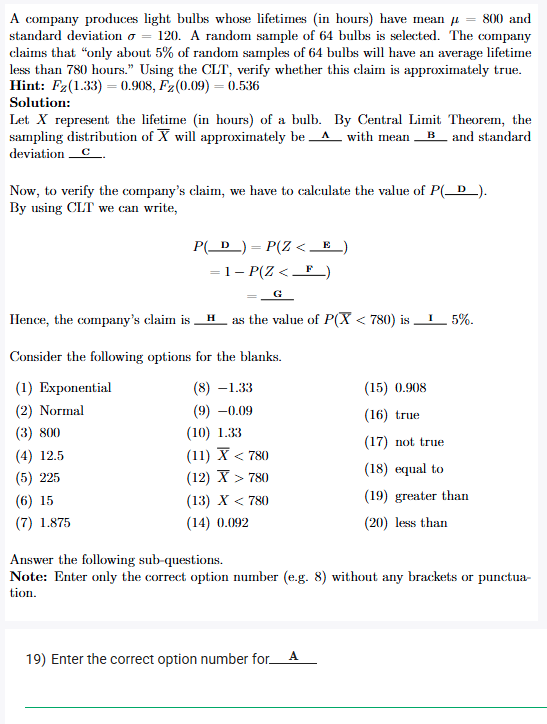
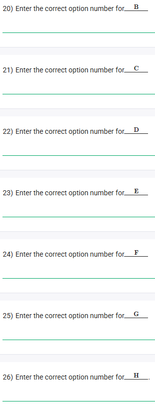

## Exercise Questions ❓





















## Solutions 🟩

Here are the detailed solutions and concept explanations for the next set of questions.


### ❓ Question 1
**Question:** Suppose $X_1, X_2, \dots, X_{10} \sim iid \text{ Exp}(5)$. Compute the expected value and variance of sample mean, $\bar{X} = \frac{X_1 + \dots + X_{10}}{10}$.

* $E[\bar{X}] = 0.2 \text{ and } \text{Var}[\bar{X}] = \frac{4}{900}$
* $E[\bar{X}] = 0.2 \text{ and } \text{Var}[\bar{X}] = 0.004$
* $E[\bar{X}] = 5 \text{ and } \text{Var}[\bar{X}] = 2.5$
* $E[\bar{X}] = 5 \text{ and } \text{Var}[\bar{X}] = 0.004$

---

#### 💡 Concepts
1.  **Exponential Distribution (Rate Parameter):** The notation $\text{Exp}(\lambda)$ refers to an exponential distribution with a **rate parameter** $\lambda$.
    * The mean (expected value) is $E[X_i] = \mu = \frac{1}{\lambda}$.
    * The variance is $\text{Var}[X_i] = \sigma^2 = \frac{1}{\lambda^2}$.

2.  **Properties of the Sample Mean ($\bar{X}$):** For any $iid$ (independent and identically distributed) sample of size $n$ from a population with mean $\mu$ and variance $\sigma^2$:
    * **Expected Value of $\bar{X}$:** $E[\bar{X}] = \mu$. The expected value of the sample mean is simply the population mean.
    * **Variance of $\bar{X}$:** $\text{Var}[\bar{X}] = \frac{\sigma^2}{n}$. The variance of the sample mean is the population variance divided by the sample size.

#### Solution
1.  **Identify Parameters:**
    * Sample size: $n = 10$
    * Rate parameter: $\lambda = 5$

2.  **Find Population Mean ($\mu$) and Variance ($\sigma^2$):**
    * $\mu = E[X_i] = \frac{1}{\lambda} = \frac{1}{5} = \mathbf{0.2}$
    * $\sigma^2 = \text{Var}[X_i] = \frac{1}{\lambda^2} = \frac{1}{5^2} = \frac{1}{25} = \mathbf{0.04}$

3.  **Calculate $E[\bar{X}]$:**
    * $E[\bar{X}] = \mu = \mathbf{0.2}$

4.  **Calculate $\text{Var}[\bar{X}]$:**
    * $\text{Var}[\bar{X}] = \frac{\sigma^2}{n} = \frac{0.04}{10} = \mathbf{0.004}$

**Answer:** This matches the **second option**: $E[\bar{X}] = 0.2 \text{ and } \text{Var}[\bar{X}] = 0.004$.



### ❓ Question 2
(Please use the below information for the questions 2 & 3)
**Question:** Suppose the random variables $X$ and $Y$ are uniformly distributed over the region $D = [0, 1] \times [0, 1] \cup [2, 3] \times [0, 1]$. Determine $f_{XY}(x, y)$.

---

#### 💡 Concept: Joint Uniform Distribution
For a continuous distribution to be **uniform** over a specific region $D$, its probability density function (PDF) $f_{XY}(x, y)$ must be a constant value, $c$, for every point inside that region.

To find this constant $c$, we use the fact that the total probability (the volume under the PDF) must equal 1.
* $\text{Volume} = \text{Area}(D) \times \text{Height}(c) = 1$
* Therefore, the height $c = \frac{1}{\text{Area}(D)}$

#### Solution
1.  **Sketch the Region $D$:** The region $D$ consists of two separate rectangles.
    * **Rectangle 1:** $[0, 1] \times [0, 1]$ $\implies$ $0 \le x \le 1$ and $0 \le y \le 1$.
    * **Rectangle 2:** $[2, 3] \times [0, 1]$ $\implies$ $2 \le x \le 3$ and $0 \le y \le 1$.
    
2.  **Calculate the Total Area of $D$:**
    * $\text{Area}(\text{Rect 1}) = \text{width} \times \text{height} = (1 - 0) \times (1 - 0) = 1$
    * $\text{Area}(\text{Rect 2}) = \text{width} \times \text{height} = (3 - 2) \times (1 - 0) = 1$
    * $\text{Total Area}(D) = \text{Area}(\text{Rect 1}) + \text{Area}(\text{Rect 2}) = 1 + 1 = \mathbf{2}$

3.  **Find the PDF Height ($c$):**
    * $c = \frac{1}{\text{Total Area}(D)} = \frac{1}{2}$

4.  **Write the PDF:** The PDF $f_{XY}(x, y)$ is $\frac{1}{2}$ for any point $(x, y)$ inside $D$, and 0 otherwise.

**Answer:** This matches the **third option**: $f_{XY}(x, y) = \begin{cases} \frac{1}{2} & \text{for } (x, y) \in D \\ 0 & \text{otherwise} \end{cases}$
*(Note: The option text "$x \in D$" is likely a typo and should mean $(x, y) \in D$.)*



### ❓ Question 3
**Question:** Are $X$ and $Y$ independent?
* Yes
* No

---

#### 💡 Concept: Independence of Continuous Variables
Two random variables $X$ and $Y$ are independent if and only if their joint PDF $f_{XY}(x, y)$ can be factored into the product of their marginal PDFs, $f_X(x)$ and $f_Y(y)$.
$f_{XY}(x, y) = f_X(x) \cdot f_Y(y) \quad \text{for all } x, y$

A quick test is to check if the **support** (the region $D$ where the PDF is non-zero) is a "product space." A product space $D$ can be written as $A \times B$, where $A$ is a set of $x$-values and $B$ is a set of $y$-values.

#### Solution
1.  **Check the Support $D$:**
    * Our support is $D = ([0, 1] \cup [2, 3]) \times [0, 1]$.
    * This **is** a product space, where:
        * The set of $x$-values is $A = [0, 1] \cup [2, 3]$.
        * The set of $y$-values is $B = [0, 1]$.
    * Because the support is a product space and the PDF ($f_{XY} = \frac{1}{2}$) is constant, $X$ and $Y$ **are** independent.

2.  **Formal Proof (by finding marginals):**
    * **Find $f_X(x)$:** Integrate $f_{XY}$ over all $y$. The range of $y$ is $[0, 1]$.
        $f_X(x) = \int_{0}^{1} f_{XY}(x, y) \,dy = \int_{0}^{1} \frac{1}{2} \,dy = \frac{1}{2} [y]_0^1 = \frac{1}{2}(1 - 0) = \frac{1}{2}$
        (This is valid for $x \in [0, 1] \cup [2, 3]$)
    * **Find $f_Y(y)$:** Integrate $f_{XY}$ over all $x$. The range of $x$ is $[0, 1] \cup [2, 3]$.
        $f_Y(y) = \int_{-\infty}^{\infty} f_{XY}(x, y) \,dx = \int_{0}^{1} \frac{1}{2} \,dx + \int_{2}^{3} \frac{1}{2} \,dx$
        $f_Y(y) = \left[ \frac{1}{2}x \right]_0^1 + \left[ \frac{1}{2}x \right]_2^3 = \left(\frac{1}{2} - 0\right) + \left(\frac{3}{2} - \frac{2}{2}\right) = \frac{1}{2} + \frac{1}{2} = 1$
        (This is valid for $y \in [0, 1]$)
    * **Check the Product:**
        $f_X(x) \cdot f_Y(y) = \frac{1}{2} \cdot 1 = \frac{1}{2}$
    * This product, $\frac{1}{2}$, is equal to the joint PDF $f_{XY}(x, y)$ over the entire support $D$. Therefore, the variables are independent.

**Answer:** **Yes**



### ❓ Question 4
(Please use the below information for the questions 4 & 5)
**Question:** Let $X_1, X_2 \sim iid X$ and $X$ be a discrete random variable with following probability mass function
$P(X = k) = \begin{cases} 0.3 & \text{for } k = -4 \\ 0.2 & \text{for } k = 1 \\ 0.5 & \text{for } k = 2 \\ 0 & \text{otherwise} \end{cases}$

Find the moment generating function (MGF) of $X$.

---

#### 💡 Concept: Moment Generating Function (MGF)
The MGF of a random variable $X$ is defined as $M_X(t) = E[e^{tX}]$.
* For a **discrete** random variable, this is calculated by summing $e^{tk} \cdot P(X=k)$ over all possible values of $k$.
    $M_X(t) = \sum_k e^{tk} P(X=k)$

*(Note: The question uses $\lambda$ instead of the more common $t$. We will use $\lambda$ to match the options.)*

#### Solution
1.  **Apply the MGF definition:**
    $M_X(\lambda) = E[e^{\lambda X}] = \sum_k e^{\lambda k} P(X=k)$

2.  **Plug in the values from the PMF:**
    $M_X(\lambda) = e^{\lambda(-4)} P(X=-4) + e^{\lambda(1)} P(X=1) + e^{\lambda(2)} P(X=2)$

3.  **Substitute the probabilities:**
    $M_X(\lambda) = e^{-4\lambda} \cdot (0.3) + e^{\lambda} \cdot (0.2) + e^{2\lambda} \cdot (0.5)$

4.  **Reorder to match the options:**
    $M_X(\lambda) = 0.3e^{-4\lambda} + 0.2e^{\lambda} + 0.5e^{2\lambda}$

**Answer:** This matches the **second option**.



### ❓ Question 5
**Question:** Define $Y = X_1 + X_2$. Find the distribution of $Y$.

---

#### 💡 Concept: Distribution of a Sum of Independent Variables
We need to find the probability mass function (PMF) for $Y = X_1 + X_2$. Since $X_1$ and $X_2$ are independent, the probability of any joint outcome is the product of their individual probabilities: $P(X_1 = a, X_2 = b) = P(X_1 = a)P(X_2 = b)$.

To find $P(Y=y)$, we must find all pairs $(X_1, X_2)$ that sum to $y$ and add their probabilities. This process is called **convolution**.

#### Solution
1.  **List all possible outcomes and their probabilities:**
    The possible values for $X_1$ and $X_2$ are $\{-4, 1, 2\}$ with probabilities $\{0.3, 0.2, 0.5\}$.

2.  **Find all possible values of $Y = X_1 + X_2$:**
    | $X_1 \downarrow$ | $X_2 \to$ -4 (P=0.3) | 1 (P=0.2) | 2 (P=0.5) |
    | :--- | :--- | :--- | :--- |
    | **-4** (P=0.3) | $Y = -8$ | $Y = -3$ | $Y = -2$ |
    | **1** (P=0.2) | $Y = -3$ | $Y = 2$ | $Y = 3$ |
    | **2** (P=0.5) | $Y = -2$ | $Y = 3$ | $Y = 4$ |
    The possible values for $Y$ are $\{-8, -3, -2, 2, 3, 4\}$.

3.  **Calculate the probability for each value of $Y$:**
    * **$P(Y = -8)$:**
        * $X_1 = -4, X_2 = -4$
        * $P = (0.3) \times (0.3) = \mathbf{0.09}$
    * **$P(Y = -3)$:**
        * ($X_1 = -4, X_2 = 1$) OR ($X_1 = 1, X_2 = -4$)
        * $P = (0.3)(0.2) + (0.2)(0.3) = 0.06 + 0.06 = \mathbf{0.12}$
    * **$P(Y = -2)$:**
        * ($X_1 = -4, X_2 = 2$) OR ($X_1 = 2, X_2 = -4$)
        * $P = (0.3)(0.5) + (0.5)(0.3) = 0.15 + 0.15 = \mathbf{0.30}$
    * **$P(Y = 2)$:**
        * $X_1 = 1, X_2 = 1$
        * $P = (0.2) \times (0.2) = \mathbf{0.04}$
    * **$P(Y = 3)$:**
        * ($X_1 = 1, X_2 = 2$) OR ($X_1 = 2, X_2 = 1$)
        * $P = (0.2)(0.5) + (0.5)(0.2) = 0.10 + 0.10 = \mathbf{0.20}$
    * **$P(Y = 4)$:**
        * $X_1 = 2, X_2 = 2$
        * $P = (0.5) \times (0.5) = \mathbf{0.25}$

4.  **Assemble the PMF Table for $Y$:**
    | $Y$ | $P(Y=y)$ |
    | :--- | :--- |
    | -8 | 0.09 |
    | -3 | 0.12 |
    | -2 | 0.30 |
    | 2 | 0.04 |
    | 3 | 0.20 |
    | 4 | 0.25 |

**Answer:** This matches the **first option**.



Here are the detailed solutions and concept explanations for each of the questions.

{{\< border \>}}

### ❓ Question 6

(Please use the below information for the questions 6, 7, 8 & 9)
**Question:** Let $X \sim \text{Uniform}[0, 30]$. Define $Y = 3X$.
Is $Y = g(X)$ monotonic in $\text{supp}(X)$?

  * Yes
  * No

-----

#### 💡 Concept: Monotonic Functions

A function $g(x)$ is **monotonic** over an interval (its support) if it is either entirely non-decreasing or entirely non-increasing over that interval.

  * **Increasing:** As $x$ increases, $g(x)$ also increases (or stays the same).
  * **Decreasing:** As $x$ increases, $g(x)$ decreases (or stays the same).

The function $g(X) = 3X$ is a simple linear function with a positive slope of 3.

#### Solution

1.  **Analyze the function:** The function is $Y = 3X$. This is a straight line.
2.  **Analyze the slope:** The slope is 3, which is positive.
3.  **Conclusion:** A function with a constant positive slope is **always increasing**. Since it is always increasing, it is, by definition, monotonic.

**Answer:** **Yes**
{{\< /border \>}}

{{\< border \>}}

### ❓ Question 7

**Question:** Find the support of $Y$.

  * $\text{Supp}(Y) = \{y : y > 0\}$
  * $\text{Supp}(Y) = \{y : 0 \le y \le 90\}$
  * $\text{Supp}(Y) = \{y : 0 \le y \le 30\}$
  * $\text{Supp}(Y) = \{y : 0 \le y \le 10\}$

-----

#### 💡 Concept: Support of a Transformed Variable

The **support** of a random variable is the set of all possible values it can take. To find the support of a transformed variable $Y = g(X)$, you apply the transformation $g$ to the support (the minimum and maximum values) of the original variable $X$.

#### Solution

1.  **Support of X:** We are given $X \sim \text{Uniform}[0, 30]$. This means the support of $X$ is $0 \le X \le 30$.
      * Minimum value of $X = 0$.
      * Maximum value of $X = 30$.
2.  **Transformation:** The transformation is $Y = 3X$.
3.  **Find Support of Y:**
      * Minimum $Y = 3 \times (\text{Minimum } X) = 3 \times 0 = 0$.
      * Maximum $Y = 3 \times (\text{Maximum } X) = 3 \times 30 = 90$.
4.  **Conclusion:** The support of $Y$ is all values from 0 to 90.

**Answer:** **$\text{Supp}(Y) = \{y : 0 \le y \le 90\}$**
{{\< /border \>}}

{{\< border \>}}

### ❓ Question 8

**Question:** Find the distribution of $Y$.

  * $Y \sim \text{Uniform}[0, 30]$
  * $Y \sim \text{Uniform}[0, 90]$
  * $Y \sim \text{Uniform}[0, 10]$
  * $Y \sim \text{Uniform}[1, 30]$

-----

#### 💡 Concept: Linear Transformation of a Uniform Variable

A key property of the uniform distribution is that a linear transformation $Y = aX + b$ of a uniform random variable $X$ results in another uniform random variable.

If $X \sim \text{Uniform}[\alpha, \beta]$, then $Y = aX + b \sim \text{Uniform}[a\alpha + b, a\beta + b]$ (assuming $a > 0$).

#### Solution

1.  **Original Distribution:** $X \sim \text{Uniform}[0, 30]$. So, $\alpha = 0$ and $\beta = 30$.
2.  **Transformation:** $Y = 3X$. This is a linear transformation $Y = aX + b$ where $a = 3$ and $b = 0$.
3.  **New Distribution:**
      * New minimum = $a\alpha + b = (3)(0) + 0 = 0$.
      * New maximum = $a\beta + b = (3)(30) + 0 = 90$.
4.  **Conclusion:** The resulting distribution for $Y$ is $\text{Uniform}[0, 90]$.

**Answer:** **$Y \sim \text{Uniform}[0, 90]$**
{{\< /border \>}}

{{\< border \>}}

### ❓ Question 9

**Question:** Calculate $P(Y \le 60)$. Enter the answer correct to two decimal places.

-----

#### 💡 Concept: Calculating Uniform Probability (CDF)

This question follows from the previous one, where we found $Y \sim \text{Uniform}[0, 90]$.
For any uniform variable $Y \sim \text{Uniform}[a, b]$, the probability $P(Y \le y)$ (its Cumulative Distribution Function or CDF) is the proportion of the interval covered.

$P(Y \le y) = \frac{y - a}{b - a}$ (for $a \le y \le b$)

#### Solution

1.  **Identify Distribution:** From Question 8, $Y \sim \text{Uniform}[0, 90]$.
      * $a = 0$
      * $b = 90$
2.  **Identify Value:** We need to find the probability at $y = 60$.
3.  **Apply Formula:**
    $P(Y \le 60) = \frac{60 - 0}{90 - 0} = \frac{60}{90}$
4.  **Simplify and Convert:**
    $\frac{60}{90} = \frac{2}{3} = 0.6666...$
5.  **Format Answer:** Rounding to two decimal places, we get $0.67$.

**Answer:** **0.67**
{{\< /border \>}}

{{\< border \>}}

### ❓ Question 10

**Question:** Suppose 60% of adults in the age group of 45-50 in a country are male and 40% are female. Suppose the height (in cm) of adult males in that age group in the country is Normal(160, 25), and that of females is Normal(150, 25). If height of a randomly selected person is 160 cm, what is the probability that the selected person is a male? Write your answer correct to two decimal places.

-----

#### 💡 Concept: Bayes' Theorem (for Continuous Variables)

This is a conditional probability problem that requires Bayes' Theorem. We want to find $P(\text{Male} | \text{Height} = 160)$.

The formula is:
$P(\text{Male} | H=160) = \frac{f(H=160 | \text{Male}) \cdot P(\text{Male})}{f(H=160)}$

The denominator $f(H=160)$ is the total probability, found by:
$f(H) = f(H|\text{Male})P(\text{Male}) + f(H|\text{Female})P(\text{Female})$

We also need the PDF of a Normal distribution $N(\mu, \sigma^2)$:
$f(h) = \frac{1}{\sigma\sqrt{2\pi}} \exp\left(-\frac{(h - \mu)^2}{2\sigma^2}\right)$

#### Solution

1.  **List all knowns:**

      * $P(\text{Male}) = 0.6$
      * $P(\text{Female}) = 0.4$
      * Male Height $H_M \sim \text{Normal}(\mu_M=160, \sigma_M^2=25 \implies \sigma_M=5)$
      * Female Height $H_F \sim \text{Normal}(\mu_F=150, \sigma_F^2=25 \implies \sigma_F=5)$

2.  **Calculate Numerator: $f(H=160 | \text{Male}) \cdot P(\text{Male})$**

      * $f(H=160 | \text{Male})$ is the Male PDF $f_M(h)$ evaluated at its own mean, $h=160$.
      * $f_M(160) = \frac{1}{5\sqrt{2\pi}} \exp\left(-\frac{(160 - 160)^2}{2 \cdot 25}\right) = \frac{1}{5\sqrt{2\pi}} \exp(0) = \frac{1}{5\sqrt{2\pi}}$
      * $\text{Numerator} = \left( \frac{1}{5\sqrt{2\pi}} \right) \cdot (0.6)$

3.  **Calculate Denominator:**

      * **Part 1 (Male part):** We just found this: $\left( \frac{1}{5\sqrt{2\pi}} \right) \cdot (0.6)$
      * **Part 2 (Female part):** $f(H=160 | \text{Female}) \cdot P(\text{Female})$
          * $f(H=160 | \text{Female})$ is the Female PDF $f_F(h)$ evaluated at $h=160$.
          * $f_F(160) = \frac{1}{5\sqrt{2\pi}} \exp\left(-\frac{(160 - 150)^2}{2 \cdot 25}\right) = \frac{1}{5\sqrt{2\pi}} \exp\left(-\frac{10^2}{50}\right) = \frac{1}{5\sqrt{2\pi}} \exp\left(-\frac{100}{50}\right) = \frac{1}{5\sqrt{2\pi}} e^{-2}$
          * $\text{Part 2} = \left( \frac{1}{5\sqrt{2\pi}} e^{-2} \right) \cdot (0.4)$
      * $\text{Denominator} = \left( \frac{1}{5\sqrt{2\pi}} \cdot 0.6 \right) + \left( \frac{1}{5\sqrt{2\pi}} e^{-2} \cdot 0.4 \right)$

4.  **Assemble and Simplify:**
    $P(\text{Male} | H=160) = \frac{\left( \frac{1}{5\sqrt{2\pi}} \right) \cdot 0.6}{\left( \frac{1}{5\sqrt{2\pi}} \cdot 0.6 \right) + \left( \frac{1}{5\sqrt{2\pi}} e^{-2} \cdot 0.4 \right)}$

      * Notice the term $\frac{1}{5\sqrt{2\pi}}$ is in every part, so it cancels out\!
        $P(\text{Male} | H=160) = \frac{0.6}{0.6 + 0.4 e^{-2}}$

5.  **Calculate Final Value:**

      * $e^{-2} \approx 0.135335$
      * $P(\text{Male} | H=160) = \frac{0.6}{0.6 + 0.4(0.135335)} = \frac{0.6}{0.6 + 0.054134} = \frac{0.6}{0.654134}$
      * $\approx 0.91725$

6.  **Format Answer:** Rounding to two decimal places gives $0.92$.

**Answer:** **0.92**
{{\< /border \>}}

{{\< border \>}}

### ❓ Question 11

(Please use the below information for the questions 11 & 12)
**Question:** Let the joint PDF of two random variables $X$ and $Y$ be given as:
$f_{XY}(x, y) = \begin{cases} \frac{3}{2}x^2 & -1 \le x \le 1, 0 < y < 1 \\ 0 & \text{otherwise} \end{cases}$

Find the value of $P(X > Y)$. Enter the answer correct to three decimal places.

-----

#### 💡 Concept: Probability from a Joint PDF

To find the probability of a region, we must integrate the joint PDF $f_{XY}(x, y)$ over that region, *within the boundaries of the PDF's support*.

  * **Support:** The rectangle defined by $-1 \le x \le 1$ and $0 < y < 1$.
  * **Region of Interest:** $X > Y$, which is the same as $Y < X$.

#### Solution

1.  **Sketch the Region:**

      * Draw the support: a rectangle with corners at $(-1, 0), (1, 0), (1, 1), (-1, 1)$.
      * Draw the line for the region of interest: $Y = X$.
      * We need the area *under* the line $Y = X$ ($Y < X$) that is also *inside* the support.

2.  **Analyze the Integration Boundaries:**

      * The condition $Y < X$ can only be met if $X$ is positive, because the support for $Y$ is $y > 0$. If $x = -0.5$, for example, $y < -0.5$ is impossible.
      * Therefore, we only need to integrate over the positive $x$ portion of the support, which is $0 \le x \le 1$.
      * In this area, the region $Y < X$ is bounded by $x$ (from 0 to 1) and $y$ (from 0 up to the line $y=x$).

3.  **Set up the Double Integral:**
    $P(X > Y) = \int_{x=0}^{x=1} \left( \int_{y=0}^{y=x} \frac{3}{2}x^2 \,dy \right) \,dx$

4.  **Solve the Inner Integral (with respect to $y$):**

      * We treat $x$ as a constant.
      * $\int_{0}^{x} \frac{3}{2}x^2 \,dy = \frac{3}{2}x^2 \left[ y \right]_0^x = \frac{3}{2}x^2 (x - 0) = \frac{3}{2}x^3$

5.  **Solve the Outer Integral (with respect to $x$):**

      * $\int_{0}^{1} \frac{3}{2}x^3 \,dx = \frac{3}{2} \left[ \frac{x^4}{4} \right]_0^1 = \frac{3}{2} \left( \frac{1^4}{4} - \frac{0^4}{4} \right) = \frac{3}{2} \cdot \frac{1}{4} = \frac{3}{8}$

6.  **Format Answer:**

      * $\frac{3}{8} = 0.375$

**Answer:** **0.375**
{{\< /border \>}}

{{\< border \>}}

### ❓ Question 12

**Question:** Find $P(|X| > Y)$. Enter the answer correct to 2 decimal places.

-----

#### 💡 Concept: Integrating with Absolute Value

We need to find $P(|X| > Y)$, which is $P(Y < |X|)$. We integrate the joint PDF over this region.
The absolute value $Y < |X|$ means we have two separate cases based on the sign of $x$:

1.  If $x > 0$, the region is $Y < X$.
2.  If $x < 0$, the region is $Y < -X$.

We will calculate the probability for these two regions (which are both inside the support) and add them together.

#### Solution

1.  **Region 1: $x > 0$ (specifically, $0 \le x \le 1$)**

      * We need $P(Y < X)$ for $0 \le x \le 1$.
      * This is *exactly* what we calculated in Question 11.
      * $\text{Prob}(\text{Region 1}) = \int_{0}^{1} \int_{0}^{x} \frac{3}{2}x^2 \,dy \,dx = \frac{3}{8}$.

2.  **Region 2: $x < 0$ (specifically, $-1 \le x < 0$)**

      * We need $P(Y < -X)$.
      * The boundaries are $x$ (from -1 to 0) and $y$ (from 0 up to the line $y=-x$).
      * ```
        * **Set up the integral:**
        ```
        $P(\text{Region 2}) = \int_{x=-1}^{x=0} \left( \int_{y=0}^{y=-x} \frac{3}{2}x^2 \,dy \right) \,dx$
      * **Solve Inner Integral (w.r.t $y$):**
        $\int_{0}^{-x} \frac{3}{2}x^2 \,dy = \frac{3}{2}x^2 \left[ y \right]_0^{-x} = \frac{3}{2}x^2 (-x - 0) = -\frac{3}{2}x^3$
      * **Solve Outer Integral (w.r.t $x$):**
        $\int_{-1}^{0} -\frac{3}{2}x^3 \,dx = -\frac{3}{2} \left[ \frac{x^4}{4} \right]_{-1}^0 = -\frac{3}{8} \left[ x^4 \right]_{-1}^0$
        $= -\frac{3}{8} \left( (0)^4 - (-1)^4 \right) = -\frac{3}{8} (0 - 1) = \frac{3}{8}$.

3.  **Total Probability:**

      * $P(|X| > Y) = P(\text{Region 1}) + P(\text{Region 2})$
      * $P(|X| > Y) = \frac{3}{8} + \frac{3}{8} = \frac{6}{8} = \frac{3}{4}$

4.  **Format Answer:**

      * $\frac{3}{4} = 0.75$

**Answer:** **0.75**
{{\< /border \>}}

{{\< border \>}}

### ❓ Question 13

(Please use the below information for the questions 13 & 14)
**Question:** Consider $X$ and $Y$ denote a retailer's daily cost and daily sale, respectively. The probability density functions of $X$ and $Y$ are given... Assume that $X$ and $Y$ are independent and $P$ denote the daily profit of the retailer.

Write $P$ in terms of $X$ and $Y$.

  * $P = X - Y$
  * $P = Y - X$
  * $P = |X - Y|$
  * $P = X + Y$

-----

#### 💡 Concept: Basic Definitions

This question is about translating a real-world scenario into a mathematical expression.

  * **Profit (P):** The amount of money earned.
  * **Sale (Y):** The amount of money received (revenue).
  * **Cost (X):** The amount of money spent.

#### Solution

Profit is calculated as Revenue (Sales) minus Costs.
$\text{Profit} = \text{Sales} - \text{Cost}$
$P = Y - X$

**Answer:** **$P = Y - X$**
{{\< /border \>}}

{{\< border \>}}

### ❓ Question 14

**Question:** What is the probability that retailer's profit of a day is greater than 0. Write your answer correct to two decimal places
(Given: $f_X(x) = \frac{1}{2}e^{-\frac{x}{2}}, x > 0$ and $f_Y(y) = e^{-y}, y > 0$)

-----

#### 💡 Concept: Probability of Independent Exponential Variables

1.  **Identify Distributions:**
      * The PDF for an Exponential variable with rate $\lambda$ is $f(t) = \lambda e^{-\lambda t}$.
      * $f_X(x) = \frac{1}{2}e^{-\frac{1}{2}x}$. This is $X \sim \text{Exp}(\lambda_X = \frac{1}{2})$.
      * $f_Y(y) = 1e^{-1y}$. This is $Y \sim \text{Exp}(\lambda_Y = 1)$.
2.  **Translate the Question:**
      * We want the probability that profit is greater than 0.
      * $P(P > 0) = P(Y - X > 0) = P(Y > X)$
3.  **Shortcut Formula:**
      * For two independent exponential variables $X \sim \text{Exp}(\alpha)$ and $Y \sim \text{Exp}(\beta)$, the probability $P(X < Y)$ (or $P(Y > X)$) is:
      * $P(Y > X) = P(X < Y) = \frac{\alpha}{\alpha + \beta}$

#### Solution

1.  **Identify Parameters:**
      * From our PDFs: $\alpha = \lambda_X = \frac{1}{2}$
      * $\beta = \lambda_Y = 1$
2.  **Apply Formula:**
      * $P(Y > X) = \frac{\alpha}{\alpha + \beta} = \frac{1/2}{1/2 + 1}$
3.  **Calculate:**
      * $P(Y > X) = \frac{1/2}{3/2} = \frac{1}{2} \cdot \frac{2}{3} = \frac{1}{3}$
4.  **Format Answer:**
      * $\frac{1}{3} = 0.3333...$
      * Rounding to two decimal places gives $0.33$.

**Answer:** **0.33**
{{\< /border \>}}


Here are the detailed solutions and concept explanations for each of the questions.


### ❓ Question 15
**Question:** From past experience, it is known that the number of tickets purchased by a person standing in line at the ticket window for a movie follows a distribution that has mean $\mu = 2.4$ and standard deviation $\sigma = 2$. Suppose that few hours before the start of a movie there are 100 persons standing in the line to purchase tickets. If only 250 tickets remain, what is the approximate probability that all 100 person will be able to purchase the tickets they desire?

* $F_Z(1.5)$
* $1 - F_Z(1.5)$
* $F_Z(0.5)$
* $1 - F_Z(0.5)$

---

#### 💡 Concept: The Central Limit Theorem (CLT)
This problem involves the **sum** of a large number of independent random variables (the number of tickets each of the 100 people wants). The **Central Limit Theorem (CLT)** states that when you sum a large number ($n \ge 30$ is a good rule of thumb) of independent and identically distributed (iid) random variables, their sum $S_n$ is approximately normally distributed, regardless of the original distribution.

* **Mean of the Sum:** $E[S_n] = n \cdot \mu$
* **Variance of the Sum:** $\text{Var}[S_n] = n \cdot \sigma^2$
* **Standard Deviation of the Sum:** $\text{SD}[S_n] = \sqrt{n} \cdot \sigma$

We can then standardize this sum using a Z-score: $Z = \frac{S_n - E[S_n]}{\text{SD}[S_n]}$

#### Solution
1.  **Define Variables:**
    * Let $X_i$ be the number of tickets desired by person $i$.
    * $E[X_i] = \mu = 2.4$
    * $\text{SD}[X_i] = \sigma = 2$
    * $\text{Var}[X_i] = \sigma^2 = 2^2 = 4$
    * The sample size is $n = 100$.

2.  **Define the Sum:**
    * Let $S_n$ be the total number of tickets desired by all 100 people: $S_n = X_1 + X_2 + \dots + X_{100}$.
    * We want to find the probability that this total is less than or equal to the 250 tickets available: **$P(S_n \le 250)$**.

3.  **Apply the Central Limit Theorem:**
    * Since $n=100$ is large, $S_n$ is approximately normally distributed.
    * **Mean of Sum:** $E[S_n] = n \cdot \mu = 100 \times 2.4 = 240$
    * **Variance of Sum:** $\text{Var}[S_n] = n \cdot \sigma^2 = 100 \times 4 = 400$
    * **Standard Deviation of Sum:** $\text{SD}[S_n] = \sqrt{400} = 20$
    * So, $S_n \sim \text{Normal}(\mu = 240, \sigma = 20)$ (approximately).

4.  **Standardize (find the Z-score):**
    * We need to find the Z-score for the value 250.
    * $Z = \frac{\text{Value} - \text{Mean}}{\text{Standard Deviation}} = \frac{250 - 240}{20} = \frac{10}{20} = 0.5$

5.  **Find the Probability:**
    * $P(S_n \le 250)$ is approximately equal to $P(Z \le 0.5)$.
    * The probability $P(Z \le z)$ is the definition of the standard normal cumulative distribution function (CDF), which is denoted by $F_Z(z)$.
    * Therefore, $P(Z \le 0.5) = F_Z(0.5)$.

**Answer:** This matches the **third option**: **$F_Z(0.5)$**



### ❓ Question 16
**Question:** A random sample of size 50 is collected from a population with a standard deviation of 10. Let $A$ be the event that the sample mean $\bar{X}$ is within 4 of the population mean $\mu$, i.e., $A = |\bar{X} - \mu| < 4$. Find a lower bound on $P(A)$ using the weak law of large numbers. Enter the answers correct to three decimal places.

---

#### 💡 Concept: Chebyshev's Inequality
The "weak law of large numbers" can be proved using **Chebyshev's Inequality**. When a question asks for a "lower bound" on a probability, it almost always implies using this inequality.

Chebyshev's Inequality provides a lower bound for the probability that a random variable $Y$ will fall within $k$ standard deviations of its mean. A more general form, and the one we'll use, is:
$P(|Y - E[Y]| \ge k) \le \frac{\text{Var}[Y]}{k^2}$

The complement of this is more useful here, as it gives a **lower bound** on the probability of being *within* a certain distance $k$ of the mean:
$P(|Y - E[Y]| < k) \ge 1 - \frac{\text{Var}[Y]}{k^2}$

#### Solution
1.  **Identify Components:**
    * We are interested in the sample mean, so our random variable is $Y = \bar{X}$.
    * The expected value of the sample mean is the population mean: $E[Y] = E[\bar{X}] = \mu$.
    * The event $A$ is $|\bar{X} - \mu| < 4$. This matches our inequality form with $k = 4$.
    * Population standard deviation $\sigma = 10$, so population variance $\sigma^2 = 100$.
    * Sample size $n = 50$.

2.  **Calculate the Variance of the Sample Mean ($\text{Var}[\bar{X}]$):**
    * $\text{Var}[Y] = \text{Var}[\bar{X}] = \frac{\sigma^2}{n}$
    * $\text{Var}[\bar{X}] = \frac{100}{50} = 2$

3.  **Apply Chebyshev's Inequality:**
    * We want to find the lower bound for $P(A) = P(|\bar{X} - \mu| < 4)$.
    * $P(|\bar{X} - \mu| < 4) \ge 1 - \frac{\text{Var}[\bar{X}]}{4^2}$
    * $P(A) \ge 1 - \frac{2}{16}$
    * $P(A) \ge 1 - \frac{1}{8}$
    * $P(A) \ge \frac{7}{8}$

4.  **Format Answer:**
    * As a decimal, the lower bound is $7 \div 8 = 0.875$.

**Answer:** **0.875**



### ❓ Questions 17 & 18
(Please use the below information for the questions 17 & 18)
Let $X$ and $Y$ be independent exponentially distributed random variables, each with expected value 1.

#### ❓ Question 17
**Find $P(X < 2Y)$. Enter the answer correct to two decimal places.**

---

#### 💡 Concepts
1.  **Exponential PDF:** For an exponential random variable with mean $E[X] = 1/\lambda$, the rate parameter is $\lambda = 1 / E[X]$. The PDF is $f(x) = \lambda e^{-\lambda x}$.
2.  **Joint PDF for Independent Variables:** If $X$ and $Y$ are independent, their joint PDF is the product of their individual (marginal) PDFs: $f_{XY}(x, y) = f_X(x) f_Y(y)$.
3.  **Probability as Volume:** To find the probability of a region (e.g., $X < 2Y$), we must integrate the joint PDF over that region within the support (where the variables are defined).

#### Solution
1.  **Find PDFs:**
    * $E[X] = 1 \implies \lambda_X = 1/1 = 1$. So, $f_X(x) = e^{-x}$ for $x > 0$.
    * $E[Y] = 1 \implies \lambda_Y = 1/1 = 1$. So, $f_Y(y) = e^{-y}$ for $y > 0$.
2.  **Find Joint PDF:**
    * Since $X$ and $Y$ are independent, $f_{XY}(x, y) = e^{-x} \cdot e^{-y} = e^{-(x+y)}$.
    * The support for this joint PDF is the first quadrant ($x > 0, y > 0$).
3.  **Define Region of Integration:**
    * We want $P(X < 2Y)$, which is the same as $P(Y > X/2)$.
    * This is the region in the first quadrant *above* the line $Y = X/2$.
    * 4.  **Set up and Solve the Double Integral:**
    * We'll integrate with respect to $y$ first, then $x$.
    * $P(X < 2Y) = \int_{x=0}^{\infty} \left( \int_{y=x/2}^{\infty} e^{-(x+y)} \,dy \right) \,dx$
    * **Inner Integral (w.r.t $y$):**
        $\int_{x/2}^{\infty} e^{-x} e^{-y} \,dy = e^{-x} \int_{x/2}^{\infty} e^{-y} \,dy = e^{-x} \left[ -e^{-y} \right]_{y=x/2}^{y=\infty}$
        $= e^{-x} ( (0) - (-e^{-x/2}) ) = e^{-x} \cdot e^{-x/2} = e^{-3x/2}$
    * **Outer Integral (w.r.t $x$):**
        $\int_{0}^{\infty} e^{-3x/2} \,dx = \left[ -\frac{1}{3/2} e^{-3x/2} \right]_0^\infty = \left[ -\frac{2}{3} e^{-3x/2} \right]_0^\infty$
        $= (0) - (-\frac{2}{3} e^0) = \frac{2}{3}$
5.  **Format Answer:**
    * $2/3 = 0.6666...$
    * Rounded to two decimal places, this is $0.67$.

**Answer (17):** **0.67**

---

#### ❓ Question 18
**Find $P(X > Y \mid X < 2Y)$. Write your answer correct to two decimal places.**

---

#### 💡 Concept: Conditional Probability
The definition of conditional probability is $P(A \mid B) = \frac{P(A \cap B)}{P(B)}$.
* Let $A$ be the event $X > Y$.
* Let $B$ be the event $X < 2Y$.
* We need to find $\frac{P(X > Y \text{ and } X < 2Y)}{P(X < 2Y)}$.

This simplifies to finding the probability of the intersection $P(Y < X < 2Y)$ and dividing it by the probability we found in Question 17.

#### Solution
1.  **Identify Probabilities:**
    * **Denominator:** $P(B) = P(X < 2Y)$. We found this in Q17. $P(B) = 2/3$.
    * **Numerator:** $P(A \cap B) = P(Y < X < 2Y)$. We must calculate this.
2.  **Define Region for Numerator:**
    * The region is bounded by the lines $Y = X$ and $Y = X/2$ in the first quadrant. It's a "wedge" between these two lines.
    * 3.  **Set up and Solve Integral for Numerator:**
    * $P(Y < X < 2Y) = \int_{x=0}^{\infty} \left( \int_{y=x/2}^{y=x} e^{-(x+y)} \,dy \right) \,dx$
    * **Inner Integral (w.r.t $y$):**
        $\int_{x/2}^{x} e^{-x} e^{-y} \,dy = e^{-x} \int_{x/2}^{x} e^{-y} \,dy = e^{-x} \left[ -e^{-y} \right]_{y=x/2}^{y=x}$
        $= e^{-x} ( (-e^{-x}) - (-e^{-x/2}) ) = e^{-x} (e^{-x/2} - e^{-x})$
        $= e^{-3x/2} - e^{-2x}$
    * **Outer Integral (w.r.t $x$):**
        $\int_{0}^{\infty} (e^{-3x/2} - e^{-2x}) \,dx = \int_{0}^{\infty} e^{-3x/2} \,dx - \int_{0}^{\infty} e^{-2x} \,dx$
        * From Q17, we know $\int_{0}^{\infty} e^{-3x/2} \,dx = 2/3$.
        * $\int_{0}^{\infty} e^{-2x} \,dx = \left[ -\frac{1}{2} e^{-2x} \right]_0^\infty = (0) - (-\frac{1}{2} e^0) = 1/2$.
    * $\text{Numerator} = \frac{2}{3} - \frac{1}{2} = \frac{4}{6} - \frac{3}{6} = \frac{1}{6}$
4.  **Calculate Final Conditional Probability:**
    * $P(A \mid B) = \frac{\text{Numerator}}{\text{Denominator}} = \frac{1/6}{2/3}$
    * $P(A \mid B) = \frac{1}{6} \times \frac{3}{2} = \frac{3}{12} = \frac{1}{4}$
5.  **Format Answer:**
    * $1/4 = 0.25$

**Answer (18):** **0.25**



Here are the detailed solutions and concept explanations for each fill-in-the-blank question.


### 💡 Concept: The Central Limit Theorem (CLT)
The problem relies on the **Central Limit Theorem (CLT)**. This theorem is fundamental to statistics and states that if you take a sufficiently large sample ($n \ge 30$ is a common rule of thumb) from *any* population (regardless of its original distribution), the distribution of the **sample mean ($\bar{X}$)** will be approximately **normal**.

* **Mean of Sample Means:** The mean of this new normal distribution is the same as the original population mean, $\mu$.
    $E[\bar{X}] = \mu$
* **Standard Deviation of Sample Means:** The standard deviation of this new normal distribution, known as the **standard error (SE)**, is the original population standard deviation, $\sigma$, divided by the square root of the sample size, $n$.
    $\text{SD}[\bar{X}] = \frac{\sigma}{\sqrt{n}}$

---

### ❓ Question 19 (Blank A)
**Question:** By Central Limit Theorem, the sampling distribution of $\bar{X}$ will approximately be **A**...

**Solution:**
As explained by the Central Limit Theorem, since the sample size $n = 64$ is large (it's greater than 30), the sampling distribution of the sample mean ($\bar{X}$) will be approximately **Normal**.

* **Answer:** **2** (Normal)




### ❓ Question 20 (Blank B)
**Question:** ...with mean **B**...

**Solution:**
The mean of the sampling distribution of $\bar{X}$ is always equal to the population mean ($\mu$).
* Given: Population mean $\mu = 800$.
* Therefore, $E[\bar{X}] = \mu = 800$.

* **Answer:** **3** (800)




### ❓ Question 21 (Blank C)
**Question:** ...and standard deviation **c**...

**Solution:**
The standard deviation of the sampling distribution of $\bar{X}$ (the standard error) is $\frac{\sigma}{\sqrt{n}}$.
* Given: Population standard deviation $\sigma = 120$.
* Given: Sample size $n = 64$.
* Calculation: $\text{SD}[\bar{X}] = \frac{120}{\sqrt{64}} = \frac{120}{8} = 15$.

* **Answer:** **6** (15)




### ❓ Question 22 (Blank D)
**Question:** Now, to verify the company's claim, we have to calculate the value of $P(\text{__D__})$.

**Solution:**
The company's claim is about the "average lifetime" ($\bar{X}$) being "less than 780 hours". We need to find the probability of this event occurring.
* Therefore, we must calculate $P(\bar{X} < 780)$.

* **Answer:** **13** ($\bar{X} < 780$)




### ❓ Question 23 (Blank E)
**Question:** By using CLT we can write, $P(\text{__D__}) = P(Z < \text{__E__})$

**Solution:**
To find the probability, we must convert our value $\bar{X} = 780$ into a standard normal **Z-score** using the mean and standard deviation of the sampling distribution we found in blanks B and C.
* Z-score formula: $Z = \frac{\bar{X} - E[\bar{X}]}{\text{SD}[\bar{X}]}$
* Our values:
    * $\bar{X} = 780$
    * $E[\bar{X}] = 800$ (from Blank B)
    * $\text{SD}[\bar{X}] = 15$ (from Blank C)
* Calculation: $Z = \frac{780 - 800}{15} = \frac{-20}{15} = -\frac{4}{3} \approx -1.33$
* So, $P(\bar{X} < 780) = P(Z < -1.33)$.

* **Answer:** **8** (–1.33)




### ❓ Question 24 (Blank F)
**Question:** $= 1 - P(Z < \text{__F__})$

**Solution:**
This step in the solution is calculating the probability $P(Z < -1.33)$ using a standard normal table, which often only provides probabilities for positive Z-values. We use the symmetry of the normal distribution:
1.  The probability of being in the left tail $P(Z < -1.33)$ is, by symmetry, equal to the probability of being in the right tail $P(Z > 1.33)$.
    2.  The probability of being in the right tail $P(Z > 1.33)$ is equal to 1 minus the probability of *not* being in that tail (i.e., 1 minus the left/main body).
    $P(Z > 1.33) = 1 - P(Z < 1.33)$
3.  Combining these, we get: $P(Z < -1.33) = 1 - P(Z < 1.33)$.
* Comparing this to the template $= 1 - P(Z < \text{__F__})$, we see that **F = 1.33**.

* **Answer:** **10** (1.33)




### ❓ Question 25 (Blank G)
**Question:** $= \text{__G__}$

**Solution:**
This is the final calculation step from the previous question.
* We need to calculate $1 - P(Z < 1.33)$.
* The problem gives us the hint: $F_Z(1.33) = 0.908$. (Note: $F_Z(z)$ is the standard notation for $P(Z < z)$).
* Calculation: $G = 1 - 0.908 = 0.092$.
* So, the actual probability $P(\bar{X} < 780)$ is 0.092, or 9.2%.

* **Answer:** **14** (0.092)




### ❓ Question 26 (Blank H)
**Question:** Hence, the company's claim is **H**...

**Solution:**
We must now compare our finding with the company's claim.
* **Our Calculation:** The actual probability is $P(\bar{X} < 780) = 0.092$, or **9.2%**.
* **Company's Claim:** The probability is "only about **5%**".
* Since 9.2% is not "about 5%" (it's nearly double), the company's claim is **not true**.

* **Answer:** **17** (not true)




### ❓ Question 27 (Blank I)
**Question:** ...as the value of $P(\bar{X} < 780)$ is **I** 5%.

**Solution:**
This is the final comparison that justifies our answer for H.
* Our calculated value is 9.2%.
* The company's claim is 5%.
* The number 9.2% is **greater than** 5%.

* **Answer:** **19** (greater than)




