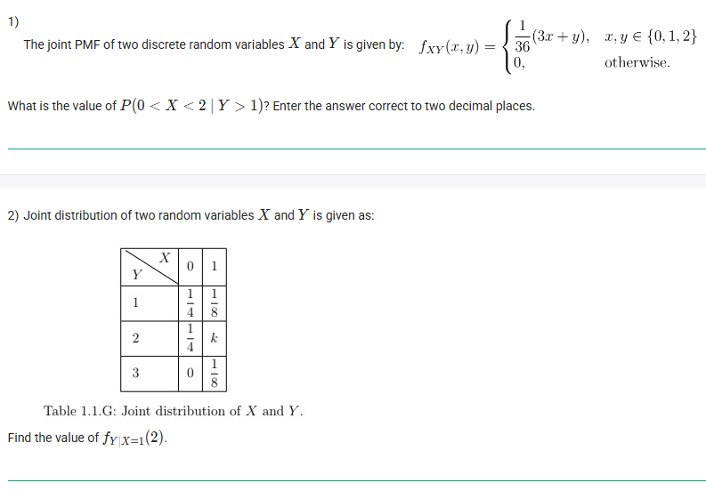
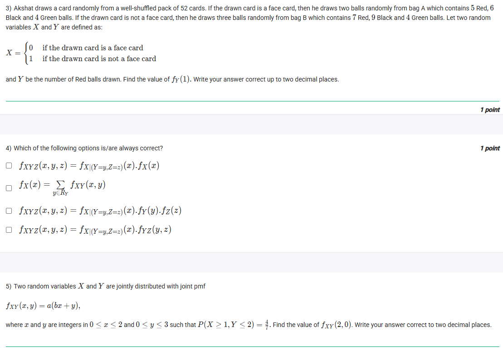
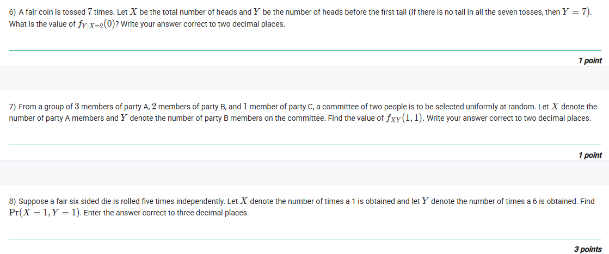
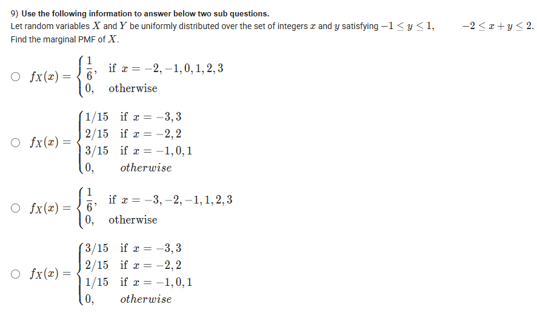
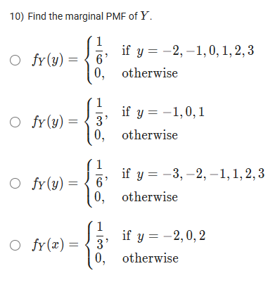
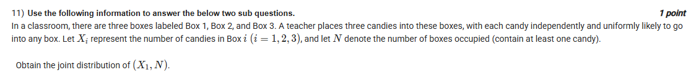
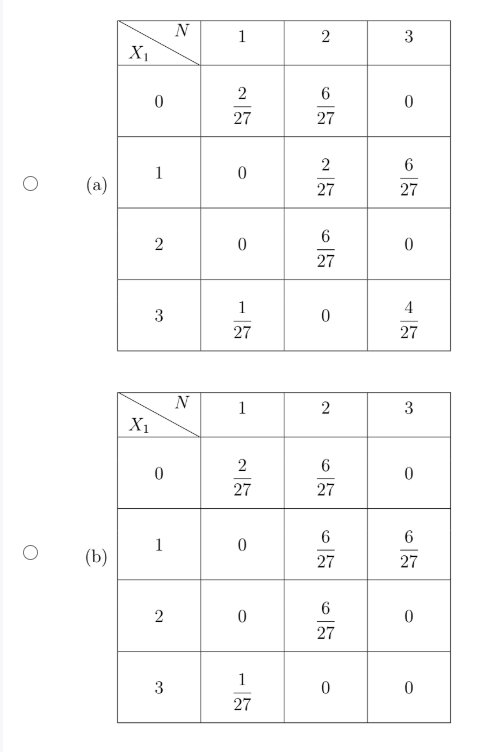
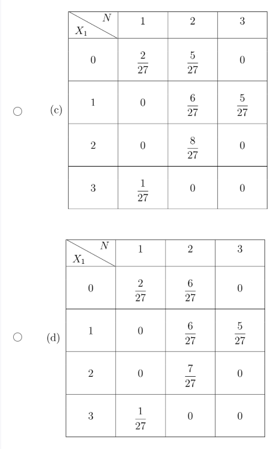
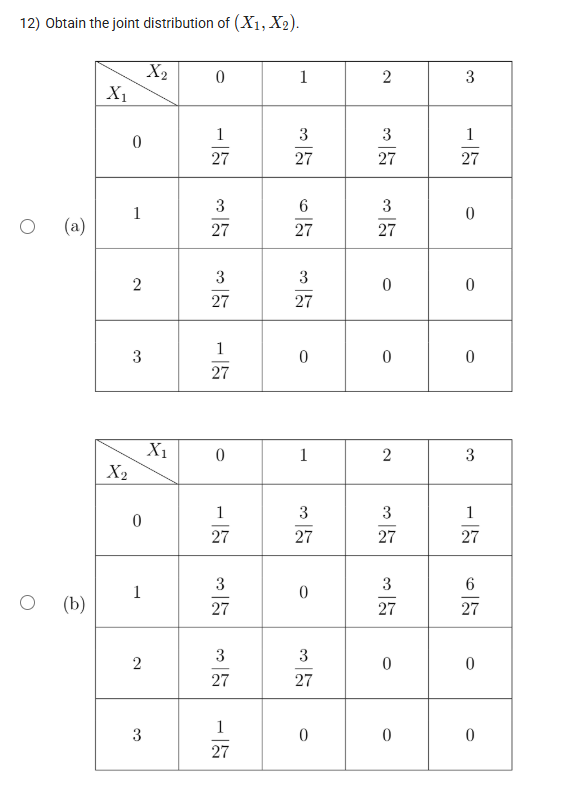
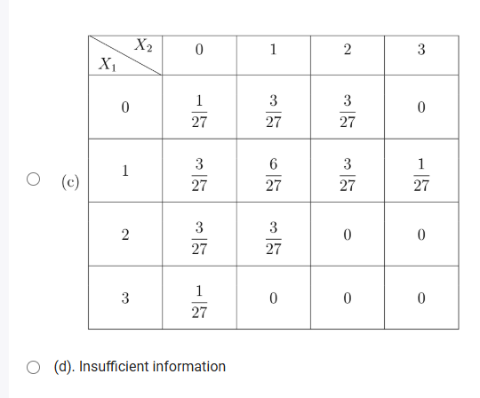

Of course! Here are the solutions and explanations for all the questions you provided.



### Question 1: Conditional Probability

**Problem:** The joint PMF of two discrete random variables $X$ and $Y$ is given by:
$f_{XY}(x, y) = \begin{cases} \frac{1}{36}(3x + y), & x, y \in \{0, 1, 2\} \\ 0, & \text{otherwise} \end{cases}$
What is the value of $P(0 < X < 2 \ | \ Y > 1)$? Enter the answer correct to two decimal places.

***

#### **Answer: 0.33**

#### **Concepts Explained 💡**

* **Joint Probability Mass Function (PMF):** A function $f_{XY}(x, y)$ that gives the probability that discrete random variables $X$ and $Y$ take on the specific values $x$ and $y$, respectively. So, $f_{XY}(x, y) = P(X=x, Y=y)$.
* **Marginal PMF:** The probability distribution of a single variable from a joint distribution. For example, to get the marginal PMF of $Y$, $f_Y(y)$, you sum the joint probabilities over all possible values of $X$: $f_Y(y) = P(Y=y) = \sum_x f_{XY}(x, y)$.
* **Conditional Probability:** The probability of an event occurring, given that another event has already occurred. The formula is $P(A|B) = \frac{P(A \cap B)}{P(B)}$.

#### **Step-by-Step Solution**

1.  **Interpret the Probability Statement:**
    * The condition $0 < X < 2$ for an integer $X$ means $X=1$.
    * The condition $Y > 1$ for an integer $Y$ in the set $\{0, 1, 2\}$ means $Y=2$.
    * So, we need to calculate $P(X=1 \ | \ Y=2)$.

2.  **Apply the Conditional Probability Formula:**
    $$P(X=1 \ | \ Y=2) = \frac{P(X=1, Y=2)}{P(Y=2)}$$

3.  **Calculate the Joint Probability $P(X=1, Y=2)$:**
    This is given directly by the joint PMF $f_{XY}(1, 2)$.
    $$P(X=1, Y=2) = f_{XY}(1, 2) = \frac{1}{36}(3(1) + 2) = \frac{5}{36}$$

4.  **Calculate the Marginal Probability $P(Y=2)$:**
    We need to sum the joint probabilities over all possible values of $X$ (which are 0, 1, and 2) while keeping $Y=2$.
    $$P(Y=2) = \sum_{x=0}^{2} f_{XY}(x, 2) = f_{XY}(0, 2) + f_{XY}(1, 2) + f_{XY}(2, 2)$$   $$P(Y=2) = \frac{1}{36}(3(0) + 2) + \frac{1}{36}(3(1) + 2) + \frac{1}{36}(3(2) + 2)$$   $$P(Y=2) = \frac{2}{36} + \frac{5}{36} + \frac{8}{36} = \frac{15}{36}$$

5.  **Calculate the Final Conditional Probability:**
    $$P(X=1 \ | \ Y=2) = \frac{5/36}{15/36} = \frac{5}{15} = \frac{1}{3}$$
    Converting to a decimal rounded to two places, we get **0.33**.




### Question 2: Conditional PMF from a Table

**Problem:** The joint distribution of two random variables $X$ and $Y$ is given as:

| Y \ X | 0 | 1 |
| :--- | :-: | :-: |
| **1** | 1/4 | 1/8 |
| **2** | 1/4 | k |
| **3** | 0 | 1/8 |

Find the value of $f_{Y|X=1}(2)$.

***

#### **Answer: 0.50**

#### **Concepts Explained 💡**

* **Joint Distribution Table:** A table that displays the probabilities for each possible pair of outcomes for two random variables.
* **Normalization Property:** The sum of all probabilities in a joint distribution must equal 1.
* **Conditional PMF:** The probability distribution of one variable given a specific value of another. It's calculated as:
    $$f_{Y|X}(y|x) = P(Y=y \ | \ X=x) = \frac{P(X=x, Y=y)}{P(X=x)}$$

#### **Step-by-Step Solution**

1.  **Find the value of $k$:**
    The sum of all probabilities in the table must be 1.
    $$\frac{1}{4} + \frac{1}{4} + 0 + \frac{1}{8} + k + \frac{1}{8} = 1$$   $$\frac{2}{4} + \frac{2}{8} + k = 1$$   $$\frac{1}{2} + \frac{1}{4} + k = 1$$   $$\frac{3}{4} + k = 1 \implies k = \frac{1}{4}$$

2.  **Identify the Required Probability:**
    We need to find $f_{Y|X=1}(2)$, which is the conditional probability $P(Y=2 \ | \ X=1)$.

3.  **Apply the Formula:**
    $$P(Y=2 \ | \ X=1) = \frac{P(X=1, Y=2)}{P(X=1)}$$

4.  **Find the Probabilities from the Table:**
    * The joint probability $P(X=1, Y=2)$ is the value of $k$, which we found to be **1/4**.
    * The marginal probability $P(X=1)$ is the sum of all probabilities in the column where $X=1$.
        $$P(X=1) = P(X=1, Y=1) + P(X=1, Y=2) + P(X=1, Y=3)$$       $$P(X=1) = \frac{1}{8} + \frac{1}{4} + \frac{1}{8} = \frac{2}{8} + \frac{1}{4} = \frac{1}{4} + \frac{1}{4} = \frac{1}{2}$$

5.  **Calculate the Result:**
    $$P(Y=2 \ | \ X=1) = \frac{1/4}{1/2} = \frac{1}{4} \times 2 = \frac{1}{2}$$
    The final answer is **0.50**.




### Question 3: Law of Total Probability

**Problem:** Akshat draws a card from a well-shuffled pack of 52 cards. If the drawn card is a face card, he draws two balls randomly from bag A which contains 5 Red, 6 Black and 4 Green balls. If the drawn card is not a face card, then he draws three balls randomly from bag B which contains 7 Red, 9 Black and 4 Green balls. Let two random variables $X$ and $Y$ be defined as:
$X = \begin{cases} 1 & \text{if the drawn card is a face card} \\ 0 & \text{if the drawn card is not a face card} \end{cases}$
and $Y$ be the number of Red balls drawn. Find the value of $f_Y(1)$. Write your answer correct up to two decimal places.

***

#### **Answer: 0.48**

#### **Concepts Explained 💡**

* **Law of Total Probability:** This law allows you to find the probability of an event by considering all possible scenarios (partitions) that lead to it. The formula is:
    $$P(A) = \sum_i P(A|B_i)P(B_i)$$
* **Combinations (Hypergeometric Probability):** Used to find the probability of drawing a specific number of successes (e.g., red balls) without replacement. The formula to choose $k$ successes from a population of $K$ successes in $n$ draws from a total population $N$ is:
    $$P(\text{k successes}) = \frac{\binom{K}{k} \binom{N-K}{n-k}}{\binom{N}{n}}$$

#### **Step-by-Step Solution**

1.  **Identify the Goal:**
    We need to find $f_Y(1)$, which is the overall probability $P(Y=1)$.

2.  **Use the Law of Total Probability:**
    The event $Y=1$ (drawing 1 red ball) can happen in two ways: either a face card was drawn first ($X=1$) or not ($X=0$).
    $$P(Y=1) = P(Y=1 | X=1)P(X=1) + P(Y=1 | X=0)P(X=0)$$

3.  **Calculate Probabilities for $X$:**
    A standard deck has 12 face cards (J, Q, K).
    * $P(X=1) = P(\text{face card}) = \frac{12}{52} = \frac{3}{13}$
    * $P(X=0) = P(\text{not face card}) = 1 - \frac{3}{13} = \frac{10}{13}$

4.  **Calculate Conditional Probabilities for $Y=1$:**
    * **Case 1: Given $X=1$ (drew a face card, use Bag A)**
        Bag A has 5 Red and 10 non-Red balls (total 15). We draw 2 balls.
        $$P(Y=1|X=1) = \frac{\text{Ways to choose 1R and 1 non-R}}{\text{Total ways to choose 2 balls}} = \frac{\binom{5}{1}\binom{10}{1}}{\binom{15}{2}}$$       $$= \frac{5 \times 10}{105} = \frac{50}{105} = \frac{10}{21}$$
    * **Case 2: Given $X=0$ (drew non-face card, use Bag B)**
        Bag B has 7 Red and 13 non-Red balls (total 20). We draw 3 balls.
        $$P(Y=1|X=0) = \frac{\text{Ways to choose 1R and 2 non-R}}{\text{Total ways to choose 3 balls}} = \frac{\binom{7}{1}\binom{13}{2}}{\binom{20}{3}}$$       $$= \frac{7 \times 78}{1140} = \frac{546}{1140} = \frac{91}{190}$$

5.  **Combine Everything:**
    $$P(Y=1) = \left(\frac{10}{21} \times \frac{3}{13}\right) + \left(\frac{91}{190} \times \frac{10}{13}\right)$$   $$P(Y=1) = \frac{10}{91} + \frac{910}{2470} = \frac{10}{91} + \frac{91}{247} = \frac{10}{91} + \frac{7 \times 13}{19 \times 13} = \frac{10}{91} + \frac{7}{19}$$   $$P(Y=1) = \frac{10(19) + 7(91)}{91 \times 19} = \frac{190 + 637}{1729} = \frac{827}{1729} \approx 0.4783$$
    Rounding to two decimal places, the answer is **0.48**.




### Question 4: Fundamental Probability Formulas

**Problem:** Which of the following options is/are always correct?

* $f_{XYZ}(x, y, z) = f_X(Y=y, Z=z|x)f_X(x)$
* $f_X(x) = \sum_{y \in R_Y} f_{XY}(x,y)$
* $f_{XYZ}(x, y, z) = f_X(Y=y, Z=z|x)f_Y(y)f_Z(z)$
* $f_{XYZ}(x, y, z) = f_{X|Y=y,Z=z}(x)f_Y(y)f_Z(z)$

***

#### **Answer:**
The only statement that is always correct is:
$$f_X(x) = \sum_{y \in R_Y} f_{XY}(x,y)$$

#### **Concepts Explained 💡**

* **Chain Rule of Probability:** This rule allows you to break down a joint probability into a product of conditional and marginal probabilities. For three variables, it is:
    $f_{XYZ}(x,y,z) = f_{Z|X,Y}(z|x,y) f_{Y|X}(y|x) f_X(x)$.
    Another common form is $f_{XYZ}(x,y,z) = f_{X|Y,Z}(x|y,z) f_{YZ}(y,z)$.
* **Marginal Distribution:** As explained before, this is the probability distribution of a subset of random variables from a larger set. The provided formula is the definition of the marginal PMF of $X$ derived from the joint PMF of $X$ and $Y$. It is obtained by "summing out" the other variable, $Y$.
* **Statistical Independence:** Two random variables $Y$ and $Z$ are independent if and only if their joint PMF is the product of their marginal PMFs: $f_{YZ}(y,z) = f_Y(y)f_Z(z)$.

#### **Analysis of Options**

1.  **$f_{XYZ}(x, y, z) = f_X(Y=y, Z=z|x)f_X(x)$:** The notation is non-standard, but it appears to be an attempt at the chain rule. A correct version of the chain rule is $f_{XYZ}(x, y, z) = f_{Y,Z|X}(y, z|x)f_X(x)$. While this rule is always true, the notation in the option is garbled and incorrect.
2.  **$f_X(x) = \sum_{y \in R_Y} f_{XY}(x,y)$:** This is the **definition** of the marginal PMF of $X$. It is always true for any pair of discrete random variables $X$ and $Y$.
3.  **$f_{XYZ}(x, y, z) = f_X(Y=y, Z=z|x)f_Y(y)f_Z(z)$:** This is incorrect. It mixes a conditional probability with marginals in a way that is not generally valid.
4.  **$f_{XYZ}(x, y, z) = f_{X|Y=y,Z=z}(x)f_Y(y)f_Z(z)$:** This is also incorrect. The correct chain rule would be $f_{XYZ}(x,y,z) = f_{X|Y,Z}(x|y,z) f_{Y,Z}(y,z)$. The formula in the option is only true if $Y$ and $Z$ are independent, which is not always the case.

Therefore, the only universally correct statement is the second one.




### Question 5: Solving for Parameters in a Joint PMF

**Problem:** Two random variables $X$ and $Y$ are jointly distributed with joint pmf $f_{XY}(x, y) = a(bx + y)$, where $x$ and $y$ are integers in $0 \le x \le 2$ and $0 \le y \le 3$ such that $P(X > 1, Y < 2) = \frac{4}{9}$. Find the value of $f_{XY}(2, 0)$. Write your answer correct to two decimal places.

***

#### **Answer: 0.23**

#### **Concepts Explained 💡**

* **Properties of a Joint PMF:**
    1.  $f_{XY}(x, y) \ge 0$ for all $(x, y)$.
    2.  The sum of the PMF over all possible pairs $(x, y)$ must be 1 (Normalization). $\sum_x \sum_y f_{XY}(x,y) = 1$.
* **Solving Systems of Equations:** This problem requires setting up two equations based on the properties of the PMF and the given information, then solving for the unknown parameters `a` and `b`.

*Note: This problem statement is technically flawed as it leads to a PMF with some negative probabilities. However, we can solve it formally by following the mathematical steps.*

#### **Step-by-Step Solution**

1.  **Set up the Normalization Equation:**
    The sum of $f_{XY}(x, y)$ over all $x \in \{0, 1, 2\}$ and $y \in \{0, 1, 2, 3\}$ must be 1.
    $$\sum_{x=0}^{2} \sum_{y=0}^{3} a(bx + y) = 1$$   $$a \sum_{x=0}^{2} \left( \sum_{y=0}^{3} bx + \sum_{y=0}^{3} y \right) = 1$$
    The inner sum is over 4 values of y, and $\sum_{y=0}^{3} y = 0+1+2+3=6$.
    $$a \sum_{x=0}^{2} (4bx + 6) = 1$$   $$a [(4b(0)+6) + (4b(1)+6) + (4b(2)+6)] = 1$$   $$a [6 + 4b+6 + 8b+6] = 1$$   $$a(12b + 18) = 1 \quad \text{(Equation 1)}$$

2.  **Set up the Second Equation from Given Info:**
    We are given $P(X > 1, Y < 2) = 4/9$.
    * $X > 1 \implies X=2$.
    * $Y < 2 \implies Y=0, 1$.
    $$P(X=2, Y=0) + P(X=2, Y=1) = \frac{4}{9}$$   $$f_{XY}(2,0) + f_{XY}(2,1) = \frac{4}{9}$$   $$a(b(2)+0) + a(b(2)+1) = \frac{4}{9}$$   $$a(2b) + a(2b+1) = \frac{4}{9}$$   $$a(4b+1) = \frac{4}{9} \quad \text{(Equation 2)}$$

3.  **Solve the System of Equations for `a` and `b`:**
    From Equation 2, we have $a = \frac{4}{9(4b+1)}$. Substitute this into Equation 1:
    $$\frac{4}{9(4b+1)}(12b+18) = 1$$   $$4(12b+18) = 9(4b+1)$$   $$48b + 72 = 36b + 9$$   $$12b = -63 \implies b = -\frac{63}{12} = -\frac{21}{4}$$
    Now find `a` using Equation 2:
    $$a(4(-\frac{21}{4})+1) = \frac{4}{9} \implies a(-21+1) = \frac{4}{9} \implies a(-20) = \frac{4}{9} \implies a = -\frac{4}{180} = -\frac{1}{45}$$

4.  **Find the Required Value:**
    The question asks for $f_{XY}(2,0)$.
    $$f_{XY}(2,0) = a(b(2)+0) = 2ab$$   $$f_{XY}(2,0) = 2 \left(-\frac{1}{45}\right) \left(-\frac{21}{4}\right) = \frac{42}{180} = \frac{7}{30}$$
    As a decimal, this is approximately 0.2333... Rounding to two decimal places gives **0.23**.




### Question 6: Conditional Probability Logic

**Problem:** A fair coin is tossed 7 times. Let $X$ be the total number of heads and $Y$ be the number of heads before the first tail. (If there is no tail in all the seven tosses, then $Y=7$). What is the value of $f_{Y|X=x}(0|0)$? Write your answer correct to two decimal places.

***

#### **Answer: 1.00**

#### **Concepts Explained 💡**

* **Conditional Probability:** The question asks for $f_{Y|X}(0|0)$, which is the probability $P(Y=0 | X=0)$. This is the probability that event $Y=0$ occurs, given that we know for a fact that event $X=0$ has occurred.
* **Logical Implication:** If the occurrence of event B guarantees the occurrence of event A, then the conditional probability $P(A|B)$ is 1.

#### **Step-by-Step Solution**

1.  **Understand the Given Event:** The condition is $X=0$.
    * $X$ is the total number of heads in 7 tosses.
    * $X=0$ means there were **zero heads**.
    * The only possible outcome for the 7 tosses is **TTTTTTT**.

2.  **Understand the Event We're Finding the Probability Of:** We want the probability of $Y=0$.
    * $Y$ is the number of heads before the first tail.
    * $Y=0$ means there were **zero heads** before the first tail occurred. This implies that the very first toss must be a Tail.

3.  **Combine the Logic:**
    * We are *given* that the outcome was TTTTTTT (because $X=0$).
    * In the outcome TTTTTTT, is it true that the number of heads before the first tail is zero?
    * Yes. The first toss is a Tail. There are no heads before it. Therefore, $Y=0$.

4.  **Conclusion:**
    The event $X=0$ (outcome is TTTTTTT) logically implies that the event $Y=0$ must also have occurred. When a given condition guarantees the outcome, the conditional probability is 1.
    $$P(Y=0 | X=0) = 1$$
    The answer correct to two decimal places is **1.00**.




### Question 7: Combinations for a Joint PMF

**Problem:** From a group of 3 members of party A, 2 members of party B, and 1 member of party C, a committee of two people is to be selected uniformly at random. Let $X$ denote the number of party A members and $Y$ denote the number of party B members on the committee. Find the value of $f_{XY}(1, 1)$. Write your answer correct to two decimal places.

***

#### **Answer: 0.40**

#### **Concepts Explained 💡**

* **Combinations:** The number of ways to choose a subset of items from a larger set without regard to the order of selection. The formula is $\binom{n}{k} = \frac{n!}{k!(n-k)!}$.
* **Classical Probability:** When all outcomes are equally likely, the probability of an event is the ratio of the number of favorable outcomes to the total number of possible outcomes.

#### **Step-by-Step Solution**

1.  **Identify the Goal:**
    We need to find $f_{XY}(1, 1)$, which is the probability $P(X=1, Y=1)$.
    * $X=1$ means the committee has 1 member from party A.
    * $Y=1$ means the committee has 1 member from party B.
    * Since the committee size is 2, this means the committee must consist of exactly one person from A and one from B.

2.  **Calculate the Number of Favorable Outcomes:**
    We need to choose 1 person from A AND 1 person from B.
    * Ways to choose 1 from 3 party A members: $\binom{3}{1} = 3$.
    * Ways to choose 1 from 2 party B members: $\binom{2}{1} = 2$.
    * Total favorable outcomes = $3 \times 2 = 6$.

3.  **Calculate the Total Number of Possible Outcomes:**
    We are choosing a committee of 2 people from a total group of $3+2+1=6$ people.
    * Total ways to choose 2 from 6: $\binom{6}{2} = \frac{6 \times 5}{2 \times 1} = 15$.

4.  **Calculate the Probability:**
    $$P(X=1, Y=1) = \frac{\text{Favorable Outcomes}}{\text{Total Outcomes}} = \frac{6}{15} = \frac{2}{5}$$
    As a decimal, this is **0.40**.




### Question 8: Multinomial Probability

**Problem:** Suppose a fair six-sided die is rolled five times independently. Let $X$ denote the number of times a 1 is obtained and let $Y$ denote the number of times a 6 is obtained. Find $Pr(X = 1, Y = 1)$. Enter the answer correct to three decimal places.

***

#### **Answer: 0.165**

#### **Concepts Explained 💡**

* **Multinomial Distribution:** An extension of the binomial distribution. It describes the probability of observing a specific count for each of several categories in a fixed number of independent trials ($n$), where each trial has the same probability for each category.
* **Multinomial PMF:** The formula is:
    $$P(X_1=k_1, ..., X_m=k_m) = \frac{n!}{k_1!k_2!...k_m!} p_1^{k_1} p_2^{k_2} ... p_m^{k_m}$$
    where $k_i$ is the number of times outcome $i$ occurs, and $p_i$ is the probability of outcome $i$ in a single trial.

#### **Step-by-Step Solution**

1.  **Define the Experiment and Outcomes:**
    * Number of trials ($n$) = 5 (five rolls of a die).
    * We are interested in three categories of outcomes for each roll:
        1.  Getting a '1': Probability $p_1 = 1/6$. We want this to happen once ($k_1=1$).
        2.  Getting a '6': Probability $p_2 = 1/6$. We want this to happen once ($k_2=1$).
        3.  Getting anything else (2, 3, 4, or 5): Probability $p_3 = 4/6 = 2/3$. This must happen the remaining times: $k_3 = 5 - 1 - 1 = 3$.

2.  **Apply the Multinomial Formula:**
    We need to calculate $P(X=1, Y=1)$.
    $$P(X=1, Y=1) = \frac{5!}{1! \cdot 1! \cdot 3!} \left(\frac{1}{6}\right)^1 \left(\frac{1}{6}\right)^1 \left(\frac{4}{6}\right)^3$$

3.  **Calculate the Components:**
    * **Combinatorial coefficient:** $\frac{5!}{1!1!3!} = \frac{120}{1 \cdot 1 \cdot 6} = 20$. This represents the number of ways to arrange the outcomes (e.g., 1, 6, Other, Other, Other).
    * **Probabilities:** $\left(\frac{1}{6}\right)^1 \left(\frac{1}{6}\right)^1 \left(\frac{4}{6}\right)^3 = \frac{1}{6} \times \frac{1}{6} \times \frac{64}{216} = \frac{64}{7776}$.

4.  **Compute the Final Probability:**
    $$P(X=1, Y=1) = 20 \times \frac{64}{7776} = \frac{1280}{7776}$$
    Simplifying the fraction gives $\frac{40}{243}$.
    $$ \frac{40}{243} \approx 0.164609...$$
    Rounding to three decimal places gives **0.165**.




### Questions 9 & 10: Marginal PMFs from a Uniform Distribution

**Problem:** Let random variables $X$ and $Y$ be uniformly distributed over the set of integers $x$ and $y$ satisfying $-1 \le y \le 1$ and $-2 \le x+y \le 2$.
**9)** Find the marginal PMF of $X$.
**10)** Find the marginal PMF of $Y$.

***

#### **Answer:**
**9)** The correct marginal PMF for $X$ is the **second option**:
$f_X(x) = \begin{cases} 1/15 & \text{if } x = -3, 3 \\ 2/15 & \text{if } x = -2, 2 \\ 3/15 & \text{if } x = -1, 0, 1 \\ 0, & \text{otherwise} \end{cases}$

**10)** The correct marginal PMF for $Y$ is the **second option**:
$f_Y(y) = \begin{cases} 1/3, & \text{if } y = -1, 0, 1 \\ 0, & \text{otherwise} \end{cases}$

#### **Concepts Explained 💡**

* **Discrete Uniform Distribution:** A distribution where all possible outcomes are equally likely. If there are $N$ outcomes, the probability of any single outcome is $1/N$.
* **Finding the Sample Space:** The first step is to carefully list all pairs of integers $(x, y)$ that satisfy the given constraints.
* **Marginal PMF:** As seen before, to find the marginal PMF of one variable, you sum the joint probabilities over all possible values of the other variable.

#### **Step-by-Step Solution**

1.  **List all valid $(x, y)$ pairs (the sample space):**
    The constraints are $y \in \{-1, 0, 1\}$ and $-2-y \le x \le 2-y$.
    * For **y = -1**: $-1 \le x \le 3 \implies$ Pairs are $(-1,-1), (0,-1), (1,-1), (2,-1), (3,-1)$. (5 pairs)
    * For **y = 0**:  $-2 \le x \le 2 \implies$ Pairs are $(-2,0), (-1,0), (0,0), (1,0), (2,0)$. (5 pairs)
    * For **y = 1**:  $-3 \le x \le 1 \implies$ Pairs are $(-3,1), (-2,1), (-1,1), (0,1), (1,1)$. (5 pairs)

2.  **Determine the Joint Probability:**
    There are a total of $5+5+5=15$ possible pairs. Since the distribution is uniform, each pair has a probability of $f_{XY}(x,y) = 1/15$.

3.  **Calculate the Marginal PMF of X ($f_X(x)$):**
    Sum the probabilities for each value of $x$.
    * $f_X(-3) = P(-3,1) = 1/15$
    * $f_X(-2) = P(-2,0) + P(-2,1) = 1/15 + 1/15 = 2/15$
    * $f_X(-1) = P(-1,-1) + P(-1,0) + P(-1,1) = 3/15$
    * $f_X(0) = P(0,-1) + P(0,0) + P(0,1) = 3/15$
    * $f_X(1) = P(1,-1) + P(1,0) + P(1,1) = 3/15$
    * $f_X(2) = P(2,-1) + P(2,0) = 2/15$
    * $f_X(3) = P(3,-1) = 1/15$
    This matches the second option for question 9.

4.  **Calculate the Marginal PMF of Y ($f_Y(y)$):**
    Sum the probabilities for each value of $y$.
    * $f_Y(-1)$: There are 5 pairs where $y=-1$. Sum = $5 \times (1/15) = 5/15 = 1/3$.
    * $f_Y(0)$: There are 5 pairs where $y=0$. Sum = $5 \times (1/15) = 5/15 = 1/3$.
    * $f_Y(1)$: There are 5 pairs where $y=1$. Sum = $5 \times (1/15) = 5/15 = 1/3$.
    This matches the second option for question 10.




### Questions 11 & 12: Joint Distributions from Placement Problems

**Problem:** A teacher places three candies into three boxes, with each candy independently and uniformly likely to go into any box. Let $X_i$ be the number of candies in Box $i$, and let $N$ be the number of occupied boxes.
**11)** Obtain the joint distribution of $(X_1, N)$.
**12)** Obtain the joint distribution of $(X_1, X_2)$.

***

#### **Answer:**
**11)** The correct joint distribution for $(X_1, N)$ is **option (b)** from image `image_309a1b.png`.
**12)** The correct joint distribution for $(X_1, X_2)$ is **option (a)** from image `image_309db7.png`.

#### **Concepts Explained 💡**

* **Sample Space Enumeration:** For problems with a small number of trials and outcomes, we can list all possibilities to find probabilities.
* **Multinomial Coefficients:** As seen in Q8, this helps count the number of ways to distribute distinct items into distinct bins. The number of ways to place $n$ items into $m$ bins, with $k_i$ items in bin $i$, is $\frac{n!}{k_1!k_2!...k_m!}$.
* **Joint Distribution Table:** A table summarizing the probabilities $P(X=x, Y=y)$ for all possible pairs $(x, y)$.

#### **Step-by-Step Solution**

1.  **Total Outcomes:** Each of the 3 candies can go into any of the 3 boxes, so the total number of equally likely outcomes is $3 \times 3 \times 3 = 27$.

2.  **Enumerate Configurations and Count Ways:**
    A configuration is a tuple $(x_1, x_2, x_3)$ where $x_i$ is the number of candies in Box $i$.
    * **Type (3,0,0):** All 3 candies in one box.
        * Configurations: (3,0,0), (0,3,0), (0,0,3).
        * Ways for (3,0,0): $\binom{3}{3}=1$. All candies go to Box 1.
        * Total ways for this type: 3 configurations $\times$ 1 way each = 3.
    * **Type (2,1,0):** 2 in one box, 1 in another.
        * Configurations: (2,1,0), (2,0,1), (1,2,0), (0,2,1), (1,0,2), (0,1,2). (6 total)
        * Ways for (2,1,0): Choose 2 of 3 candies for Box 1: $\binom{3}{2}=3$.
        * Total ways for this type: 6 configurations $\times$ 3 ways each = 18.
    * **Type (1,1,1):** 1 candy in each box.
        * Configuration: (1,1,1).
        * Ways for (1,1,1): The 3 distinct candies can be arranged in $3! = 6$ ways.
        * Total ways for this type: 1 configuration $\times$ 6 ways = 6.
    * *Check:* $3 + 18 + 6 = 27$. Correct.

3.  **Construct the Joint Table for $(X_1, N)$ (Question 11):**
    For each configuration $(x_1, x_2, x_3)$ with its associated number of ways, find the corresponding $(X_1, N)$ pair.
    * $P(X_1=3, N=1)$: From config (3,0,0). Ways = 1. Prob = 1/27.
    * $P(X_1=2, N=2)$: From configs (2,1,0) & (2,0,1). Ways = 3+3 = 6. Prob = 6/27.
    * $P(X_1=1, N=2)$: From configs (1,2,0) & (1,0,2). Ways = 3+3 = 6. Prob = 6/27.
    * $P(X_1=1, N=3)$: From config (1,1,1). Ways = 6. Prob = 6/27.
    * $P(X_1=0, N=1)$: From configs (0,3,0) & (0,0,3). Ways = 1+1 = 2. Prob = 2/27.
    * $P(X_1=0, N=2)$: From configs (0,2,1) & (0,1,2). Ways = 3+3 = 6. Prob = 6/27.
    * All other probabilities are 0. This matches table (b).

    **Final Table for (X₁, N):**
| X₁ \ N | 1 | 2 | 3 |
| :---: | :----: | :----: | :----: |
| **0** | 2/27 | 6/27 | 0 |
| **1** | 0 | 6/27 | 6/27 |
| **2** | 0 | 6/27 | 0 |
| **3** | 1/27 | 0 | 0 |

4.  **Construct the Joint Table for $(X_1, X_2)$ (Question 12):**
    For each configuration $(x_1, x_2, x_3)$ with its ways, find the $(X_1, X_2)$ pair.
    * $P(X_1=3, X_2=0)$: From config (3,0,0). Ways=1. Prob = 1/27.
    * $P(X_1=2, X_2=1)$: From config (2,1,0). Ways=3. Prob = 3/27.
    * $P(X_1=2, X_2=0)$: From config (2,0,1). Ways=3. Prob = 3/27.
    * $P(X_1=1, X_2=2)$: From config (1,2,0). Ways=3. Prob = 3/27.
    * $P(X_1=1, X_2=1)$: From config (1,1,1). Ways=6. Prob = 6/27.
    * $P(X_1=1, X_2=0)$: From config (1,0,2). Ways=3. Prob = 3/27.
    * ...and so on for all configs. This matches table (a).

    **Final Table for (X₁, X₂):**
| X₁ \ X₂ | 0 | 1 | 2 | 3 |
| :---: | :----: | :----: | :----: |:----: |
| **0** | 1/27 | 3/27 | 3/27 | 1/27 |
| **1** | 3/27 | 6/27 | 3/27 | 0 |
| **2** | 3/27 | 3/27 | 0 | 0 |
| **3** | 1/27 | 0 | 0 | 0 |

