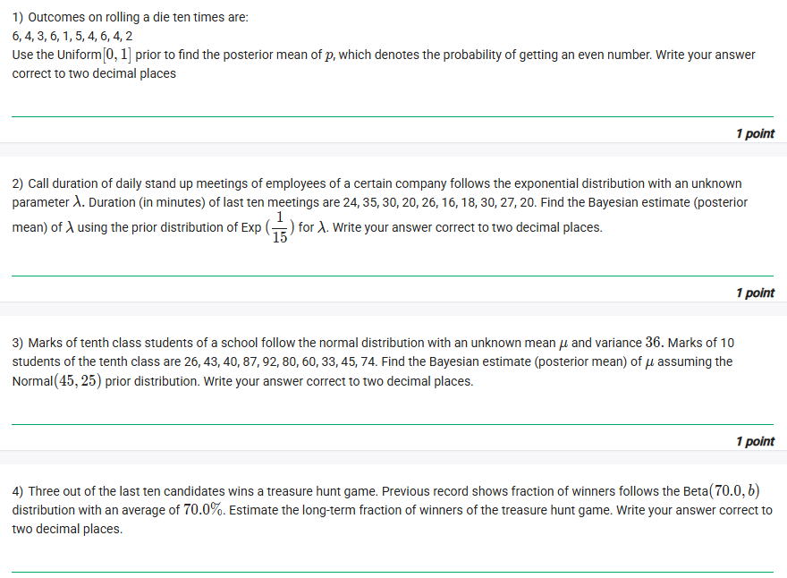
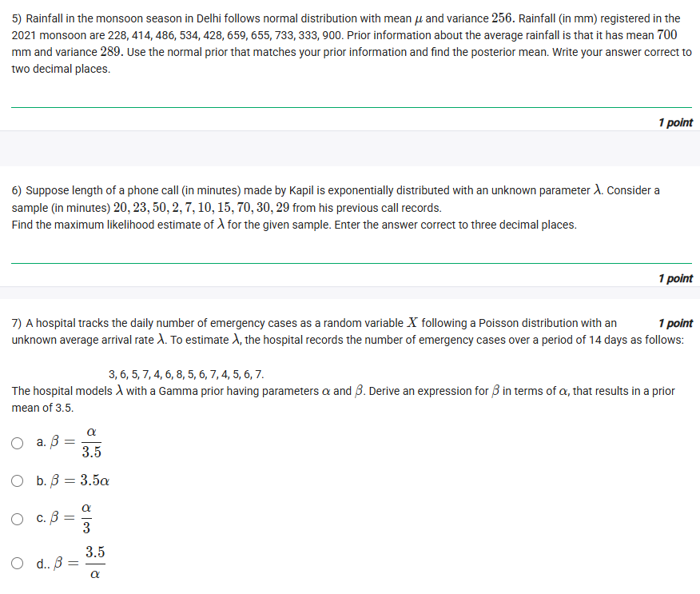
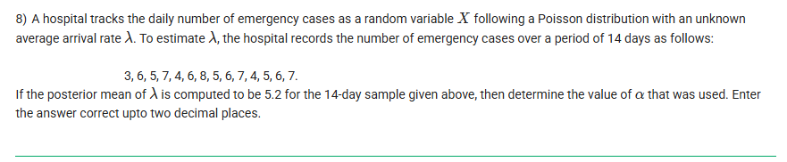
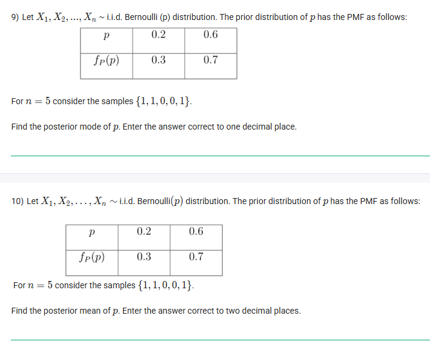
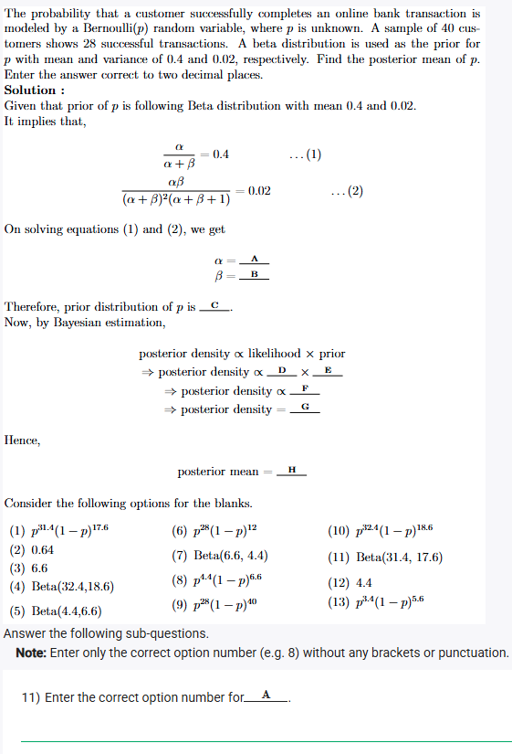
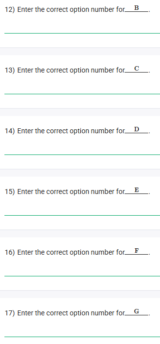
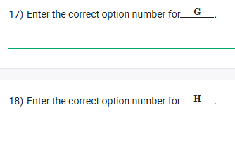

## Exercise Questions ❓

## Solutions ☀️

Here are the step-by-step solutions for each question from the uploaded images, covering the concepts of Bayesian inference, Maximum Likelihood Estimation (MLE), and Probability Distributions.


### **Question 1**
**Problem:** Outcomes on rolling a die ten times are: 6, 4, 3, 6, 1, 5, 4, 6, 4, 2. Use the Uniform[0, 1] prior to find the posterior mean of $p$, which denotes the probability of getting an even number. Write your answer correct to two decimal places.

**Concept:**
This is a **Bayesian Inference** problem using the **Beta-Binomial conjugate pair**.
* **Likelihood:** The process of rolling a die and checking for "even" or "odd" is a Bernoulli trial. The count of even numbers in $n$ trials follows a Binomial distribution.
* **Prior:** A Uniform[0, 1] distribution is equivalent to a **Beta(1, 1)** distribution.
* **Posterior:** If the prior is $\text{Beta}(\alpha, \beta)$ and we observe $k$ successes (even numbers) in $n$ trials, the posterior is $\text{Beta}(\alpha + k, \beta + (n-k))$.
* **Posterior Mean:** The mean of a $\text{Beta}(\alpha', \beta')$ distribution is $\frac{\alpha'}{\alpha' + \beta'}$.

**Solution:**
1.  **Analyze Data:**
    * Total rolls ($n$) = 10.
    * Even numbers in sample: 6, 4, 6, 4, 6, 4, 2.
    * Number of successes ($k$) = 7.
    * Number of failures ($n-k$) = 3.

2.  **Define Prior:**
    * Uniform[0, 1] $\equiv$ Beta(1, 1).
    * $\alpha_{prior} = 1$, $\beta_{prior} = 1$.

3.  **Calculate Posterior Parameters:**
    * $\alpha_{post} = \alpha_{prior} + k = 1 + 7 = 8$.
    * $\beta_{post} = \beta_{prior} + (n-k) = 1 + 3 = 4$.
    * Posterior distribution is $\text{Beta}(8, 4)$.

4.  **Calculate Posterior Mean:**
    $$\text{Mean} = \frac{\alpha_{post}}{\alpha_{post} + \beta_{post}} = \frac{8}{8 + 4} = \frac{8}{12} = \frac{2}{3}$$
    $$\text{Mean} \approx 0.666...$$

**Answer:** **0.67**



### **Question 2**
**Problem:** Call duration... follows the exponential distribution with unknown parameter $\lambda$. Durations (in mins) of last ten meetings are 24, 35, 30, 20, 26, 16, 18, 30, 27, 20. Find the Bayesian estimate (posterior mean) of $\lambda$ using the prior distribution of $\text{Exp}(\frac{1}{15})$ for $\lambda$. Write answer correct to two decimal places.

**Concept:**
This uses the **Gamma-Exponential conjugate pair**.
* **Likelihood:** For data $x$ following $\text{Exp}(\lambda)$, the likelihood is proportional to $\lambda^n e^{-\lambda \sum x_i}$.
* **Prior:** The prior is $\text{Exp}(1/15)$. In standard notation $\text{Exp}(\theta)$, $\theta$ is the rate. So the prior is proportional to $e^{-\frac{1}{15}\lambda}$. This is equivalent to a $\text{Gamma}(1, \frac{1}{15})$ distribution (Shape $\alpha=1$, Rate $\beta=1/15$).
* **Posterior:** Gamma$(\alpha + n, \beta + \sum x_i)$.
* **Posterior Mean:** For Gamma$(\alpha', \beta')$, the mean is $\frac{\alpha'}{\beta'}$.

**Solution:**
1.  **Analyze Data:**
    * $n = 10$.
    * Sum of durations ($\sum x_i$) = $24+35+30+20+26+16+18+30+27+20 = 246$.

2.  **Define Prior Parameters:**
    * Prior is Exp($1/15$) on $\lambda$. This corresponds to Gamma(1, 1/15).
    * $\alpha_{prior} = 1$.
    * $\beta_{prior} = 1/15 \approx 0.0667$.

3.  **Calculate Posterior Parameters:**
    * $\alpha_{post} = \alpha_{prior} + n = 1 + 10 = 11$.
    * $\beta_{post} = \beta_{prior} + \sum x_i = \frac{1}{15} + 246 = 246.0667$.

4.  **Calculate Posterior Mean:**
    $$\text{Mean} = \frac{11}{246.0667} \approx 0.0447$$

**Answer:** **0.04**



### **Question 3**
**Problem:** Marks of tenth class students... follow normal distribution with unknown mean $\mu$ and variance 36. Marks of 10 students are 26, 43, 40, 87, 92, 80, 60, 33, 45, 74. Find posterior mean of $\mu$ assuming $\text{Normal}(45, 25)$ prior.

**Concept:**
**Normal-Normal Conjugate (Known Variance):**
When the likelihood is Normal with known variance $\sigma^2$ and the prior is Normal($\mu_0, \sigma_0^2$), the posterior mean is a weighted average of the prior mean and the sample mean.
* **Formula:**
    $$\mu_{post} = \frac{\frac{\mu_0}{\sigma_0^2} + \frac{n\bar{x}}{\sigma^2}}{\frac{1}{\sigma_0^2} + \frac{n}{\sigma^2}}$$

**Solution:**
1.  **Analyze Data:**
    * $n = 10$.
    * Sum of marks = 580.
    * Sample mean ($\bar{x}$) = $580 / 10 = 58$.
    * Known variance ($\sigma^2$) = 36.

2.  **Define Prior:**
    * Prior mean ($\mu_0$) = 45.
    * Prior variance ($\sigma_0^2$) = 25.

3.  **Apply Formula:**
    * Prior Precision ($\tau_0$) = $1/25 = 0.04$.
    * Data Precision ($n\tau$) = $10/36 \approx 0.2778$.
    * Total Precision = $0.04 + 0.2778 = 0.3178$.
    * Weighted Sum = $\frac{45}{25} + \frac{580}{36} = 1.8 + 16.1111 = 17.9111$.
    * Posterior Mean = $\frac{17.9111}{0.3178} \approx 56.36$.

**Answer:** **56.36**



### **Question 4**
**Problem:** Three out of the last ten candidates win a treasure hunt game. Prior is $\text{Beta}(70, b)$ with an average of 70.0% (0.7). Estimate the long-term fraction of winners.

**Concept:**
**Beta-Binomial Conjugate:**
We must first determine the unknown prior parameter $b$ using the given prior mean. Then we update the Beta distribution with the new data.

**Solution:**
1.  **Find $b$:**
    * Prior is $\text{Beta}(70, b)$. Mean = 0.7.
    * Mean of Beta = $\frac{\alpha}{\alpha + b}$.
    * $\frac{70}{70 + b} = 0.7 \Rightarrow 70 = 0.7(70 + b) \Rightarrow 70 = 49 + 0.7b$.
    * $21 = 0.7b \Rightarrow b = 30$.
    * Prior is $\text{Beta}(70, 30)$.

2.  **Update with Data:**
    * $n = 10$, Wins ($k$) = 3, Losses = 7.
    * $\alpha_{post} = 70 + 3 = 73$.
    * $\beta_{post} = 30 + 7 = 37$.

3.  **Calculate Posterior Mean:**
    $$\text{Mean} = \frac{73}{73 + 37} = \frac{73}{110} \approx 0.6636$$

**Answer:** **0.66**



### **Question 5**
**Problem:** Rainfall in Delhi follows Normal distribution with $\mu$ and variance 256. Sample: 228, 414, 486, 534, 428, 659, 655, 733, 333, 900. Prior info: mean 700, variance 289. Find posterior mean.

**Concept:**
Same as Question 3 (Normal-Normal conjugate).

**Solution:**
1.  **Analyze Data:**
    * $n = 10$.
    * Sum = 5370.
    * Sample mean ($\bar{x}$) = 537.
    * Likelihood variance ($\sigma^2$) = 256.

2.  **Define Prior:**
    * $\mu_0 = 700$, $\sigma_0^2 = 289$.

3.  **Calculate:**
    * Numerator (Weighted Sum): $\frac{700}{289} + \frac{5370}{256} \approx 2.4221 + 20.9766 = 23.3987$.
    * Denominator (Total Precision): $\frac{1}{289} + \frac{10}{256} \approx 0.00346 + 0.03906 = 0.04252$.
    * Posterior Mean: $\frac{23.3987}{0.04252} \approx 550.26$.

**Answer:** **550.26**



### **Question 6**
**Problem:** Call length... Exponentially distributed with unknown $\lambda$. Sample: 20, 23, 50, 2, 7, 10, 15, 70, 30, 29. Find Maximum Likelihood Estimate (MLE) of $\lambda$.

**Concept:**
**MLE for Exponential Distribution:**
For the Exponential distribution defined as $f(x) = \lambda e^{-\lambda x}$, the MLE for the rate parameter $\lambda$ is the inverse of the sample mean.
$$\hat{\lambda}_{MLE} = \frac{1}{\bar{x}}$$

**Solution:**
1.  **Calculate Sample Mean:**
    * Sum = $20+23+50+2+7+10+15+70+30+29 = 256$.
    * $n = 10$.
    * $\bar{x} = 25.6$.

2.  **Calculate MLE:**
    $$\lambda = \frac{1}{25.6} \approx 0.03906$$

**Answer:** **0.039**



### **Question 7**
**Problem:** Hospital emergency cases... Poisson distribution ($\lambda$). Sample of 14 days provided. Prior is Gamma$(\alpha, \beta)$ with mean 3.5. Derive expression for $\beta$ in terms of $\alpha$.

**Concept:**
**Gamma Distribution Properties:**
For a Gamma distribution with shape $\alpha$ and rate $\beta$ (PDF $\propto x^{\alpha-1}e^{-\beta x}$), the mean is given by $\frac{\alpha}{\beta}$.

**Solution:**
1.  Given Prior Mean = 3.5.
2.  $\frac{\alpha}{\beta} = 3.5$.
3.  Solving for $\beta$: $\beta = \frac{\alpha}{3.5}$.

**Answer:** **Option a ($\beta = \frac{\alpha}{3.5}$)**



### **Question 8**
**Problem:** Same data as Q7. If posterior mean is 5.2, determine the value of $\alpha$ that was used.

**Concept:**
**Poisson-Gamma Conjugate:**
* Posterior is $\text{Gamma}(\alpha + \sum x_i, \beta + n)$.
* Posterior Mean = $\frac{\alpha + \sum x_i}{\beta + n}$.

**Solution:**
1.  **Analyze Data:**
    * Data: 3, 6, 5, 7, 4, 6, 8, 5, 6, 7, 4, 5, 6, 7.
    * Sum ($\sum x_i$) = 79.
    * $n = 14$.

2.  **Setup Equation:**
    * From Q7, we substitute $\beta = \frac{\alpha}{3.5}$.
    * Posterior Mean = $\frac{\alpha + 79}{\frac{\alpha}{3.5} + 14} = 5.2$.

3.  **Solve for $\alpha$:**
    $$\alpha + 79 = 5.2 \left( \frac{\alpha}{3.5} + 14 \right)$$
    $$\alpha + 79 = \left( \frac{5.2}{3.5} \right)\alpha + 72.8$$
    $$79 - 72.8 = (1.4857)\alpha - \alpha$$
    $$6.2 = 0.4857\alpha$$
    $$\alpha \approx \frac{6.2}{0.4857} \approx 12.76$$

**Answer:** **12.76**



### **Question 9**
**Problem:** Bernoulli($p$) samples {1, 1, 0, 0, 1}. Prior PMF: $P(p=0.2)=0.3$, $P(p=0.6)=0.7$. Find posterior **mode**.

**Concept:**
**Discrete Bayesian Update:**
We calculate the posterior probability for each discrete candidate value of $p$ using Bayes' Theorem:
$$P(p_i | \text{Data}) \propto P(\text{Data} | p_i) \cdot P(p_i)$$
The **Mode** is the $p_i$ with the highest posterior probability.

**Solution:**
1.  **Data:** 3 Successes, 2 Failures.
2.  **Likelihoods:**
    * For $p=0.2$: $L(0.2) = 0.2^3 \cdot 0.8^2 = 0.008 \cdot 0.64 = 0.00512$.
    * For $p=0.6$: $L(0.6) = 0.6^3 \cdot 0.4^2 = 0.216 \cdot 0.16 = 0.03456$.
3.  **Unnormalized Posteriors (Likelihood $\times$ Prior):**
    * For $p=0.2$: $0.00512 \times 0.3 = 0.001536$.
    * For $p=0.6$: $0.03456 \times 0.7 = 0.024192$.
4.  **Comparison:**
    * $0.024192 > 0.001536$.
    * The value $p=0.6$ has the higher probability.

**Answer:** **0.6**



### **Question 10**
**Problem:** Same setup as Q9. Find posterior **mean**.

**Concept:**
The posterior mean is the weighted average of the parameter values, where weights are the normalized posterior probabilities.

**Solution:**
1.  **Calculate Normalizing Constant (Evidence):**
    $$\Sigma = 0.001536 + 0.024192 = 0.025728$$
2.  **Calculate Posterior Probabilities:**
    * $P(p=0.2 | D) = \frac{0.001536}{0.025728} \approx 0.0597$.
    * $P(p=0.6 | D) = \frac{0.024192}{0.025728} \approx 0.9403$.
3.  **Calculate Mean:**
    $$E[p|D] = 0.2(0.0597) + 0.6(0.9403)$$
    $$= 0.01194 + 0.56418 = 0.57612$$

**Answer:** **0.58**


Here are the step-by-step solutions for the multi-part problem presented in the images. This problem involves finding the parameters of a Beta prior distribution and then performing Bayesian inference to find the posterior distribution and mean.


### **Part 1: Finding Prior Parameters ($\alpha$ and $\beta$)**

**Concepts:**
* **Beta Distribution Properties:** For a random variable $X \sim \text{Beta}(\alpha, \beta)$, the mean ($\mu$) and variance ($\sigma^2$) are given by:
    1.  $\mu = \frac{\alpha}{\alpha + \beta}$
    2.  $\sigma^2 = \frac{\alpha\beta}{(\alpha + \beta)^2(\alpha + \beta + 1)} = \frac{\mu(1-\mu)}{\alpha + \beta + 1}$

**Solution:**
We are given:
* Prior Mean $\mu = 0.4$
* Prior Variance $\sigma^2 = 0.02$

**Step 1: Solve for $(\alpha + \beta)$**
Using the variance formula simplified with the mean:
$$0.02 = \frac{0.4(1 - 0.4)}{(\alpha + \beta) + 1}$$
$$0.02 = \frac{0.4 \times 0.6}{\alpha + \beta + 1}$$
$$0.02(\alpha + \beta + 1) = 0.24$$
$$\alpha + \beta + 1 = \frac{0.24}{0.02} = 12$$
$$\alpha + \beta = 11$$

**Step 2: Solve for $\alpha$ (Blank A)**
From the mean formula: $\alpha = \mu(\alpha + \beta)$
$$\alpha = 0.4 \times 11 = 4.4$$

**Step 3: Solve for $\beta$ (Blank B)**
$$\beta = (\alpha + \beta) - \alpha$$
$$\beta = 11 - 4.4 = 6.6$$

**Step 4: Identify Prior Distribution (Blank C)**
The prior is $\text{Beta}(\alpha, \beta) = \text{Beta}(4.4, 6.6)$.

**Answers:**
* **11) Value for A ($\alpha$):** **12** (which corresponds to value 4.4)
* **12) Value for B ($\beta$):** **3** (which corresponds to value 6.6)
* **13) Value for C (Distribution):** **5** (which corresponds to Beta(4.4, 6.6))



### **Part 2: Setting up Bayesian Estimation**

**Concepts:**
* **Likelihood:** For a Binomial experiment with $n$ trials and $k$ successes, the likelihood function is proportional to $p^k(1-p)^{n-k}$.
* **Prior Density:** For $\text{Beta}(\alpha, \beta)$, the PDF is proportional to $p^{\alpha-1}(1-p)^{\beta-1}$.

**Solution:**
Data: $n = 40$ customers, $k = 28$ successful transactions.
Failures = $40 - 28 = 12$.

**Step 1: Identify Likelihood Term (Blank D)**
$$\text{Likelihood} \propto p^{28}(1-p)^{12}$$
This matches Option (6).

**Step 2: Identify Prior Term (Blank E)**
With $\alpha=4.4$ and $\beta=6.6$:
$$\text{Prior} \propto p^{4.4-1}(1-p)^{6.6-1}$$
$$\text{Prior} \propto p^{3.4}(1-p)^{5.6}$$
This matches Option (13).

**Answers:**
* **14) Value for D (Likelihood):** **6**
* **15) Value for E (Prior term):** **13**



### **Part 3: Posterior Calculation**

**Concepts:**
* **Conjugate Posterior:** When multiplying a Beta prior by a Binomial likelihood, the exponents add up.
    $$p^{\alpha-1}(1-p)^{\beta-1} \times p^k(1-p)^{n-k} = p^{(\alpha+k)-1}(1-p)^{(\beta+n-k)-1}$$
    The new parameters are $\alpha' = \alpha + k$ and $\beta' = \beta + (n-k)$.

**Solution:**
**Step 1: Calculate Posterior Density (Blank F)**
Combine the exponents from Likelihood (D) and Prior (E):
$$\text{Posterior} \propto p^{28} \cdot p^{3.4} \times (1-p)^{12} \cdot (1-p)^{5.6}$$
$$\text{Posterior} \propto p^{31.4}(1-p)^{17.6}$$
This matches Option (1).

**Step 2: Identify Posterior Distribution (Blank G)**
The posterior density $p^{31.4}(1-p)^{17.6}$ corresponds to a Beta distribution where:
$$\alpha'_{post} - 1 = 31.4 \implies \alpha'_{post} = 32.4$$
$$\beta'_{post} - 1 = 17.6 \implies \beta'_{post} = 18.6$$
Distribution: $\text{Beta}(32.4, 18.6)$.
This matches Option (4).

**Step 3: Calculate Posterior Mean (Blank H)**
$$\text{Mean} = \frac{\alpha'}{\alpha' + \beta'}$$
$$\text{Mean} = \frac{32.4}{32.4 + 18.6} = \frac{32.4}{51}$$
$$\text{Mean} \approx 0.63529...$$
Rounding to two decimal places: **0.64**
This matches Option (2).

**Answers:**
* **16) Value for F (Posterior Density):** **1**
* **17) Value for G (Posterior Dist):** **4**
* **18) Value for H (Posterior Mean):** **2**
