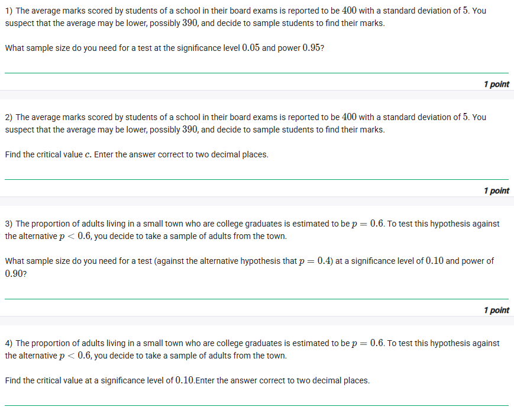
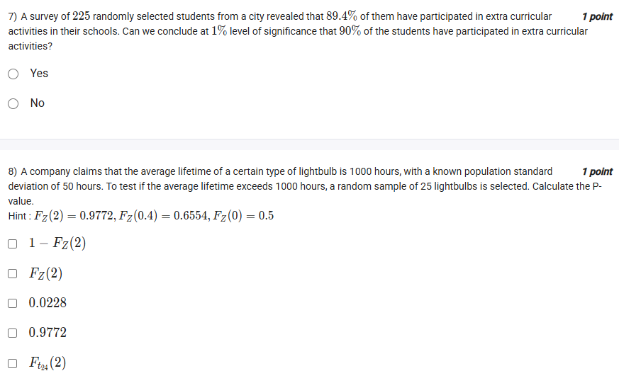
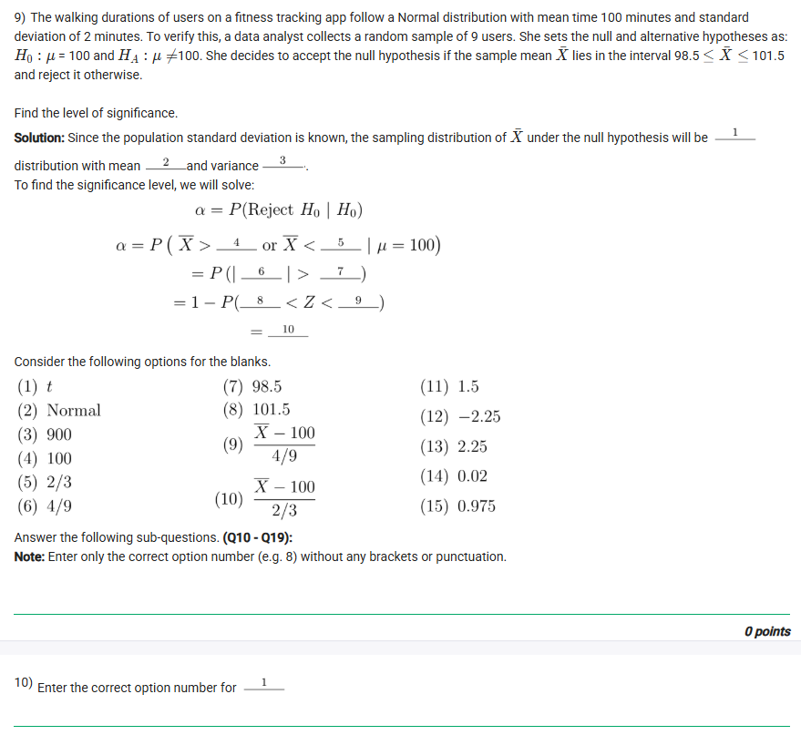
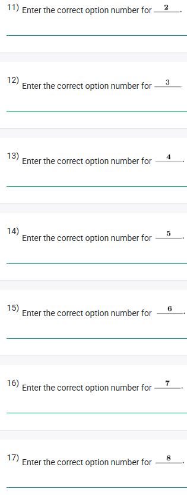
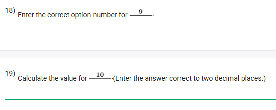
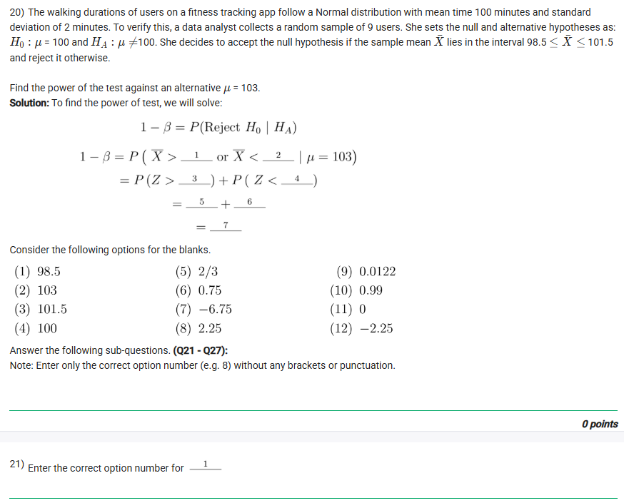
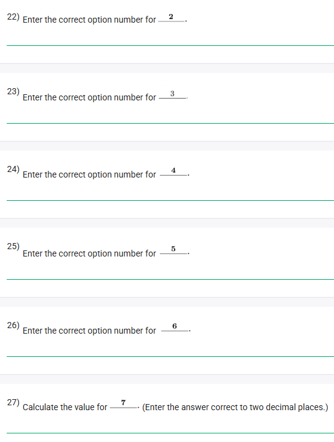

## Exercise Questions ❓

## Solutions 🟩

Here are the detailed solutions and concept explanations for the statistical problems provided in the images.


### **Question 1**
**Problem:** The average marks scored by students... is reported to be 400 with a standard deviation of 5. You suspect the average may be lower, possibly 390... What sample size do you need for a test at significance level 0.05 and power 0.95?

**Concept: Sample Size for Hypothesis Testing (Mean)**
To calculate the sample size ($n$) required to detect a specific difference between the null hypothesis mean ($\mu_0$) and an alternative mean ($\mu_1$) with a specific Power ($1-\beta$) and Significance Level ($\alpha$), we use the following formula for a one-sided Z-test:

$$n = \left( \frac{\sigma (z_{\alpha} + z_{\beta})}{\mu_0 - \mu_1} \right)^2$$

* **$\sigma$:** Population standard deviation.
* **$z_{\alpha}$:** Critical Z-value for the significance level (Type I error).
* **$z_{\beta}$:** Critical Z-value for the power (Type II error).
* **$\mu_0 - \mu_1$:** The "Effect Size" or difference we want to detect.

**Solution:**
1.  **Identify parameters:**
    * $\mu_0 = 400$
    * $\mu_1 = 390$
    * $\sigma = 5$
    * $\alpha = 0.05$ (Significance) $\rightarrow$ From Z-table, $z_{0.05} = 1.645$ (for one-tail).
    * Power = $0.95 \rightarrow \beta = 1 - 0.95 = 0.05 \rightarrow z_{0.05} = 1.645$.

2.  **Apply Formula:**
    $$n = \left( \frac{5 (1.645 + 1.645)}{400 - 390} \right)^2$$
    $$n = \left( \frac{5 (3.29)}{10} \right)^2$$
    $$n = \left( \frac{16.45}{10} \right)^2$$
    $$n = (1.645)^2 \approx 2.706$$

3.  **Round Up:** Sample sizes must be integers, and we always round up to ensure the power requirement is met.

**Answer:** **3**



### **Question 2**
**Problem:** Find the critical value $c$. Enter the answer correct to two decimal places.

**Concept: Critical Value ($c$) in Sample Mean Distribution**
The critical value $c$ is the specific sample mean ($\bar{x}$) that serves as the boundary between rejecting and failing to reject the null hypothesis. For a lower-tailed test (suspecting average is *lower*), the critical region is on the left.

$$c = \mu_0 - z_{\alpha} \left( \frac{\sigma}{\sqrt{n}} \right)$$

**Solution:**
1.  **Identify parameters:**
    * $\mu_0 = 400$
    * $z_{\alpha} = 1.645$ (for $\alpha=0.05$)
    * $\sigma = 5$
    * $n = 3$ (Calculated in Question 1).

2.  **Calculate Standard Error (SE):**
    $$SE = \frac{\sigma}{\sqrt{n}} = \frac{5}{\sqrt{3}} \approx 2.8868$$

3.  **Calculate $c$:**
    $$c = 400 - (1.645 \times 2.8868)$$
    $$c = 400 - 4.748$$
    $$c = 395.252$$

**Answer:** **395.25**



### **Question 3**
**Problem:** The proportion of adults... is estimated to be $p=0.6$. Test against alternative $p < 0.6$... What sample size is needed for a test (against alternative $p=0.4$) at significance level 0.10 and power 0.90?

**Concept: Sample Size for Proportions**
When dealing with proportions, the variance depends on $p$. The formula for sample size includes variances under both the null ($p_0$) and alternative ($p_1$) hypotheses.

$$n = \left( \frac{z_{\alpha}\sqrt{p_0(1-p_0)} + z_{\beta}\sqrt{p_1(1-p_1)}}{p_0 - p_1} \right)^2$$

**Solution:**
1.  **Identify parameters:**
    * $p_0 = 0.6 \Rightarrow q_0 = 0.4$
    * $p_1 = 0.4 \Rightarrow q_1 = 0.6$
    * $\alpha = 0.10 \Rightarrow z_{0.10} = 1.282$ (One-tail)
    * Power = $0.90 \Rightarrow \beta = 0.10 \Rightarrow z_{0.10} = 1.282$

2.  **Calculate Terms:**
    * Numerator Term 1: $1.282\sqrt{0.6 \times 0.4} = 1.282\sqrt{0.24} \approx 1.282(0.4899) \approx 0.628$
    * Numerator Term 2: $1.282\sqrt{0.4 \times 0.6} = 1.282\sqrt{0.24} \approx 0.628$
    * Denominator: $0.6 - 0.4 = 0.2$

3.  **Apply Formula:**
    $$n = \left( \frac{0.628 + 0.628}{0.2} \right)^2$$
    $$n = \left( \frac{1.256}{0.2} \right)^2$$
    $$n = (6.28)^2 \approx 39.43$$

4.  **Round Up:**
    $n = 40$

**Answer:** **40**



### **Question 4**
**Problem:** Find the critical value at a significance level of 0.10. Enter the answer correct to two decimal places.

**Concept: Critical Value for Proportion**
We need to find the specific proportion value ($p_c$) below which we reject the Null Hypothesis.

$$c = p_0 - z_{\alpha} \sqrt{\frac{p_0(1-p_0)}{n}}$$

**Solution:**
1.  **Parameters:**
    * $p_0 = 0.6$
    * $z_{0.10} = 1.282$
    * $n = 40$ (from Question 3)

2.  **Calculate:**
    $$c = 0.6 - 1.282 \sqrt{\frac{0.6 \times 0.4}{40}}$$
    $$c = 0.6 - 1.282 \sqrt{0.006}$$
    $$c = 0.6 - 1.282 (0.07746)$$
    $$c = 0.6 - 0.0993$$
    $$c = 0.5007$$

**Answer:** **0.50**



### **Question 5**
**Problem:** $X \sim \text{Normal}(\mu, 9)$. $n=100$, sample mean $\bar{x} = 11.8$. $H_0: \mu = 10.5$ vs $H_1: \mu \neq 10.5$. Choose correct options.

**Concept: Z-Test for Mean (Two-Tailed)**
* **Variance:** Given as 9, so $\sigma = \sqrt{9} = 3$.
* **Test Statistic:** Since population variance is known, we use the **Z-test**.
* **Direction:** The alternative hypothesis has $\neq$, making it a **Two-tailed** test.

**Calculation:**
$$Z = \frac{\bar{x} - \mu_0}{\sigma / \sqrt{n}} = \frac{11.8 - 10.5}{3 / \sqrt{100}} = \frac{1.3}{0.3} = 4.33$$

**Decision:**
* A Z-score of 4.33 is extreme.
* Critical Z for $\alpha=0.05$ is $\pm 1.96$.
* Critical Z for $\alpha=0.10$ is $\pm 1.645$.
* Since $4.33 > 1.96$, we **Reject $H_0$** at both levels.

**Correct Options:**
* [x] Test statistic used is sample mean, $\bar{X}$.
* [x] Two tailed z-test is used.
* [x] Reject $H_0$ at a significance level of 0.10.
* [x] Reject $H_0$ at a significance level of 0.05.



### **Question 6**
**Problem:** Sample of 36 marshmallow packets, average 145g, SD 5g. Test $H_0: \mu = 150$ vs $H_1: \mu < 150$ at 0.05 level.

**Solution:**
1.  **Calculate Z-score:**
    $$Z = \frac{145 - 150}{5 / \sqrt{36}} = \frac{-5}{5/6} = -6$$
2.  **Critical Value:**
    For left-tail $\alpha=0.05$, $z_{crit} = -1.645$.
3.  **Conclusion:**
    $-6 < -1.645$. The result falls deep in the rejection region.
    We **Reject the Null Hypothesis**.
    This means we accept the Alternative Hypothesis: The average weight is **less than 150 grams**.

**Answer Option:**
* **On average, it weighs less than 150 grams.**



### **Question 7**
**Problem:** Survey of 225 students, 89.4% participated in extracurriculars. Can we conclude at 1% level of significance that 90% of the students have participated?

**Concept: Interpretation of "Concluding"**
* $H_0: p = 0.90$
* $H_1: p \neq 0.90$ (Implied two-sided unless "less than" is specified, but let's check the Z score).
* $\hat{p} = 0.894$.

**Calculation:**
$$Z = \frac{0.894 - 0.90}{\sqrt{\frac{0.9(0.1)}{225}}} = \frac{-0.006}{\sqrt{0.0004}} = \frac{-0.006}{0.02} = -0.3$$

**Conclusion:**
* $|Z| = 0.3$. The critical value for 1% ($\alpha=0.01$) is $2.576$.
* Since $0.3 < 2.576$, we **Fail to Reject $H_0$**.
* **Crucial Logic:** In statistics, we never "Conclude that $H_0$ is true." We only conclude that *we don't have enough evidence to say it's false*.
* However, if the question asks "Can we conclude that 90% have participated?", it is asking if we can statistically affirm the Null Hypothesis as a proven fact. The answer to "Can we conclude [Null]?" is almost always **No**.
* *Alternatively*, if the question implies "Is the claim of 90% plausible?", the answer is Yes.
* **Standard Academic Answer:** "No". (Because we cannot prove the Null Hypothesis, we can only fail to disprove it).

**Answer:** **No**



### **Question 8**
**Problem:** Test if average lifetime exceeds 1000 hours ($H_1: \mu > 1000$). Calculate the P-value.
* Note: The options suggest a calculated Z-score of 2. ($F_Z(2)$ appears in the options).
* Let's check: $1 - F_Z(2) = 1 - 0.9772 = 0.0228$.

**Concept: P-Value for Right-Tailed Test**
For a test checking if the mean is *greater* than a value (Right/Upper Tail), the P-value is the area under the curve to the **right** of the calculated Z-score.
$$P\text{-value} = P(Z > z_{calc}) = 1 - P(Z < z_{calc}) = 1 - F_Z(z_{calc})$$

**Solution:**
Looking at the options, the one that represents "Area to the right of Z=2" is:
$$1 - F_Z(2)$$
This equals $1 - 0.9772 = 0.0228$.

**Answer Options:**
* **$1 - F_Z(2)$**
* **$0.0228$**
*(Both represent the same correct value, but "0.0228" is the calculated final answer).*


Here are the step-by-step solutions for the hypothesis testing case study about the fitness tracking app.

### **Problem Context**
* **Population:** Normal distribution.
* **Mean ($\mu$):** 100 minutes.
* **Standard Deviation ($\sigma$):** 2 minutes.
* **Sample Size ($n$):** 9 users.
* **Hypothesis:** $H_0: \mu = 100$ vs $H_A: \mu \neq 100$.
* **Decision Rule:** Accept $H_0$ if $98.5 \le \bar{X} \le 101.5$. Reject otherwise.

---


### **Question 10 (Blank 1)**
**Prompt:** Since the population standard deviation is known, the sampling distribution of $\bar{X}$ under the null hypothesis will be [1]...

**Concept: Sampling Distribution properties**
When the parent population is normally distributed, the sampling distribution of the sample mean ($\bar{X}$) is also normally distributed, regardless of the sample size. This is a fundamental property of the normal distribution.

**Answer:** **2**
(Option 2 corresponds to "Normal")



### **Question 11 (Blank 2)**
**Prompt:** ...distribution with mean [2]...

**Concept: Mean of the Sampling Distribution ($\mu_{\bar{x}}$)**
The mean of the sampling distribution is always equal to the population mean ($\mu$).
$$\mu_{\bar{x}} = \mu$$
Given in the problem, $\mu = 100$.

**Answer:** **4**
(Option 4 corresponds to "100")



### **Question 12 (Blank 3)**
**Prompt:** ...and variance [3].

**Concept: Variance of the Sampling Distribution ($\sigma^2_{\bar{x}}$)**
The variance of the sample mean is the population variance divided by the sample size ($n$).
* Population Standard Deviation ($\sigma$) = 2
* Population Variance ($\sigma^2$) = $2^2 = 4$
* Sample size ($n$) = 9

$$\text{Variance} (\sigma^2_{\bar{x}}) = \frac{\sigma^2}{n} = \frac{4}{9}$$

**Answer:** **6**
(Option 6 corresponds to "4/9")



### **Question 13 (Blank 4)**
**Prompt:** $\alpha = P(\bar{X} > \text{[4]} \text{ or } ...)$

**Concept: Rejection Region (Upper Tail)**
The problem states that we **accept** $H_0$ if the sample mean is between 98.5 and 101.5. Conversely, we **reject** $H_0$ (which defines $\alpha$, the significance level) if the mean is *outside* this range.
The "greater than" condition corresponds to the upper boundary of the acceptance interval.
* Upper boundary = 101.5

**Answer:** **8**
(Option 8 corresponds to "101.5")



### **Question 14 (Blank 5)**
**Prompt:** ... or $\bar{X} < \text{[5]} | \mu = 100)$

**Concept: Rejection Region (Lower Tail)**
Similar to the previous step, we reject $H_0$ if the sample mean is **less than** the lower boundary of the acceptance interval.
* Lower boundary = 98.5

**Answer:** **7**
(Option 7 corresponds to "98.5")



### **Question 15 (Blank 6)**
**Prompt:** $= P( | \text{[6]} | > \dots )$

**Concept: Standardization (Z-score)**
To calculate probabilities, we convert the sample mean ($\bar{X}$) into a standard Z-score. The formula for Z when dealing with a sample mean is:
$$Z = \frac{\bar{X} - \mu}{\sigma / \sqrt{n}}$$

Substituting the values:
* $\mu = 100$
* Standard Error ($\sigma / \sqrt{n}$) = $\sqrt{4/9} = 2/3$

So, the expression for Z is:
$$\frac{\bar{X} - 100}{2/3}$$

**Answer:** **10**
(Option 10 corresponds to $\frac{\bar{X} - 100}{2/3}$)



### **Question 16 (Blank 7)**
**Prompt:** $= P( | Z | > \text{[7]} )$

**Concept: Calculating Critical Z-value**
We need to find the Z-score corresponding to our critical boundaries (98.5 and 101.5).
Using the upper boundary (101.5):
$$Z = \frac{101.5 - 100}{2/3} = \frac{1.5}{0.666...} = \frac{1.5}{2/3} = 2.25$$

So, we are looking for the probability that the absolute value of Z is greater than 2.25.

**Answer:** **13**
(Option 13 corresponds to "2.25")



### **Question 17 (Blank 8)**
**Prompt:** $= 1 - P( \text{[8]} < Z < \dots )$

**Concept: Complement Rule**
The probability of being in the *rejection* region ($|Z| > 2.25$) is equal to 1 minus the probability of being in the *acceptance* region.
The acceptance region is the interval between the negative and positive critical Z-values.
* Lower limit Z = -2.25

**Answer:** **12**
(Option 12 corresponds to "-2.25")



### **Question 18 (Blank 9)**
**Prompt:** $= 1 - P( \dots < Z < \text{[9]} )$

**Concept: Acceptance Region Upper Limit**
Continuing from the previous step, the upper limit of the acceptance region in terms of Z-score is the positive critical value.
* Upper limit Z = +2.25

**Answer:** **13**
(Option 13 corresponds to "2.25")



### **Question 19 (Blank 10)**
**Prompt:** Calculate the value for [10] (Enter the answer correct to two decimal places.)

**Concept: Final Calculation of Significance Level ($\alpha$)**
We need to evaluate: $1 - P(-2.25 < Z < 2.25)$.
1.  Find the area under the normal curve between -2.25 and 2.25.
    * Using a Z-table, $P(Z < 2.25) \approx 0.9878$.
    * $P(Z < -2.25) \approx 0.0122$.
    * Area between = $0.9878 - 0.0122 = 0.9756$.
2.  Subtract from 1.
    * $\alpha = 1 - 0.9756 = 0.0244$.

Rounding to two decimal places:
**0.02**

**Answer:** **0.02**


Here are the detailed step-by-step solutions for the statistics case study questions. I have grouped them by the two main calculations: finding the **Significance Level ($\alpha$)** and finding the **Power of the Test ($1-\beta$)**.

---

### **Part 1: Calculating Significance Level ($\alpha$)**

**Context:**
* Population Mean ($\mu$) = 100
* Population Standard Deviation ($\sigma$) = 2
* Sample Size ($n$) = 9
* Hypothesis: $H_0: \mu = 100$ vs $H_A: \mu \neq 100$
* Decision Rule: Accept $H_0$ if $98.5 \le \bar{X} \le 101.5$. Reject otherwise.


**Question 10 (Blank 1)**
**Concept:** Sampling Distribution of the Mean
When the population follows a Normal distribution, the sampling distribution of the sample mean ($\bar{X}$) also follows a Normal distribution, regardless of sample size.

**Answer:** **2** (Option: "Normal")



**Question 11 (Blank 2)**
**Concept:** Mean of Sampling Distribution
The mean of the sampling distribution ($\mu_{\bar{x}}$) is equal to the population mean ($\mu$).
$$\mu_{\bar{x}} = \mu = 100$$

**Answer:** **4** (Option: "100")



**Question 12 (Blank 3)**
**Concept:** Variance of Sampling Distribution
The variance of the sample mean is the population variance divided by the sample size ($n$).
* Population Variance ($\sigma^2$) = $2^2 = 4$
* Sample Size ($n$) = 9
* Variance ($\sigma_{\bar{x}}^2$) = $4/9$

**Answer:** **6** (Option: "4/9")



**Question 13 (Blank 4)**
**Concept:** Rejection Region (Upper Bound)
We reject the null hypothesis if the sample mean falls outside the acceptance interval $[98.5, 101.5]$. The upper rejection region is when $\bar{X}$ is greater than the upper limit.
$$\text{Upper Limit} = 101.5$$

**Answer:** **8** (Option: "101.5")



**Question 14 (Blank 5)**
**Concept:** Rejection Region (Lower Bound)
Similarly, the lower rejection region is when $\bar{X}$ is less than the lower limit of the acceptance interval.
$$\text{Lower Limit} = 98.5$$

**Answer:** **7** (Option: "98.5")



**Question 15 (Blank 6)**
**Concept:** Z-Score Formula
To standardize the sample mean, we use the Z-score formula:
$$Z = \frac{\bar{X} - \mu}{\sigma/\sqrt{n}}$$
$$Z = \frac{\bar{X} - 100}{2/3}$$
The question asks for the absolute value term inside the probability function $P(|\dots| > \dots)$, which represents the standardized distance from the mean.

**Answer:** **10** (Option: $\frac{\bar{X} - 100}{2/3}$)



**Question 16 (Blank 7)**
**Concept:** Critical Z-Value
Calculate the Z-score for the boundary value (101.5).
$$Z = \frac{101.5 - 100}{2/3} = \frac{1.5}{0.667} = 2.25$$
So, we reject if $|Z| > 2.25$.

**Answer:** **13** (Option: "2.25")



**Question 17 (Blank 8)**
**Concept:** Acceptance Region (Lower Z)
The probability of rejection is $1 - P(\text{Acceptance})$. The acceptance region corresponds to Z-scores between the negative and positive critical values.
Lower Z boundary = $-2.25$

**Answer:** **12** (Option: "-2.25")



**Question 18 (Blank 9)**
**Concept:** Acceptance Region (Upper Z)
Upper Z boundary = $+2.25$

**Answer:** **13** (Option: "2.25")



**Question 19 (Blank 10)**
**Concept:** Calculating Significance Level ($\alpha$)
$$\alpha = 1 - P(-2.25 < Z < 2.25)$$
Using a standard normal table:
* $P(Z < 2.25) \approx 0.9878$
* $P(Z < -2.25) \approx 0.0122$
* Area between = $0.9878 - 0.0122 = 0.9756$
* $\alpha = 1 - 0.9756 = 0.0244$
Rounding to two decimal places:

**Answer:** **0.02**


---

### **Part 2: Calculating Power of the Test**

**Context:**
* We are now assuming the **Alternative Hypothesis is true**, specifically that the true mean $\mu = 103$.
* We still use the *original* decision rules (Reject if $\bar{X} > 101.5$ or $\bar{X} < 98.5$).
* Power ($1-\beta$) is the probability of correctly rejecting the null hypothesis given that $\mu = 103$.


**Question 21 (Blank 1)**
**Concept:** Rejection Criteria (Upper)
The rejection rule does not change. We still reject if the sample mean is greater than the upper critical limit established in the design of the test.
$$\bar{X} > 101.5$$

**Answer:** **3** (Option: "101.5")



**Question 22 (Blank 2)**
**Concept:** Rejection Criteria (Lower)
We also reject if the sample mean is less than the lower critical limit.
$$\bar{X} < 98.5$$

**Answer:** **1** (Option: "98.5")



**Question 23 (Blank 3)**
**Concept:** Standardizing Upper Bound with New Mean
We calculate the Z-score for $X = 101.5$ using the **new mean $\mu = 103$**.
$$Z = \frac{101.5 - 103}{2/3} = \frac{-1.5}{0.667} = -2.25$$
So the condition $\bar{X} > 101.5$ becomes $Z > -2.25$.

**Answer:** **12** (Option: "-2.25")



**Question 24 (Blank 4)**
**Concept:** Standardizing Lower Bound with New Mean
We calculate the Z-score for $X = 98.5$ using $\mu = 103$.
$$Z = \frac{98.5 - 103}{2/3} = \frac{-4.5}{0.667} = -6.75$$
So the condition $\bar{X} < 98.5$ becomes $Z < -6.75$.

**Answer:** **7** (Option: "-6.75")



**Question 25 (Blank 5)**
**Concept:** Probability Calculation (Term 1)
We need to find $P(Z > -2.25)$.
Using symmetry, this is equal to $P(Z < 2.25)$.
From the Z-table: $P(Z < 2.25) \approx 0.9878$.
Rounding to match options:

**Answer:** **10** (Option: "0.99")



**Question 26 (Blank 6)**
**Concept:** Probability Calculation (Term 2)
We need to find $P(Z < -6.75)$.
A Z-score of -6.75 is extremely far in the left tail. The area to the left is effectively zero.

**Answer:** **11** (Option: "0")



**Question 27 (Blank 7)**
**Concept:** Final Power Calculation
Total Power = (Probability from Term 1) + (Probability from Term 2)
$$\text{Power} = 0.99 + 0 = 0.99$$
This means there is a 99% chance the test will correctly detect that the mean has shifted to 103 minutes.

**Answer:** **0.99**
