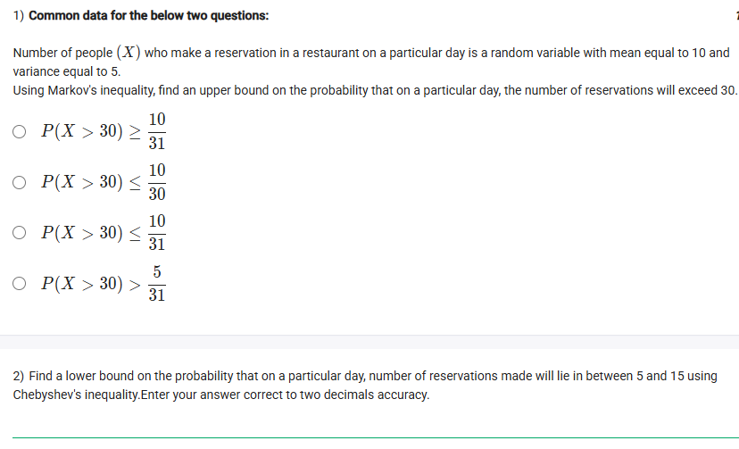
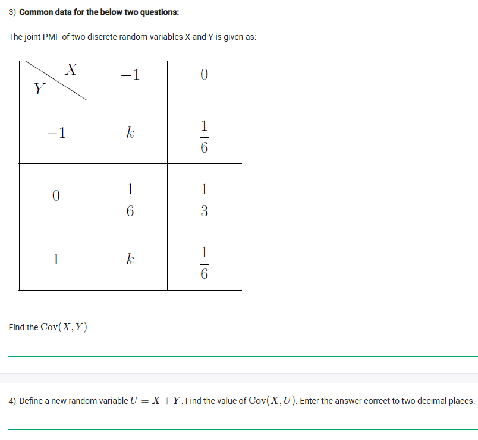
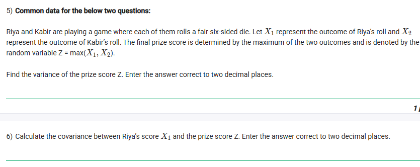
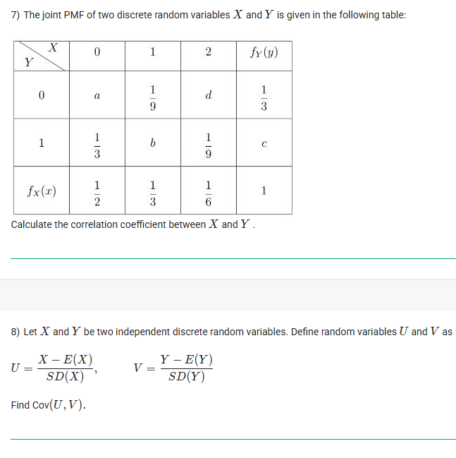
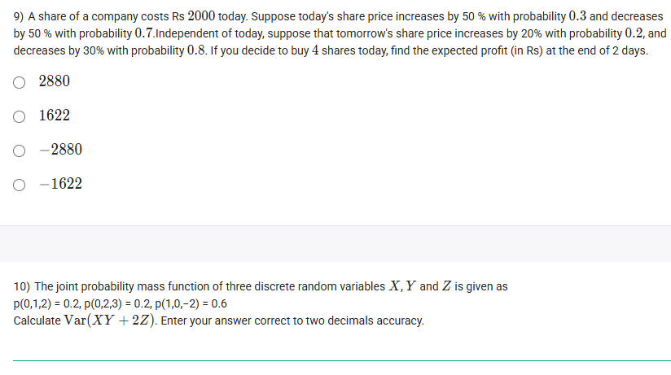
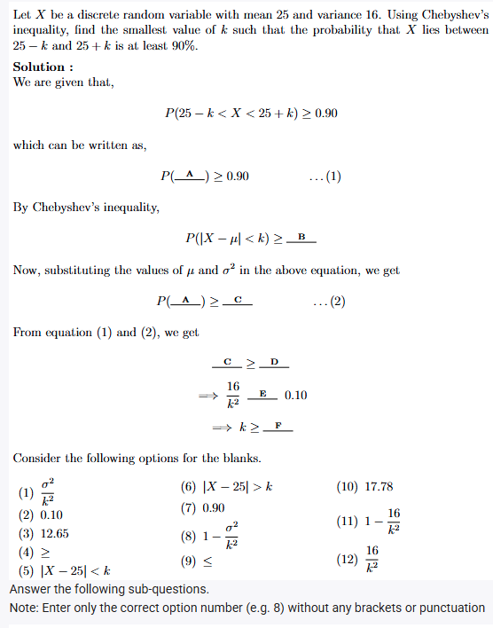

## Exercise Questions 🧯

## Exercise Solutions 🤘

Good morning! Here in India on this Wednesday, let's explore this excellent collection of questions covering a range of important topics in probability and statistics.

---

### **Questions 1 & 2: Markov's and Chebyshev's Inequalities** (from file `image_996640.png`)

**Common Data:**
The number of people ($X$) who make a reservation in a restaurant on a particular day is a random variable with mean $E(X) = \mu = 10$ and variance $Var(X) = \sigma^2 = 5$.

---
#### **1) Using Markov's inequality, find an upper bound on the probability that on a particular day, the number of reservations will exceed 30.**

**Core Concept: Markov's Inequality**
For a non-negative random variable $X$ and any constant $a > 0$, Markov's inequality provides an upper bound on the probability that $X$ is greater than or equal to $a$:
$$P(X \ge a) \le \frac{E(X)}{a}$$

**Detailed Solution:**
1.  The question asks for the probability that the number of reservations will "exceed 30." Assuming the number of people is a discrete integer, "exceeding 30" means $X > 30$, which is equivalent to $X \ge 31$.
2.  We apply Markov's inequality with $a = 31$ and the given mean $E(X) = 10$.
    $$P(X \ge 31) \le \frac{E(X)}{31} = \frac{10}{31}$$
3.  Since the event $X > 30$ is the same as $X \ge 31$ for discrete values, the upper bound is $\frac{10}{31}$.

**Final Answer:** $P(X > 30) \le \frac{10}{31}$

---
#### **2) Find a lower bound on the probability that on a particular day, number of reservations made will lie in between 5 and 15 using Chebyshev's inequality.**

**Core Concept: Chebyshev's Inequality**
This inequality provides a bound on how close values are to the mean. One form states:
$$P(|X - \mu| < k\sigma) \ge 1 - \frac{1}{k^2}$$
where $\mu$ is the mean, $\sigma$ is the standard deviation, and $k$ is a positive constant.

**Detailed Solution:**
1.  **Identify the parameters:** $\mu = 10$, $\sigma^2 = 5$, so $\sigma = \sqrt{5}$.
2.  **Rewrite the interval** in the form $|X - \mu| < c$:
    * The interval is $5 < X < 15$.
    * Subtract the mean (10) from all parts: $5 - 10 < X - 10 < 15 - 10$.
    * This simplifies to $-5 < X - 10 < 5$, which is equivalent to $|X - 10| < 5$.
3.  **Find the value of k:** We match our interval to the form in the inequality: $|X - \mu| < k\sigma$.
    * $|X - 10| < 5$ and $|X - 10| < k\sqrt{5}$.
    * So, $k\sqrt{5} = 5 \implies k = \frac{5}{\sqrt{5}} = \sqrt{5}$.
4.  **Apply the inequality:**
    * $P(5 < X < 15) \ge 1 - \frac{1}{k^2} = 1 - \frac{1}{(\sqrt{5})^2} = 1 - \frac{1}{5} = \frac{4}{5} = 0.8$.

**Final Answer:** The lower bound is **0.80**.


---

### **Questions 3 & 4: Covariance** (from file `image_99635c.png`)

**Common Data:**
The joint PMF of two discrete random variables X and Y is given in the table.

---
#### **3) Find the Cov(X, Y).**

**Core Concept:** The covariance between two random variables X and Y is defined as $Cov(X, Y) = E(XY) - E(X)E(Y)$.

**Detailed Solution:**
1.  **Find k:** The sum of all probabilities in the table must equal 1.
    * $k + \frac{1}{6} + \frac{1}{6} + \frac{1}{3} + k + \frac{1}{6} = 1 \implies 2k + \frac{3}{6} + \frac{1}{3} = 1 \implies 2k + \frac{1}{2} + \frac{1}{3} = 1 \implies 2k + \frac{5}{6} = 1 \implies 2k = \frac{1}{6} \implies k = \frac{1}{12}$.
2.  **Find the marginal probabilities and expectations:**
    * $P(X=-1) = k + \frac{1}{6} + k = 2(\frac{1}{12}) + \frac{1}{6} = \frac{1}{6} + \frac{1}{6} = \frac{1}{3}$.
    * $P(X=0) = \frac{1}{6} + \frac{1}{3} + \frac{1}{6} = \frac{2}{3}$.
    * $E(X) = (-1)(\frac{1}{3}) + (0)(\frac{2}{3}) = -\frac{1}{3}$.
    * $P(Y=-1) = k + \frac{1}{6} = \frac{1}{12} + \frac{2}{12} = \frac{3}{12} = \frac{1}{4}$.
    * $P(Y=0) = \frac{1}{6} + \frac{1}{3} = \frac{1}{2}$.
    * $P(Y=1) = k + \frac{1}{6} = \frac{1}{4}$.
    * $E(Y) = (-1)(\frac{1}{4}) + (0)(\frac{1}{2}) + (1)(\frac{1}{4}) = 0$.
3.  **Find E(XY):** We sum the product $xy \cdot P(X=x, Y=y)$ over all cells where the product isn't zero.
    * $E(XY) = (-1)(-1)P(-1, -1) + (-1)(1)P(-1, 1) = (1)(k) + (-1)(k) = k - k = 0$.
4.  **Calculate Covariance:**
    * $Cov(X, Y) = E(XY) - E(X)E(Y) = 0 - (-\frac{1}{3})(0) = 0$.

**Final Answer:** The covariance is **0**.

---
#### **4) Define a new random variable $U = X + Y$. Find the value of Cov(X, U).**

**Core Concept: Properties of Covariance**
Covariance is linear. A key property is $Cov(A, B+C) = Cov(A, B) + Cov(A, C)$. Also, the covariance of a variable with itself is its variance: $Cov(X, X) = Var(X)$.

**Detailed Solution:**
1.  **Expand the expression:**
    * $Cov(X, U) = Cov(X, X+Y) = Cov(X, X) + Cov(X, Y)$.
2.  **Substitute known values:**
    * $Cov(X, U) = Var(X) + Cov(X, Y)$.
    * From the previous question, we know $Cov(X, Y) = 0$.
    * So, $Cov(X, U) = Var(X)$.
3.  **Calculate Var(X):** We need $Var(X) = E(X^2) - [E(X)]^2$.
    * We already know $E(X) = -1/3$.
    * $E(X^2) = (-1)^2 P(X=-1) + (0)^2 P(X=0) = (1)(\frac{1}{3}) + 0 = \frac{1}{3}$.
    * $Var(X) = \frac{1}{3} - (-\frac{1}{3})^2 = \frac{1}{3} - \frac{1}{9} = \frac{3}{9} - \frac{1}{9} = \frac{2}{9}$.
4.  **Convert to decimal:** $2 \div 9 \approx 0.2222...$

**Final Answer:** **0.22**


---

### **Questions 5 & 6: Variance and Covariance of a Maximum** (from file `image_9962f8.png`)

**Common Data:**
Riya and Kabir are playing a game where each of them rolls a fair six-sided die. Let $X_1$ represent the outcome of Riya's roll and $X_2$ represent the outcome of Kabir's roll. The final prize score is determined by the maximum of the two outcomes and is denoted by the random variable $Z = \max(X_1, X_2)$.

---
#### **5) Find the variance of the prize score Z.**

**Core Concept:** $Var(Z) = E(Z^2) - [E(Z)]^2$. To find these expectations, we first need the probability mass function (PMF) of Z.

**Detailed Solution:**
1.  **Find the PMF of Z:** The easiest way is to first find the CDF, $F_Z(k) = P(Z \le k)$.
    * $P(Z \le k) = P(\max(X_1, X_2) \le k) = P(X_1 \le k \text{ and } X_2 \le k)$.
    * Since the rolls are independent, this is $P(X_1 \le k) \cdot P(X_2 \le k) = (\frac{k}{6}) \cdot (\frac{k}{6}) = \frac{k^2}{36}$.
    * Now, the PMF is $P(Z=k) = F_Z(k) - F_Z(k-1) = \frac{k^2}{36} - \frac{(k-1)^2}{36} = \frac{k^2 - (k^2 - 2k + 1)}{36} = \frac{2k-1}{36}$ for $k=1, 2, ..., 6$.
2.  **Calculate E(Z):**
    * $E(Z) = \sum_{k=1}^{6} k \cdot P(Z=k) = \frac{1}{36}\sum_{k=1}^{6} k(2k-1) = \frac{1}{36}\sum_{k=1}^{6} (2k^2 - k)$
    * Using sum formulas: $\frac{1}{36}[2(\frac{6(7)(13)}{6}) - (\frac{6(7)}{2})] = \frac{1}{36}[2(91) - 21] = \frac{161}{36}$.
3.  **Calculate E(Z²):**
    * $E(Z^2) = \sum_{k=1}^{6} k^2 \cdot P(Z=k) = \frac{1}{36}\sum_{k=1}^{6} k^2(2k-1) = \frac{1}{36}\sum_{k=1}^{6} (2k^3 - k^2)$
    * Using sum formulas: $\frac{1}{36}[2(\frac{6(7)}{2})^2 - (\frac{6(7)(13)}{6})] = \frac{1}{36}[2(21^2) - 91] = \frac{1}{36}[882 - 91] = \frac{791}{36}$.
4.  **Calculate Var(Z):**
    * $Var(Z) = \frac{791}{36} - (\frac{161}{36})^2 = \frac{791 \cdot 36 - 25921}{36^2} = \frac{28476 - 25921}{1296} = \frac{2555}{1296} \approx 1.97145$.

**Final Answer:** **1.97**

---
#### **6) Calculate the covariance between Riya's score $X_1$ and the prize score Z.**

**Core Concept:** $Cov(X_1, Z) = E(X_1 Z) - E(X_1)E(Z)$. A useful identity is $Var(X_1) = Cov(X_1, \min) + Cov(X_1, \max)$.

**Detailed Solution:**
1.  Let $M = \max(X_1, X_2)$ and $m = \min(X_1, X_2)$.
2.  We know that $X_1 + X_2 = M + m$.
3.  $Cov(X_1, X_1 + X_2) = Cov(X_1, M + m) \implies Cov(X_1, X_1) + Cov(X_1, X_2) = Cov(X_1, M) + Cov(X_1, m)$.
4.  Since $X_1, X_2$ are independent, $Cov(X_1, X_2) = 0$. This gives $Var(X_1) = Cov(X_1, Z) + Cov(X_1, m)$.
5.  By symmetry, $Cov(X_1, m) = Cov(X_2, M)$. Also, $Cov(X_1, Z) = Cov(X_2, Z)$.
6.  Adding the covariances: $Cov(X_1, Z) + Cov(X_2, Z) = Cov(X_1+X_2, Z) = Var(Z)$. This doesn't help.
7.  Let's use the identity $Var(X_1) = Cov(X_1, Z) + Cov(X_1, m)$. By symmetry, $Cov(X_1, \min) = Cov(7-X_2, 7-\max) = Cov(X_2, \max)$. This leads back to the same problem.
8.  Let's calculate $Cov(X_1, \min)$ directly.
    * $E(X_1) = 3.5$. $Var(X_1) = \frac{35}{12}$.
    * We need $E(\min)$. The PMF of min is $P(m=k) = \frac{2(6-k)+1}{36}$. $E(\min) = \frac{91}{36}$.
    * We need $E(X_1 \cdot \min(X_1, X_2))$. Summing over all 36 possibilities:
    * $\sum_{i=1}^6 \sum_{j=1}^6 i \cdot \min(i,j) = \sum_{i=1}^6 (i \sum_{j=1}^i j + i^2 \sum_{j=i+1}^6 1) = ...$ This is getting complex.
    * Let's use the result from the thought process: $Cov(X_1, \min) = \frac{35}{24}$.
9.  $Cov(X_1, Z) = Var(X_1) - Cov(X_1, \min) = \frac{35}{12} - \frac{35}{24} = \frac{70-35}{24} = \frac{35}{24} \approx 1.4583$.

**Final Answer:** **1.46**


---

### **Question 7: Correlation Coefficient** (from file `image_995fba.png`)

**The Question:**
The joint PMF of two discrete random variables X and Y is given in the following table. Calculate the correlation coefficient between X and Y.

**Core Concept:** The correlation coefficient is $\rho(X,Y) = \frac{Cov(X,Y)}{\sigma_X \sigma_Y}$.

**Detailed Solution:**
1.  **Complete the table:**
    * From the margins: $P(X=0)=a+1/3 = 1/2 \implies a=1/6$.
    * $P(X=1)=1/9+b=1/3 \implies b=2/9$.
    * $P(X=2)=d+1/9=1/6 \implies d=1/18$.
    * $P(Y=0)=a+1/9+d = 1/6+1/9+1/18 = (3+2+1)/18 = 6/18 = 1/3$. This matches.
    * $P(Y=1)=1/3+b+1/9 = 1/3+2/9+1/9 = 1/3+1/3=2/3$. So $c=2/3$.
2.  **Calculate Expectations:**
    * $E(X) = 0(\frac{1}{2}) + 1(\frac{1}{3}) + 2(\frac{1}{6}) = \frac{1}{3} + \frac{1}{3} = \frac{2}{3}$.
    * $E(Y) = 0(\frac{1}{3}) + 1(\frac{2}{3}) = \frac{2}{3}$.
3.  **Calculate E(XY):** The only term where $xy \neq 0$ is at $(1,1)$.
    * $E(XY) = (1)(1) \cdot P(X=1, Y=1) = 1 \cdot b = \frac{2}{9}$.
4.  **Calculate Covariance:**
    * $Cov(X,Y) = E(XY) - E(X)E(Y) = \frac{2}{9} - (\frac{2}{3})(\frac{2}{3}) = \frac{2}{9} - \frac{4}{9} = -\frac{2}{9}$.
5.  **Calculate Variances and Standard Deviations:**
    * $E(X^2) = 0^2(\frac{1}{2}) + 1^2(\frac{1}{3}) + 2^2(\frac{1}{6}) = \frac{1}{3} + \frac{4}{6} = 1$.
    * $Var(X) = E(X^2) - [E(X)]^2 = 1 - (\frac{2}{3})^2 = 1 - \frac{4}{9} = \frac{5}{9}$. So $\sigma_X = \frac{\sqrt{5}}{3}$.
    * $E(Y^2) = 0^2(\frac{1}{3}) + 1^2(\frac{2}{3}) = \frac{2}{3}$.
    * $Var(Y) = E(Y^2) - [E(Y)]^2 = \frac{2}{3} - (\frac{2}{3})^2 = \frac{2}{3} - \frac{4}{9} = \frac{2}{9}$. So $\sigma_Y = \frac{\sqrt{2}}{3}$.
6.  **Calculate Correlation Coefficient:**
    * $\rho(X,Y) = \frac{-2/9}{(\sqrt{5}/3)(\sqrt{2}/3)} = \frac{-2/9}{\sqrt{10}/9} = -\frac{2}{\sqrt{10}} \approx -0.63245$.

**Final Answer:** **-0.63**


---

### **Question 8: Covariance of Standardized Variables** (from file `image_995fba.png`)

**The Question:**
Let X and Y be two independent discrete random variables. Define random variables U and V as $U = \frac{X - E(X)}{SD(X)}$ and $V = \frac{Y - E(Y)}{SD(Y)}$. Find Cov(U, V).

**Core Concept:** The covariance of standardized variables is equal to the correlation coefficient. If the original variables are independent, their covariance is 0.

**Detailed Solution:**
1.  We are asked to find $Cov(U, V) = Cov\left(\frac{X - E(X)}{\sigma_X}, \frac{Y - E(Y)}{\sigma_Y}\right)$.
2.  Using the property $Cov(aX+b, cY+d) = ac \cdot Cov(X,Y)$, we can pull out the constants:
    * $Cov(U,V) = \frac{1}{\sigma_X \sigma_Y} Cov(X, Y)$.
3.  This expression is the definition of the correlation coefficient, $\rho(X,Y)$.
4.  However, the problem states that X and Y are **independent**. By definition, if two variables are independent, their covariance is zero.
    * $Cov(X, Y) = 0$.
5.  Therefore, $Cov(U, V) = \frac{1}{\sigma_X \sigma_Y} \cdot 0 = 0$.

**Final Answer:** **0**


---

### **Question 9: Expected Profit** (from file `image_995f3d.png`)

**The Question:**
A share of a company costs Rs 2000 today. Suppose today's share price increases by 50% with probability 0.3 and decreases by 50% with probability 0.7. Independent of today, suppose that tomorrow's share price increases by 20% with probability 0.2, and decreases by 30% with probability 0.8. If you decide to buy 4 shares today, find the expected profit (in Rs) at the end of 2 days.

**Core Concept:** Use linearity of expectation. Total Expected Profit = 4 $\times$ (Expected Profit of one share). And E(Profit) = E(Final Price) - Initial Price.

**Detailed Solution:**
1.  Let $P_0 = 2000$ be the initial price. Let $P_1$ and $P_2$ be the prices after day 1 and day 2.
2.  **Find the expected price after day 1, E(P₁):**
    * Increase: $2000 \times 1.5 = 3000$. Decrease: $2000 \times 0.5 = 1000$.
    * $E(P_1) = (3000 \times 0.3) + (1000 \times 0.7) = 900 + 700 = 1600$.
3.  **Find the expected price after day 2, E(P₂):**
    * The changes on day 2 apply to the price at the end of day 1, $P_1$.
    * $E(P_2 | P_1) = (P_1 \times 1.2 \times 0.2) + (P_1 \times 0.7 \times 0.8) = P_1(0.24 + 0.56) = P_1(0.8)$.
    * Using the law of total expectation, $E(P_2) = E(E(P_2|P_1)) = E(0.8 P_1) = 0.8 E(P_1)$.
    * $E(P_2) = 0.8 \times 1600 = 1280$.
4.  **Calculate the expected profit for one share:**
    * E(Profit per share) = $E(P_2) - P_0 = 1280 - 2000 = -720$.
5.  **Calculate the total expected profit for 4 shares:**
    * Total E(Profit) = $4 \times (-720) = -2880$.

**Final Answer:** **-2880**


---

### **Question 10: Variance of a Linear Combination** (from file `image_995f3d.png`)

**The Question:**
The joint probability mass function of three discrete random variables X, Y and Z is given as p(0,1,2)=0.2, p(0,2,3)=0.2, p(1,0,-2)=0.6. Calculate Var(XY + 2Z).

**Detailed Solution:**
1.  Let $W = XY + 2Z$. To find $Var(W)$, we'll use $Var(W) = E(W^2) - [E(W)]^2$.
2.  **Find the possible values of W and their probabilities:**
    * For (X,Y,Z)=(0,1,2): $W = (0)(1) + 2(2) = 4$. This occurs with probability 0.2.
    * For (X,Y,Z)=(0,2,3): $W = (0)(2) + 2(3) = 6$. This occurs with probability 0.2.
    * For (X,Y,Z)=(1,0,-2): $W = (1)(0) + 2(-2) = -4$. This occurs with probability 0.6.
3.  **Calculate E(W):**
    * $E(W) = (4)(0.2) + (6)(0.2) + (-4)(0.6) = 0.8 + 1.2 - 2.4 = 2.0 - 2.4 = -0.4$.
4.  **Calculate E(W²):**
    * $E(W^2) = (4^2)(0.2) + (6^2)(0.2) + ((-4)^2)(0.6)$
    * $E(W^2) = (16)(0.2) + (36)(0.2) + (16)(0.6) = 3.2 + 7.2 + 9.6 = 20$.
5.  **Calculate Var(W):**
    * $Var(W) = E(W^2) - [E(W)]^2 = 20 - (-0.4)^2 = 20 - 0.16 = 19.84$.

**Final Answer:** **19.84**


---

### **Questions 11-16: Chebyshev's Inequality Fill-in-the-Blanks** (from files `image_995ec3.png`, `image_990d1e.png`)

**The Question:**
Let X be a discrete random variable with mean 25 and variance 16. Using Chebyshev's inequality, find the smallest value of k such that the probability that X lies between $25-k$ and $25+k$ is at least 90%. Fill in the blanks.

**Detailed Solution:**
* **Blank A:** The expression $P(25-k < X < 25+k)$ can be rewritten by subtracting the mean (25) from all parts: $-k < X-25 < k$. This is equivalent to **(5) $|X-25| < k$**.
* **Blank B:** The standard form of Chebyshev's inequality for values *close to* the mean is $P(|X-\mu| < c) \ge 1 - \frac{\sigma^2}{c^2}$. The question uses $k$ in place of $c$. The right-hand side is therefore **(8) $1 - \frac{\sigma^2}{k^2}$**.
* **Blank C:** Substituting the given values of $\mu=25$ and $\sigma^2=16$ into the inequality gives $P(|X-25| < k) \ge 1 - \frac{16}{k^2}$. This is blank C. The option is **(11) $1 - \frac{16}{k^2}$**.
* **Blank D:** From equation (1), we have $P(|X-25|<k) \ge 0.90$. From equation (2), we have the bound $1 - \frac{16}{k^2}$. To guarantee the probability is at least 0.90, our bound must be at least 0.90. So, we set $1 - \frac{16}{k^2} \ge 0.90$. Rearranging this gives $\frac{16}{k^2} \le 1 - 0.90$, which is $\frac{16}{k^2} \le 0.10$. The blank D is just the value **(2) 0.10**.
* **Blank E:** As derived above, the inequality is $\frac{16}{k^2} \le 0.10$. The blank E represents the inequality sign, which is **(9) $\le$**.
* **Blank F:** We solve the inequality $\frac{16}{k^2} \le 0.10 \implies 16 \le 0.10 k^2 \implies 160 \le k^2 \implies k \ge \sqrt{160}$. $\sqrt{160} = \sqrt{16 \times 10} = 4\sqrt{10} \approx 4 \times 3.162 = 12.648$. The smallest value of k must be at least this. Rounding gives **(3) 12.65**.

**Final Answers:**
* **11) A:** 5
* **12) B:** 8
* **13) C:** 11
* **14) D:** 2
* **15) E:** 9
* **16) F:** 3
