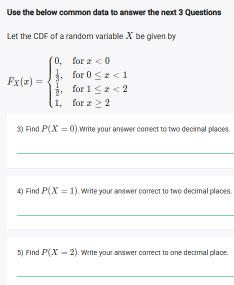
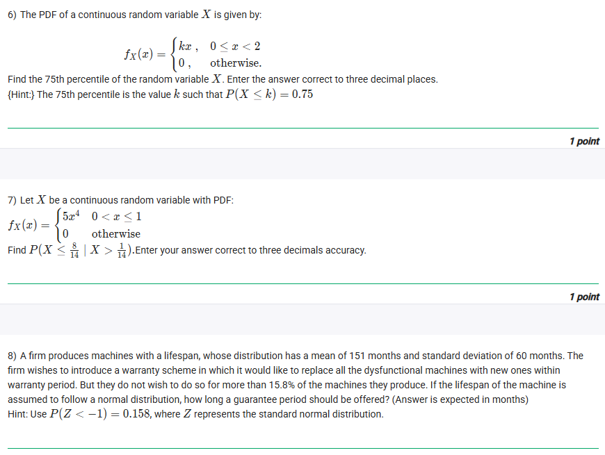
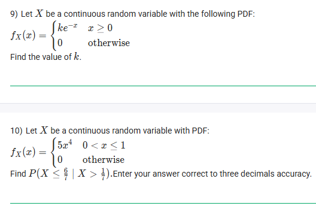
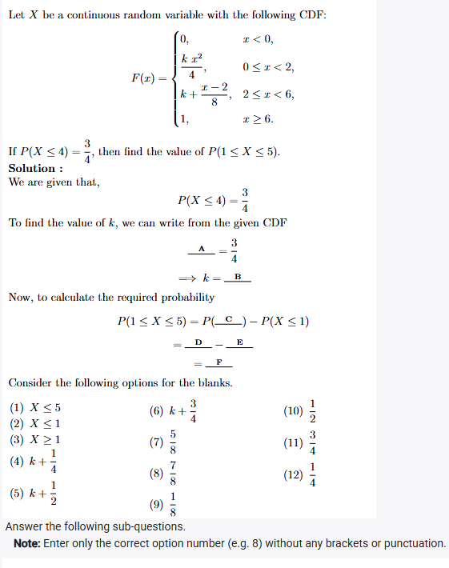
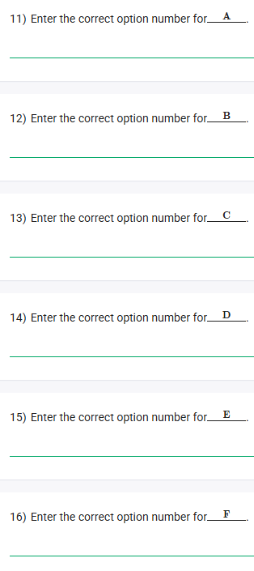

## Exercise Questions ❓

## Exercise Solutions 🧪

Good morning! Here in India on this Monday, let's explore these questions. They cover key concepts related to **continuous random variables**, including Probability Density Functions (PDFs), Cumulative Distribution Functions (CDFs), percentiles, conditional probabilities, and applications of the Normal distribution.

### **Core Concepts: Continuous Random Variables**

1.  **Probability Density Function (PDF), $f_X(x)$:**
    * Describes the relative likelihood for a continuous random variable to take on a given value.
    * The total area under the PDF curve must equal 1: $\int_{-\infty}^{\infty} f_X(x) dx = 1$.
    * Probabilities are found by integrating the PDF over an interval: $P(a \le X \le b) = \int_{a}^{b} f_X(x) dx$.
    * For any single point $c$, $P(X=c) = 0$.

2.  **Cumulative Distribution Function (CDF), $F_X(x)$:**
    * Gives the probability that the random variable $X$ is less than or equal to a certain value $x$.
    * $F_X(x) = P(X \le x) = \int_{-\infty}^{x} f_X(t) dt$.
    * $P(a < X \le b) = F_X(b) - F_X(a)$.
    * $P(X > a) = 1 - P(X \le a) = 1 - F_X(a)$.
    * CDFs are non-decreasing, right-continuous, $\lim_{x\to-\infty} F_X(x) = 0$, and $\lim_{x\to\infty} F_X(x) = 1$.
    * Jumps in a CDF indicate discrete probability mass at that point.

3.  **Percentiles:** The $p$-th percentile is the value $k$ such that $P(X \le k) = p/100$, or $F_X(k) = p/100$.

4.  **Conditional Probability:** $P(A|B) = \frac{P(A \cap B)}{P(B)}$.

5.  **Normal Distribution:** A bell-shaped curve defined by its mean ($\mu$) and standard deviation ($\sigma$). We use the standard normal distribution (Z-distribution, $\mu=0, \sigma=1$) and Z-scores ($Z = \frac{X-\mu}{\sigma}$) to calculate probabilities.

---

### **Question 1: Minimum Supply Calculation** (from file `image_7456d4.png`)

**The Question:**
A petrol station receives a supply once each day. The daily petrol sales (in thousands of liters) are represented by the random variable $X$, which has the PDF: $f_X(x) = \begin{cases} k(1-x)^4, & 0 \le x \le 1 \\ 0, & \text{otherwise} \end{cases}$. What should be the minimum supply (in thousands of liters) so that the probability of the petrol running out on any given day is only 1%?

**Detailed Solution:**
1.  **Find the value of k:** The total probability must be 1.
    * $\int_{0}^{1} k(1-x)^4 dx = 1$.
    * Let $u = 1-x$, then $du = -dx$. When $x=0, u=1$. When $x=1, u=0$.
    * $\int_{1}^{0} k u^4 (-du) = k \int_{0}^{1} u^4 du = k \left[\frac{u^5}{5}\right]_0^1 = k(\frac{1}{5} - 0) = \frac{k}{5}$.
    * So, $\frac{k}{5} = 1 \implies k=5$.
    * The PDF is $f_X(x) = 5(1-x)^4$ for $0 \le x \le 1$.

2.  **Set up the probability:** "Running out" means the demand $X$ is greater than the supply $S$. We want $P(X > S) = 0.01$.
3.  **Calculate the probability using the PDF:**
    * $P(X > S) = \int_{S}^{1} 5(1-x)^4 dx$.
    * Using the same substitution $u=1-x, du=-dx$. When $x=S, u=1-S$. When $x=1, u=0$.
    * $\int_{1-S}^{0} 5u^4 (-du) = 5 \int_{0}^{1-S} u^4 du = 5 \left[\frac{u^5}{5}\right]_0^{1-S} = [u^5]_0^{1-S} = (1-S)^5 - 0^5 = (1-S)^5$.
4.  **Solve for S:**
    * $(1-S)^5 = 0.01$
    * $1-S = (0.01)^{1/5}$
    * $1-S \approx 0.3981$
    * $S = 1 - 0.3981 = 0.6019$.

**Final Answer:** **0.6019** (thousand liters)


---

### **Question 2: Probability from CDF** (from file `image_7456d4.png`)

**The Question:**
Let $X$ be a continuous random variable with the CDF: $F_X(x) = \begin{cases} 0, & x < 1 \\ \frac{(x-1)^4}{8}, & 1 \le x < 3 \\ 1, & x \ge 3 \end{cases}$. What is the value of $P(1 < X < 2)$?

**Detailed Solution:**
1.  **Apply the CDF property:** For a continuous variable, $P(a < X < b) = P(a < X \le b) = F_X(b) - F_X(a)$.
2.  **Use the given values:** $a=1, b=2$.
    * $P(1 < X < 2) = F_X(2) - F_X(1)$.
3.  **Evaluate the CDF at the limits:**
    * For $F_X(2)$, we use the middle rule since $1 \le 2 < 3$: $F_X(2) = \frac{(2-1)^4}{8} = \frac{1^4}{8} = \frac{1}{8}$.
    * For $F_X(1)$, we use the middle rule since $1 \le 1 < 3$: $F_X(1) = \frac{(1-1)^4}{8} = \frac{0^4}{8} = 0$.
4.  **Calculate the probability:**
    * $P(1 < X < 2) = \frac{1}{8} - 0 = \frac{1}{8}$.
5.  **Convert to decimal:** $1 \div 8 = 0.125$.

**Final Answer:** **0.125**


---

### **Questions 3, 4, & 5: Probabilities from a Step CDF** (from file `image_745789.png`)

**Common Data:**
Let the CDF of a random variable $X$ be given by: $F_X(x) = \begin{cases} 0, & \text{for } x < 0 \\ 1/3, & \text{for } 0 \le x < 1 \\ 1/2, & \text{for } 1 \le x < 2 \\ 1, & \text{for } x \ge 2 \end{cases}$.

**Core Concept:** Jumps in a CDF represent discrete probability masses. The probability at a specific point $c$ is the size of the jump: $P(X=c) = F_X(c) - \lim_{x \to c^-} F_X(x)$.

---
#### **3) Find $P(X=0)$.**

**Detailed Solution:**
* $P(X=0) = F_X(0) - \lim_{x \to 0^-} F_X(x)$
* $F_X(0)$ uses the rule $0 \le x < 1$, so $F_X(0) = 1/3$.
* $\lim_{x \to 0^-} F_X(x)$ uses the rule $x < 0$, so the limit is 0.
* $P(X=0) = 1/3 - 0 = 1/3$.
* $1/3 \approx 0.333...$

**Final Answer:** **0.33**

---
#### **4) Find $P(X=1)$.**

**Detailed Solution:**
* $P(X=1) = F_X(1) - \lim_{x \to 1^-} F_X(x)$
* $F_X(1)$ uses the rule $1 \le x < 2$, so $F_X(1) = 1/2$.
* $\lim_{x \to 1^-} F_X(x)$ uses the rule $0 \le x < 1$, so the limit is 1/3.
* $P(X=1) = 1/2 - 1/3 = 3/6 - 2/6 = 1/6$.
* $1/6 \approx 0.166...$

**Final Answer:** **0.17**

---
#### **5) Find $P(X=2)$.**

**Detailed Solution:**
* $P(X=2) = F_X(2) - \lim_{x \to 2^-} F_X(x)$
* $F_X(2)$ uses the rule $x \ge 2$, so $F_X(2) = 1$.
* $\lim_{x \to 2^-} F_X(x)$ uses the rule $1 \le x < 2$, so the limit is 1/2.
* $P(X=2) = 1 - 1/2 = 1/2$.
* $1/2 = 0.5$.

**Final Answer:** **0.5**


---

### **Question 6: Percentiles** (from file `image_7453eb.png`)

**The Question:**
The PDF of a continuous random variable X is given by: $f_X(x) = \begin{cases} kx, & 0 \le x < 2 \\ 0, & \text{otherwise} \end{cases}$. Find the 75th percentile of the random variable X.

**Detailed Solution:**
1.  **Find k:** The total area under the PDF must be 1.
    * $\int_{0}^{2} kx dx = 1$
    * $k \left[\frac{x^2}{2}\right]_0^2 = 1 \implies k (\frac{2^2}{2} - 0) = 1 \implies k(2) = 1 \implies k = 1/2$.
    * The PDF is $f_X(x) = \frac{1}{2}x$ for $0 \le x < 2$.

2.  **Set up the percentile equation:** We need to find the value $v$ such that $P(X \le v) = 0.75$. This is the same as finding $v$ where $F_X(v) = 0.75$.
3.  **Calculate the integral:**
    * $P(X \le v) = \int_{0}^{v} f_X(x) dx = \int_{0}^{v} \frac{1}{2}x dx = \frac{1}{2} \left[\frac{x^2}{2}\right]_0^v = \frac{1}{4}v^2$.
4.  **Solve for v:**
    * $\frac{1}{4}v^2 = 0.75 = \frac{3}{4}$
    * $v^2 = 3$
    * Since the domain is $0 \le x < 2$, we take the positive root: $v = \sqrt{3}$.
5.  **Calculate the decimal value:** $v = \sqrt{3} \approx 1.73205$.

**Final Answer:** **1.732**


---

### **Question 7: Conditional Probability** (from file `image_7453eb.png`)

**The Question:**
Let X be a continuous random variable with PDF: $f_X(x) = \begin{cases} 5x^4 & 0 < x \le 1 \\ 0 & \text{otherwise} \end{cases}$. Find $P(X < 8/14 \mid X > 1/4)$.

**Detailed Solution:**
1.  **Apply the conditional probability formula:** $P(A|B) = \frac{P(A \cap B)}{P(B)}$.
    * Event A: $X < 8/14 = 4/7$.
    * Event B: $X > 1/4$.
    * Event $A \cap B$: $1/4 < X < 4/7$.
2.  **Calculate $P(B) = P(X > 1/4)$:**
    * $P(X > 1/4) = \int_{1/4}^{1} 5x^4 dx = 5 \left[\frac{x^5}{5}\right]_{1/4}^{1} = [x^5]_{1/4}^{1} = 1^5 - (1/4)^5 = 1 - \frac{1}{1024} = \frac{1023}{1024}$.
3.  **Calculate $P(A \cap B) = P(1/4 < X < 4/7)$:**
    * $P(1/4 < X < 4/7) = \int_{1/4}^{4/7} 5x^4 dx = [x^5]_{1/4}^{4/7} = (4/7)^5 - (1/4)^5$.
    * $(4/7)^5 = \frac{1024}{16807}$. $(1/4)^5 = \frac{1}{1024}$.
    * $P(A \cap B) = \frac{1024}{16807} - \frac{1}{1024}$.
4.  **Calculate $P(A|B)$:**
    * $P(A|B) = \frac{\frac{1024}{16807} - \frac{1}{1024}}{\frac{1023}{1024}}$.
    * This requires a calculator:
        * $1024/16807 \approx 0.060927$.
        * $1/1024 \approx 0.00097656$.
        * $1023/1024 \approx 0.9990234$.
        * $P(A \cap B) \approx 0.060927 - 0.00097656 = 0.05995$.
        * $P(A|B) \approx \frac{0.05995}{0.9990234} \approx 0.06001$.

**Final Answer:** **0.060**


---

### **Question 8: Normal Distribution Warranty** (from file `image_7453eb.png`)

**The Question:**
A firm produces machines with a lifespan (mean=151 months, std dev=60 months). Find the warranty period to offer so that they replace no more than 15.8% of machines. Use $P(Z < -1) = 0.158$.

**Core Concept:** We need to find the value $X$ (warranty period) such that the probability of a machine failing before that time, $P(\text{Lifespan} < X)$, is 0.158. We use the Z-score transformation.

**Detailed Solution:**
1.  **Identify the parameters:** $\mu = 151$, $\sigma = 60$.
2.  **Define the probability:** We want $P(\text{Lifespan} < X) = 0.158$.
3.  **Convert to Z-score:** The Z-score corresponding to $X$ is $Z = \frac{X - \mu}{\sigma} = \frac{X - 151}{60}$.
4.  **Rewrite the probability in terms of Z:** $P\left(Z < \frac{X - 151}{60}\right) = 0.158$.
5.  **Use the given hint:** We are told $P(Z < -1) = 0.158$.
6.  **Equate the Z-scores:** Since the probabilities are equal, the Z-scores must be equal.
    * $\frac{X - 151}{60} = -1$
7.  **Solve for X:**
    * $X - 151 = -60$
    * $X = 151 - 60 = 91$.

**Final Answer:** The guarantee period should be **91** months.


---

### **Question 9: Finding k for Exponential PDF** (from file `image_745388.png`)

**The Question:**
Let X be a continuous random variable with the PDF: $f_X(x) = \begin{cases} ke^{-x} & x \ge 0 \\ 0 & \text{otherwise} \end{cases}$. Find the value of k.

**Core Concept:** The total area under any PDF must equal 1. $\int_{-\infty}^{\infty} f_X(x) dx = 1$.

**Detailed Solution:**
1.  **Set up the integral:**
    * $\int_{0}^{\infty} ke^{-x} dx = 1$.
2.  **Evaluate the improper integral:**
    * $k \int_{0}^{\infty} e^{-x} dx = k \lim_{b\to\infty} \int_{0}^{b} e^{-x} dx$.
    * $k \lim_{b\to\infty} [-e^{-x}]_0^b = k \lim_{b\to\infty} (-e^{-b} - (-e^0)) = k \lim_{b\to\infty} (-e^{-b} + 1)$.
    * As $b \to \infty$, $e^{-b} \to 0$.
    * So the integral evaluates to $k(0 + 1) = k$.
3.  **Solve for k:**
    * Since the integral must equal 1, we have $k=1$.

**Final Answer:** $k = 1$.


---

### **Question 10: Conditional Probability** (from file `image_745388.png`)

**The Question:**
Let X be a continuous random variable with PDF: $f_X(x) = \begin{cases} 5x^4 & 0 < x \le 1 \\ 0 & \text{otherwise} \end{cases}$. Find $P(X \le 6/7 \mid X > 1/7)$.

**Detailed Solution:**
1.  **Apply the conditional probability formula:** $P(A|B) = \frac{P(A \cap B)}{P(B)}$.
    * Event A: $X \le 6/7$.
    * Event B: $X > 1/7$.
    * Event $A \cap B$: $1/7 < X \le 6/7$.
2.  **Calculate $P(B) = P(X > 1/7)$:**
    * $P(X > 1/7) = \int_{1/7}^{1} 5x^4 dx = 5 \left[\frac{x^5}{5}\right]_{1/7}^{1} = [x^5]_{1/7}^{1} = 1^5 - (1/7)^5 = 1 - \frac{1}{16807} = \frac{16806}{16807}$.
3.  **Calculate $P(A \cap B) = P(1/7 < X \le 6/7)$:**
    * $P(1/7 < X \le 6/7) = \int_{1/7}^{6/7} 5x^4 dx = [x^5]_{1/7}^{6/7} = (6/7)^5 - (1/7)^5$.
    * $(6/7)^5 = \frac{7776}{16807}$. $(1/7)^5 = \frac{1}{16807}$.
    * $P(A \cap B) = \frac{7776 - 1}{16807} = \frac{7775}{16807}$.
4.  **Calculate $P(A|B)$:**
    * $P(A|B) = \frac{7775/16807}{16806/16807} = \frac{7775}{16806}$.
5.  **Convert to decimal:** $7775 \div 16806 \approx 0.46263$.

**Final Answer:** **0.463**


---

### **Questions 11-16: Fill-in-the-Blanks with CDF** (from files `image_74532a.png`, `image_745029.png`)

**The Question:**
Let X be a continuous random variable with the CDF... If $P(X \le 4) = 3/4$, then find the value of $P(1 \le X \le 5)$. Fill in the blanks A-F.

**Detailed Solution:**
* **Find k (A, B):** We are given $P(X \le 4) = F(4) = 3/4$.
    * Since $2 \le 4 \le 6$, we use the middle part of the CDF: $F(4) = k + \frac{4-2}{8} = k + \frac{2}{8} = k + \frac{1}{4}$.
    * Set this equal to the given probability: $k + \frac{1}{4} = \frac{3}{4}$.
    * Solve for k: $k = \frac{3}{4} - \frac{1}{4} = \frac{2}{4} = \frac{1}{2}$.
    * **Blank A** represents the equation $k+\frac{1}{4} = \frac{3}{4}$. The value $\frac{3}{4}$ is option **(11)**.
    * **Blank B** represents the value of $k$. $k = \frac{1}{2}$, which is option **(10)**.

* **Calculate $P(1 \le X \le 5)$ (C, D, E, F):**
    * For continuous variables, $P(a \le X \le b) = P(X \le b) - P(X < a)$. Since $P(X=a)=0$, this is the same as $P(X \le b) - P(X \le a) = F(b) - F(a)$.
    * So, $P(1 \le X \le 5) = P(X \le 5) - P(X \le 1) = F(5) - F(1)$.
    * **Blank C** represents $P(X \le 5)$, which corresponds to option **(1)**.
    * **Blank D** represents $P(X \le 1)$, which corresponds to option **(2)**.
    * Now evaluate $F(5)$ and $F(1)$ using $k=1/2$:
        * Since $2 \le 5 \le 6$, $F(5) = k + \frac{5-2}{8} = \frac{1}{2} + \frac{3}{8} = \frac{4}{8} + \frac{3}{8} = \frac{7}{8}$.
        * Since $0 \le 1 < 2$, $F(1) = \frac{k \cdot 1^2}{4} = \frac{(1/2)}{4} = \frac{1}{8}$.
    * **Blank E** represents the value of $F(5)$, which is $\frac{7}{8}$, option **(8)**.
    * Calculate the final probability: $P(1 \le X \le 5) = \frac{7}{8} - \frac{1}{8} = \frac{6}{8} = \frac{3}{4}$.
    * **Blank F** represents the final answer, which is $\frac{3}{4}$, option **(11)**.

**Final Answers:**
* **11) A:** 11
* **12) B:** 10
* **13) C:** 1
* **14) D:** 2
* **15) E:** 8
* **16) F:** 11
