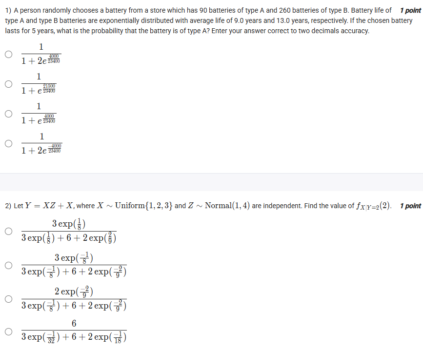
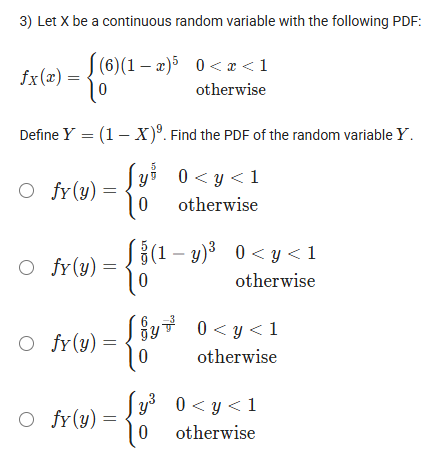
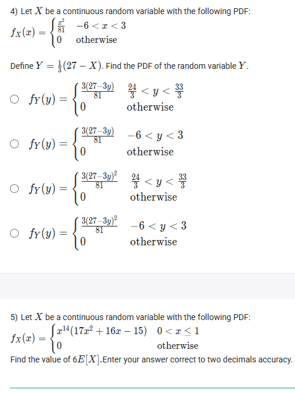
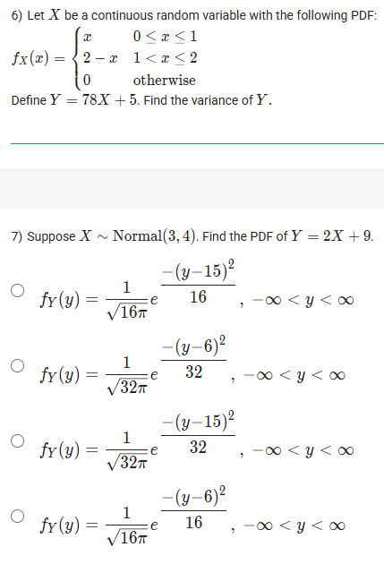
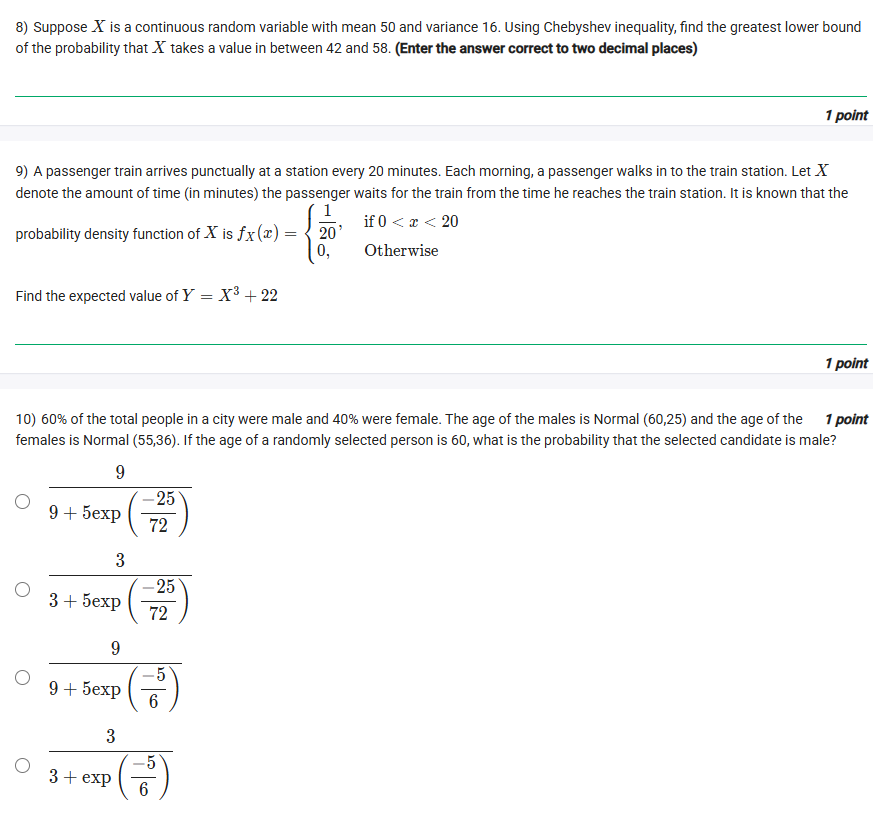
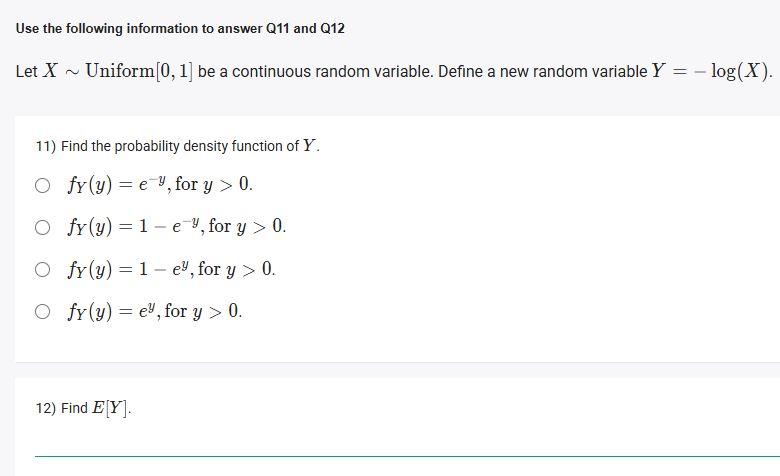
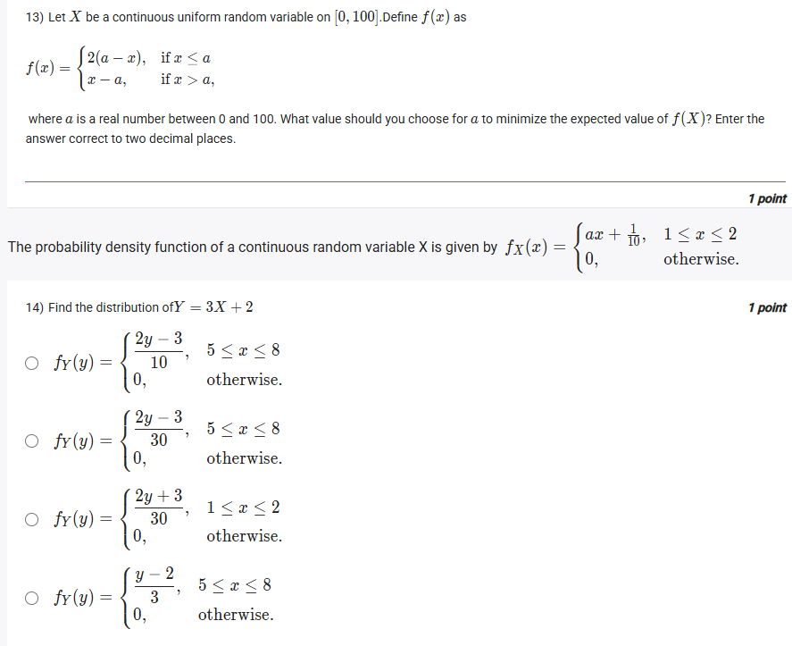
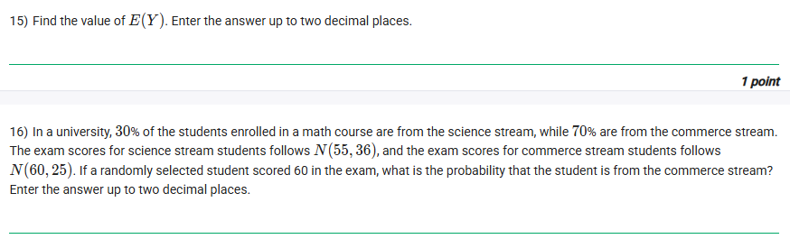
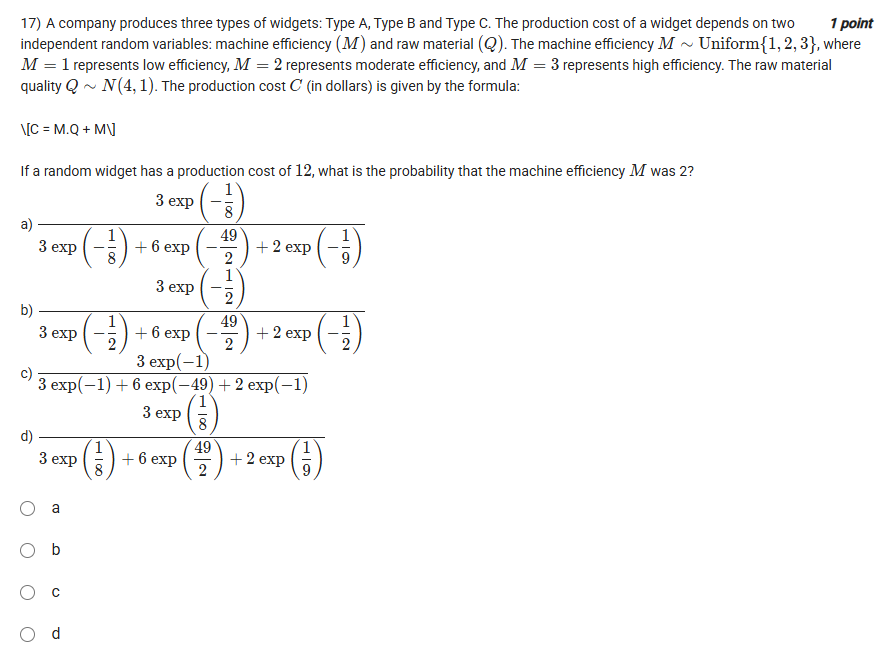
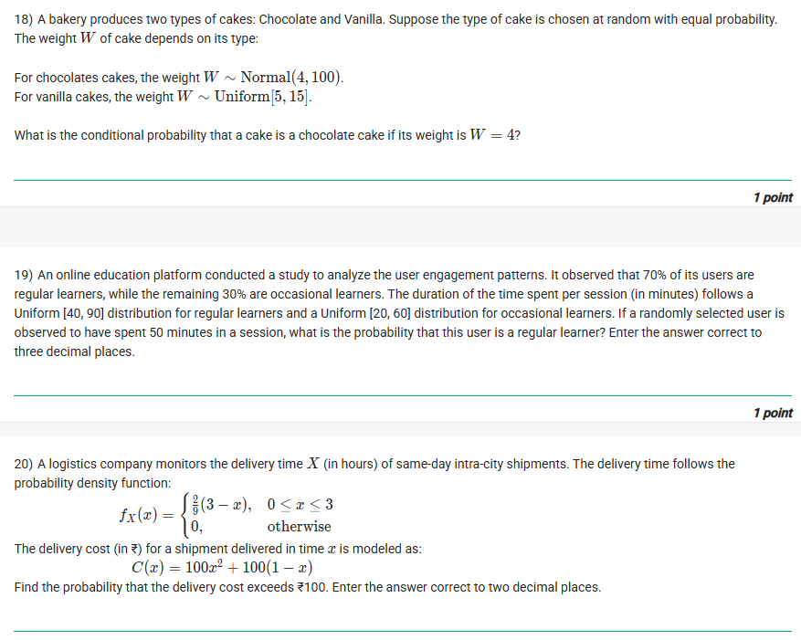

## Exercise Questions ❓

## Exercise Solutions 🔬

Hello! I can certainly help you solve these problems. Here is a detailed breakdown of each question, including the core concepts and a step-by-step solution.



### ❓ Question 1: Battery Life

> A person randomly chooses a battery from a store which has 90 batteries of type A and 260 batteries of type B. Battery life of type A and type B batteries are exponentially distributed with average life of 9.0 years and 13.0 years, respectively. If the chosen battery lasts for 5 years, what is the probability that the battery is of type A? Enter your answer correct to two decimals accuracy.

#### Core Concepts

1.  **Bayes' Theorem:** This theorem is used to update the probability of an event based on new evidence. The formula is:
    $$P(A|E) = \frac{P(E|A)P(A)}{P(E)}$$
    Where $P(E) = P(E|A)P(A) + P(E|B)P(B)$ (the Law of Total Probability).
2.  **Exponential Distribution:** This distribution models the time until an event (like battery failure).
    * **Mean (Average Life):** $E[T] = \frac{1}{\lambda}$, where $\lambda$ is the rate parameter.
    * **Survival Function $P(T > t)$:** The probability that the item lasts *longer* than time $t$ is $P(T > t) = e^{-\lambda t}$.

#### Solution

1.  **Define Events:**
    * $A$: The chosen battery is **Type A**.
    * $B$: The chosen battery is **Type B**.
    * $E$: The battery **lasts for more than 5 years** ($T > 5$).
    * **Goal:** We need to find $P(A|E)$, the probability it was Type A *given* that it lasted more than 5 years.

2.  **Find Prior Probabilities ($P(A)$ and $P(B)$):**
    * Total batteries = $90 + 260 = 350$.
    * $P(A) = \frac{90}{350} = \frac{9}{35}$
    * $P(B) = \frac{260}{350} = \frac{26}{35}$

3.  **Find Likelihoods ($P(E|A)$ and $P(E|B)$):**
    This is the probability of survival $P(T > 5)$ for each battery type.
    * **For Type A:**
        * Average life $E[T_A] = 9 = \frac{1}{\lambda_A} \implies \lambda_A = \frac{1}{9}$.
        * $P(E|A) = P(T_A > 5) = e^{-\lambda_A \cdot 5} = e^{-5/9}$.
    * **For Type B:**
        * Average life $E[T_B] = 13 = \frac{1}{\lambda_B} \implies \lambda_B = \frac{1}{13}$.
        * $P(E|B) = P(T_B > 5) = e^{-\lambda_B \cdot 5} = e^{-5/13}$.

4.  **Apply Bayes' Theorem:**
    $$P(A|E) = \frac{P(E|A)P(A)}{P(E|A)P(A) + P(E|B)P(B)}$$
    $$P(A|E) = \frac{e^{-5/9} \cdot \left(\frac{9}{35}\right)}{e^{-5/9} \cdot \left(\frac{9}{35}\right) + e^{-5/13} \cdot \left(\frac{26}{35}\right)}$$
    * We can cancel the $\frac{1}{35}$ from the numerator and denominator:
    $$P(A|E) = \frac{9e^{-5/9}}{9e^{-5/9} + 26e^{-5/13}}$$

5.  **Calculate the Value:**
    * $e^{-5/9} \approx e^{-0.555...} \approx 0.5738$
    * $e^{-5/13} \approx e^{-0.3846...} \approx 0.6807$
    * $P(A|E) \approx \frac{9 \cdot 0.5738}{9 \cdot 0.5738 + 26 \cdot 0.6807}$
    * $P(A|E) \approx \frac{5.1642}{5.1642 + 17.6982} = \frac{5.1642}{22.8624} \approx 0.22588$

6.  **Final Answer:**
    Rounded to two decimal places, the probability is **0.23**.

    *(Note: The multiple-choice options provided in the image are inconsistent with the problem's numbers. For example, Option 1, $\frac{1}{1 + 2e^{4000/23400}}$, implies a prior probability ratio $P(B)/P(A) = 2$, but the problem gives $260/90 \approx 2.89$. The calculation above correctly uses the numbers from the problem statement.)*





### ❓ Question 2: $Y = XZ$ Transformation

> Let $Y = XZ$, where $X \sim \text{Uniform}\{1, 2, 3\}$ and $Z \sim \text{Normal}(1, 4)$ are independent. Find the value of $f_{X,Y|Y=2}(2)$.

#### Core Concepts

1.  **Bayes' Theorem for Mixed Variables:** We are finding the probability of a discrete state ($X=k$) given a continuous observation ($Y=y$).
    $$P(X=k | Y=y) = \frac{f_{Y|X=k}(y) P(X=k)}{f_Y(y)}$$
2.  **Law of Total Probability (Density):** The denominator $f_Y(y)$ is the marginal density of $Y$, found by summing over all possibilities of $X$:
    $$f_Y(y) = \sum_{i} f_{Y|X=i}(y) P(X=i)$$
3.  **Transformation of Normal Variables:** If $Z \sim N(\mu, \sigma^2)$, then $Y = kZ \sim N(k\mu, k^2\sigma^2)$.

#### Solution

1.  **Interpret the Notation:** The notation $f_{X,Y|Y=2}(2)$ is ambiguous. The most standard interpretation is that it is a typo for $P(X=2 | Y=2)$. We will solve for this value.

2.  **Identify Priors $P(X=k)$:**
    * $X \sim \text{Uniform}\{1, 2, 3\}$, so $P(X=1) = P(X=2) = P(X=3) = \frac{1}{3}$.

3.  **Find Conditional Likelihoods $f_{Y|X=k}(y)$:**
    * We are given $Z \sim N(\mu=1, \sigma^2=4)$.
    * **If $X=1$:** $Y = 1 \cdot Z = Z$. So $Y|X=1 \sim N(1, 4)$.
        * $f_{Y|X=1}(y) = \frac{1}{\sqrt{2\pi \cdot 4}} e^{-\frac{(y-1)^2}{2 \cdot 4}} = \frac{1}{\sqrt{8\pi}} e^{-\frac{(y-1)^2}{8}}$.
    * **If $X=2$:** $Y = 2Z$. The new mean is $2 \cdot 1 = 2$. The new variance is $2^2 \cdot 4 = 16$.
        * $Y|X=2 \sim N(2, 16)$.
        * $f_{Y|X=2}(y) = \frac{1}{\sqrt{2\pi \cdot 16}} e^{-\frac{(y-2)^2}{2 \cdot 16}} = \frac{1}{\sqrt{32\pi}} e^{-\frac{(y-2)^2}{32}}$.
    * **If $X=3$:** $Y = 3Z$. The new mean is $3 \cdot 1 = 3$. The new variance is $3^2 \cdot 4 = 36$.
        * $Y|X=3 \sim N(3, 36)$.
        * $f_{Y|X=3}(y) = \frac{1}{\sqrt{2\pi \cdot 36}} e^{-\frac{(y-3)^2}{2 \cdot 36}} = \frac{1}{\sqrt{72\pi}} e^{-\frac{(y-3)^2}{72}}$.

4.  **Apply Bayes' Theorem for $P(X=2 | Y=2)$:**
    $$P(X=2 | Y=2) = \frac{f_{Y|X=2}(2) P(X=2)}{\sum_{i=1}^3 f_{Y|X=i}(2) P(X=i)}$$
    * Since $P(X=i) = \frac{1}{3}$ for all $i$, we can cancel it from the numerator and denominator:
    $$P(X=2 | Y=2) = \frac{f_{Y|X=2}(2)}{f_{Y|X=1}(2) + f_{Y|X=2}(2) + f_{Y|X=3}(2)}$$

5.  **Evaluate each density at $y=2$:**
    * $f_{Y|X=1}(2) = \frac{1}{\sqrt{8\pi}} e^{-\frac{(2-1)^2}{8}} = \frac{1}{\sqrt{8\pi}} e^{-1/8}$
    * $f_{Y|X=2}(2) = \frac{1}{\sqrt{32\pi}} e^{-\frac{(2-2)^2}{32}} = \frac{1}{\sqrt{32\pi}} e^{0} = \frac{1}{\sqrt{32\pi}}$
    * $f_{Y|X=3}(2) = \frac{1}{\sqrt{72\pi}} e^{-\frac{(2-3)^2}{72}} = \frac{1}{\sqrt{72\pi}} e^{-1/72}$

6.  **Substitute and Simplify:**
    * First, simplify the root terms: $\sqrt{32\pi} = \sqrt{4 \cdot 8\pi} = 2\sqrt{8\pi}$ and $\sqrt{72\pi} = \sqrt{9 \cdot 8\pi} = 3\sqrt{8\pi}$.
    $$P(X=2 | Y=2) = \frac{\frac{1}{2\sqrt{8\pi}}}{\frac{1}{\sqrt{8\pi}} e^{-1/8} + \frac{1}{2\sqrt{8\pi}} + \frac{1}{3\sqrt{8\pi}} e^{-1/72}}$$
    * Cancel $\frac{1}{\sqrt{8\pi}}$ from all terms:
    $$P(X=2 | Y=2) = \frac{1/2}{e^{-1/8} + 1/2 + \frac{1}{3}e^{-1/72}}$$
    * To make it cleaner, multiply the numerator and denominator by 6:
    $$P(X=2 | Y=2) = \frac{3}{6e^{-1/8} + 3 + 2e^{-1/72}}$$

7.  **Final Answer:**
    The derived answer is $\frac{3}{6e^{-1/8} + 3 + 2e^{-1/72}}$.
    **None of the provided options match this correct derivation.** The options given are fundamentally inconsistent with the problem statement $Z \sim N(1, 4)$. For example, the term $e^{-9/8}$ in the options cannot be derived from the given parameters.





### ❓ Question 3: $Y = (1-X)^9$ Transformation

> Let $X$ be a continuous random variable with the following PDF:
> $f_X(x) = \begin{cases} (6)(1-x)^5 & 0 < x < 1 \\ 0 & \text{otherwise} \end{cases}$
> Define $Y = (1-X)^9$. Find the PDF of the random variable $Y$.

#### Core Concepts

1.  **Transformation of Variables (Formula Method):** If $Y=g(X)$ and $g(x)$ is a monotonic function, we can find the new PDF using the formula:
    $$f_Y(y) = f_X(g^{-1}(y)) \left| \frac{dx}{dy} \right|$$
    where $x = g^{-1}(y)$ is the inverse function.

#### Solution

1.  **Check Monotonicity and Find Range of Y:**
    * The function $g(x) = (1-x)^9$ is **monotonic decreasing** on the interval $0 < x < 1$.
    * Find the bounds for $y$:
        * When $x \to 0$, $y \to (1-0)^9 = 1$.
        * When $x \to 1$, $y \to (1-1)^9 = 0$.
    * Therefore, the range for $Y$ is $0 < y < 1$.

2.  **Find the Inverse Function ($x = g^{-1}(y)$):**
    * $y = (1-x)^9$
    * $y^{1/9} = 1-x$
    * $x = 1 - y^{1/9}$

3.  **Find the Derivative of the Inverse ($|\frac{dx}{dy}|$):**
    * $\frac{dx}{dy} = \frac{d}{dy} (1 - y^{1/9}) = 0 - \frac{1}{9}y^{(1/9 - 1)} = -\frac{1}{9}y^{-8/9}$
    * The absolute value is $\left| \frac{dx}{dy} \right| = \frac{1}{9}y^{-8/9}$.

4.  **Apply the Transformation Formula:**
    * $f_Y(y) = f_X(x) \left| \frac{dx}{dy} \right|$
    * Substitute $x = 1 - y^{1/9}$ into $f_X(x)$:
        * $f_X(1 - y^{1/9}) = 6(1 - (1 - y^{1/9}))^5 = 6(y^{1/9})^5 = 6y^{5/9}$
    * Now, multiply by the derivative:
        * $f_Y(y) = (6y^{5/9}) \cdot (\frac{1}{9}y^{-8/9})$
        * $f_Y(y) = \frac{6}{9} y^{(5/9 - 8/9)} = \frac{6}{9} y^{-3/9}$

5.  **Final Answer:**
    The PDF for $Y$ is $f_Y(y) = \frac{6}{9}y^{-3/9}$ for $0 < y < 1$.
    This matches **Option 3**, which is $f_Y(y) = \begin{cases} \frac{6}{9}y^{-3/9} & 0 < y < 1 \\ 0 & \text{otherwise} \end{cases}$.
    (This simplifies to $\frac{2}{3}y^{-1/3}$, but is left un-simplified in the option).





### ❓ Question 4: $Y = \frac{1}{3}(27-X)$ Transformation

> Let $X$ be a continuous random variable with the following PDF:
> $f_X(x) = \begin{cases} \frac{x^2}{81} & -6 < x < 3 \\ 0 & \text{otherwise} \end{cases}$
> Define $Y = \frac{1}{3}(27-X)$. Find the PDF of the random variable $Y$.

#### Core Concepts

1.  **Transformation of Variables (Formula Method):** We use the same formula as in the previous question:
    $$f_Y(y) = f_X(g^{-1}(y)) \left| \frac{dx}{dy} \right|$$

#### Solution

1.  **Check Monotonicity and Find Range of Y:**
    * The function $g(x) = \frac{1}{3}(27-X) = 9 - \frac{x}{3}$ is a **monotonic decreasing** linear function.
    * Find the bounds for $y$ by plugging in the bounds for $x$:
        * When $x = -6$, $y = \frac{1}{3}(27 - (-6)) = \frac{33}{3} = 11$.
        * When $x = 3$, $y = \frac{1}{3}(27 - 3) = \frac{24}{3} = 8$.
    * Since the function is decreasing, the bounds flip. The new range is $8 < y < 11$, or $\frac{24}{3} < y < \frac{33}{3}$. This immediately eliminates options 2 and 4.

2.  **Find the Inverse Function ($x = g^{-1}(y)$):**
    * $y = \frac{1}{3}(27 - x)$
    * $3y = 27 - x$
    * $x = 27 - 3y$

3.  **Find the Derivative of the Inverse ($|\frac{dx}{dy}|$):**
    * $\frac{dx}{dy} = \frac{d}{dy} (27 - 3y) = -3$
    * The absolute value is $\left| \frac{dx}{dy} \right| = 3$.

4.  **Apply the Transformation Formula:**
    * $f_Y(y) = f_X(x) \left| \frac{dx}{dy} \right|$
    * Substitute $x = 27 - 3y$ into $f_X(x)$:
        * $f_X(27 - 3y) = \frac{(27 - 3y)^2}{81}$
    * Now, multiply by the derivative:
        * $f_Y(y) = \frac{(27 - 3y)^2}{81} \cdot 3 = \frac{3(27 - 3y)^2}{81}$

5.  **Final Answer:**
    The PDF for $Y$ is $f_Y(y) = \frac{3(27 - 3y)^2}{81}$ for $\frac{24}{3} < y < \frac{33}{3}$.
    This matches **Option 3**.





### ❓ Question 5: $6E[X]$

> Let $X$ be a continuous random variable with the following PDF:
> $f_X(x) = \begin{cases} x^{14}(17x^2 + 16x - 15) & 0 < x < 1 \\ 0 & \text{otherwise} \end{cases}$
> Find the value of $6E[X]$. Enter your answer correct to two decimals accuracy.

#### Core Concepts

1.  **Expected Value of $X$:** For a continuous variable, the expected value (or mean) is found by integrating $x$ times the PDF over its support:
    $$E[X] = \int_{-\infty}^{\infty} x \cdot f_X(x) \,dx$$
2.  **Polynomial Integration:** The integral of $x^n$ is $\frac{x^{n+1}}{n+1}$.

#### Solution

1.  **Set up the $E[X]$ Integral:**
    $$E[X] = \int_0^1 x \cdot \left[ x^{14}(17x^2 + 16x - 15) \right] \,dx$$
    $$E[X] = \int_0^1 x^{15}(17x^2 + 16x - 15) \,dx$$

2.  **Distribute and Simplify the Integrand:**
    $$E[X] = \int_0^1 (17x^{17} + 16x^{16} - 15x^{15}) \,dx$$

3.  **Integrate Term by Term:**
    $$E[X] = \left[ 17 \frac{x^{18}}{18} + 16 \frac{x^{17}}{17} - 15 \frac{x^{16}}{16} \right]_0^1$$

4.  **Evaluate at the Bounds:**
    * Evaluating at the upper bound $x=1$:
        $E[X] = \frac{17(1)^{18}}{18} + \frac{16(1)^{17}}{17} - \frac{15(1)^{16}}{16}$
    * Evaluating at the lower bound $x=0$ gives 0.
    * So, $E[X] = \frac{17}{18} + \frac{16}{17} - \frac{15}{16}$.

5.  **Calculate the Value of $E[X]$:**
    * $\frac{17}{18} \approx 0.94444...$
    * $\frac{16}{17} \approx 0.94117...$
    * $\frac{15}{16} = 0.9375$
    * $E[X] \approx 0.94444 + 0.94117 - 0.9375 \approx 0.94811...$

6.  **Find the Final Answer $6E[X]$:**
    * $6E[X] = 6 \cdot (\frac{17}{18} + \frac{16}{17} - \frac{15}{16})$
    * $6 \times 0.94811... \approx 5.6887...$

7.  **Final Answer:**
    Rounding to two decimals accuracy, the value is **5.69**.





### ❓ Question 6: Variance of $Y=78X+5$

> Let $X$ be a continuous random variable with the following PDF:
> $f_X(x) = \begin{cases} x & 0 \le x \le 1 \\ 2-x & 1 < x \le 2 \\ 0 & \text{otherwise} \end{cases}$
> Define $Y = 78X + 5$. Find the variance of $Y$.

#### Core Concepts

1.  **Properties of Variance:** For constants $a$ and $b$:
    $$\text{Var}(aX + b) = a^2 \text{Var}(X)$$
2.  **Variance Definition:** The variance of $X$ is:
    $$\text{Var}(X) = E[X^2] - (E[X])^2$$
3.  **Symmetry:** If a PDF is symmetric about a point $c$, then the mean $E[X] = c$.

#### Solution

1.  **Find $\text{Var}(Y)$ using its properties:**
    * $Y = 78X + 5$, so $a = 78$ and $b = 5$.
    * $\text{Var}(Y) = 78^2 \text{Var}(X)$.
    * Our goal is to find $\text{Var}(X)$ and multiply it by $78^2$.

2.  **Find $E[X]$:**
    * The PDF is a  peaking at $x=1$. It is perfectly symmetric around $x=1$.
    * Due to this symmetry, the mean $E[X] = 1$.

3.  **Find $E[X^2]$:**
    $$E[X^2] = \int_{-\infty}^{\infty} x^2 f_X(x) \,dx$$
    * We must split the integral based on the piecewise PDF:
    $$E[X^2] = \int_0^1 x^2(x) \,dx + \int_1^2 x^2(2-x) \,dx$$
    * **First part:** $\int_0^1 x^3 \,dx = \left[ \frac{x^4}{4} \right]_0^1 = \frac{1}{4}$.
    * **Second part:** $\int_1^2 (2x^2 - x^3) \,dx = \left[ \frac{2x^3}{3} - \frac{x^4}{4} \right]_1^2$
        * At $x=2$: $\frac{2(8)}{3} - \frac{16}{4} = \frac{16}{3} - 4 = \frac{4}{3}$
        * At $x=1$: $\frac{2(1)}{3} - \frac{1}{4} = \frac{8-3}{12} = \frac{5}{12}$
        * Value of second part: $\frac{4}{3} - \frac{5}{12} = \frac{16}{12} - \frac{5}{12} = \frac{11}{12}$.
    * **Total $E[X^2]$:** $\frac{1}{4} + \frac{11}{12} = \frac{3}{12} + \frac{11}{12} = \frac{14}{12} = \frac{7}{6}$.

4.  **Find $\text{Var}(X)$:**
    * $\text{Var}(X) = E[X^2] - (E[X])^2 = \frac{7}{6} - (1)^2 = \frac{7}{6} - 1 = \frac{1}{6}$.

5.  **Find $\text{Var}(Y)$:**
    * $\text{Var}(Y) = 78^2 \text{Var}(X) = 78^2 \cdot \frac{1}{6}$
    * $\text{Var}(Y) = \frac{78 \cdot 78}{6} = 13 \cdot 78 = 1014$.

6.  **Final Answer:**
    The variance of $Y$ is **1014**.





### ❓ Question 7: Normal Distribution Transformation

> Suppose $X \sim \text{Normal}(3, 4)$. Find the PDF of $Y = 2X + 9$.

#### Core Concepts

1.  **Linear Transformation of a Normal Variable:** A key property of the normal distribution is that it is "closed under linear transformation." This means a linear function of a normal variable is also a normal variable.
2.  **Rules for Mean and Variance:**
    * If $X \sim N(\mu_X, \sigma_X^2)$ and $Y = aX + b$:
    * **New Mean:** $\mu_Y = E[aX+b] = aE[X] + b = a\mu_X + b$
    * **New Variance:** $\sigma_Y^2 = \text{Var}(aX+b) = a^2 \text{Var}(X) = a^2 \sigma_X^2$
3.  **Normal PDF Formula:** A variable $Y \sim N(\mu, \sigma^2)$ has the PDF:
    $$f_Y(y) = \frac{1}{\sqrt{2\pi \sigma^2}} e^{-\frac{(y-\mu)^2}{2\sigma^2}}$$

#### Solution

1.  **Identify Parameters of X:**
    * $X \sim \text{Normal}(3, 4)$
    * Mean $\mu_X = 3$
    * Variance $\sigma_X^2 = 4$

2.  **Identify Transformation $Y = 2X + 9$:**
    * $a = 2$
    * $b = 9$

3.  **Calculate New Mean $\mu_Y$:**
    * $\mu_Y = a\mu_X + b = 2(3) + 9 = 6 + 9 = 15$.

4.  **Calculate New Variance $\sigma_Y^2$:**
    * $\sigma_Y^2 = a^2 \sigma_X^2 = (2)^2 \cdot 4 = 4 \cdot 4 = 16$.

5.  **Determine the New Distribution:**
    * $Y$ is also normally distributed: $Y \sim \text{Normal}(\mu_Y=15, \sigma_Y^2=16)$.

6.  **Write the PDF for Y:**
    * We use the general Normal PDF formula with $\mu = 15$ and $\sigma^2 = 16$.
    $$f_Y(y) = \frac{1}{\sqrt{2\pi \cdot 16}} e^{-\frac{(y-15)^2}{2 \cdot 16}}$$
    $$f_Y(y) = \frac{1}{\sqrt{32\pi}} e^{-\frac{(y-15)^2}{32}}$$

7.  **Final Answer:**
    This matches **Option 3**.



Of course! Here is a detailed breakdown of each problem, including the core concepts and step-by-step solutions.



### ❓ Question 8: Chebyshev's Inequality

> Suppose $X$ is a continuous random variable with mean 50 and variance 16. Using Chebyshev inequality, find the greatest lower bound of the probability that $X$ takes a value in between 42 and 58. (Enter the answer correct to two decimal places)

#### Core Concept

**Chebyshev's Inequality** provides a lower bound on the probability that a random variable falls within a certain distance from its mean. The formula is:
$$P(|X - \mu| < k\sigma) \ge 1 - \frac{1}{k^2}$$
where:
* $\mu$ is the mean.
* $\sigma$ is the standard deviation.
* $k$ is the number of standard deviations from the mean (and $k > 1$).

#### Solution

1.  **Identify Parameters:**
    * Mean $\mu = 50$.
    * Variance $\sigma^2 = 16$.
    * Standard Deviation $\sigma = \sqrt{16} = 4$.

2.  **Define the Interval:**
    * We want to find the probability $P(42 < X < 58)$.
    * We can rewrite this interval in terms of the mean:
        $P(50 - 8 < X < 50 + 8)$
    * This is the same as finding the probability that $X$ is within 8 units of the mean:
        $P(|X - 50| < 8)$

3.  **Find $k$:**
    * The inequality is in the form $P(|X - \mu| < k\sigma)$.
    * We set our distance (8) equal to $k\sigma$:
        $k\sigma = 8$
        $k(4) = 8$
        $k = 2$

4.  **Apply Chebyshev's Inequality:**
    * Now we plug $k = 2$ into the formula:
        $P(|X - 50| < 8) \ge 1 - \frac{1}{k^2}$
        $P(42 < X < 58) \ge 1 - \frac{1}{2^2}$
        $P(42 < X < 58) \ge 1 - \frac{1}{4}$
        $P(42 < X < 58) \ge 0.75$

5.  **Final Answer:**
    The greatest lower bound for the probability is **0.75**.





### ❓ Question 9: Expected Value of a Transformed Variable

> A passenger train arrives punctually at a station every 20 minutes. Each morning, a passenger walks in to the train station. Let $X$ denote the amount of time (in minutes) the passenger waits for the train from the time he reaches the train station. It is known that the probability density function of $X$ is $f_X(x) = \begin{cases} 1/20 & \text{if } 0 < x < 20 \\ 0 & \text{Otherwise} \end{cases}$.
> Find the expected value of $Y = X^3 + 22$.

#### Core Concepts

1.  **Uniform Distribution:** The PDF $f_X(x) = 1/(b-a)$ for $a < x < b$ describes a continuous uniform distribution, $X \sim \text{Uniform}(0, 20)$.
2.  **Linearity of Expectation:** $E[aG(X) + b] = aE[G(X)] + b$. In this case, $E[Y] = E[X^3 + 22] = E[X^3] + 22$.
3.  **LOTUS (Law of the Unconscious Statistician):** This rule allows us to find the expected value of a function of $X$ without first finding the PDF of $Y$.
    $$E[g(X)] = \int_{-\infty}^{\infty} g(x) f_X(x) \,dx$$

#### Solution

1.  **Set up the Expectation:**
    * We need to find $E[Y]$. Using linearity of expectation:
        $E[Y] = E[X^3 + 22] = E[X^3] + 22$
    * Our first step is to calculate $E[X^3]$.

2.  **Calculate $E[X^3]$ using LOTUS:**
    * $g(x) = x^3$ and $f_X(x) = 1/20$.
    * $E[X^3] = \int_{0}^{20} x^3 \cdot \left(\frac{1}{20}\right) \,dx$
    * $E[X^3] = \frac{1}{20} \int_{0}^{20} x^3 \,dx$

3.  **Evaluate the Integral:**
    * $E[X^3] = \frac{1}{20} \left[ \frac{x^4}{4} \right]_{0}^{20}$
    * $E[X^3] = \frac{1}{20} \left( \frac{20^4}{4} - \frac{0^4}{4} \right)$
    * $E[X^3] = \frac{1}{20} \cdot \frac{20^4}{4} = \frac{20^3}{4}$
    * $E[X^3] = \frac{8000}{4} = 2000$

4.  **Find $E[Y]$:**
    * $E[Y] = E[X^3] + 22 = 2000 + 22 = 2022$.

5.  **Final Answer:**
    The expected value of $Y$ is **2022**.





### ❓ Question 10: Bayes' Theorem (Mixed Variables)

> 60% of the total people in a city were male and 40% were female. The age of the males is Normal(60,25) and the age of the females is Normal(55,36). If the age of a randomly selected person is 60, what is the probability that the selected candidate is male?

#### Core Concept

**Bayes' Theorem** for mixed variables (discrete events, continuous data) allows us to update our belief about a discrete event (like "Male" or "Female") given a continuous measurement (like "Age = 60").

$$P(\text{Male} | \text{Age}=60) = \frac{f(\text{Age}=60 | \text{Male}) \cdot P(\text{Male})}{f(\text{Age}=60)}$$
The denominator, $f(\text{Age}=60)$, is found using the Law of Total Probability:
$f(\text{Age}=60) = f(\text{Age}=60 | \text{Male})P(\text{Male}) + f(\text{Age}=60 | \text{Female})P(\text{Female})$

**Normal PDF:** $f(x) = \frac{1}{\sqrt{2\pi \sigma^2}} e^{-\frac{(x-\mu)^2}{2\sigma^2}}$

#### Solution

1.  **Define Events and Parameters:**
    * $M$: Event the person is Male. $P(M) = 0.60$.
    * $F$: Event the person is Female. $P(F) = 0.40$.
    * $A$: Random variable for age.
    * Age given Male: $A|M \sim N(\mu=60, \sigma^2=25)$.
    * Age given Female: $A|F \sim N(\mu=55, \sigma^2=36)$.
    * **Goal:** Find $P(M | A=60)$.

2.  **Calculate Likelihoods (PDF values at A=60):**
    * **$f(A=60 | M)$:** (PDF of $N(60, 25)$ at $x=60$)
        * The mean is 60, so we are at the peak. The exponent is $e^0 = 1$.
        * $f(A=60 | M) = \frac{1}{\sqrt{2\pi \cdot 25}} e^{-\frac{(60-60)^2}{2 \cdot 25}} = \frac{1}{\sqrt{50\pi}} = \frac{1}{5\sqrt{2\pi}}$
    * **$f(A=60 | F)$:** (PDF of $N(55, 36)$ at $x=60$)
        * $f(A=60 | F) = \frac{1}{\sqrt{2\pi \cdot 36}} e^{-\frac{(60-55)^2}{2 \cdot 36}} = \frac{1}{\sqrt{72\pi}} e^{-\frac{25}{72}} = \frac{1}{6\sqrt{2\pi}} e^{-25/72}$

3.  **Apply Bayes' Theorem:**
    $$P(M | A=60) = \frac{f(A=60 | M) P(M)}{f(A=60 | M)P(M) + f(A=60 | F)P(F)}$$
    $$P(M | A=60) = \frac{\left(\frac{1}{5\sqrt{2\pi}}\right) (0.60)}{\left(\frac{1}{5\sqrt{2\pi}}\right) (0.60) + \left(\frac{1}{6\sqrt{2\pi}} e^{-25/72}\right) (0.40)}$$

4.  **Simplify the Expression:**
    * We can cancel the $\frac{1}{\sqrt{2\pi}}$ term from the numerator and all parts of the denominator.
    $$P(M | A=60) = \frac{\frac{0.60}{5}}{\frac{0.60}{5} + \frac{0.40}{6} e^{-25/72}}$$
    $$P(M | A=60) = \frac{0.12}{0.12 + \left(\frac{0.40}{6}\right) e^{-25/72}}$$
    * To match the options, let's multiply the numerator and denominator by a common multiple, like 100 or 300. Let's try 75.
    * Or, simpler, let's divide the numerator and denominator by the numerator ($0.12$):
    $$P(M | A=60) = \frac{1}{1 + \frac{0.40/6}{0.12} e^{-25/72}}$$
    * Let's evaluate the fraction: $\frac{0.40/6}{0.12} = \frac{0.40}{6 \cdot 0.12} = \frac{0.40}{0.72} = \frac{40}{72} = \frac{5}{9}$.
    $$P(M | A=60) = \frac{1}{1 + \frac{5}{9} e^{-25/72}}$$
    * Now, multiply the numerator and denominator by 9 to clear the fraction:
    $$P(M | A=60) = \frac{9}{9(1 + \frac{5}{9} e^{-25/72})} = \frac{9}{9 + 5 e^{-25/72}}$$

5.  **Final Answer:**
    The probability is $\frac{9}{9 + 5\exp\left(-\frac{25}{72}\right)}$, which is **Option 1**.





### ❓ Question 11: Transformation of Variables

> Let $X \sim \text{Uniform}[0, 1]$ be a continuous random variable. Define a new random variable $Y = -\log(X)$.
> Find the probability density function of $Y$.

#### Core Concept

**Transformation of Variables (CDF Method):** This is often the most reliable way to find the PDF of a new variable $Y = g(X)$.
1.  Find the range of $Y$.
2.  Find the CDF of $Y$: $F_Y(y) = P(Y \le y)$.
3.  Substitute $Y$ with $g(X)$: $P(g(X) \le y)$.
4.  Solve the inequality for $X$ (be careful when multiplying/dividing by negatives).
5.  Express $P(X \le \dots)$ using the known CDF of $X$, $F_X(x)$.
6.  Differentiate the resulting $F_Y(y)$ to get the PDF: $f_Y(y) = \frac{d}{dy} F_Y(y)$.

#### Solution

1.  **Find the Range of $Y$:**
    * The range of $X$ is $[0, 1]$.
    * As $x \to 0^+$, $Y = -\log(x) \to \infty$.
    * As $x \to 1^-$, $Y = -\log(1) \to 0$.
    * Therefore, the range of $Y$ is $(0, \infty)$, or $y > 0$.

2.  **Find the CDF of $Y$:**
    * $F_Y(y) = P(Y \le y)$
    * $F_Y(y) = P(-\log(X) \le y)$
    * Multiply by -1 (this flips the inequality sign):
        $F_Y(y) = P(\log(X) \ge -y)$
    * Exponentiate both sides (since $e^x$ is a monotonic increasing function, the sign stays the same):
        $F_Y(y) = P(e^{\log(X)} \ge e^{-y})$
        $F_Y(y) = P(X \ge e^{-y})$
    * Since $X \sim \text{Uniform}[0, 1]$, its CDF is $F_X(x) = x$ and $P(X \ge k) = 1 - P(X < k) = 1 - F_X(k) = 1 - k$.
    * Therefore, $P(X \ge e^{-y}) = 1 - e^{-y}$.
    * So, the CDF of $Y$ is $F_Y(y) = 1 - e^{-y}$, for $y > 0$.

3.  **Differentiate to find the PDF $f_Y(y)$:**
    * $f_Y(y) = \frac{d}{dy} F_Y(y) = \frac{d}{dy} (1 - e^{-y})$
    * $f_Y(y) = 0 - (-e^{-y}) = e^{-y}$

4.  **Final Answer:**
    The PDF is $f_Y(y) = e^{-y}$, for $y > 0$. This is the **Exponential(1)** distribution and matches **Option 1**.





### ❓ Question 12: Expected Value

> (Use the following information to answer Q11 and Q12)
> Let $X \sim \text{Uniform}[0, 1]$ be a continuous random variable. Define a new random variable $Y = -\log(X)$.
> Find $E[Y]$.

#### Core Concept

**Expected Value of a Known Distribution:** If you can identify the distribution of $Y$, you can use its known expected value formula.

* From Question 11, we found that $Y \sim \text{Exponential}(\lambda)$ with $f_Y(y) = e^{-y}$.
* The general form of the exponential PDF is $f(y) = \lambda e^{-\lambda y}$.
* By comparing $e^{-y}$ to $\lambda e^{-\lambda y}$, we can see that $\lambda = 1$.
* The expected value of an $\text{Exponential}(\lambda)$ variable is $E[Y] = \frac{1}{\lambda}$.

#### Solution

1.  **Identify Distribution:** From the solution to Question 11, $Y \sim \text{Exponential}(1)$.
2.  **Use $E[Y]$ Formula:** The mean (expected value) of an exponential distribution with rate $\lambda$ is $1/\lambda$.
3.  **Calculate:**
    * $\lambda = 1$
    * $E[Y] = \frac{1}{1} = 1$

*(Alternatively, using LOTUS: $E[Y] = \int_0^1 (-\log(x)) \cdot 1 \,dx = -[x\log(x) - x]_0^1 = -[(1\log(1)-1) - \lim_{x\to 0}(x\log(x)-x)] = -[(0-1) - (0-0)] = 1$)*

4.  **Final Answer:**
    The expected value of $Y$ is **1**.





### ❓ Question 13: Minimizing an Expected Value

> Let $X$ be a continuous uniform random variable on $[0, 100]$. Define $f(x)$ as
> $f(x) = \begin{cases} 2(a-x) & \text{if } x \le a \\ x-a & \text{if } x > a \end{cases}$
> where $a$ is a real number between 0 and 100. What value should you choose for $a$ to minimize the expected value of $f(X)$? Enter the answer correct to two decimal places.

#### Core Concepts

1.  **LOTUS:** $E[f(X)] = \int_{-\infty}^{\infty} f(x) f_X(x) \,dx$.
2.  **Uniform PDF:** Since $X \sim \text{Uniform}[0, 100]$, its PDF is $f_X(x) = \frac{1}{100-0} = \frac{1}{100}$ for $x \in [0, 100]$.
3.  **Calculus Optimization:** To minimize a function $H(a)$, find its derivative $H'(a)$, set it to zero, and solve for $a$.

#### Solution

1.  **Set up the Expectation $E[f(X)]$:**
    * Let $H(a) = E[f(X)]$.
    * $H(a) = \int_{0}^{100} f(x) \cdot \left(\frac{1}{100}\right) \,dx$
    * We must split the integral at $x=a$ because the definition of $f(x)$ changes at $a$.
    * $H(a) = \frac{1}{100} \left[ \int_{0}^{a} 2(a-x) \,dx + \int_{a}^{100} (x-a) \,dx \right]$

2.  **Evaluate the Integrals:**
    * **First Integral:**
        $\int_{0}^{a} (2a - 2x) \,dx = \left[ 2ax - x^2 \right]_{0}^{a} = (2a^2 - a^2) - (0 - 0) = a^2$
    * **Second Integral:**
        $\int_{a}^{100} (x - a) \,dx = \left[ \frac{x^2}{2} - ax \right]_{a}^{100}$
        $= \left( \frac{100^2}{2} - 100a \right) - \left( \frac{a^2}{2} - a^2 \right)$
        $= (5000 - 100a) - \left( -\frac{a^2}{2} \right) = 5000 - 100a + \frac{a^2}{2}$

3.  **Create the Function $H(a)$:**
    * $H(a) = \frac{1}{100} \left[ (a^2) + \left( 5000 - 100a + \frac{a^2}{2} \right) \right]$
    * $H(a) = \frac{1}{100} \left[ \frac{3}{2}a^2 - 100a + 5000 \right]$

4.  **Minimize $H(a)$:**
    * Find the derivative with respect to $a$:
        $H'(a) = \frac{1}{100} \frac{d}{da} \left[ \frac{3}{2}a^2 - 100a + 5000 \right]$
        $H'(a) = \frac{1}{100} \left[ \left(\frac{3}{2} \cdot 2a\right) - 100 + 0 \right]$
        $H'(a) = \frac{1}{100} [ 3a - 100 ]$
    * Set the derivative to zero:
        $\frac{1}{100} [ 3a - 100 ] = 0$
        $3a - 100 = 0$
        $a = \frac{100}{3}$
    * (The second derivative $H''(a) = 3/100 > 0$, so this is a minimum).

5.  **Final Answer:**
    * $a = \frac{100}{3} = 33.333...$
    * Correct to two decimal places, the value is **33.33**.





### ❓ Question 14: Transformation of Variables

> The probability density function of a continuous random variable $X$ is given by $f_X(x) = \begin{cases} ax + \frac{1}{10} & 1 \le x \le 2 \\ 0 & \text{otherwise} \end{cases}$.
> Find the distribution of $Y = 3X + 2$.

#### Core Concepts

1.  **Valid PDF:** A PDF must integrate to 1 over its domain. $\int_{-\infty}^{\infty} f_X(x) \,dx = 1$. This is used to find the constant $a$.
2.  **Transformation of Variables (Formula Method):** For a monotonic $Y=g(X)$:
    $$f_Y(y) = f_X(g^{-1}(y)) \left| \frac{dx}{dy} \right|$$
    where $x = g^{-1}(y)$ is the inverse function.

#### Solution

1.  **Find the constant $a$:**
    * $\int_{1}^{2} (ax + \frac{1}{10}) \,dx = 1$
    * $\left[ \frac{ax^2}{2} + \frac{x}{10} \right]_{1}^{2} = 1$
    * $\left( \frac{a(2)^2}{2} + \frac{2}{10} \right) - \left( \frac{a(1)^2}{2} + \frac{1}{10} \right) = 1$
    * $\left( 2a + \frac{2}{10} \right) - \left( \frac{a}{2} + \frac{1}{10} \right) = 1$
    * $2a - \frac{a}{2} + \frac{2}{10} - \frac{1}{10} = 1$
    * $\frac{3a}{2} + \frac{1}{10} = 1$
    * $\frac{3a}{2} = \frac{9}{10}$
    * $a = \frac{9}{10} \cdot \frac{2}{3} = \frac{18}{30} = \frac{3}{5}$
    * So, the PDF is $f_X(x) = \frac{3}{5}x + \frac{1}{10}$ for $1 \le x \le 2$.

2.  **Apply the Transformation $Y = 3X + 2$:**
    * **Find Range of $Y$:** The function is increasing.
        * When $x=1$, $y = 3(1) + 2 = 5$.
        * When $x=2$, $y = 3(2) + 2 = 8$.
        * The new range is $5 \le y \le 8$. (This eliminates option 3).
    * **Find Inverse $x = g^{-1}(y)$:**
        $y = 3x + 2 \implies y - 2 = 3x \implies x = \frac{y-2}{3}$
    * **Find Derivative $|\frac{dx}{dy}|$:**
        $\frac{dx}{dy} = \frac{1}{3}$. So $|\frac{dx}{dy}| = \frac{1}{3}$.
    * **Apply Formula:** $f_Y(y) = f_X(x) \left| \frac{dx}{dy} \right|$
        $f_Y(y) = f_X\left(\frac{y-2}{3}\right) \cdot \frac{1}{3}$
        * Substitute $x = \frac{y-2}{3}$ into $f_X(x) = \frac{3}{5}x + \frac{1}{10}$:
        $f_Y(y) = \left[ \frac{3}{5}\left(\frac{y-2}{3}\right) + \frac{1}{10} \right] \cdot \frac{1}{3}$
        * The 3s cancel in the first term:
        $f_Y(y) = \left[ \frac{y-2}{5} + \frac{1}{10} \right] \cdot \frac{1}{3}$
        * Find a common denominator inside the bracket:
        $f_Y(y) = \left[ \frac{2(y-2)}{10} + \frac{1}{10} \right] \cdot \frac{1}{3}$
        $f_Y(y) = \left[ \frac{2y - 4 + 1}{10} \right] \cdot \frac{1}{3}$
        $f_Y(y) = \left[ \frac{2y - 3}{10} \right] \cdot \frac{1}{3} = \frac{2y - 3}{30}$

3.  **Final Answer:**
    The PDF is $f_Y(y) = \begin{cases} \frac{2y-3}{30} & 5 \le y \le 8 \\ 0 & \text{otherwise} \end{cases}$, which is **Option 2**.





### ❓ Question 15: Expected Value

> Find the value of $E(Y)$. Enter the answer up to two decimal places.

*(Note: This question almost certainly refers to the variable $Y$ from Question 14.)*

#### Core Concept

**Linearity of Expectation:** This is the easiest way to solve this.
$$E[Y] = E[aX + b] = aE[X] + b$$
In our case, $E[Y] = E[3X + 2] = 3E[X] + 2$. We just need to find $E[X]$.

#### Solution

1.  **Find $E[X]$:**
    * $E[X] = \int_{-\infty}^{\infty} x \cdot f_X(x) \,dx$
    * $E[X] = \int_{1}^{2} x \left( \frac{3}{5}x + \frac{1}{10} \right) \,dx$
    * $E[X] = \int_{1}^{2} \left( \frac{3}{5}x^2 + \frac{1}{10}x \right) \,dx$

2.  **Evaluate the Integral:**
    * $E[X] = \left[ \frac{3}{5}\frac{x^3}{3} + \frac{1}{10}\frac{x^2}{2} \right]_{1}^{2}$
    * $E[X] = \left[ \frac{x^3}{5} + \frac{x^2}{20} \right]_{1}^{2}$
    * At $x=2$: $\frac{2^3}{5} + \frac{2^2}{20} = \frac{8}{5} + \frac{4}{20} = \frac{32}{20} + \frac{4}{20} = \frac{36}{20} = \frac{9}{5} = 1.8$
    * At $x=1$: $\frac{1^3}{5} + \frac{1^2}{20} = \frac{1}{5} + \frac{1}{20} = \frac{4}{20} + \frac{1}{20} = \frac{5}{20} = \frac{1}{4} = 0.25$
    * $E[X] = 1.8 - 0.25 = 1.55$

3.  **Find $E[Y]$:**
    * $E[Y] = 3E[X] + 2$
    * $E[Y] = 3(1.55) + 2 = 4.65 + 2 = 6.65$

4.  **Final Answer:**
    The value of $E(Y)$ is **6.65**.





### ❓ Question 16: Bayes' Theorem (Mixed Variables)

> In a university, 30% of the students enrolled in a math course are from the science stream, while 70% are from the commerce stream. The exam scores for science stream students follows $N(55, 36)$, and the exam scores for commerce stream students follows $N(60, 25)$. If a randomly selected student scored 60 in the exam, what is the probability that the student is from the commerce stream? Enter the answer up to two decimal places.

#### Core Concept

This is another **Bayes' Theorem** problem, just like Question 10. We want to find $P(\text{Commerce} | \text{Score}=60)$.

$$P(C | S=60) = \frac{f(S=60 | C) \cdot P(C)}{f(S=60 | C)P(C) + f(S=60 | S)P(S)}$$

#### Solution

1.  **Define Events and Parameters:**
    * $S$: Event the student is from Science. $P(S) = 0.30$.
    * $C$: Event the student is from Commerce. $P(C) = 0.70$.
    * $X$: Random variable for score.
    * Score given Science: $X|S \sim N(\mu=55, \sigma^2=36)$.
    * Score given Commerce: $X|C \sim N(\mu=60, \sigma^2=25)$.
    * **Goal:** Find $P(C | X=60)$.

2.  **Calculate Likelihoods (PDF values at X=60):**
    * **$f(X=60 | C)$:** (PDF of $N(60, 25)$ at $x=60$)
        * We are at the mean. The exponent is $e^0 = 1$.
        * $f(X=60 | C) = \frac{1}{\sqrt{2\pi \cdot 25}} e^{-\frac{(60-60)^2}{2 \cdot 25}} = \frac{1}{\sqrt{50\pi}} = \frac{1}{5\sqrt{2\pi}}$
    * **$f(X=60 | S)$:** (PDF of $N(55, 36)$ at $x=60$)
        * $f(X=60 | S) = \frac{1}{\sqrt{2\pi \cdot 36}} e^{-\frac{(60-55)^2}{2 \cdot 36}} = \frac{1}{\sqrt{72\pi}} e^{-\frac{25}{72}} = \frac{1}{6\sqrt{2\pi}} e^{-25/72}$

3.  **Apply Bayes' Theorem:**
    $$P(C | X=60) = \frac{f(X=60 | C) P(C)}{f(X=60 | C)P(C) + f(X=60 | S)P(S)}$$
    $$P(C | X=60) = \frac{\left(\frac{1}{5\sqrt{2\pi}}\right) (0.70)}{\left(\frac{1}{5\sqrt{2\pi}}\right) (0.70) + \left(\frac{1}{6\sqrt{2\pi}} e^{-25/72}\right) (0.30)}$$

4.  **Simplify and Calculate:**
    * Cancel $\frac{1}{\sqrt{2\pi}}$ from all terms:
    $$P(C | X=60) = \frac{\frac{0.70}{5}}{\frac{0.70}{5} + \frac{0.30}{6} e^{-25/72}}$$
    $$P(C | X=60) = \frac{0.14}{0.14 + 0.05 e^{-25/72}}$$
    * Now, we need to calculate the value.
        * $e^{-25/72} \approx e^{-0.34722...} \approx 0.70668$
    * $P(C | X=60) \approx \frac{0.14}{0.14 + 0.05 \cdot (0.70668)}$
    * $P(C | X=60) \approx \frac{0.14}{0.14 + 0.035334}$
    * $P(C | X=60) \approx \frac{0.14}{0.175334} \approx 0.79848...$

5.  **Final Answer:**
    Rounded to two decimal places, the probability is **0.80**.



Hello! Here are the detailed solutions and concepts for the problems you've shared.



### ❓ Question 17: Widget Production Cost

> A company produces three types of widgets: Type A, Type B and Type C. The production cost of a widget depends on two independent random variables: machine efficiency ($M$) and raw material ($Q$). The machine efficiency $M \sim \text{Uniform}\{1, 2, 3\}$, where $M=1$ represents low efficiency, $M=2$ represents moderate efficiency, and $M=3$ represents high efficiency. The raw material quality $Q \sim N(4, 1)$. The production cost $C$ (in dollars) is given by the formula:
> $C = M.Q + M$
> If a random widget has a production cost of 12, what is the probability that the machine efficiency $M$ was 2?

#### Core Concepts

**Bayes' Theorem for Mixed Variables:** This is the core concept. We're finding the probability of a discrete event ($M=2$) given a continuous measurement ($C=12$). The formula is:

$$P(M=k | C=c) = \frac{f(C=c | M=k) P(M=k)}{f(C=c)}$$

The denominator $f(C=c)$ is the **Law of Total Probability**:
$$f(C=c) = \sum_{i=1}^3 f(C=c | M=i) P(M=i)$$

**Transformation of Normal Variables:** If $X \sim N(\mu, \sigma^2)$, then a linear transformation $Y = aX + b$ results in a new normal variable $Y \sim N(a\mu + b, a^2\sigma^2)$.

#### Solution

1.  **Goal:** We need to find $P(M=2 | C=12)$.

2.  **Priors $P(M=i)$:**
    * $M \sim \text{Uniform}\{1, 2, 3\}$, so $P(M=1) = P(M=2) = P(M=3) = \frac{1}{3}$.
    * Because the priors are all equal, they will cancel out in the Bayes' formula:
        $$P(M=2 | C=12) = \frac{f(C=12 | M=2)}{f(C=12 | M=1) + f(C=12 | M=2) + f(C=12 | M=3)}$$

3.  **Find Conditional Likelihoods $f(C=12 | M=i)$:**
    * First, simplify the cost formula: $C = M.Q + M = M(Q+1)$.
    * Let's find the distribution of $Q' = Q+1$. Since $Q \sim N(\mu=4, \sigma^2=1)$, $Q' = Q+1 \sim N(\mu=4+1, \sigma^2=1) \implies Q' \sim N(5, 1)$.
    * Now we find the distribution of $C = M \cdot Q'$ for each $M$:
        * **If $M=1$:** $C = 1 \cdot Q'$. So, $C|M=1 \sim N(5, 1)$.
            The PDF at $C=12$ is:
            $f_1 = f(C=12|M=1) = \frac{1}{\sqrt{2\pi \cdot 1}} e^{-\frac{(12-5)^2}{2 \cdot 1}} = \frac{1}{\sqrt{2\pi}} e^{-49/2}$.
        * **If $M=2$:** $C = 2 \cdot Q'$. The new mean is $2 \cdot 5 = 10$ and the new variance is $2^2 \cdot 1 = 4$.
            So, $C|M=2 \sim N(10, 4)$. The PDF at $C=12$ is:
            $f_2 = f(C=12|M=2) = \frac{1}{\sqrt{2\pi \cdot 4}} e^{-\frac{(12-10)^2}{2 \cdot 4}} = \frac{1}{\sqrt{8\pi}} e^{-\frac{4}{8}} = \frac{1}{\sqrt{8\pi}} e^{-1/2}$.
        * **If $M=3$:** $C = 3 \cdot Q'$. The new mean is $3 \cdot 5 = 15$ and the new variance is $3^2 \cdot 1 = 9$.
            So, $C|M=3 \sim N(15, 9)$. The PDF at $C=12$ is:
            $f_3 = f(C=12|M=3) = \frac{1}{\sqrt{2\pi \cdot 9}} e^{-\frac{(12-15)^2}{2 \cdot 9}} = \frac{1}{\sqrt{18\pi}} e^{-\frac{9}{18}} = \frac{1}{\sqrt{18\pi}} e^{-1/2}$.

4.  **Substitute into Bayes' Formula:**
    $$P(M=2 | C=12) = \frac{f_2}{f_1 + f_2 + f_3} = \frac{\frac{1}{\sqrt{8\pi}} e^{-1/2}}{\frac{1}{\sqrt{2\pi}} e^{-49/2} + \frac{1}{\sqrt{8\pi}} e^{-1/2} + \frac{1}{\sqrt{18\pi}} e^{-1/2}}$$

5.  **Simplify:**
    * Let's simplify the square roots:
        $\sqrt{8\pi} = 2\sqrt{2\pi}$
        $\sqrt{18\pi} = 3\sqrt{2\pi}$
    * Substitute these in:
        $$P(M=2 | C=12) = \frac{\frac{1}{2\sqrt{2\pi}} e^{-1/2}}{\frac{1}{\sqrt{2\pi}} e^{-49/2} + \frac{1}{2\sqrt{2\pi}} e^{-1/2} + \frac{1}{3\sqrt{2\pi}} e^{-1/2}}$$
    * Cancel $\frac{1}{\sqrt{2\pi}}$ from all terms:
        $$P(M=2 | C=12) = \frac{\frac{1}{2} e^{-1/2}}{e^{-49/2} + \frac{1}{2} e^{-1/2} + \frac{1}{3} e^{-1/2}}$$
    * Multiply the numerator and denominator by 6 to clear the fractions:
        $$P(M=2 | C=12) = \frac{3 e^{-1/2}}{6 e^{-49/2} + 3 e^{-1/2} + 2 e^{-1/2}}$$

6.  **Match to Options:**
    * Our derived answer is: $\frac{3 e^{-1/2}}{6 e^{-49/2} + 3 e^{-1/2} + 2 e^{-1/2}}$
    * Option (a) is: $\frac{3 \exp(-1/8)}{3 \exp(-1/8) + 6 \exp(-49/2) + 2 \exp(-1/9)}$
    * The coefficients (3 in the numerator; 6, 3, and 2 in the denominator) match **exactly** if we reorder the denominator.
    * There are **typos in the exponents** in the provided options. $e^{-1/8}$ and $e^{-1/9}$ should both be $e^{-1/2}$.
    * Based on the identical coefficient structure, **Option (a)** is the correct choice.

#### Final Answer

The correct option is **(a)**.





### ❓ Question 18: Chocolate and Vanilla Cakes

> A bakery produces two types of cakes: Chocolate and Vanilla. Suppose the type of cake is chosen at random with equal probability. The weight $W$ of cake depends on its type:
> * For chocolates cakes, the weight $W \sim \text{Normal}(4, 100)$.
> * For vanilla cakes, the weight $W \sim \text{Uniform}[5, 15]$.
> What is the conditional probability that a cake is a chocolate cake if its weight is $W = 4$?

#### Core Concepts

**Bayes' Theorem (Mixed Variables):**
$$P(\text{Chocolate} | W=4) = \frac{f(W=4 | \text{Chocolate}) P(\text{Chocolate})}{f(W=4 | \text{Chocolate})P(\text{Chocolate}) + f(W=4 | \text{Vanilla})P(\text{Vanilla})}$$

**Probability Density Function (PDF):** A PDF $f(x)$ gives the *relative* likelihood of a continuous variable taking a specific value. If a value is impossible, its PDF is 0.

#### Solution

1.  **Priors:**
    * $P(\text{Chocolate}) = 0.5$
    * $P(\text{Vanilla}) = 0.5$

2.  **Likelihoods $f(W=4 | \text{Type})$:**
    * **Chocolate:** $W \sim N(\mu=4, \sigma^2=100)$. The PDF at $W=4$ is:
        $f(W=4 | \text{Chocolate}) = \frac{1}{\sqrt{2\pi \cdot 100}} e^{-\frac{(4-4)^2}{2 \cdot 100}} = \frac{1}{\sqrt{200\pi}} > 0$.
        (The exact value doesn't matter, just that it's positive).
    * **Vanilla:** $W \sim \text{Uniform}[5, 15]$. The PDF is $f(w) = \frac{1}{15-5} = \frac{1}{10}$ for $5 \le w \le 15$, and $f(w)=0$ otherwise.
        * We need the density at $W=4$. Since 4 is **outside** the support interval $[5, 15]$, the density is 0.
        * $f(W=4 | \text{Vanilla}) = 0$.

3.  **Substitute into Bayes' Theorem:**
    $$P(\text{Chocolate} | W=4) = \frac{f(W=4 | \text{Chocolate}) \cdot (0.5)}{f(W=4 | \text{Chocolate})\cdot(0.5) + (0)\cdot(0.5)}$$
    $$P(\text{Chocolate} | W=4) = \frac{f(W=4 | \text{Chocolate}) \cdot 0.5}{f(W=4 | \text{Chocolate}) \cdot 0.5 + 0}$$
    $$P(\text{Chocolate} | W=4) = \frac{f(W=4 | \text{Chocolate}) \cdot 0.5}{f(W=4 | \text{Chocolate}) \cdot 0.5} = 1$$

4.  **Logical Check:**
    This makes perfect sense. If a vanilla cake *must* weigh between 5 and 15, and we observe a cake that weighs 4, it is **impossible** for it to be vanilla. Therefore, it must be a chocolate cake.

#### Final Answer

The probability is **1**.





### ❓ Question 19: User Engagement Patterns

> An online education platform conducted a study to analyze the user engagement patterns. It observed that 70% of its users are regular learners, while the remaining 30% are occasional learners. The duration of the time spent per session (in minutes) follows a Uniform [40, 90] distribution for regular learners and a Uniform [20, 60] distribution for occasional learners. If a randomly selected user is observed to have spent 50 minutes in a session, what is the probability that this user is a regular learner? Enter the answer correct to three decimal places.

#### Core Concepts

**Bayes' Theorem (Mixed Variables):** This is the same setup as the previous two problems.
$$P(\text{Regular} | T=50) = \frac{f(T=50 | \text{Regular}) P(\text{Regular})}{f(T=50 | \text{Regular})P(\text{Regular}) + f(T=50 | \text{Occasional})P(\text{Occasional})}$$

**Uniform PDF:** For $X \sim \text{Uniform}[a, b]$, the PDF is $f(x) = \frac{1}{b-a}$ for $x$ in the interval, and $0$ otherwise.

#### Solution

1.  **Priors:**
    * $P(\text{Regular}) = 0.70$
    * $P(\text{Occasional}) = 0.30$

2.  **Likelihoods $f(T=50 | \text{Type})$:**
    * **Regular:** $T \sim \text{Uniform}[40, 90]$. The value $T=50$ is **inside** this interval.
        * $f(T=50 | \text{Regular}) = \frac{1}{90 - 40} = \frac{1}{50}$.
    * **Occasional:** $T \sim \text{Uniform}[20, 60]$. The value $T=50$ is **inside** this interval.
        * $f(T=50 | \text{Occasional}) = \frac{1}{60 - 20} = \frac{1}{40}$.

3.  **Substitute into Bayes' Theorem:**
    $$P(\text{Regular} | T=50) = \frac{(\frac{1}{50}) \cdot (0.70)}{(\frac{1}{50}) \cdot (0.70) + (\frac{1}{40}) \cdot (0.30)}$$

4.  **Calculate:**
    * Numerator: $\frac{0.70}{50} = \frac{7}{500} = 0.014$
    * Denominator: $\frac{0.70}{50} + \frac{0.30}{40} = \frac{7}{500} + \frac{3}{400}$
    * Find a common denominator (2000):
        $\frac{7 \cdot 4}{2000} + \frac{3 \cdot 5}{2000} = \frac{28}{2000} + \frac{15}{2000} = \frac{43}{2000}$
    * Divide the numerator by the denominator:
        $P(\text{Regular} | T=50) = \frac{7/500}{43/2000} = \frac{7}{500} \cdot \frac{2000}{43} = \frac{7 \cdot 4}{43} = \frac{28}{43}$

5.  **Convert to Decimal:**
    * $28 \div 43 \approx 0.65116...$

#### Final Answer

Correct to three decimal places, the probability is **0.651**.





### ❓ Question 20: Delivery Cost

> A logistics company monitors the delivery time $X$ (in hours) of same-day intra-city shipments. The delivery time follows the probability density function:
> $f_X(x) = \begin{cases} \frac{2}{9}(3-x), & 0 \le x \le 3 \\ 0, & \text{otherwise} \end{cases}$
> The delivery cost (in ₹) for a shipment delivered in time $x$ is modeled as:
> $C(x) = 100x^2 + 100(1-x)$
> Find the probability that the delivery cost exceeds ₹100. Enter the answer correct to two decimal places.

#### Core Concepts

**Transformation of Variables (Finding Probability):** We don't need to find the PDF of $C$. We just need to find the probability $P(C > 100)$.
1.  Find the values of $X$ that make $C(x) > 100$.
2.  Integrate the PDF of $X$, $f_X(x)$, over that range of $X$.

#### Solution

1.  **Find the region of $X$ for $C > 100$:**
    * First, simplify $C(x)$: $C(x) = 100x^2 + 100 - 100x = 100(x^2 - x + 1)$.
    * Set up the inequality:
        $C(x) > 100$
        $100(x^2 - x + 1) > 100$
    * Divide by 100:
        $x^2 - x + 1 > 1$
    * Subtract 1:
        $x^2 - x > 0$
    * Factor:
        $x(x-1) > 0$
    * This inequality is true when $x < 0$ or $x > 1$.

2.  **Constrain with the domain of $X$:**
    * The PDF $f_X(x)$ is defined only on the interval $0 \le x \le 3$.
    * We need to find where the two regions overlap:
        * (Region 1: $x < 0$) and (Domain: $0 \le x \le 3$) $\to$ No overlap.
        * (Region 2: $x > 1$) and (Domain: $0 \le x \le 3$) $\to$ The overlap is $1 < x \le 3$.
    * Therefore, $P(C > 100)$ is the same as $P(X > 1)$.

3.  **Integrate $f_X(x)$ from 1 to 3:**
    $$P(X > 1) = \int_1^3 f_X(x) \,dx = \int_1^3 \frac{2}{9}(3-x) \,dx$$
    $$P(X > 1) = \frac{2}{9} \int_1^3 (3-x) \,dx$$
    $$P(X > 1) = \frac{2}{9} \left[ 3x - \frac{x^2}{2} \right]_1^3$$

4.  **Evaluate the integral:**
    * Plug in upper bound ($x=3$):
        $3(3) - \frac{3^2}{2} = 9 - \frac{9}{2} = 4.5$
    * Plug in lower bound ($x=1$):
        $3(1) - \frac{1^2}{2} = 3 - \frac{1}{2} = 2.5$
    * Subtract:
        $P(X > 1) = \frac{2}{9} [4.5 - 2.5] = \frac{2}{9} [2] = \frac{4}{9}$

5.  **Convert to Decimal:**
    * $4 \div 9 = 0.4444...$

#### Final Answer

Correct to two decimal places, the probability is **0.44**.

